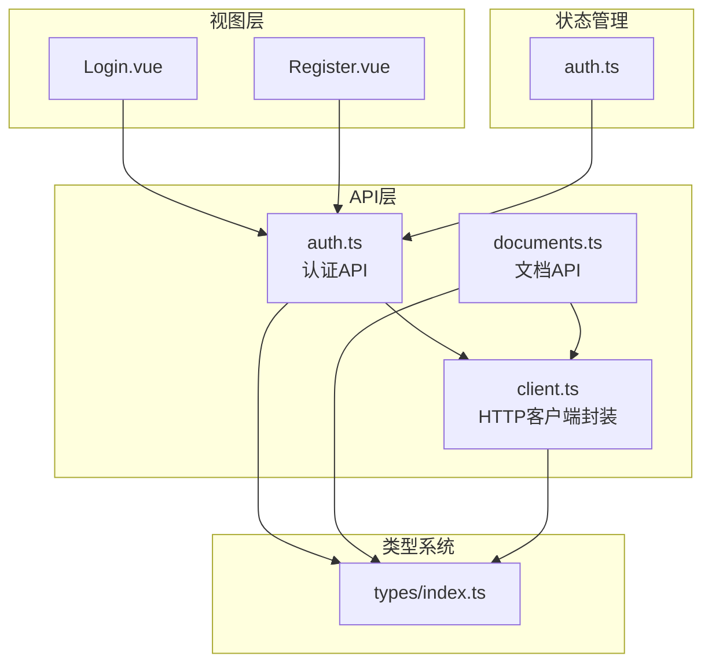
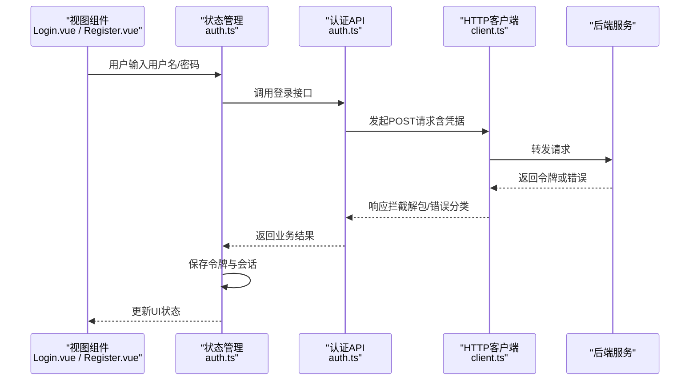
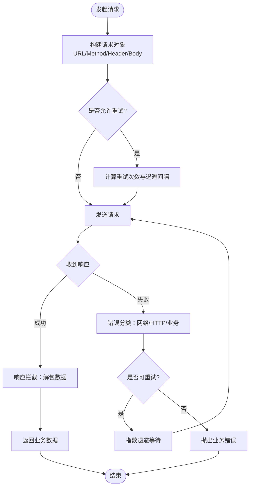
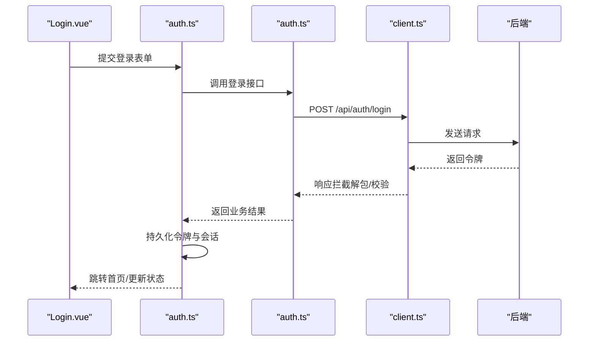
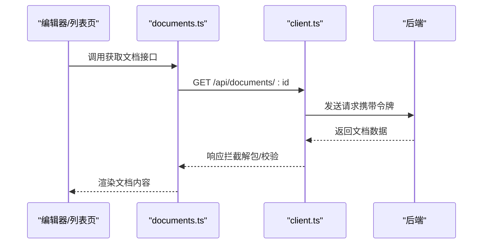
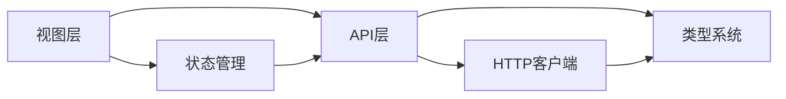

# API集成

<cite>
**本文引用的文件**
- [src/api/client.ts](file://src/api/client.ts)
- [src/api/auth.ts](file://src/api/auth.ts)
- [src/api/documents.ts](file://src/api/documents.ts)
- [src/types/index.ts](file://src/types/index.ts)
- [src/stores/auth.ts](file://src/stores/auth.ts)
- [src/views/Login.vue](file://src/views/Login.vue)
- [src/views/Register.vue](file://src/views/Register.vue)
</cite>

## 目录
1. [简介](#简介)
2. [项目结构](#项目结构)
3. [核心组件](#核心组件)
4. [架构总览](#架构总览)
5. [详细组件分析](#详细组件分析)
6. [依赖分析](#依赖分析)
7. [性能考虑](#性能考虑)
8. [故障排查指南](#故障排查指南)
9. [结论](#结论)
10. [附录](#附录)

## 简介
本文件面向前端工程中的HTTP客户端封装与API调用规范，重点说明：
- HTTP客户端的封装设计与拦截器配置（请求/响应拦截、错误处理、重试策略）
- 认证API与文档API的接口定义、请求参数、响应格式
- 最佳实践、性能优化建议与调试方法
- 如何扩展新的API端点并处理复杂数据转换

该文档旨在帮助开发者快速理解并安全高效地集成后端服务。

## 项目结构
本项目采用按功能域组织的前端结构，API相关代码集中在 src/api 目录下：
- client.ts：统一的HTTP客户端封装，提供请求/响应拦截、错误处理、重试等能力
- auth.ts：认证相关API（登录、注册、令牌刷新等）
- documents.ts：文档相关API（创建、更新、获取、删除等）
- types/index.ts：全局类型定义，供API层与UI层共享
- stores/auth.ts：认证状态管理，持有令牌与会话信息
- views/Login.vue、views/Register.vue：登录/注册页面，调用认证API

**图示来源**
- [src/api/client.ts](file://src/api/client.ts)
- [src/api/auth.ts](file://src/api/auth.ts)
- [src/api/documents.ts](file://src/api/documents.ts)
- [src/types/index.ts](file://src/types/index.ts)
- [src/stores/auth.ts](file://src/stores/auth.ts)
- [src/views/Login.vue](file://src/views/Login.vue)
- [src/views/Register.vue](file://src/views/Register.vue)

**章节来源**
- [src/api/client.ts](file://src/api/client.ts)
- [src/api/auth.ts](file://src/api/auth.ts)
- [src/api/documents.ts](file://src/api/documents.ts)
- [src/types/index.ts](file://src/types/index.ts)
- [src/stores/auth.ts](file://src/stores/auth.ts)
- [src/views/Login.vue](file://src/views/Login.vue)
- [src/views/Register.vue](file://src/views/Register.vue)

## 核心组件
- HTTP客户端封装（client.ts）
  - 职责：统一发起HTTP请求、集中处理请求头（如鉴权）、响应拦截（数据解包、错误分类）、重试策略、超时控制、取消请求等
  - 关键能力：
    - 请求拦截：自动附加令牌、设置Content-Type、追踪ID
    - 响应拦截：统一解包业务数据、处理网络/业务错误、记录日志
    - 重试机制：针对特定错误码或网络异常进行指数退避重试
    - 超时与取消：可配置的请求超时与AbortController支持
    - 错误分类：区分网络错误、服务端错误、业务校验错误
- 认证API（auth.ts）
  - 职责：封装登录、注册、令牌刷新、登出等接口
  - 典型流程：提交凭证 -> 服务端返回令牌 -> 客户端存储令牌 -> 后续请求携带令牌
- 文档API（documents.ts）
  - 职责：封装文档CRUD操作、版本管理、搜索等接口
  - 典型流程：携带令牌 -> 发送文档数据 -> 服务端返回结构化结果

**章节来源**
- [src/api/client.ts](file://src/api/client.ts)
- [src/api/auth.ts](file://src/api/auth.ts)
- [src/api/documents.ts](file://src/api/documents.ts)

## 架构总览
下图展示了从视图到API再到后端的完整调用链路，以及客户端拦截器在其中的作用位置。

**图示来源**
- [src/views/Login.vue](file://src/views/Login.vue)
- [src/views/Register.vue](file://src/views/Register.vue)
- [src/stores/auth.ts](file://src/stores/auth.ts)
- [src/api/auth.ts](file://src/api/auth.ts)
- [src/api/client.ts](file://src/api/client.ts)

## 详细组件分析

### HTTP客户端封装（client.ts）
- 设计要点
  - 单例模式：确保全局一致的请求配置与拦截器行为
  - 拦截器链：请求拦截 -> 发送 -> 响应拦截 -> 业务处理
  - 错误处理：网络错误、HTTP状态码错误、业务错误分类处理
  - 重试策略：对幂等请求或特定错误码进行指数退避重试，避免雪崩
  - 可观测性：请求ID、耗时、失败原因等日志埋点
- 关键流程（以带重试的请求为例）

**图示来源**
- [src/api/client.ts](file://src/api/client.ts)

**章节来源**
- [src/api/client.ts](file://src/api/client.ts)

### 认证API（auth.ts）
- 接口定义（示例字段，具体以实际实现为准）
  - 登录
    - 路径：/api/auth/login
    - 方法：POST
    - 请求体：用户名、密码
    - 响应：访问令牌、刷新令牌、过期时间、用户基本信息
  - 注册
    - 路径：/api/auth/register
    - 方法：POST
    - 请求体：用户名、邮箱、密码、确认密码
    - 响应：注册结果、提示信息
  - 刷新令牌
    - 路径：/api/auth/token/refresh
    - 方法：POST
    - 请求体：刷新令牌
    - 响应：新访问令牌、过期时间
  - 登出
    - 路径：/api/auth/logout
    - 方法：POST
    - 请求体：无或令牌
    - 响应：登出结果
- 调用流程（登录）

**图示来源**
- [src/views/Login.vue](file://src/views/Login.vue)
- [src/stores/auth.ts](file://src/stores/auth.ts)
- [src/api/auth.ts](file://src/api/auth.ts)
- [src/api/client.ts](file://src/api/client.ts)

**章节来源**
- [src/api/auth.ts](file://src/api/auth.ts)
- [src/stores/auth.ts](file://src/stores/auth.ts)
- [src/views/Login.vue](file://src/views/Login.vue)

### 文档API（documents.ts）
- 接口定义（示例字段，具体以实际实现为准）
  - 创建文档
    - 路径：/api/documents
    - 方法：POST
    - 请求体：标题、内容、标签、可见性
    - 响应：文档ID、创建时间、版本
  - 更新文档
    - 路径：/api/documents/:id
    - 方法：PUT/PATCH
    - 请求体：待更新字段
    - 响应：更新后的文档信息
  - 获取文档
    - 路径：/api/documents/:id
    - 方法：GET
    - 响应：文档详情、版本历史
  - 删除文档
    - 路径：/api/documents/:id
    - 方法：DELETE
    - 响应：删除结果
- 调用流程（获取文档）

**图示来源**
- [src/api/documents.ts](file://src/api/documents.ts)
- [src/api/client.ts](file://src/api/client.ts)

**章节来源**
- [src/api/documents.ts](file://src/api/documents.ts)

### 类型系统与数据转换（types/index.ts）
- 职责
  - 定义API请求/响应的数据结构，保证前后端契约一致
  - 为UI组件与状态管理提供强类型约束
- 常见类型
  - 认证：登录请求体、响应体；注册请求体、响应体；令牌对象
  - 文档：文档实体、列表项、分页信息、版本历史
- 数据转换
  - 将服务端返回的数据转换为前端友好结构（例如日期格式化、枚举映射）
  - 在响应拦截器中集中处理通用转换，减少重复逻辑

**章节来源**
- [src/types/index.ts](file://src/types/index.ts)

## 依赖分析
- 模块耦合关系
  - 视图层依赖状态管理与API层
  - 状态管理依赖API层与类型系统
  - API层依赖HTTP客户端与类型系统
  - HTTP客户端依赖类型系统用于请求/响应建模
- 外部依赖
  - 浏览器Fetch或Axios（由client.ts内部使用）
  - 后端RESTful服务

**图示来源**
- [src/api/client.ts](file://src/api/client.ts)
- [src/api/auth.ts](file://src/api/auth.ts)
- [src/api/documents.ts](file://src/api/documents.ts)
- [src/types/index.ts](file://src/types/index.ts)
- [src/stores/auth.ts](file://src/stores/auth.ts)
- [src/views/Login.vue](file://src/views/Login.vue)
- [src/views/Register.vue](file://src/views/Register.vue)

**章节来源**
- [src/api/client.ts](file://src/api/client.ts)
- [src/api/auth.ts](file://src/api/auth.ts)
- [src/api/documents.ts](file://src/api/documents.ts)
- [src/types/index.ts](file://src/types/index.ts)
- [src/stores/auth.ts](file://src/stores/auth.ts)
- [src/views/Login.vue](file://src/views/Login.vue)
- [src/views/Register.vue](file://src/views/Register.vue)

## 性能考虑
- 请求合并与去重
  - 对相同参数的并发请求进行合并，减少重复网络开销
- 缓存策略
  - 对读多写少的接口（如文档详情）实施短期缓存，结合版本号失效
- 分页与懒加载
  - 列表接口默认分页，按需加载更多数据
- 传输优化
  - 启用Gzip/Brotli压缩（服务端），前端合理设置Accept-Encoding
  - 仅请求必要字段，减少Payload大小
- 重试与退避
  - 对幂等请求启用指数退避重试，避免瞬时抖动导致雪崩
- 资源释放
  - 组件卸载时取消未完成的请求，防止内存泄漏

[本节为通用指导，不直接分析具体文件]

## 故障排查指南
- 常见问题定位
  - 网络错误：检查代理、跨域、DNS解析
  - 令牌过期：触发刷新令牌流程，失败则引导重新登录
  - 业务校验错误：根据错误码提示用户修正输入
  - 服务端错误：记录请求ID与堆栈，便于后端联调
- 调试方法
  - 开启请求日志：打印URL、Method、Header、Body、耗时、状态码
  - 断点调试：在响应拦截器处打断点，观察解包前后数据
  - 模拟错误：通过Mock或本地服务返回特定错误码验证重试与降级逻辑
- 错误分类与处理
  - 网络错误：提示“网络连接失败”，支持重试
  - HTTP错误：根据状态码展示不同提示（401引导登录、403权限不足、5xx服务端错误）
  - 业务错误：展示具体错误信息与修复建议

**章节来源**
- [src/api/client.ts](file://src/api/client.ts)
- [src/api/auth.ts](file://src/api/auth.ts)
- [src/api/documents.ts](file://src/api/documents.ts)

## 结论
本集成方案通过统一的HTTP客户端封装，实现了请求/响应拦截、错误分类、重试与可观测性，配合类型系统与状态管理，确保了认证与文档API的稳定调用。遵循本文的最佳实践与性能建议，可有效提升用户体验与系统健壮性。

[本节为总结性内容，不直接分析具体文件]

## 附录

### 认证API参考
- 登录
  - 路径：/api/auth/login
  - 方法：POST
  - 请求体：用户名、密码
  - 响应：访问令牌、刷新令牌、过期时间、用户信息
- 注册
  - 路径：/api/auth/register
  - 方法：POST
  - 请求体：用户名、邮箱、密码、确认密码
  - 响应：注册结果、提示信息
- 刷新令牌
  - 路径：/api/auth/token/refresh
  - 方法：POST
  - 请求体：刷新令牌
  - 响应：新访问令牌、过期时间
- 登出
  - 路径：/api/auth/logout
  - 方法：POST
  - 请求体：无或令牌
  - 响应：登出结果

**章节来源**
- [src/api/auth.ts](file://src/api/auth.ts)
- [src/stores/auth.ts](file://src/stores/auth.ts)
- [src/views/Login.vue](file://src/views/Login.vue)
- [src/views/Register.vue](file://src/views/Register.vue)

### 文档API参考
- 创建文档
  - 路径：/api/documents
  - 方法：POST
  - 请求体：标题、内容、标签、可见性
  - 响应：文档ID、创建时间、版本
- 更新文档
  - 路径：/api/documents/:id
  - 方法：PUT/PATCH
  - 请求体：待更新字段
  - 响应：更新后的文档信息
- 获取文档
  - 路径：/api/documents/:id
  - 方法：GET
  - 响应：文档详情、版本历史
- 删除文档
  - 路径：/api/documents/:id
  - 方法：DELETE
  - 响应：删除结果

**章节来源**
- [src/api/documents.ts](file://src/api/documents.ts)

### 扩展新API端点的步骤
- 定义类型：在类型系统中新增请求/响应结构
- 封装接口：在对应API文件中新增函数，复用HTTP客户端
- 添加拦截器逻辑：如需特殊处理，可在请求/响应拦截器中扩展
- 集成状态管理：在状态管理中调用新接口并维护状态
- 编写测试：覆盖正常与异常分支，验证重试与错误处理

**章节来源**
- [src/types/index.ts](file://src/types/index.ts)
- [src/api/client.ts](file://src/api/client.ts)
- [src/api/auth.ts](file://src/api/auth.ts)
- [src/api/documents.ts](file://src/api/documents.ts)
- [src/stores/auth.ts](file://src/stores/auth.ts)