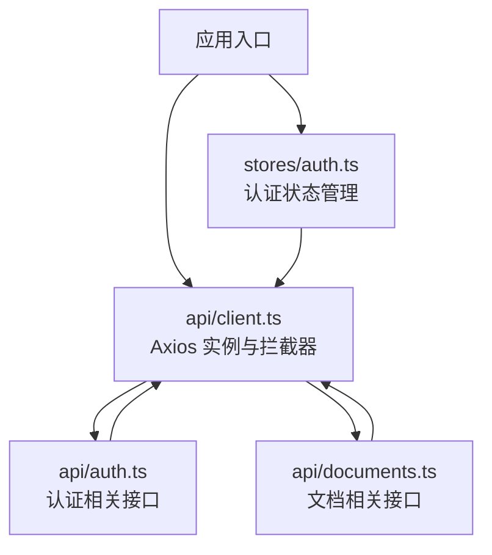
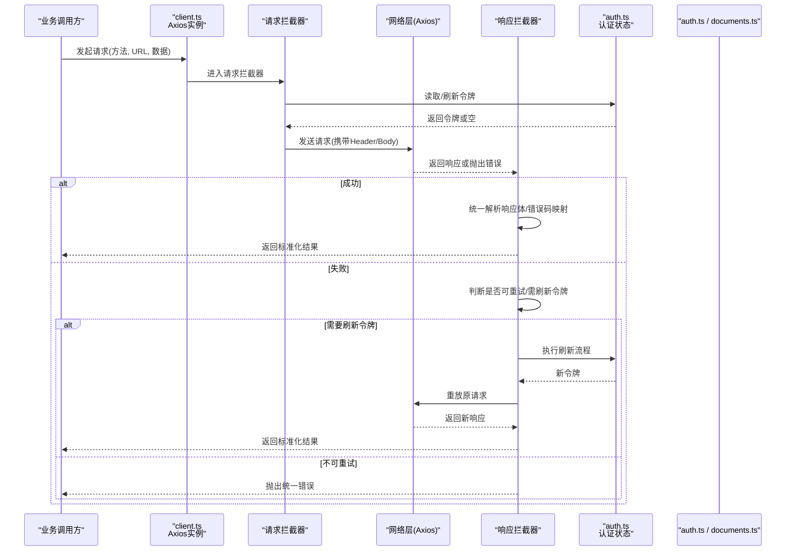
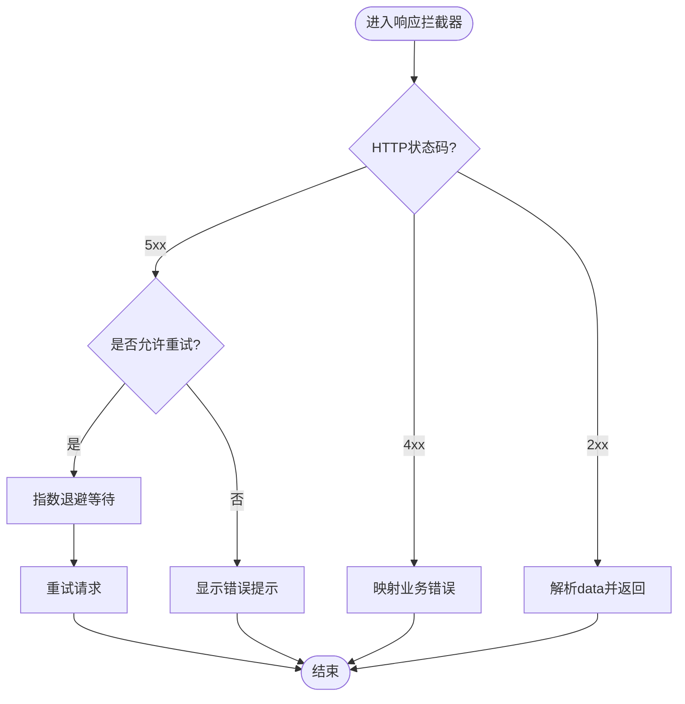
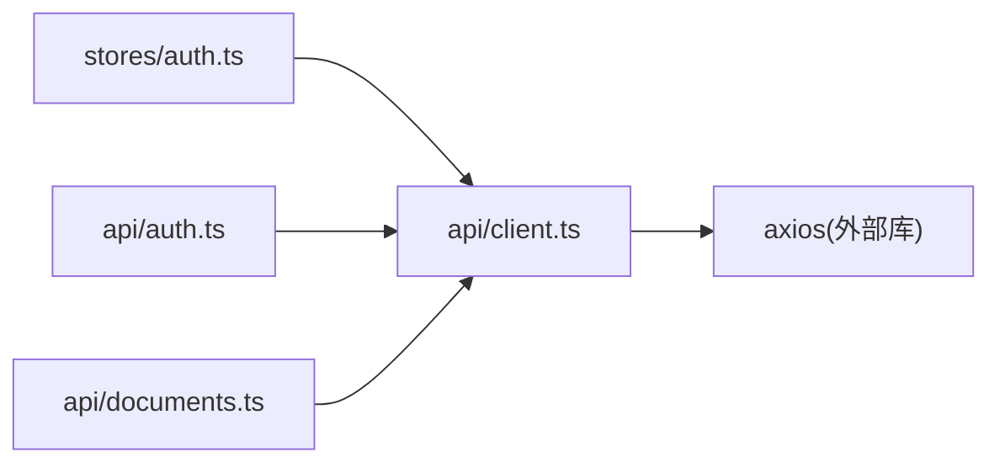

# HTTP客户端封装

<cite>
**本文引用的文件**
- [src/api/client.ts](file://src/api/client.ts)
- [src/api/auth.ts](file://src/api/auth.ts)
- [src/api/documents.ts](file://src/api/documents.ts)
- [src/stores/auth.ts](file://src/stores/auth.ts)
- [package.json](file://package.json)
</cite>

## 目录
1. [简介](#简介)
2. [项目结构](#项目结构)
3. [核心组件](#核心组件)
4. [架构总览](#架构总览)
5. [详细组件分析](#详细组件分析)
6. [依赖关系分析](#依赖关系分析)
7. [性能考虑](#性能考虑)
8. [故障排查指南](#故障排查指南)
9. [结论](#结论)
10. [附录](#附录)

## 简介
本文件面向基于 Axios 的 HTTP 客户端封装，围绕请求/响应拦截器、错误处理、重试策略、超时与取消、统一响应格式、认证令牌管理、性能优化与调试等主题进行系统化说明。文档以仓库中的实际实现为依据，提供可操作的实践建议与扩展方法，帮助读者在现有基础上快速构建稳定、可维护的前端网络层。

## 项目结构
本项目采用按功能域组织的方式：
- api 目录：HTTP 客户端实例、API 模块（认证、文档等）
- stores 目录：状态管理（如认证状态）
- utils 目录：通用工具函数
- views/components/router 等：页面与组件

图表来源
- [src/api/client.ts](file://src/api/client.ts)
- [src/api/auth.ts](file://src/api/auth.ts)
- [src/api/documents.ts](file://src/api/documents.ts)
- [src/stores/auth.ts](file://src/stores/auth.ts)

章节来源
- [src/api/client.ts](file://src/api/client.ts)
- [src/api/auth.ts](file://src/api/auth.ts)
- [src/api/documents.ts](file://src/api/documents.ts)
- [src/stores/auth.ts](file://src/stores/auth.ts)

## 核心组件
- Axios 实例与全局配置：集中管理 baseURL、超时、请求头、响应类型等
- 请求拦截器：注入认证令牌、统一请求日志、防抖/节流开关、请求取消支持
- 响应拦截器：统一解析响应体、错误码映射、业务异常捕获、自动重试触发点
- API 模块：按领域划分接口调用，保持单一职责
- 认证状态：集中管理 token 获取与刷新，配合拦截器完成鉴权

章节来源
- [src/api/client.ts](file://src/api/client.ts)
- [src/api/auth.ts](file://src/api/auth.ts)
- [src/api/documents.ts](file://src/api/documents.ts)
- [src/stores/auth.ts](file://src/stores/auth.ts)

## 架构总览
下图展示从调用到响应的完整链路，包括拦截器、错误处理与重试的关键节点。

图表来源
- [src/api/client.ts](file://src/api/client.ts)
- [src/api/auth.ts](file://src/api/auth.ts)
- [src/api/documents.ts](file://src/api/documents.ts)
- [src/stores/auth.ts](file://src/stores/auth.ts)

## 详细组件分析

### Axios 实例与全局配置
- 目标：统一 baseURL、超时、Content-Type、Accept 等基础设置，减少重复配置
- 关键点：
  - 通过环境变量注入 baseURL，便于多环境切换
  - 设置默认超时时间，避免长请求挂起
  - 统一响应类型（如 JSON），简化后续处理
  - 为后续拦截器预留扩展点（如日志、埋点）

章节来源
- [src/api/client.ts](file://src/api/client.ts)

### 请求拦截器
- 目标：在请求发出前注入必要信息并做前置校验
- 关键点：
  - 认证令牌注入：从认证状态中读取 token，写入 Authorization 头
  - 请求去重/缓存：对相同请求进行合并或缓存命中（可选）
  - 请求日志：记录方法、URL、耗时等关键信息（开发环境）
  - 取消支持：为每个请求生成唯一标识，便于后续取消

章节来源
- [src/api/client.ts](file://src/api/client.ts)
- [src/stores/auth.ts](file://src/stores/auth.ts)

### 响应拦截器
- 目标：统一解析后端响应、错误码映射、异常捕获与重试
- 关键点：
  - 成功分支：提取 data，包装为标准返回结构
  - 失败分支：区分网络错误、HTTP 状态码、业务错误码
  - 错误码映射：将不同后端错误码映射为前端统一错误对象
  - 重试策略：针对幂等 GET 或特定错误码进行有限次重试
  - 令牌过期：触发刷新流程并重放请求

章节来源
- [src/api/client.ts](file://src/api/client.ts)

### 认证令牌管理
- 目标：集中管理 token 的获取、刷新与失效处理
- 关键点：
  - 登录成功后持久化 token，并在请求拦截器中注入
  - 刷新令牌时避免并发重复刷新，使用队列或锁机制
  - 刷新失败时清理本地状态并引导重新登录
  - 与响应拦截器联动，在 401 场景下自动刷新并重试

章节来源
- [src/stores/auth.ts](file://src/stores/auth.ts)
- [src/api/auth.ts](file://src/api/auth.ts)

### API 模块设计
- 目标：按领域拆分接口，保持高内聚低耦合
- 关键点：
  - auth.ts：登录、注册、刷新令牌等
  - documents.ts：文档 CRUD、搜索、导出等
  - 所有调用均通过统一的 client.ts 发起，保证一致的错误处理与重试策略

章节来源
- [src/api/auth.ts](file://src/api/auth.ts)
- [src/api/documents.ts](file://src/api/documents.ts)

### 错误处理与重试策略
- 目标：统一错误呈现与恢复能力
- 关键点：
  - 网络错误：提示网络异常，支持指数退避重试
  - HTTP 错误：根据状态码分类处理（4xx 用户侧，5xx 服务端）
  - 业务错误：依据后端错误码映射为前端友好提示
  - 重试边界：仅对幂等方法或特定错误码启用重试，避免副作用
  - 最大重试次数与间隔：防止雪崩，结合用户操作取消

图表来源
- [src/api/client.ts](file://src/api/client.ts)

章节来源
- [src/api/client.ts](file://src/api/client.ts)

### 超时与请求取消
- 目标：提升用户体验与资源利用率
- 关键点：
  - 设置合理超时时间，避免长时间阻塞
  - 为每次请求分配唯一 ID，必要时可取消
  - 路由切换或页面卸载时主动取消未完成的请求
  - 与重试策略配合，避免频繁取消导致抖动

章节来源
- [src/api/client.ts](file://src/api/client.ts)

### 自定义请求配置与中间件扩展
- 目标：在不侵入核心逻辑的前提下扩展能力
- 关键点：
  - 通过 Axios 适配器模式扩展：新增请求/响应处理器
  - 中间件栈：按顺序执行日志、缓存、权限校验、埋点等
  - 局部覆盖：在调用处传入 config 覆盖默认行为
  - 插件化：将常用能力封装为可插拔模块

章节来源
- [src/api/client.ts](file://src/api/client.ts)

## 依赖关系分析
- 外部依赖：Axios 作为 HTTP 客户端库
- 内部依赖：
  - api/client.ts 被各 API 模块复用
  - stores/auth.ts 为拦截器提供认证上下文
  - api/auth.ts、api/documents.ts 消费 client.ts

图表来源
- [src/api/client.ts](file://src/api/client.ts)
- [src/api/auth.ts](file://src/api/auth.ts)
- [src/api/documents.ts](file://src/api/documents.ts)
- [src/stores/auth.ts](file://src/stores/auth.ts)

章节来源
- [package.json](file://package.json)
- [src/api/client.ts](file://src/api/client.ts)

## 性能考虑
- 连接与并发
  - 合理设置并发上限，避免浏览器连接数耗尽
  - 使用请求去重减少重复网络开销
- 缓存策略
  - 对 GET 请求实施内存缓存，结合版本号或参数签名控制失效
  - 对热点数据使用短 TTL 缓存，降低后端压力
- 传输优化
  - 启用 gzip/压缩（由服务器或代理层处理）
  - 按需加载大资源，避免首屏阻塞
- 监控与调试
  - 开发环境开启详细日志，生产环境关闭或采样
  - 统计成功率、P95/P99 延迟、错误分布

[本节为通用指导，不直接分析具体文件]

## 故障排查指南
- 常见问题定位
  - 401 未授权：检查 token 是否存在、是否过期；确认刷新流程是否触发
  - 跨域问题：核对 CORS 配置与请求头
  - 超时频繁：检查后端响应时间与前端超时阈值
  - 重复请求：检查去重逻辑与缓存键生成
- 调试技巧
  - 在请求拦截器打印入参与 Header
  - 在响应拦截器打印状态码与响应体摘要
  - 使用浏览器 Network 面板过滤与排序
  - 对关键路径添加埋点，统计耗时与错误率

章节来源
- [src/api/client.ts](file://src/api/client.ts)
- [src/stores/auth.ts](file://src/stores/auth.ts)

## 结论
通过对 Axios 实例、拦截器、错误处理、重试与取消的统一封装，本项目实现了稳定、可观测且易扩展的 HTTP 客户端。在此基础上，可按需引入缓存、限流、埋点等能力，持续优化性能与可维护性。

[本节为总结性内容，不直接分析具体文件]

## 附录
- 最佳实践清单
  - 统一 baseURL 与超时配置，避免散落各处
  - 所有错误走统一映射与提示，保持一致体验
  - 仅在幂等方法上启用重试，避免副作用
  - 使用请求取消释放资源，提升交互流畅度
  - 将认证逻辑与网络层解耦，便于替换与测试
- 扩展建议
  - 新增中间件：日志、缓存、权限、埋点等
  - 新增 HTTP 方法：封装 PUT/DELETE 等语义化方法
  - 多租户/多环境：通过配置中心动态下发 baseURL 与特性开关

[本节为补充性内容，不直接分析具体文件]