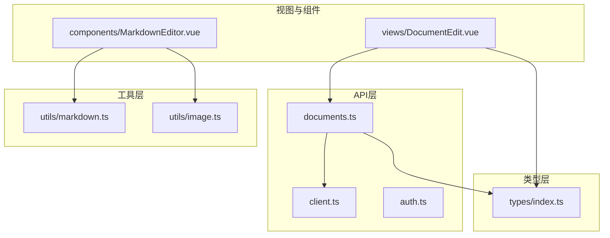
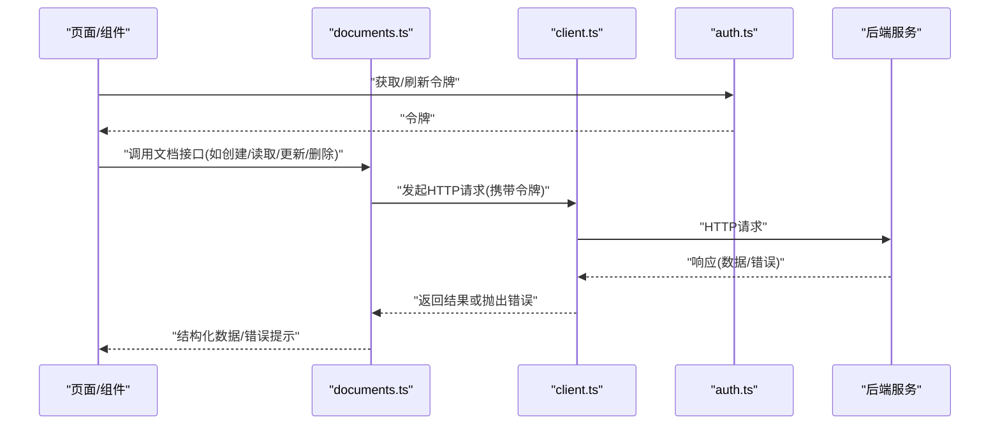
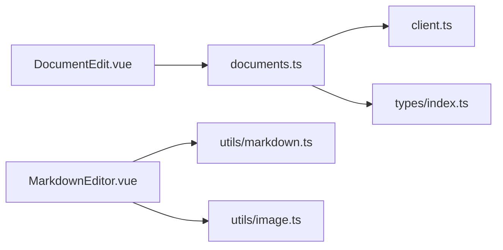

# 文档API接口

<cite>
**本文引用的文件**
- [src/api/documents.ts](file://src/api/documents.ts)
- [src/api/client.ts](file://src/api/client.ts)
- [src/api/auth.ts](file://src/api/auth.ts)
- [src/types/index.ts](file://src/types/index.ts)
- [src/views/DocumentEdit.vue](file://src/views/DocumentEdit.vue)
- [src/components/MarkdownEditor.vue](file://src/components/MarkdownEditor.vue)
- [src/utils/markdown.ts](file://src/utils/markdown.ts)
- [src/utils/image.ts](file://src/utils/image.ts)
- [src/router/index.ts](file://src/router/index.ts)
</cite>

## 目录
1. [简介](#简介)
2. [项目结构](#项目结构)
3. [核心组件](#核心组件)
4. [架构总览](#架构总览)
5. [详细组件分析](#详细组件分析)
6. [依赖分析](#依赖分析)
7. [性能考虑](#性能考虑)
8. [故障排查指南](#故障排查指南)
9. [结论](#结论)
10. [附录](#附录)

## 简介
本文件面向前端工程中的“文档管理”能力，聚焦于文档CRUD（创建、读取、更新、删除）、列表查询、版本控制、文件上传下载、批量操作、搜索过滤、错误处理以及实时同步与离线支持等主题。文档基于当前前端仓库的API封装层、类型定义、视图与工具模块进行梳理，帮助读者理解如何调用与集成文档相关接口，并给出最佳实践建议。

## 项目结构
该前端工程采用按功能域组织的方式：
- API层：统一封装HTTP请求、鉴权与错误处理，提供文档、认证等接口方法。
- 类型层：集中定义文档、用户、分页等数据结构。
- 视图与组件：页面路由、编辑器、侧边栏等UI交互。
- 工具层：Markdown解析、图片处理、导出等通用能力。

图表来源
- [src/api/documents.ts:1-200](file://src/api/documents.ts#L1-L200)
- [src/api/client.ts:1-200](file://src/api/client.ts#L1-L200)
- [src/api/auth.ts:1-200](file://src/api/auth.ts#L1-L200)
- [src/types/index.ts:1-200](file://src/types/index.ts#L1-L200)
- [src/views/DocumentEdit.vue:1-200](file://src/views/DocumentEdit.vue#L1-L200)
- [src/components/MarkdownEditor.vue:1-200](file://src/components/MarkdownEditor.vue#L1-L200)
- [src/utils/markdown.ts:1-200](file://src/utils/markdown.ts#L1-L200)
- [src/utils/image.ts:1-200](file://src/utils/image.ts#L1-L200)

章节来源
- [src/api/documents.ts:1-200](file://src/api/documents.ts#L1-L200)
- [src/api/client.ts:1-200](file://src/api/client.ts#L1-L200)
- [src/types/index.ts:1-200](file://src/types/index.ts#L1-L200)

## 核心组件
- 文档API封装：提供文档的增删改查、列表、版本、附件等能力，内部复用统一的HTTP客户端与错误处理。
- HTTP客户端：负责基础URL、请求头（含鉴权）、超时、重试、拦截器（成功/失败）等。
- 类型定义：文档实体、元数据、分页、搜索结果、版本信息等。
- 编辑器与视图：文档编辑页、Markdown渲染、图片插入与上传、导出等。

章节来源
- [src/api/documents.ts:1-200](file://src/api/documents.ts#L1-L200)
- [src/api/client.ts:1-200](file://src/api/client.ts#L1-L200)
- [src/types/index.ts:1-200](file://src/types/index.ts#L1-L200)
- [src/views/DocumentEdit.vue:1-200](file://src/views/DocumentEdit.vue#L1-L200)
- [src/components/MarkdownEditor.vue:1-200](file://src/components/MarkdownEditor.vue#L1-L200)

## 架构总览
下图展示了从页面到API层的调用关系，包括鉴权、文档CRUD、版本与附件等关键路径。

图表来源
- [src/api/documents.ts:1-200](file://src/api/documents.ts#L1-L200)
- [src/api/client.ts:1-200](file://src/api/client.ts#L1-L200)
- [src/api/auth.ts:1-200](file://src/api/auth.ts#L1-L200)

## 详细组件分析

### 文档CRUD与列表查询
- 创建文档
  - URL模式：POST /api/documents
  - 请求体：包含标题、内容、标签、分类、可见性等元数据字段；可选附加信息（如封面图、摘要）。
  - 响应：返回新建文档ID、时间戳、初始版本等信息。
  - 说明：若标题重复或存在命名冲突，应返回冲突错误码；权限不足时返回未授权。
- 读取文档
  - URL模式：GET /api/documents/{id}
  - 路径参数：文档ID。
  - 响应：文档完整内容与元数据。
  - 说明：支持按版本读取（见“版本控制”）。
- 更新文档
  - URL模式：PUT /api/documents/{id}
  - 请求体：可更新的元数据与内容片段或全文覆盖。
  - 响应：返回更新后的文档与版本号。
  - 说明：并发更新需使用乐观锁或版本号校验。
- 删除文档
  - URL模式：DELETE /api/documents/{id}
  - 路径参数：文档ID。
  - 响应：确认删除状态。
  - 说明：软删除与硬删除策略由后端决定，前端根据返回状态提示。
- 列表查询
  - URL模式：GET /api/documents
  - 查询参数：page、pageSize、keyword、tag、category、sort、order等。
  - 响应：分页对象，包含items数组与分页元信息。
  - 说明：支持关键词搜索、标签筛选、排序与分页。

章节来源
- [src/api/documents.ts:1-200](file://src/api/documents.ts#L1-L200)
- [src/types/index.ts:1-200](file://src/types/index.ts#L1-L200)

### 版本控制
- 列出版本
  - URL模式：GET /api/documents/{id}/versions
  - 响应：版本列表（版本号、创建时间、变更摘要等）。
- 切换/回滚版本
  - URL模式：POST /api/documents/{id}/versions/{version}/rollback
  - 请求体：可选备注。
  - 响应：新版本信息与差异摘要。
- 对比版本
  - URL模式：GET /api/documents/{id}/versions/{v1}/diff/{v2}
  - 响应：差异内容（行级或块级）。

章节来源
- [src/api/documents.ts:1-200](file://src/api/documents.ts#L1-L200)
- [src/types/index.ts:1-200](file://src/types/index.ts#L1-L200)

### 文件上传与下载
- 上传附件
  - URL模式：POST /api/documents/{id}/attachments
  - 请求：multipart/form-data，字段包含file、描述、是否公开等。
  - 响应：附件ID、访问URL、大小、MIME类型。
- 下载附件
  - URL模式：GET /api/documents/{id}/attachments/{attachmentId}
  - 响应：二进制流或下载链接。
- 删除附件
  - URL模式：DELETE /api/documents/{id}/attachments/{attachmentId}
  - 响应：确认删除。

章节来源
- [src/api/documents.ts:1-200](file://src/api/documents.ts#L1-L200)
- [src/utils/image.ts:1-200](file://src/utils/image.ts#L1-L200)

### 批量操作
- 批量移动/复制
  - URL模式：POST /api/documents/batch/move | POST /api/documents/batch/copy
  - 请求体：{ documentIds, targetFolder }。
  - 响应：操作结果统计。
- 批量删除
  - URL模式：POST /api/documents/batch/delete
  - 请求体：{ documentIds }。
  - 响应：成功/失败计数。
- 批量打标签
  - URL模式：POST /api/documents/batch/tag
  - 请求体：{ documentIds, tags }。
  - 响应：更新统计。

章节来源
- [src/api/documents.ts:1-200](file://src/api/documents.ts#L1-L200)

### 搜索与过滤
- 全文搜索
  - URL模式：GET /api/documents/search
  - 查询参数：q、scope、tags、dateRange、sort等。
  - 响应：搜索结果列表与高亮片段。
- 高级过滤
  - 支持按标签、分类、作者、更新时间范围、可见性等多维过滤组合。

章节来源
- [src/api/documents.ts:1-200](file://src/api/documents.ts#L1-L200)
- [src/types/index.ts:1-200](file://src/types/index.ts#L1-L200)

### 编辑器与内容格式
- Markdown内容
  - 编辑器组件负责输入与预览，工具模块负责解析与转换。
  - 内容保存时以Markdown文本提交，服务端存储并生成HTML用于展示。
- 图片处理
  - 支持本地压缩、转存至服务器、生成缩略图等。
  - 上传后替换为远程URL，确保跨设备一致显示。

章节来源
- [src/components/MarkdownEditor.vue:1-200](file://src/components/MarkdownEditor.vue#L1-L200)
- [src/utils/markdown.ts:1-200](file://src/utils/markdown.ts#L1-L200)
- [src/utils/image.ts:1-200](file://src/utils/image.ts#L1-L200)

### 鉴权与会话
- 登录/注册/登出
  - 通过认证API获取令牌，并在后续请求中携带。
- 令牌管理
  - 在请求拦截器中自动注入Authorization头，必要时刷新令牌。

章节来源
- [src/api/auth.ts:1-200](file://src/api/auth.ts#L1-L200)
- [src/api/client.ts:1-200](file://src/api/client.ts#L1-L200)

## 依赖分析
- documents.ts 依赖 client.ts 提供的HTTP能力与错误处理。
- 视图与组件依赖 types/index.ts 的类型约束，保证前后端数据结构一致。
- 编辑器与工具模块解耦内容处理逻辑，便于扩展与测试。

图表来源
- [src/api/documents.ts:1-200](file://src/api/documents.ts#L1-L200)
- [src/api/client.ts:1-200](file://src/api/client.ts#L1-L200)
- [src/types/index.ts:1-200](file://src/types/index.ts#L1-L200)
- [src/views/DocumentEdit.vue:1-200](file://src/views/DocumentEdit.vue#L1-L200)
- [src/components/MarkdownEditor.vue:1-200](file://src/components/MarkdownEditor.vue#L1-L200)
- [src/utils/markdown.ts:1-200](file://src/utils/markdown.ts#L1-L200)
- [src/utils/image.ts:1-200](file://src/utils/image.ts#L1-L200)

章节来源
- [src/api/documents.ts:1-200](file://src/api/documents.ts#L1-L200)
- [src/api/client.ts:1-200](file://src/api/client.ts#L1-L200)
- [src/types/index.ts:1-200](file://src/types/index.ts#L1-L200)

## 性能考虑
- 分页与懒加载：列表与搜索结果默认分页，按需加载下一页。
- 增量更新：利用版本号实现乐观锁，减少全量覆盖带来的冲突。
- 缓存策略：对只读文档与静态资源启用浏览器缓存与服务端ETag。
- 大文件上传：分片上传、断点续传、进度反馈。
- 图片优化：上传前压缩、CDN加速、懒加载。
- 请求合并与去抖：搜索输入防抖，避免频繁请求。

[本节为通用指导，不直接分析具体文件]

## 故障排查指南
- 文件冲突
  - 现象：更新文档时报版本冲突。
  - 处理：拉取最新版本，合并差异后再次提交；必要时提供“强制覆盖”选项。
- 权限验证失败
  - 现象：401/403。
  - 处理：检查令牌有效性、刷新令牌；确认用户角色与资源权限。
- 数据验证错误
  - 现象：422或自定义错误码。
  - 处理：根据错误字段提示修正表单；记录错误日志以便定位。
- 网络异常
  - 现象：超时、重连失败。
  - 处理：指数退避重试、降级为离线草稿；提示用户网络状态。

章节来源
- [src/api/client.ts:1-200](file://src/api/client.ts#L1-L200)
- [src/api/documents.ts:1-200](file://src/api/documents.ts#L1-L200)

## 结论
本文档基于前端代码库梳理了文档管理的API能力与集成方式，涵盖CRUD、版本控制、附件、批量操作、搜索过滤、错误处理与性能优化等关键点。结合编辑器与工具模块，可实现完整的文档创作、协作与发布流程。建议在后续迭代中完善离线同步与实时协作能力，提升用户体验。

[本节为总结性内容，不直接分析具体文件]

## 附录

### API调用示例（步骤式）
- 创建文档
  - 步骤：准备元数据与内容 -> 调用创建接口 -> 处理返回的文档ID与版本 -> 进入编辑页。
  - 参考：[src/api/documents.ts:1-200](file://src/api/documents.ts#L1-L200)
- 读取文档
  - 步骤：传入文档ID -> 调用读取接口 -> 渲染Markdown内容。
  - 参考：[src/views/DocumentEdit.vue:1-200](file://src/views/DocumentEdit.vue#L1-L200)
- 更新文档
  - 步骤：编辑内容 -> 提交更新 -> 处理版本冲突 -> 提示结果。
  - 参考：[src/api/documents.ts:1-200](file://src/api/documents.ts#L1-L200)
- 删除文档
  - 步骤：确认删除 -> 调用删除接口 -> 刷新列表。
  - 参考：[src/api/documents.ts:1-200](file://src/api/documents.ts#L1-L200)
- 列表查询
  - 步骤：构建查询参数（分页、关键词、标签等）-> 调用列表接口 -> 渲染结果。
  - 参考：[src/api/documents.ts:1-200](file://src/api/documents.ts#L1-L200)
- 版本控制
  - 步骤：列出版本 -> 选择目标版本 -> 执行回滚或对比。
  - 参考：[src/api/documents.ts:1-200](file://src/api/documents.ts#L1-L200)
- 文件上传下载
  - 步骤：选择文件 -> 上传附件 -> 获取URL -> 在内容中引用。
  - 参考：[src/utils/image.ts:1-200](file://src/utils/image.ts#L1-L200)

### 实时同步与离线支持（设计建议）
- 实时同步
  - 方案：WebSocket或SSE推送变更事件；前端订阅文档频道，收到变更后增量合并。
  - 冲突解决：基于操作转换（OT）或CRDT；提供合并视图与手动干预入口。
- 离线支持
  - 方案：Service Worker缓存关键资源与最近编辑；IndexedDB持久化草稿。
  - 策略：网络恢复后自动同步；冲突时提示用户合并。

[本节为概念性设计，不直接分析具体文件]