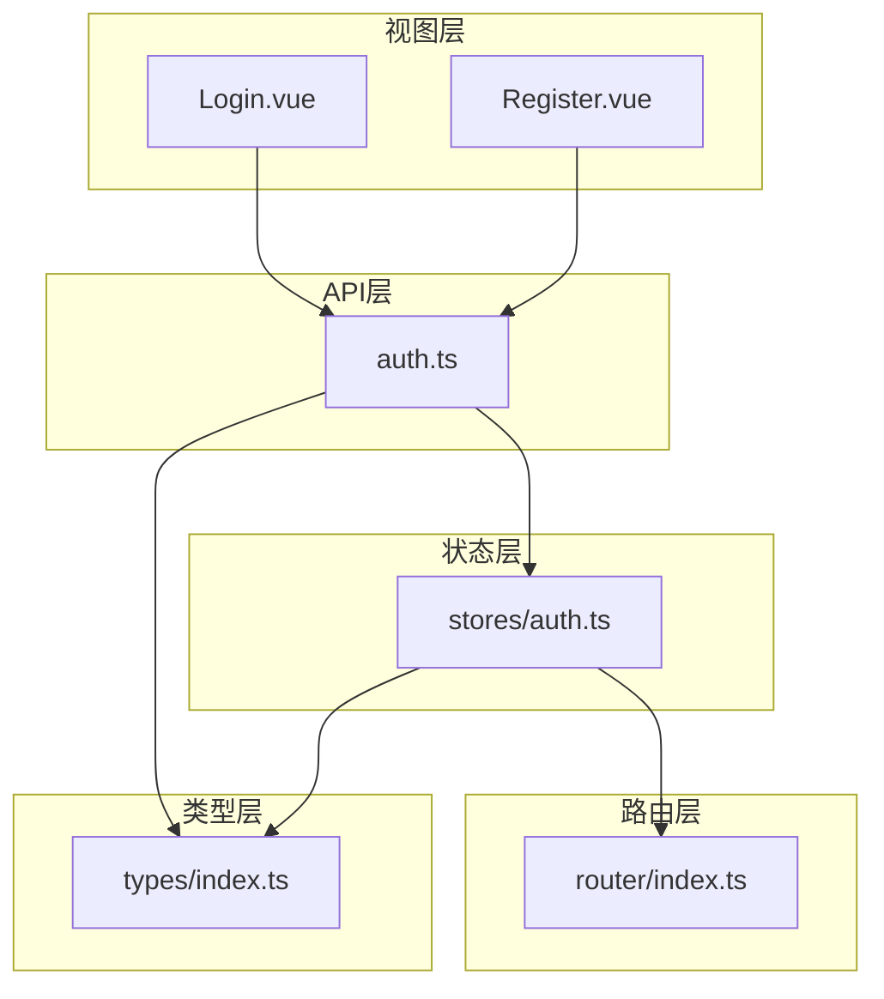
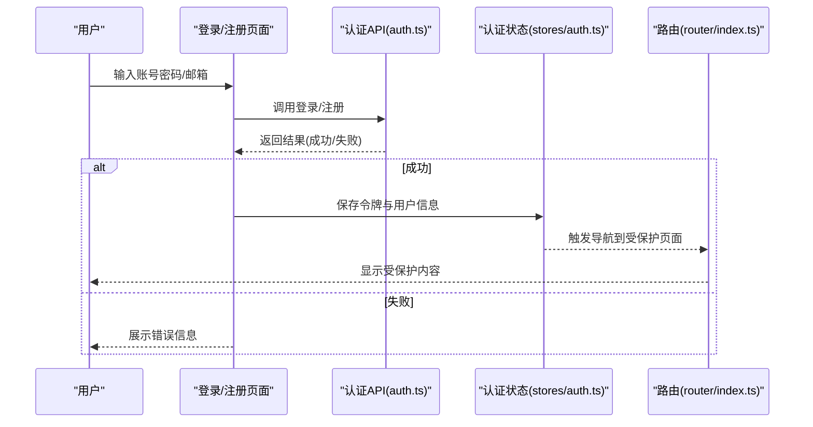
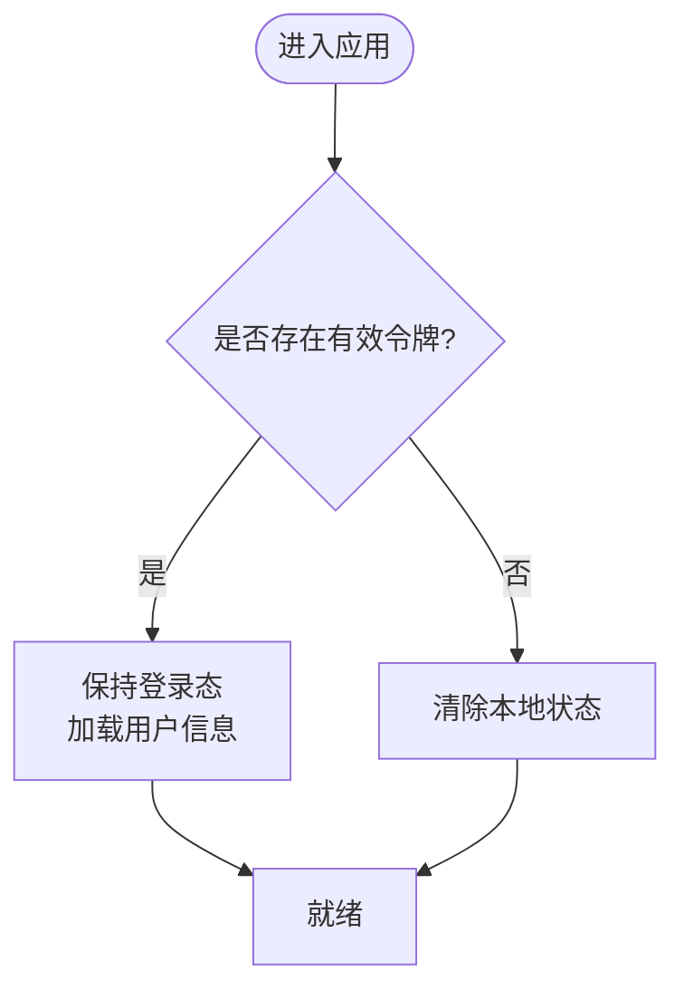
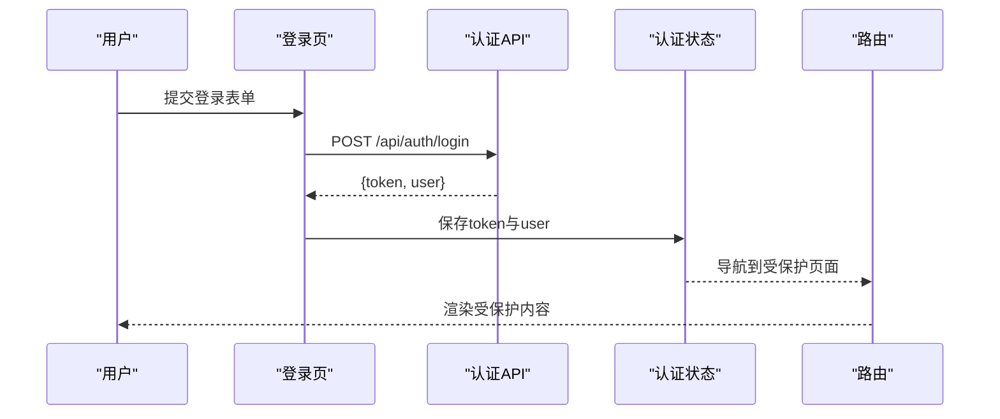
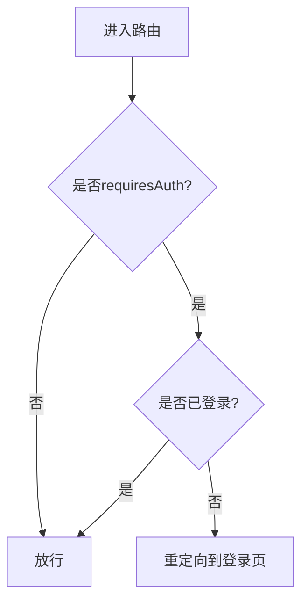
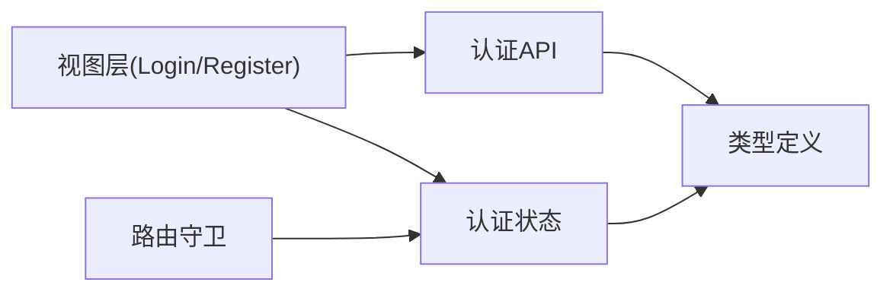

# 认证API接口

<cite>
**本文引用的文件**
- [src/api/auth.ts](file://src/api/auth.ts)
- [src/stores/auth.ts](file://src/stores/auth.ts)
- [src/views/Login.vue](file://src/views/Login.vue)
- [src/views/Register.vue](file://src/views/Register.vue)
- [src/router/index.ts](file://src/router/index.ts)
- [src/types/index.ts](file://src/types/index.ts)
</cite>

## 目录
1. [简介](#简介)
2. [项目结构](#项目结构)
3. [核心组件](#核心组件)
4. [架构总览](#架构总览)
5. [详细组件分析](#详细组件分析)
6. [依赖分析](#依赖分析)
7. [性能考虑](#性能考虑)
8. [故障排查指南](#故障排查指南)
9. [结论](#结论)
10. [附录](#附录)

## 简介
本文件面向前端工程中的“认证”能力，系统化说明登录、注册、登出与获取用户信息等HTTP端点的调用方式、请求/响应约定、JWT令牌管理、会话保持与权限校验流程。文档同时提供在Vue组件中集成认证调用的最佳实践，并给出常见错误处理与安全建议（密码加密、CSRF防护、XSS防护）。

## 项目结构
认证相关的前端实现主要分布在以下位置：
- API层：封装HTTP请求与统一错误处理
- 状态层：集中管理登录态、令牌与用户信息
- 视图层：登录/注册页面，触发认证流程
- 路由层：基于登录态的访问控制
- 类型层：统一的请求/响应类型定义

图表来源
- [src/views/Login.vue](file://src/views/Login.vue)
- [src/views/Register.vue](file://src/views/Register.vue)
- [src/api/auth.ts](file://src/api/auth.ts)
- [src/stores/auth.ts](file://src/stores/auth.ts)
- [src/router/index.ts](file://src/router/index.ts)
- [src/types/index.ts](file://src/types/index.ts)

章节来源
- [src/api/auth.ts](file://src/api/auth.ts)
- [src/stores/auth.ts](file://src/stores/auth.ts)
- [src/views/Login.vue](file://src/views/Login.vue)
- [src/views/Register.vue](file://src/views/Register.vue)
- [src/router/index.ts](file://src/router/index.ts)
- [src/types/index.ts](file://src/types/index.ts)

## 核心组件
- 认证API封装：提供登录、注册、登出、获取当前用户等方法的统一入口，负责设置/携带令牌、处理网络错误与业务错误。
- 认证状态管理：维护登录态、JWT令牌、用户信息，并提供刷新与清理方法。
- 视图组件：登录/注册页面对接API，展示错误提示，成功后更新状态并跳转。
- 路由守卫：根据登录态保护受保护路由。
- 类型定义：约束请求体、响应体字段，保证前后端契约一致。

章节来源
- [src/api/auth.ts](file://src/api/auth.ts)
- [src/stores/auth.ts](file://src/stores/auth.ts)
- [src/views/Login.vue](file://src/views/Login.vue)
- [src/views/Register.vue](file://src/views/Register.vue)
- [src/router/index.ts](file://src/router/index.ts)
- [src/types/index.ts](file://src/types/index.ts)

## 架构总览
下图展示了从用户操作到后端交互、再到状态更新与路由跳转的整体流程。

图表来源
- [src/views/Login.vue](file://src/views/Login.vue)
- [src/views/Register.vue](file://src/views/Register.vue)
- [src/api/auth.ts](file://src/api/auth.ts)
- [src/stores/auth.ts](file://src/stores/auth.ts)
- [src/router/index.ts](file://src/router/index.ts)

## 详细组件分析

### 认证API（登录、注册、登出、获取用户）
- 登录
  - URL与方法：POST /api/auth/login
  - 请求体：用户名或邮箱、密码
  - 响应：访问令牌、刷新令牌（可选）、用户基本信息
  - 状态码：200成功；400参数错误；401凭证无效；422校验失败
- 注册
  - URL与方法：POST /api/auth/register
  - 请求体：用户名、邮箱、密码（及确认密码）
  - 响应：创建成功的用户信息（不含敏感字段）
  - 状态码：201创建成功；400/422参数错误；409重复用户
- 登出
  - URL与方法：POST /api/auth/logout
  - 请求头：携带访问令牌
  - 响应：登出成功标志
  - 状态码：200成功；401未授权
- 获取当前用户
  - URL与方法：GET /api/auth/me
  - 请求头：携带访问令牌
  - 响应：当前用户信息
  - 状态码：200成功；401未授权

说明
- 令牌机制：使用JWT，访问令牌用于鉴权，刷新令牌用于续期（如实现）。
- 安全传输：所有接口通过HTTPS传输。
- 跨域：如需跨域，服务端应配置CORS白名单。

章节来源
- [src/api/auth.ts](file://src/api/auth.ts)
- [src/types/index.ts](file://src/types/index.ts)

### 认证状态管理（stores/auth.ts）
职责
- 保存与读取访问令牌、刷新令牌、用户信息
- 提供登录、注册、登出、刷新令牌的统一方法
- 暴露登录态判断与自动刷新逻辑

关键行为
- 登录成功后写入本地存储与内存状态
- 登出时清除本地存储与内存状态
- 拦截器中自动附加令牌，处理401/403并重定向到登录页

图表来源
- [src/stores/auth.ts](file://src/stores/auth.ts)

章节来源
- [src/stores/auth.ts](file://src/stores/auth.ts)
- [src/types/index.ts](file://src/types/index.ts)

### 视图层集成（登录/注册）
- 登录页
  - 表单提交后调用登录API
  - 成功：更新状态并跳转到目标页
  - 失败：展示错误消息（如用户名不存在、密码错误）
- 注册页
  - 表单提交后调用注册API
  - 成功：提示注册成功并跳转登录页或直接登录
  - 失败：展示错误消息（如邮箱已存在、密码强度不足）

图表来源
- [src/views/Login.vue](file://src/views/Login.vue)
- [src/api/auth.ts](file://src/api/auth.ts)
- [src/stores/auth.ts](file://src/stores/auth.ts)
- [src/router/index.ts](file://src/router/index.ts)

章节来源
- [src/views/Login.vue](file://src/views/Login.vue)
- [src/views/Register.vue](file://src/views/Register.vue)
- [src/api/auth.ts](file://src/api/auth.ts)
- [src/stores/auth.ts](file://src/stores/auth.ts)
- [src/router/index.ts](file://src/router/index.ts)

### 路由守卫与权限验证
- 全局前置守卫：检查登录态，若未登录且访问受保护路由则重定向至登录页
- 元信息：为路由配置meta.requiresAuth标记受保护路由
- 动态权限：可在登录后根据角色/权限决定可访问路由

图表来源
- [src/router/index.ts](file://src/router/index.ts)
- [src/stores/auth.ts](file://src/stores/auth.ts)

章节来源
- [src/router/index.ts](file://src/router/index.ts)
- [src/stores/auth.ts](file://src/stores/auth.ts)

### 类型契约（types/index.ts）
- 登录/注册请求体：包含必要字段（用户名/邮箱、密码等）
- 响应体：包含令牌、用户信息、错误信息
- 错误对象：包含错误码、错误消息、字段级错误

章节来源
- [src/types/index.ts](file://src/types/index.ts)

## 依赖分析
- 视图层依赖API层进行网络请求
- API层依赖类型层确保数据结构一致性
- 状态层被视图层与路由层共同依赖，作为单一事实源
- 路由层依赖状态层进行访问控制

图表来源
- [src/views/Login.vue](file://src/views/Login.vue)
- [src/views/Register.vue](file://src/views/Register.vue)
- [src/api/auth.ts](file://src/api/auth.ts)
- [src/stores/auth.ts](file://src/stores/auth.ts)
- [src/router/index.ts](file://src/router/index.ts)
- [src/types/index.ts](file://src/types/index.ts)

章节来源
- [src/api/auth.ts](file://src/api/auth.ts)
- [src/stores/auth.ts](file://src/stores/auth.ts)
- [src/router/index.ts](file://src/router/index.ts)
- [src/types/index.ts](file://src/types/index.ts)

## 性能考虑
- 令牌缓存：避免重复登录，减少不必要请求
- 批量请求：在令牌刷新期间合并或延迟请求，避免抖动
- 懒加载：仅在需要时加载受保护模块
- 错误重试：对网络异常进行有限次重试，避免雪崩

[本节为通用指导，不直接引用具体文件]

## 故障排查指南
常见问题与处理
- 401未授权
  - 可能原因：令牌过期、缺失或被篡改
  - 处理：尝试刷新令牌；失败则引导重新登录
- 403禁止访问
  - 可能原因：权限不足
  - 处理：提示用户或降级功能
- 422校验失败
  - 可能原因：请求体字段缺失或格式错误
  - 处理：展示字段级错误提示
- 网络错误
  - 可能原因：服务不可用、跨域问题
  - 处理：友好提示与重试按钮

章节来源
- [src/api/auth.ts](file://src/api/auth.ts)
- [src/stores/auth.ts](file://src/stores/auth.ts)

## 结论
本认证方案以API封装为核心，结合状态管理与路由守卫，实现了完整的登录、注册、登出与用户信息查询流程。通过JWT令牌与统一的错误处理，保证了安全性与可维护性。建议在后续迭代中补充刷新令牌、多端会话管理与细粒度权限控制。

[本节为总结性内容，不直接引用具体文件]

## 附录

### 接口清单与示例
- 登录
  - 路径与方法：POST /api/auth/login
  - 请求体示例：{ "username": "string", "password": "string" }
  - 响应示例：{ "access_token": "string", "refresh_token": "string", "user": { "id": "string", "name": "string", "email": "string" } }
  - 状态码：200/400/401/422
- 注册
  - 路径与方法：POST /api/auth/register
  - 请求体示例：{ "username": "string", "email": "string", "password": "string", "confirm_password": "string" }
  - 响应示例：{ "user": { "id": "string", "name": "string", "email": "string" } }
  - 状态码：201/400/409/422
- 登出
  - 路径与方法：POST /api/auth/logout
  - 请求头：Authorization: Bearer <access_token>
  - 响应示例：{ "message": "已登出" }
  - 状态码：200/401
- 获取当前用户
  - 路径与方法：GET /api/auth/me
  - 请求头：Authorization: Bearer <access_token>
  - 响应示例：{ "user": { "id": "string", "name": "string", "email": "string" } }
  - 状态码：200/401

[本节为接口规范说明，不直接引用具体文件]

### JWT令牌管理与会话保持
- 令牌存储：访问令牌建议存于内存或httpOnly Cookie；刷新令牌建议使用httpOnly Cookie
- 令牌刷新：在401时尝试刷新，失败则清空状态并跳转登录
- 会话超时：前端可设置空闲检测，超时后主动登出
- 安全传输：全站HTTPS，启用HSTS

[本节为通用指导，不直接引用具体文件]

### 权限验证流程
- 路由级：基于requiresAuth与角色元信息进行访问控制
- 组件级：根据用户角色/权限显示或隐藏功能
- 接口级：服务端按资源维度校验权限

[本节为通用指导，不直接引用具体文件]

### 安全最佳实践
- 密码加密：前端仅做基础校验，密码由服务端哈希加盐存储
- CSRF防护：使用SameSite Cookie与双重提交Token策略
- XSS防护：对用户输入进行转义，避免v-html渲染不可信内容
- 最小权限：按需授予角色与权限，定期审计
- 日志脱敏：记录日志时去除敏感字段

[本节为通用指导，不直接引用具体文件]

### 在组件中集成认证API调用
- 登录/注册：在表单提交时调用对应API，捕获错误并提示
- 登出：调用登出API后清除本地状态并跳转
- 获取用户信息：在应用初始化或路由切换时按需加载
- 错误处理：统一包装网络与业务错误，提供友好提示

章节来源
- [src/views/Login.vue](file://src/views/Login.vue)
- [src/views/Register.vue](file://src/views/Register.vue)
- [src/api/auth.ts](file://src/api/auth.ts)
- [src/stores/auth.ts](file://src/stores/auth.ts)