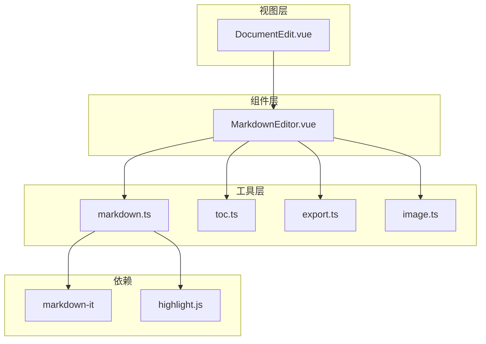
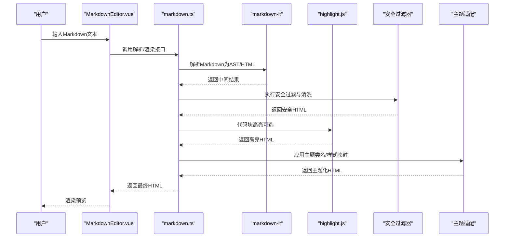
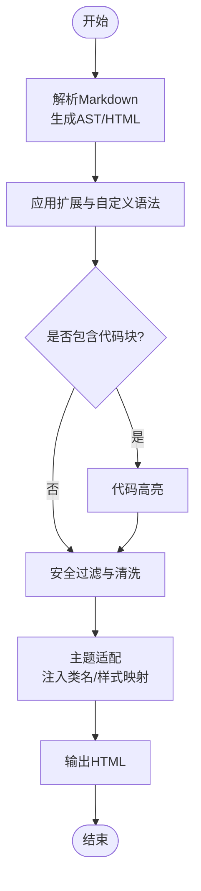
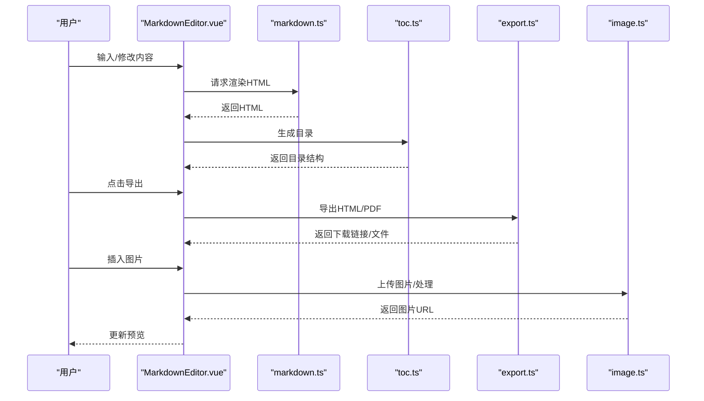
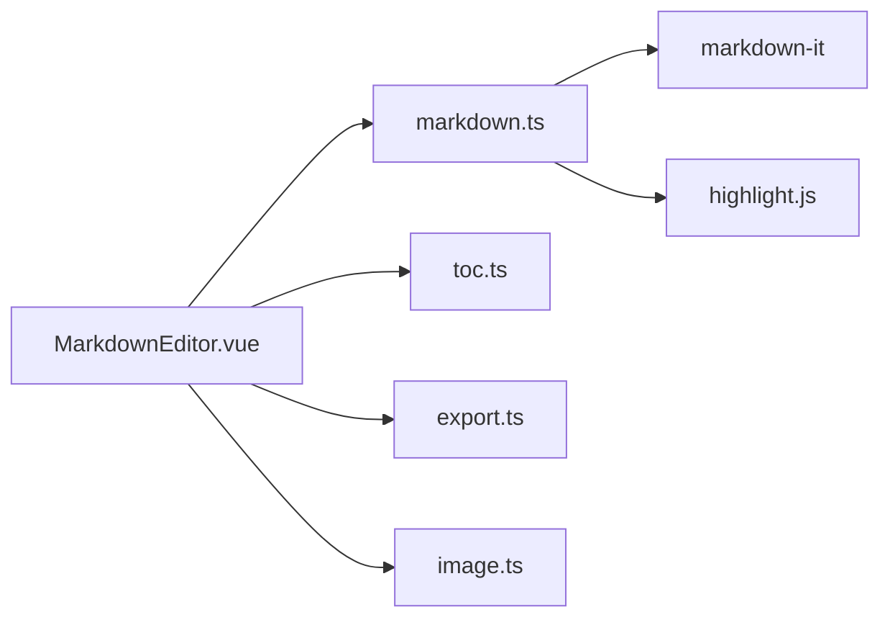

# Markdown处理工具函数

<cite>
**本文引用的文件**
- [src/utils/markdown.ts](file://src/utils/markdown.ts)
- [src/components/MarkdownEditor.vue](file://src/components/MarkdownEditor.vue)
- [src/views/DocumentEdit.vue](file://src/views/DocumentEdit.vue)
- [src/utils/toc.ts](file://src/utils/toc.ts)
- [src/utils/export.ts](file://src/utils/export.ts)
- [src/utils/image.ts](file://src/utils/image.ts)
- [package.json](file://package.json)
</cite>

## 目录
1. [简介](#简介)
2. [项目结构](#项目结构)
3. [核心组件](#核心组件)
4. [架构总览](#架构总览)
5. [详细组件分析](#详细组件分析)
6. [依赖分析](#依赖分析)
7. [性能考虑](#性能考虑)
8. [故障排查指南](#故障排查指南)
9. [结论](#结论)
10. [附录：API参考](#附录api参考)

## 简介
本文件面向前端工程中的Markdown处理工具链，系统性说明Markdown解析、渲染与语法检查的实现方式，覆盖扩展支持、自定义语法、主题适配、内容转换与格式化、安全过滤与清洗机制，以及从Markdown到HTML的转换流程与样式映射。文档同时提供可扩展性指导，帮助读者在现有基础上扩展Markdown语法并处理特殊格式。

## 项目结构
本项目采用按功能域组织的前端工程结构，Markdown相关能力主要集中在utils与components层：
- utils/markdown.ts：Markdown解析、渲染、扩展与安全检查的核心实现
- components/MarkdownEditor.vue：编辑器集成与预览渲染的UI组件
- views/DocumentEdit.vue：页面级编辑视图，串联编辑器与导出等能力
- utils/toc.ts：目录生成（基于标题）
- utils/export.ts：导出为HTML/PDF等
- utils/image.ts：图片上传与处理
- package.json：第三方库依赖声明（如markdown-it、highlight.js等）

图表来源
- [src/components/MarkdownEditor.vue](file://src/components/MarkdownEditor.vue)
- [src/utils/markdown.ts](file://src/utils/markdown.ts)
- [src/utils/toc.ts](file://src/utils/toc.ts)
- [src/utils/export.ts](file://src/utils/export.ts)
- [src/utils/image.ts](file://src/utils/image.ts)
- [package.json](file://package.json)

章节来源
- [src/utils/markdown.ts](file://src/utils/markdown.ts)
- [src/components/MarkdownEditor.vue](file://src/components/MarkdownEditor.vue)
- [src/views/DocumentEdit.vue](file://src/views/DocumentEdit.vue)
- [src/utils/toc.ts](file://src/utils/toc.ts)
- [src/utils/export.ts](file://src/utils/export.ts)
- [src/utils/image.ts](file://src/utils/image.ts)
- [package.json](file://package.json)

## 核心组件
- Markdown解析与渲染引擎：封装markdown-it实例，配置插件与扩展，统一输出HTML片段或完整文档
- 编辑器组件：双向绑定、实时预览、快捷键、主题切换、错误提示
- 目录生成：基于标题节点构建可跳转目录
- 导出：将Markdown转换为HTML/PDF等格式
- 图片处理：上传、压缩、占位图、懒加载策略

章节来源
- [src/utils/markdown.ts](file://src/utils/markdown.ts)
- [src/components/MarkdownEditor.vue](file://src/components/MarkdownEditor.vue)
- [src/utils/toc.ts](file://src/utils/toc.ts)
- [src/utils/export.ts](file://src/utils/export.ts)
- [src/utils/image.ts](file://src/utils/image.ts)

## 架构总览
下图展示从用户输入到最终渲染的安全处理流水线，包括解析、扩展、安全检查、高亮与主题适配。

图表来源
- [src/components/MarkdownEditor.vue](file://src/components/MarkdownEditor.vue)
- [src/utils/markdown.ts](file://src/utils/markdown.ts)
- [package.json](file://package.json)

## 详细组件分析

### Markdown解析与渲染（markdown.ts）
- 解析流程
  - 初始化markdown-it实例，启用必要插件（如链接校验、表格、任务列表等）
  - 注册自定义规则以支持扩展语法（例如自定义标签、内联元素）
  - 对代码块进行高亮（通过highlight.js）
  - 输出HTML片段或完整文档
- 扩展与自定义语法
  - 通过插件机制注入新token类型与渲染器
  - 使用正则匹配与AST变换组合实现复杂语法
- 主题适配
  - 为不同主题定义CSS类名约定，渲染时注入对应类名
  - 支持动态切换主题，仅改变类名而不影响内容
- 安全过滤与清洗
  - 禁用危险协议与脚本注入点
  - 白名单允许的标签与属性
  - 对URL进行规范化与校验
  - 对图片路径进行相对化与校验
- 性能优化
  - 缓存已解析的AST或HTML片段
  - 增量更新（仅在变更区域重渲染）
  - 延迟高亮与懒加载图片

图表来源
- [src/utils/markdown.ts](file://src/utils/markdown.ts)

章节来源
- [src/utils/markdown.ts](file://src/utils/markdown.ts)

### 编辑器组件（MarkdownEditor.vue）
- 功能要点
  - 双向数据绑定：编辑区与预览区同步
  - 实时预览：防抖节流减少重渲染开销
  - 快捷键：加粗、斜体、插入链接/图片、代码块等
  - 主题切换：通过类名切换整体风格
  - 错误提示：捕获解析异常并友好提示
- 与工具层交互
  - 调用markdown.ts进行解析与渲染
  - 调用toc.ts生成目录
  - 调用export.ts导出
  - 调用image.ts处理图片上传与预览

图表来源
- [src/components/MarkdownEditor.vue](file://src/components/MarkdownEditor.vue)
- [src/utils/markdown.ts](file://src/utils/markdown.ts)
- [src/utils/toc.ts](file://src/utils/toc.ts)
- [src/utils/export.ts](file://src/utils/export.ts)
- [src/utils/image.ts](file://src/utils/image.ts)

章节来源
- [src/components/MarkdownEditor.vue](file://src/components/MarkdownEditor.vue)

### 目录生成（toc.ts）
- 基于标题层级构建目录树
- 支持锚点定位与滚动监听
- 可配置最大层级与显示项数

章节来源
- [src/utils/toc.ts](file://src/utils/toc.ts)

### 导出（export.ts）
- 将Markdown转换为HTML字符串或完整文档
- 支持PDF导出（通过浏览器打印或第三方库）
- 可注入元信息（标题、作者、时间戳）

章节来源
- [src/utils/export.ts](file://src/utils/export.ts)

### 图片处理（image.ts）
- 支持本地拖拽、粘贴、选择上传
- 压缩与格式转换（可选）
- 生成占位图与懒加载
- 校验图片尺寸与大小限制

章节来源
- [src/utils/image.ts](file://src/utils/image.ts)

## 依赖分析
- markdown-it：Markdown解析与插件生态
- highlight.js：代码高亮
- 其他可能依赖：DOMPurify（安全过滤）、jsPDF/html2canvas（PDF导出）、Cropper.js（图片裁剪）等，具体以实际引入为准

图表来源
- [src/components/MarkdownEditor.vue](file://src/components/MarkdownEditor.vue)
- [src/utils/markdown.ts](file://src/utils/markdown.ts)
- [package.json](file://package.json)

章节来源
- [package.json](file://package.json)

## 性能考虑
- 解析与渲染
  - 使用markdown-it的缓存机制避免重复解析
  - 对长文档分片渲染，优先渲染可视区域
- 高亮
  - 按需加载语言包，减少首屏体积
  - 对非可见代码块延迟高亮
- 图片
  - 懒加载与缩略图策略
  - 上传前压缩，降低网络传输成本
- 主题切换
  - 通过CSS变量与类名切换，避免重新渲染整篇文档

[本节为通用性能建议，不直接分析具体文件]

## 故障排查指南
- 解析失败
  - 检查Markdown语法是否正确
  - 查看控制台错误堆栈，定位非法token或正则匹配失败
- 安全警告
  - 确认安全过滤器已启用，检查白名单标签与属性
  - 对外部链接与图片路径进行校验
- 高亮异常
  - 确认语言标识符正确
  - 检查highlight.js语言包是否加载
- 导出问题
  - 浏览器兼容性差异导致PDF导出失败时，回退为HTML下载
  - 检查样式注入是否完整

章节来源
- [src/utils/markdown.ts](file://src/utils/markdown.ts)
- [src/components/MarkdownEditor.vue](file://src/components/MarkdownEditor.vue)

## 结论
本工具链围绕markdown.ts构建了完整的Markdown处理管线，结合编辑器组件实现了从输入到渲染、从扩展到安全的闭环能力。通过插件化与主题化设计，系统具备良好的扩展性与可维护性。建议在后续迭代中持续完善安全策略、性能优化与多语言高亮支持。

[本节为总结性内容，不直接分析具体文件]

## 附录：API参考
以下列出Markdown处理相关的主要API入口与职责，便于快速查阅与集成。

- markdown.ts
  - 解析与渲染
    - 功能：将Markdown文本转换为HTML片段或完整文档
    - 参数：Markdown字符串、配置对象（是否高亮、是否安全过滤、主题等）
    - 返回：HTML字符串
  - 扩展管理
    - 功能：注册/移除自定义语法与插件
    - 参数：插件名称、配置
  - 安全过滤
    - 功能：清理危险标签、属性与协议
    - 参数：原始HTML、白名单配置
    - 返回：安全HTML
  - 主题适配
    - 功能：根据主题注入类名与样式映射
    - 参数：主题标识、样式表引用
    - 返回：主题化HTML

- MarkdownEditor.vue
  - 功能：编辑器容器，负责双向绑定、预览渲染、快捷键、主题切换
  - 事件：onRender、onExport、onImageUpload等
  - 方法：renderMarkdown、updateTheme、getTOC、exportToHTML

- toc.ts
  - 功能：基于标题生成目录结构
  - 参数：HTML字符串或DOM节点、最大层级
  - 返回：目录JSON或HTML片段

- export.ts
  - 功能：导出为HTML/PDF
  - 参数：Markdown或HTML、导出选项
  - 返回：下载链接或Blob

- image.ts
  - 功能：图片上传、压缩、预览
  - 参数：File对象、压缩配置
  - 返回：图片URL或Base64

章节来源
- [src/utils/markdown.ts](file://src/utils/markdown.ts)
- [src/components/MarkdownEditor.vue](file://src/components/MarkdownEditor.vue)
- [src/utils/toc.ts](file://src/utils/toc.ts)
- [src/utils/export.ts](file://src/utils/export.ts)
- [src/utils/image.ts](file://src/utils/image.ts)