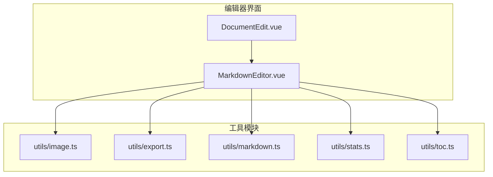
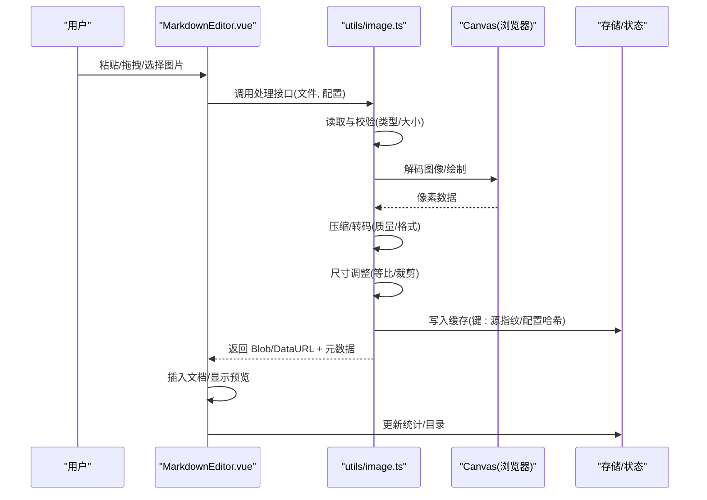
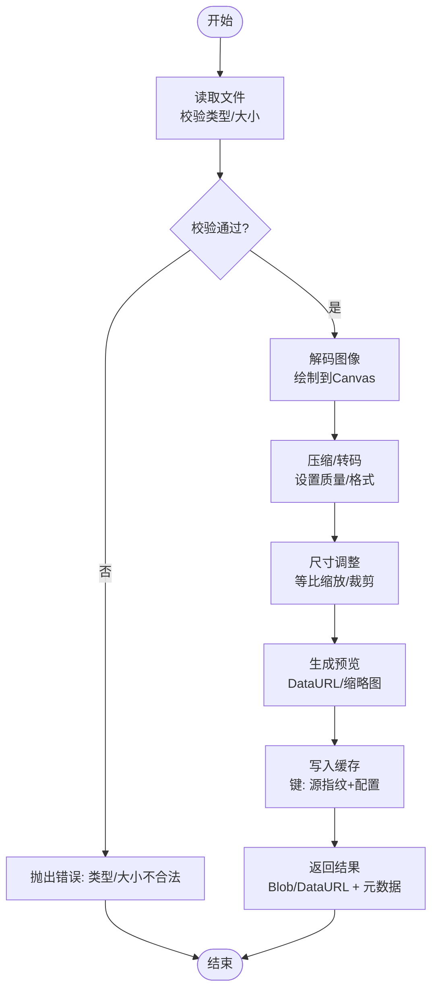
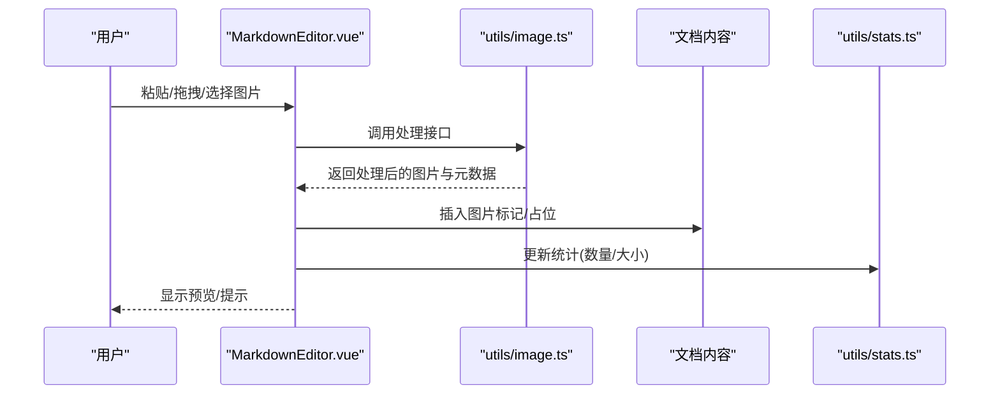
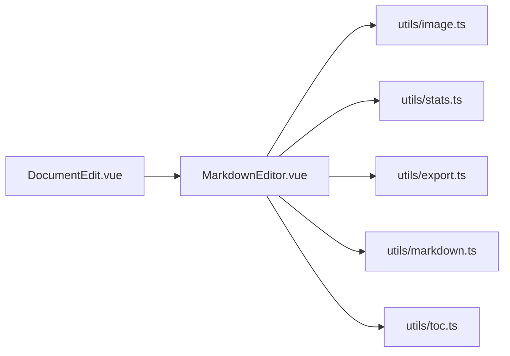

# 图像处理工具函数

<cite>
**本文引用的文件**
- [image.ts](file://src/utils/image.ts)
- [editor.ts](file://src/utils/editor.ts)
- [MarkdownEditor.vue](file://src/components/MarkdownEditor.vue)
- [DocumentEdit.vue](file://src/views/DocumentEdit.vue)
- [export.ts](file://src/utils/export.ts)
- [markdown.ts](file://src/utils/markdown.ts)
- [stats.ts](file://src/utils/stats.ts)
- [toc.ts](file://src/utils/toc.ts)
- [README.md](file://src/utils/README.md)
</cite>

## 目录
1. [简介](#简介)
2. [项目结构](#项目结构)
3. [核心组件](#核心组件)
4. [架构总览](#架构总览)
5. [详细组件分析](#详细组件分析)
6. [依赖关系分析](#依赖关系分析)
7. [性能考虑](#性能考虑)
8. [故障排查指南](#故障排查指南)
9. [结论](#结论)
10. [附录](#附录)

## 简介
本文件面向编辑器中的图片处理工具函数，围绕图片上传、压缩、格式转换与预览四大能力展开，系统说明算法思路、尺寸调整与质量优化策略、缓存与内存管理、格式兼容性与错误恢复机制，并给出在编辑器中集成的实践建议与接口使用示例。目标是帮助开发者快速理解并安全地扩展图片处理能力，确保在浏览器端高效、稳定地处理用户图片资源。

## 项目结构
本项目采用前端工程化组织方式，图片处理相关逻辑集中在 utils 目录下的 image.ts，并在 Markdown 编辑器组件中集成调用；导出、统计、目录等辅助模块位于同目录下，便于复用。整体职责划分清晰：
- utils/image.ts：图片处理核心（上传、压缩、格式转换、预览）
- components/MarkdownEditor.vue：编辑器 UI，负责触发图片处理流程
- views/DocumentEdit.vue：页面级入口，承载编辑器实例
- utils/export.ts / markdown.ts / stats.ts / toc.ts：编辑器的导出、Markdown 解析、统计与目录生成等辅助功能
- utils/README.md：工具模块使用说明

图表来源
- [MarkdownEditor.vue:1-200](file://src/components/MarkdownEditor.vue#L1-L200)
- [DocumentEdit.vue:1-200](file://src/views/DocumentEdit.vue#L1-L200)
- [image.ts:1-200](file://src/utils/image.ts#L1-L200)
- [export.ts:1-200](file://src/utils/export.ts#L1-L200)
- [markdown.ts:1-200](file://src/utils/markdown.ts#L1-L200)
- [stats.ts:1-200](file://src/utils/stats.ts#L1-L200)
- [toc.ts:1-200](file://src/utils/toc.ts#L1-L200)

章节来源
- [image.ts:1-200](file://src/utils/image.ts#L1-L200)
- [MarkdownEditor.vue:1-200](file://src/components/MarkdownEditor.vue#L1-L200)
- [DocumentEdit.vue:1-200](file://src/views/DocumentEdit.vue#L1-L200)
- [export.ts:1-200](file://src/utils/export.ts#L1-L200)
- [markdown.ts:1-200](file://src/utils/markdown.ts#L1-L200)
- [stats.ts:1-200](file://src/utils/stats.ts#L1-L200)
- [toc.ts:1-200](file://src/utils/toc.ts#L1-L200)

## 核心组件
- 图片处理核心（image.ts）
  - 提供统一的图片处理 API，包括：
    - 读取与校验：支持常见图片类型与大小限制
    - 压缩与质量优化：基于 Canvas 的编码参数控制
    - 格式转换：将源图转换为指定目标格式（如 PNG/JPEG/WebP）
    - 尺寸调整：等比缩放、最大边限制、裁剪策略
    - 预览生成：生成缩略图或数据 URL 用于即时预览
    - 缓存与内存管理：对中间结果进行缓存与释放
  - 典型输入输出：
    - 输入：File/Blob、配置项（目标格式、最大边长、质量、是否保留 EXIF 等）
    - 输出：Blob/DataURL、尺寸信息、元数据（宽/高/类型）、错误信息
- 编辑器集成（MarkdownEditor.vue）
  - 监听粘贴/拖拽/选择文件事件，调用 image.ts 进行处理
  - 将处理后的图片插入到文档内容中，支持占位与进度反馈
- 页面入口（DocumentEdit.vue）
  - 初始化编辑器实例，挂载图片处理回调
- 辅助模块（export.ts / markdown.ts / stats.ts / toc.ts）
  - 导出为 Markdown/PDF、解析 Markdown、统计字数/图片数量、生成目录等

章节来源
- [image.ts:1-200](file://src/utils/image.ts#L1-L200)
- [MarkdownEditor.vue:1-200](file://src/components/MarkdownEditor.vue#L1-L200)
- [DocumentEdit.vue:1-200](file://src/views/DocumentEdit.vue#L1-L200)
- [export.ts:1-200](file://src/utils/export.ts#L1-L200)
- [markdown.ts:1-200](file://src/utils/markdown.ts#L1-L200)
- [stats.ts:1-200](file://src/utils/stats.ts#L1-L200)
- [toc.ts:1-200](file://src/utils/toc.ts#L1-L200)

## 架构总览
图片处理在编辑器中的端到端流程如下：
- 用户操作：粘贴图片、拖拽图片、选择本地文件
- 编辑器捕获事件，调用 image.ts 的处理管线
- 处理管线：读取 -> 校验 -> 可选 EXIF 读取 -> 压缩/转码 -> 尺寸调整 -> 生成预览 -> 缓存
- 结果回写：将处理后的图片插入文档，更新统计与目录

图表来源
- [MarkdownEditor.vue:1-200](file://src/components/MarkdownEditor.vue#L1-L200)
- [image.ts:1-200](file://src/utils/image.ts#L1-L200)

## 详细组件分析

### 图片处理核心（image.ts）
- 设计要点
  - 统一入口：对外暴露一组方法，屏蔽底层实现细节
  - 可配置：支持目标格式、质量、最大边、是否裁剪、是否保留 EXIF 等
  - 健壮性：完善的错误分类与恢复策略（类型不支持、过大、解码失败等）
  - 性能：避免重复计算，利用缓存减少重复处理；按需释放临时对象
- 关键流程
  - 读取与校验：检查 MIME 类型、文件大小、分辨率上限
  - 解码与绘制：使用 Image 与 Canvas 完成像素级操作
  - 压缩与转码：根据目标格式设置编码质量，必要时进行二次压缩
  - 尺寸调整：优先等比缩放，必要时按策略裁剪以适配目标尺寸
  - 预览生成：生成缩略图或 DataURL，供编辑器即时展示
  - 缓存与释放：以“源图指纹+配置”为键缓存结果，任务完成后及时释放内存

图表来源
- [image.ts:1-200](file://src/utils/image.ts#L1-L200)

章节来源
- [image.ts:1-200](file://src/utils/image.ts#L1-L200)

### 编辑器集成（MarkdownEditor.vue）
- 事件绑定：监听 paste、drop、change 事件，提取图片文件
- 调用处理：将文件与配置传入 image.ts，获取处理结果
- 插入文档：将处理后的图片以 Markdown 语法或占位节点插入
- 反馈与状态：显示加载状态、错误提示、进度条
- 统计更新：调用 stats.ts 更新图片计数、总大小等

图表来源
- [MarkdownEditor.vue:1-200](file://src/components/MarkdownEditor.vue#L1-L200)
- [image.ts:1-200](file://src/utils/image.ts#L1-L200)
- [stats.ts:1-200](file://src/utils/stats.ts#L1-L200)

章节来源
- [MarkdownEditor.vue:1-200](file://src/components/MarkdownEditor.vue#L1-L200)
- [image.ts:1-200](file://src/utils/image.ts#L1-L200)
- [stats.ts:1-200](file://src/utils/stats.ts#L1-L200)

### 导出与文档处理（export.ts / markdown.ts / toc.ts）
- export.ts：将当前文档导出为 Markdown/PDF，包含已处理的图片引用
- markdown.ts：解析 Markdown，识别图片节点，便于统计与替换
- toc.ts：生成目录，支持图片锚点与跳转
- 与图片处理的关系：导出时确保图片路径/内容有效；解析时统计图片数量与尺寸

章节来源
- [export.ts:1-200](file://src/utils/export.ts#L1-L200)
- [markdown.ts:1-200](file://src/utils/markdown.ts#L1-L200)
- [toc.ts:1-200](file://src/utils/toc.ts#L1-L200)

## 依赖关系分析
- 组件依赖
  - MarkdownEditor.vue 依赖 image.ts、stats.ts、export.ts、markdown.ts、toc.ts
  - DocumentEdit.vue 依赖 MarkdownEditor.vue
- 模块耦合
  - image.ts 尽量保持无副作用，仅依赖浏览器原生 API（FileReader、Image、Canvas）
  - 编辑器组件负责事件与状态，图片处理模块专注算法与数据转换
- 外部依赖
  - 浏览器环境：File API、Canvas API、URL.createObjectURL
  - 可选：EXIF 读取库（若需保留方向信息）

图表来源
- [MarkdownEditor.vue:1-200](file://src/components/MarkdownEditor.vue#L1-L200)
- [DocumentEdit.vue:1-200](file://src/views/DocumentEdit.vue#L1-L200)
- [image.ts:1-200](file://src/utils/image.ts#L1-L200)
- [stats.ts:1-200](file://src/utils/stats.ts#L1-L200)
- [export.ts:1-200](file://src/utils/export.ts#L1-L200)
- [markdown.ts:1-200](file://src/utils/markdown.ts#L1-L200)
- [toc.ts:1-200](file://src/utils/toc.ts#L1-L200)

章节来源
- [MarkdownEditor.vue:1-200](file://src/components/MarkdownEditor.vue#L1-L200)
- [DocumentEdit.vue:1-200](file://src/views/DocumentEdit.vue#L1-L200)
- [image.ts:1-200](file://src/utils/image.ts#L1-L200)
- [stats.ts:1-200](file://src/utils/stats.ts#L1-L200)
- [export.ts:1-200](file://src/utils/export.ts#L1-L200)
- [markdown.ts:1-200](file://src/utils/markdown.ts#L1-L200)
- [toc.ts:1-200](file://src/utils/toc.ts#L1-L200)

## 性能考虑
- 压缩与转码
  - 合理设置质量参数，平衡体积与清晰度
  - 优先使用 WebP 以获得更高压缩率（浏览器兼容性检测）
- 尺寸调整
  - 先等比缩放，再按需裁剪，避免多次重绘
  - 限制最大边长，防止超大图导致内存峰值
- 预览生成
  - 生成低分辨率缩略图用于列表/占位，点击后加载高清图
- 缓存机制
  - 以“源图指纹+配置”为键缓存结果，避免重复处理
  - 限制缓存条目数量与总大小，定期清理
- 内存管理
  - 及时释放临时对象与 URL 引用（revokeObjectURL）
  - 大图处理分片或使用 Worker（如需）降低主线程阻塞

[本节为通用性能指导，不直接分析具体文件]

## 故障排查指南
- 常见问题
  - 类型不支持：检查 MIME 类型白名单与浏览器兼容性
  - 文件过大：增加大小限制或提示用户压缩
  - 解码失败：检查图片完整性与 EXIF 方向信息
  - 内存溢出：降低质量/尺寸，启用缓存清理
- 错误分类与恢复
  - 分类：输入错误、解码错误、编码错误、网络/存储错误
  - 恢复：重试、降级策略（如从 WebP 回退到 JPEG）、用户提示
- 调试建议
  - 记录处理前后尺寸、体积、耗时
  - 打印关键步骤日志，定位瓶颈与异常

章节来源
- [image.ts:1-200](file://src/utils/image.ts#L1-L200)
- [MarkdownEditor.vue:1-200](file://src/components/MarkdownEditor.vue#L1-L200)

## 结论
本方案在编辑器中实现了完整的图片处理管线，涵盖上传、压缩、格式转换与预览，并通过缓存与内存管理保障性能与稳定性。结合导出与统计模块，形成闭环的图片管理能力。建议在后续迭代中引入更精细的质量评估、自适应压缩策略与异步处理，进一步提升用户体验。

[本节为总结性内容，不直接分析具体文件]

## 附录

### API 接口说明（image.ts）
- 读取与校验
  - 输入：File/Blob、配置（类型白名单、大小上限）
  - 输出：校验结果、原始尺寸、MIME 类型
- 压缩与转码
  - 输入：图像数据、目标格式、质量、是否保留 EXIF
  - 输出：压缩后的 Blob、新尺寸、体积
- 尺寸调整
  - 输入：图像数据、目标宽度/高度、是否等比、裁剪策略
  - 输出：调整后图像、最终尺寸
- 预览生成
  - 输入：图像数据、缩略图尺寸
  - 输出：DataURL 或缩略图 Blob
- 缓存与释放
  - 输入：键（源指纹+配置）
  - 输出：命中结果或空；释放指定缓存

章节来源
- [image.ts:1-200](file://src/utils/image.ts#L1-L200)

### 使用示例（编辑器集成）
- 在 MarkdownEditor.vue 中：
  - 监听粘贴/拖拽/选择事件，提取图片文件
  - 调用 image.ts 的压缩/转码/尺寸调整接口
  - 将处理结果插入文档，并更新统计
- 在 DocumentEdit.vue 中：
  - 初始化编辑器，配置图片处理选项（最大边、质量、目标格式）
  - 注册成功/失败回调，提供用户反馈

章节来源
- [MarkdownEditor.vue:1-200](file://src/components/MarkdownEditor.vue#L1-L200)
- [DocumentEdit.vue:1-200](file://src/views/DocumentEdit.vue#L1-L200)
- [image.ts:1-200](file://src/utils/image.ts#L1-L200)

### 图片格式兼容性处理
- 支持格式：PNG、JPEG、WebP（浏览器支持检测）
- 回退策略：当目标格式不可用时，自动回退至 JPEG 或 PNG
- EXIF 方向：必要时读取并应用旋转，保证预览一致

章节来源
- [image.ts:1-200](file://src/utils/image.ts#L1-L200)

### 错误恢复机制
- 输入校验失败：提示用户更换图片或调整大小
- 解码失败：尝试重新解码或提示文件损坏
- 编码失败：降低质量或切换格式
- 内存不足：终止当前任务，清理缓存，提示用户稍后再试

章节来源
- [image.ts:1-200](file://src/utils/image.ts#L1-L200)

### 缓存机制与内存管理策略
- 缓存键：源图指纹 + 配置哈希，确保唯一性
- 缓存容量：限制条目数与总大小，LRU 淘汰策略
- 释放时机：任务完成后立即释放临时对象；页面卸载时清理所有缓存
- 监控指标：缓存命中率、平均处理时间、内存占用

章节来源
- [image.ts:1-200](file://src/utils/image.ts#L1-L200)

### 在编辑器中集成的最佳实践
- 渐进式增强：优先使用 WebP，回退到 JPEG/PNG
- 用户反馈：显示进度、错误提示、重试按钮
- 性能优化：缩略图预览、懒加载大图、批量处理队列
- 可配置：允许用户自定义质量、尺寸、目标格式

章节来源
- [MarkdownEditor.vue:1-200](file://src/components/MarkdownEditor.vue#L1-L200)
- [image.ts:1-200](file://src/utils/image.ts#L1-L200)