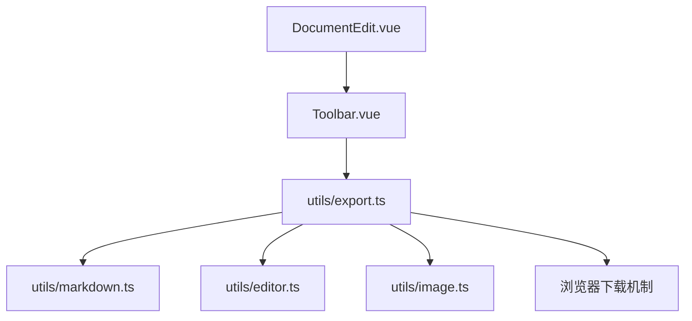
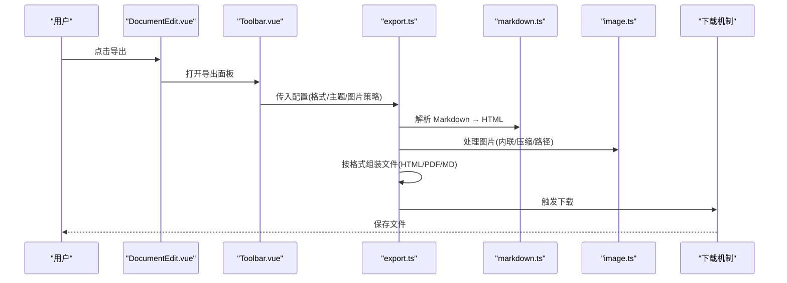
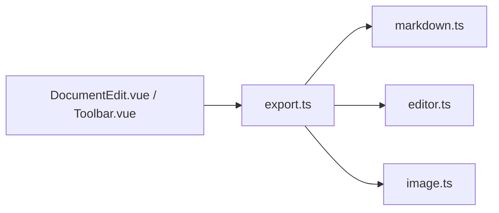

# 导出工具函数

<cite>
**本文引用的文件**
- [export.ts](file://src/utils/export.ts)
- [markdown.ts](file://src/utils/markdown.ts)
- [editor.ts](file://src/utils/editor.ts)
- [image.ts](file://src/utils/image.ts)
- [DocumentEdit.vue](file://src/views/DocumentEdit.vue)
- [Toolbar.vue](file://src/components/Toolbar.vue)
- [package.json](file://package.json)
</cite>

## 目录
1. [简介](#简介)
2. [项目结构](#项目结构)
3. [核心组件](#核心组件)
4. [架构总览](#架构总览)
5. [详细组件分析](#详细组件分析)
6. [依赖关系分析](#依赖关系分析)
7. [性能考虑](#性能考虑)
8. [故障排查指南](#故障排查指南)
9. [结论](#结论)
10. [附录](#附录)

## 简介
本章节概述导出工具函数的目标与能力：提供将文档内容导出为多种格式（如 PDF、HTML、Markdown）的能力，涵盖配置选项、模板定制、批量导出、数据处理与格式化流程、下载机制以及错误处理策略。该功能主要位于前端工具层，通过浏览器环境完成渲染与下载，必要时借助第三方库进行格式转换。

## 项目结构
导出相关代码集中在 utils 目录，并在视图与工具栏中暴露用户入口。关键文件职责如下：
- src/utils/export.ts：导出主逻辑，协调 Markdown 解析、HTML 生成、PDF 生成与下载。
- src/utils/markdown.ts：Markdown 到 HTML 的转换与扩展。
- src/utils/editor.ts：编辑器状态读取与内容获取。
- src/utils/image.ts：图片资源处理（如内联、压缩或路径替换）。
- src/views/DocumentEdit.vue：文档编辑页面，触发导出流程。
- src/components/Toolbar.vue：工具栏按钮，提供导出入口。
- package.json：声明导出所需的第三方依赖（如 PDF/HTML 导出库）。

图表来源
- [DocumentEdit.vue](file://src/views/DocumentEdit.vue)
- [Toolbar.vue](file://src/components/Toolbar.vue)
- [export.ts](file://src/utils/export.ts)
- [markdown.ts](file://src/utils/markdown.ts)
- [editor.ts](file://src/utils/editor.ts)
- [image.ts](file://src/utils/image.ts)

章节来源
- [export.ts](file://src/utils/export.ts)
- [markdown.ts](file://src/utils/markdown.ts)
- [editor.ts](file://src/utils/editor.ts)
- [image.ts](file://src/utils/image.ts)
- [DocumentEdit.vue](file://src/views/DocumentEdit.vue)
- [Toolbar.vue](file://src/components/Toolbar.vue)
- [package.json](file://package.json)

## 核心组件
- 导出编排器（export.ts）：负责根据配置选择导出格式、调用相应转换器、组装最终文件并触发下载。
- Markdown 处理器（markdown.ts）：将 Markdown 文本转换为 HTML，支持主题、目录、表格等扩展。
- 编辑器数据源（editor.ts）：从编辑器实例中读取当前文档内容与元信息。
- 图片处理器（image.ts）：对图片进行预处理（如 base64 内联、尺寸调整、路径修正），确保导出产物显示正确。
- UI 入口（DocumentEdit.vue、Toolbar.vue）：提供导出按钮与参数面板，收集用户配置并发起导出请求。

章节来源
- [export.ts](file://src/utils/export.ts)
- [markdown.ts](file://src/utils/markdown.ts)
- [editor.ts](file://src/utils/editor.ts)
- [image.ts](file://src/utils/image.ts)
- [DocumentEdit.vue](file://src/views/DocumentEdit.vue)
- [Toolbar.vue](file://src/components/Toolbar.vue)

## 架构总览
导出流程遵循“输入→转换→输出→下载”的流水线模式：
- 输入：从编辑器读取 Markdown 内容与元数据。
- 转换：根据目标格式执行不同转换链（Markdown→HTML、HTML→PDF、直接保存 Markdown）。
- 输出：生成对应格式的文件内容（Blob/字符串）。
- 下载：使用浏览器下载 API 触发本地保存。

图表来源
- [DocumentEdit.vue](file://src/views/DocumentEdit.vue)
- [Toolbar.vue](file://src/components/Toolbar.vue)
- [export.ts](file://src/utils/export.ts)
- [markdown.ts](file://src/utils/markdown.ts)
- [image.ts](file://src/utils/image.ts)

## 详细组件分析

### 导出编排器（export.ts）
- 职责
  - 接收导出配置（目标格式、主题、是否包含目录、图片策略、文件名等）。
  - 调度 Markdown 转换与图片处理。
  - 根据目标格式生成最终文件内容并触发下载。
- 关键流程
  - 读取编辑器内容（editor.ts）。
  - 调用 markdown.ts 将 Markdown 转为 HTML。
  - 调用 image.ts 处理图片资源。
  - 若目标为 PDF，则基于 HTML 生成 PDF；若为 HTML，则打包完整页面；若为 Markdown，则直接保存原文。
  - 使用浏览器下载接口保存文件。
- 错误处理
  - 捕获转换异常并提示用户。
  - 对网络图片失败进行降级（如跳过或占位）。
- 性能优化
  - 大文档分块处理图片。
  - 避免重复解析 Markdown。
  - 按需加载 PDF 生成库。

章节来源
- [export.ts](file://src/utils/export.ts)

### Markdown 处理器（markdown.ts）
- 职责
  - 将 Markdown 文本转换为 HTML。
  - 支持表格、数学公式、代码高亮、目录生成等扩展。
  - 注入主题样式与页面骨架（用于 HTML 导出）。
- 关键点
  - 可配置插件列表以控制功能开关。
  - 对特殊语法进行安全过滤与转义。
  - 生成目录时维护锚点一致性。

章节来源
- [markdown.ts](file://src/utils/markdown.ts)

### 编辑器数据源（editor.ts）
- 职责
  - 从编辑器实例中读取当前文档内容与元信息（标题、作者、时间戳等）。
  - 提供统一的内容访问接口，屏蔽编辑器实现细节。
- 关键点
  - 缓存最近一次读取结果以减少重复开销。
  - 在导出前校验内容有效性。

章节来源
- [editor.ts](file://src/utils/editor.ts)

### 图片处理器（image.ts）
- 职责
  - 对图片进行预处理：base64 内联、尺寸压缩、相对路径替换为绝对路径或 CDN。
  - 在 HTML 导出时确保图片可离线展示。
- 关键点
  - 跨域图片需先代理或预取后再内联。
  - 大图采用懒加载或分片处理以避免阻塞。

章节来源
- [image.ts](file://src/utils/image.ts)

### UI 入口（DocumentEdit.vue、Toolbar.vue）
- DocumentEdit.vue
  - 集成导出面板，绑定导出事件。
  - 传递用户选择的配置至导出编排器。
- Toolbar.vue
  - 提供导出按钮与快捷菜单。
  - 展示导出进度与结果反馈。

章节来源
- [DocumentEdit.vue](file://src/views/DocumentEdit.vue)
- [Toolbar.vue](file://src/components/Toolbar.vue)

## 依赖关系分析
- 内部依赖
  - export.ts 依赖 markdown.ts、editor.ts、image.ts。
  - UI 组件依赖 export.ts 暴露的导出接口。
- 外部依赖
  - 通过 package.json 声明的库（如 PDF 生成、Markdown 解析、图片处理）被导入并使用。
- 耦合度
  - 导出编排器作为中心协调者，其他模块职责单一，耦合度低，便于扩展新格式。

图表来源
- [export.ts](file://src/utils/export.ts)
- [markdown.ts](file://src/utils/markdown.ts)
- [editor.ts](file://src/utils/editor.ts)
- [image.ts](file://src/utils/image.ts)
- [DocumentEdit.vue](file://src/views/DocumentEdit.vue)
- [Toolbar.vue](file://src/components/Toolbar.vue)

章节来源
- [package.json](file://package.json)

## 性能考虑
- 转换阶段
  - 避免重复解析 Markdown，缓存中间结果。
  - 按需启用重型插件（如数学公式、代码高亮）。
- 图片处理
  - 对大图进行压缩与尺寸限制。
  - 优先使用本地资源或已缓存的 CDN 资源。
- PDF 生成
  - 仅在需要时加载 PDF 库，减少首屏体积。
  - 分页与渲染优化，避免一次性渲染超大文档。
- 下载阶段
  - 使用 Blob 与 URL.createObjectURL 提升大文件下载效率。
  - 及时释放对象 URL 防止内存泄漏。

[本节为通用指导，不直接分析具体文件]

## 故障排查指南
- 常见问题
  - 图片无法显示：检查跨域策略与图片路径替换逻辑。
  - PDF 空白页：确认 HTML 模板与样式是否正确注入。
  - 导出失败无提示：检查异常捕获与用户反馈链路。
- 定位方法
  - 在导出编排器中添加日志，记录各阶段耗时与错误堆栈。
  - 使用浏览器开发者工具观察网络请求与资源加载。
- 恢复策略
  - 对失败的图片进行降级（跳过或占位）。
  - 提供重试与回退格式（如 HTML 替代 PDF）。

章节来源
- [export.ts](file://src/utils/export.ts)
- [markdown.ts](file://src/utils/markdown.ts)
- [image.ts](file://src/utils/image.ts)

## 结论
导出工具函数通过清晰的模块化设计，将 Markdown 内容在不同格式间转换并安全下载到本地。其核心在于编排器对转换链路的协调、对图片资源的预处理以及对错误与性能的兼顾。通过合理的配置与模板定制，可满足多样化导出需求，并为后续扩展新格式奠定基础。

## 附录

### 支持的导出格式与调用示例
- 导出为 Markdown
  - 说明：直接保存原始 Markdown 内容，适用于版本管理与二次编辑。
  - 调用要点：选择目标格式为 Markdown，设置文件名与编码。
  - 参考路径：[export.ts](file://src/utils/export.ts)、[editor.ts](file://src/utils/editor.ts)
- 导出为 HTML
  - 说明：生成带样式的完整 HTML 页面，适合离线阅读与分享。
  - 调用要点：选择目标格式为 HTML，配置主题与是否包含目录。
  - 参考路径：[export.ts](file://src/utils/export.ts)、[markdown.ts](file://src/utils/markdown.ts)
- 导出为 PDF
  - 说明：基于 HTML 生成 PDF，适合打印与正式交付。
  - 调用要点：选择目标格式为 PDF，配置页边距、纸张大小与主题。
  - 参考路径：[export.ts](file://src/utils/export.ts)、[package.json](file://package.json)

### 导出配置选项
- 基础选项
  - 目标格式：Markdown、HTML、PDF。
  - 文件名：自定义导出文件名。
  - 编码：UTF-8 或其他编码。
- 主题与样式
  - 主题名称：切换内置主题或自定义 CSS。
  - 是否注入全局样式：控制 HTML 导出的样式范围。
- 内容增强
  - 是否包含目录：在 HTML/PDF 中插入目录导航。
  - 代码高亮：启用或禁用代码块高亮。
  - 数学公式：启用或禁用公式渲染。
- 图片策略
  - 内联方式：Base64 或保留链接。
  - 压缩级别：针对大图进行压缩。
  - 路径替换：相对路径转绝对路径或 CDN。
- 高级选项
  - 分页设置（PDF）：页边距、纸张大小、方向。
  - 超时与重试：网络图片获取的超时与重试次数。

章节来源
- [export.ts](file://src/utils/export.ts)
- [markdown.ts](file://src/utils/markdown.ts)
- [image.ts](file://src/utils/image.ts)

### 模板定制
- HTML 模板
  - 可替换头部与尾部片段，注入品牌信息与版权。
  - 支持主题变量与条件渲染。
- PDF 模板
  - 定义页眉页脚、页码与水印。
  - 控制分页断点与封面页。
- 目录模板
  - 自定义目录层级与样式。
  - 支持跳转锚点与折叠展开。

章节来源
- [markdown.ts](file://src/utils/markdown.ts)
- [export.ts](file://src/utils/export.ts)

### 批量导出
- 场景
  - 多文档同时导出为同一格式。
  - 按标签或文件夹批量导出。
- 实现要点
  - 队列管理：串行或并行处理多个文档。
  - 进度反馈：显示每个文档的导出状态。
  - 错误隔离：单个失败不影响其他文档。
- 参考路径
  - [export.ts](file://src/utils/export.ts)
  - [DocumentEdit.vue](file://src/views/DocumentEdit.vue)

### 数据处理与格式化逻辑
- 数据流
  - 从编辑器读取 Markdown 与元数据。
  - 解析 Markdown 为 HTML，并注入主题与目录。
  - 处理图片资源，确保可离线展示。
  - 按目标格式组装最终内容。
- 格式化
  - Markdown：保持原样或规范化缩进与换行。
  - HTML：注入样式、脚本与资源引用。
  - PDF：基于 HTML 渲染并分页。
- 参考路径
  - [editor.ts](file://src/utils/editor.ts)
  - [markdown.ts](file://src/utils/markdown.ts)
  - [image.ts](file://src/utils/image.ts)
  - [export.ts](file://src/utils/export.ts)

### 下载机制
- 浏览器原生下载
  - 使用 Blob 与 URL.createObjectURL 创建临时链接。
  - 触发 a 标签下载并清理资源。
- 大文件优化
  - 分块生成与流式写入（如适用）。
  - 避免长时间占用内存。
- 参考路径
  - [export.ts](file://src/utils/export.ts)