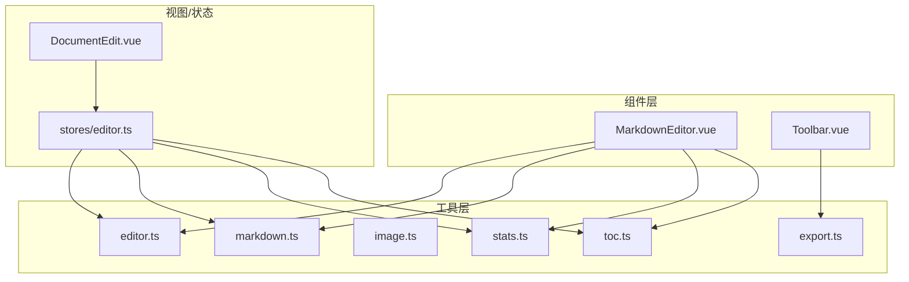
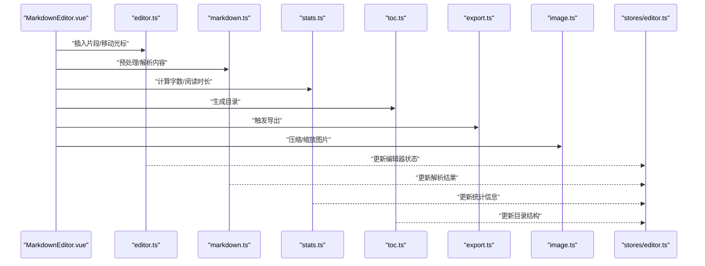
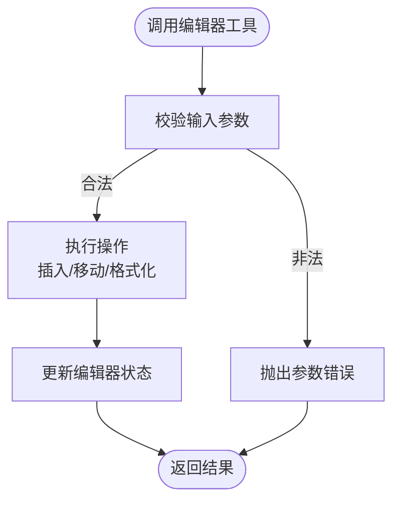
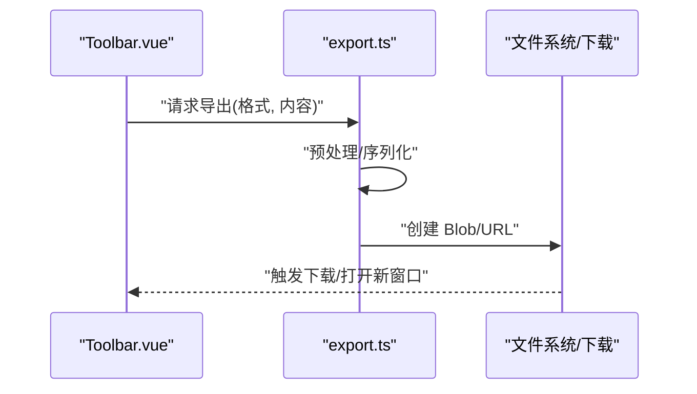
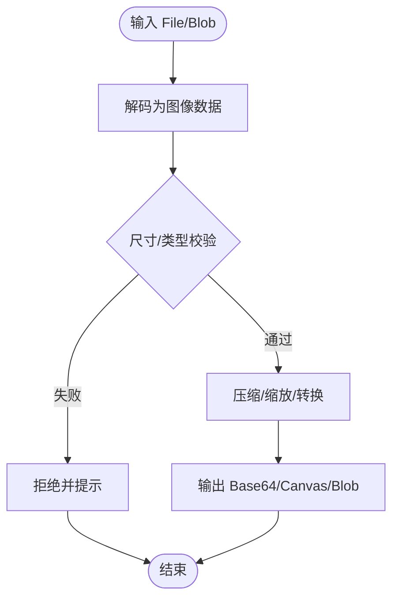
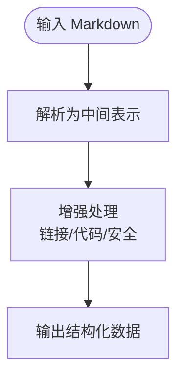
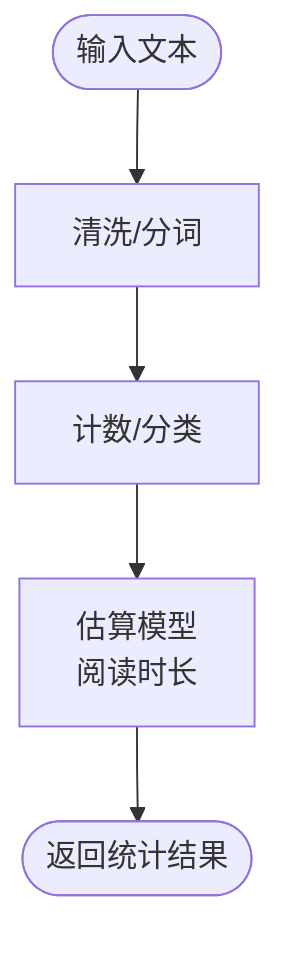
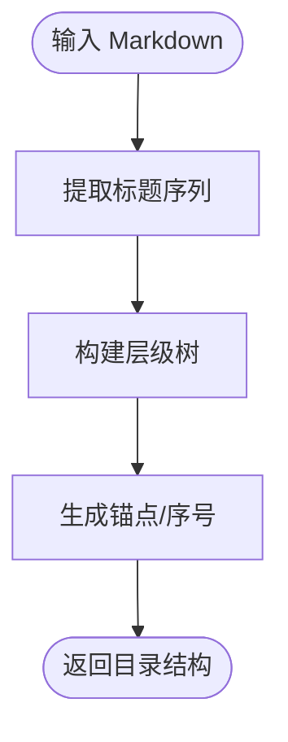
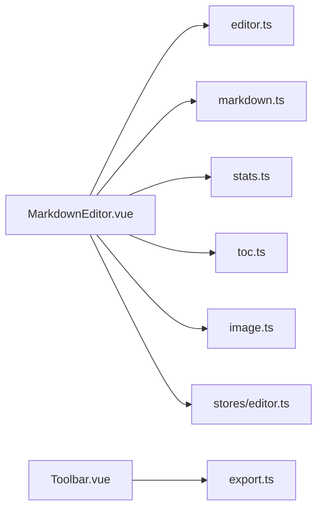

# 工具函数

<cite>
**本文引用的文件**
- [src/utils/editor.ts](file://src/utils/editor.ts)
- [src/utils/export.ts](file://src/utils/export.ts)
- [src/utils/image.ts](file://src/utils/image.ts)
- [src/utils/markdown.ts](file://src/utils/markdown.ts)
- [src/utils/stats.ts](file://src/utils/stats.ts)
- [src/utils/toc.ts](file://src/utils/toc.ts)
- [src/components/MarkdownEditor.vue](file://src/components/MarkdownEditor.vue)
- [src/components/Toolbar.vue](file://src/components/Toolbar.vue)
- [src/views/DocumentEdit.vue](file://src/views/DocumentEdit.vue)
- [src/stores/editor.ts](file://src/stores/editor.ts)
</cite>

## 目录
1. [简介](#简介)
2. [项目结构](#项目结构)
3. [核心组件](#核心组件)
4. [架构总览](#架构总览)
5. [详细组件分析](#详细组件分析)
6. [依赖关系分析](#依赖关系分析)
7. [性能考虑](#性能考虑)
8. [故障排查指南](#故障排查指南)
9. [结论](#结论)
10. [附录](#附录)

## 简介
本章节面向编辑器、导出、图像处理、Markdown 处理、统计与目录生成等工具函数，提供系统化文档。内容涵盖：
- 各工具函数的职责边界与调用时机
- 函数签名、参数说明、返回值格式与使用示例（以路径引用形式给出）
- 扩展方法与自定义配置选项
- 在业务逻辑中的高效使用方式

## 项目结构
工具函数集中于 src/utils 目录，按功能域拆分：
- editor.ts：编辑器辅助（光标操作、选区、插入片段等）
- export.ts：导出能力（导出为不同格式或触发下载）
- image.ts：图像处理（压缩、尺寸调整、预览等）
- markdown.ts：Markdown 解析与增强（标题提取、链接处理、代码块高亮预处理等）
- stats.ts：统计工具（字数、行数、段落数、阅读时长估算等）
- toc.ts：目录生成（基于标题层级构建 TOC）

这些工具被编辑器组件、视图与状态管理模块复用，形成“工具层 -> 组件层 -> 视图/状态”的清晰分层。

图表来源
- [src/utils/editor.ts](file://src/utils/editor.ts)
- [src/utils/export.ts](file://src/utils/export.ts)
- [src/utils/image.ts](file://src/utils/image.ts)
- [src/utils/markdown.ts](file://src/utils/markdown.ts)
- [src/utils/stats.ts](file://src/utils/stats.ts)
- [src/utils/toc.ts](file://src/utils/toc.ts)
- [src/components/MarkdownEditor.vue](file://src/components/MarkdownEditor.vue)
- [src/components/Toolbar.vue](file://src/components/Toolbar.vue)
- [src/views/DocumentEdit.vue](file://src/views/DocumentEdit.vue)
- [src/stores/editor.ts](file://src/stores/editor.ts)

章节来源
- [src/utils/editor.ts](file://src/utils/editor.ts)
- [src/utils/export.ts](file://src/utils/export.ts)
- [src/utils/image.ts](file://src/utils/image.ts)
- [src/utils/markdown.ts](file://src/utils/markdown.ts)
- [src/utils/stats.ts](file://src/utils/stats.ts)
- [src/utils/toc.ts](file://src/utils/toc.ts)
- [src/components/MarkdownEditor.vue](file://src/components/MarkdownEditor.vue)
- [src/components/Toolbar.vue](file://src/components/Toolbar.vue)
- [src/views/DocumentEdit.vue](file://src/views/DocumentEdit.vue)
- [src/stores/editor.ts](file://src/stores/editor.ts)

## 核心组件
本节聚焦工具层的六大模块，分别说明其职责、典型 API、输入输出约定与使用要点。

- 编辑器工具（editor.ts）
  - 职责：封装光标定位、选区操作、插入模板、格式化片段等高频编辑动作
  - 典型能力：获取/设置光标位置、插入文本/HTML、选中整段、撤销/重做桥接
  - 使用场景：工具栏按钮、快捷键、自动补全、批量替换
  - 参考实现路径：[编辑器工具](file://src/utils/editor.ts)

- 导出工具（export.ts）
  - 职责：将 Markdown/渲染结果导出为多种格式并触发下载
  - 典型能力：导出为 HTML/PDF/图片/纯文本；文件名与编码处理；跨浏览器兼容
  - 使用场景：工具栏“导出”菜单、快捷键导出、批量导出
  - 参考实现路径：[导出工具](file://src/utils/export.ts)

- 图像处理（image.ts）
  - 职责：对图片进行压缩、缩放、格式转换、Base64 预览等
  - 典型能力：读取 File/Blob、Canvas 绘制、质量控制、尺寸限制、异步回调
  - 使用场景：粘贴图片自动压缩、上传前校验、本地预览
  - 参考实现路径：[图像处理](file://src/utils/image.ts)

- Markdown 处理（markdown.ts）
  - 职责：解析与增强 Markdown 内容，如标题提取、链接规范化、代码块标记、安全过滤
  - 典型能力：解析为 AST/对象树、提取元信息、注入类名、转义危险内容
  - 使用场景：渲染前预处理、TOC 生成、统计、导出前清洗
  - 参考实现路径：[Markdown 处理](file://src/utils/markdown.ts)

- 统计工具（stats.ts）
  - 职责：计算文档统计指标（字数、行数、段落数、阅读时长估算等）
  - 典型能力：中/英文字数统计、代码行识别、空行过滤、阅读速度模型
  - 使用场景：状态栏显示、发布前检查、学习进度
  - 参考实现路径：[统计工具](file://src/utils/stats.ts)

- 目录生成（toc.ts）
  - 职责：根据标题层级生成可导航的目录结构
  - 典型能力：标题抽取、层级映射、锚点生成、重复标题去重
  - 使用场景：侧边栏目录、跳转定位、打印目录
  - 参考实现路径：[目录生成](file://src/utils/toc.ts)

章节来源
- [src/utils/editor.ts](file://src/utils/editor.ts)
- [src/utils/export.ts](file://src/utils/export.ts)
- [src/utils/image.ts](file://src/utils/image.ts)
- [src/utils/markdown.ts](file://src/utils/markdown.ts)
- [src/utils/stats.ts](file://src/utils/stats.ts)
- [src/utils/toc.ts](file://src/utils/toc.ts)

## 架构总览
下图展示工具函数在应用中的协作关系：编辑器组件与工具层交互，视图与状态管理通过工具完成数据流转与持久化。

图表来源
- [src/components/MarkdownEditor.vue](file://src/components/MarkdownEditor.vue)
- [src/utils/editor.ts](file://src/utils/editor.ts)
- [src/utils/markdown.ts](file://src/utils/markdown.ts)
- [src/utils/stats.ts](file://src/utils/stats.ts)
- [src/utils/toc.ts](file://src/utils/toc.ts)
- [src/utils/export.ts](file://src/utils/export.ts)
- [src/utils/image.ts](file://src/utils/image.ts)
- [src/stores/editor.ts](file://src/stores/editor.ts)

## 详细组件分析

### 编辑器工具（editor.ts）
- 设计模式：命令式 API + 可选配置对象
- 关键能力
  - 光标定位与选区操作：支持精确到字符/单词/行的选择
  - 片段插入：支持模板、占位符、富文本片段
  - 格式化：缩进、换行、清理多余空白
  - 撤销/重做：与编辑器历史栈集成
- 复杂度分析
  - 选区遍历 O(n)，n 为选区长度
  - 片段插入 O(m)，m 为插入内容长度
- 错误处理
  - 非法偏移保护、不可写区域拦截、类型校验
- 扩展方法
  - 注册自定义片段处理器
  - 自定义格式化规则（正则/AST）
- 使用示例（路径引用）
  - 插入模板片段：[插入片段示例](file://src/utils/editor.ts)
  - 移动光标到末尾：[光标定位示例](file://src/utils/editor.ts)

图表来源
- [src/utils/editor.ts](file://src/utils/editor.ts)

章节来源
- [src/utils/editor.ts](file://src/utils/editor.ts)

### 导出工具（export.ts）
- 设计模式：策略模式（多格式导出）、工厂（创建下载任务）
- 关键能力
  - 导出为 HTML/PDF/图片/纯文本
  - 文件名与编码处理、MIME 类型推断
  - 跨浏览器兼容（Blob URL、download 属性、打印窗口）
- 复杂度分析
  - 渲染/序列化 O(n)，n 为内容大小
  - 图片导出受 Canvas 尺寸影响
- 错误处理
  - 权限不足、内存溢出、不支持的格式降级
- 扩展方法
  - 新增导出格式插件
  - 自定义文件名模板
- 使用示例（路径引用）
  - 导出为 HTML：[导出 HTML 示例](file://src/utils/export.ts)
  - 导出为图片：[导出图片示例](file://src/utils/export.ts)

图表来源
- [src/components/Toolbar.vue](file://src/components/Toolbar.vue)
- [src/utils/export.ts](file://src/utils/export.ts)

章节来源
- [src/utils/export.ts](file://src/utils/export.ts)
- [src/components/Toolbar.vue](file://src/components/Toolbar.vue)

### 图像处理（image.ts）
- 设计模式：流水线（读取->处理->输出）
- 关键能力
  - 读取 File/Blob，转为 Base64/Canvas
  - 压缩（质量参数）、缩放（保持比例/裁剪）
  - 格式转换（JPEG/PNG/WebP）
  - 尺寸限制与校验
- 复杂度分析
  - 解码/编码 O(w*h)，w/h 为图像宽高
  - 压缩质量与体积权衡
- 错误处理
  - 非图片类型拒绝、超大图限制、内存不足回退
- 扩展方法
  - 注册滤镜/水印
  - 自定义压缩算法
- 使用示例（路径引用）
  - 压缩图片：[压缩示例](file://src/utils/image.ts)
  - 生成预览：[预览示例](file://src/utils/image.ts)

图表来源
- [src/utils/image.ts](file://src/utils/image.ts)

章节来源
- [src/utils/image.ts](file://src/utils/image.ts)

### Markdown 处理（markdown.ts）
- 设计模式：管道（解析->增强->输出）
- 关键能力
  - 标题提取、链接规范化、代码块标记
  - 安全过滤（XSS 防护）、类名注入
  - 元信息提取（front-matter）
- 复杂度分析
  - 解析 O(n)，n 为内容长度
  - 增强阶段附加开销较小
- 错误处理
  - 语法容错、未知标签忽略、异常节点跳过
- 扩展方法
  - 自定义解析器/处理器
  - 注入全局样式类
- 使用示例（路径引用）
  - 提取标题：[标题提取示例](file://src/utils/markdown.ts)
  - 安全过滤：[过滤示例](file://src/utils/markdown.ts)

图表来源
- [src/utils/markdown.ts](file://src/utils/markdown.ts)

章节来源
- [src/utils/markdown.ts](file://src/utils/markdown.ts)

### 统计工具（stats.ts）
- 设计模式：函数式（纯函数为主）
- 关键能力
  - 字数统计（中文/英文混合）
  - 行数、段落数、代码行识别
  - 阅读时长估算（基于语速模型）
- 复杂度分析
  - 扫描 O(n)，n 为内容长度
- 错误处理
  - 空内容处理、特殊字符兼容
- 扩展方法
  - 自定义词法分词规则
  - 调整阅读速度模型
- 使用示例（路径引用）
  - 统计字数：[字数统计示例](file://src/utils/stats.ts)
  - 估算阅读时间：[阅读时长示例](file://src/utils/stats.ts)

图表来源
- [src/utils/stats.ts](file://src/utils/stats.ts)

章节来源
- [src/utils/stats.ts](file://src/utils/stats.ts)

### 目录生成（toc.ts）
- 设计模式：树构建（基于标题层级）
- 关键能力
  - 标题抽取、层级映射、锚点生成
  - 重复标题去重、序号生成
- 复杂度分析
  - 构建 O(h)，h 为标题数量
- 错误处理
  - 无标题时返回空目录、非法层级修正
- 扩展方法
  - 自定义标题匹配规则
  - 自定义锚点策略
- 使用示例（路径引用）
  - 生成目录：[目录生成示例](file://src/utils/toc.ts)

图表来源
- [src/utils/toc.ts](file://src/utils/toc.ts)

章节来源
- [src/utils/toc.ts](file://src/utils/toc.ts)

## 依赖关系分析
工具层内部相对低耦合，主要依赖浏览器 API（File、Canvas、Blob、URL）。上层组件通过明确接口调用，避免直接操作 DOM。

图表来源
- [src/components/MarkdownEditor.vue](file://src/components/MarkdownEditor.vue)
- [src/components/Toolbar.vue](file://src/components/Toolbar.vue)
- [src/utils/editor.ts](file://src/utils/editor.ts)
- [src/utils/markdown.ts](file://src/utils/markdown.ts)
- [src/utils/stats.ts](file://src/utils/stats.ts)
- [src/utils/toc.ts](file://src/utils/toc.ts)
- [src/utils/export.ts](file://src/utils/export.ts)
- [src/utils/image.ts](file://src/utils/image.ts)
- [src/stores/editor.ts](file://src/stores/editor.ts)

章节来源
- [src/components/MarkdownEditor.vue](file://src/components/MarkdownEditor.vue)
- [src/components/Toolbar.vue](file://src/components/Toolbar.vue)
- [src/utils/editor.ts](file://src/utils/editor.ts)
- [src/utils/markdown.ts](file://src/utils/markdown.ts)
- [src/utils/stats.ts](file://src/utils/stats.ts)
- [src/utils/toc.ts](file://src/utils/toc.ts)
- [src/utils/export.ts](file://src/utils/export.ts)
- [src/utils/image.ts](file://src/utils/image.ts)
- [src/stores/editor.ts](file://src/stores/editor.ts)

## 性能考虑
- 编辑器工具
  - 批量操作合并以减少重排重绘
  - 大文档分片处理，避免主线程阻塞
- 导出工具
  - 按需渲染，减少无用节点
  - 大文档导出采用流式或分块策略
- 图像处理
  - 限制最大分辨率与质量阈值
  - 使用 Web Worker 或 OffscreenCanvas 降低卡顿
- Markdown 处理
  - 缓存解析结果，增量更新
  - 安全过滤与类名注入尽量一次性完成
- 统计工具
  - 增量统计，仅对变更部分重新计算
  - 阅读时长估算使用近似模型，避免复杂分词
- 目录生成
  - 标题变化时增量重建目录树
  - 锚点生成去重与稳定排序

## 故障排查指南
- 编辑器工具
  - 症状：光标错位、选区失效
  - 排查：检查偏移合法性、是否处于只读区域
  - 参考：[编辑器工具](file://src/utils/editor.ts)
- 导出工具
  - 症状：下载失败、格式不支持
  - 排查：确认 MIME 类型、浏览器兼容性、权限
  - 参考：[导出工具](file://src/utils/export.ts)
- 图像处理
  - 症状：内存溢出、压缩后失真
  - 排查：限制尺寸与质量、降级策略
  - 参考：[图像处理](file://src/utils/image.ts)
- Markdown 处理
  - 症状：渲染异常、链接失效
  - 排查：检查解析器配置、链接规范化规则
  - 参考：[Markdown 处理](file://src/utils/markdown.ts)
- 统计工具
  - 症状：字数偏差、阅读时长不准
  - 排查：分词规则、语速模型参数
  - 参考：[统计工具](file://src/utils/stats.ts)
- 目录生成
  - 症状：目录缺失、锚点重复
  - 排查：标题匹配规则、去重策略
  - 参考：[目录生成](file://src/utils/toc.ts)

章节来源
- [src/utils/editor.ts](file://src/utils/editor.ts)
- [src/utils/export.ts](file://src/utils/export.ts)
- [src/utils/image.ts](file://src/utils/image.ts)
- [src/utils/markdown.ts](file://src/utils/markdown.ts)
- [src/utils/stats.ts](file://src/utils/stats.ts)
- [src/utils/toc.ts](file://src/utils/toc.ts)

## 结论
本工具层以清晰的职责划分与稳定的接口契约，支撑编辑器、导出、图像处理、Markdown 处理、统计与目录生成等核心能力。通过模块化设计与可扩展机制，可在不侵入业务逻辑的前提下快速迭代与定制。建议在实际使用中遵循以下原则：
- 优先使用工具层提供的统一接口，避免直接操作 DOM
- 对大数据量场景采用分片/增量/缓存策略
- 严格参数校验与错误降级，提升鲁棒性
- 通过配置项与插件机制扩展能力，保持核心稳定

## 附录
- 常用组合流程
  - 编辑->统计->导出：在 MarkdownEditor 中监听内容变化，调用 stats 更新统计，用户点击导出时调用 export
  - 粘贴图片->压缩->插入：监听粘贴事件，使用 image 压缩后插入编辑器
  - 解析->目录->导航：解析 Markdown 后生成 TOC，点击跳转定位
- 配置项建议
  - 编辑器：默认片段库、快捷键绑定、格式化规则
  - 导出：默认格式、文件名模板、编码
  - 图像：最大尺寸、质量阈值、目标格式
  - Markdown：安全级别、类名前缀、链接处理策略
  - 统计：语速模型、代码行识别规则
  - 目录：标题匹配规则、锚点策略、序号格式