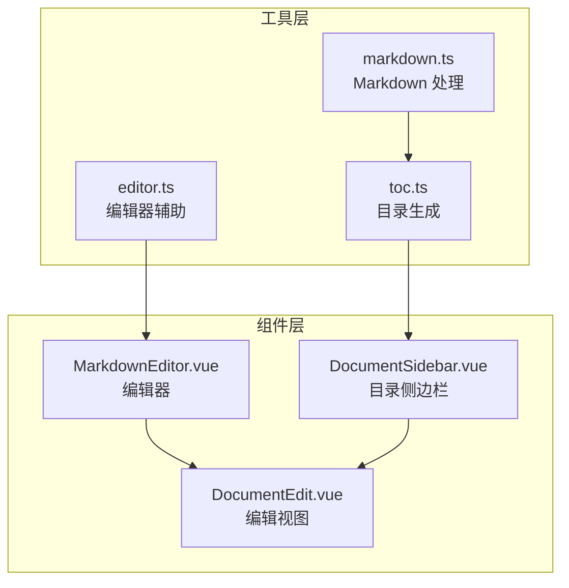
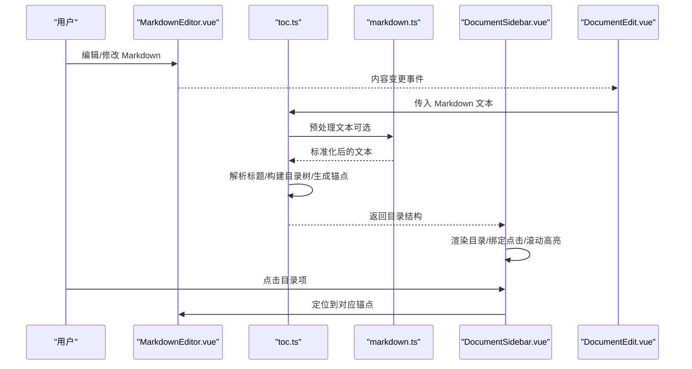
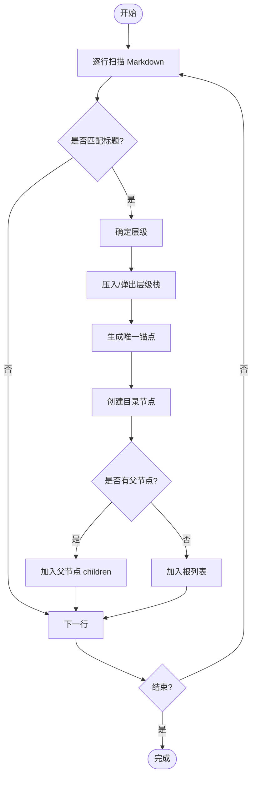
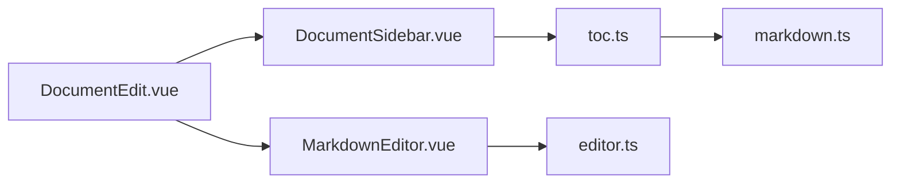

# 目录生成工具函数

<cite>
**本文引用的文件**
- [toc.ts](file://src/utils/toc.ts)
- [markdown.ts](file://src/utils/markdown.ts)
- [editor.ts](file://src/utils/editor.ts)
- [DocumentSidebar.vue](file://src/components/DocumentSidebar.vue)
- [MarkdownEditor.vue](file://src/components/MarkdownEditor.vue)
- [DocumentEdit.vue](file://src/views/DocumentEdit.vue)
</cite>

## 目录
1. [简介](#简介)
2. [项目结构](#项目结构)
3. [核心组件](#核心组件)
4. [架构总览](#架构总览)
5. [详细组件分析](#详细组件分析)
6. [依赖关系分析](#依赖关系分析)
7. [性能考虑](#性能考虑)
8. [故障排查指南](#故障排查指南)
9. [结论](#结论)
10. [附录](#附录)

## 简介
本文件面向“Markdown 文档目录自动生成功能”的实现与使用，围绕以下目标展开：
- 标题解析算法、层级结构构建与导航链接生成的原理说明
- 目录配置项与样式定制方法
- 目录与文档内容的同步更新机制
- 大文档目录的性能优化与懒加载策略
- 在编辑器中集成目录导航的实践建议

该功能通过解析 Markdown 中的标题语法，构建可导航的目录树，并渲染为侧边栏或内嵌导航，支持滚动高亮、点击跳转、按需展开等交互。

## 项目结构
与目录生成相关的代码主要位于 utils 与 components 两个层次：
- utils 层提供纯函数能力：标题解析、目录树构建、锚点生成、统计信息等
- components 层负责 UI 呈现与交互：侧边栏目录、编辑器联动、滚动监听等

**图示来源**
- [toc.ts](file://src/utils/toc.ts)
- [markdown.ts](file://src/utils/markdown.ts)
- [editor.ts](file://src/utils/editor.ts)
- [DocumentSidebar.vue](file://src/components/DocumentSidebar.vue)
- [MarkdownEditor.vue](file://src/components/MarkdownEditor.vue)
- [DocumentEdit.vue](file://src/views/DocumentEdit.vue)

**章节来源**
- [toc.ts](file://src/utils/toc.ts)
- [markdown.ts](file://src/utils/markdown.ts)
- [editor.ts](file://src/utils/editor.ts)
- [DocumentSidebar.vue](file://src/components/DocumentSidebar.vue)
- [MarkdownEditor.vue](file://src/components/MarkdownEditor.vue)
- [DocumentEdit.vue](file://src/views/DocumentEdit.vue)

## 核心组件
- 目录生成器（toc.ts）
  - 职责：从 Markdown 文本中提取标题、构建层级目录树、生成唯一锚点、计算统计信息
  - 关键能力：标题正则匹配、层级栈管理、重复标题去重、锚点规范化、可选深度限制
- Markdown 处理（markdown.ts）
  - 职责：对 Markdown 进行预处理/后处理（如清理不可见字符、统一换行、提取元数据等），为目录生成提供稳定输入
- 编辑器辅助（editor.ts）
  - 职责：与编辑器实例交互，获取/设置内容、光标定位、选区操作、事件桥接
- 目录侧边栏（DocumentSidebar.vue）
  - 职责：渲染目录树、处理点击跳转、滚动高亮、展开/折叠、懒加载子节点
- 编辑器组件（MarkdownEditor.vue）
  - 职责：承载编辑器实例，暴露内容变更事件，与目录组件联动
- 编辑视图（DocumentEdit.vue）
  - 职责：编排编辑器与目录组件，管理状态与生命周期

**章节来源**
- [toc.ts](file://src/utils/toc.ts)
- [markdown.ts](file://src/utils/markdown.ts)
- [editor.ts](file://src/utils/editor.ts)
- [DocumentSidebar.vue](file://src/components/DocumentSidebar.vue)
- [MarkdownEditor.vue](file://src/components/MarkdownEditor.vue)
- [DocumentEdit.vue](file://src/views/DocumentEdit.vue)

## 架构总览
目录生成与展示的整体流程如下：

**图示来源**
- [DocumentSidebar.vue](file://src/components/DocumentSidebar.vue)
- [MarkdownEditor.vue](file://src/components/MarkdownEditor.vue)
- [DocumentEdit.vue](file://src/views/DocumentEdit.vue)
- [toc.ts](file://src/utils/toc.ts)
- [markdown.ts](file://src/utils/markdown.ts)

## 详细组件分析

### 标题解析与目录树构建（toc.ts）
- 标题识别
  - 基于 Markdown 标题语法进行匹配，按层级组织
  - 支持自定义深度上限，避免过深层级影响性能
- 层级栈管理
  - 使用栈维护当前路径，遇到更高层级时回退至父级
  - 保证父子关系正确，便于后续渲染与展开/折叠
- 锚点生成
  - 将标题文本转换为稳定的 URL 片段标识符
  - 处理重复标题：追加序号或短后缀，确保唯一性
  - 兼容不同渲染器的锚点规则，必要时提供映射表
- 统计信息
  - 统计标题数量、各级别数量、最大深度等，用于 UI 提示与性能监控

**图示来源**
- [toc.ts](file://src/utils/toc.ts)

**章节来源**
- [toc.ts](file://src/utils/toc.ts)

### Markdown 预处理（markdown.ts）
- 作用
  - 清洗不可见字符、统一换行、移除干扰标记，提高标题匹配的稳定性
  - 可选：提取 YAML front matter、保留注释等
- 输出
  - 标准化的 Markdown 文本，供目录生成器稳定解析

**章节来源**
- [markdown.ts](file://src/utils/markdown.ts)

### 编辑器联动（editor.ts）
- 能力
  - 获取/设置编辑器内容
  - 根据锚点定位光标或滚动到目标位置
  - 选区操作、撤销/重做桥接
- 与目录的协作
  - 目录点击后调用定位方法，实现平滑跳转
  - 编辑器内容变化时触发目录重建（可节流/防抖）

**章节来源**
- [editor.ts](file://src/utils/editor.ts)

### 目录侧边栏（DocumentSidebar.vue）
- 渲染
  - 递归渲染目录树，支持展开/折叠
  - 根据当前滚动位置高亮活跃标题
- 交互
  - 点击目录项跳转到对应锚点
  - 支持懒加载子节点（仅当需要时请求或生成深层目录）
- 配置
  - 可配置显示层级、是否显示搜索框、是否启用滚动高亮等

**章节来源**
- [DocumentSidebar.vue](file://src/components/DocumentSidebar.vue)

### 编辑器组件（MarkdownEditor.vue）
- 职责
  - 封装编辑器实例，暴露内容变更事件
  - 与目录组件共享文档内容，保持同步
- 集成要点
  - 在内容变化时通知上层，由上层决定是否重建目录
  - 提供定位回调，配合目录点击跳转

**章节来源**
- [MarkdownEditor.vue](file://src/components/MarkdownEditor.vue)

### 编辑视图（DocumentEdit.vue）
- 编排
  - 组合编辑器与目录组件，管理文档状态
  - 处理生命周期：挂载时初始化、卸载时清理监听
- 同步机制
  - 监听编辑器内容变化，调用目录生成器重建目录
  - 监听滚动事件，更新目录高亮

**章节来源**
- [DocumentEdit.vue](file://src/views/DocumentEdit.vue)

## 依赖关系分析
- 模块耦合
  - DocumentSidebar.vue 依赖 toc.ts 提供的目录结构与锚点
  - MarkdownEditor.vue 与 editor.ts 紧密耦合，负责内容读写与定位
  - DocumentEdit.vue 作为协调者，串联编辑器与目录
- 外部依赖
  - 可能依赖第三方 Markdown 解析库或编辑器 SDK（具体以实际引入为准）
- 潜在循环依赖
  - 通过单向数据流（视图 -> 工具 -> 组件）避免循环引用

**图示来源**
- [DocumentEdit.vue](file://src/views/DocumentEdit.vue)
- [DocumentSidebar.vue](file://src/components/DocumentSidebar.vue)
- [MarkdownEditor.vue](file://src/components/MarkdownEditor.vue)
- [toc.ts](file://src/utils/toc.ts)
- [editor.ts](file://src/utils/editor.ts)
- [markdown.ts](file://src/utils/markdown.ts)

**章节来源**
- [DocumentEdit.vue](file://src/views/DocumentEdit.vue)
- [DocumentSidebar.vue](file://src/components/DocumentSidebar.vue)
- [MarkdownEditor.vue](file://src/components/MarkdownEditor.vue)
- [toc.ts](file://src/utils/toc.ts)
- [editor.ts](file://src/utils/editor.ts)
- [markdown.ts](file://src/utils/markdown.ts)

## 性能考虑
- 解析优化
  - 增量解析：仅在内容变化时重新解析，避免全量重建
  - 深度限制：默认限制目录最大层级，减少 DOM 节点数量
  - 文本预处理缓存：对相同内容复用预处理结果
- 渲染优化
  - 虚拟滚动：长目录采用虚拟列表，仅渲染可视区域
  - 懒加载：首次只渲染前 N 层，滚动到底部再加载剩余
  - 防抖/节流：滚动高亮与目录重建使用防抖/节流降低频率
- 内存与 GC
  - 及时释放旧目录树引用，避免内存泄漏
  - 避免在高频回调中创建大量临时对象

[本节为通用性能建议，不直接分析具体文件]

## 故障排查指南
- 常见问题
  - 目录未更新：检查编辑器内容变更事件是否正确触发；确认目录重建逻辑已执行
  - 锚点无效：确认标题已生成唯一锚点；检查渲染器是否支持该锚点格式
  - 滚动高亮异常：检查滚动监听是否被移除；确认容器高度与滚动范围计算正确
- 调试建议
  - 打印目录树结构，验证层级与锚点是否符合预期
  - 在编辑器中插入最小化测试用例，逐步定位问题
  - 使用浏览器性能面板观察解析与渲染耗时

**章节来源**
- [DocumentSidebar.vue](file://src/components/DocumentSidebar.vue)
- [MarkdownEditor.vue](file://src/components/MarkdownEditor.vue)
- [DocumentEdit.vue](file://src/views/DocumentEdit.vue)
- [toc.ts](file://src/utils/toc.ts)
- [editor.ts](file://src/utils/editor.ts)

## 结论
本方案通过清晰的职责划分与模块化设计，实现了 Markdown 文档目录的自动生成与高效展示。标题解析、层级构建与锚点生成在工具层完成，UI 层专注交互与渲染，二者通过明确接口协作。结合增量解析、虚拟滚动与懒加载等策略，可在大文档场景下保持良好性能。建议在编辑器中集成目录导航以提升阅读与写作效率。

[本节为总结性内容，不直接分析具体文件]

## 附录
- 配置项参考（示例字段，具体以实现为准）
  - maxDepth：最大显示层级
  - showSearch：是否显示搜索框
  - enableHighlight：是否启用滚动高亮
  - lazyLoad：是否启用懒加载
  - anchorPrefix：锚点前缀（用于多文档隔离）
- 样式定制
  - 通过 CSS 变量或主题类名覆盖目录项样式
  - 针对活跃项、悬停态、折叠态定义差异化样式
- 集成步骤（概览）
  - 在编辑视图中引入目录组件与工具函数
  - 订阅编辑器内容变更，调用目录生成器
  - 为目录项绑定点击跳转逻辑
  - 添加滚动监听，更新活跃项

[本节为概念性说明，不直接分析具体文件]