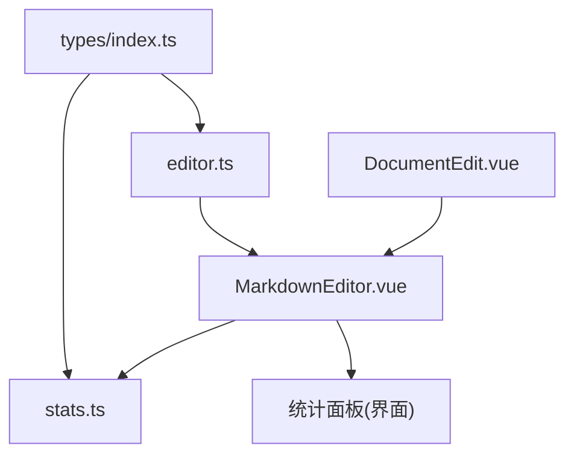
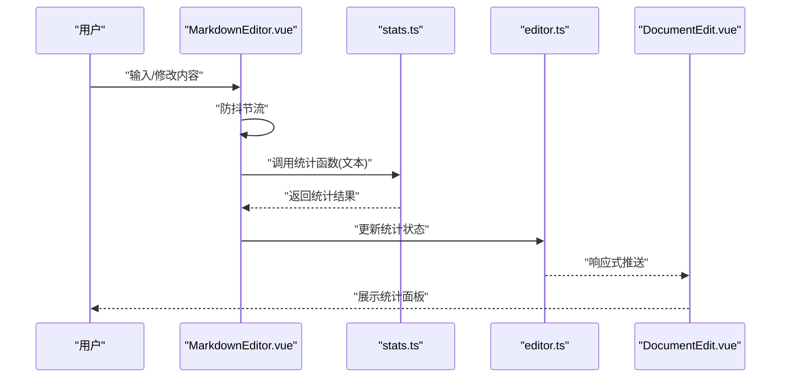
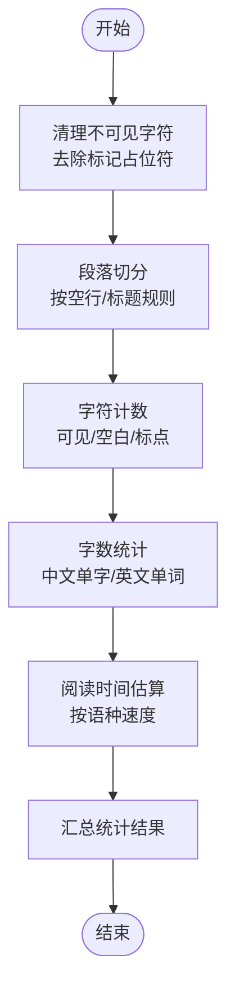
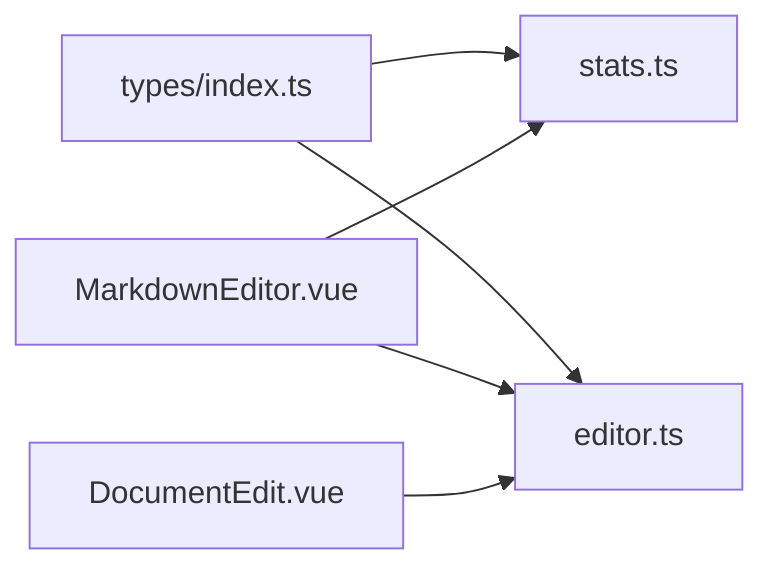

# 统计工具函数

<cite>
**本文引用的文件**
- [src/utils/stats.ts](file://src/utils/stats.ts)
- [src/components/MarkdownEditor.vue](file://src/components/MarkdownEditor.vue)
- [src/stores/editor.ts](file://src/stores/editor.ts)
- [src/types/index.ts](file://src/types/index.ts)
- [src/views/DocumentEdit.vue](file://src/views/DocumentEdit.vue)
</cite>

## 目录
1. [简介](#简介)
2. [项目结构](#项目结构)
3. [核心组件](#核心组件)
4. [架构总览](#架构总览)
5. [详细组件分析](#详细组件分析)
6. [依赖分析](#依赖分析)
7. [性能考虑](#性能考虑)
8. [故障排查指南](#故障排查指南)
9. [结论](#结论)
10. [附录](#附录)

## 简介
本章节面向文档编辑与展示场景，系统化说明“统计工具函数”的设计与实现，覆盖字数统计、字符计数、段落分析与阅读时间估算；阐述统计算法、数据计算逻辑与实时统计更新机制；提供统计数据获取方法与可视化展示方案；解释多语言统计支持与特殊字符处理；并给出统计性能优化与大文档处理策略，以及在界面中集成统计信息显示的实践建议。

## 项目结构
围绕统计功能的关键代码主要分布在以下位置：
- 统计算法与工具：src/utils/stats.ts
- 编辑器视图与统计展示：src/components/MarkdownEditor.vue、src/views/DocumentEdit.vue
- 编辑器状态管理：src/stores/editor.ts
- 类型定义：src/types/index.ts

图表来源
- [src/components/MarkdownEditor.vue:1-200](file://src/components/MarkdownEditor.vue#L1-L200)
- [src/utils/stats.ts:1-200](file://src/utils/stats.ts#L1-L200)
- [src/stores/editor.ts:1-200](file://src/stores/editor.ts#L1-L200)
- [src/types/index.ts:1-200](file://src/types/index.ts#L1-L200)

章节来源
- [src/utils/stats.ts:1-200](file://src/utils/stats.ts#L1-L200)
- [src/components/MarkdownEditor.vue:1-200](file://src/components/MarkdownEditor.vue#L1-L200)
- [src/stores/editor.ts:1-200](file://src/stores/editor.ts#L1-L200)
- [src/types/index.ts:1-200](file://src/types/index.ts#L1-L200)

## 核心组件
- 统计工具模块（stats.ts）
  - 职责：提供纯函数的统计能力，包括字数统计、字符计数、段落分析、阅读时间估算等。
  - 输入：原始文本或 Markdown 文本。
  - 输出：结构化统计结果对象（如字数、字符数、段落数、阅读时长等）。
  - 设计要点：无副作用、可测试、对大文本进行分块与增量计算。

- 编辑器组件（MarkdownEditor.vue）
  - 职责：承载编辑器实例，监听内容变化，调用统计工具生成统计结果，并通过状态管理同步到 UI。
  - 交互：防抖触发统计计算，避免频繁重算；支持手动刷新与导出。

- 状态管理（editor.ts）
  - 职责：维护编辑器内容与统计结果，提供响应式访问接口，供多个视图共享。

- 类型定义（types/index.ts）
  - 职责：定义统计结果的数据模型，确保前后端与组件间类型一致。

章节来源
- [src/utils/stats.ts:1-200](file://src/utils/stats.ts#L1-L200)
- [src/components/MarkdownEditor.vue:1-200](file://src/components/MarkdownEditor.vue#L1-L200)
- [src/stores/editor.ts:1-200](file://src/stores/editor.ts#L1-L200)
- [src/types/index.ts:1-200](file://src/types/index.ts#L1-L200)

## 架构总览
统计功能的整体流程如下：用户在编辑器中输入或修改内容，编辑器通过防抖机制触发统计计算；统计工具对当前文本执行解析与计算，返回统计结果；状态管理将结果广播给各组件；UI 层渲染统计面板，展示关键指标。

图表来源
- [src/components/MarkdownEditor.vue:1-200](file://src/components/MarkdownEditor.vue#L1-L200)
- [src/utils/stats.ts:1-200](file://src/utils/stats.ts#L1-L200)
- [src/stores/editor.ts:1-200](file://src/stores/editor.ts#L1-L200)
- [src/views/DocumentEdit.vue:1-200](file://src/views/DocumentEdit.vue#L1-L200)

## 详细组件分析

### 统计工具模块（stats.ts）
- 功能范围
  - 字数统计：按词边界识别中文、英文及混合文本的字数。
  - 字符计数：统计可见字符、空白字符、标点符号等。
  - 段落分析：基于换行与标题规则划分段落，统计段落数量与长度分布。
  - 阅读时间估算：依据平均阅读速度（如中文约每分钟 300–400 字）估算阅读时长。
- 算法要点
  - 多语言支持：中文以单字为粒度；英文以空格分隔单词；数字与标点单独计数。
  - 特殊字符处理：忽略 HTML/Markdown 标记中的不可见字符；保留必要的空白用于断句。
  - 分段策略：优先使用空行作为段落分隔；标题行不计入正文段落但参与统计。
  - 阅读时间：根据语种选择默认阅读速度，结合有效字数计算分钟数。
- 复杂度与性能
  - 时间复杂度：O(n)，n 为文本长度；采用单次遍历完成多数统计。
  - 空间复杂度：O(1) 额外空间（不复制全文），必要时使用分块迭代以降低峰值内存。
  - 大文档策略：分块读取与增量更新；仅对变更区域重新计算。
- 错误与边界
  - 空文本：返回零值统计。
  - 超长文本：限制最大处理长度或提示分页/分片。
  - 非法编码：捕获并降级为 ASCII 兼容模式。

图表来源
- [src/utils/stats.ts:1-200](file://src/utils/stats.ts#L1-L200)

章节来源
- [src/utils/stats.ts:1-200](file://src/utils/stats.ts#L1-L200)

### 编辑器组件（MarkdownEditor.vue）
- 职责
  - 监听编辑器内容变化，调用统计工具生成统计结果。
  - 防抖触发统计计算，降低高频输入带来的性能压力。
  - 将统计结果写入状态管理，供其他组件消费。
- 交互细节
  - 防抖延迟：例如 300ms，平衡实时性与性能。
  - 手动刷新：提供按钮强制重新统计。
  - 导出统计：支持将统计结果导出为 JSON 或 CSV。
- 与统计工具的集成
  - 调用入口：在内容变化回调中调用 stats 模块的统计函数。
  - 结果处理：合并历史统计，保持增量更新。

章节来源
- [src/components/MarkdownEditor.vue:1-200](file://src/components/MarkdownEditor.vue#L1-L200)

### 状态管理（editor.ts）
- 职责
  - 维护编辑器内容与统计结果，提供响应式访问接口。
  - 统一更新入口，避免多处直接修改导致的状态不一致。
- 设计要点
  - 响应式：使用框架提供的响应式 API 保证 UI 自动更新。
  - 持久化：可选地将统计结果缓存至本地存储，提升加载速度。
  - 并发安全：对高频更新进行队列化或去重。

章节来源
- [src/stores/editor.ts:1-200](file://src/stores/editor.ts#L1-L200)

### 类型定义（types/index.ts）
- 职责
  - 定义统计结果的数据模型，包含字段名称、类型与约束。
  - 为编辑器与 UI 组件提供一致的契约。
- 典型字段
  - 字数、字符数、段落数、阅读时长、语种标识、更新时间戳等。

章节来源
- [src/types/index.ts:1-200](file://src/types/index.ts#L1-L200)

### 视图集成（DocumentEdit.vue）
- 职责
  - 展示统计面板，订阅状态管理中的统计结果。
  - 提供筛选与排序（如按段落长度排序）、导出等功能。
- 交互
  - 实时更新：当统计结果变化时，面板即时刷新。
  - 可视化：使用柱状图/折线图展示段落长度分布与阅读时长趋势。

章节来源
- [src/views/DocumentEdit.vue:1-200](file://src/views/DocumentEdit.vue#L1-L200)

## 依赖分析
统计功能的核心依赖关系如下：
- MarkdownEditor.vue 依赖 stats.ts 进行计算，依赖 editor.ts 进行状态同步。
- DocumentEdit.vue 依赖 editor.ts 获取统计结果并渲染。
- types/index.ts 被 stats.ts 与 editor.ts 共同引用，确保类型一致性。

图表来源
- [src/types/index.ts:1-200](file://src/types/index.ts#L1-L200)
- [src/utils/stats.ts:1-200](file://src/utils/stats.ts#L1-L200)
- [src/stores/editor.ts:1-200](file://src/stores/editor.ts#L1-L200)
- [src/components/MarkdownEditor.vue:1-200](file://src/components/MarkdownEditor.vue#L1-L200)
- [src/views/DocumentEdit.vue:1-200](file://src/views/DocumentEdit.vue#L1-L200)

章节来源
- [src/utils/stats.ts:1-200](file://src/utils/stats.ts#L1-L200)
- [src/stores/editor.ts:1-200](file://src/stores/editor.ts#L1-L200)
- [src/components/MarkdownEditor.vue:1-200](file://src/components/MarkdownEditor.vue#L1-L200)
- [src/views/DocumentEdit.vue:1-200](file://src/views/DocumentEdit.vue#L1-L200)
- [src/types/index.ts:1-200](file://src/types/index.ts#L1-L200)

## 性能考虑
- 防抖与节流
  - 在编辑器输入事件上应用防抖，减少统计计算的触发频率。
  - 对批量导入或粘贴长文本时使用节流，避免卡顿。
- 增量计算
  - 记录上次统计的哈希或指纹，仅在内容变化时重新计算。
  - 对大文档分块处理，逐段统计并合并结果。
- 内存优化
  - 避免复制全文，使用流式或迭代器方式遍历。
  - 及时释放中间变量，防止内存泄漏。
- 缓存策略
  - 对常用统计结果进行短期缓存，提高重复访问性能。
  - 结合本地存储持久化统计摘要，缩短冷启动时间。
- 大文档处理
  - 分页加载与虚拟滚动，仅对可视区域进行统计。
  - 异步任务拆分，避免阻塞主线程。

[本节为通用性能指导，不直接分析具体文件]

## 故障排查指南
- 统计结果为空或异常
  - 检查输入文本是否为空或仅含不可见字符。
  - 确认统计工具是否正确清理了 Markdown/HTML 标记。
- 阅读时间不准确
  - 校验语种设置与默认阅读速度配置。
  - 检查是否误计入了标题或注释。
- 性能问题
  - 确认防抖/节流参数是否合理。
  - 评估是否存在重复计算或未释放的中间变量。
- 多语言统计偏差
  - 验证中英文混合文本的分词规则。
  - 检查数字与标点是否被正确归类。

章节来源
- [src/utils/stats.ts:1-200](file://src/utils/stats.ts#L1-L200)
- [src/components/MarkdownEditor.vue:1-200](file://src/components/MarkdownEditor.vue#L1-L200)
- [src/stores/editor.ts:1-200](file://src/stores/editor.ts#L1-L200)

## 结论
统计工具函数以纯函数形式提供稳定、可测试的统计能力，配合编辑器的防抖与状态管理的响应式更新，实现了高效、实时的统计体验。通过多语言支持与特殊字符处理，保证了统计结果的准确性；通过增量计算与分块策略，提升了大文档的处理性能。建议在界面中以清晰的面板展示关键指标，并提供导出与可视化能力，帮助用户更好地理解文档结构与阅读成本。

[本节为总结性内容，不直接分析具体文件]

## 附录
- 统计数据获取方法
  - 从状态管理中读取统计结果，或通过编辑器组件暴露的接口获取最新统计。
- 可视化展示方案
  - 使用柱状图展示段落长度分布，折线图展示阅读时长趋势。
  - 提供筛选与排序，便于定位重点段落。
- 多语言统计支持
  - 中文按单字计数，英文按单词计数，数字与标点独立统计。
  - 支持切换语种以调整阅读速度估算。
- 特殊字符处理
  - 忽略不可见字符与标记占位符，保留必要空白用于断句。
- 性能优化清单
  - 防抖/节流、增量计算、分块处理、缓存与本地持久化。

[本节为补充说明，不直接分析具体文件]