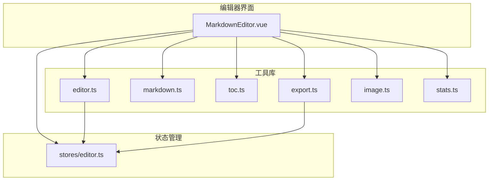
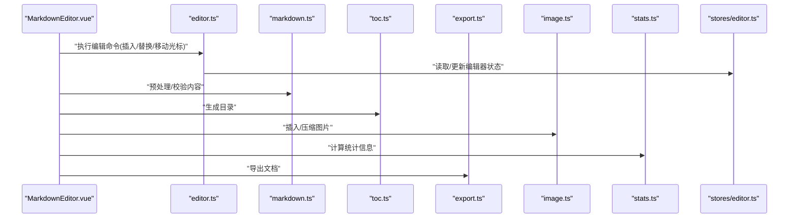
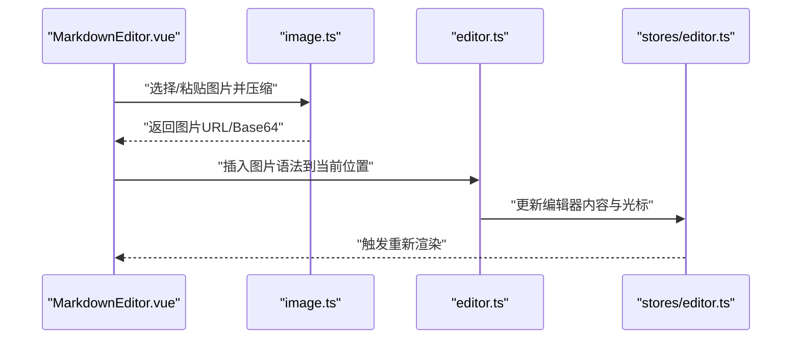
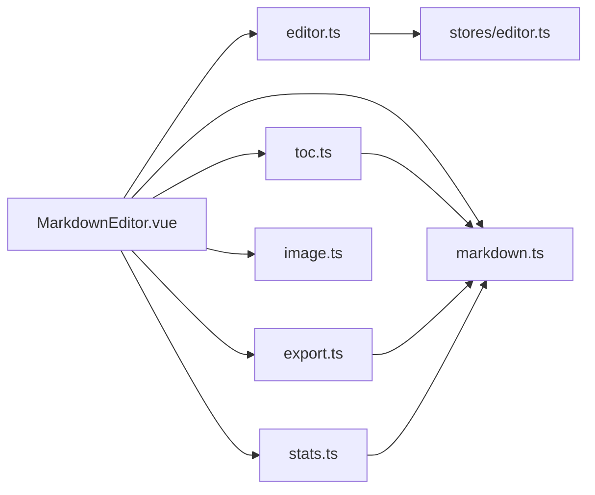

# 编辑器工具函数

<cite>
**本文引用的文件**
- [src/utils/editor.ts](file://src/utils/editor.ts)
- [src/utils/markdown.ts](file://src/utils/markdown.ts)
- [src/utils/toc.ts](file://src/utils/toc.ts)
- [src/utils/export.ts](file://src/utils/export.ts)
- [src/utils/image.ts](file://src/utils/image.ts)
- [src/utils/stats.ts](file://src/utils/stats.ts)
- [src/components/MarkdownEditor.vue](file://src/components/MarkdownEditor.vue)
- [src/stores/editor.ts](file://src/stores/editor.ts)
</cite>

## 目录
1. [简介](#简介)
2. [项目结构](#项目结构)
3. [核心组件](#核心组件)
4. [架构总览](#架构总览)
5. [详细组件分析](#详细组件分析)
6. [依赖关系分析](#依赖关系分析)
7. [性能考虑](#性能考虑)
8. [故障排查指南](#故障排查指南)
9. [结论](#结论)
10. [附录](#附录)

## 简介
本文件面向在 Markdown 编辑器中使用的“编辑器工具函数”，聚焦于文本处理、光标操作、内容验证与导出等能力。文档将系统梳理 utils 目录下的工具模块，说明各函数的职责、参数类型、返回值格式、使用场景、依赖关系与最佳实践，并提供错误处理与性能优化建议。同时给出在 Markdown 编辑器组件中调用这些工具的示例路径，帮助读者快速集成与扩展。

## 项目结构
本项目采用按功能域组织代码的方式：
- 视图层：Markdown 编辑器组件位于 components，负责渲染与交互。
- 状态层：editor store 管理编辑器状态（如内容、选区、历史记录）。
- 工具层：utils 提供通用能力，包括编辑器辅助、Markdown 处理、目录生成、导出、图片处理、统计等。
- API 层：用于数据请求与持久化（与本文主题关联较弱）。

下图展示了与编辑器工具相关的模块关系概览：

图表来源
- [src/components/MarkdownEditor.vue](file://src/components/MarkdownEditor.vue)
- [src/utils/editor.ts](file://src/utils/editor.ts)
- [src/utils/markdown.ts](file://src/utils/markdown.ts)
- [src/utils/toc.ts](file://src/utils/toc.ts)
- [src/utils/export.ts](file://src/utils/export.ts)
- [src/utils/image.ts](file://src/utils/image.ts)
- [src/utils/stats.ts](file://src/utils/stats.ts)
- [src/stores/editor.ts](file://src/stores/editor.ts)

章节来源
- [src/components/MarkdownEditor.vue](file://src/components/MarkdownEditor.vue)
- [src/utils/editor.ts](file://src/utils/editor.ts)
- [src/utils/markdown.ts](file://src/utils/markdown.ts)
- [src/utils/toc.ts](file://src/utils/toc.ts)
- [src/utils/export.ts](file://src/utils/export.ts)
- [src/utils/image.ts](file://src/utils/image.ts)
- [src/utils/stats.ts](file://src/utils/stats.ts)
- [src/stores/editor.ts](file://src/stores/editor.ts)

## 核心组件
本节对编辑器工具进行分层说明，覆盖文本处理、光标操作、内容验证、目录生成、导出与图片处理等能力。

- 编辑器辅助（editor.ts）
  - 典型能力：插入片段、替换选区、移动光标、格式化段落、批量替换、快捷键绑定辅助等。
  - 输入输出：以编辑器实例或当前文档内容为输入，返回更新后的内容或新的光标位置；部分方法直接副作用修改编辑器状态。
  - 使用场景：工具栏按钮、快捷键、自动补全、格式化命令。

- Markdown 处理（markdown.ts）
  - 典型能力：解析/序列化、语法高亮预处理、转义/还原、标题提取、链接校验、表格规范化等。
  - 输入输出：字符串或 AST 节点为输入，返回标准化后的 Markdown、结构化对象或校验结果。
  - 使用场景：预览渲染前处理、导入导出、内容清洗。

- 目录生成（toc.ts）
  - 典型能力：从 Markdown 文本中提取标题层级，生成目录树或扁平列表。
  - 输入输出：Markdown 文本为输入，返回目录项数组（含级别、标题、锚点等）。
  - 使用场景：侧边目录导航、大纲面板。

- 导出（export.ts）
  - 典型能力：导出为 PDF/HTML/Markdown/纯文本，支持分页、样式注入、文件名生成。
  - 输入输出：文档内容与配置为输入，触发下载或返回 Blob/URL。
  - 使用场景：分享、归档、打印。

- 图片处理（image.ts）
  - 典型能力：本地图片选择、压缩、Base64 转换、占位图、上传接口封装。
  - 输入输出：File/Blob/URL 为输入，返回可插入的 Markdown 图片语法或上传结果。
  - 使用场景：粘贴/拖拽图片、按需压缩、云端同步。

- 统计（stats.ts）
  - 典型能力：字数、行数、段落数、阅读时长估算、关键词密度等。
  - 输入输出：文本为输入，返回统计对象。
  - 使用场景：写作面板、发布前检查。

章节来源
- [src/utils/editor.ts](file://src/utils/editor.ts)
- [src/utils/markdown.ts](file://src/utils/markdown.ts)
- [src/utils/toc.ts](file://src/utils/toc.ts)
- [src/utils/export.ts](file://src/utils/export.ts)
- [src/utils/image.ts](file://src/utils/image.ts)
- [src/utils/stats.ts](file://src/utils/stats.ts)

## 架构总览
下图展示编辑器工具在应用中的协作方式：编辑器组件通过工具函数完成具体操作，必要时读写 editor store 的状态，并在需要时调用导出、图片、统计等子模块。

图表来源
- [src/components/MarkdownEditor.vue](file://src/components/MarkdownEditor.vue)
- [src/utils/editor.ts](file://src/utils/editor.ts)
- [src/utils/markdown.ts](file://src/utils/markdown.ts)
- [src/utils/toc.ts](file://src/utils/toc.ts)
- [src/utils/export.ts](file://src/utils/export.ts)
- [src/utils/image.ts](file://src/utils/image.ts)
- [src/utils/stats.ts](file://src/utils/stats.ts)
- [src/stores/editor.ts](file://src/stores/editor.ts)

## 详细组件分析

### 编辑器辅助（editor.ts）
- 职责边界
  - 提供与编辑器实例交互的原子能力：插入文本、替换选区、移动光标、格式化段落、批量替换、撤销/重做辅助等。
  - 尽量保持无副作用或最小副作用，便于测试与组合。
- 关键函数族（概念性描述）
  - 插入/替换：接收目标位置或选区范围，返回新内容或新光标位置。
  - 光标操作：获取/设置光标行列、跳转至行首/尾、选中整段等。
  - 格式化：统一换行、去除多余空白、段落对齐、代码块包裹等。
  - 批量处理：正则替换、条件插入、模板填充。
- 参数与返回
  - 输入：编辑器实例、当前内容、选区信息、配置项。
  - 输出：更新后的内容、新的光标位置、布尔标志（是否成功）、错误对象（可选）。
- 使用场景
  - 工具栏按钮点击、快捷键响应、自动补全、粘贴后清洗。
- 依赖关系
  - 可能依赖 markdown.ts 做基础清洗，依赖 stores/editor.ts 读写状态。
- 错误处理
  - 非法选区、空内容、不支持的操作应返回明确错误并提示用户。
- 性能建议
  - 避免频繁 DOM 操作；批量更新合并；大文档分片处理。

章节来源
- [src/utils/editor.ts](file://src/utils/editor.ts)
- [src/stores/editor.ts](file://src/stores/editor.ts)

### Markdown 处理（markdown.ts）
- 职责边界
  - 对原始 Markdown 进行标准化、校验、预处理，保证后续渲染与导出的稳定性。
- 关键函数族（概念性描述）
  - 解析/序列化：将文本转为 AST 或规范化字符串。
  - 校验：链接有效性、图片引用、标题重复、表格列数一致性。
  - 清洗：移除不可见字符、统一引号/破折号、修复常见拼写。
- 参数与返回
  - 输入：Markdown 字符串、选项（严格模式、白名单等）。
  - 输出：标准化后的 Markdown、校验报告、AST 节点。
- 使用场景
  - 发布前校验、导入外部文档、预览前预处理。
- 依赖关系
  - 通常不依赖其他工具；被 editor.ts、export.ts、stats.ts 复用。
- 错误处理
  - 对非法语法给出定位信息与修复建议。
- 性能建议
  - 缓存 AST；增量校验；懒加载大文档。

章节来源
- [src/utils/markdown.ts](file://src/utils/markdown.ts)

### 目录生成（toc.ts）
- 职责边界
  - 从 Markdown 文本中提取标题，构建目录结构。
- 关键函数族（概念性描述）
  - 提取标题：识别各级标题，生成带锚点的目录项。
  - 去重/规范化：处理重复标题、非法字符。
- 参数与返回
  - 输入：Markdown 文本、配置（最大深度、是否包含摘要）。
  - 输出：目录项数组（级别、标题、锚点、路径等）。
- 使用场景
  - 侧边目录、大纲视图、跳转导航。
- 依赖关系
  - 依赖 markdown.ts 的标题解析能力（若存在）。
- 错误处理
  - 无标题时返回空目录；非法字符转义。
- 性能建议
  - 仅扫描标题行；增量更新。

章节来源
- [src/utils/toc.ts](file://src/utils/toc.ts)
- [src/utils/markdown.ts](file://src/utils/markdown.ts)

### 导出（export.ts）
- 职责边界
  - 将文档导出为多种格式，支持样式与分页控制。
- 关键函数族（概念性描述）
  - 导出到 PDF/HTML/Markdown/纯文本。
  - 生成文件名、处理资源路径、注入样式。
- 参数与返回
  - 输入：文档内容、导出格式、配置（页眉页脚、边距、语言）。
  - 输出：Blob/URL/下载触发结果。
- 使用场景
  - 分享、归档、打印。
- 依赖关系
  - 依赖 markdown.ts 做最终内容标准化。
- 错误处理
  - 资源缺失、权限不足时的降级策略。
- 性能建议
  - 流式导出；按需加载资源；避免阻塞主线程。

章节来源
- [src/utils/export.ts](file://src/utils/export.ts)
- [src/utils/markdown.ts](file://src/utils/markdown.ts)

### 图片处理（image.ts）
- 职责边界
  - 处理本地图片选择、压缩、Base64 转换与上传。
- 关键函数族（概念性描述）
  - 选择/粘贴图片：限制大小、类型、尺寸。
  - 压缩/转换：按比例缩放、WebP/AVIF 优先。
  - 插入：生成 Markdown 图片语法或上传结果。
- 参数与返回
  - 输入：File/Blob/URL、压缩配置、上传端点。
  - 输出：图片 URL/Base64、上传状态、错误信息。
- 使用场景
  - 粘贴/拖拽图片、批量插入、云端同步。
- 依赖关系
  - 可与 export.ts 配合处理资源路径。
- 错误处理
  - 超大文件、网络失败、格式不支持的提示与回退。
- 性能建议
  - 异步压缩；队列上传；缓存已压缩结果。

章节来源
- [src/utils/image.ts](file://src/utils/image.ts)

### 统计（stats.ts）
- 职责边界
  - 计算文档的字数、行数、段落数、阅读时长等。
- 关键函数族（概念性描述）
  - 计数：中文/英文单词、标点、代码块过滤。
  - 估算：基于字数的阅读时长。
- 参数与返回
  - 输入：Markdown 文本、统计选项（是否忽略代码块）。
  - 输出：统计对象（字数、行数、段落数、阅读时长等）。
- 使用场景
  - 写作面板、发布前检查。
- 依赖关系
  - 可复用 markdown.ts 的清洗逻辑。
- 错误处理
  - 空文档返回零值；异常捕获。
- 性能建议
  - 增量统计；防抖触发。

章节来源
- [src/utils/stats.ts](file://src/utils/stats.ts)
- [src/utils/markdown.ts](file://src/utils/markdown.ts)

### 在 Markdown 编辑器中调用的流程
下图展示一次典型的“插入图片”操作序列：

图表来源
- [src/components/MarkdownEditor.vue](file://src/components/MarkdownEditor.vue)
- [src/utils/image.ts](file://src/utils/image.ts)
- [src/utils/editor.ts](file://src/utils/editor.ts)
- [src/stores/editor.ts](file://src/stores/editor.ts)

## 依赖关系分析
- 耦合度
  - editor.ts 与 stores/editor.ts 紧密耦合（读写状态），与其他工具松耦合。
  - markdown.ts 作为基础能力被多模块复用，属于低层依赖。
  - toc.ts、stats.ts、export.ts 依赖 markdown.ts 但不互相依赖。
- 循环依赖
  - 应保持单向依赖：UI -> 工具 -> Store；工具之间避免环。
- 外部依赖
  - 图片处理可能依赖浏览器 API 或后端接口；导出可能依赖第三方库（如 html2pdf）。

图表来源
- [src/components/MarkdownEditor.vue](file://src/components/MarkdownEditor.vue)
- [src/utils/editor.ts](file://src/utils/editor.ts)
- [src/utils/markdown.ts](file://src/utils/markdown.ts)
- [src/utils/toc.ts](file://src/utils/toc.ts)
- [src/utils/export.ts](file://src/utils/export.ts)
- [src/utils/image.ts](file://src/utils/image.ts)
- [src/utils/stats.ts](file://src/utils/stats.ts)
- [src/stores/editor.ts](file://src/stores/editor.ts)

章节来源
- [src/components/MarkdownEditor.vue](file://src/components/MarkdownEditor.vue)
- [src/utils/editor.ts](file://src/utils/editor.ts)
- [src/utils/markdown.ts](file://src/utils/markdown.ts)
- [src/utils/toc.ts](file://src/utils/toc.ts)
- [src/utils/export.ts](file://src/utils/export.ts)
- [src/utils/image.ts](file://src/utils/image.ts)
- [src/utils/stats.ts](file://src/utils/stats.ts)
- [src/stores/editor.ts](file://src/stores/editor.ts)

## 性能考虑
- 文本处理
  - 使用增量更新与防抖，避免每次按键都触发全量重算。
  - 大文档分块处理，优先处理可见区域。
- 图片处理
  - 客户端压缩后再上传；队列并发控制；缓存已压缩结果。
- 目录与统计
  - 仅在内容变化时重建；使用弱引用或内存池减少 GC。
- 导出
  - 流式处理；按需加载资源；避免在主线程阻塞。
- 状态管理
  - 合并多次状态变更；使用不可变更新减少重渲染。

[本节为通用指导，无需特定文件来源]

## 故障排查指南
- 常见问题
  - 光标错位：检查选区边界与编辑器焦点；确保在正确时机调用光标操作。
  - 图片无法插入：确认压缩成功与 URL 可达；检查跨域与 MIME 类型。
  - 目录错乱：检查标题层级是否连续；清理非法字符。
  - 导出失败：检查资源路径与权限；降级为 HTML 或 Markdown。
- 调试建议
  - 在工具函数入口记录入参与出参；捕获异常并上报。
  - 使用浏览器开发者工具观察网络与存储。
- 错误处理最佳实践
  - 明确错误码与消息；提供用户可操作的修复建议。
  - 对网络与 IO 操作增加重试与超时。

章节来源
- [src/utils/editor.ts](file://src/utils/editor.ts)
- [src/utils/image.ts](file://src/utils/image.ts)
- [src/utils/toc.ts](file://src/utils/toc.ts)
- [src/utils/export.ts](file://src/utils/export.ts)

## 结论
编辑器工具函数围绕“文本处理、光标操作、内容验证、目录生成、导出与图片处理”形成清晰的分层与职责边界。通过合理的依赖管理与错误处理策略，可在保证稳定性的同时提升性能与用户体验。建议在新增功能时遵循现有模式：单一职责、可组合、可测试、可观测。

[本节为总结性内容，无需特定文件来源]

## 附录
- 在 Markdown 编辑器中调用工具函数的示例路径
  - 插入片段/替换选区：参考 [src/utils/editor.ts](file://src/utils/editor.ts) 中的插入/替换相关函数，在工具栏事件或快捷键回调中调用。
  - 生成目录：参考 [src/utils/toc.ts](file://src/utils/toc.ts)，在内容变化时触发并更新侧边目录。
  - 导出文档：参考 [src/utils/export.ts](file://src/utils/export.ts)，在导出菜单中根据格式选择对应函数。
  - 插入图片：参考 [src/utils/image.ts](file://src/utils/image.ts)，在粘贴/拖拽事件中处理并插入。
  - 统计信息：参考 [src/utils/stats.ts](file://src/utils/stats.ts)，在写作面板中显示字数与阅读时长。
  - 状态读写：参考 [src/stores/editor.ts](file://src/stores/editor.ts)，在工具函数中读取/更新编辑器状态。
  - 组件集成：参考 [src/components/MarkdownEditor.vue](file://src/components/MarkdownEditor.vue)，将上述工具函数组合到编辑器交互中。

章节来源
- [src/utils/editor.ts](file://src/utils/editor.ts)
- [src/utils/toc.ts](file://src/utils/toc.ts)
- [src/utils/export.ts](file://src/utils/export.ts)
- [src/utils/image.ts](file://src/utils/image.ts)
- [src/utils/stats.ts](file://src/utils/stats.ts)
- [src/stores/editor.ts](file://src/stores/editor.ts)
- [src/components/MarkdownEditor.vue](file://src/components/MarkdownEditor.vue)