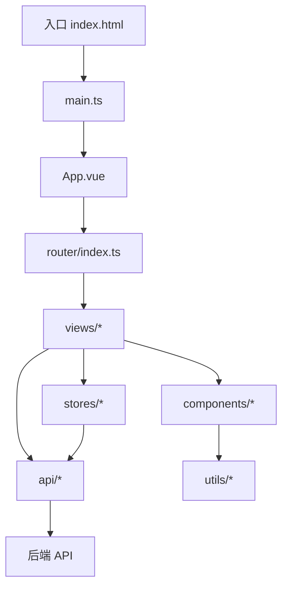
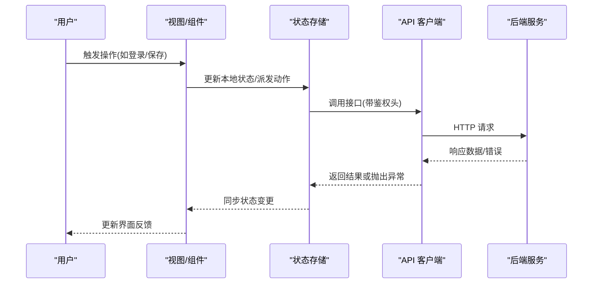
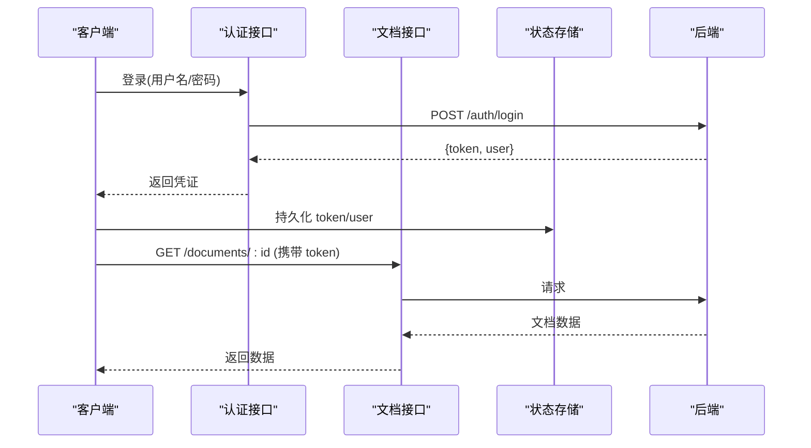
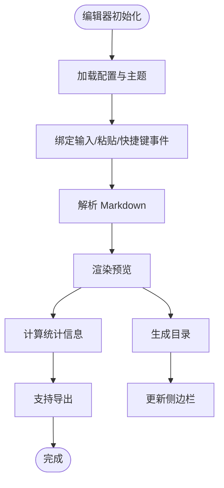
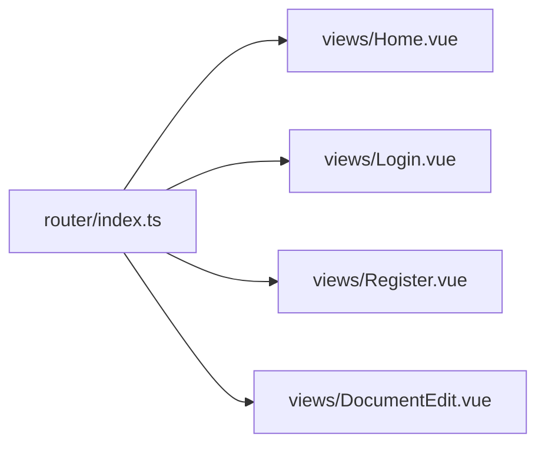
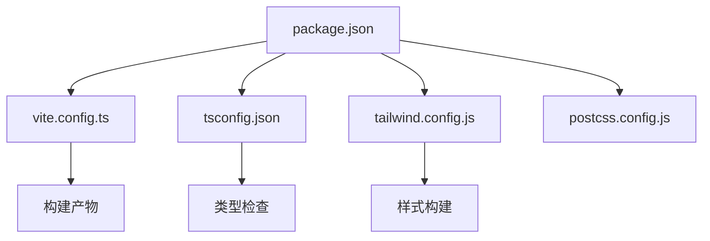

# 开发指南

<cite>
**本文引用的文件**
- [package.json](file://package.json)
- [vite.config.ts](file://vite.config.ts)
- [tsconfig.json](file://tsconfig.json)
- [tsconfig.node.json](file://tsconfig.node.json)
- [tailwind.config.js](file://tailwind.config.js)
- [postcss.config.js](file://postcss.config.js)
- [index.html](file://index.html)
- [src/main.ts](file://src/main.ts)
- [src/App.vue](file://src/App.vue)
- [src/env.d.ts](file://src/env.d.ts)
- [src/vite-env.d.ts](file://src/vite-env.d.ts)
- [src/router/index.ts](file://src/router/index.ts)
- [src/stores/index.ts](file://src/stores/index.ts)
- [src/stores/auth.ts](file://src/stores/auth.ts)
- [src/stores/editor.ts](file://src/stores/editor.ts)
- [src/api/client.ts](file://src/api/client.ts)
- [src/api/auth.ts](file://src/api/auth.ts)
- [src/api/documents.ts](file://src/api/documents.ts)
- [src/types/index.ts](file://src/types/index.ts)
- [src/utils/README.md](file://src/utils/README.md)
- [src/components/README.md](file://src/components/README.md)
- [src/views/Home.vue](file://src/views/Home.vue)
- [src/views/Login.vue](file://src/views/Login.vue)
- [src/views/Register.vue](file://src/views/Register.vue)
- [src/views/DocumentEdit.vue](file://src/views/DocumentEdit.vue)
- [src/components/MarkdownEditor.vue](file://src/components/MarkdownEditor.vue)
- [src/components/Toolbar.vue](file://src/components/Toolbar.vue)
- [src/components/DocumentSidebar.vue](file://src/components/DocumentSidebar.vue)
- [src/utils/markdown.ts](file://src/utils/markdown.ts)
- [src/utils/image.ts](file://src/utils/image.ts)
- [src/utils/export.ts](file://src/utils/export.ts)
- [src/utils/stats.ts](file://src/utils/stats.ts)
- [src/utils/toc.ts](file://src/utils/toc.ts)
- [src/utils/editor.ts](file://src/utils/editor.ts)
- [openspec/config.yaml](file://openspec/config.yaml)
</cite>

## 目录
1. [简介](#简介)
2. [项目结构](#项目结构)
3. [核心组件](#核心组件)
4. [架构总览](#架构总览)
5. [详细组件分析](#详细组件分析)
6. [依赖分析](#依赖分析)
7. [性能考虑](#性能考虑)
8. [故障排查指南](#故障排查指南)
9. [结论](#结论)
10. [附录](#附录)

## 简介
本指南面向贡献者，提供该前端项目的开发规范与最佳实践。内容涵盖代码风格、命名约定、文件组织、TypeScript 类型定义使用、环境变量配置、调试技巧、Git 工作流、代码审查流程、测试策略、常见问题排查、性能分析与效率提升技巧，帮助新成员快速上手并高效协作。

## 项目结构
本项目采用基于功能分层的模块化组织方式：
- src/api：API 客户端封装（请求、认证、文档接口）
- src/components：可复用 UI 组件（编辑器、工具栏、侧边栏）
- src/router：路由配置
- src/stores：状态管理（认证、编辑器等）
- src/types：全局类型定义
- src/utils：通用工具函数（Markdown、图片、导出、统计、目录、编辑器辅助）
- src/views：页面级视图（首页、登录、注册、文档编辑）
- 根目录配置文件：Vite、TypeScript、Tailwind、PostCSS、包管理等

**图表来源**
- [index.html:1-50](file://index.html#L1-L50)
- [src/main.ts:1-50](file://src/main.ts#L1-L50)
- [src/App.vue:1-50](file://src/App.vue#L1-L50)
- [src/router/index.ts:1-50](file://src/router/index.ts#L1-L50)

**章节来源**
- [package.json:1-50](file://package.json#L1-L50)
- [vite.config.ts:1-50](file://vite.config.ts#L1-L50)
- [src/main.ts:1-50](file://src/main.ts#L1-L50)
- [src/App.vue:1-50](file://src/App.vue#L1-L50)
- [src/router/index.ts:1-50](file://src/router/index.ts#L1-L50)

## 核心组件
- API 层
  - 统一请求客户端封装，集中处理基础 URL、拦截器、错误处理与重试策略
  - 认证接口：登录、注册、令牌刷新
  - 文档接口：获取、更新、导出等
- 状态管理
  - 认证状态：用户信息、登录态、权限
  - 编辑器状态：当前文档、光标位置、历史记录、统计信息
- 组件
  - MarkdownEditor：编辑器容器，集成工具栏、侧边栏、导出、统计
  - Toolbar：常用操作按钮（保存、导出、统计等）
  - DocumentSidebar：文档目录、导航、元数据展示
- 工具
  - markdown：解析、转换、渲染辅助
  - image：图片上传、压缩、占位图
  - export：导出为 PDF/HTML/Markdown
  - stats：字数、段落、阅读时长估算
  - toc：生成目录树
  - editor：编辑器实例化、事件绑定、快捷键

**章节来源**
- [src/api/client.ts:1-200](file://src/api/client.ts#L1-L200)
- [src/api/auth.ts:1-200](file://src/api/auth.ts#L1-L200)
- [src/api/documents.ts:1-200](file://src/api/documents.ts#L1-L200)
- [src/stores/auth.ts:1-200](file://src/stores/auth.ts#L1-L200)
- [src/stores/editor.ts:1-200](file://src/stores/editor.ts#L1-L200)
- [src/components/MarkdownEditor.vue:1-200](file://src/components/MarkdownEditor.vue#L1-L200)
- [src/components/Toolbar.vue:1-200](file://src/components/Toolbar.vue#L1-L200)
- [src/components/DocumentSidebar.vue:1-200](file://src/components/DocumentSidebar.vue#L1-L200)
- [src/utils/markdown.ts:1-200](file://src/utils/markdown.ts#L1-L200)
- [src/utils/image.ts:1-200](file://src/utils/image.ts#L1-L200)
- [src/utils/export.ts:1-200](file://src/utils/export.ts#L1-L200)
- [src/utils/stats.ts:1-200](file://src/utils/stats.ts#L1-L200)
- [src/utils/toc.ts:1-200](file://src/utils/toc.ts#L1-L200)
- [src/utils/editor.ts:1-200](file://src/utils/editor.ts#L1-L200)

## 架构总览
前端采用“视图-组件-状态-API-工具”的分层架构：
- 视图层负责页面布局与交互
- 组件层封装可复用 UI 逻辑
- 状态层管理应用级数据与副作用
- API 层抽象网络请求与错误处理
- 工具层提供跨模块复用的纯函数能力

**图表来源**
- [src/api/client.ts:1-200](file://src/api/client.ts#L1-L200)
- [src/stores/auth.ts:1-200](file://src/stores/auth.ts#L1-L200)
- [src/stores/editor.ts:1-200](file://src/stores/editor.ts#L1-L200)
- [src/components/MarkdownEditor.vue:1-200](file://src/components/MarkdownEditor.vue#L1-L200)

## 详细组件分析

### API 客户端与认证流程
- 统一客户端封装了请求前缀、超时、重试、错误码映射与拦截器
- 认证流程：登录成功后缓存令牌，后续请求自动携带；失败时刷新或跳转登录
- 文档接口：按资源划分，便于扩展与维护

**图表来源**
- [src/api/client.ts:1-200](file://src/api/client.ts#L1-L200)
- [src/api/auth.ts:1-200](file://src/api/auth.ts#L1-L200)
- [src/api/documents.ts:1-200](file://src/api/documents.ts#L1-L200)
- [src/stores/auth.ts:1-200](file://src/stores/auth.ts#L1-L200)

**章节来源**
- [src/api/client.ts:1-200](file://src/api/client.ts#L1-L200)
- [src/api/auth.ts:1-200](file://src/api/auth.ts#L1-L200)
- [src/api/documents.ts:1-200](file://src/api/documents.ts#L1-L200)
- [src/stores/auth.ts:1-200](file://src/stores/auth.ts#L1-L200)

### 编辑器与工具链
- MarkdownEditor 组合 Toolbar 与 DocumentSidebar，提供完整的编辑体验
- 工具链：
  - markdown：解析与转换
  - image：上传与优化
  - export：多格式导出
  - stats：统计指标
  - toc：目录生成
  - editor：编辑器实例与事件

**图表来源**
- [src/components/MarkdownEditor.vue:1-200](file://src/components/MarkdownEditor.vue#L1-L200)
- [src/utils/markdown.ts:1-200](file://src/utils/markdown.ts#L1-L200)
- [src/utils/image.ts:1-200](file://src/utils/image.ts#L1-L200)
- [src/utils/export.ts:1-200](file://src/utils/export.ts#L1-L200)
- [src/utils/stats.ts:1-200](file://src/utils/stats.ts#L1-L200)
- [src/utils/toc.ts:1-200](file://src/utils/toc.ts#L1-L200)
- [src/utils/editor.ts:1-200](file://src/utils/editor.ts#L1-L200)

**章节来源**
- [src/components/MarkdownEditor.vue:1-200](file://src/components/MarkdownEditor.vue#L1-L200)
- [src/components/Toolbar.vue:1-200](file://src/components/Toolbar.vue#L1-L200)
- [src/components/DocumentSidebar.vue:1-200](file://src/components/DocumentSidebar.vue#L1-L200)
- [src/utils/markdown.ts:1-200](file://src/utils/markdown.ts#L1-L200)
- [src/utils/image.ts:1-200](file://src/utils/image.ts#L1-L200)
- [src/utils/export.ts:1-200](file://src/utils/export.ts#L1-L200)
- [src/utils/stats.ts:1-200](file://src/utils/stats.ts#L1-L200)
- [src/utils/toc.ts:1-200](file://src/utils/toc.ts#L1-L200)
- [src/utils/editor.ts:1-200](file://src/utils/editor.ts#L1-L200)

### 路由与页面
- 路由集中管理，按页面拆分视图
- 页面职责清晰：Home、Login、Register、DocumentEdit
- 路由守卫用于鉴权与重定向

**图表来源**
- [src/router/index.ts:1-200](file://src/router/index.ts#L1-L200)
- [src/views/Home.vue:1-200](file://src/views/Home.vue#L1-L200)
- [src/views/Login.vue:1-200](file://src/views/Login.vue#L1-L200)
- [src/views/Register.vue:1-200](file://src/views/Register.vue#L1-L200)
- [src/views/DocumentEdit.vue:1-200](file://src/views/DocumentEdit.vue#L1-L200)

**章节来源**
- [src/router/index.ts:1-200](file://src/router/index.ts#L1-L200)
- [src/views/Home.vue:1-200](file://src/views/Home.vue#L1-L200)
- [src/views/Login.vue:1-200](file://src/views/Login.vue#L1-L200)
- [src/views/Register.vue:1-200](file://src/views/Register.vue#L1-L200)
- [src/views/DocumentEdit.vue:1-200](file://src/views/DocumentEdit.vue#L1-L200)

## 依赖分析
- 构建与工程化
  - Vite：开发与构建
  - TypeScript：类型检查与编译
  - Tailwind CSS + PostCSS：样式方案
- 运行时依赖
  - 状态管理、HTTP 客户端、Markdown 渲染库等（以包清单为准）
- 外部集成
  - 后端 API 地址、鉴权方式、跨域策略通过配置与环境变量管理

**图表来源**
- [package.json:1-100](file://package.json#L1-L100)
- [vite.config.ts:1-100](file://vite.config.ts#L1-L100)
- [tsconfig.json:1-100](file://tsconfig.json#L1-L100)
- [tailwind.config.js:1-100](file://tailwind.config.js#L1-L100)
- [postcss.config.js:1-100](file://postcss.config.js#L1-L100)

**章节来源**
- [package.json:1-100](file://package.json#L1-L100)
- [vite.config.ts:1-100](file://vite.config.ts#L1-L100)
- [tsconfig.json:1-100](file://tsconfig.json#L1-L100)
- [tailwind.config.js:1-100](file://tailwind.config.js#L1-L100)
- [postcss.config.js:1-100](file://postcss.config.js#L1-L100)

## 性能考虑
- 构建优化
  - 按需引入与 Tree Shaking：确保仅打包使用的模块
  - 分包与懒加载：路由级与组件级拆分，减少首屏体积
  - 静态资源优化：图片压缩、字体子集化、CDN 缓存
- 运行时优化
  - 编辑器防抖/节流：输入与渲染节流，避免频繁重排
  - 列表与大数据：虚拟滚动、分页加载
  - 网络请求：合并请求、缓存策略、重试与退避
- 监控与分析
  - 性能指标：首屏时间、FCP/LCP、TBT、内存占用
  - 日志埋点：关键路径打点，错误上报

[本节为通用指导，不直接分析具体文件]

## 故障排查指南
- 常见问题
  - 类型错误：检查 tsconfig 与类型声明文件，确保类型一致
  - 环境变量未生效：确认 .env 文件与构建模式匹配，并在类型声明中补充
  - 跨域问题：检查代理配置与后端 CORS
  - 构建失败：清理缓存、锁定依赖版本、检查 Node 版本
- 调试技巧
  - 浏览器 DevTools：Network 面板查看请求，Console 查看错误，Performance 分析耗时
  - Vite 插件：启用源码映射，定位问题
  - 日志：在关键路径输出结构化日志，区分环境
- 状态与网络
  - 断言 API 契约：校验返回结构与字段
  - 错误边界：捕获渲染异常，降级展示
  - 重试与回退：对不稳定接口实现重试与降级策略

**章节来源**
- [src/env.d.ts:1-100](file://src/env.d.ts#L1-L100)
- [src/vite-env.d.ts:1-100](file://src/vite-env.d.ts#L1-L100)
- [vite.config.ts:1-100](file://vite.config.ts#L1-L100)
- [src/api/client.ts:1-200](file://src/api/client.ts#L1-L200)

## 结论
本指南提供了从工程配置到组件实现的系统化开发规范与实践建议。遵循统一的代码风格、命名约定与文件组织，结合严格的类型检查与环境配置，配合完善的 Git 工作流与代码审查流程，可显著提升团队协作效率与交付质量。建议在迭代中持续完善测试覆盖与性能监控，保障产品稳定性与用户体验。

## 附录

### 开发环境与安装
- 前置要求
  - Node.js 版本：参考包脚本与引擎约束
  - 包管理器：npm/yarn/pnpm（任选其一）
- 安装与启动
  - 安装依赖：执行包管理器的安装命令
  - 启动开发服务器：执行开发脚本，访问本地地址
  - 构建生产版本：执行构建脚本，输出至指定目录

**章节来源**
- [package.json:1-100](file://package.json#L1-L100)
- [index.html:1-50](file://index.html#L1-L50)

### 代码风格与命名规范
- 语言与工具
  - TypeScript：严格模式开启，统一类型定义
  - ESLint/Prettier：统一格式化与规则（若已配置）
- 命名约定
  - 文件：组件使用 PascalCase，工具与模块使用 camelCase
  - 变量与函数：语义化命名，避免缩写
  - 常量：全大写+下划线
- 组件设计
  - 单一职责：每个组件聚焦一个功能
  - Props/Events：明确输入输出，保持可预测性
  - 样式：优先使用原子化样式类，必要时抽取局部样式

[本节为通用指导，不直接分析具体文件]

### TypeScript 类型定义使用
- 全局类型
  - 在 types 目录集中维护业务类型与第三方类型增强
  - 通过 env.d.ts 与 vite-env.d.ts 声明环境变量与 Vite 类型
- 最佳实践
  - 优先使用接口与类型别名表达数据结构
  - 对外暴露的类型需稳定且具描述性
  - 避免 any，使用 unknown + 类型守卫

**章节来源**
- [src/types/index.ts:1-200](file://src/types/index.ts#L1-L200)
- [src/env.d.ts:1-100](file://src/env.d.ts#L1-L100)
- [src/vite-env.d.ts:1-100](file://src/vite-env.d.ts#L1-L100)
- [tsconfig.json:1-100](file://tsconfig.json#L1-L100)

### 环境变量配置
- 文件组织
  - .env.development/.env.production：按环境隔离变量
  - 敏感信息不入仓，使用密钥管理服务
- 使用方式
  - 通过 import.meta.env 读取
  - 在类型声明中补充变量类型，避免运行时错误
- 示例场景
  - API 基础地址、超时、重试次数、特性开关

**章节来源**
- [vite.config.ts:1-100](file://vite.config.ts#L1-L100)
- [src/env.d.ts:1-100](file://src/env.d.ts#L1-L100)
- [src/vite-env.d.ts:1-100](file://src/vite-env.d.ts#L1-L100)

### 调试技巧
- 开发期
  - 启用 Source Map，定位源码行号
  - 使用浏览器断点与条件断点
  - 控制台打印关键状态与请求
- 生产期
  - 错误上报与堆栈还原
  - 性能指标采集与可视化

[本节为通用指导，不直接分析具体文件]

### Git 工作流与代码审查
- 分支策略
  - main：稳定分支
  - develop：集成分支
  - feature/*、fix/*、chore/*：功能、修复、任务分支
- 提交规范
  - 使用约定式提交（feat/fix/chore/docs/test/refactor）
  - 提交信息简洁明确，关联需求编号
- 代码审查
  - PR 描述包含变更背景、影响范围、测试说明
  - 至少一名 reviewer 批准后方可合并
  - 自动化检查：类型检查、构建、单元测试

[本节为通用指导，不直接分析具体文件]

### 测试策略
- 单元与集成
  - 工具函数：Jest/Vitest 单元测试
  - 组件：Vue Test Utils 进行交互与快照测试
  - API 客户端：Mock 后端，验证请求与错误处理
- 端到端
  - Playwright/Cypress 模拟用户流程
- 覆盖率与门禁
  - 设定最低覆盖率阈值
  - CI 中执行测试与报告

[本节为通用指导，不直接分析具体文件]

### 常见问题排查
- 构建失败
  - 清理 node_modules 与缓存，重新安装
  - 检查 Node 版本与包引擎约束
- 类型错误
  - 检查类型声明与导入路径
  - 使用类型收窄与守卫
- 运行时错误
  - 检查环境变量与 API 可达性
  - 查看 Network 与 Console 日志

**章节来源**
- [package.json:1-100](file://package.json#L1-L100)
- [vite.config.ts:1-100](file://vite.config.ts#L1-L100)
- [src/api/client.ts:1-200](file://src/api/client.ts#L1-L200)

### 性能分析工具使用
- 浏览器 Performance 面板：录制与回放，识别瓶颈
- Lighthouse：性能、可访问性、SEO 评估
- 自定义指标：首屏时间、交互延迟、内存峰值
- 监控平台：接入错误与性能上报

[本节为通用指导，不直接分析具体文件]

### 开发效率提升技巧
- 模板与片段：VS Code 用户代码片段
- 快捷命令：封装常用脚本（lint、build、test、deploy）
- 插件生态：ESLint、Prettier、Vue 官方插件
- 文档与规范：OpenSpec 管理变更与规格

**章节来源**
- [openspec/config.yaml:1-100](file://openspec/config.yaml#L1-L100)