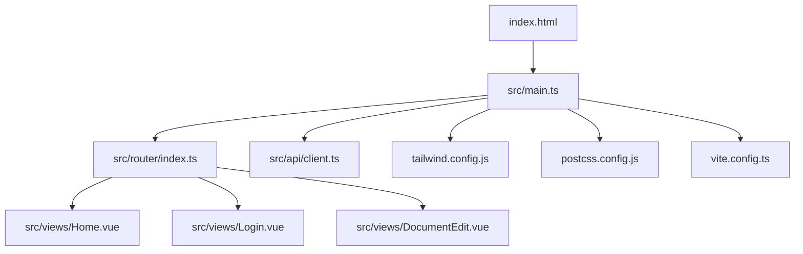
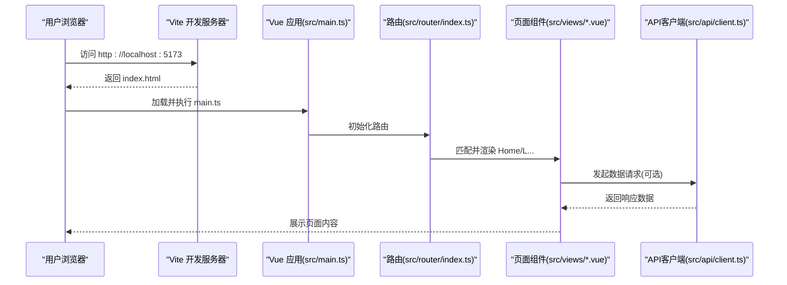
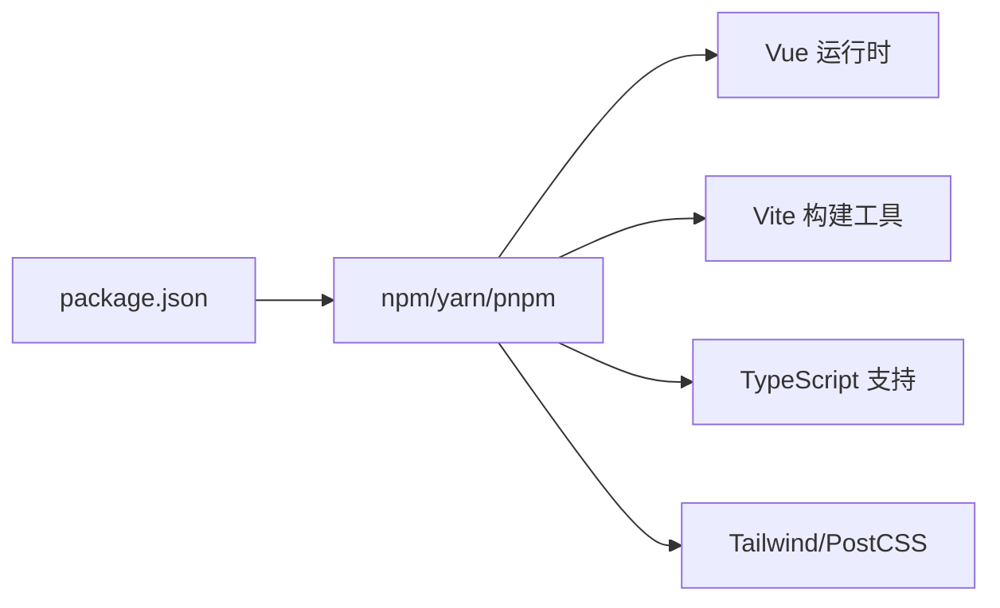

# 快速开始

<cite>
**本文引用的文件**
- [package.json](file://package.json)
- [vite.config.ts](file://vite.config.ts)
- [index.html](file://index.html)
- [src/main.ts](file://src/main.ts)
- [src/router/index.ts](file://src/router/index.ts)
- [src/views/Home.vue](file://src/views/Home.vue)
- [src/views/Login.vue](file://src/views/Login.vue)
- [src/views/DocumentEdit.vue](file://src/views/DocumentEdit.vue)
- [src/api/client.ts](file://src/api/client.ts)
- [tailwind.config.js](file://tailwind.config.js)
- [postcss.config.js](file://postcss.config.js)
- [tsconfig.json](file://tsconfig.json)
- [README.md](file://README.md)
</cite>

## 目录
1. [简介](#简介)
2. [项目结构](#项目结构)
3. [核心组件](#核心组件)
4. [架构总览](#架构总览)
5. [详细组件分析](#详细组件分析)
6. [依赖分析](#依赖分析)
7. [性能注意事项](#性能注意事项)
8. [故障排查指南](#故障排查指南)
9. [结论](#结论)
10. [附录](#附录)

## 简介
本指南面向首次接触该项目的开发者，目标是在10分钟内完成环境搭建、依赖安装与开发服务器启动，并成功访问首页。你将了解：
- Node.js 版本要求
- 依赖安装步骤
- 开发服务器启动命令
- 常见环境问题（端口冲突、权限问题等）的解决方案
- 基本项目结构与第一个页面的访问方法

## 项目结构
本项目为基于 Vite + Vue 3 + TypeScript 的前端应用，采用模块化组织方式：
- 入口与构建配置：index.html、vite.config.ts、postcss.config.js、tailwind.config.js、tsconfig.json
- 应用入口：src/main.ts
- 路由与页面：src/router/index.ts、src/views/*.vue
- API 客户端：src/api/*.ts
- 样式与工具：src/style.css、src/utils/*.ts

图表来源
- [index.html:1-20](file://index.html#L1-L20)
- [src/main.ts:1-30](file://src/main.ts#L1-L30)
- [src/router/index.ts:1-40](file://src/router/index.ts#L1-L40)
- [src/views/Home.vue:1-30](file://src/views/Home.vue#L1-L30)
- [src/views/Login.vue:1-30](file://src/views/Login.vue#L1-L30)
- [src/views/DocumentEdit.vue:1-30](file://src/views/DocumentEdit.vue#L1-L30)
- [src/api/client.ts:1-30](file://src/api/client.ts#L1-L30)
- [tailwind.config.js:1-20](file://tailwind.config.js#L1-L20)
- [postcss.config.js:1-20](file://postcss.config.js#L1-L20)
- [vite.config.ts:1-40](file://vite.config.ts#L1-L40)

章节来源
- [index.html:1-20](file://index.html#L1-L20)
- [vite.config.ts:1-40](file://vite.config.ts#L1-L40)
- [src/main.ts:1-30](file://src/main.ts#L1-L30)
- [src/router/index.ts:1-40](file://src/router/index.ts#L1-L40)
- [tailwind.config.js:1-20](file://tailwind.config.js#L1-L20)
- [postcss.config.js:1-20](file://postcss.config.js#L1-L20)
- [tsconfig.json:1-40](file://tsconfig.json#L1-L40)

## 核心组件
- 应用入口与初始化：通过 src/main.ts 挂载 Vue 应用，注册插件与全局样式。
- 路由：src/router/index.ts 定义页面路由，将 URL 映射到视图组件。
- 视图组件：Home、Login、DocumentEdit 等页面分别负责不同业务场景。
- API 客户端：src/api/client.ts 封装 HTTP 请求，统一处理基础地址、拦截器等。
- 构建与样式：Vite 作为构建工具，Tailwind CSS 与 PostCSS 提供样式能力。

章节来源
- [src/main.ts:1-30](file://src/main.ts#L1-L30)
- [src/router/index.ts:1-40](file://src/router/index.ts#L1-L40)
- [src/views/Home.vue:1-30](file://src/views/Home.vue#L1-L30)
- [src/views/Login.vue:1-30](file://src/views/Login.vue#L1-L30)
- [src/views/DocumentEdit.vue:1-30](file://src/views/DocumentEdit.vue#L1-L30)
- [src/api/client.ts:1-30](file://src/api/client.ts#L1-L30)

## 架构总览
下图展示了从浏览器访问到页面渲染的关键流程，包括 Vite 开发服务器、Vue 应用、路由与视图组件的交互。

图表来源
- [index.html:1-20](file://index.html#L1-L20)
- [src/main.ts:1-30](file://src/main.ts#L1-L30)
- [src/router/index.ts:1-40](file://src/router/index.ts#L1-L40)
- [src/views/Home.vue:1-30](file://src/views/Home.vue#L1-L30)
- [src/views/Login.vue:1-30](file://src/views/Login.vue#L1-L30)
- [src/views/DocumentEdit.vue:1-30](file://src/views/DocumentEdit.vue#L1-L30)
- [src/api/client.ts:1-30](file://src/api/client.ts#L1-L30)

## 详细组件分析

### 应用入口与初始化（src/main.ts）
- 职责：创建并挂载 Vue 应用，注册必要的插件与全局样式。
- 关键点：确保在开发模式下正确加载环境变量与调试信息；在生产模式下优化资源加载。

章节来源
- [src/main.ts:1-30](file://src/main.ts#L1-L30)

### 路由与页面（src/router/index.ts 与 src/views/*.vue）
- 职责：定义前端路由表，将路径映射到具体页面组件；各页面组件承载对应业务逻辑与 UI。
- 关键点：懒加载与路由守卫（如有）可提升首屏性能与安全控制。

章节来源
- [src/router/index.ts:1-40](file://src/router/index.ts#L1-L40)
- [src/views/Home.vue:1-30](file://src/views/Home.vue#L1-L30)
- [src/views/Login.vue:1-30](file://src/views/Login.vue#L1-L30)
- [src/views/DocumentEdit.vue:1-30](file://src/views/DocumentEdit.vue#L1-L30)

### API 客户端（src/api/client.ts）
- 职责：封装 HTTP 请求，统一设置基础地址、请求头、错误处理与重试策略。
- 关键点：便于后续接入认证、日志与监控。

章节来源
- [src/api/client.ts:1-30](file://src/api/client.ts#L1-L30)

### 构建与样式（vite.config.ts、tailwind.config.js、postcss.config.js）
- 职责：配置 Vite 构建行为、Tailwind CSS 主题与 PostCSS 插件链。
- 关键点：开发时热更新、生产模式代码分割与压缩。

章节来源
- [vite.config.ts:1-40](file://vite.config.ts#L1-L40)
- [tailwind.config.js:1-20](file://tailwind.config.js#L1-L20)
- [postcss.config.js:1-20](file://postcss.config.js#L1-L20)

## 依赖分析
- 运行时依赖：Vue、TypeScript、Vite 生态相关包、HTTP 客户端库等。
- 开发依赖：Vite、PostCSS、Tailwind CSS、TypeScript 编译器与类型声明等。
- 脚本命令：通过 package.json 中的 scripts 字段提供常用命令（如安装、开发、构建）。

图表来源
- [package.json:1-40](file://package.json#L1-L40)

章节来源
- [package.json:1-40](file://package.json#L1-L40)

## 性能注意事项
- 使用 Vite 的开发服务器可获得极快的冷启动与热更新体验。
- 按需引入与代码分割可减少首屏体积。
- 图片与静态资源建议进行压缩与懒加载。
- 合理配置 Tailwind 以移除未使用的样式类。

[本节为通用指导，不直接分析具体文件]

## 故障排查指南
- Node.js 版本不兼容
  - 现象：安装依赖或运行时报错提示引擎版本不匹配。
  - 解决：根据 package.json 中指定的引擎版本要求，使用 nvm 切换至匹配的 Node.js 版本。
- 端口冲突
  - 现象：启动开发服务器时报“端口已被占用”。
  - 解决：修改 vite.config.ts 中的开发服务器端口，或使用系统命令释放占用端口后重启。
- 权限问题
  - 现象：安装依赖时报权限不足。
  - 解决：避免使用 sudo 安装全局包；检查 npm 缓存目录权限；必要时重新安装依赖。
- 网络与代理
  - 现象：下载依赖失败或超时。
  - 解决：配置镜像源或代理；检查防火墙与企业网络策略。
- 构建失败
  - 现象：TypeScript 类型错误或模块解析失败。
  - 解决：清理 node_modules 后重装依赖；检查 tsconfig.json 与路径别名；确认所有依赖已安装。

章节来源
- [package.json:1-40](file://package.json#L1-L40)
- [vite.config.ts:1-40](file://vite.config.ts#L1-L40)
- [tsconfig.json:1-40](file://tsconfig.json#L1-L40)

## 结论
按照本指南完成环境准备与依赖安装后，即可在本地启动开发服务器并访问首页。若遇到常见问题，可参考故障排查部分快速定位与解决。建议在熟悉项目结构后再逐步深入各模块源码。

[本节为总结性内容，不直接分析具体文件]

## 附录

### 环境准备与运行步骤（10分钟上手）
- 前置条件
  - 安装 Node.js：请根据 package.json 中指定的引擎版本要求选择对应版本。
  - 推荐包管理器：npm、yarn 或 pnpm 任选其一。
- 安装依赖
  - 在项目根目录执行包管理器的安装命令（例如：npm install / yarn / pnpm install）。
- 启动开发服务器
  - 执行开发命令（例如：npm run dev / yarn dev / pnpm dev）。
  - 默认访问地址通常为 http://localhost:5173（若端口被占用，请参考“端口冲突”解决方案）。
- 访问第一个页面
  - 打开浏览器访问 http://localhost:5173，应看到首页（Home 视图）。
  - 如需登录或编辑文档，可通过路由导航至相应页面（如 /login、/document/edit）。

章节来源
- [package.json:1-40](file://package.json#L1-L40)
- [vite.config.ts:1-40](file://vite.config.ts#L1-L40)
- [src/router/index.ts:1-40](file://src/router/index.ts#L1-L40)
- [src/views/Home.vue:1-30](file://src/views/Home.vue#L1-L30)
- [src/views/Login.vue:1-30](file://src/views/Login.vue#L1-L30)
- [src/views/DocumentEdit.vue:1-30](file://src/views/DocumentEdit.vue#L1-L30)

### 常见问题速查
- 如何更换开发服务器端口？
  - 在 vite.config.ts 中修改开发服务器端口配置，然后重新启动开发服务器。
- 如何查看当前可用的脚本命令？
  - 查看 package.json 中的 scripts 字段，或直接执行包管理器的帮助命令。
- 如何确认 Node.js 版本是否满足要求？
  - 查看 package.json 中的 engines 字段，并使用 nvm 切换到指定版本。

章节来源
- [vite.config.ts:1-40](file://vite.config.ts#L1-L40)
- [package.json:1-40](file://package.json#L1-L40)