# 构建与部署

<cite>
**本文引用的文件**
- [vite.config.ts](file://vite.config.ts)
- [tsconfig.json](file://tsconfig.json)
- [tsconfig.node.json](file://tsconfig.node.json)
- [package.json](file://package.json)
- [postcss.config.js](file://postcss.config.js)
- [tailwind.config.js](file://tailwind.config.js)
- [index.html](file://index.html)
- [src/main.ts](file://src/main.ts)
- [src/env.d.ts](file://src/env.d.ts)
- [src/vite-env.d.ts](file://src/vite-env.d.ts)
- [src/utils/stats.ts](file://src/utils/stats.ts)
</cite>

## 目录
1. [简介](#简介)
2. [项目结构](#项目结构)
3. [核心组件](#核心组件)
4. [架构总览](#架构总览)
5. [详细组件分析](#详细组件分析)
6. [依赖分析](#依赖分析)
7. [性能考虑](#性能考虑)
8. [故障排查指南](#故障排查指南)
9. [结论](#结论)
10. [附录](#附录)

## 简介
本文件面向该前端项目的构建与部署，覆盖 Vite 构建配置、TypeScript 编译、代码分割策略、资源优化、多环境部署（开发/测试/生产）、Docker 容器化、CI/CD 流水线、性能监控与错误追踪，以及如何自定义构建流程与优化打包体积。文档以仓库现有配置为基础，提供可操作的实践建议与可视化流程图，帮助团队在不同环境下稳定交付高质量产物。

## 项目结构
本项目采用基于功能分层的组织方式：
- 入口与运行时：index.html、src/main.ts
- 构建与工程化：vite.config.ts、tsconfig*.json、postcss.config.js、tailwind.config.js、package.json
- 类型与环境：src/env.d.ts、src/vite-env.d.ts
- 业务模块：src/api、src/components、src/router、src/stores、src/views、src/utils

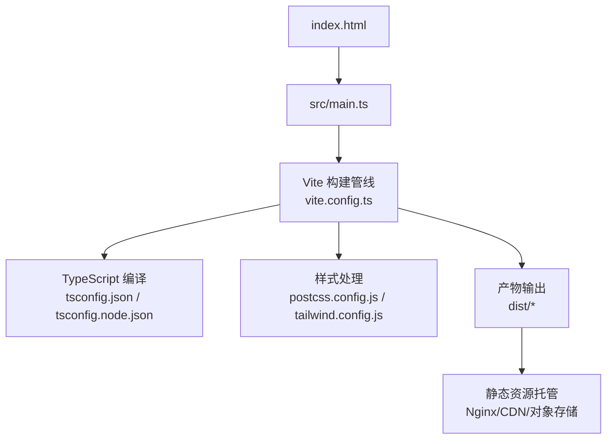

图表来源
- [vite.config.ts:1-200](file://vite.config.ts#L1-L200)
- [tsconfig.json:1-200](file://tsconfig.json#L1-L200)
- [tsconfig.node.json:1-200](file://tsconfig.node.json#L1-L200)
- [postcss.config.js:1-200](file://postcss.config.js#L1-L200)
- [tailwind.config.js:1-200](file://tailwind.config.js#L1-L200)
- [package.json:1-200](file://package.json#L1-L200)

章节来源
- [vite.config.ts:1-200](file://vite.config.ts#L1-L200)
- [package.json:1-200](file://package.json#L1-L200)
- [index.html:1-200](file://index.html#L1-L200)
- [src/main.ts:1-200](file://src/main.ts#L1-L200)

## 核心组件
- 构建系统：Vite（开发服务器、热更新、按需编译）
- 类型系统：TypeScript（tsconfig.json/tsconfig.node.json）
- 样式系统：PostCSS + Tailwind CSS
- 包管理与脚本：npm/yarn/pnpm（package.json scripts）
- 环境变量：Vite 环境变量与 .env.*（通过 vite.config.ts 暴露给应用）
- 统计与分析：内置 stats 工具与可选第三方方案（见 src/utils/stats.ts）

章节来源
- [vite.config.ts:1-200](file://vite.config.ts#L1-L200)
- [tsconfig.json:1-200](file://tsconfig.json#L1-L200)
- [tsconfig.node.json:1-200](file://tsconfig.node.json#L1-L200)
- [postcss.config.js:1-200](file://postcss.config.js#L1-L200)
- [tailwind.config.js:1-200](file://tailwind.config.js#L1-L200)
- [package.json:1-200](file://package.json#L1-L200)
- [src/utils/stats.ts:1-200](file://src/utils/stats.ts#L1-L200)

## 架构总览
下图展示了从源码到最终产物的构建与部署链路，包括 TypeScript 编译、Vite 插件链、资源优化、多环境变量注入以及产物分发。

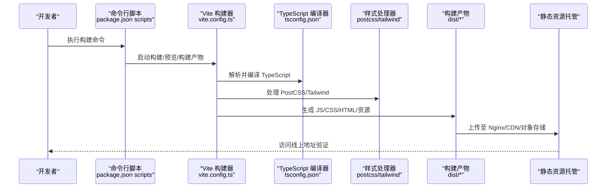

图表来源
- [vite.config.ts:1-200](file://vite.config.ts#L1-L200)
- [tsconfig.json:1-200](file://tsconfig.json#L1-L200)
- [postcss.config.js:1-200](file://postcss.config.js#L1-L200)
- [tailwind.config.js:1-200](file://tailwind.config.js#L1-L200)
- [package.json:1-200](file://package.json#L1-L200)

## 详细组件分析

### Vite 构建配置与多环境
- 目标平台与模式：通过 Vite 的 mode 区分 dev/test/prod，分别加载对应环境变量与构建选项。
- 基础路径与资源前缀：根据部署位置设置 base，便于 CDN 或子路径部署。
- 构建输出：配置 build.outDir、build.assetsDir、build.manifest 等，便于 CI/CD 与缓存策略。
- 插件扩展：在 plugins 中接入压缩、分析、代理、环境变量注入等能力。
- 开发服务器：配置 proxy、端口、HMR、open 等提升本地体验。
- 环境变量：通过 import.meta.env 在应用中读取，结合 .env.* 管理不同环境。

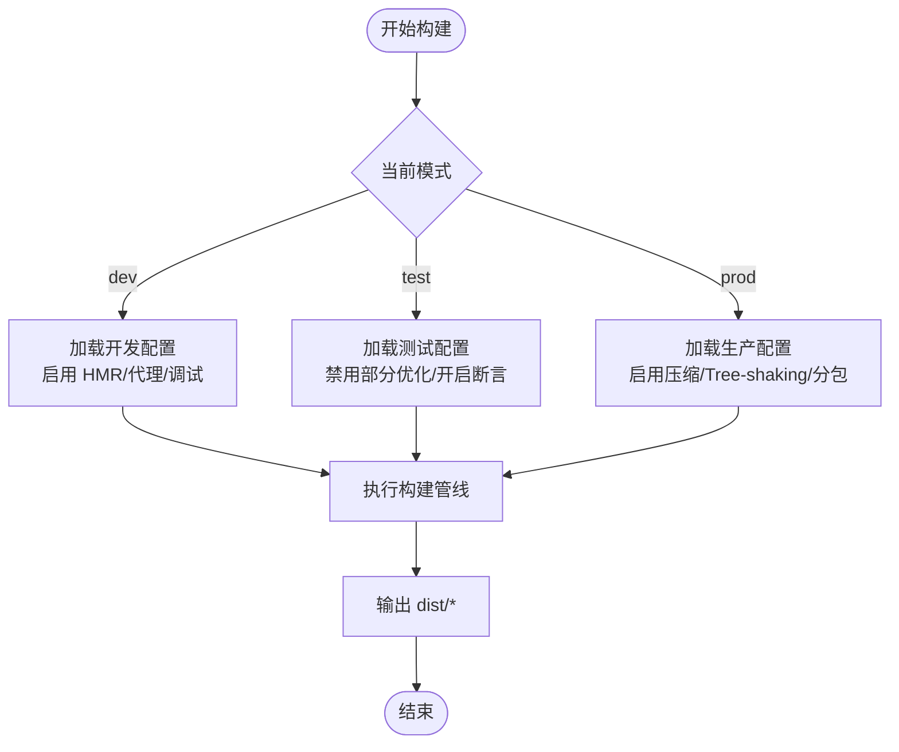

图表来源
- [vite.config.ts:1-200](file://vite.config.ts#L1-L200)

章节来源
- [vite.config.ts:1-200](file://vite.config.ts#L1-L200)
- [package.json:1-200](file://package.json#L1-L200)

### TypeScript 编译配置
- 项目级 tsconfig.json：定义目标 ES 版本、模块解析、严格检查、路径别名等。
- Node 侧 tsconfig.node.json：用于 Vite 插件与构建脚本的类型检查与编译。
- 与 Vite 集成：Vite 使用 esbuild 进行快速转译，同时保留类型检查；可通过脚本单独运行 tsc --noEmit 做类型校验。
- 类型声明：src/env.d.ts 与 src/vite-env.d.ts 为环境与 Vite 相关类型增强。

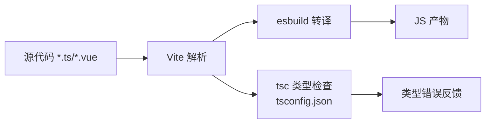

图表来源
- [tsconfig.json:1-200](file://tsconfig.json#L1-L200)
- [tsconfig.node.json:1-200](file://tsconfig.node.json#L1-L200)
- [src/env.d.ts:1-200](file://src/env.d.ts#L1-L200)
- [src/vite-env.d.ts:1-200](file://src/vite-env.d.ts#L1-L200)

章节来源
- [tsconfig.json:1-200](file://tsconfig.json#L1-L200)
- [tsconfig.node.json:1-200](file://tsconfig.node.json#L1-L200)
- [src/env.d.ts:1-200](file://src/env.d.ts#L1-L200)
- [src/vite-env.d.ts:1-200](file://src/vite-env.d.ts#L1-L200)

### 代码分割策略
- 路由级分割：按页面拆分 chunk，减少首屏体积。
- 第三方库分割：将大型依赖（如编辑器、富文本、图表）拆分为独立 chunk，利用浏览器长期缓存。
- 动态导入：对非关键逻辑使用懒加载，降低初始包体。
- 预加载与预取：合理使用 preload/prefetch 提升交互速度。
- 分析工具：借助构建分析插件定位大包与重复依赖。

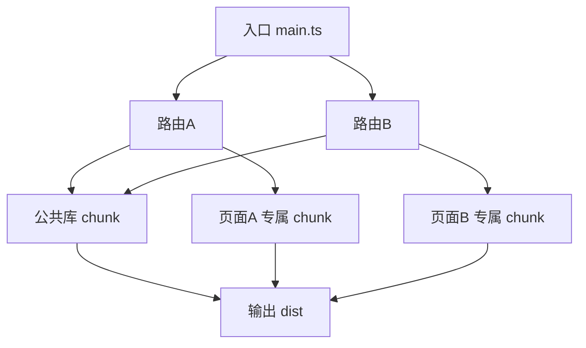

图表来源
- [vite.config.ts:1-200](file://vite.config.ts#L1-L200)
- [src/main.ts:1-200](file://src/main.ts#L1-L200)

章节来源
- [vite.config.ts:1-200](file://vite.config.ts#L1-L200)
- [src/main.ts:1-200](file://src/main.ts#L1-L200)

### 资源优化设置
- 图片与媒体：自动压缩、格式转换（webp/avif）、尺寸裁剪与懒加载。
- 字体：自托管字体并启用缓存策略，限制字体加载范围。
- 静态资源：命名哈希、去重、按需引入。
- 缓存策略：HTTP Cache-Control 与 ETag，配合 CDN 实现强缓存与协商缓存。
- 构建产物：启用 gzip/brotli 压缩，生成 manifest 便于版本管理。

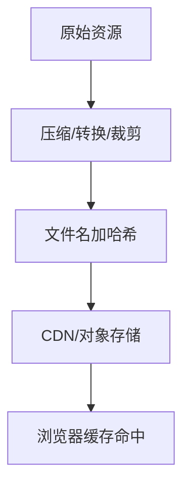

图表来源
- [vite.config.ts:1-200](file://vite.config.ts#L1-L200)

章节来源
- [vite.config.ts:1-200](file://vite.config.ts#L1-L200)

### 样式处理与 Tailwind
- PostCSS 管道：autoprefixer、CSS 压缩、兼容性与特性开关。
- Tailwind：按需生成样式，避免冗余 CSS。
- 主题与插件：通过配置文件扩展主题与指令。

图表来源
- [postcss.config.js:1-200](file://postcss.config.js#L1-L200)
- [tailwind.config.js:1-200](file://tailwind.config.js#L1-L200)

章节来源
- [postcss.config.js:1-200](file://postcss.config.js#L1-L200)
- [tailwind.config.js:1-200](file://tailwind.config.js#L1-L200)

### 环境变量与多环境配置
- 环境变量文件：.env.development、.env.test、.env.production，按模式加载。
- 安全边界：仅暴露以特定前缀开头的变量到客户端。
- 运行时读取：通过 import.meta.env 在应用内读取。
- 构建期替换：Vite 在构建时替换常量，减小运行时开销。

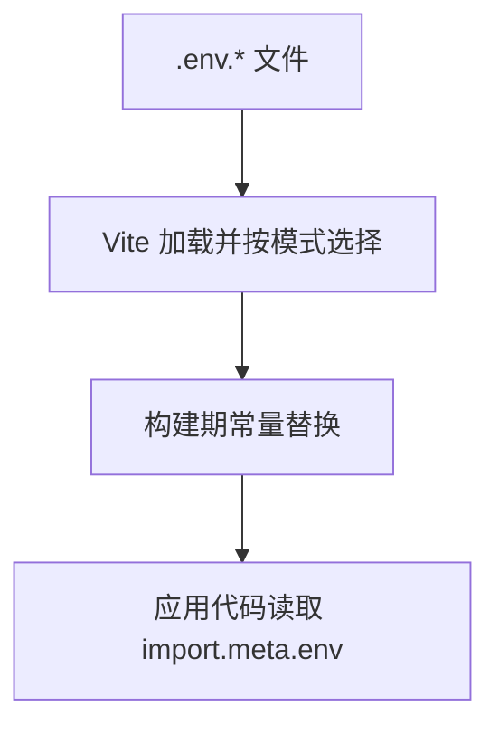

图表来源
- [vite.config.ts:1-200](file://vite.config.ts#L1-L200)

章节来源
- [vite.config.ts:1-200](file://vite.config.ts#L1-L200)

### Docker 容器化部署
- 多阶段构建：第一阶段安装依赖并构建产物，第二阶段仅拷贝产物到轻量镜像。
- 静态资源服务：使用 Nginx 作为静态服务器，配置缓存与 gzip。
- 环境变量注入：通过 Nginx 或反向代理注入必要的环境变量。
- 健康检查与日志：配置健康检查端点与统一日志收集。

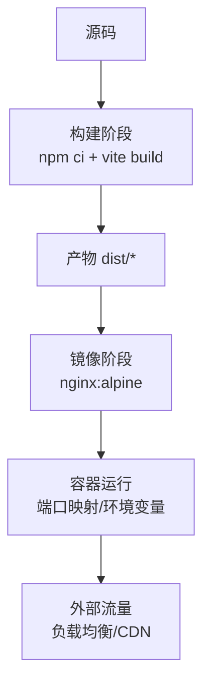

图表来源
- [vite.config.ts:1-200](file://vite.config.ts#L1-L200)
- [package.json:1-200](file://package.json#L1-L200)

章节来源
- [vite.config.ts:1-200](file://vite.config.ts#L1-L200)
- [package.json:1-200](file://package.json#L1-L200)

### CI/CD 流水线配置
- 触发条件：push/PR 事件触发构建与测试。
- 步骤：安装依赖、类型检查、单元测试、构建产物、生成报告、推送制品。
- 缓存：缓存 node_modules 与构建缓存加速流水线。
- 发布：生产环境构建后推送至对象存储/CDN，并触发灰度或回滚策略。

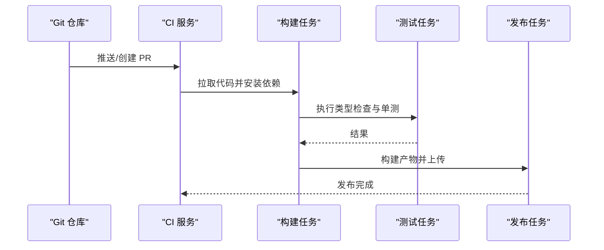

图表来源
- [package.json:1-200](file://package.json#L1-L200)

章节来源
- [package.json:1-200](file://package.json#L1-L200)

### 性能监控与错误追踪
- 构建分析：使用构建分析插件查看包体构成与重复依赖。
- 运行时指标：采集首屏时间、长任务、网络请求耗时等。
- 错误上报：捕获全局异常、未处理 Promise 拒绝、接口错误，并上报到监控系统。
- 日志规范：结构化日志、分级记录、脱敏敏感信息。

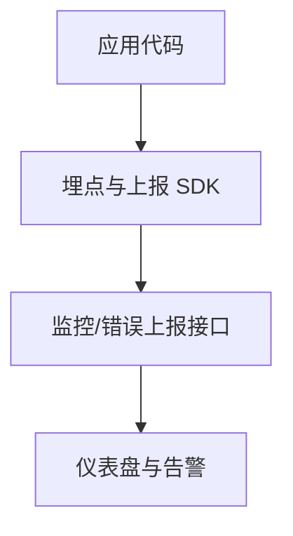

图表来源
- [src/utils/stats.ts:1-200](file://src/utils/stats.ts#L1-L200)

章节来源
- [src/utils/stats.ts:1-200](file://src/utils/stats.ts#L1-L200)

### 自定义构建流程与体积优化
- 自定义插件：在 Vite 插件钩子中插入自定义逻辑（如资源预处理、代码注入）。
- 按需引入：确保第三方库支持按需引入，减少无用代码。
- Tree-shaking：保持纯函数与副作用隔离，利于摇树优化。
- 依赖治理：移除未使用依赖，合并重复依赖，锁定版本。
- 产物审计：定期运行分析任务，跟踪体积变化与回归。

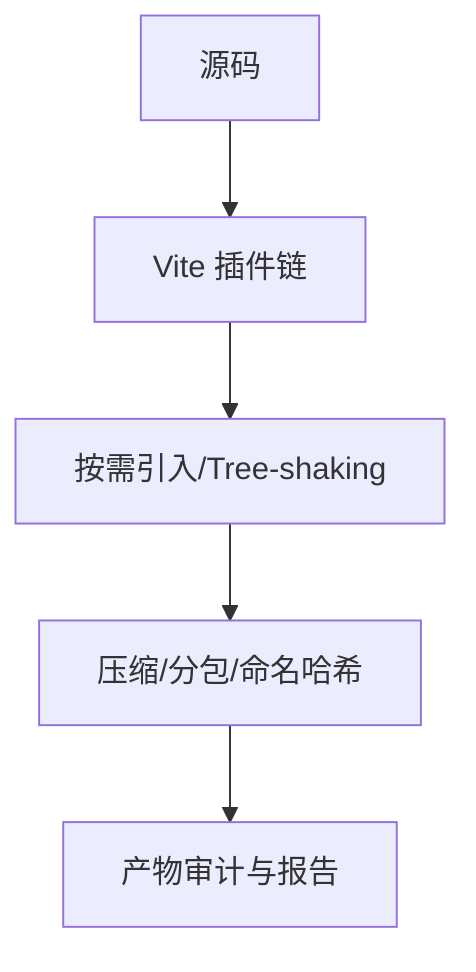

图表来源
- [vite.config.ts:1-200](file://vite.config.ts#L1-L200)

章节来源
- [vite.config.ts:1-200](file://vite.config.ts#L1-L200)

## 依赖分析
- 构建期依赖：Vite、TypeScript、PostCSS、Tailwind、压缩与分析插件。
- 运行期依赖：最小化运行时依赖，优先使用原生能力与轻量库。
- 依赖图示例：以下图展示主要依赖关系与职责划分。

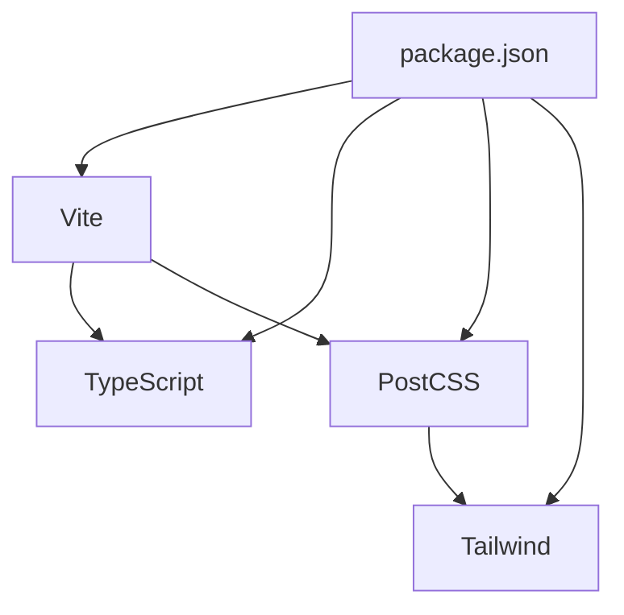

图表来源
- [package.json:1-200](file://package.json#L1-L200)
- [vite.config.ts:1-200](file://vite.config.ts#L1-L200)
- [postcss.config.js:1-200](file://postcss.config.js#L1-L200)
- [tailwind.config.js:1-200](file://tailwind.config.js#L1-L200)

章节来源
- [package.json:1-200](file://package.json#L1-L200)
- [vite.config.ts:1-200](file://vite.config.ts#L1-L200)

## 性能考虑
- 首屏优化：路由级分包、关键资源内联、预加载关键样式与字体。
- 缓存策略：强缓存与协商缓存结合，合理设置版本号与指纹。
- 网络优化：启用 HTTP/2、Gzip/Brotli、CDN 就近分发。
- 渲染优化：减少主线程阻塞、延迟非关键脚本、骨架屏与渐进式加载。
- 监控闭环：建立性能基线与告警阈值，持续回归检测。

[本节为通用指导，不直接分析具体文件]

## 故障排查指南
- 构建失败：检查 Node 版本、依赖安装、环境变量与权限；查看构建日志定位错误源。
- 类型错误：运行类型检查脚本，修复类型定义与路径别名问题。
- 样式异常：确认 PostCSS/Tailwind 配置与浏览器兼容性设置。
- 运行时错误：启用 SourceMap 与错误上报，定位堆栈与上下文。
- 性能退化：对比构建分析报告，识别新增大包与重复依赖。

章节来源
- [vite.config.ts:1-200](file://vite.config.ts#L1-L200)
- [tsconfig.json:1-200](file://tsconfig.json#L1-L200)
- [postcss.config.js:1-200](file://postcss.config.js#L1-L200)
- [tailwind.config.js:1-200](file://tailwind.config.js#L1-L200)
- [package.json:1-200](file://package.json#L1-L200)

## 结论
通过合理的 Vite 构建配置、TypeScript 类型保障、代码分割与资源优化策略，结合多环境部署、容器化与 CI/CD 流水线，可以在保证开发体验的同时，显著提升构建效率与线上稳定性。建议持续进行构建分析与性能监控，形成“度量—优化—验证”的闭环，确保产品在高并发与复杂场景下的表现。

[本节为总结性内容，不直接分析具体文件]

## 附录
- 常用命令参考：开发、预览、构建、类型检查、分析等命令可在 package.json 中配置与调用。
- 环境变量清单：列出各环境所需的关键变量及其用途，便于运维与发布。
- 部署清单：镜像构建、Nginx 配置、CDN 缓存策略、域名与证书管理。
- 监控与告警：关键指标、阈值、告警渠道与应急预案。

[本节为补充信息，不直接分析具体文件]