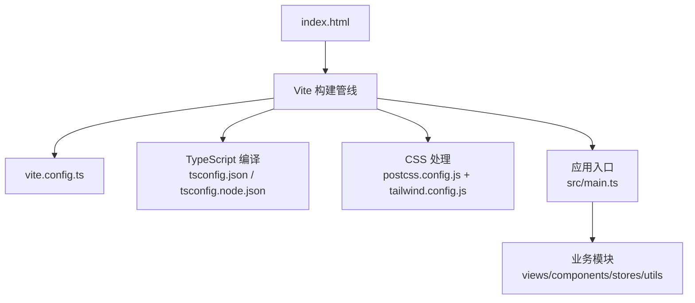
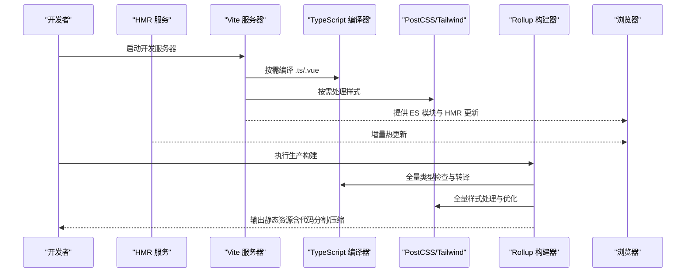
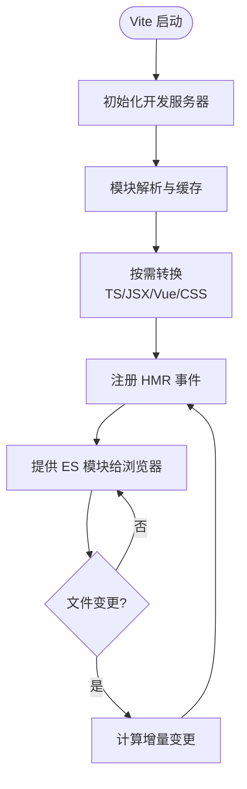
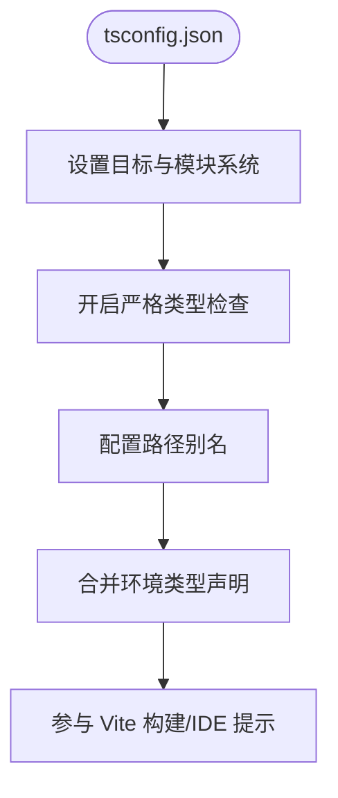
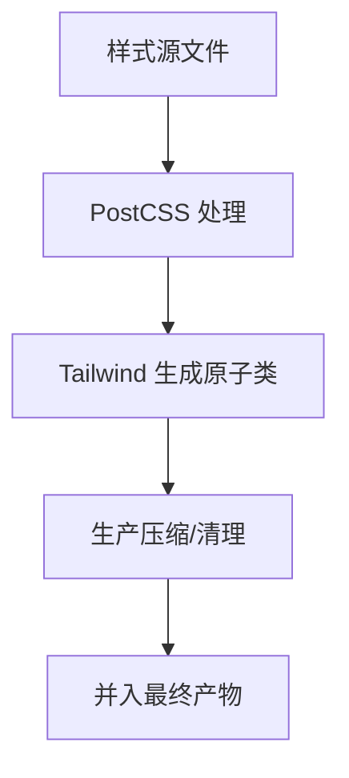
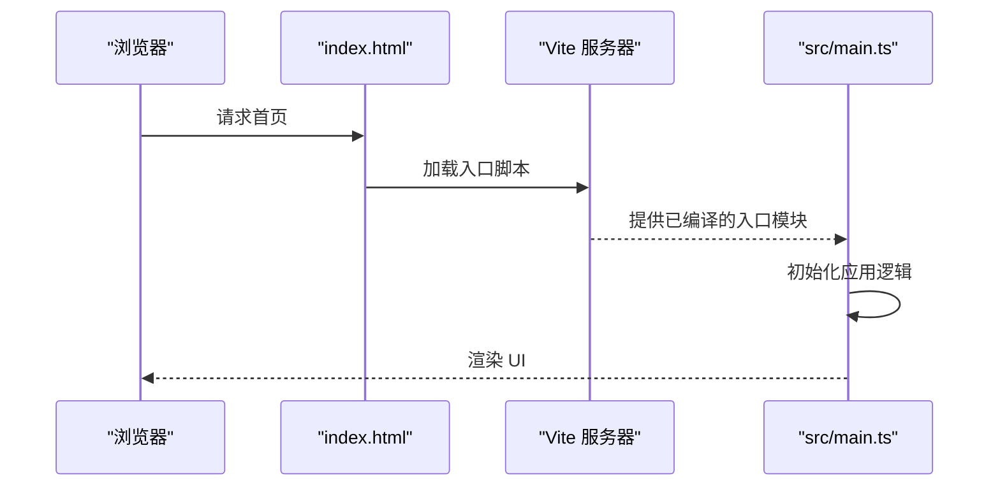
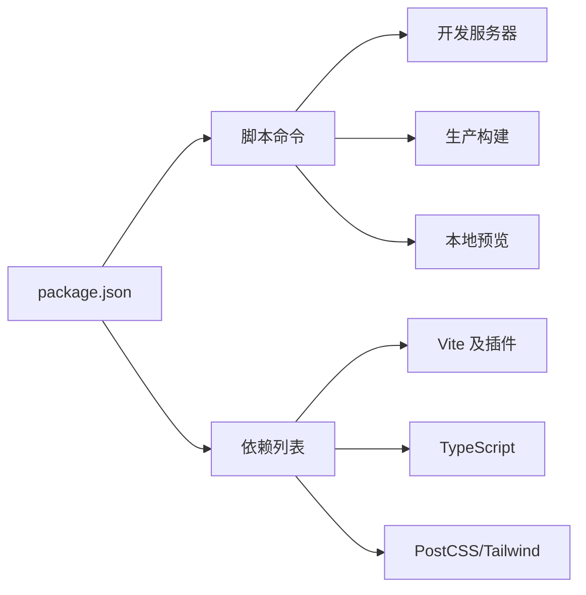

# 构建配置

<cite>
**本文引用的文件**
- [vite.config.ts](file://vite.config.ts)
- [package.json](file://package.json)
- [tsconfig.json](file://tsconfig.json)
- [tsconfig.node.json](file://tsconfig.node.json)
- [postcss.config.js](file://postcss.config.js)
- [tailwind.config.js](file://tailwind.config.js)
- [index.html](file://index.html)
- [src/main.ts](file://src/main.ts)
</cite>

## 目录
1. [简介](#简介)
2. [项目结构](#项目结构)
3. [核心组件](#核心组件)
4. [架构总览](#架构总览)
5. [详细组件分析](#详细组件分析)
6. [依赖分析](#依赖分析)
7. [性能考虑](#性能考虑)
8. [故障排查指南](#故障排查指南)
9. [结论](#结论)
10. [附录](#附录)

## 简介
本构建配置文档围绕 Vite 与 TypeScript 展开，覆盖开发服务器、热重载、模块解析、TypeScript 编译选项、路径别名、类型检查、脚本命令与依赖管理策略，以及生产构建优化（代码分割、资源压缩、Tree Shaking）等。目标是帮助开发者快速理解并高效维护项目的构建流程。

## 项目结构
本项目采用典型的前端工程化结构：
- 入口与构建配置：index.html、vite.config.ts、postcss.config.js、tailwind.config.js
- 应用源码：src/ 下包含视图、组件、路由、状态管理、工具函数与类型定义
- 类型与节点构建：tsconfig.json、tsconfig.node.json
- 包管理与脚本：package.json

图表来源
- [vite.config.ts:1-200](file://vite.config.ts#L1-L200)
- [tsconfig.json:1-200](file://tsconfig.json#L1-L200)
- [tsconfig.node.json:1-200](file://tsconfig.node.json#L1-L200)
- [postcss.config.js:1-200](file://postcss.config.js#L1-L200)
- [tailwind.config.js:1-200](file://tailwind.config.js#L1-L200)
- [index.html:1-200](file://index.html#L1-L200)
- [src/main.ts:1-200](file://src/main.ts#L1-L200)

章节来源
- [vite.config.ts:1-200](file://vite.config.ts#L1-L200)
- [package.json:1-200](file://package.json#L1-L200)
- [tsconfig.json:1-200](file://tsconfig.json#L1-L200)
- [tsconfig.node.json:1-200](file://tsconfig.node.json#L1-L200)
- [postcss.config.js:1-200](file://postcss.config.js#L1-L200)
- [tailwind.config.js:1-200](file://tailwind.config.js#L1-L200)
- [index.html:1-200](file://index.html#L1-L200)
- [src/main.ts:1-200](file://src/main.ts#L1-L200)

## 核心组件
- Vite 构建配置：集中管理开发服务器、插件、模块解析、构建产物与优化策略
- TypeScript 配置：统一编译目标、模块系统、严格类型检查、路径别名与类型声明
- CSS 处理链：PostCSS + Tailwind 的样式预处理与原子化样式生成
- 包管理与脚本：通过 package.json 暴露常用开发与构建命令

章节来源
- [vite.config.ts:1-200](file://vite.config.ts#L1-L200)
- [tsconfig.json:1-200](file://tsconfig.json#L1-L200)
- [postcss.config.js:1-200](file://postcss.config.js#L1-L200)
- [tailwind.config.js:1-200](file://tailwind.config.js#L1-L200)
- [package.json:1-200](file://package.json#L1-L200)

## 架构总览
下图展示从浏览器加载到构建产物的完整链路，包括开发模式与生产模式的差异点。

图表来源
- [vite.config.ts:1-200](file://vite.config.ts#L1-L200)
- [tsconfig.json:1-200](file://tsconfig.json#L1-L200)
- [postcss.config.js:1-200](file://postcss.config.js#L1-L200)
- [tailwind.config.js:1-200](file://tailwind.config.js#L1-L200)
- [package.json:1-200](file://package.json#L1-L200)

## 详细组件分析

### Vite 构建配置
- 开发服务器
  - 监听端口、主机地址、代理设置（如有）、基础路径
  - 启用热重载（HMR），支持 Vue/TS/SCSS/CSS 等资源的即时更新
- 模块解析
  - 扩展名解析顺序、外部依赖预构建、别名映射
  - 与 TypeScript 路径别名的协同
- 构建产物
  - 输出目录、资源命名策略、sourcemap、代码分割策略
  - 与 Rollup 插件集成（如压缩、分析、环境变量注入）
- 插件生态
  - Vue 插件、TypeScript 插件、CSS 插件、环境变量插件等

图表来源
- [vite.config.ts:1-200](file://vite.config.ts#L1-L200)

章节来源
- [vite.config.ts:1-200](file://vite.config.ts#L1-L200)

### TypeScript 编译与类型检查
- 编译目标与模块系统
  - 目标版本、模块规范、是否生成声明文件
- 严格性与类型检查
  - 严格模式开关、隐式 any、空值检查、模块类型增强
- 路径别名
  - 与 Vite 别名保持一致，确保 IDE 与构建一致体验
- 环境类型声明
  - 自定义 d.ts 与环境变量类型

图表来源
- [tsconfig.json:1-200](file://tsconfig.json#L1-L200)
- [tsconfig.node.json:1-200](file://tsconfig.node.json#L1-L200)

章节来源
- [tsconfig.json:1-200](file://tsconfig.json#L1-L200)
- [tsconfig.node.json:1-200](file://tsconfig.node.json#L1-L200)

### CSS 处理与 Tailwind 集成
- PostCSS 管道
  - 插件顺序、兼容性与未来特性支持
- Tailwind 配置
  - 主题定制、内容扫描范围、响应式与变体策略
- 与 Vite 的协作
  - 样式按需提取、开发时快速编译、生产时压缩与去重

图表来源
- [postcss.config.js:1-200](file://postcss.config.js#L1-L200)
- [tailwind.config.js:1-200](file://tailwind.config.js#L1-L200)

章节来源
- [postcss.config.js:1-200](file://postcss.config.js#L1-L200)
- [tailwind.config.js:1-200](file://tailwind.config.js#L1-L200)

### 应用入口与页面加载
- index.html 作为 SPA 入口，引入 Vite 注入的模块
- src/main.ts 初始化应用、挂载根组件、注册全局能力

图表来源
- [index.html:1-200](file://index.html#L1-L200)
- [src/main.ts:1-200](file://src/main.ts#L1-L200)

章节来源
- [index.html:1-200](file://index.html#L1-L200)
- [src/main.ts:1-200](file://src/main.ts#L1-L200)

## 依赖分析
- 构建依赖
  - Vite 及其生态插件、TypeScript、PostCSS、Tailwind
- 运行时依赖
  - 框架与库（如 Vue、状态管理、网络请求等）
- 脚本命令
  - 开发、构建、预览、类型检查、代码质量检查等

图表来源
- [package.json:1-200](file://package.json#L1-L200)

章节来源
- [package.json:1-200](file://package.json#L1-L200)

## 性能考虑
- 代码分割
  - 基于路由或功能模块的自动/手动分割，减少首屏体积
- Tree Shaking
  - 使用 ES Modules 语法，避免副作用，确保死代码剔除
- 资源压缩
  - JS/CSS/图片等资源在生产构建中压缩与优化
- 缓存策略
  - 利用文件名哈希与长期缓存，提升二次加载速度
- 预构建与依赖优化
  - 将常见依赖预构建为 ESM，加速模块解析与冷启动

[本节为通用指导，不直接分析具体文件]

## 故障排查指南
- 开发服务器无法启动
  - 检查端口占用、主机绑定、代理配置是否正确
  - 查看控制台错误日志定位插件或依赖问题
- 热重载不生效
  - 确认 HMR 已启用；检查文件变更是否被正确识别
  - 对于第三方库，必要时加入预构建白名单
- TypeScript 类型报错
  - 核对 tsconfig 的严格选项与目标版本
  - 路径别名在 IDE 与构建中保持一致
  - 补充缺失的类型声明或使用 declare 语句
- 样式未生效或异常
  - 检查 PostCSS 插件顺序与 Tailwind 内容扫描范围
  - 确认样式文件导入顺序与命名冲突
- 构建产物过大
  - 分析依赖树，移除无用依赖
  - 启用按需引入与代码分割，优化资源压缩策略

章节来源
- [vite.config.ts:1-200](file://vite.config.ts#L1-L200)
- [tsconfig.json:1-200](file://tsconfig.json#L1-L200)
- [postcss.config.js:1-200](file://postcss.config.js#L1-L200)
- [tailwind.config.js:1-200](file://tailwind.config.js#L1-L200)
- [package.json:1-200](file://package.json#L1-L200)

## 结论
本项目以 Vite 为核心构建工具，配合 TypeScript 与 PostCSS/Tailwind 形成高效的开发与构建体系。通过合理的模块解析、路径别名、类型检查与生产优化策略，可在保证开发体验的同时获得良好的运行性能。建议持续监控构建产物大小与加载性能，结合代码分割与依赖优化，保持项目健康演进。

## 附录
- 常用命令
  - 开发：启动开发服务器与 HMR
  - 构建：执行生产构建并输出静态资源
  - 预览：本地预览构建产物
  - 类型检查：运行 TypeScript 类型检查
- 配置文件位置
  - Vite：vite.config.ts
  - TypeScript：tsconfig.json、tsconfig.node.json
  - CSS：postcss.config.js、tailwind.config.js
  - 入口：index.html、src/main.ts
  - 脚本与依赖：package.json

[本节为概览性说明，不直接分析具体文件]