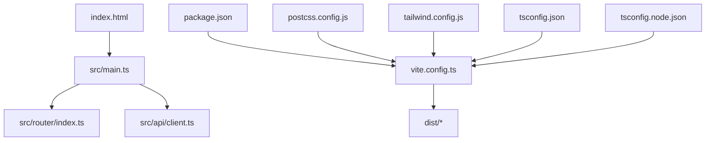
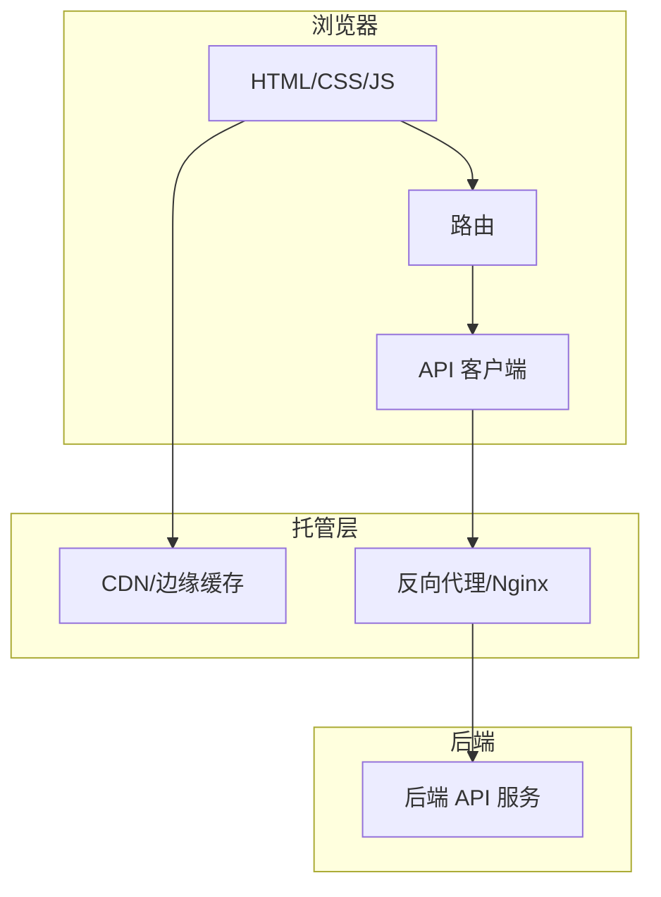
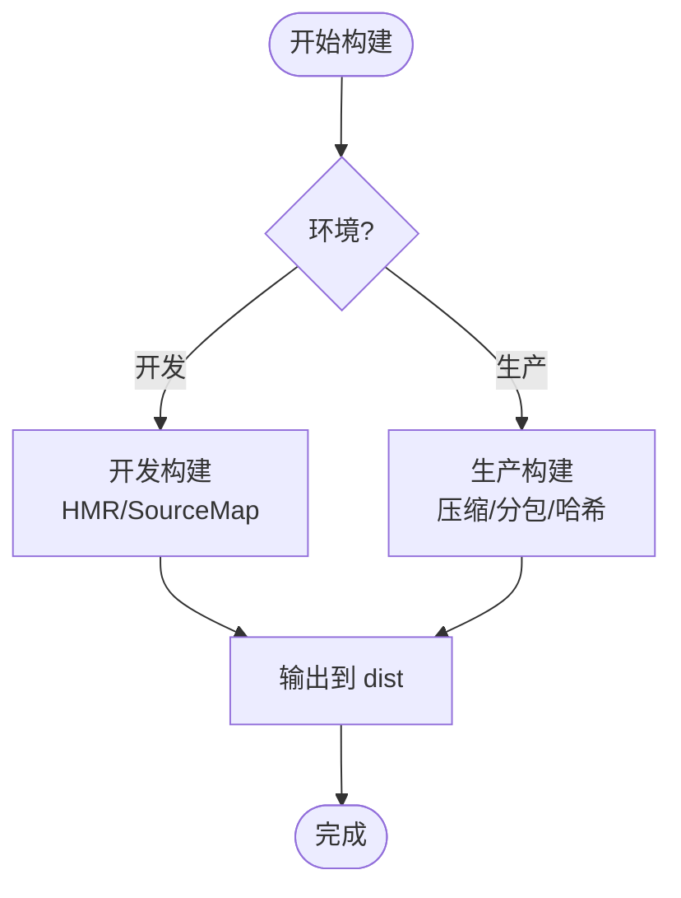
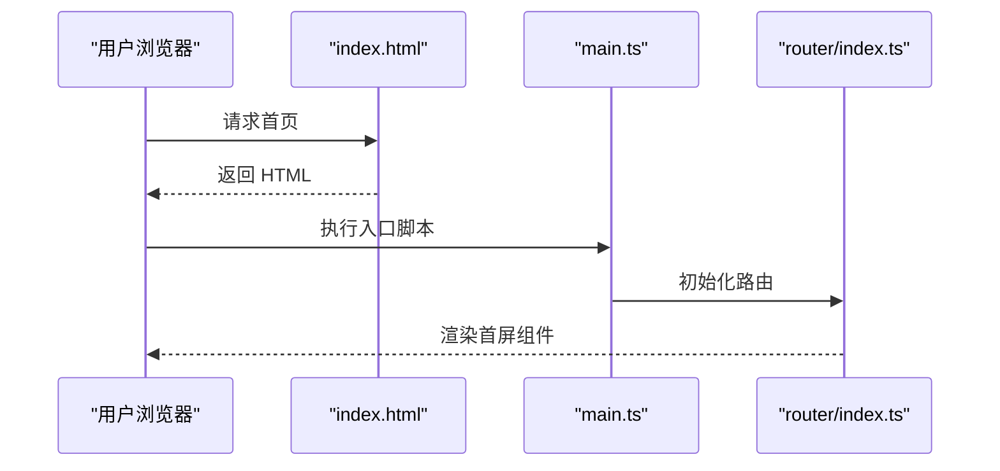
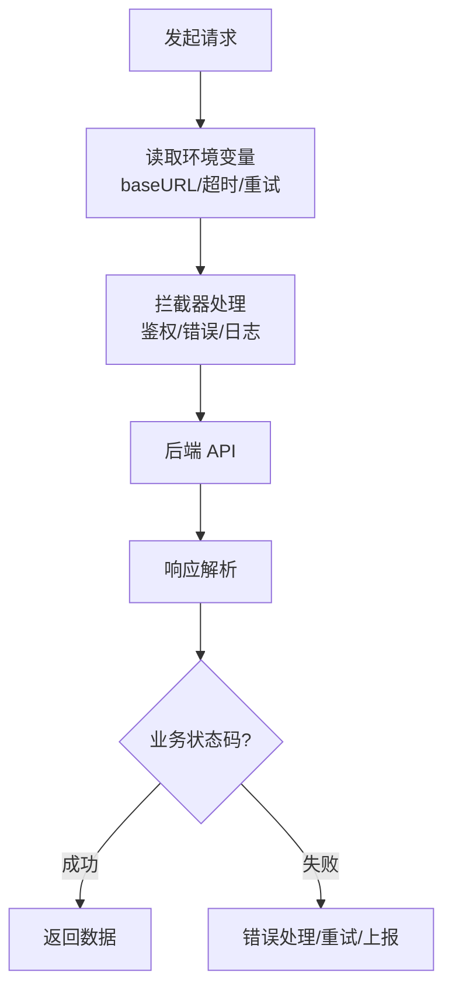
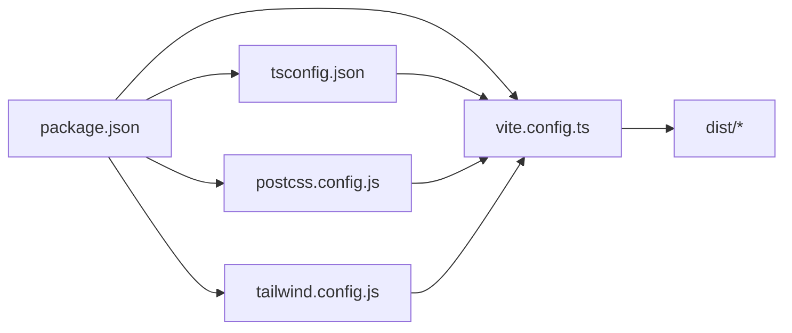

# 部署指南

<cite>
**本文引用的文件**
- [package.json](file://package.json)
- [vite.config.ts](file://vite.config.ts)
- [index.html](file://index.html)
- [src/main.ts](file://src/main.ts)
- [src/env.d.ts](file://src/env.d.ts)
- [src/api/client.ts](file://src/api/client.ts)
- [src/router/index.ts](file://src/router/index.ts)
- [postcss.config.js](file://postcss.config.js)
- [tailwind.config.js](file://tailwind.config.js)
- [tsconfig.json](file://tsconfig.json)
- [tsconfig.node.json](file://tsconfig.node.json)
</cite>

## 目录
1. [简介](#简介)
2. [项目结构](#项目结构)
3. [核心组件](#核心组件)
4. [架构总览](#架构总览)
5. [详细组件分析](#详细组件分析)
6. [依赖分析](#依赖分析)
7. [性能考虑](#性能考虑)
8. [故障排查指南](#故障排查指南)
9. [结论](#结论)
10. [附录](#附录)

## 简介
本指南面向生产环境的前端应用部署，覆盖构建优化、静态资源与CDN集成、Docker容器化、环境变量管理、反向代理配置，以及主流云平台（Vercel、Netlify、GitHub Pages）的部署方式。同时提供CI/CD流水线示例、自动化部署流程、版本管理与回滚策略，并给出监控告警、错误追踪与性能监控方案建议。

## 项目结构
本项目为基于 Vite + TypeScript 的前端工程，主要入口与构建配置集中在根目录与 src 目录：
- 构建与打包：vite.config.ts、postcss.config.js、tailwind.config.js、tsconfig*.json
- 应用入口：src/main.ts、index.html
- 运行时配置：src/env.d.ts、src/api/client.ts（API 客户端）、src/router/index.ts（路由）
- 包管理：package.json（脚本、依赖、构建命令）

图表来源
- [vite.config.ts:1-200](file://vite.config.ts#L1-L200)
- [package.json:1-200](file://package.json#L1-L200)
- [postcss.config.js:1-200](file://postcss.config.js#L1-L200)
- [tailwind.config.js:1-200](file://tailwind.config.js#L1-L200)
- [tsconfig.json:1-200](file://tsconfig.json#L1-L200)
- [tsconfig.node.json:1-200](file://tsconfig.node.json#L1-L200)

章节来源
- [package.json:1-200](file://package.json#L1-L200)
- [vite.config.ts:1-200](file://vite.config.ts#L1-L200)
- [index.html:1-200](file://index.html#L1-L200)
- [src/main.ts:1-200](file://src/main.ts#L1-L200)
- [src/env.d.ts:1-200](file://src/env.d.ts#L1-L200)
- [src/api/client.ts:1-200](file://src/api/client.ts#L1-L200)
- [src/router/index.ts:1-200](file://src/router/index.ts#L1-L200)
- [postcss.config.js:1-200](file://postcss.config.js#L1-L200)
- [tailwind.config.js:1-200](file://tailwind.config.js#L1-L200)
- [tsconfig.json:1-200](file://tsconfig.json#L1-L200)
- [tsconfig.node.json:1-200](file://tsconfig.node.json#L1-L200)

## 核心组件
- 构建系统：Vite（通过 vite.config.ts 配置），PostCSS/Tailwind 样式处理，TypeScript 编译与类型检查。
- 应用入口：index.html 作为 SPA 入口，src/main.ts 初始化应用、挂载路由与状态。
- API 客户端：src/api/client.ts 统一封装请求、基础地址、拦截器与重试等。
- 路由：src/router/index.ts 定义页面路由与懒加载。
- 环境变量：src/env.d.ts 声明 Vite 注入的环境变量类型；运行期通过 import.meta.env.* 访问。

章节来源
- [vite.config.ts:1-200](file://vite.config.ts#L1-L200)
- [src/main.ts:1-200](file://src/main.ts#L1-L200)
- [src/api/client.ts:1-200](file://src/api/client.ts#L1-L200)
- [src/router/index.ts:1-200](file://src/router/index.ts#L1-L200)
- [src/env.d.ts:1-200](file://src/env.d.ts#L1-L200)

## 架构总览
前端应用以 SPA 形式运行，构建产物为静态资源，由 Web 服务器或 CDN 托管。运行时通过 API 客户端与后端服务通信，路由负责页面切换与代码分割。

图表来源
- [src/api/client.ts:1-200](file://src/api/client.ts#L1-L200)
- [src/router/index.ts:1-200](file://src/router/index.ts#L1-L200)
- [vite.config.ts:1-200](file://vite.config.ts#L1-L200)

## 详细组件分析

### 构建与打包（Vite）
- 构建目标：生产模式启用压缩、Tree-shaking、代码分割与资源哈希。
- 输出目录：默认 dist，便于直接部署到静态托管或 Nginx。
- 资源路径：根据部署子路径配置 base，确保静态资源正确引用。
- 样式管线：PostCSS + Tailwind，按需生成最小 CSS。
- TypeScript：严格类型检查与编译，提升可维护性。

图表来源
- [vite.config.ts:1-200](file://vite.config.ts#L1-L200)
- [package.json:1-200](file://package.json#L1-L200)

章节来源
- [vite.config.ts:1-200](file://vite.config.ts#L1-L200)
- [package.json:1-200](file://package.json#L1-L200)

### 应用入口与路由
- index.html 作为 SPA 入口，引入构建后的 JS/CSS。
- src/main.ts 初始化应用、注册插件、挂载根节点。
- src/router/index.ts 定义路由与懒加载，减少首屏体积。

图表来源
- [index.html:1-200](file://index.html#L1-L200)
- [src/main.ts:1-200](file://src/main.ts#L1-L200)
- [src/router/index.ts:1-200](file://src/router/index.ts#L1-L200)

章节来源
- [index.html:1-200](file://index.html#L1-L200)
- [src/main.ts:1-200](file://src/main.ts#L1-L200)
- [src/router/index.ts:1-200](file://src/router/index.ts#L1-L200)

### API 客户端与环境变量
- 基础地址：通过环境变量注入，支持多环境差异化配置。
- 请求封装：统一拦截器处理鉴权、错误码、重试与超时。
- 类型安全：结合 TypeScript 接口定义，保障前后端契约。

图表来源
- [src/api/client.ts:1-200](file://src/api/client.ts#L1-L200)
- [src/env.d.ts:1-200](file://src/env.d.ts#L1-L200)

章节来源
- [src/api/client.ts:1-200](file://src/api/client.ts#L1-L200)
- [src/env.d.ts:1-200](file://src/env.d.ts#L1-L200)

## 依赖分析
- 构建依赖：Vite、TypeScript、PostCSS、Tailwind 等，均在 package.json 中声明。
- 运行时依赖：Vue 生态与路由、状态管理等（具体以实际依赖为准）。
- 类型与校验：tsconfig 系列文件控制编译选项与模块解析。

图表来源
- [package.json:1-200](file://package.json#L1-L200)
- [vite.config.ts:1-200](file://vite.config.ts#L1-L200)
- [tsconfig.json:1-200](file://tsconfig.json#L1-L200)
- [postcss.config.js:1-200](file://postcss.config.js#L1-L200)
- [tailwind.config.js:1-200](file://tailwind.config.js#L1-L200)

章节来源
- [package.json:1-200](file://package.json#L1-L200)
- [tsconfig.json:1-200](file://tsconfig.json#L1-L200)
- [tsconfig.node.json:1-200](file://tsconfig.node.json#L1-L200)

## 性能考虑
- 构建优化
  - 生产模式开启压缩、Tree-shaking、代码分割与资源指纹。
  - 合理拆分路由与第三方库，减少首屏体积。
  - 使用 PostCSS/Tailwind 按需生成样式，避免冗余。
- 缓存策略
  - 静态资源使用内容哈希文件名，配合浏览器强缓存。
  - HTML 不缓存或短缓存，确保更新及时生效。
- 网络优化
  - 启用 Gzip/Brotli 压缩（在 Nginx/CDN 层）。
  - 使用 CDN 加速静态资源分发。
- 运行时优化
  - 图片与媒体资源懒加载与压缩。
  - 关键路径资源内联或预加载。

[本节为通用指导，无需特定文件来源]

## 故障排查指南
- 构建失败
  - 检查 TypeScript 类型错误与依赖版本冲突。
  - 确认 Node 版本与包管理器一致。
- 运行时白屏
  - 检查路由 base 与部署路径是否匹配。
  - 检查环境变量是否正确注入与命名空间。
- 跨域与鉴权
  - 核对 API 基础地址与 CORS 配置。
  - 检查 Token 注入与刷新逻辑。
- 资源 404
  - 确认静态资源路径与 CDN 域名配置。
  - 检查 Nginx 重写规则与 SPA 路由 fallback。

章节来源
- [vite.config.ts:1-200](file://vite.config.ts#L1-L200)
- [src/api/client.ts:1-200](file://src/api/client.ts#L1-L200)
- [src/router/index.ts:1-200](file://src/router/index.ts#L1-L200)

## 结论
本指南提供了从本地构建到生产部署的全链路实践，涵盖构建优化、静态资源与 CDN、容器化、环境变量、反向代理、云平台部署、CI/CD、版本与回滚、监控与性能。建议在生产前进行端到端演练与压测，确保稳定性与可观测性。

[本节为总结性内容，无需特定文件来源]

## 附录

### 生产环境构建优化清单
- 启用生产模式构建，关闭 SourceMap（或仅对关键错误开启）。
- 配置 base 与资源路径，适配子路径部署。
- 启用 Gzip/Brotli 压缩与 HTTP/2。
- 使用 CDN 缓存静态资源，设置合适的 Cache-Control。
- 对大依赖进行分包与懒加载。

章节来源
- [vite.config.ts:1-200](file://vite.config.ts#L1-L200)
- [package.json:1-200](file://package.json#L1-L200)

### 静态资源部署与 CDN 集成
- 将 dist 目录上传至对象存储或静态托管平台。
- 配置 CDN 源站指向托管地址，开启缓存与压缩。
- 设置自定义域名与 HTTPS，配置重定向与回退规则。
- 对 HTML 禁用缓存或设置短缓存，确保更新即时生效。

章节来源
- [vite.config.ts:1-200](file://vite.config.ts#L1-L200)
- [index.html:1-200](file://index.html#L1-L200)

### Docker 容器化部署
- 多阶段构建：第一阶段安装依赖并构建，第二阶段仅拷贝产物。
- 镜像最小化：使用精简基础镜像，仅包含 Nginx 或轻量 Web 服务器。
- 环境变量：通过启动参数或配置文件注入 API 地址、调试开关等。
- 健康检查：暴露健康检查端点或依赖 Nginx 默认页。

章节来源
- [package.json:1-200](file://package.json#L1-L200)
- [vite.config.ts:1-200](file://vite.config.ts#L1-L200)

### 环境变量配置
- 构建期变量：通过 Vite 注入，区分开发与生产。
- 运行期变量：通过 Nginx 或网关注入，或在客户端动态获取。
- 敏感信息：避免硬编码，使用密钥管理服务或平台 Secret。

章节来源
- [src/env.d.ts:1-200](file://src/env.d.ts#L1-L200)
- [src/api/client.ts:1-200](file://src/api/client.ts#L1-L200)

### 反向代理设置（Nginx）
- 静态资源：指向 dist 目录，启用缓存与压缩。
- SPA 路由：所有未知路径回退到 index.html。
- API 代理：将 /api 转发至后端服务，配置超时与重试。
- HTTPS：配置证书与强制跳转。

章节来源
- [vite.config.ts:1-200](file://vite.config.ts#L1-L200)
- [src/router/index.ts:1-200](file://src/router/index.ts#L1-L200)

### 云平台部署指南
- Vercel
  - 框架选择：Vite/Vue，自动检测构建脚本。
  - 环境变量：在平台设置中配置 API 地址等。
  - 预览与生产：分支触发构建与部署。
- Netlify
  - 构建命令与发布目录：按项目配置。
  - 重定向：SPA 回退到 index.html。
  - 环境变量：在控制台配置。
- GitHub Pages
  - 使用 Actions 构建并推送 dist 到 gh-pages 分支。
  - 自定义域名与 HTTPS。
  - 注意 base 路径配置。

章节来源
- [package.json:1-200](file://package.json#L1-L200)
- [vite.config.ts:1-200](file://vite.config.ts#L1-L200)

### CI/CD 流水线与自动化部署
- 触发条件：Push/Pull Request 事件。
- 步骤：安装依赖、类型检查、构建、测试、产物归档。
- 部署：根据分支或标签发布到对应环境。
- 通知：构建与部署结果通知。

章节来源
- [package.json:1-200](file://package.json#L1-L200)

### 版本管理与回滚策略
- 版本号：语义化版本，打 Tag 并关联构建产物。
- 灰度发布：按流量或用户分桶逐步放量。
- 快速回滚：保留历史版本，一键切换。
- 变更审计：记录每次发布的变更与影响范围。

[本节为通用指导，无需特定文件来源]

### 监控告警、错误追踪与性能监控
- 错误追踪：接入前端错误上报与堆栈收集，关联版本与环境。
- 性能监控：采集首屏时间、长任务、资源加载耗时。
- 告警策略：阈值告警与异常趋势告警，联动通知渠道。
- 可观测性：统一日志格式与指标导出，便于分析与排障。

[本节为通用指导，无需特定文件来源]