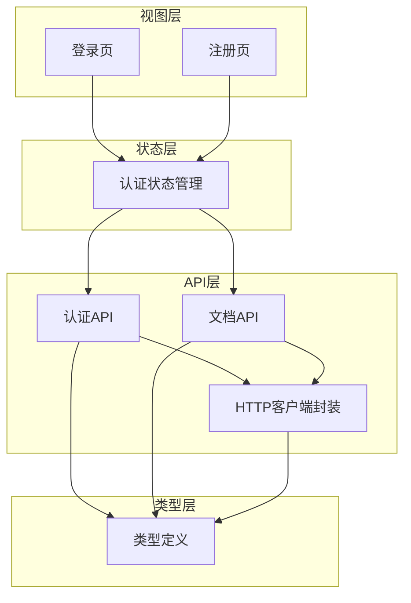
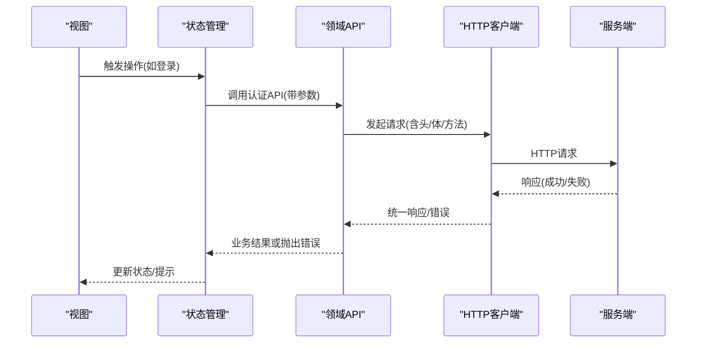
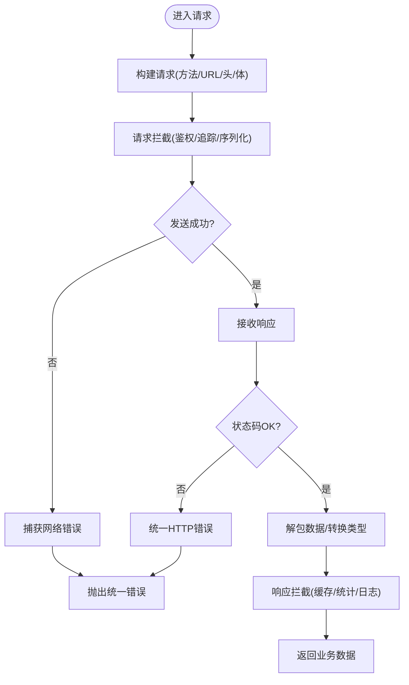
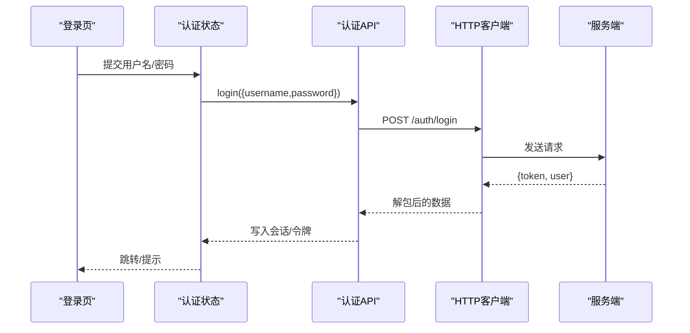
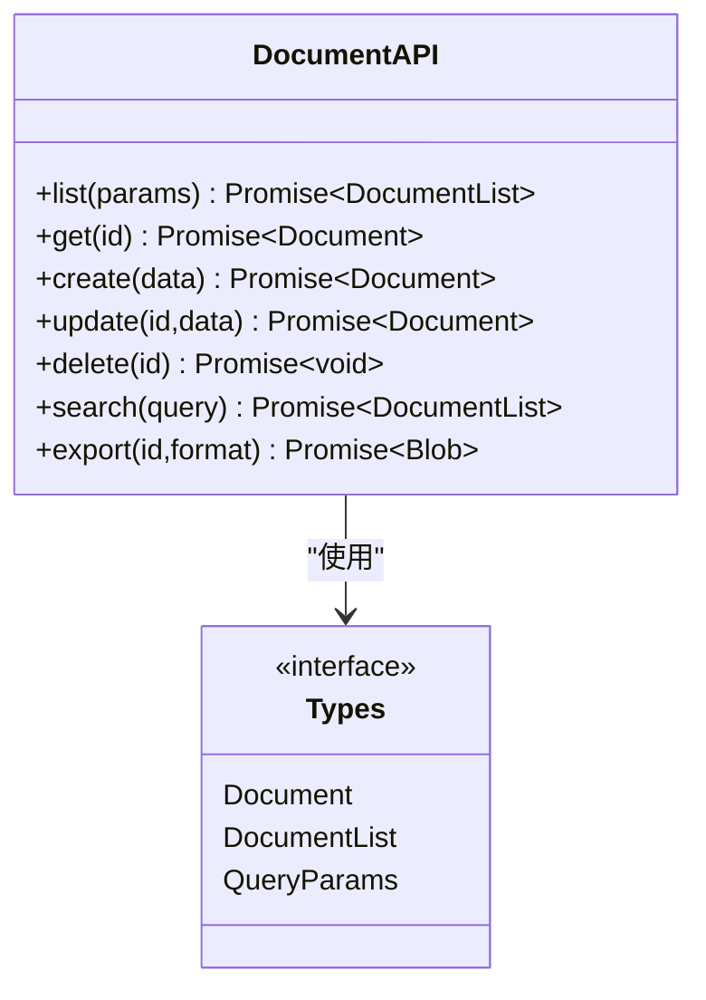
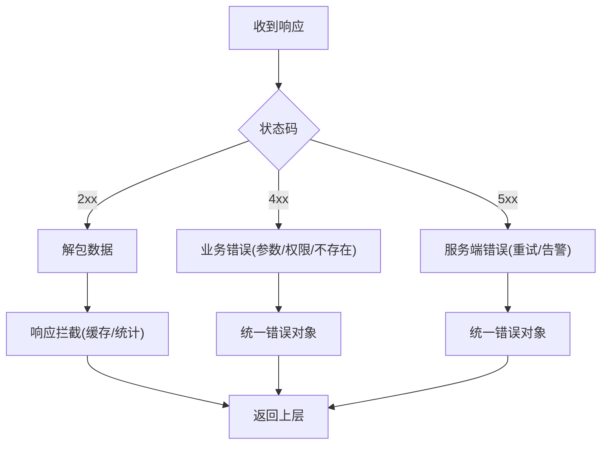
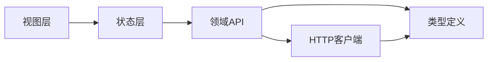

# API设计

<cite>
**本文引用的文件**
- [src/api/client.ts](file://src/api/client.ts)
- [src/api/auth.ts](file://src/api/auth.ts)
- [src/api/documents.ts](file://src/api/documents.ts)
- [src/types/index.ts](file://src/types/index.ts)
- [src/stores/auth.ts](file://src/stores/auth.ts)
- [src/views/Login.vue](file://src/views/Login.vue)
- [src/views/Register.vue](file://src/views/Register.vue)
</cite>

## 目录
1. [简介](#简介)
2. [项目结构](#项目结构)
3. [核心组件](#核心组件)
4. [架构总览](#架构总览)
5. [详细组件分析](#详细组件分析)
6. [依赖分析](#依赖分析)
7. [性能考虑](#性能考虑)
8. [故障排查指南](#故障排查指南)
9. [结论](#结论)
10. [附录](#附录)

## 简介
本文件面向前端API层，系统化说明HTTP客户端封装策略、统一请求处理机制、错误处理策略与拦截器使用；阐述认证API与文档API的设计模式，强调接口抽象与类型安全实现。同时提供API调用流程图与错误处理机制，并给出API集成的最佳实践，帮助开发者快速、稳定地集成后端服务。

## 项目结构
本项目采用“按能力分层”的组织方式：
- api层：封装HTTP客户端、定义领域API（认证、文档）
- types层：集中定义请求/响应类型，保证类型安全
- stores层：状态管理（如认证态）
- views层：页面级调用API，驱动UI更新

图表来源
- [src/views/Login.vue:1-200](file://src/views/Login.vue#L1-L200)
- [src/views/Register.vue:1-200](file://src/views/Register.vue#L1-L200)
- [src/stores/auth.ts:1-200](file://src/stores/auth.ts#L1-L200)
- [src/api/auth.ts:1-200](file://src/api/auth.ts#L1-L200)
- [src/api/documents.ts:1-200](file://src/api/documents.ts#L1-L200)
- [src/api/client.ts:1-200](file://src/api/client.ts#L1-L200)
- [src/types/index.ts:1-200](file://src/types/index.ts#L1-L200)

章节来源
- [src/api/client.ts:1-200](file://src/api/client.ts#L1-L200)
- [src/api/auth.ts:1-200](file://src/api/auth.ts#L1-L200)
- [src/api/documents.ts:1-200](file://src/api/documents.ts#L1-L200)
- [src/types/index.ts:1-200](file://src/types/index.ts#L1-L200)
- [src/stores/auth.ts:1-200](file://src/stores/auth.ts#L1-L200)
- [src/views/Login.vue:1-200](file://src/views/Login.vue#L1-L200)
- [src/views/Register.vue:1-200](file://src/views/Register.vue#L1-L200)

## 核心组件
- HTTP客户端封装：统一创建实例、设置基础URL、请求/响应拦截、错误归一化、重试与取消等扩展点
- 认证API：登录、注册、获取当前用户信息、刷新令牌等，遵循RESTful风格，返回统一数据结构
- 文档API：文档的CRUD、版本、搜索、导出等，基于资源模型进行抽象
- 类型系统：集中定义请求体、响应体、分页、错误码等类型，贯穿API层与视图层

章节来源
- [src/api/client.ts:1-200](file://src/api/client.ts#L1-L200)
- [src/api/auth.ts:1-200](file://src/api/auth.ts#L1-L200)
- [src/api/documents.ts:1-200](file://src/api/documents.ts#L1-L200)
- [src/types/index.ts:1-200](file://src/types/index.ts#L1-L200)

## 架构总览
整体采用“视图→状态→API→客户端→网络”的分层架构。客户端负责统一的请求构造、拦截与错误处理；API模块按领域划分，暴露类型安全的函数；状态层负责会话与缓存；视图仅关注交互与展示。

图表来源
- [src/views/Login.vue:1-200](file://src/views/Login.vue#L1-L200)
- [src/stores/auth.ts:1-200](file://src/stores/auth.ts#L1-L200)
- [src/api/auth.ts:1-200](file://src/api/auth.ts#L1-L200)
- [src/api/client.ts:1-200](file://src/api/client.ts#L1-L200)

## 详细组件分析

### HTTP客户端封装策略
- 统一实例：集中配置基础URL、超时、默认头等
- 请求拦截：注入鉴权头、追踪ID、幂等键、请求体序列化
- 响应拦截：统一解包数据、转换时间戳、合并分页元信息
- 错误处理：将HTTP错误、业务错误、网络异常归一为统一错误对象
- 可插拔扩展：支持重试、取消、节流、缓存等中间件式扩展

图表来源
- [src/api/client.ts:1-200](file://src/api/client.ts#L1-L200)

章节来源
- [src/api/client.ts:1-200](file://src/api/client.ts#L1-L200)

### 认证API设计模式
- 资源建模：用户、令牌、会话
- 端点约定：登录、注册、获取当前用户、刷新令牌
- 返回结构：统一数据包装，包含数据、分页、错误码
- 类型安全：请求体/响应体在types中统一定义，API函数强类型约束

图表来源
- [src/views/Login.vue:1-200](file://src/views/Login.vue#L1-L200)
- [src/stores/auth.ts:1-200](file://src/stores/auth.ts#L1-L200)
- [src/api/auth.ts:1-200](file://src/api/auth.ts#L1-L200)
- [src/api/client.ts:1-200](file://src/api/client.ts#L1-L200)

章节来源
- [src/api/auth.ts:1-200](file://src/api/auth.ts#L1-L200)
- [src/types/index.ts:1-200](file://src/types/index.ts#L1-L200)
- [src/stores/auth.ts:1-200](file://src/stores/auth.ts#L1-L200)
- [src/views/Login.vue:1-200](file://src/views/Login.vue#L1-L200)

### 文档API设计模式
- 资源建模：文档、版本、标签、评论
- 端点约定：列表、详情、创建、更新、删除、搜索、导出
- 查询参数：分页、排序、过滤条件
- 类型安全：通过类型定义约束查询参数与响应结构

图表来源
- [src/api/documents.ts:1-200](file://src/api/documents.ts#L1-L200)
- [src/types/index.ts:1-200](file://src/types/index.ts#L1-L200)

章节来源
- [src/api/documents.ts:1-200](file://src/api/documents.ts#L1-L200)
- [src/types/index.ts:1-200](file://src/types/index.ts#L1-L200)

### 统一请求处理与错误处理机制
- 统一入口：所有HTTP请求经客户端封装，避免重复逻辑
- 错误分类：网络错误、HTTP状态错误、业务错误分别处理
- 错误呈现：全局提示、路由守卫、表单校验反馈
- 重试与降级：对幂等GET请求支持指数退避重试；关键路径提供降级策略

图表来源
- [src/api/client.ts:1-200](file://src/api/client.ts#L1-L200)

章节来源
- [src/api/client.ts:1-200](file://src/api/client.ts#L1-L200)

### 拦截器的使用
- 请求拦截：自动附加Authorization头、TraceId、Content-Type
- 响应拦截：统一解包data字段、时间格式转换、分页元信息合并
- 错误拦截：根据状态码映射业务错误码，便于前端统一处理
- 扩展点：可插入日志、埋点、缓存、限流等横切逻辑

章节来源
- [src/api/client.ts:1-200](file://src/api/client.ts#L1-L200)

### 接口抽象与类型安全实现
- 类型先行：在types中定义请求/响应、分页、错误码等
- 函数签名：API函数以类型约束参数与返回值，IDE智能提示完善
- 常量枚举：将状态码、错误码、枚举值集中管理，减少魔法字符串
- 契约测试：通过类型检查保障前后端契约一致性

章节来源
- [src/types/index.ts:1-200](file://src/types/index.ts#L1-L200)
- [src/api/auth.ts:1-200](file://src/api/auth.ts#L1-L200)
- [src/api/documents.ts:1-200](file://src/api/documents.ts#L1-L200)

## 依赖分析
- 视图依赖状态管理，状态管理依赖API层
- API层依赖客户端封装与类型定义
- 客户端封装不依赖具体业务，具备高内聚低耦合特性

图表来源
- [src/views/Login.vue:1-200](file://src/views/Login.vue#L1-L200)
- [src/stores/auth.ts:1-200](file://src/stores/auth.ts#L1-L200)
- [src/api/auth.ts:1-200](file://src/api/auth.ts#L1-L200)
- [src/api/documents.ts:1-200](file://src/api/documents.ts#L1-L200)
- [src/api/client.ts:1-200](file://src/api/client.ts#L1-L200)
- [src/types/index.ts:1-200](file://src/types/index.ts#L1-L200)

章节来源
- [src/api/client.ts:1-200](file://src/api/client.ts#L1-L200)
- [src/api/auth.ts:1-200](file://src/api/auth.ts#L1-L200)
- [src/api/documents.ts:1-200](file://src/api/documents.ts#L1-L200)
- [src/types/index.ts:1-200](file://src/types/index.ts#L1-L200)

## 性能考虑
- 请求去重与缓存：对相同GET请求做短期缓存，减少重复网络开销
- 批量请求：合并多次小请求为批量接口，降低握手成本
- 懒加载与分页：列表数据按需加载，避免首屏过重
- 取消与节流：长耗时操作支持取消；输入类操作节流防抖
- 压缩与CDN：启用Gzip/Brotli，静态资源走CDN

[本节为通用指导，无需特定文件引用]

## 故障排查指南
- 常见问题定位
  - 401未授权：检查令牌是否过期、是否自动刷新
  - 403权限不足：核对角色与资源权限
  - 404资源不存在：核对ID与路由参数
  - 500服务端错误：查看服务端日志与错误码
- 调试建议
  - 开启请求/响应日志，记录TraceId
  - 使用浏览器网络面板观察请求头、载荷、响应体
  - 在客户端错误拦截处打印堆栈与上下文
- 恢复策略
  - 对幂等请求实施重试与退避
  - 关键路径提供降级与本地缓存
  - 用户可见的错误需友好提示与引导

章节来源
- [src/api/client.ts:1-200](file://src/api/client.ts#L1-L200)
- [src/stores/auth.ts:1-200](file://src/stores/auth.ts#L1-L200)

## 结论
本API设计通过统一的HTTP客户端封装、清晰的领域API分层、严格的类型系统与完善的错误处理机制，实现了高内聚、低耦合、可扩展的前端服务层。配合拦截器与重试策略，提升了稳定性与可维护性。建议在实际项目中持续完善类型契约、监控与日志，确保前后端协作高效可靠。

[本节为总结，无需特定文件引用]

## 附录
- API集成最佳实践
  - 始终通过API层调用，禁止在视图中直接发起HTTP请求
  - 使用类型定义约束请求与响应，充分利用IDE提示
  - 对敏感操作增加二次确认与幂等键
  - 统一错误提示与埋点上报
  - 对高频接口实施缓存与去重
  - 使用环境变量管理基础URL与开关
- 参考流程
  - 登录流程：视图→状态→认证API→客户端→服务端
  - 文档列表：视图→状态→文档API→客户端→服务端

[本节为补充说明，无需特定文件引用]