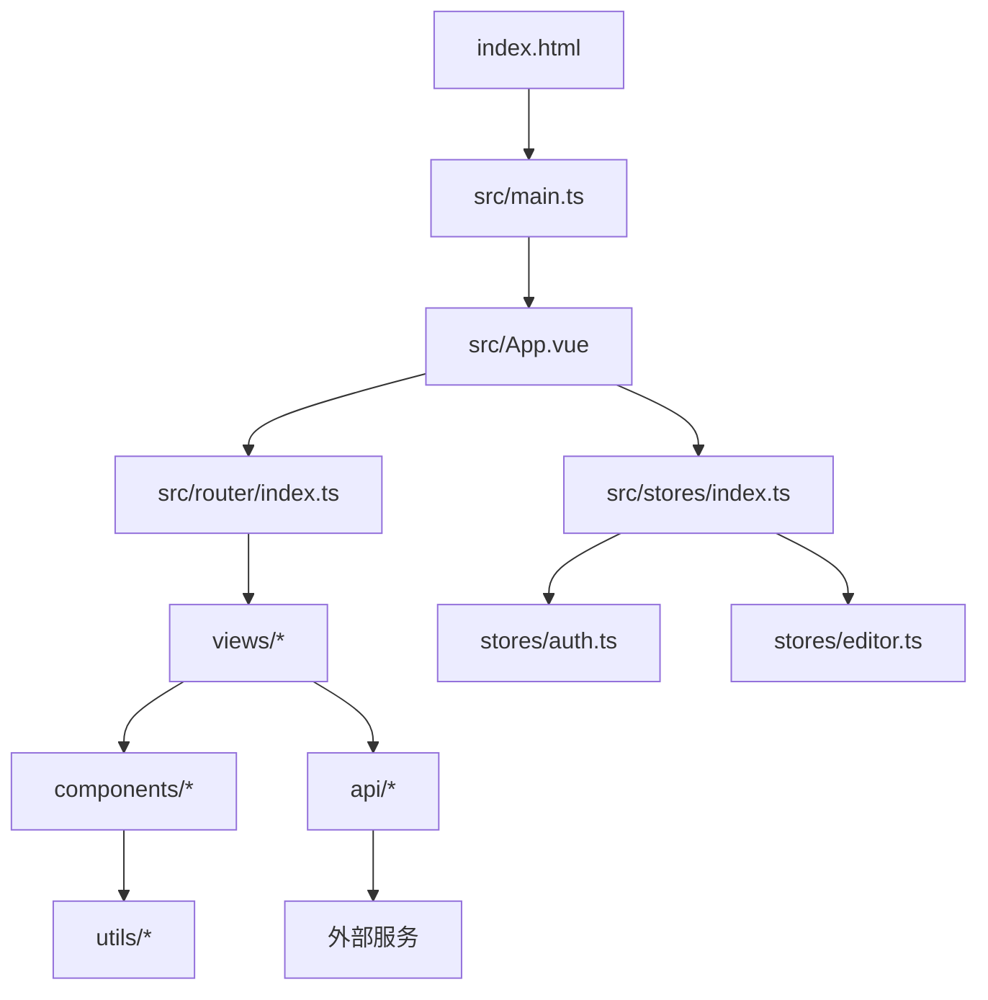
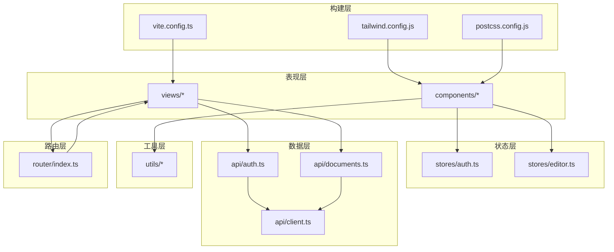
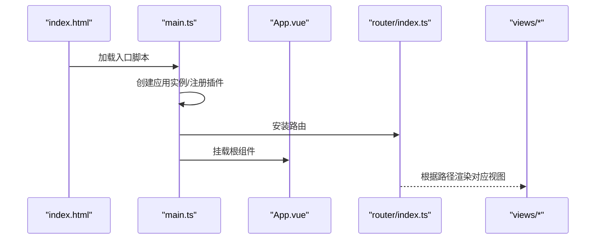
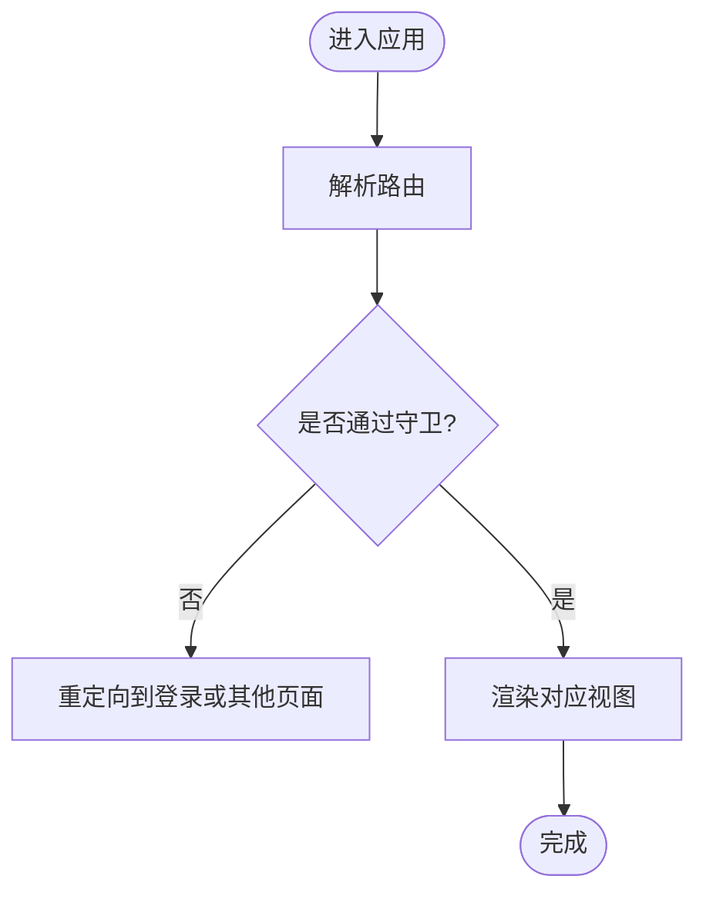
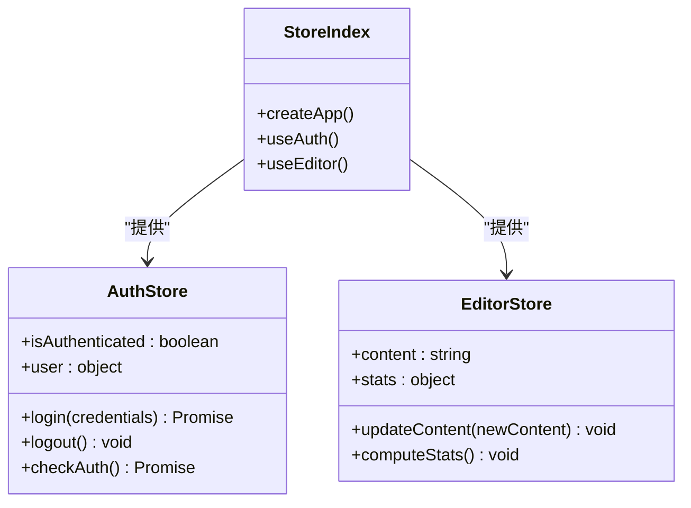
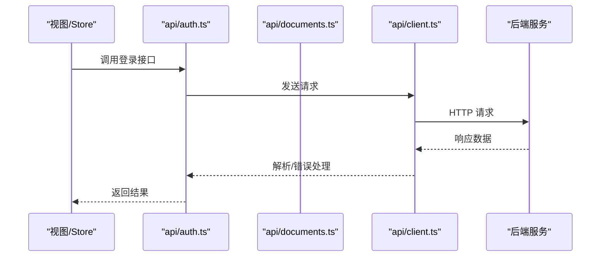
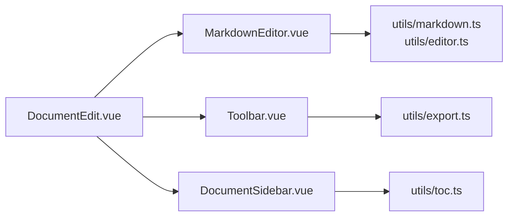
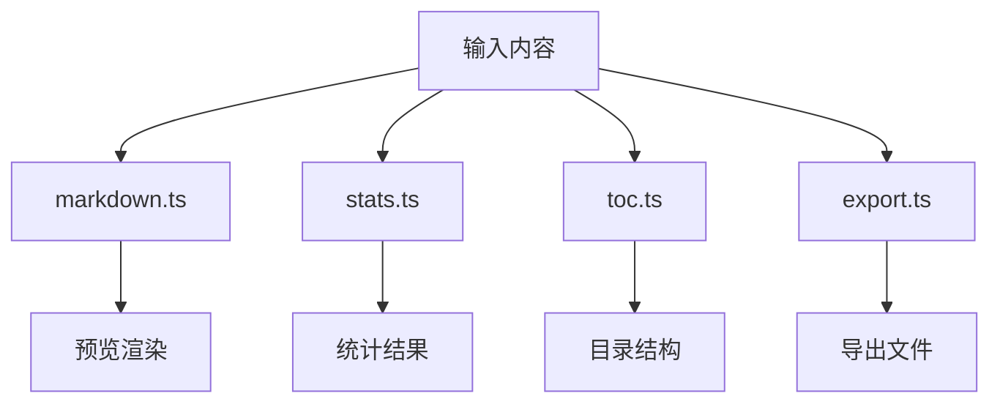
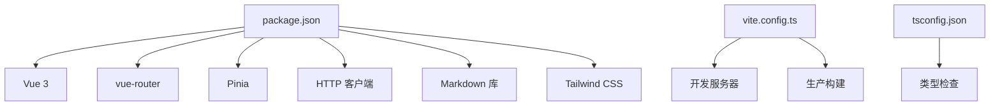

# 整体架构

<cite>
**本文引用的文件**
- [index.html](file://index.html)
- [package.json](file://package.json)
- [vite.config.ts](file://vite.config.ts)
- [tsconfig.json](file://tsconfig.json)
- [tailwind.config.js](file://tailwind.config.js)
- [postcss.config.js](file://postcss.config.js)
- [src/main.ts](file://src/main.ts)
- [src/App.vue](file://src/App.vue)
- [src/router/index.ts](file://src/router/index.ts)
- [src/stores/index.ts](file://src/stores/index.ts)
- [src/stores/auth.ts](file://src/stores/auth.ts)
- [src/stores/editor.ts](file://src/stores/editor.ts)
- [src/api/client.ts](file://src/api/client.ts)
- [src/api/auth.ts](file://src/api/auth.ts)
- [src/api/documents.ts](file://src/api/documents.ts)
- [src/views/Home.vue](file://src/views/Home.vue)
- [src/views/Login.vue](file://src/views/Login.vue)
- [src/views/DocumentEdit.vue](file://src/views/DocumentEdit.vue)
- [src/components/MarkdownEditor.vue](file://src/components/MarkdownEditor.vue)
- [src/components/Toolbar.vue](file://src/components/Toolbar.vue)
- [src/components/DocumentSidebar.vue](file://src/components/DocumentSidebar.vue)
- [src/utils/markdown.ts](file://src/utils/markdown.ts)
- [src/utils/export.ts](file://src/utils/export.ts)
- [src/utils/image.ts](file://src/utils/image.ts)
- [src/utils/toc.ts](file://src/utils/toc.ts)
- [src/utils/stats.ts](file://src/utils/stats.ts)
- [src/utils/editor.ts](file://src/utils/editor.ts)
- [src/types/index.ts](file://src/types/index.ts)
</cite>

## 目录
1. [简介](#简介)
2. [项目结构](#项目结构)
3. [核心组件](#核心组件)
4. [架构总览](#架构总览)
5. [详细组件分析](#详细组件分析)
6. [依赖分析](#依赖分析)
7. [性能考虑](#性能考虑)
8. [故障排查指南](#故障排查指南)
9. [结论](#结论)
10. [附录](#附录)

## 简介
本项目的技术栈为 Vue 3 + TypeScript + Vite，采用单页应用（SPA）架构。前端通过路由驱动视图切换，使用状态管理集中管理认证与编辑器状态，API 层封装 HTTP 请求，工具层提供 Markdown、导出、图片处理等通用能力。构建流程由 Vite 驱动，配合 Tailwind CSS 与 PostCSS 完成样式编译与优化。该文档面向开发者，帮助快速理解入口点、根组件、路由配置、状态管理、API 分层、工具模块以及构建与部署流程。

## 项目结构
项目采用按功能域划分的模块化组织方式：
- 入口与配置
  - index.html：页面入口，挂载根节点
  - vite.config.ts：Vite 构建配置（端口、代理、插件、别名等）
  - tsconfig.json/tsconfig.node.json：TypeScript 编译选项
  - tailwind.config.js/postcss.config.js：样式与 PostCSS 配置
  - package.json：依赖与脚本
- 源代码 src
  - main.ts：应用初始化、插件注册、路由与状态挂载
  - App.vue：根组件，承载全局布局与路由出口
  - router/index.ts：路由定义与导航守卫
  - stores/*：基于 Pinia 的状态管理（auth、editor 等）
  - api/*：HTTP 客户端与接口封装（client、auth、documents）
  - views/*：页面级组件（Home、Login、DocumentEdit 等）
  - components/*：可复用 UI 组件（MarkdownEditor、Toolbar、DocumentSidebar）
  - utils/*：工具函数（markdown、export、image、toc、stats、editor）
  - types/index.ts：共享类型定义

图表来源
- [index.html:1-50](file://index.html#L1-L50)
- [src/main.ts:1-120](file://src/main.ts#L1-L120)
- [src/App.vue:1-200](file://src/App.vue#L1-L200)
- [src/router/index.ts:1-200](file://src/router/index.ts#L1-L200)
- [src/stores/index.ts:1-120](file://src/stores/index.ts#L1-L120)
- [src/stores/auth.ts:1-200](file://src/stores/auth.ts#L1-L200)
- [src/stores/editor.ts:1-200](file://src/stores/editor.ts#L1-L200)
- [src/api/client.ts:1-200](file://src/api/client.ts#L1-L200)
- [src/api/auth.ts:1-200](file://src/api/auth.ts#L1-L200)
- [src/api/documents.ts:1-200](file://src/api/documents.ts#L1-L200)
- [src/views/Home.vue:1-200](file://src/views/Home.vue#L1-L200)
- [src/views/Login.vue:1-200](file://src/views/Login.vue#L1-L200)
- [src/views/DocumentEdit.vue:1-200](file://src/views/DocumentEdit.vue#L1-L200)
- [src/components/MarkdownEditor.vue:1-200](file://src/components/MarkdownEditor.vue#L1-L200)
- [src/components/Toolbar.vue:1-200](file://src/components/Toolbar.vue#L1-L200)
- [src/components/DocumentSidebar.vue:1-200](file://src/components/DocumentSidebar.vue#L1-L200)
- [src/utils/markdown.ts:1-200](file://src/utils/markdown.ts#L1-L200)
- [src/utils/export.ts:1-200](file://src/utils/export.ts#L1-L200)
- [src/utils/image.ts:1-200](file://src/utils/image.ts#L1-L200)
- [src/utils/toc.ts:1-200](file://src/utils/toc.ts#L1-L200)
- [src/utils/stats.ts:1-200](file://src/utils/stats.ts#L1-L200)
- [src/utils/editor.ts:1-200](file://src/utils/editor.ts#L1-L200)

章节来源
- [index.html:1-50](file://index.html#L1-L50)
- [package.json:1-120](file://package.json#L1-L120)
- [vite.config.ts:1-200](file://vite.config.ts#L1-L200)
- [tsconfig.json:1-120](file://tsconfig.json#L1-L120)
- [tailwind.config.js:1-120](file://tailwind.config.js#L1-L120)
- [postcss.config.js:1-120](file://postcss.config.js#L1-L120)

## 核心组件
- 应用入口与初始化
  - 入口 HTML 挂载根节点
  - main.ts 创建 Vue 应用实例，注册路由、状态管理与全局插件，挂载到 DOM
- 根组件
  - App.vue 作为根容器，包含全局布局与 <router-view/> 渲染区域
- 路由
  - router/index.ts 定义页面路由与嵌套路由，实现无刷新导航
- 状态管理
  - stores/index.ts 聚合 store 实例
  - stores/auth.ts 管理登录态、用户信息、鉴权相关逻辑
  - stores/editor.ts 管理编辑器内容、光标、统计等
- API 层
  - api/client.ts 封装 HTTP 客户端（请求拦截、错误处理、基础 URL）
  - api/auth.ts、api/documents.ts 按领域划分接口方法
- 视图与组件
  - views/* 页面级组件，组合业务逻辑与展示
  - components/* 可复用 UI 组件，关注展示与交互细节
- 工具与类型
  - utils/* 提供 Markdown 解析、导出、图片处理、目录生成、统计、编辑器辅助等
  - types/index.ts 统一类型定义，提升 TS 体验与一致性

章节来源
- [src/main.ts:1-120](file://src/main.ts#L1-L120)
- [src/App.vue:1-200](file://src/App.vue#L1-L200)
- [src/router/index.ts:1-200](file://src/router/index.ts#L1-L200)
- [src/stores/index.ts:1-120](file://src/stores/index.ts#L1-L120)
- [src/stores/auth.ts:1-200](file://src/stores/auth.ts#L1-L200)
- [src/stores/editor.ts:1-200](file://src/stores/editor.ts#L1-L200)
- [src/api/client.ts:1-200](file://src/api/client.ts#L1-L200)
- [src/api/auth.ts:1-200](file://src/api/auth.ts#L1-L200)
- [src/api/documents.ts:1-200](file://src/api/documents.ts#L1-L200)
- [src/views/Home.vue:1-200](file://src/views/Home.vue#L1-L200)
- [src/views/Login.vue:1-200](file://src/views/Login.vue#L1-L200)
- [src/views/DocumentEdit.vue:1-200](file://src/views/DocumentEdit.vue#L1-L200)
- [src/components/MarkdownEditor.vue:1-200](file://src/components/MarkdownEditor.vue#L1-L200)
- [src/components/Toolbar.vue:1-200](file://src/components/Toolbar.vue#L1-L200)
- [src/components/DocumentSidebar.vue:1-200](file://src/components/DocumentSidebar.vue#L1-L200)
- [src/utils/markdown.ts:1-200](file://src/utils/markdown.ts#L1-L200)
- [src/utils/export.ts:1-200](file://src/utils/export.ts#L1-L200)
- [src/utils/image.ts:1-200](file://src/utils/image.ts#L1-L200)
- [src/utils/toc.ts:1-200](file://src/utils/toc.ts#L1-L200)
- [src/utils/stats.ts:1-200](file://src/utils/stats.ts#L1-L200)
- [src/utils/editor.ts:1-200](file://src/utils/editor.ts#L1-L200)
- [src/types/index.ts:1-200](file://src/types/index.ts#L1-L200)

## 架构总览
本项目采用典型的 SPA 分层架构：
- 表现层：Vue 组件（views、components），负责 UI 与交互
- 状态层：Pinia stores，集中管理跨组件状态（认证、编辑器）
- 数据层：API 模块封装 HTTP 请求，统一错误处理与重试策略
- 工具层：utils 提供纯函数与通用能力，保持组件轻量
- 路由层：vue-router 控制页面导航与权限校验
- 构建层：Vite + TypeScript + Tailwind + PostCSS，提供开发体验与生产优化

图表来源
- [src/router/index.ts:1-200](file://src/router/index.ts#L1-L200)
- [src/stores/auth.ts:1-200](file://src/stores/auth.ts#L1-L200)
- [src/stores/editor.ts:1-200](file://src/stores/editor.ts#L1-L200)
- [src/api/client.ts:1-200](file://src/api/client.ts#L1-L200)
- [src/api/auth.ts:1-200](file://src/api/auth.ts#L1-L200)
- [src/api/documents.ts:1-200](file://src/api/documents.ts#L1-L200)
- [src/utils/markdown.ts:1-200](file://src/utils/markdown.ts#L1-L200)
- [src/utils/export.ts:1-200](file://src/utils/export.ts#L1-L200)
- [src/utils/image.ts:1-200](file://src/utils/image.ts#L1-L200)
- [src/utils/toc.ts:1-200](file://src/utils/toc.ts#L1-L200)
- [src/utils/stats.ts:1-200](file://src/utils/stats.ts#L1-L200)
- [src/utils/editor.ts:1-200](file://src/utils/editor.ts#L1-L200)
- [vite.config.ts:1-200](file://vite.config.ts#L1-L200)
- [tailwind.config.js:1-120](file://tailwind.config.js#L1-L120)
- [postcss.config.js:1-120](file://postcss.config.js#L1-L120)

## 详细组件分析

### 应用入口与根组件
- 入口流程
  - index.html 提供挂载节点
  - main.ts 创建 Vue 应用，注册路由、状态管理、插件，并挂载到 DOM
- 根组件
  - App.vue 作为布局容器，包含全局导航或侧边栏，并通过 <router-view/> 渲染当前路由对应的视图

图表来源
- [index.html:1-50](file://index.html#L1-L50)
- [src/main.ts:1-120](file://src/main.ts#L1-L120)
- [src/App.vue:1-200](file://src/App.vue#L1-L200)
- [src/router/index.ts:1-200](file://src/router/index.ts#L1-L200)

章节来源
- [index.html:1-50](file://index.html#L1-L50)
- [src/main.ts:1-120](file://src/main.ts#L1-L120)
- [src/App.vue:1-200](file://src/App.vue#L1-L200)

### 路由与导航
- 路由定义
  - router/index.ts 声明页面路由与可能的嵌套路由，支持懒加载与导航守卫
- 导航流程
  - 用户点击触发路由变化，router-view 渲染目标视图
  - 可在路由层面进行鉴权检查与重定向

图表来源
- [src/router/index.ts:1-200](file://src/router/index.ts#L1-L200)

章节来源
- [src/router/index.ts:1-200](file://src/router/index.ts#L1-L200)

### 状态管理（认证与编辑器）
- 认证状态
  - stores/auth.ts 管理登录态、用户信息与鉴权方法，供视图与路由守卫使用
- 编辑器状态
  - stores/editor.ts 管理文档内容、元数据、统计信息等，供编辑器组件与工具使用
- 状态聚合
  - stores/index.ts 统一导出 store 实例，便于在 main.ts 中安装

图表来源
- [src/stores/auth.ts:1-200](file://src/stores/auth.ts#L1-L200)
- [src/stores/editor.ts:1-200](file://src/stores/editor.ts#L1-L200)
- [src/stores/index.ts:1-120](file://src/stores/index.ts#L1-L120)

章节来源
- [src/stores/auth.ts:1-200](file://src/stores/auth.ts#L1-L200)
- [src/stores/editor.ts:1-200](file://src/stores/editor.ts#L1-L200)
- [src/stores/index.ts:1-120](file://src/stores/index.ts#L1-L120)

### API 层设计
- HTTP 客户端
  - api/client.ts 封装请求发送、拦截器、错误处理、基础 URL 与超时设置
- 领域接口
  - api/auth.ts 封装认证相关接口（登录、注册、获取用户信息等）
  - api/documents.ts 封装文档相关接口（读取、保存、列表等）
- 调用流程
  - 视图或 store 调用领域接口，底层通过 client 发起请求并返回标准化结果

图表来源
- [src/api/client.ts:1-200](file://src/api/client.ts#L1-L200)
- [src/api/auth.ts:1-200](file://src/api/auth.ts#L1-L200)
- [src/api/documents.ts:1-200](file://src/api/documents.ts#L1-L200)

章节来源
- [src/api/client.ts:1-200](file://src/api/client.ts#L1-L200)
- [src/api/auth.ts:1-200](file://src/api/auth.ts#L1-L200)
- [src/api/documents.ts:1-200](file://src/api/documents.ts#L1-L200)

### 视图与组件
- 页面视图
  - Home.vue：首页展示与导航入口
  - Login.vue：登录表单与认证流程
  - DocumentEdit.vue：文档编辑主界面，组合编辑器、工具栏与侧边栏
- 可复用组件
  - MarkdownEditor.vue：Markdown 编辑器封装，集成预览、快捷键、事件回调
  - Toolbar.vue：工具按钮集合，触发导出、统计等操作
  - DocumentSidebar.vue：文档目录与导航，联动编辑器滚动

图表来源
- [src/views/DocumentEdit.vue:1-200](file://src/views/DocumentEdit.vue#L1-L200)
- [src/components/MarkdownEditor.vue:1-200](file://src/components/MarkdownEditor.vue#L1-L200)
- [src/components/Toolbar.vue:1-200](file://src/components/Toolbar.vue#L1-L200)
- [src/components/DocumentSidebar.vue:1-200](file://src/components/DocumentSidebar.vue#L1-L200)
- [src/utils/markdown.ts:1-200](file://src/utils/markdown.ts#L1-L200)
- [src/utils/editor.ts:1-200](file://src/utils/editor.ts#L1-L200)
- [src/utils/export.ts:1-200](file://src/utils/export.ts#L1-L200)
- [src/utils/toc.ts:1-200](file://src/utils/toc.ts#L1-L200)

章节来源
- [src/views/Home.vue:1-200](file://src/views/Home.vue#L1-L200)
- [src/views/Login.vue:1-200](file://src/views/Login.vue#L1-L200)
- [src/views/DocumentEdit.vue:1-200](file://src/views/DocumentEdit.vue#L1-L200)
- [src/components/MarkdownEditor.vue:1-200](file://src/components/MarkdownEditor.vue#L1-L200)
- [src/components/Toolbar.vue:1-200](file://src/components/Toolbar.vue#L1-L200)
- [src/components/DocumentSidebar.vue:1-200](file://src/components/DocumentSidebar.vue#L1-L200)

### 工具与类型
- 工具模块
  - markdown.ts：Markdown 解析与转换
  - export.ts：导出为 PDF/HTML/Markdown 等格式
  - image.ts：图片上传、压缩与预览
  - toc.ts：生成目录结构与锚点
  - stats.ts：字数、段落、阅读时长等统计
  - editor.ts：编辑器行为封装（光标、选区、快捷键）
- 类型定义
  - types/index.ts：统一类型，确保组件、store、API 间类型一致

图表来源
- [src/utils/markdown.ts:1-200](file://src/utils/markdown.ts#L1-L200)
- [src/utils/stats.ts:1-200](file://src/utils/stats.ts#L1-L200)
- [src/utils/toc.ts:1-200](file://src/utils/toc.ts#L1-L200)
- [src/utils/export.ts:1-200](file://src/utils/export.ts#L1-L200)

章节来源
- [src/utils/markdown.ts:1-200](file://src/utils/markdown.ts#L1-L200)
- [src/utils/export.ts:1-200](file://src/utils/export.ts#L1-L200)
- [src/utils/image.ts:1-200](file://src/utils/image.ts#L1-L200)
- [src/utils/toc.ts:1-200](file://src/utils/toc.ts#L1-L200)
- [src/utils/stats.ts:1-200](file://src/utils/stats.ts#L1-L200)
- [src/utils/editor.ts:1-200](file://src/utils/editor.ts#L1-L200)
- [src/types/index.ts:1-200](file://src/types/index.ts#L1-L200)

## 依赖分析
- 运行时依赖
  - Vue 3：UI 框架与响应式系统
  - vue-router：路由与导航
  - Pinia：状态管理
  - Axios/fetch：HTTP 请求（通过 client.ts 封装）
  - Markdown 库：解析与渲染
  - Tailwind CSS：原子化样式
- 构建与开发依赖
  - Vite：开发与构建工具
  - TypeScript：类型检查与编译
  - PostCSS/Tailwind：样式处理
  - ESLint/Prettier（可选）：代码规范

图表来源
- [package.json:1-120](file://package.json#L1-L120)
- [vite.config.ts:1-200](file://vite.config.ts#L1-L200)
- [tsconfig.json:1-120](file://tsconfig.json#L1-L120)

章节来源
- [package.json:1-120](file://package.json#L1-L120)
- [vite.config.ts:1-200](file://vite.config.ts#L1-L200)
- [tsconfig.json:1-120](file://tsconfig.json#L1-L120)

## 性能考虑
- 路由懒加载：将视图组件按需加载，减少首屏体积
- 组件拆分：将大组件拆分为更小的子组件，提升可维护性与渲染效率
- 状态最小化：仅存储必要状态，避免不必要的响应式开销
- 网络优化：合并请求、缓存策略、错误重试与超时控制
- 构建优化：开启 Tree-shaking、代码分割、资源压缩与 CDN 缓存
- 样式优化：使用 Tailwind 的按需编译，避免冗余 CSS

[本节为通用指导，不直接分析具体文件]

## 故障排查指南
- 启动失败
  - 检查端口占用与代理配置（vite.config.ts）
  - 确认环境变量与 .env 文件是否正确
- 路由跳转异常
  - 检查路由定义与命名是否正确
  - 查看导航守卫逻辑与重定向条件
- 状态同步问题
  - 确认 store 的 action 与 state 更新时机
  - 检查组件订阅与副作用清理
- API 请求错误
  - 检查请求头、基础 URL、跨域配置
  - 查看错误拦截器与重试策略
- 样式未生效
  - 确认 Tailwind 配置与 PostCSS 插件顺序
  - 检查类名拼写与构建产物

章节来源
- [vite.config.ts:1-200](file://vite.config.ts#L1-L200)
- [src/router/index.ts:1-200](file://src/router/index.ts#L1-L200)
- [src/stores/auth.ts:1-200](file://src/stores/auth.ts#L1-L200)
- [src/stores/editor.ts:1-200](file://src/stores/editor.ts#L1-L200)
- [src/api/client.ts:1-200](file://src/api/client.ts#L1-L200)
- [tailwind.config.js:1-120](file://tailwind.config.js#L1-L120)
- [postcss.config.js:1-120](file://postcss.config.js#L1-L120)

## 结论
本项目以 Vue 3 + TypeScript + Vite 为核心，采用清晰的模块化与分层架构：路由驱动视图、状态集中管理、API 封装统一、工具解耦复用。通过合理的代码组织与构建优化，既保证了开发体验，也兼顾了生产环境的性能与维护性。建议后续持续完善类型定义、单元测试与监控埋点，进一步提升质量与可观测性。

[本节为总结，不直接分析具体文件]

## 附录
- 关键配置文件说明
  - vite.config.ts：开发服务器、代理、插件、别名、构建输出等
  - tsconfig.json：编译器选项、模块解析、严格模式等
  - tailwind.config.js：主题、插件、内容扫描范围等
  - postcss.config.js：PostCSS 插件链与顺序
  - package.json：依赖版本、脚本命令、工程元信息

章节来源
- [vite.config.ts:1-200](file://vite.config.ts#L1-L200)
- [tsconfig.json:1-120](file://tsconfig.json#L1-L120)
- [tailwind.config.js:1-120](file://tailwind.config.js#L1-L120)
- [postcss.config.js:1-120](file://postcss.config.js#L1-L120)
- [package.json:1-120](file://package.json#L1-L120)