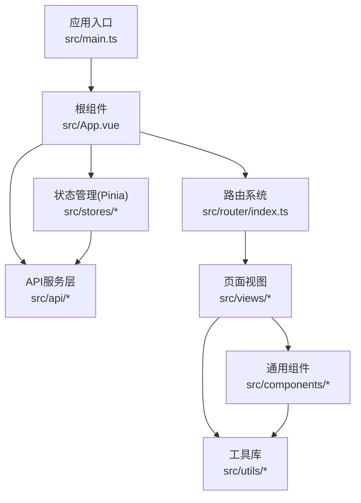
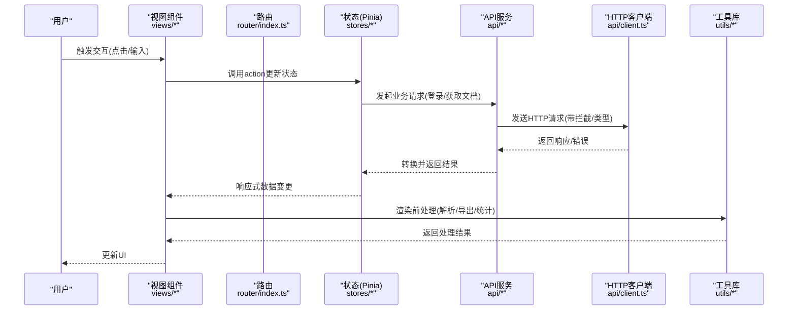
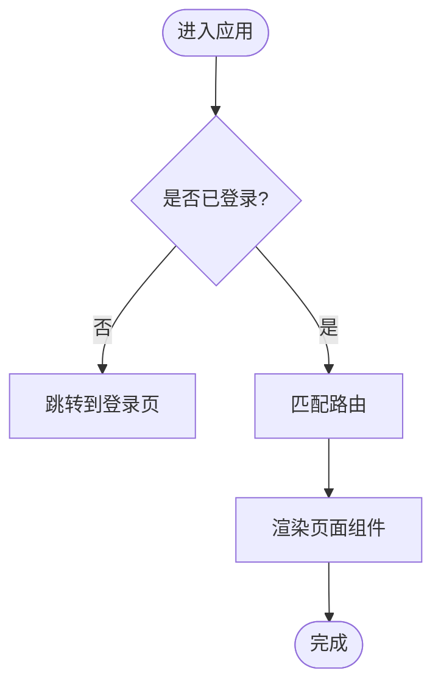
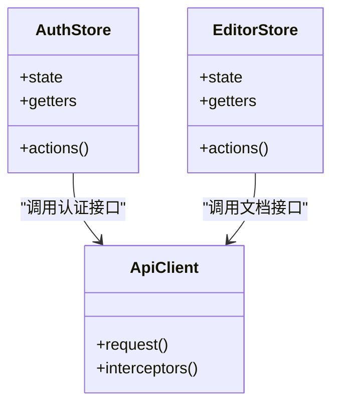
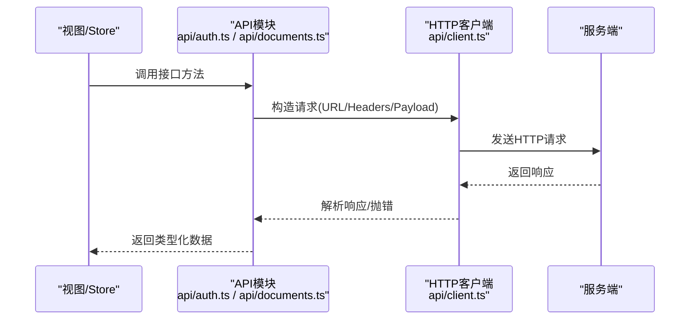
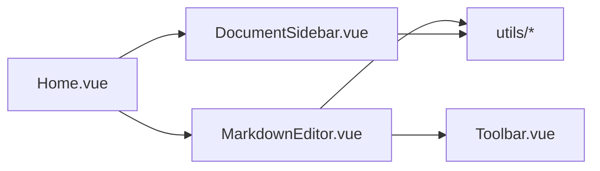
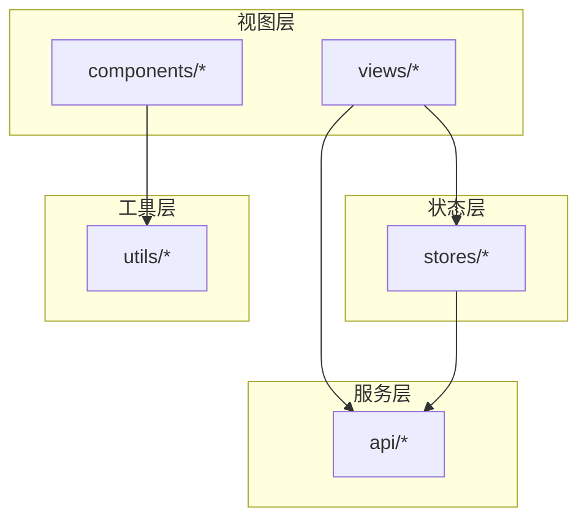

# 架构设计

<cite>
**本文引用的文件**
- [main.ts](file://src/main.ts)
- [App.vue](file://src/App.vue)
- [router/index.ts](file://src/router/index.ts)
- [stores/index.ts](file://src/stores/index.ts)
- [stores/auth.ts](file://src/stores/auth.ts)
- [stores/editor.ts](file://src/stores/editor.ts)
- [api/client.ts](file://src/api/client.ts)
- [api/auth.ts](file://src/api/auth.ts)
- [api/documents.ts](file://src/api/documents.ts)
- [types/index.ts](file://src/types/index.ts)
- [components/MarkdownEditor.vue](file://src/components/MarkdownEditor.vue)
- [components/DocumentSidebar.vue](file://src/components/DocumentSidebar.vue)
- [components/Toolbar.vue](file://src/components/Toolbar.vue)
- [views/Home.vue](file://src/views/Home.vue)
- [views/Login.vue](file://src/views/Login.vue)
- [views/Register.vue](file://src/views/Register.vue)
- [views/DocumentEdit.vue](file://src/views/DocumentEdit.vue)
- [utils/markdown.ts](file://src/utils/markdown.ts)
- [utils/export.ts](file://src/utils/export.ts)
- [utils/image.ts](file://src/utils/image.ts)
- [utils/toc.ts](file://src/utils/toc.ts)
- [utils/stats.ts](file://src/utils/stats.ts)
- [utils/editor.ts](file://src/utils/editor.ts)
- [vite.config.ts](file://vite.config.ts)
- [tsconfig.json](file://tsconfig.json)
</cite>

## 目录
1. [简介](#简介)
2. [项目结构](#项目结构)
3. [核心组件](#核心组件)
4. [架构总览](#架构总览)
5. [详细组件分析](#详细组件分析)
6. [依赖关系分析](#依赖关系分析)
7. [性能考虑](#性能考虑)
8. [故障排查指南](#故障排查指南)
9. [结论](#结论)
10. [附录](#附录)

## 简介
本文件面向开发者，系统化阐述该 Vue 3 + TypeScript 前端项目的整体架构与设计原则。重点覆盖：
- Vue 3 Composition API 的使用方式与最佳实践
- Pinia 状态管理模式的设计与数据流
- 组件化架构（视图层、通用组件、工具库）的边界与职责
- API 服务层封装策略与类型安全实现
- 路由管理机制与页面组织
- 模块间交互关系、数据流图与扩展定制指导

## 项目结构
项目采用按“领域/能力”划分的分层目录结构，清晰分离关注点：
- src/main.ts：应用入口，负责初始化 Vue、Pinia、Router、样式等全局配置
- src/App.vue：根组件，承载路由出口与全局布局
- src/router/index.ts：集中式路由定义与导航守卫
- src/stores/*：基于 Pinia 的状态管理，按业务域拆分
- src/api/*：HTTP 客户端与接口封装，统一请求拦截与错误处理
- src/components/*：可复用 UI 组件
- src/views/*：页面级视图组件
- src/types/*：全局类型定义
- src/utils/*：纯函数工具集（Markdown、导出、图片、统计、目录等）
- 构建与类型：vite.config.ts、tsconfig.json 等

图表来源
- [main.ts:1-200](file://src/main.ts#L1-L200)
- [App.vue:1-200](file://src/App.vue#L1-L200)
- [router/index.ts:1-200](file://src/router/index.ts#L1-L200)
- [stores/index.ts:1-200](file://src/stores/index.ts#L1-L200)
- [api/client.ts:1-200](file://src/api/client.ts#L1-L200)

章节来源
- [main.ts:1-200](file://src/main.ts#L1-L200)
- [App.vue:1-200](file://src/App.vue#L1-L200)
- [router/index.ts:1-200](file://src/router/index.ts#L1-L200)
- [stores/index.ts:1-200](file://src/stores/index.ts#L1-L200)
- [api/client.ts:1-200](file://src/api/client.ts#L1-L200)

## 核心组件
- 应用入口与初始化
  - 在入口文件中创建并挂载 Vue 应用实例，注册 Pinia、Vue Router、全局样式与插件
  - 通过环境变量注入基础配置（如 API 基础地址）
- 根组件
  - 提供全局布局容器与路由出口
  - 可选地挂载全局通知、主题、国际化等能力
- 路由
  - 集中式路由表，按页面划分懒加载
  - 导航守卫用于鉴权与权限控制
- 状态管理（Pinia）
  - 按业务域拆分为 auth、editor 等 store
  - 使用 Composition API 风格的 setupStore 或选项式 store 暴露 state/getters/actions
- API 服务层
  - 统一 HTTP 客户端封装，包含请求/响应拦截器、错误重试、取消请求、类型化响应
  - 按业务域拆分接口文件（auth、documents），对外暴露 Promise 风格方法
- 组件体系
  - 视图组件（views）：组合多个通用组件，编排页面逻辑
  - 通用组件（components）：无副作用、高内聚、可复用的 UI 单元
- 工具库
  - 纯函数集合，专注单一职责（Markdown 解析、导出、图片处理、目录生成、统计等）

章节来源
- [main.ts:1-200](file://src/main.ts#L1-L200)
- [App.vue:1-200](file://src/App.vue#L1-L200)
- [router/index.ts:1-200](file://src/router/index.ts#L1-L200)
- [stores/index.ts:1-200](file://src/stores/index.ts#L1-L200)
- [stores/auth.ts:1-200](file://src/stores/auth.ts#L1-L200)
- [stores/editor.ts:1-200](file://src/stores/editor.ts#L1-L200)
- [api/client.ts:1-200](file://src/api/client.ts#L1-L200)
- [api/auth.ts:1-200](file://src/api/auth.ts#L1-L200)
- [api/documents.ts:1-200](file://src/api/documents.ts#L1-L200)

## 架构总览
下图展示从用户操作到数据落地的端到端流程，涵盖路由、状态、API、组件与工具链的协作关系。

图表来源
- [router/index.ts:1-200](file://src/router/index.ts#L1-L200)
- [stores/auth.ts:1-200](file://src/stores/auth.ts#L1-L200)
- [stores/editor.ts:1-200](file://src/stores/editor.ts#L1-L200)
- [api/client.ts:1-200](file://src/api/client.ts#L1-L200)
- [api/auth.ts:1-200](file://src/api/auth.ts#L1-L200)
- [api/documents.ts:1-200](file://src/api/documents.ts#L1-L200)
- [utils/markdown.ts:1-200](file://src/utils/markdown.ts#L1-L200)
- [utils/export.ts:1-200](file://src/utils/export.ts#L1-L200)

## 详细组件分析

### 路由与导航机制
- 路由组织
  - 集中式路由表，按页面懒加载，减少首屏体积
  - 嵌套路由用于文档编辑页的侧边栏与编辑器布局
- 导航守卫
  - 未登录访问受保护路由时重定向至登录页
  - 登录成功后根据角色/权限跳转目标页面
- 参数传递
  - 动态路由参数用于文档ID、版本等上下文
  - 查询参数用于筛选、排序等

图表来源
- [router/index.ts:1-200](file://src/router/index.ts#L1-L200)

章节来源
- [router/index.ts:1-200](file://src/router/index.ts#L1-L200)

### 状态管理（Pinia）
- 设计原则
  - 按业务域拆分 store（认证、编辑器等），避免单例臃肿
  - 使用 Composition API 风格编写 store，提升可读性与复用性
- 数据流
  - 视图通过 action 触发异步请求，store 协调 API 与本地状态
  - getters 派生计算属性，避免重复计算
- 持久化
  - 关键状态（如 token、用户信息）可持久化到 localStorage/sessionStorage
  - 刷新后恢复状态，保证用户体验连续性

图表来源
- [stores/auth.ts:1-200](file://src/stores/auth.ts#L1-L200)
- [stores/editor.ts:1-200](file://src/stores/editor.ts#L1-L200)
- [api/client.ts:1-200](file://src/api/client.ts#L1-L200)

章节来源
- [stores/index.ts:1-200](file://src/stores/index.ts#L1-L200)
- [stores/auth.ts:1-200](file://src/stores/auth.ts#L1-L200)
- [stores/editor.ts:1-200](file://src/stores/editor.ts#L1-L200)

### API 服务层封装
- 统一客户端
  - 基于 fetch/axios 封装，提供统一的请求/响应拦截
  - 自动附加鉴权头、错误码处理、超时与重试策略
- 接口模块化
  - 按业务域拆分（auth、documents），对外暴露 Promise 风格方法
  - 强类型约束请求参数与响应体，结合 types/index.ts 提升类型安全
- 错误处理
  - 网络异常、业务错误码统一捕获并转换为友好提示
  - 支持取消请求与防抖/节流策略

图表来源
- [api/auth.ts:1-200](file://src/api/auth.ts#L1-L200)
- [api/documents.ts:1-200](file://src/api/documents.ts#L1-L200)
- [api/client.ts:1-200](file://src/api/client.ts#L1-L200)

章节来源
- [api/client.ts:1-200](file://src/api/client.ts#L1-L200)
- [api/auth.ts:1-200](file://src/api/auth.ts#L1-L200)
- [api/documents.ts:1-200](file://src/api/documents.ts#L1-L200)
- [types/index.ts:1-200](file://src/types/index.ts#L1-L200)

### 组件化架构
- 视图组件（views）
  - 编排页面级逻辑，组合通用组件与状态
  - 通过路由参数与 store 驱动渲染
- 通用组件（components）
  - MarkdownEditor：编辑器核心，集成 Markdown 预览、工具栏、快捷键
  - DocumentSidebar：文档树/目录导航，支持展开收起与搜索
  - Toolbar：常用操作按钮（导出、统计、插入图片等）
- 工具库（utils）
  - markdown.ts：Markdown 解析与转换
  - export.ts：导出为 PDF/HTML/Markdown
  - image.ts：图片上传、压缩、Base64 处理
  - toc.ts：生成目录与锚点
  - stats.ts：字数、段落、阅读时长统计
  - editor.ts：编辑器配置与事件桥接

图表来源
- [views/Home.vue:1-200](file://src/views/Home.vue#L1-L200)
- [components/DocumentSidebar.vue:1-200](file://src/components/DocumentSidebar.vue#L1-L200)
- [components/MarkdownEditor.vue:1-200](file://src/components/MarkdownEditor.vue#L1-L200)
- [components/Toolbar.vue:1-200](file://src/components/Toolbar.vue#L1-L200)
- [utils/markdown.ts:1-200](file://src/utils/markdown.ts#L1-L200)
- [utils/export.ts:1-200](file://src/utils/export.ts#L1-L200)
- [utils/image.ts:1-200](file://src/utils/image.ts#L1-L200)
- [utils/toc.ts:1-200](file://src/utils/toc.ts#L1-L200)
- [utils/stats.ts:1-200](file://src/utils/stats.ts#L1-L200)
- [utils/editor.ts:1-200](file://src/utils/editor.ts#L1-L200)

章节来源
- [components/MarkdownEditor.vue:1-200](file://src/components/MarkdownEditor.vue#L1-L200)
- [components/DocumentSidebar.vue:1-200](file://src/components/DocumentSidebar.vue#L1-L200)
- [components/Toolbar.vue:1-200](file://src/components/Toolbar.vue#L1-L200)
- [utils/markdown.ts:1-200](file://src/utils/markdown.ts#L1-L200)
- [utils/export.ts:1-200](file://src/utils/export.ts#L1-L200)
- [utils/image.ts:1-200](file://src/utils/image.ts#L1-L200)
- [utils/toc.ts:1-200](file://src/utils/toc.ts#L1-L200)
- [utils/stats.ts:1-200](file://src/utils/stats.ts#L1-L200)
- [utils/editor.ts:1-200](file://src/utils/editor.ts#L1-L200)

### 类型安全实现
- 全局类型
  - 在 types/index.ts 中统一定义 API 响应、表单、枚举等类型
  - 与 API 模块严格绑定，确保前后端契约一致
- 构建期校验
  - 通过 tsconfig.json 启用严格模式，配合 IDE 实时检查
  - 利用 vite.config.ts 优化类型检查与打包产物
- 运行时兜底
  - 对不可信数据做必要校验与默认值处理，避免运行时崩溃

章节来源
- [types/index.ts:1-200](file://src/types/index.ts#L1-L200)
- [tsconfig.json:1-200](file://tsconfig.json#L1-L200)
- [vite.config.ts:1-200](file://vite.config.ts#L1-L200)

## 依赖关系分析
- 模块耦合
  - 视图依赖 store 与 API 模块；store 依赖 API 模块；组件依赖 utils
  - 通过明确的接口与类型定义降低耦合度
- 外部依赖
  - Vue 3、Pinia、Vue Router、TypeScript、构建工具（Vite）
  - 第三方库按需引入（如 Markdown 渲染、导出、图片处理）
- 循环依赖规避
  - 将共享类型抽离至 types，避免模块间互相引用
  - 工具函数保持无副作用，便于跨模块复用

图表来源
- [views/Home.vue:1-200](file://src/views/Home.vue#L1-L200)
- [views/Login.vue:1-200](file://src/views/Login.vue#L1-L200)
- [views/Register.vue:1-200](file://src/views/Register.vue#L1-L200)
- [views/DocumentEdit.vue:1-200](file://src/views/DocumentEdit.vue#L1-L200)
- [stores/auth.ts:1-200](file://src/stores/auth.ts#L1-L200)
- [stores/editor.ts:1-200](file://src/stores/editor.ts#L1-L200)
- [api/auth.ts:1-200](file://src/api/auth.ts#L1-L200)
- [api/documents.ts:1-200](file://src/api/documents.ts#L1-L200)
- [utils/markdown.ts:1-200](file://src/utils/markdown.ts#L1-L200)

章节来源
- [views/Home.vue:1-200](file://src/views/Home.vue#L1-L200)
- [views/Login.vue:1-200](file://src/views/Login.vue#L1-L200)
- [views/Register.vue:1-200](file://src/views/Register.vue#L1-L200)
- [views/DocumentEdit.vue:1-200](file://src/views/DocumentEdit.vue#L1-L200)
- [stores/auth.ts:1-200](file://src/stores/auth.ts#L1-L200)
- [stores/editor.ts:1-200](file://src/stores/editor.ts#L1-L200)
- [api/auth.ts:1-200](file://src/api/auth.ts#L1-L200)
- [api/documents.ts:1-200](file://src/api/documents.ts#L1-L200)
- [utils/markdown.ts:1-200](file://src/utils/markdown.ts#L1-L200)

## 性能考虑
- 首屏优化
  - 路由懒加载、组件按需引入、静态资源压缩
  - 合理使用 keep-alive 缓存高频页面
- 渲染优化
  - 大列表虚拟滚动、分片渲染
  - 避免不必要的响应式更新，合理拆分组件粒度
- 网络优化
  - 请求合并、去重、缓存策略（ETag/Cache-Control）
  - 失败重试与退避策略，提升鲁棒性
- 内存与包体
  - 移除未使用代码、Tree Shaking
  - 图片懒加载与压缩，字体按需加载

[本节为通用性能建议，不直接分析具体文件]

## 故障排查指南
- 常见问题定位
  - 网络请求失败：检查 API 基础地址、鉴权头、跨域配置与错误拦截
  - 状态不同步：确认 store 的 action 是否正确派发、getter 是否依赖正确
  - 路由跳转异常：检查导航守卫条件、动态参数解析
- 调试技巧
  - 使用浏览器 DevTools 的 Network、Console、Sources 面板
  - 在关键路径添加日志输出，区分开发/生产环境
- 错误分类与处理
  - 网络错误：超时、断网、DNS 解析失败
  - 业务错误：状态码非 2xx、字段缺失、权限不足
  - 渲染错误：类型不匹配、空指针、模板语法错误

章节来源
- [api/client.ts:1-200](file://src/api/client.ts#L1-L200)
- [router/index.ts:1-200](file://src/router/index.ts#L1-L200)
- [stores/auth.ts:1-200](file://src/stores/auth.ts#L1-L200)
- [stores/editor.ts:1-200](file://src/stores/editor.ts#L1-L200)

## 结论
本项目以清晰的层次化结构与明确的职责边界为基础，结合 Vue 3 Composition API 与 Pinia 实现了高内聚、低耦合的前端架构。API 服务层统一封装提升了可维护性与类型安全，组件化与工具库增强了复用性。遵循本文档的扩展与定制原则，可在不破坏既有结构的前提下快速迭代功能。

[本节为总结性内容，不直接分析具体文件]

## 附录
- 扩展与定制指导
  - 新增页面：在 views 下创建组件，并在 router 中注册路由与懒加载
  - 新增状态：在 stores 下按业务域新增 store，定义 state/getters/actions
  - 新增接口：在 api 下按业务域新增接口文件，统一使用 client 封装
  - 新增组件：在 components 下创建可复用组件，并通过 props/emits 明确契约
  - 新增工具：在 utils 下添加纯函数，保持无副作用与高内聚
- 构建与类型
  - 使用 tsconfig.json 开启严格模式，配合 IDE 进行类型检查
  - 通过 vite.config.ts 配置别名、代理、插件与优化策略

章节来源
- [router/index.ts:1-200](file://src/router/index.ts#L1-L200)
- [stores/index.ts:1-200](file://src/stores/index.ts#L1-L200)
- [api/client.ts:1-200](file://src/api/client.ts#L1-L200)
- [types/index.ts:1-200](file://src/types/index.ts#L1-L200)
- [vite.config.ts:1-200](file://vite.config.ts#L1-L200)
- [tsconfig.json:1-200](file://tsconfig.json#L1-L200)