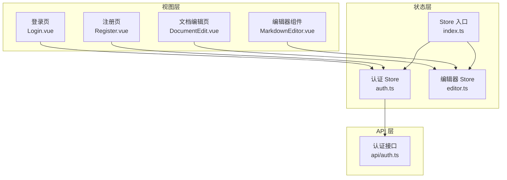
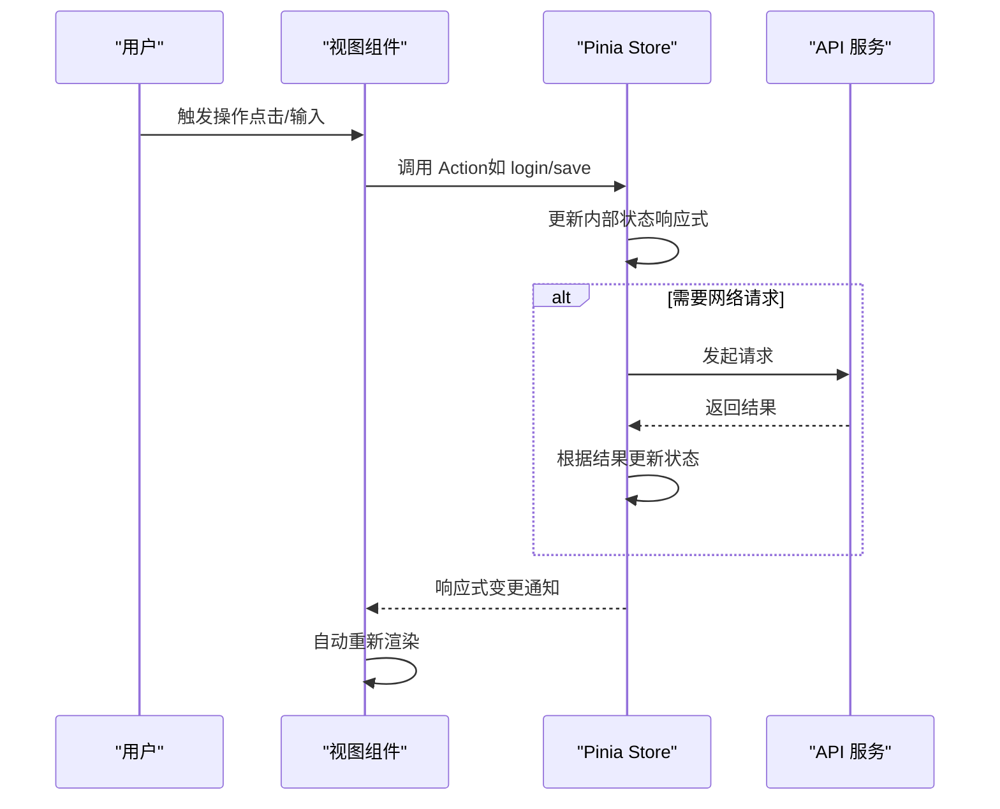
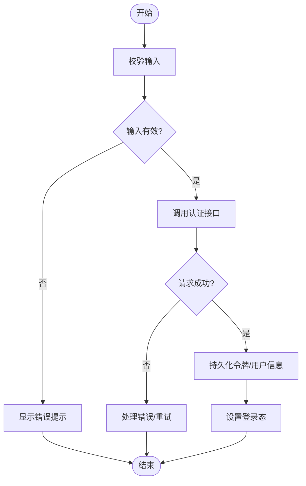
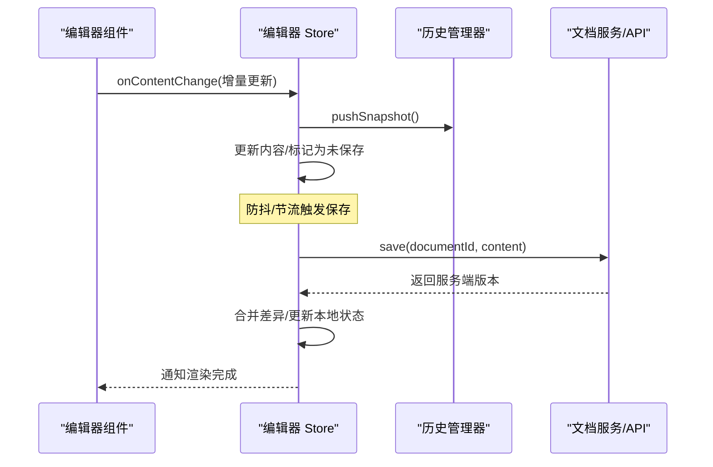
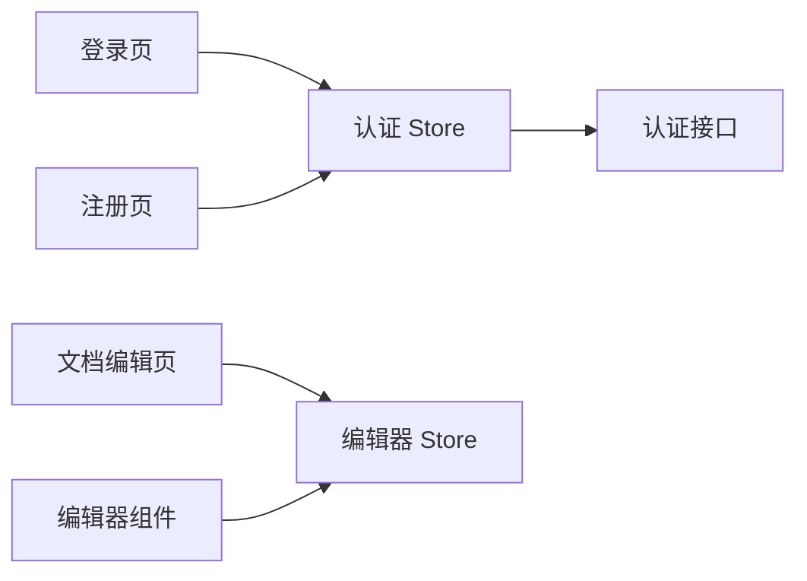

# 状态管理

<cite>
**本文引用的文件**
- [src/stores/index.ts](file://src/stores/index.ts)
- [src/stores/auth.ts](file://src/stores/auth.ts)
- [src/stores/editor.ts](file://src/stores/editor.ts)
- [src/api/auth.ts](file://src/api/auth.ts)
- [src/views/Login.vue](file://src/views/Login.vue)
- [src/views/Register.vue](file://src/views/Register.vue)
- [src/components/MarkdownEditor.vue](file://src/components/MarkdownEditor.vue)
- [src/views/DocumentEdit.vue](file://src/views/DocumentEdit.vue)
</cite>

## 目录
1. [简介](#简介)
2. [项目结构](#项目结构)
3. [核心组件](#核心组件)
4. [架构总览](#架构总览)
5. [详细组件分析](#详细组件分析)
6. [依赖分析](#依赖分析)
7. [性能考虑](#性能考虑)
8. [故障排查指南](#故障排查指南)
9. [结论](#结论)
10. [附录](#附录)

## 简介
本文件面向前端应用的状态管理，聚焦于基于 Pinia 的 Store 设计与实现。文档围绕以下目标展开：
- 解释 Store 的组织结构与职责划分（认证状态、编辑器状态）
- 说明状态定义、Actions 与 Getters 的使用方式
- 描述响应式数据的更新机制与数据同步策略
- 提供状态流转图与最佳实践、性能优化建议

## 项目结构
本项目采用按功能域划分的 Store 组织方式：
- 认证相关状态集中在认证 Store
- 编辑器相关状态集中在编辑器 Store
- 统一的 Store 入口用于注册与导出

图表来源
- [src/stores/index.ts](file://src/stores/index.ts)
- [src/stores/auth.ts](file://src/stores/auth.ts)
- [src/stores/editor.ts](file://src/stores/editor.ts)
- [src/api/auth.ts](file://src/api/auth.ts)
- [src/views/Login.vue](file://src/views/Login.vue)
- [src/views/Register.vue](file://src/views/Register.vue)
- [src/views/DocumentEdit.vue](file://src/views/DocumentEdit.vue)
- [src/components/MarkdownEditor.vue](file://src/components/MarkdownEditor.vue)

章节来源
- [src/stores/index.ts](file://src/stores/index.ts)
- [src/stores/auth.ts](file://src/stores/auth.ts)
- [src/stores/editor.ts](file://src/stores/editor.ts)

## 核心组件
- 认证 Store：负责用户身份、登录态、权限等状态；提供登录、登出、刷新等动作；暴露派生状态（如是否已登录）。
- 编辑器 Store：负责文档内容、光标位置、选中范围、历史记录等；提供写入、撤销/重做、增量同步等动作；暴露派生状态（如是否有未保存更改）。
- Store 入口：集中注册并导出各 Store，便于在应用内统一使用。

章节来源
- [src/stores/auth.ts](file://src/stores/auth.ts)
- [src/stores/editor.ts](file://src/stores/editor.ts)
- [src/stores/index.ts](file://src/stores/index.ts)

## 架构总览
Pinia 以“单一数据源 + 响应式”的方式驱动 UI 更新。视图通过调用 Store 的 Actions 修改状态，Getters 计算派生值，组件自动订阅变化并重新渲染。

图表来源
- [src/stores/auth.ts](file://src/stores/auth.ts)
- [src/stores/editor.ts](file://src/stores/editor.ts)
- [src/api/auth.ts](file://src/api/auth.ts)
- [src/views/Login.vue](file://src/views/Login.vue)
- [src/views/DocumentEdit.vue](file://src/views/DocumentEdit.vue)

## 详细组件分析

### 认证 Store（auth.ts）
- 状态设计
  - 用户信息、令牌、过期时间、错误信息等
  - 派生状态：是否已登录、是否需要刷新令牌
- Actions
  - 登录：校验输入、调用认证接口、持久化令牌、设置登录态
  - 登出：清理本地存储、重置状态
  - 刷新：处理令牌续期或跳转登录
- Getters
  - 基于当前用户/令牌派生界面可见性、权限控制等
- 与视图交互
  - 登录/注册页面调用登录/注册流程
  - 路由守卫可读取登录态进行鉴权

图表来源
- [src/stores/auth.ts](file://src/stores/auth.ts)
- [src/api/auth.ts](file://src/api/auth.ts)
- [src/views/Login.vue](file://src/views/Login.vue)
- [src/views/Register.vue](file://src/views/Register.vue)

章节来源
- [src/stores/auth.ts](file://src/stores/auth.ts)
- [src/api/auth.ts](file://src/api/auth.ts)
- [src/views/Login.vue](file://src/views/Login.vue)
- [src/views/Register.vue](file://src/views/Register.vue)

### 编辑器 Store（editor.ts）
- 状态设计
  - 文档内容、元数据、光标/选区、历史栈、草稿标记等
- Actions
  - 写入内容：增量更新、合并冲突、生成历史快照
  - 撤销/重做：维护历史栈指针
  - 同步：将本地内容与远端版本对齐（必要时回滚）
- Getters
  - 是否有未保存更改、内容长度、统计信息
- 与视图交互
  - 编辑器组件监听内容变化，触发保存或草稿标记
  - 编辑页在切换文档时加载/初始化状态

图表来源
- [src/stores/editor.ts](file://src/stores/editor.ts)
- [src/components/MarkdownEditor.vue](file://src/components/MarkdownEditor.vue)
- [src/views/DocumentEdit.vue](file://src/views/DocumentEdit.vue)

章节来源
- [src/stores/editor.ts](file://src/stores/editor.ts)
- [src/components/MarkdownEditor.vue](file://src/components/MarkdownEditor.vue)
- [src/views/DocumentEdit.vue](file://src/views/DocumentEdit.vue)

### Store 入口（index.ts）
- 作用：集中注册所有 Store，统一导出供应用使用
- 优势：便于 Tree-shaking、类型推断与测试隔离

章节来源
- [src/stores/index.ts](file://src/stores/index.ts)

## 依赖分析
- 视图到 Store：通过组合式函数或直接导入 Store 实例调用 Actions/Getters
- Store 到 API：认证流程依赖认证接口；编辑器可能依赖文档接口
- Store 之间：保持低耦合，避免直接相互引用；如需共享状态，可通过事件或公共模块协调

图表来源
- [src/views/Login.vue](file://src/views/Login.vue)
- [src/views/Register.vue](file://src/views/Register.vue)
- [src/views/DocumentEdit.vue](file://src/views/DocumentEdit.vue)
- [src/components/MarkdownEditor.vue](file://src/components/MarkdownEditor.vue)
- [src/stores/auth.ts](file://src/stores/auth.ts)
- [src/stores/editor.ts](file://src/stores/editor.ts)
- [src/api/auth.ts](file://src/api/auth.ts)

章节来源
- [src/stores/auth.ts](file://src/stores/auth.ts)
- [src/stores/editor.ts](file://src/stores/editor.ts)
- [src/api/auth.ts](file://src/api/auth.ts)

## 性能考虑
- 最小化状态粒度：将频繁变化的字段（如编辑器内容）独立为细粒度状态，减少无关组件重渲染
- 合理使用 Getters：对昂贵计算使用缓存型 Getters，避免重复计算
- 批量更新：在单次 Action 中合并多次状态变更，降低响应式开销
- 防抖/节流：对高频输入（如打字）进行节流后再触发持久化或网络请求
- 懒加载与按需引入：仅在需要时加载大对象或重型逻辑
- 序列化与持久化：仅持久化必要字段，避免过大存储；对敏感信息加密或短期存储

[本节为通用指导，不直接分析具体文件]

## 故障排查指南
- 登录失败
  - 检查网络与接口返回码
  - 确认本地令牌是否过期或被清除
  - 查看认证 Store 的错误分支与重试逻辑
- 编辑器内容不同步
  - 检查历史栈指针是否正确
  - 验证合并策略与冲突解决
  - 确认保存时机（防抖/手动保存）
- 状态丢失
  - 检查持久化策略（localStorage/sessionStorage）
  - 确认页面刷新后的初始化流程

章节来源
- [src/stores/auth.ts](file://src/stores/auth.ts)
- [src/stores/editor.ts](file://src/stores/editor.ts)

## 结论
本项目采用 Pinia 构建清晰、可扩展的状态管理架构：
- 认证与编辑器状态分域管理，职责明确
- 通过 Actions 与 Getters 规范状态变更与派生计算
- 结合响应式更新与持久化策略，保障用户体验与数据一致性
- 遵循最佳实践可获得更好的可维护性与性能表现

[本节为总结性内容，不直接分析具体文件]

## 附录
- 术语
  - Store：状态容器，包含 state、getters、actions
  - Getter：派生状态，具备缓存能力
  - Action：异步/同步的状态变更方法
- 推荐实践
  - 命名规范：动词+名词（如 login、saveDraft）
  - 错误边界：统一错误处理与用户提示
  - 单元测试：针对关键 Action/Getter 编写用例
  - 可观测性：埋点记录关键状态变更与耗时

[本节为补充说明，不直接分析具体文件]