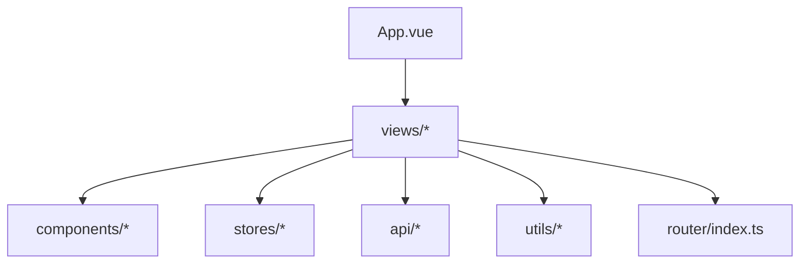
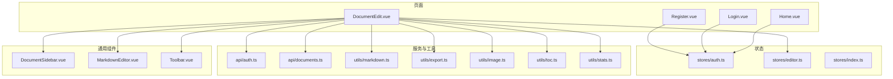
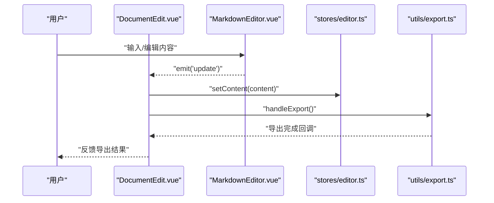
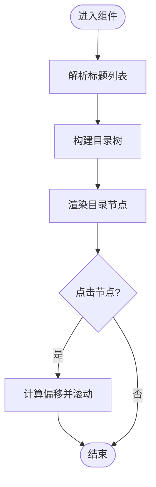
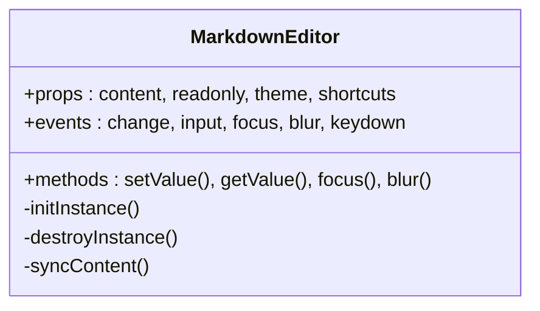
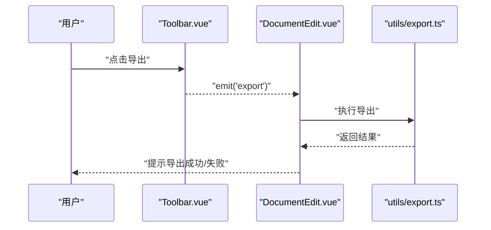
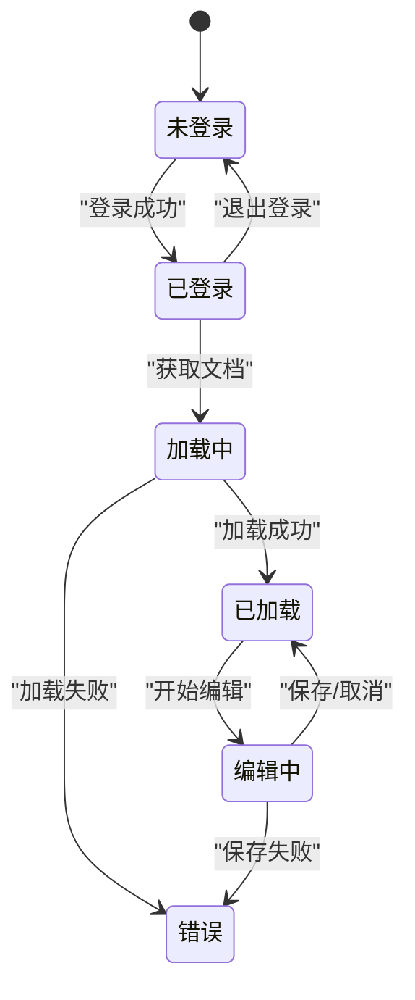
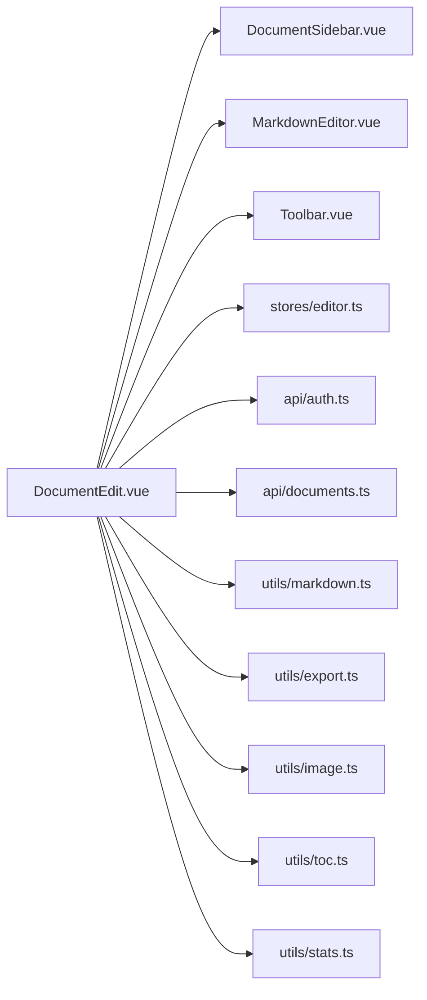

# 组件架构

<cite>
**本文引用的文件**
- [App.vue](file://src/App.vue)
- [main.ts](file://src/main.ts)
- [DocumentEdit.vue](file://src/views/DocumentEdit.vue)
- [Home.vue](file://src/views/Home.vue)
- [Login.vue](file://src/views/Login.vue)
- [Register.vue](file://src/views/Register.vue)
- [DocumentSidebar.vue](file://src/components/DocumentSidebar.vue)
- [MarkdownEditor.vue](file://src/components/MarkdownEditor.vue)
- [Toolbar.vue](file://src/components/Toolbar.vue)
- [router/index.ts](file://src/router/index.ts)
- [stores/auth.ts](file://src/stores/auth.ts)
- [stores/editor.ts](file://src/stores/editor.ts)
- [stores/index.ts](file://src/stores/index.ts)
- [api/auth.ts](file://src/api/auth.ts)
- [api/documents.ts](file://src/api/documents.ts)
- [utils/markdown.ts](file://src/utils/markdown.ts)
- [utils/export.ts](file://src/utils/export.ts)
- [utils/image.ts](file://src/utils/image.ts)
- [utils/toc.ts](file://src/utils/toc.ts)
- [utils/stats.ts](file://src/utils/stats.ts)
</cite>

## 目录
1. [简介](#简介)
2. [项目结构](#项目结构)
3. [核心组件](#核心组件)
4. [架构总览](#架构总览)
5. [详细组件分析](#详细组件分析)
6. [依赖关系分析](#依赖关系分析)
7. [性能考虑](#性能考虑)
8. [故障排查指南](#故障排查指南)
9. [结论](#结论)
10. [附录](#附录)

## 简介
本文件面向Vue单文件组件（SFC）的架构与最佳实践，结合当前前端仓库的实际代码组织，系统阐述页面组件与通用组件的分离策略、组件通信机制（Props与Events）、状态管理边界、可复用性与扩展设计，并给出组件关系图与状态流转图、开发规范与性能优化建议。目标是帮助读者在不深入源码细节的前提下，快速理解整体架构并在后续迭代中保持一致性。

## 项目结构
本项目采用按“功能域”划分的目录组织方式：
- views：页面级组件，负责路由视图组装与业务编排
- components：通用UI/业务组件，强调高内聚、低耦合、可复用
- stores：基于Pinia的状态管理，集中管理跨组件共享状态
- api：HTTP请求封装与接口定义
- utils：纯函数工具集，无副作用的数据处理与计算
- router：路由配置与导航守卫
- App.vue：应用根组件，挂载全局样式与布局容器

**图表来源**
- [App.vue:1-200](file://src/App.vue#L1-L200)
- [router/index.ts:1-200](file://src/router/index.ts#L1-L200)

**章节来源**
- [App.vue:1-200](file://src/App.vue#L1-L200)
- [main.ts:1-200](file://src/main.ts#L1-L200)
- [router/index.ts:1-200](file://src/router/index.ts#L1-L200)

## 核心组件
- DocumentEdit：文档编辑页，聚合侧边栏、编辑器与工具栏，协调用户输入、内容渲染与导出等流程
- DocumentSidebar：文档目录/大纲展示与跳转，支持点击定位与滚动同步
- MarkdownEditor：Markdown编辑器容器，负责与底层编辑器实例交互、事件转发与数据同步
- Toolbar：工具栏按钮集合，触发导出、统计、插入图片等操作

这些组件遵循“页面组件编排 + 通用组件实现”的分层原则，通过Props传递配置，通过Events上报行为，复杂状态下沉到stores，保证职责清晰与可测试性。

**章节来源**
- [DocumentEdit.vue:1-200](file://src/views/DocumentEdit.vue#L1-L200)
- [DocumentSidebar.vue:1-200](file://src/components/DocumentSidebar.vue#L1-L200)
- [MarkdownEditor.vue:1-200](file://src/components/MarkdownEditor.vue#L1-L200)
- [Toolbar.vue:1-200](file://src/components/Toolbar.vue#L1-L200)

## 架构总览
下图展示了从页面到组件、再到状态与工具的调用关系，体现单向数据流与事件驱动模式。

**图表来源**
- [DocumentEdit.vue:1-200](file://src/views/DocumentEdit.vue#L1-L200)
- [DocumentSidebar.vue:1-200](file://src/components/DocumentSidebar.vue#L1-L200)
- [MarkdownEditor.vue:1-200](file://src/components/MarkdownEditor.vue#L1-L200)
- [Toolbar.vue:1-200](file://src/components/Toolbar.vue#L1-L200)
- [stores/editor.ts:1-200](file://src/stores/editor.ts#L1-L200)
- [stores/auth.ts:1-200](file://src/stores/auth.ts#L1-L200)
- [api/auth.ts:1-200](file://src/api/auth.ts#L1-L200)
- [api/documents.ts:1-200](file://src/api/documents.ts#L1-L200)
- [utils/markdown.ts:1-200](file://src/utils/markdown.ts#L1-L200)
- [utils/export.ts:1-200](file://src/utils/export.ts#L1-L200)
- [utils/image.ts:1-200](file://src/utils/image.ts#L1-L200)
- [utils/toc.ts:1-200](file://src/utils/toc.ts#L1-L200)
- [utils/stats.ts:1-200](file://src/utils/stats.ts#L1-L200)

## 详细组件分析

### DocumentEdit 页面组件
- 职责：编排DocumentSidebar、MarkdownEditor、Toolbar；订阅编辑器状态变更；触发导出、统计、目录更新等操作
- 通信：
  - Props：向子组件传入主题、只读模式、初始内容等配置
  - Events：监听子组件的保存、导出、插入图片、统计刷新等事件
- 状态：将编辑器内容、光标位置、TOC、统计信息等放入editor store，避免在页面组件中维护大量本地状态
- 副作用：在mounted/updated生命周期中初始化或同步第三方编辑器实例；在beforeUnmount中销毁实例，防止内存泄漏

**图表来源**
- [DocumentEdit.vue:1-200](file://src/views/DocumentEdit.vue#L1-L200)
- [MarkdownEditor.vue:1-200](file://src/components/MarkdownEditor.vue#L1-L200)
- [stores/editor.ts:1-200](file://src/stores/editor.ts#L1-L200)
- [utils/export.ts:1-200](file://src/utils/export.ts#L1-L200)

**章节来源**
- [DocumentEdit.vue:1-200](file://src/views/DocumentEdit.vue#L1-L200)
- [stores/editor.ts:1-200](file://src/stores/editor.ts#L1-L200)
- [utils/export.ts:1-200](file://src/utils/export.ts#L1-L200)

### DocumentSidebar 组件
- 职责：根据Markdown内容生成目录树，提供锚点跳转与滚动同步
- 通信：
  - Props：接收标题列表、当前选中项、是否可点击等
  - Events：向上抛出选中项变化、点击跳转等事件
- 算法：解析标题层级构建TOC，计算滚动偏移量实现平滑定位

**图表来源**
- [DocumentSidebar.vue:1-200](file://src/components/DocumentSidebar.vue#L1-L200)
- [utils/toc.ts:1-200](file://src/utils/toc.ts#L1-L200)

**章节来源**
- [DocumentSidebar.vue:1-200](file://src/components/DocumentSidebar.vue#L1-L200)
- [utils/toc.ts:1-200](file://src/utils/toc.ts#L1-L200)

### MarkdownEditor 组件
- 职责：封装第三方编辑器实例，统一对外暴露setValue/getValue、focus、blur等方法；将内部事件标准化为自定义事件
- 通信：
  - Props：内容、只读、主题、快捷键开关等
  - Events：emit('change'/'input'/'focus'/'blur'/'keydown')
- 生命周期：在mounted时初始化实例，在updated中按需同步内容，在beforeUnmount中销毁实例

**图表来源**
- [MarkdownEditor.vue:1-200](file://src/components/MarkdownEditor.vue#L1-L200)

**章节来源**
- [MarkdownEditor.vue:1-200](file://src/components/MarkdownEditor.vue#L1-L200)

### Toolbar 组件
- 职责：提供导出、统计、插入图片、切换主题等快捷操作
- 通信：
  - Props：可用操作列表、当前主题、禁用态控制
  - Events：emit('export'/'stats'/'insertImage'/'toggleTheme')
- 可复用性：通过插槽或配置对象扩展新按钮，保持UI与逻辑解耦

**图表来源**
- [Toolbar.vue:1-200](file://src/components/Toolbar.vue#L1-L200)
- [DocumentEdit.vue:1-200](file://src/views/DocumentEdit.vue#L1-L200)
- [utils/export.ts:1-200](file://src/utils/export.ts#L1-L200)

**章节来源**
- [Toolbar.vue:1-200](file://src/components/Toolbar.vue#L1-L200)
- [DocumentEdit.vue:1-200](file://src/views/DocumentEdit.vue#L1-L200)
- [utils/export.ts:1-200](file://src/utils/export.ts#L1-L200)

### 页面组件与通用组件的分离策略
- 页面组件（views）：聚焦路由视图装配、业务流程编排、组合多个通用组件、订阅/分发store状态
- 通用组件（components）：聚焦单一职责、可独立测试、通过Props/Events与外部交互，不直接访问路由或全局状态
- 状态边界：跨组件共享状态放入stores；局部UI状态保留在组件内；避免在通用组件中持有页面级状态

**章节来源**
- [DocumentEdit.vue:1-200](file://src/views/DocumentEdit.vue#L1-L200)
- [DocumentSidebar.vue:1-200](file://src/components/DocumentSidebar.vue#L1-L200)
- [MarkdownEditor.vue:1-200](file://src/components/MarkdownEditor.vue#L1-L200)
- [Toolbar.vue:1-200](file://src/components/Toolbar.vue#L1-L200)

### 组件间的通信机制（Props与Events）
- Props：用于自上而下的配置与数据绑定，建议在组件顶部明确声明类型与默认值，确保契约稳定
- Events：用于自下而上的行为上报，命名使用动词短语（如save、update、select），避免在子组件中直接修改父组件状态
- 组合式API：推荐使用defineProps与defineEmits进行类型安全的通信定义

**章节来源**
- [DocumentEdit.vue:1-200](file://src/views/DocumentEdit.vue#L1-L200)
- [DocumentSidebar.vue:1-200](file://src/components/DocumentSidebar.vue#L1-L200)
- [MarkdownEditor.vue:1-200](file://src/components/MarkdownEditor.vue#L1-L200)
- [Toolbar.vue:1-200](file://src/components/Toolbar.vue#L1-L200)

### 页面组件与状态管理（stores）
- editor store：集中管理编辑器内容、光标、选区、统计信息、TOC等
- auth store：管理登录态、用户信息、权限相关状态
- 页面组件仅做状态订阅与派发，不直接读写DOM或第三方库实例

**图表来源**
- [stores/auth.ts:1-200](file://src/stores/auth.ts#L1-L200)
- [stores/editor.ts:1-200](file://src/stores/editor.ts#L1-L200)

**章节来源**
- [stores/auth.ts:1-200](file://src/stores/auth.ts#L1-L200)
- [stores/editor.ts:1-200](file://src/stores/editor.ts#L1-L200)

### 可复用性与扩展机制
- 插槽与具名插槽：在Toolbar、DocumentSidebar中预留插槽，允许上层注入自定义按钮或菜单项
- 配置对象：通过统一的配置对象（如按钮列表、主题、快捷键）驱动组件行为，便于在不同页面复用
- 插件化：将导出、统计、图片上传等能力抽象为工具函数或插件，由页面按需引入，降低组件体积与耦合

**章节来源**
- [Toolbar.vue:1-200](file://src/components/Toolbar.vue#L1-L200)
- [DocumentSidebar.vue:1-200](file://src/components/DocumentSidebar.vue#L1-L200)
- [utils/export.ts:1-200](file://src/utils/export.ts#L1-L200)
- [utils/stats.ts:1-200](file://src/utils/stats.ts#L1-L200)
- [utils/image.ts:1-200](file://src/utils/image.ts#L1-L200)

## 依赖关系分析
- 页面组件依赖通用组件与stores，间接依赖api与utils
- 通用组件尽量不直接依赖api，必要时通过回调或命令式方法由页面层调用
- 工具函数保持纯函数特性，便于单元测试与复用

**图表来源**
- [DocumentEdit.vue:1-200](file://src/views/DocumentEdit.vue#L1-L200)
- [DocumentSidebar.vue:1-200](file://src/components/DocumentSidebar.vue#L1-L200)
- [MarkdownEditor.vue:1-200](file://src/components/MarkdownEditor.vue#L1-L200)
- [Toolbar.vue:1-200](file://src/components/Toolbar.vue#L1-L200)
- [stores/editor.ts:1-200](file://src/stores/editor.ts#L1-L200)
- [api/auth.ts:1-200](file://src/api/auth.ts#L1-L200)
- [api/documents.ts:1-200](file://src/api/documents.ts#L1-L200)
- [utils/markdown.ts:1-200](file://src/utils/markdown.ts#L1-L200)
- [utils/export.ts:1-200](file://src/utils/export.ts#L1-L200)
- [utils/image.ts:1-200](file://src/utils/image.ts#L1-L200)
- [utils/toc.ts:1-200](file://src/utils/toc.ts#L1-L200)
- [utils/stats.ts:1-200](file://src/utils/stats.ts#L1-L200)

**章节来源**
- [DocumentEdit.vue:1-200](file://src/views/DocumentEdit.vue#L1-L200)
- [stores/editor.ts:1-200](file://src/stores/editor.ts#L1-L200)
- [api/auth.ts:1-200](file://src/api/auth.ts#L1-L200)
- [api/documents.ts:1-200](file://src/api/documents.ts#L1-L200)
- [utils/markdown.ts:1-200](file://src/utils/markdown.ts#L1-L200)
- [utils/export.ts:1-200](file://src/utils/export.ts#L1-L200)
- [utils/image.ts:1-200](file://src/utils/image.ts#L1-L200)
- [utils/toc.ts:1-200](file://src/utils/toc.ts#L1-L200)
- [utils/stats.ts:1-200](file://src/utils/stats.ts#L1-L200)

## 性能考虑
- 虚拟滚动与懒加载：长文档目录与预览区域建议使用虚拟滚动，减少首屏渲染压力
- 防抖与节流：对编辑器输入、滚动监听、导出操作进行节流/防抖，避免频繁重排与网络请求
- 增量更新：利用computed与watch的细粒度依赖，避免全量重渲染；仅在必要时触发重新计算
- 资源优化：图片懒加载与压缩，静态资源按需加载；编辑器实例延迟初始化
- 内存管理：在组件卸载时正确销毁第三方编辑器实例与事件监听器，防止内存泄漏
- 缓存策略：对统计数据、目录树等可缓存结果进行短期缓存，提升交互响应速度

[本节为通用性能建议，不直接分析具体文件]

## 故障排查指南
- 编辑器无法同步内容：检查MarkdownEditor是否在正确的生命周期初始化与销毁；确认content prop是否为响应式引用
- 目录跳转无效：验证TOC生成逻辑是否正确解析标题层级；检查滚动目标元素是否存在
- 导出失败：检查导出工具函数的输入校验与浏览器下载兼容性；查看控制台错误堆栈
- 登录态异常：核对auth store的状态流转与网络请求错误处理；确认路由守卫是否正确拦截未登录访问
- 性能卡顿：开启性能面板定位重排/重绘热点；检查是否存在大数组遍历或重复计算

**章节来源**
- [MarkdownEditor.vue:1-200](file://src/components/MarkdownEditor.vue#L1-L200)
- [DocumentSidebar.vue:1-200](file://src/components/DocumentSidebar.vue#L1-L200)
- [utils/export.ts:1-200](file://src/utils/export.ts#L1-L200)
- [stores/auth.ts:1-200](file://src/stores/auth.ts#L1-L200)

## 结论
本项目以“页面编排 + 通用组件 + 状态管理 + 工具函数”的分层架构实现了清晰的职责边界与良好的可维护性。通过Props与Events的严格契约、stores的集中状态管理以及工具函数的纯函数设计，组件具备较高的可复用性与可扩展性。后续可在虚拟滚动、懒加载、缓存策略等方面继续优化性能，并通过更完善的类型定义与单元测试提升稳定性。

[本节为总结性内容，不直接分析具体文件]

## 附录
- 组件开发规范
  - 单一职责：每个组件只做一件事，复杂逻辑拆分为子组件或工具函数
  - 明确契约：Props与Events需有类型定义与默认值，避免隐式依赖
  - 副作用隔离：网络请求与第三方实例初始化放在页面或组合式函数中，组件仅负责UI与事件转发
  - 可测试性：工具函数与纯逻辑优先抽离为utils，便于单元测试
- 最佳实践清单
  - 使用defineProps与defineEmits进行类型安全通信
  - 使用computed与watch的细粒度依赖，避免不必要的重渲染
  - 合理使用插槽与配置对象，增强组件扩展性
  - 在beforeUnmount中清理定时器、事件监听与第三方实例

[本节为通用规范与实践，不直接分析具体文件]