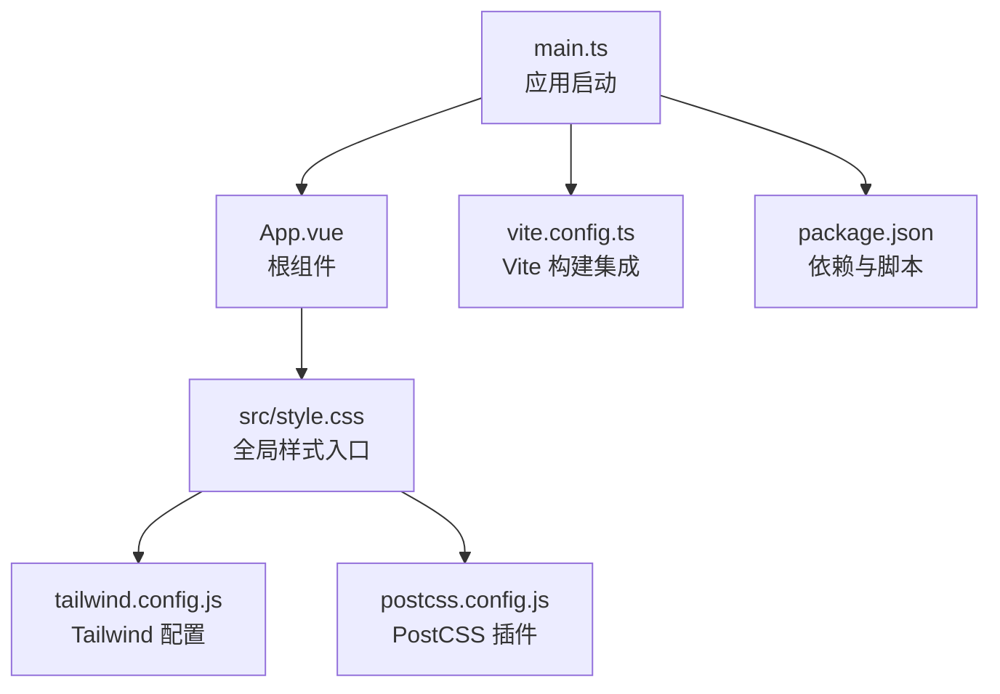
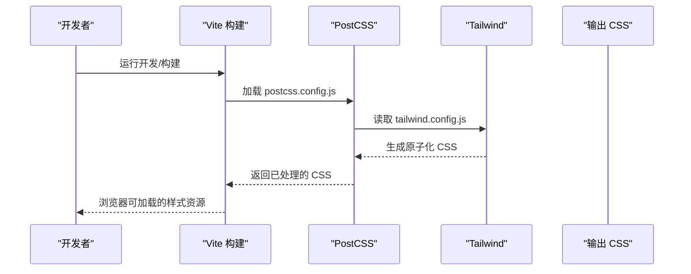
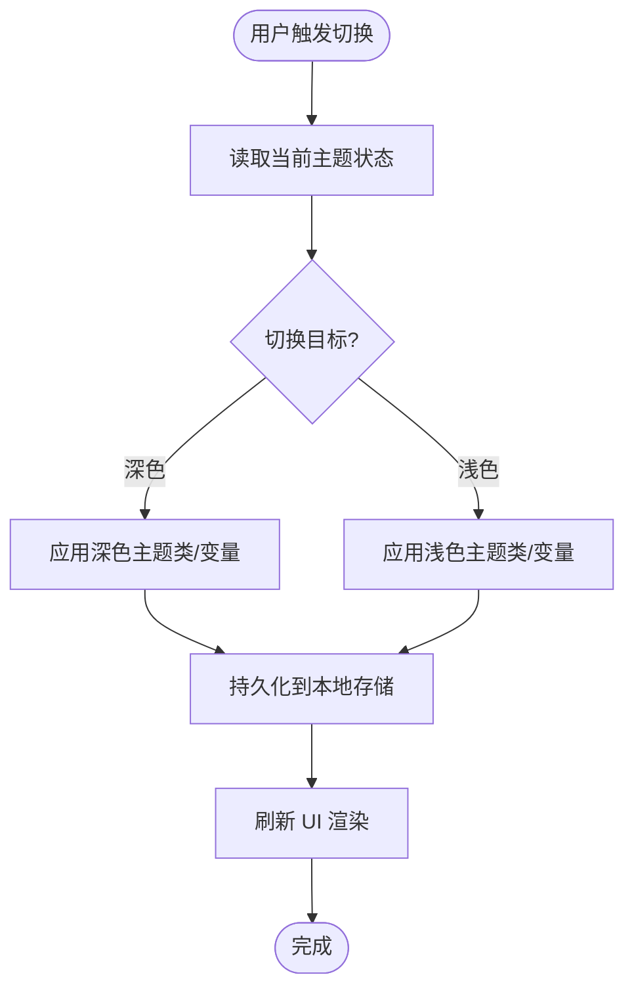
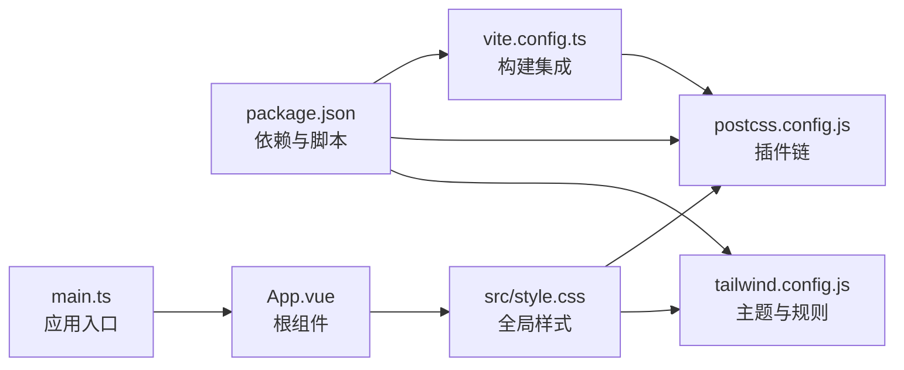

# 样式与主题

<cite>
**本文引用的文件**
- [tailwind.config.js](file://tailwind.config.js)
- [postcss.config.js](file://postcss.config.js)
- [style.css](file://src/style.css)
- [App.vue](file://src/App.vue)
- [main.ts](file://src/main.ts)
- [package.json](file://package.json)
- [vite.config.ts](file://vite.config.ts)
</cite>

## 目录
1. [简介](#简介)
2. [项目结构](#项目结构)
3. [核心组件](#核心组件)
4. [架构总览](#架构总览)
5. [详细组件分析](#详细组件分析)
6. [依赖分析](#依赖分析)
7. [性能考虑](#性能考虑)
8. [故障排查指南](#故障排查指南)
9. [结论](#结论)
10. [附录](#附录)

## 简介
本文件面向使用 Tailwind CSS 的前端工程，系统化说明样式与主题的配置、使用与扩展方式。内容涵盖：
- Tailwind 配置与自定义规范
- 响应式设计与布局策略
- 主题切换机制与定制方法（颜色、字体、布局）
- CSS 模块化组织与最佳实践
- 样式性能优化与浏览器兼容性处理
- 调试技巧与常见问题定位

## 项目结构
本项目采用 Vite + Vue 3 + TypeScript 的工程结构，样式体系以 Tailwind CSS 为核心，PostCSS 作为构建期工具链，全局样式入口位于 src/style.css，应用根组件为 App.vue，主入口为 main.ts。Tailwind 的配置文件 tailwind.config.js 集中管理主题、插件与生成规则；postcss.config.js 负责 PostCSS 插件编排；package.json 声明依赖与脚本；vite.config.ts 提供构建集成点。

图表来源
- [main.ts:1-200](file://src/main.ts#L1-L200)
- [App.vue:1-200](file://src/App.vue#L1-L200)
- [style.css:1-200](file://src/style.css#L1-L200)
- [tailwind.config.js:1-200](file://tailwind.config.js#L1-L200)
- [postcss.config.js:1-200](file://postcss.config.js#L1-L200)
- [vite.config.ts:1-200](file://vite.config.ts#L1-L200)
- [package.json:1-200](file://package.json#L1-L200)

章节来源
- [main.ts:1-200](file://src/main.ts#L1-L200)
- [App.vue:1-200](file://src/App.vue#L1-L200)
- [style.css:1-200](file://src/style.css#L1-L200)
- [tailwind.config.js:1-200](file://tailwind.config.js#L1-L200)
- [postcss.config.js:1-200](file://postcss.config.js#L1-L200)
- [vite.config.ts:1-200](file://vite.config.ts#L1-L200)
- [package.json:1-200](file://package.json#L1-L200)

## 核心组件
- Tailwind 配置中心：通过 tailwind.config.js 定义主题色板、字体族、断点、插件与生成策略，是样式系统的“单一事实来源”。
- 全局样式入口：src/style.css 引入 Tailwind 指令并承载少量全局覆盖与基础样式，便于统一维护。
- 构建与插件：postcss.config.js 串联 Tailwind、Autoprefixer 等插件；vite.config.ts 确保开发/生产环境正确编译与优化。
- 应用挂载：main.ts 初始化 Vue 应用并注入全局样式；App.vue 作为根容器承载页面级主题类名或数据绑定。

章节来源
- [tailwind.config.js:1-200](file://tailwind.config.js#L1-L200)
- [style.css:1-200](file://src/style.css#L1-L200)
- [postcss.config.js:1-200](file://postcss.config.js#L1-L200)
- [vite.config.ts:1-200](file://vite.config.ts#L1-L200)
- [main.ts:1-200](file://src/main.ts#L1-L200)
- [App.vue:1-200](file://src/App.vue#L1-L200)

## 架构总览
下图展示了从应用启动到样式生成的完整链路，以及 Tailwind 配置如何影响最终产物。

图表来源
- [vite.config.ts:1-200](file://vite.config.ts#L1-L200)
- [postcss.config.js:1-200](file://postcss.config.js#L1-L200)
- [tailwind.config.js:1-200](file://tailwind.config.js#L1-L200)

## 详细组件分析

### Tailwind 配置与主题系统
- 主题色板：在 tailwind.config.js 中集中定义品牌色、中性色、语义色（成功/警告/危险等），并通过命名空间或扩展对象进行模块化管理，避免冲突。
- 字体设置：在 fontFamily 中定义字体栈，区分无衬线/衬线/等宽字体，并在组件中以 class 或 CSS 变量形式复用。
- 断点与布局：基于内置断点或自定义断点实现响应式布局，配合 Flex/Grid 与间距系统快速搭建界面。
- 插件与扩展：按需启用官方或第三方插件，扩展默认主题能力（如表单、排版、动画等）。

建议实践
- 将常用颜色抽象为设计令牌（Design Tokens），通过主题对象统一管理。
- 使用语义化命名（如 color-brand-primary）而非具体色值，便于后续替换。
- 对复杂主题进行分层（基础层、业务层、页面层），降低耦合度。

章节来源
- [tailwind.config.js:1-200](file://tailwind.config.js#L1-L200)

### 全局样式与模块化策略
- 入口文件：在 src/style.css 中引入 Tailwind 指令，并放置少量全局重置、基础排版与通用覆盖。
- 组件样式：优先使用 Tailwind 原子类；当需要局部样式时，结合 scoped 样式或 CSS Modules，保持组件内聚性。
- 主题变量：通过 CSS 自定义属性暴露主题变量，供组件与工具函数读取，减少硬编码。

建议实践
- 限制 style.css 体积，仅保留真正的全局样式。
- 将重复样式抽取为组合类或工具类，提升复用率。
- 使用命名约定（BEM/前缀）避免样式污染。

章节来源
- [style.css:1-200](file://src/style.css#L1-L200)

### 构建与插件链
- PostCSS：在 postcss.config.js 中配置 Tailwind 与 Autoprefixer，确保跨浏览器兼容性与自动前缀。
- Vite 集成：vite.config.ts 中确保开发服务器与生产构建均能正确处理 CSS 与静态资源。
- 依赖管理：package.json 中声明 Tailwind、PostCSS、Autoprefixer 等依赖及脚本命令。

建议实践
- 在生产构建中开启 CSS 压缩与 Tree-shaking。
- 使用 PurgeCSS/Tailwind 的 JIT 模式减少无用样式。
- 将浏览器目标写入 Autoprefixer 配置，平衡兼容性与体积。

章节来源
- [postcss.config.js:1-200](file://postcss.config.js#L1-L200)
- [vite.config.ts:1-200](file://vite.config.ts#L1-L200)
- [package.json:1-200](file://package.json#L1-L200)

### 应用挂载与主题切换机制
- 应用启动：main.ts 初始化 Vue 实例并挂载到 DOM，同时引入全局样式。
- 根容器：App.vue 作为根节点，可通过 class 或 data attribute 控制主题模式（如 dark/light）。
- 切换逻辑：建议在 store 或顶层组件中维护主题状态，并通过 class 切换或 CSS 变量更新实现即时生效。

主题切换流程示意

图表来源
- [App.vue:1-200](file://src/App.vue#L1-L200)
- [main.ts:1-200](file://src/main.ts#L1-L200)

章节来源
- [App.vue:1-200](file://src/App.vue#L1-L200)
- [main.ts:1-200](file://src/main.ts#L1-L200)

### 响应式设计实现
- 断点策略：基于 Tailwind 内置断点或自定义断点，统一移动端优先的响应式写法。
- 布局模式：使用 Flex/Grid 与间距系统，结合容器查询与流体排版提升适配能力。
- 组件适配：在组件内部通过条件类名或媒体查询适配不同屏幕尺寸。

建议实践
- 优先在小屏上设计，再逐步增强到大屏体验。
- 将常见布局封装为组合类，减少重复代码。
- 使用相对单位与视口单位提升可访问性与缩放体验。

章节来源
- [tailwind.config.js:1-200](file://tailwind.config.js#L1-L200)
- [style.css:1-200](file://src/style.css#L1-L200)

### 主题定制指南（颜色、字体、布局）
- 颜色方案：在 tailwind.config.js 中定义色板，按用途划分（品牌、中性、语义），并提供明暗两套变体。
- 字体设置：在 fontFamily 中定义字体栈，支持回退字体；必要时引入 WebFont 并设置加载策略。
- 布局样式：通过 spacing、border-radius、shadow 等主题项统一视觉语言；利用容器与栅格系统保持一致性。

建议实践
- 使用语义化变量与命名，避免直接引用色值。
- 将主题项导出为常量，供 JS/CSS 共享。
- 建立设计令牌文档，便于团队协作与审计。

章节来源
- [tailwind.config.js:1-200](file://tailwind.config.js#L1-L200)

### 样式调试技巧与最佳实践
- 调试技巧
  - 使用浏览器开发者工具的“计算样式”查看最终生效规则。
  - 借助 Tailwind 的 JIT 模式与类名提示，快速定位问题。
  - 通过控制台打印主题变量与 computed styles，验证切换是否生效。
- 最佳实践
  - 遵循原子类优先原则，避免手写冗余 CSS。
  - 将全局样式控制在最小范围，组件样式尽量内聚。
  - 使用统一的命名约定与注释规范，提升可维护性。

章节来源
- [style.css:1-200](file://src/style.css#L1-L200)
- [tailwind.config.js:1-200](file://tailwind.config.js#L1-L200)

## 依赖分析
下图展示样式相关依赖关系与职责边界。

图表来源
- [package.json:1-200](file://package.json#L1-L200)
- [tailwind.config.js:1-200](file://tailwind.config.js#L1-L200)
- [postcss.config.js:1-200](file://postcss.config.js#L1-L200)
- [vite.config.ts:1-200](file://vite.config.ts#L1-L200)
- [main.ts:1-200](file://src/main.ts#L1-L200)
- [App.vue:1-200](file://src/App.vue#L1-L200)
- [style.css:1-200](file://src/style.css#L1-L200)

章节来源
- [package.json:1-200](file://package.json#L1-L200)
- [tailwind.config.js:1-200](file://tailwind.config.js#L1-L200)
- [postcss.config.js:1-200](file://postcss.config.js#L1-L200)
- [vite.config.ts:1-200](file://vite.config.ts#L1-L200)
- [main.ts:1-200](file://src/main.ts#L1-L200)
- [App.vue:1-200](file://src/App.vue#L1-L200)
- [style.css:1-200](file://src/style.css#L1-L200)

## 性能考虑
- 构建优化
  - 启用 Tailwind JIT 模式，按需生成样式，显著减小包体。
  - 在生产构建中启用 CSS 压缩与死代码消除。
  - 合理配置 Autoprefixer 目标浏览器，避免多余前缀。
- 运行时优化
  - 使用 CSS 变量与 class 切换替代大量条件渲染，减少重排重绘。
  - 将高频更新的样式改为 transform/opacity 等合成属性。
- 可维护性
  - 通过主题对象与设计令牌统一管理样式，降低变更成本。
  - 定期审计样式覆盖率，清理未使用规则。

[本节为通用指导，不直接分析具体文件]

## 故障排查指南
- 样式不生效
  - 检查 src/style.css 是否正确引入 Tailwind 指令。
  - 确认 tailwind.config.js 中的 content 路径包含所有模板与组件。
  - 验证 postcss.config.js 中插件顺序与配置。
- 主题切换无效
  - 检查根节点是否添加了正确的主题类或 data 属性。
  - 确认 CSS 变量或主题类名在构建后确实存在。
  - 在浏览器中查看 computed styles，定位覆盖原因。
- 构建报错
  - 核对 package.json 中依赖版本与脚本命令。
  - 检查 vite.config.ts 与 postcss.config.js 的兼容性。
  - 清理缓存后重试构建。

章节来源
- [style.css:1-200](file://src/style.css#L1-L200)
- [tailwind.config.js:1-200](file://tailwind.config.js#L1-L200)
- [postcss.config.js:1-200](file://postcss.config.js#L1-L200)
- [package.json:1-200](file://package.json#L1-L200)
- [vite.config.ts:1-200](file://vite.config.ts#L1-L200)

## 结论
本项目的样式体系以 Tailwind 为核心，通过集中化的主题配置、模块化的全局样式与健壮的构建链，实现了高可维护性与高性能的样式输出。建议团队在设计阶段即建立设计令牌与命名规范，持续优化主题结构与构建配置，确保样式系统在规模增长时仍保持清晰与高效。

[本节为总结性内容，不直接分析具体文件]

## 附录
- 快速开始
  - 安装依赖：参考 package.json 中的依赖列表与脚本命令。
  - 启动开发：执行开发脚本，观察样式热更新。
  - 构建发布：执行构建脚本，检查输出产物体积与兼容性。
- 参考文件
  - 主题配置：tailwind.config.js
  - 全局样式：src/style.css
  - 构建配置：postcss.config.js、vite.config.ts
  - 应用入口：main.ts、App.vue
  - 依赖清单：package.json

[本节为补充信息，不直接分析具体文件]