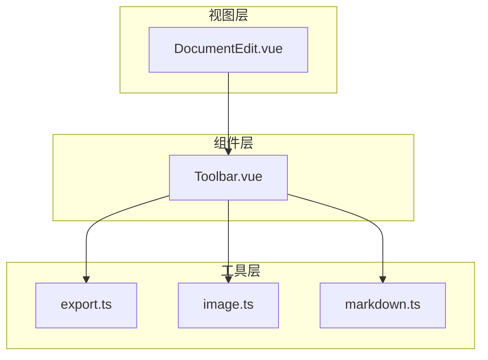
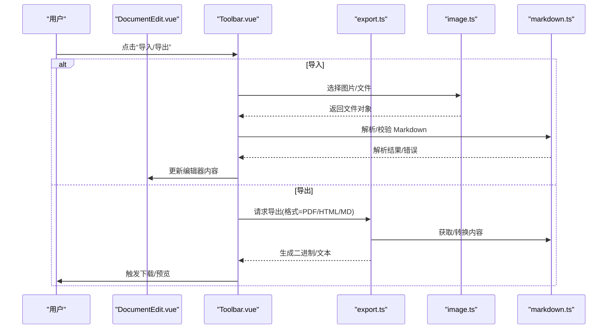
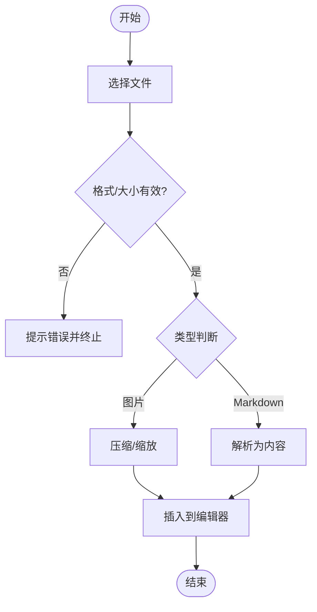
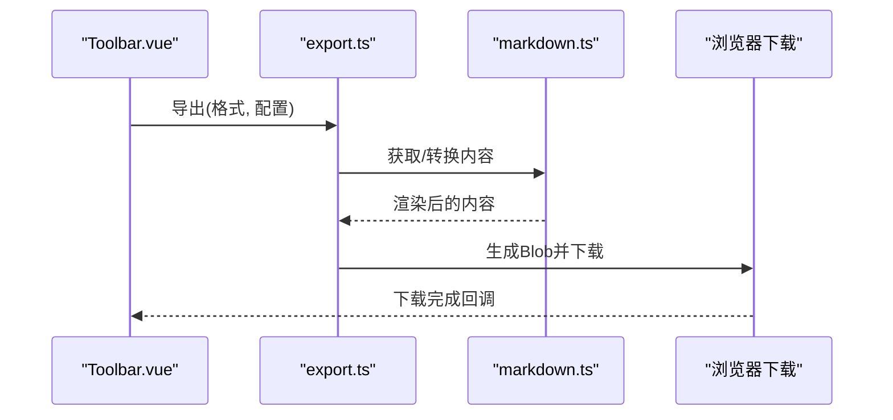
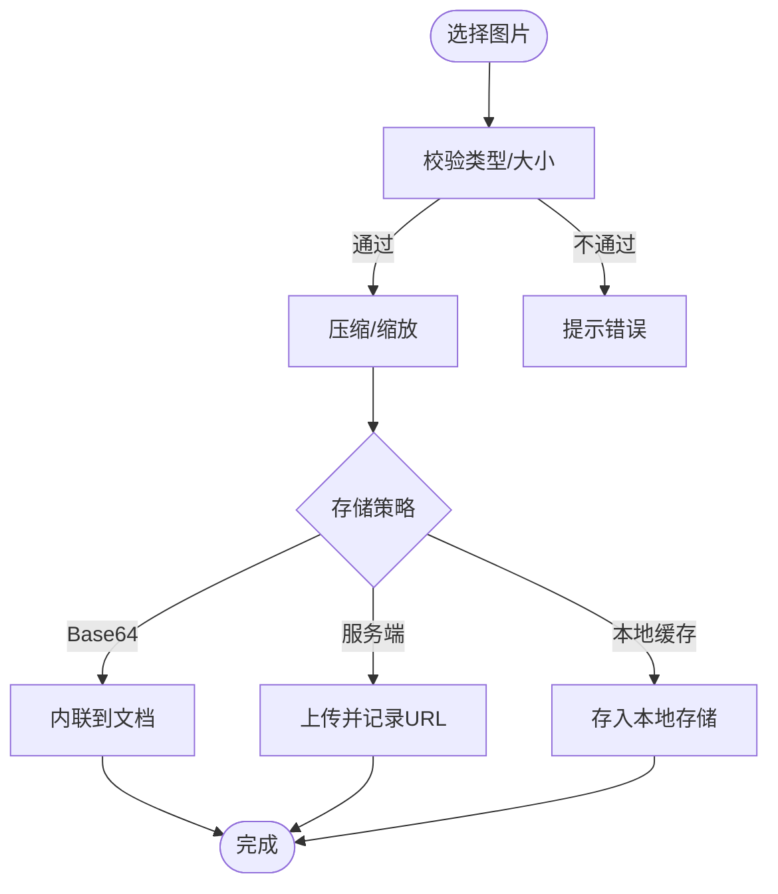
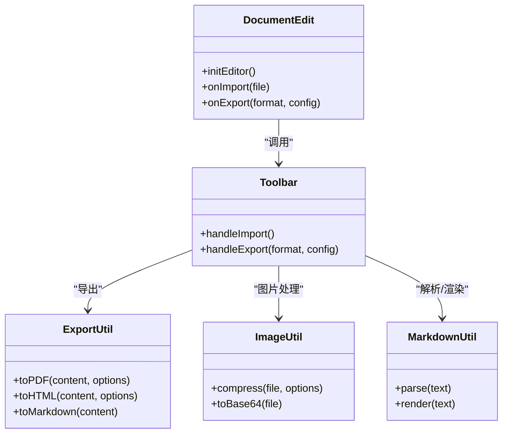
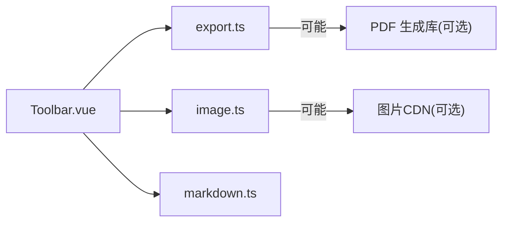

# 导入导出功能

<cite>
**本文引用的文件**
- [src/utils/export.ts](file://src/utils/export.ts)
- [src/utils/image.ts](file://src/utils/image.ts)
- [src/utils/markdown.ts](file://src/utils/markdown.ts)
- [src/components/Toolbar.vue](file://src/components/Toolbar.vue)
- [src/views/DocumentEdit.vue](file://src/views/DocumentEdit.vue)
- [package.json](file://package.json)
</cite>

## 目录
1. [简介](#简介)
2. [项目结构](#项目结构)
3. [核心组件](#核心组件)
4. [架构总览](#架构总览)
5. [详细组件分析](#详细组件分析)
6. [依赖分析](#依赖分析)
7. [性能考虑](#性能考虑)
8. [故障排查指南](#故障排查指南)
9. [结论](#结论)
10. [附录](#附录)

## 简介
本章节概述本项目的导入与导出能力：支持从 Markdown 源文件导入内容，将文档导出为 PDF、HTML、Markdown 等格式；提供图片上传、压缩与存储策略；通过工具栏与编辑视图集成用户操作入口。该文档面向开发者，帮助理解并扩展导入导出流程。

## 项目结构
与导入导出相关的代码主要分布在 utils、components 与 views 三个层次：
- utils：封装导出（PDF/HTML/MD）、图片处理、Markdown 解析与统计等通用能力
- components：工具栏提供“导入”“导出”按钮及交互入口
- views：页面级逻辑负责调用工具栏动作、管理编辑器状态

图表来源
- [src/views/DocumentEdit.vue](file://src/views/DocumentEdit.vue)
- [src/components/Toolbar.vue](file://src/components/Toolbar.vue)
- [src/utils/export.ts](file://src/utils/export.ts)
- [src/utils/image.ts](file://src/utils/image.ts)
- [src/utils/markdown.ts](file://src/utils/markdown.ts)

章节来源
- [src/components/Toolbar.vue](file://src/components/Toolbar.vue)
- [src/views/DocumentEdit.vue](file://src/views/DocumentEdit.vue)
- [src/utils/export.ts](file://src/utils/export.ts)
- [src/utils/image.ts](file://src/utils/image.ts)
- [src/utils/markdown.ts](file://src/utils/markdown.ts)

## 核心组件
- 导出器（export.ts）：负责将当前文档内容转换为 PDF、HTML、Markdown 并触发下载或预览
- 图片处理器（image.ts）：负责图片选择、压缩、尺寸限制、Base64/URL 转换与本地存储策略
- Markdown 工具（markdown.ts）：负责 Markdown 解析、渲染辅助、统计信息计算
- 工具栏（Toolbar.vue）：暴露“导入”“导出”入口，协调编辑器与工具层
- 编辑页（DocumentEdit.vue）：承载编辑器实例，响应导入/导出事件，维护文档状态

章节来源
- [src/utils/export.ts](file://src/utils/export.ts)
- [src/utils/image.ts](file://src/utils/image.ts)
- [src/utils/markdown.ts](file://src/utils/markdown.ts)
- [src/components/Toolbar.vue](file://src/components/Toolbar.vue)
- [src/views/DocumentEdit.vue](file://src/views/DocumentEdit.vue)

## 架构总览
导入导出整体流程以“工具栏”为入口，调用“工具层”完成具体转换与 I/O，再由“视图层”驱动编辑器状态更新与结果反馈。

图表来源
- [src/components/Toolbar.vue](file://src/components/Toolbar.vue)
- [src/utils/export.ts](file://src/utils/export.ts)
- [src/utils/image.ts](file://src/utils/image.ts)
- [src/utils/markdown.ts](file://src/utils/markdown.ts)
- [src/views/DocumentEdit.vue](file://src/views/DocumentEdit.vue)

## 详细组件分析

### 导入机制
- 支持的导入格式
  - Markdown 文本文件（.md/.markdown）
  - 图片文件（用于插入到文档中），常见格式包括 PNG/JPG/JPEG/GIF/SVG/WebP（由浏览器 FileReader 与 Image API 决定）
- 文件格式验证
  - 基于 MIME 类型与扩展名双重校验，拒绝非法类型
  - 对图片进行尺寸与大小上限检查，避免大文件导致内存压力
- 大文件处理策略
  - 分块读取与流式处理（如适用）
  - 限制最大文件大小，超出时提示用户
  - 图片优先压缩后再插入，减少 DOM 与内存占用
- 导入流程
  - 用户在工具栏选择文件
  - 工具层解析/校验后，将内容写入编辑器
  - 编辑器更新后触发保存或同步状态

图表来源
- [src/components/Toolbar.vue](file://src/components/Toolbar.vue)
- [src/utils/image.ts](file://src/utils/image.ts)
- [src/utils/markdown.ts](file://src/utils/markdown.ts)

章节来源
- [src/components/Toolbar.vue](file://src/components/Toolbar.vue)
- [src/utils/image.ts](file://src/utils/image.ts)
- [src/utils/markdown.ts](file://src/utils/markdown.ts)

### 多格式导出
- 支持的导出格式
  - PDF：通过浏览器打印或第三方库生成 PDF 文件
  - HTML：将 Markdown 渲染为 HTML 并打包下载
  - Markdown：直接导出原始 Markdown 文本
- 生成过程
  - 从编辑器获取当前内容
  - 根据目标格式调用对应转换逻辑
  - 生成 Blob/ArrayBuffer 并触发浏览器下载
- 配置项
  - 页面标题、作者、主题样式（影响 PDF/HTML 输出）
  - 图片嵌入策略（外链/内联 Base64）
  - 分页与边距（PDF）

图表来源
- [src/components/Toolbar.vue](file://src/components/Toolbar.vue)
- [src/utils/export.ts](file://src/utils/export.ts)
- [src/utils/markdown.ts](file://src/utils/markdown.ts)

章节来源
- [src/components/Toolbar.vue](file://src/components/Toolbar.vue)
- [src/utils/export.ts](file://src/utils/export.ts)
- [src/utils/markdown.ts](file://src/utils/markdown.ts)

### 图片处理机制
- 图片上传
  - 通过文件选择器获取图片
  - 校验 MIME 类型与扩展名
- 压缩与优化
  - 使用 Canvas 进行压缩与尺寸调整
  - 可配置质量参数与最大边长
- 存储策略
  - 可选：转为 Base64 内联到文档
  - 可选：上传至服务端（若后续接入后端）
  - 本地缓存：IndexedDB/LocalStorage（注意容量限制）
- 错误处理
  - 超大图片拦截
  - 压缩失败回退到原图或提示重试

图表来源
- [src/utils/image.ts](file://src/utils/image.ts)

章节来源
- [src/utils/image.ts](file://src/utils/image.ts)

### 编辑器与视图集成
- DocumentEdit.vue
  - 初始化编辑器实例
  - 监听导入/导出事件，更新内容与状态
  - 与工具栏通信，传递当前文档数据
- Toolbar.vue
  - 提供“导入”“导出”按钮
  - 调用 export.ts、image.ts、markdown.ts 完成具体任务
  - 向视图层广播事件，触发 UI 更新

图表来源
- [src/views/DocumentEdit.vue](file://src/views/DocumentEdit.vue)
- [src/components/Toolbar.vue](file://src/components/Toolbar.vue)
- [src/utils/export.ts](file://src/utils/export.ts)
- [src/utils/image.ts](file://src/utils/image.ts)
- [src/utils/markdown.ts](file://src/utils/markdown.ts)

章节来源
- [src/views/DocumentEdit.vue](file://src/views/DocumentEdit.vue)
- [src/components/Toolbar.vue](file://src/components/Toolbar.vue)
- [src/utils/export.ts](file://src/utils/export.ts)
- [src/utils/image.ts](file://src/utils/image.ts)
- [src/utils/markdown.ts](file://src/utils/markdown.ts)

## 依赖分析
- 运行时依赖
  - 浏览器原生能力：FileReader、Canvas、Blob、URL.createObjectURL
  - 可选：PDF 生成库（例如 jsPDF、html2pdf 等，视实现而定）
- 构建期依赖
  - TypeScript、Vite 等前端工程化工具
- 外部服务
  - 图片上传若启用服务端存储，需对接后端接口（当前仓库未包含后端）

图表来源
- [src/components/Toolbar.vue](file://src/components/Toolbar.vue)
- [src/utils/export.ts](file://src/utils/export.ts)
- [src/utils/image.ts](file://src/utils/image.ts)
- [src/utils/markdown.ts](file://src/utils/markdown.ts)

章节来源
- [package.json](file://package.json)

## 性能考虑
- 大文件导入
  - 限制单文件大小，避免内存溢出
  - 对图片进行压缩与尺寸限制，降低 DOM 体积
- 导出性能
  - 对长文档采用分页/懒加载渲染
  - PDF 生成时关闭不必要的高清选项以提升速度
- 缓存策略
  - 对频繁使用的模板或样式进行缓存
  - 图片本地缓存以减少重复上传

[本节为通用指导，不直接分析具体文件]

## 故障排查指南
- 导入失败
  - 检查文件类型与扩展名是否匹配
  - 查看控制台是否有解析错误或越界访问
- 导出异常
  - 确认目标格式所需依赖已正确引入
  - 检查浏览器权限（如下载弹窗被拦截）
- 图片问题
  - 压缩失败时回退到原图或提示重试
  - 检查跨域与存储配额限制

章节来源
- [src/utils/image.ts](file://src/utils/image.ts)
- [src/utils/export.ts](file://src/utils/export.ts)
- [src/utils/markdown.ts](file://src/utils/markdown.ts)

## 结论
本项目通过工具层抽象出导入、导出与图片处理的通用能力，并以工具栏与编辑视图作为用户入口，形成清晰的职责边界。开发者可在此基础上扩展更多导入/导出格式、优化图片处理策略，或接入后端服务以实现云端存储与协作。

## 附录
- 使用示例（概念性步骤）
  - 导入 Markdown：在工具栏选择 .md 文件，系统解析并填充到编辑器
  - 导出 PDF：选择“导出为 PDF”，设置页面标题与边距后下载
  - 导出 HTML：选择“导出为 HTML”，生成完整页面文件
  - 导出 Markdown：选择“导出为 Markdown”，下载原始文本
  - 插入图片：选择图片文件，自动压缩并插入到文档中
- 配置选项（示例说明）
  - 导出：页面标题、作者、主题、PDF 边距、图片嵌入策略
  - 图片：最大边长、压缩质量、存储方式（本地/服务端）
  - 导入：允许的文件类型、最大文件大小

[本节为概念性说明，不直接分析具体文件]