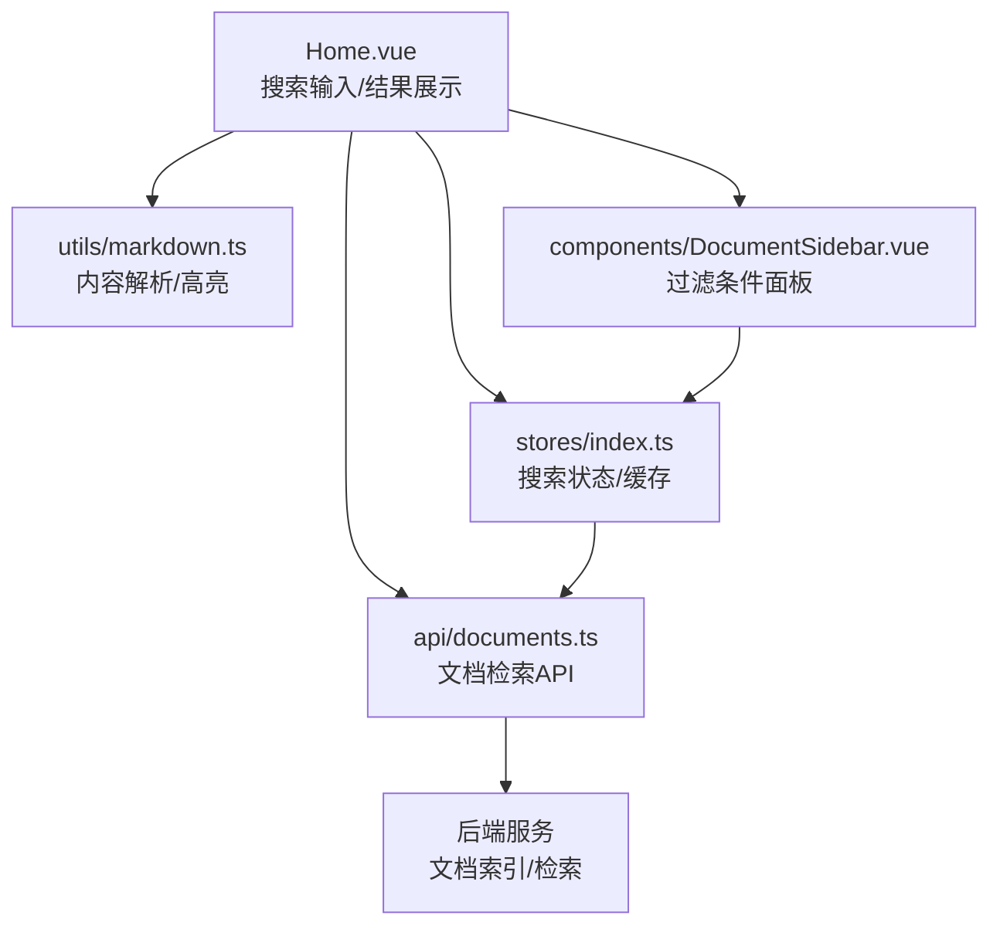
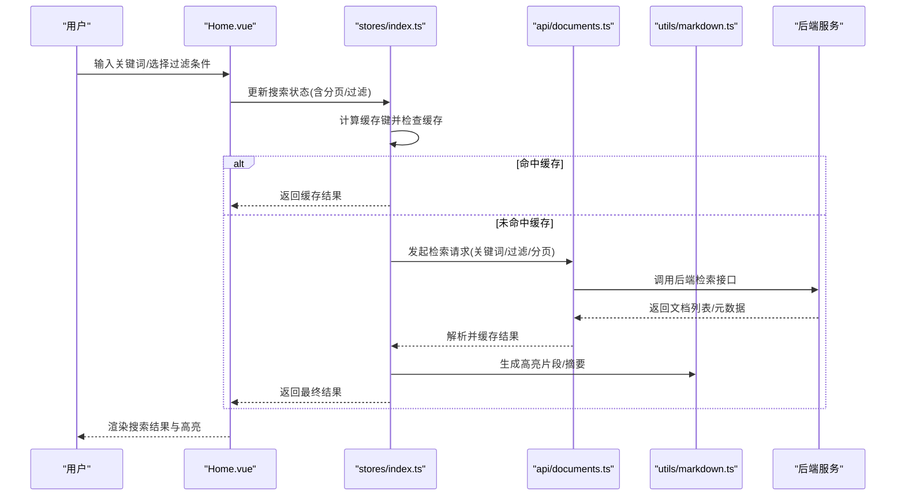
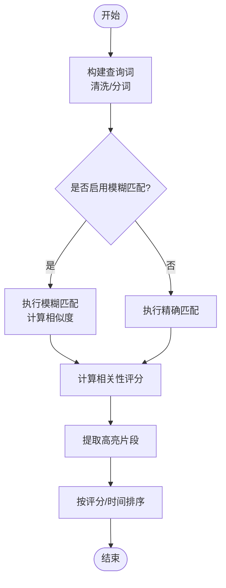
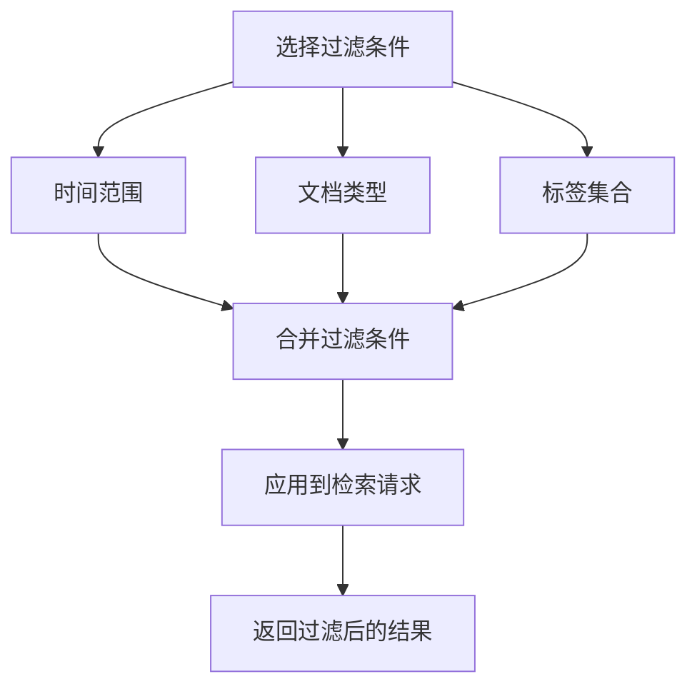
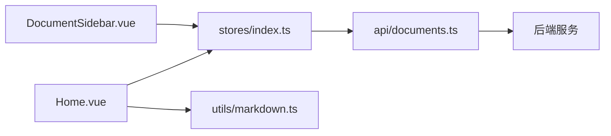

# 搜索与过滤

<cite>
**本文引用的文件**
- [src/views/Home.vue](file://src/views/Home.vue)
- [src/api/documents.ts](file://src/api/documents.ts)
- [src/stores/index.ts](file://src/stores/index.ts)
- [src/types/index.ts](file://src/types/index.ts)
- [src/utils/markdown.ts](file://src/utils/markdown.ts)
- [src/components/DocumentSidebar.vue](file://src/components/DocumentSidebar.vue)
</cite>

## 目录
1. [简介](#简介)
2. [项目结构](#项目结构)
3. [核心组件](#核心组件)
4. [架构总览](#架构总览)
5. [详细组件分析](#详细组件分析)
6. [依赖关系分析](#依赖关系分析)
7. [性能考虑](#性能考虑)
8. [故障排查指南](#故障排查指南)
9. [结论](#结论)
10. [附录](#附录)

## 简介
本章节面向文档搜索与过滤功能，覆盖关键词匹配、模糊搜索、高亮显示、过滤条件（时间范围、文档类型、标签等）、排序规则、防抖处理、分页加载与缓存机制，以及自定义过滤器的扩展方法。目标是帮助用户快速定位目标文档，同时保证良好的交互体验与系统性能。

## 项目结构
前端采用 Vue 单页应用结构，搜索与过滤相关能力主要分布在以下位置：
- 视图层：首页列表与搜索入口
- API 层：文档检索接口封装
- 状态管理：全局搜索状态与结果缓存
- 工具层：Markdown 解析与高亮辅助
- 侧边栏：筛选面板与过滤器联动

图表来源
- [src/views/Home.vue](file://src/views/Home.vue)
- [src/stores/index.ts](file://src/stores/index.ts)
- [src/api/documents.ts](file://src/api/documents.ts)
- [src/utils/markdown.ts](file://src/utils/markdown.ts)
- [src/components/DocumentSidebar.vue](file://src/components/DocumentSidebar.vue)

章节来源
- [src/views/Home.vue](file://src/views/Home.vue)
- [src/api/documents.ts](file://src/api/documents.ts)
- [src/stores/index.ts](file://src/stores/index.ts)
- [src/utils/markdown.ts](file://src/utils/markdown.ts)
- [src/components/DocumentSidebar.vue](file://src/components/DocumentSidebar.vue)

## 核心组件
- 搜索输入与结果展示：负责接收用户查询、触发检索、渲染结果列表与摘要
- 过滤面板：提供时间范围、文档类型、标签等筛选控件，并与搜索结果联动
- 状态与缓存：集中管理搜索词、过滤条件、分页参数、结果集与缓存键
- API 封装：统一调用后端检索接口，处理请求参数与响应数据
- 工具函数：Markdown 解析、片段提取、高亮标记生成

章节来源
- [src/views/Home.vue](file://src/views/Home.vue)
- [src/components/DocumentSidebar.vue](file://src/components/DocumentSidebar.vue)
- [src/stores/index.ts](file://src/stores/index.ts)
- [src/api/documents.ts](file://src/api/documents.ts)
- [src/utils/markdown.ts](file://src/utils/markdown.ts)

## 架构总览
搜索与过滤的整体流程如下：用户在首页输入关键词并选择过滤条件，系统通过防抖触发检索；若命中缓存则直接返回，否则调用 API 获取结果并更新状态；结果按评分或时间排序后分页展示；对 Markdown 内容进行片段提取与高亮显示。

图表来源
- [src/views/Home.vue](file://src/views/Home.vue)
- [src/stores/index.ts](file://src/stores/index.ts)
- [src/api/documents.ts](file://src/api/documents.ts)
- [src/utils/markdown.ts](file://src/utils/markdown.ts)

## 详细组件分析

### 搜索算法与关键词匹配
- 关键词匹配：支持精确匹配与大小写不敏感匹配，优先匹配标题与正文关键字段
- 模糊搜索：基于编辑距离或前缀匹配的近似匹配策略，提升容错率
- 相关性评分：结合字段权重（如标题 > 正文）与命中次数进行打分排序
- 片段提取：从匹配段落中抽取包含关键词的上下文片段，便于预览

图表来源
- [src/views/Home.vue](file://src/views/Home.vue)
- [src/stores/index.ts](file://src/stores/index.ts)
- [src/utils/markdown.ts](file://src/utils/markdown.ts)

章节来源
- [src/views/Home.vue](file://src/views/Home.vue)
- [src/stores/index.ts](file://src/stores/index.ts)
- [src/utils/markdown.ts](file://src/utils/markdown.ts)

### 高亮显示
- 高亮策略：在片段中标记匹配关键词，避免破坏 Markdown 结构
- 片段长度控制：限制摘要长度，确保列表项紧凑可读
- 多关键词高亮：支持多个关键词同时高亮，避免重叠冲突

章节来源
- [src/utils/markdown.ts](file://src/utils/markdown.ts)
- [src/views/Home.vue](file://src/views/Home.vue)

### 过滤条件设置
- 时间范围：支持起止日期筛选，常用于最近修改/创建时间
- 文档类型：按文件后缀或分类维度筛选（如 .md、.txt）
- 标签：按标签集合进行交集/并集筛选
- 组合过滤：支持多条件叠加，过滤逻辑与搜索关键词并行生效

图表来源
- [src/components/DocumentSidebar.vue](file://src/components/DocumentSidebar.vue)
- [src/stores/index.ts](file://src/stores/index.ts)
- [src/api/documents.ts](file://src/api/documents.ts)

章节来源
- [src/components/DocumentSidebar.vue](file://src/components/DocumentSidebar.vue)
- [src/stores/index.ts](file://src/stores/index.ts)
- [src/api/documents.ts](file://src/api/documents.ts)

### 排序规则
- 默认排序：按相关性评分降序
- 可选排序：按更新时间、创建时间、标题字母序
- 排序优先级：当评分相同的情况下，按时间倒序作为次级排序

章节来源
- [src/stores/index.ts](file://src/stores/index.ts)
- [src/views/Home.vue](file://src/views/Home.vue)

### 分页加载
- 分页参数：页码与每页条数
- 滚动加载：可视区域底部触发下一页加载
- 去重策略：合并新旧结果，避免重复条目

章节来源
- [src/stores/index.ts](file://src/stores/index.ts)
- [src/views/Home.vue](file://src/views/Home.vue)

### 缓存机制
- 缓存键：由搜索词、过滤条件、分页参数共同组成
- 缓存粒度：按页缓存，减少重复请求
- 失效策略：搜索词或过滤条件变化时清空对应缓存

章节来源
- [src/stores/index.ts](file://src/stores/index.ts)

### 自定义过滤器扩展
- 扩展点：在过滤条件对象中新增字段，并在请求组装阶段透传到后端
- 前端校验：对新增过滤字段进行格式与取值范围校验
- 后端对接：确保后端支持新过滤字段并返回一致的数据结构

章节来源
- [src/components/DocumentSidebar.vue](file://src/components/DocumentSidebar.vue)
- [src/stores/index.ts](file://src/stores/index.ts)
- [src/api/documents.ts](file://src/api/documents.ts)

## 依赖关系分析
- Home.vue 依赖 stores/index.ts 管理搜索状态与缓存
- DocumentSidebar.vue 通过 stores/index.ts 同步过滤条件
- api/documents.ts 封装检索请求，依赖后端接口契约
- utils/markdown.ts 为高亮与片段提取提供工具能力

图表来源
- [src/views/Home.vue](file://src/views/Home.vue)
- [src/stores/index.ts](file://src/stores/index.ts)
- [src/components/DocumentSidebar.vue](file://src/components/DocumentSidebar.vue)
- [src/api/documents.ts](file://src/api/documents.ts)
- [src/utils/markdown.ts](file://src/utils/markdown.ts)

章节来源
- [src/views/Home.vue](file://src/views/Home.vue)
- [src/stores/index.ts](file://src/stores/index.ts)
- [src/components/DocumentSidebar.vue](file://src/components/DocumentSidebar.vue)
- [src/api/documents.ts](file://src/api/documents.ts)
- [src/utils/markdown.ts](file://src/utils/markdown.ts)

## 性能考虑
- 防抖处理：对搜索输入进行防抖，降低频繁请求带来的压力
- 分页加载：按需加载下一页，避免一次性渲染大量数据
- 缓存机制：按查询与过滤条件缓存结果，减少重复网络请求
- 高亮优化：仅在可见区域内生成高亮片段，减少 DOM 操作开销
- 排序优化：服务端排序优先，客户端仅做轻量二次排序

[本节为通用性能建议，不直接分析具体文件]

## 故障排查指南
- 搜索无结果：检查关键词是否被正确传递到请求参数；确认过滤条件是否过于严格
- 高亮异常：确认 Markdown 片段解析是否正确；检查高亮标记是否破坏结构
- 分页异常：验证页码与每页条数参数；检查缓存键是否因过滤条件变化而失效
- 性能问题：确认防抖延迟是否合理；评估缓存命中率与网络请求频率

章节来源
- [src/stores/index.ts](file://src/stores/index.ts)
- [src/api/documents.ts](file://src/api/documents.ts)
- [src/utils/markdown.ts](file://src/utils/markdown.ts)
- [src/views/Home.vue](file://src/views/Home.vue)

## 结论
通过关键词匹配、模糊搜索、高亮显示与多维度过滤的组合，用户可以高效定位目标文档。配合防抖、分页与缓存等优化策略，系统在交互体验与性能之间取得平衡。未来可进一步引入服务端全文检索与更丰富的排序选项，以满足更大规模文档库的需求。

[本节为总结性内容，不直接分析具体文件]

## 附录
- 数据类型定义：参考类型定义文件以了解文档结构与字段含义
- 接口契约：参考 API 文件以了解请求参数与响应格式

章节来源
- [src/types/index.ts](file://src/types/index.ts)
- [src/api/documents.ts](file://src/api/documents.ts)