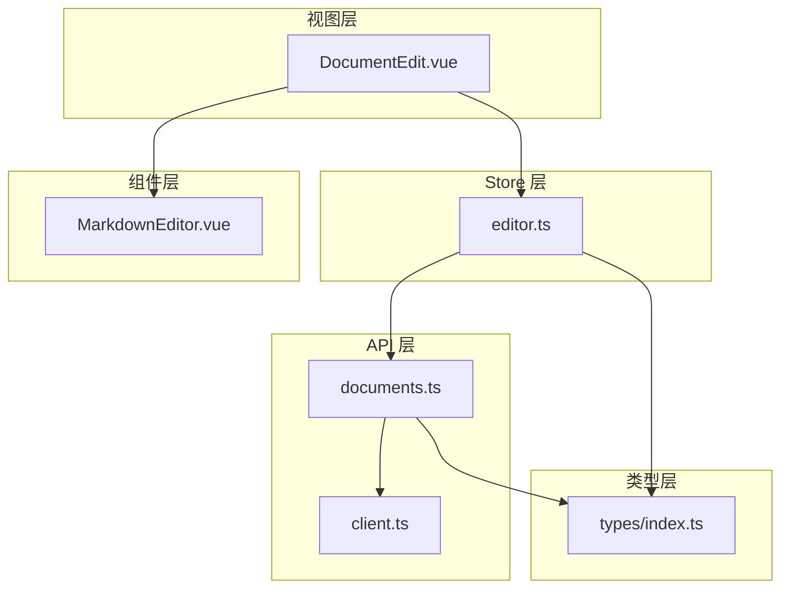
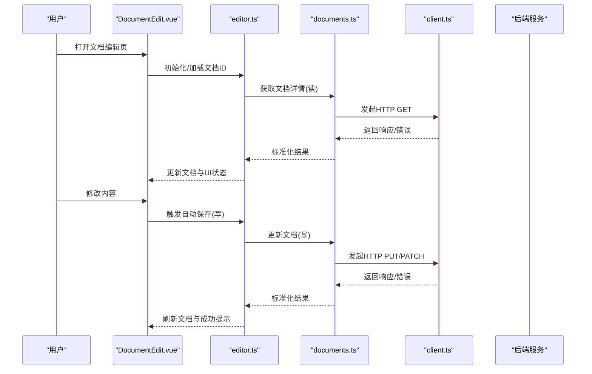
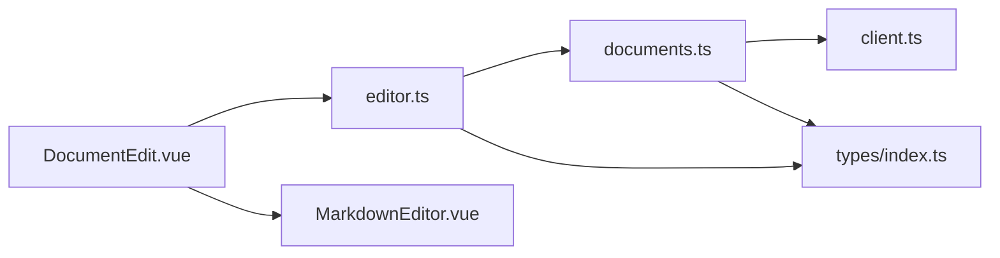
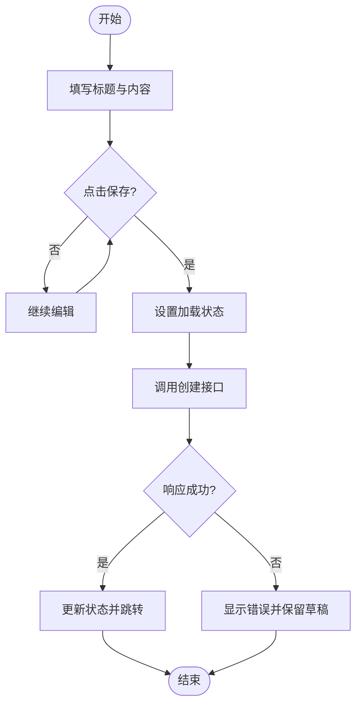
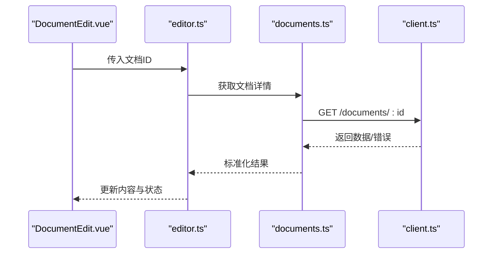
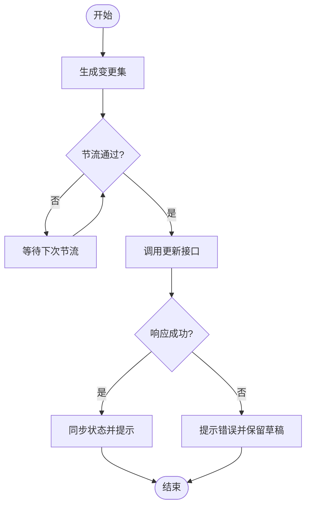
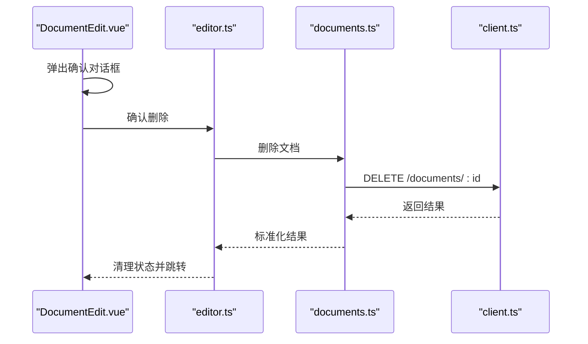

# 文档CRUD操作

<cite>
**本文引用的文件**
- [src/api/documents.ts](file://src/api/documents.ts)
- [src/api/client.ts](file://src/api/client.ts)
- [src/stores/editor.ts](file://src/stores/editor.ts)
- [src/views/DocumentEdit.vue](file://src/views/DocumentEdit.vue)
- [src/components/MarkdownEditor.vue](file://src/components/MarkdownEditor.vue)
- [src/types/index.ts](file://src/types/index.ts)
</cite>

## 目录
1. [简介](#简介)
2. [项目结构](#项目结构)
3. [核心组件](#核心组件)
4. [架构总览](#架构总览)
5. [详细组件分析](#详细组件分析)
6. [依赖关系分析](#依赖关系分析)
7. [性能考虑](#性能考虑)
8. [故障排查指南](#故障排查指南)
9. [结论](#结论)
10. [附录](#附录)

## 简介
本章节面向开发者，系统化说明文档的创建、读取、更新、删除（CRUD）在前后端的完整实现流程。内容涵盖：
- API 调用方式与参数传递
- 响应处理与数据同步机制
- 错误处理策略与状态管理（加载态、成功反馈、错误提示）
- 典型使用场景与最佳实践

目标是帮助读者理解并掌握文档全生命周期的前端管理能力。

## 项目结构
本项目采用“分层+按功能组织”的结构：
- API 层：封装 HTTP 请求与接口定义
- Store 层：集中管理文档编辑相关状态与副作用
- 视图层：页面级逻辑与用户交互
- 组件层：可复用的编辑器与工具栏等 UI
- 类型层：统一的数据模型与接口契约

图表来源
- [src/api/documents.ts](file://src/api/documents.ts)
- [src/api/client.ts](file://src/api/client.ts)
- [src/stores/editor.ts](file://src/stores/editor.ts)
- [src/views/DocumentEdit.vue](file://src/views/DocumentEdit.vue)
- [src/components/MarkdownEditor.vue](file://src/components/MarkdownEditor.vue)
- [src/types/index.ts](file://src/types/index.ts)

章节来源
- [src/api/documents.ts](file://src/api/documents.ts)
- [src/api/client.ts](file://src/api/client.ts)
- [src/stores/editor.ts](file://src/stores/editor.ts)
- [src/views/DocumentEdit.vue](file://src/views/DocumentEdit.vue)
- [src/components/MarkdownEditor.vue](file://src/components/MarkdownEditor.vue)
- [src/types/index.ts](file://src/types/index.ts)

## 核心组件
- API 客户端与文档接口
  - 统一的 HTTP 客户端封装，负责基础配置、拦截器、错误归一化
  - 文档 CRUD 接口方法：创建、获取、更新、删除、列表等
- 编辑器状态管理
  - 维护当前文档、草稿、加载/错误状态、自动保存节流等
- 文档编辑页面
  - 组合编辑器组件与状态，驱动 CRUD 生命周期
- Markdown 编辑器组件
  - 提供内容输入、预览、导出等能力，向上暴露事件与属性

章节来源
- [src/api/documents.ts](file://src/api/documents.ts)
- [src/api/client.ts](file://src/api/client.ts)
- [src/stores/editor.ts](file://src/stores/editor.ts)
- [src/views/DocumentEdit.vue](file://src/views/DocumentEdit.vue)
- [src/components/MarkdownEditor.vue](file://src/components/MarkdownEditor.vue)

## 架构总览
下图展示从页面到 API 的调用链路与数据流，以及状态如何驱动 UI 更新。

图表来源
- [src/views/DocumentEdit.vue](file://src/views/DocumentEdit.vue)
- [src/stores/editor.ts](file://src/stores/editor.ts)
- [src/api/documents.ts](file://src/api/documents.ts)
- [src/api/client.ts](file://src/api/client.ts)

## 详细组件分析

### API 层：文档接口与客户端
- 职责
  - 定义文档相关的 RESTful 接口方法
  - 通过统一客户端发送请求，处理通用错误与响应转换
- 关键方法
  - 创建文档：POST /documents
  - 获取文档：GET /documents/:id
  - 更新文档：PUT/PATCH /documents/:id
  - 删除文档：DELETE /documents/:id
  - 可选：列表查询、搜索等
- 参数与响应
  - 请求体包含标题、内容、标签等字段
  - 响应体包含文档对象及元信息
  - 错误响应统一为结构化错误对象
- 错误处理
  - 网络异常、超时、服务端错误码统一捕获
  - 将错误转换为业务可读的错误消息

章节来源
- [src/api/documents.ts](file://src/api/documents.ts)
- [src/api/client.ts](file://src/api/client.ts)

### Store 层：编辑器状态管理
- 职责
  - 管理当前文档、草稿、加载/错误状态
  - 协调自动保存、手动保存、撤销/重做等副作用
- 状态设计
  - 当前文档对象、草稿内容、是否加载中、错误信息
  - 防抖/节流控制自动保存频率
- 行为
  - 加载文档：调用 API 获取并填充状态
  - 保存文档：合并草稿与远程状态，调用更新接口
  - 删除文档：二次确认后调用删除接口，清理本地状态
  - 错误恢复：在网络失败时保留草稿并提示重试

章节来源
- [src/stores/editor.ts](file://src/stores/editor.ts)

### 视图层：文档编辑页
- 职责
  - 组合编辑器组件与状态，驱动 CRUD 生命周期
  - 处理路由参数（如文档ID），触发加载
  - 提供保存、删除等操作入口
- 交互流程
  - 进入页面：根据路由参数加载文档
  - 编辑内容：双向绑定到编辑器组件
  - 保存：触发 store 的保存动作
  - 删除：确认对话框后执行删除并跳转

章节来源
- [src/views/DocumentEdit.vue](file://src/views/DocumentEdit.vue)

### 组件层：Markdown 编辑器
- 职责
  - 提供 Markdown 编辑、实时预览、导出等功能
  - 向上暴露内容变更事件与属性
- 集成点
  - 与 store 的双向数据绑定
  - 支持图片上传、代码高亮、TOC 等扩展

章节来源
- [src/components/MarkdownEditor.vue](file://src/components/MarkdownEditor.vue)

### 类型层：数据模型
- 职责
  - 定义文档、用户、错误等数据结构
  - 约束 API 请求/响应的字段类型
- 关键点
  - 文档实体：标识、标题、内容、时间戳、版本等
  - 错误对象：错误码、消息、堆栈（开发环境）

章节来源
- [src/types/index.ts](file://src/types/index.ts)

## 依赖关系分析
- 视图依赖 Store，Store 依赖 API，API 依赖客户端
- 类型贯穿各层，保证数据一致性
- 组件与 Store 通过事件与状态解耦

图表来源
- [src/views/DocumentEdit.vue](file://src/views/DocumentEdit.vue)
- [src/stores/editor.ts](file://src/stores/editor.ts)
- [src/api/documents.ts](file://src/api/documents.ts)
- [src/api/client.ts](file://src/api/client.ts)
- [src/types/index.ts](file://src/types/index.ts)
- [src/components/MarkdownEditor.vue](file://src/components/MarkdownEditor.vue)

## 性能考虑
- 自动保存节流：避免频繁请求导致带宽与服务器压力
- 增量更新：仅提交变更字段或最小必要负载
- 缓存策略：对只读文档进行短期缓存，减少重复请求
- 并发控制：限制同时进行的保存请求数量
- 错误重试：对瞬时网络错误进行指数退避重试

[本节为通用指导，不直接分析具体文件]

## 故障排查指南
- 常见问题定位
  - 网络错误：检查客户端拦截器与错误归一化
  - 权限错误：校验鉴权令牌与角色权限
  - 数据不一致：对比草稿与远端状态，检查版本冲突
- 调试建议
  - 开启详细日志，记录请求/响应与错误堆栈
  - 使用浏览器网络面板查看请求细节
  - 在 Store 中增加断点，观察状态变化时序
- 恢复策略
  - 保留本地草稿，提供“重试”和“放弃更改”选项
  - 对幂等操作提供安全重试

章节来源
- [src/api/client.ts](file://src/api/client.ts)
- [src/stores/editor.ts](file://src/stores/editor.ts)

## 结论
通过清晰的层次划分与职责边界，本项目实现了文档 CRUD 的完整闭环：
- API 层提供稳定可靠的接口封装
- Store 层统一管理状态与副作用
- 视图与组件聚焦交互与展示
配合完善的错误处理与性能优化策略，能够保障良好的用户体验与系统稳定性。

[本节为总结性内容，不直接分析具体文件]

## 附录

### CRUD 操作流程与状态管理

#### 创建文档
- 触发时机：新建按钮或默认空文档
- 参数：标题、内容、标签等
- 响应：返回新文档对象
- 状态：
  - 加载中：禁用保存按钮
  - 成功：跳转到编辑页并显示成功提示
  - 失败：显示错误提示，保留草稿

图表来源
- [src/views/DocumentEdit.vue](file://src/views/DocumentEdit.vue)
- [src/stores/editor.ts](file://src/stores/editor.ts)
- [src/api/documents.ts](file://src/api/documents.ts)

#### 读取文档
- 触发时机：进入编辑页或切换文档
- 参数：文档ID
- 响应：文档详情
- 状态：
  - 加载中：显示骨架屏或占位
  - 成功：渲染编辑器内容
  - 失败：提示错误并提供重试

图表来源
- [src/views/DocumentEdit.vue](file://src/views/DocumentEdit.vue)
- [src/stores/editor.ts](file://src/stores/editor.ts)
- [src/api/documents.ts](file://src/api/documents.ts)
- [src/api/client.ts](file://src/api/client.ts)

#### 更新文档
- 触发时机：手动保存或自动保存
- 参数：文档ID与变更字段
- 响应：更新后的文档
- 状态：
  - 加载中：显示保存中
  - 成功：同步远端状态，提示成功
  - 失败：保留草稿，提示错误与重试

图表来源
- [src/stores/editor.ts](file://src/stores/editor.ts)
- [src/api/documents.ts](file://src/api/documents.ts)

#### 删除文档
- 触发时机：用户主动删除
- 参数：文档ID
- 响应：删除结果
- 状态：
  - 确认：二次确认对话框
  - 成功：跳转至列表或首页
  - 失败：提示错误

图表来源
- [src/views/DocumentEdit.vue](file://src/views/DocumentEdit.vue)
- [src/stores/editor.ts](file://src/stores/editor.ts)
- [src/api/documents.ts](file://src/api/documents.ts)
- [src/api/client.ts](file://src/api/client.ts)

### 错误处理与状态管理要点
- 加载状态：所有异步操作前设置 loading，完成后重置
- 成功反馈：轻量提示（如顶部通知），避免打断用户
- 错误提示：明确错误原因与下一步操作（重试/回滚）
- 草稿保护：任何失败都不丢失用户输入
- 版本冲突：检测版本号或时间戳，提示合并策略

章节来源
- [src/stores/editor.ts](file://src/stores/editor.ts)
- [src/api/client.ts](file://src/api/client.ts)