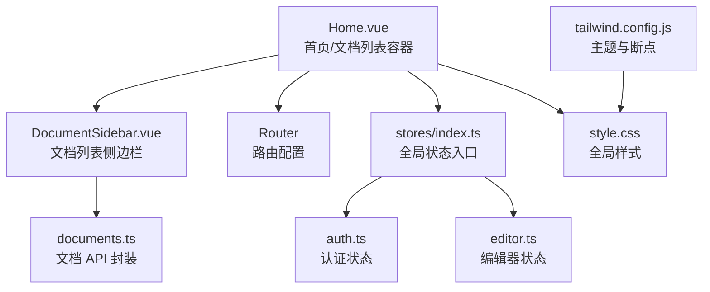
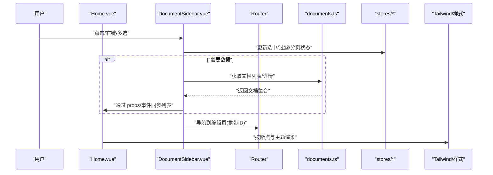
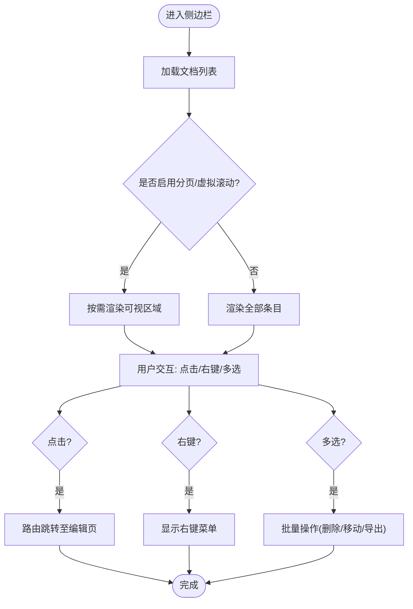
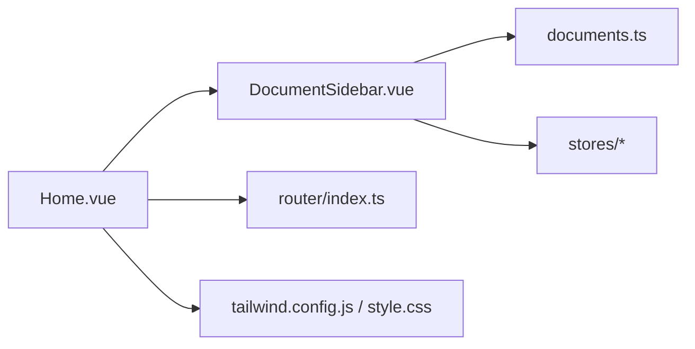

# 文档列表展示

<cite>
**本文档引用的文件**
- [Home.vue](file://src/views/Home.vue)
- [DocumentSidebar.vue](file://src/components/DocumentSidebar.vue)
- [documents.ts](file://src/api/documents.ts)
- [index.ts](file://src/stores/index.ts)
- [auth.ts](file://src/stores/auth.ts)
- [editor.ts](file://src/stores/editor.ts)
- [router/index.ts](file://src/router/index.ts)
- [tailwind.config.js](file://tailwind.config.js)
- [style.css](file://src/style.css)
</cite>

## 目录
1. [简介](#简介)
2. [项目结构](#项目结构)
3. [核心组件](#核心组件)
4. [架构总览](#架构总览)
5. [详细组件分析](#详细组件分析)
6. [依赖关系分析](#依赖关系分析)
7. [性能考虑](#性能考虑)
8. [故障排查指南](#故障排查指南)
9. [结论](#结论)
10. [附录](#附录)

## 简介
本章节面向“文档列表展示”功能，系统性说明其渲染机制、数据绑定与组件结构；阐述文档元数据（标题、创建时间、修改时间等）的展示格式；解释交互能力（点击跳转、右键菜单、批量选择等）；并提供样式定制与响应式设计的实现方案，确保在多种屏幕尺寸下具备良好展示效果。

## 项目结构
该前端工程采用 Vue 单页应用结构，围绕“文档列表”的核心视图位于 views 层，侧边栏与工具栏作为可复用组件位于 components 层，API 调用封装于 api 层，状态管理集中于 stores 层，路由配置在 router 层，样式通过 Tailwind CSS 与全局样式文件组织。

图表来源
- [Home.vue:1-200](file://src/views/Home.vue#L1-L200)
- [DocumentSidebar.vue:1-200](file://src/components/DocumentSidebar.vue#L1-L200)
- [documents.ts:1-200](file://src/api/documents.ts#L1-L200)
- [index.ts:1-100](file://src/stores/index.ts#L1-L100)
- [auth.ts:1-100](file://src/stores/auth.ts#L1-L100)
- [editor.ts:1-100](file://src/stores/editor.ts#L1-L100)
- [tailwind.config.js:1-200](file://tailwind.config.js#L1-L200)
- [style.css:1-200](file://src/style.css#L1-L200)

章节来源
- [Home.vue:1-200](file://src/views/Home.vue#L1-L200)
- [DocumentSidebar.vue:1-200](file://src/components/DocumentSidebar.vue#L1-L200)
- [documents.ts:1-200](file://src/api/documents.ts#L1-L200)
- [index.ts:1-100](file://src/stores/index.ts#L1-L100)
- [auth.ts:1-100](file://src/stores/auth.ts#L1-L100)
- [editor.ts:1-100](file://src/stores/editor.ts#L1-L100)
- [tailwind.config.js:1-200](file://tailwind.config.js#L1-L200)
- [style.css:1-200](file://src/style.css#L1-L200)

## 核心组件
- 文档列表容器：负责页面布局、加载态与错误态处理、触发列表刷新、承载侧边栏与主内容区。
- 文档列表侧边栏：呈现文档条目列表，支持点击跳转、右键菜单、批量选择、搜索过滤、分页或虚拟滚动（视实现而定）。
- 文档 API：提供获取文档列表、查询详情、更新元数据等接口封装。
- 状态管理：集中管理认证、编辑器与可能的文档列表缓存状态，避免重复请求。
- 路由：定义文档列表与编辑页面的路由映射与参数传递。
- 样式系统：基于 Tailwind 的响应式断点与自定义主题变量，统一视觉风格。

章节来源
- [Home.vue:1-200](file://src/views/Home.vue#L1-L200)
- [DocumentSidebar.vue:1-200](file://src/components/DocumentSidebar.vue#L1-L200)
- [documents.ts:1-200](file://src/api/documents.ts#L1-L200)
- [index.ts:1-100](file://src/stores/index.ts#L1-L100)
- [auth.ts:1-100](file://src/stores/auth.ts#L1-L100)
- [editor.ts:1-100](file://src/stores/editor.ts#L1-L100)
- [tailwind.config.js:1-200](file://tailwind.config.js#L1-L200)

## 架构总览
下图展示了从用户操作到数据渲染的整体流程：用户在侧边栏进行点击、右键或批量选择等操作，事件驱动状态更新，必要时调用 API 拉取或更新数据，最终由视图层渲染列表与元数据。

图表来源
- [Home.vue:1-200](file://src/views/Home.vue#L1-L200)
- [DocumentSidebar.vue:1-200](file://src/components/DocumentSidebar.vue#L1-L200)
- [documents.ts:1-200](file://src/api/documents.ts#L1-L200)
- [index.ts:1-100](file://src/stores/index.ts#L1-L100)
- [tailwind.config.js:1-200](file://tailwind.config.js#L1-L200)

## 详细组件分析

### 文档列表容器（Home.vue）
- 职责
  - 组织页面骨架：左侧文档列表、右侧编辑/预览区域。
  - 管理加载与错误状态，提供重试入口。
  - 监听路由变化以切换当前文档。
  - 将全局状态（如认证信息）注入子组件。
- 数据流
  - 从路由参数解析文档 ID，向 API 请求详情并写入本地状态或直接传递给编辑器。
  - 当侧边栏触发刷新时，重新拉取列表。
- 交互
  - 点击列表项触发路由跳转。
  - 支持键盘快捷键（如 Enter 打开、Delete 删除，若已实现）。
- 样式
  - 使用 Tailwind 栅格与间距控制布局，配合全局样式微调。

章节来源
- [Home.vue:1-200](file://src/views/Home.vue#L1-L200)
- [router/index.ts:1-200](file://src/router/index.ts#L1-L200)
- [style.css:1-200](file://src/style.css#L1-L200)

### 文档列表侧边栏（DocumentSidebar.vue）
- 职责
  - 渲染文档列表项，展示标题、创建时间、修改时间等元数据。
  - 提供搜索过滤、排序、分页/无限滚动（可选）。
  - 支持多选模式，便于批量操作（移动、删除、导出等）。
  - 提供右键菜单（新建、重命名、删除、复制、查看属性等）。
- 数据绑定
  - 通过 props 接收文档列表与当前选中项。
  - 通过事件向上抛出选中变更、搜索条件、分页参数等。
  - 与 stores 联动，持久化用户偏好（如每页条数、排序方式）。
- 交互流程
  - 点击：跳转到对应文档编辑页。
  - 右键：显示上下文菜单，执行相应命令。
  - 多选：勾选后批量执行操作，完成后清空选择。
- 性能
  - 长列表建议虚拟滚动或分页加载，减少 DOM 节点数量。
  - 对图片与缩略图做懒加载与占位优化。

图表来源
- [DocumentSidebar.vue:1-200](file://src/components/DocumentSidebar.vue#L1-L200)
- [documents.ts:1-200](file://src/api/documents.ts#L1-L200)

章节来源
- [DocumentSidebar.vue:1-200](file://src/components/DocumentSidebar.vue#L1-L200)
- [documents.ts:1-200](file://src/api/documents.ts#L1-L200)

### 文档 API（documents.ts）
- 职责
  - 封装文档列表、详情、更新等 HTTP 请求。
  - 统一错误处理与重试策略。
  - 提供类型安全的请求/响应数据结构。
- 设计要点
  - 请求拦截器附加认证头。
  - 对分页、排序、过滤参数进行标准化。
  - 对大列表采用增量更新或缓存策略。

章节来源
- [documents.ts:1-200](file://src/api/documents.ts#L1-L200)

### 状态管理（stores/index.ts, auth.ts, editor.ts）
- 职责
  - 集中管理认证状态、编辑器状态以及可能的文档列表缓存。
  - 提供跨组件共享的数据与副作用（如自动保存、防抖）。
- 与列表的关系
  - 认证失败时禁用敏感操作（删除、移动等）。
  - 编辑器状态用于记录最近编辑的文档与草稿。
  - 列表缓存可减少重复请求，提升体验。

章节来源
- [index.ts:1-100](file://src/stores/index.ts#L1-L100)
- [auth.ts:1-100](file://src/stores/auth.ts#L1-L100)
- [editor.ts:1-100](file://src/stores/editor.ts#L1-L100)

### 路由（router/index.ts）
- 职责
  - 定义文档列表与编辑页的路由规则。
  - 通过路由参数传递文档 ID，驱动详情页加载。
- 与列表的关系
  - 列表项点击触发路由跳转。
  - 支持历史回退与书签分享。

章节来源
- [router/index.ts:1-200](file://src/router/index.ts#L1-L200)

## 依赖关系分析
- 组件耦合
  - Home.vue 依赖 DocumentSidebar.vue 与 Router。
  - DocumentSidebar.vue 依赖 documents.ts 与 stores。
- 外部依赖
  - Tailwind CSS 提供响应式与主题能力。
  - 浏览器 API（如 localStorage）用于本地缓存与偏好设置。

图表来源
- [Home.vue:1-200](file://src/views/Home.vue#L1-L200)
- [DocumentSidebar.vue:1-200](file://src/components/DocumentSidebar.vue#L1-L200)
- [documents.ts:1-200](file://src/api/documents.ts#L1-L200)
- [index.ts:1-100](file://src/stores/index.ts#L1-L100)
- [tailwind.config.js:1-200](file://tailwind.config.js#L1-L200)
- [style.css:1-200](file://src/style.css#L1-L200)

章节来源
- [Home.vue:1-200](file://src/views/Home.vue#L1-L200)
- [DocumentSidebar.vue:1-200](file://src/components/DocumentSidebar.vue#L1-L200)
- [documents.ts:1-200](file://src/api/documents.ts#L1-L200)
- [index.ts:1-100](file://src/stores/index.ts#L1-L100)
- [tailwind.config.js:1-200](file://tailwind.config.js#L1-L200)
- [style.css:1-200](file://src/style.css#L1-L200)

## 性能考虑
- 列表渲染
  - 长列表优先采用分页或虚拟滚动，降低首屏渲染压力。
  - 对图片与缩略图启用懒加载与占位图。
- 网络请求
  - 使用请求去重与缓存，避免重复拉取相同列表。
  - 对大响应体进行分片或增量更新。
- 交互优化
  - 右键菜单与多选操作尽量在内存中完成，减少重排。
  - 防抖/节流搜索输入与滚动事件。
- 样式与主题
  - 利用 Tailwind 的响应式断点与原子类，减少自定义 CSS 体积。
  - 通过主题变量统一管理颜色与字号，便于多端适配。

[本节为通用性能建议，不直接分析具体文件]

## 故障排查指南
- 列表为空
  - 检查认证状态是否正确，未登录时可能被拒绝访问。
  - 确认 API 返回结构与字段名是否与前端期望一致。
  - 查看网络面板是否有 4xx/5xx 错误。
- 点击无响应
  - 校验路由参数是否正确传递。
  - 检查事件冒泡与阻止默认行为的位置。
- 右键菜单异常
  - 确认事件绑定目标元素未被覆盖。
  - 检查菜单定位逻辑在不同屏幕下的兼容性。
- 多选失效
  - 检查多选模式开关与状态同步。
  - 验证批量操作的权限与后端接口可用性。
- 样式错乱
  - 核对 Tailwind 断点与自定义样式的优先级。
  - 检查全局样式是否覆盖了组件样式。

章节来源
- [auth.ts:1-100](file://src/stores/auth.ts#L1-L100)
- [documents.ts:1-200](file://src/api/documents.ts#L1-L200)
- [tailwind.config.js:1-200](file://tailwind.config.js#L1-L200)
- [style.css:1-200](file://src/style.css#L1-L200)

## 结论
文档列表展示功能通过清晰的组件分层与状态管理，实现了高效的数据渲染与丰富的交互能力。借助 Tailwind 的响应式体系与统一的样式规范，可在不同设备上保持一致的视觉体验。后续可进一步引入虚拟滚动、服务端分页与更完善的权限控制，以提升大规模文档场景下的性能与安全性。

[本节为总结性内容，不直接分析具体文件]

## 附录

### 元数据展示规范
- 标题：居中或左对齐，突出层级，支持截断与悬停完整显示。
- 创建时间：格式化为用户本地时区，显示相对时间或绝对时间（可配置）。
- 修改时间：与创建时间一致的格式化策略，并在有更新时提供提示。
- 其他字段：如标签、作者、大小等，可按需扩展。

[本节为概念性说明，不直接分析具体文件]

### 交互能力清单
- 点击跳转：进入编辑页，保留上次位置与草稿。
- 右键菜单：新建、重命名、删除、复制、查看属性、移动到分组等。
- 批量选择：全选、反选、范围选择，支持批量删除/移动/导出。
- 搜索与过滤：按标题、标签、时间范围筛选，支持高亮匹配。
- 排序：按更新时间、创建时间、名称排序。

[本节为概念性说明，不直接分析具体文件]

### 样式定制与响应式方案
- 主题变量：通过 Tailwind 配置扩展色板、字号与圆角，统一品牌风格。
- 断点策略：针对手机、平板、桌面分别调整列数、间距与字体大小。
- 可访问性：保证足够的对比度与键盘可达性，提供焦点指示。
- 打印适配：隐藏非必要元素，优化纸张输出。

章节来源
- [tailwind.config.js:1-200](file://tailwind.config.js#L1-L200)
- [style.css:1-200](file://src/style.css#L1-L200)