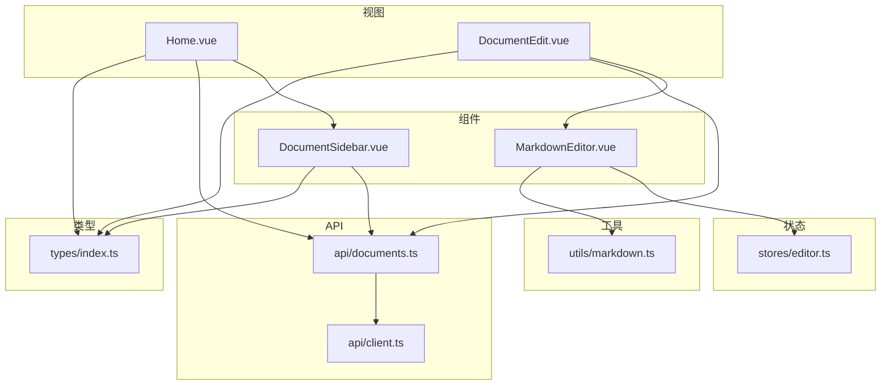
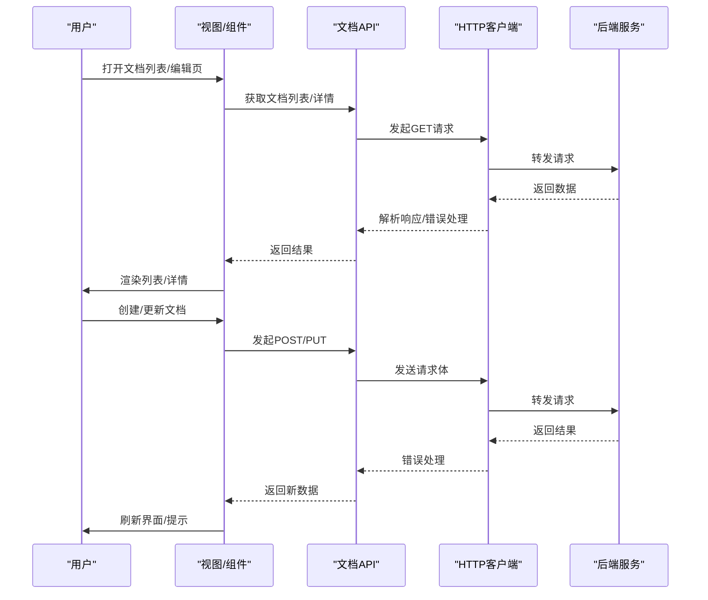
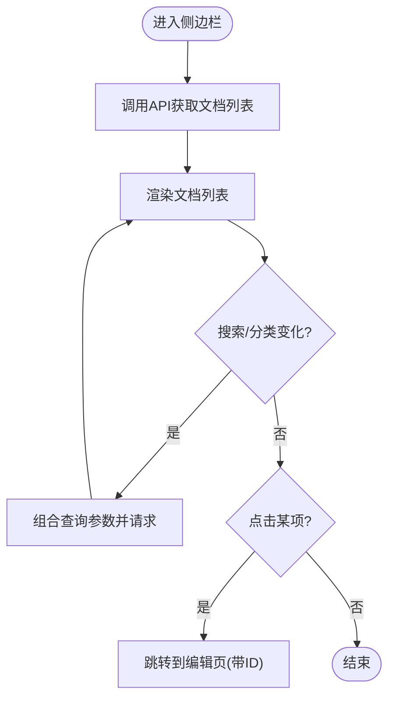
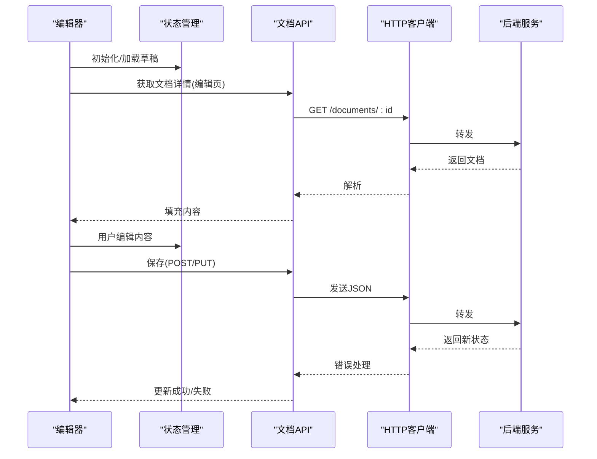
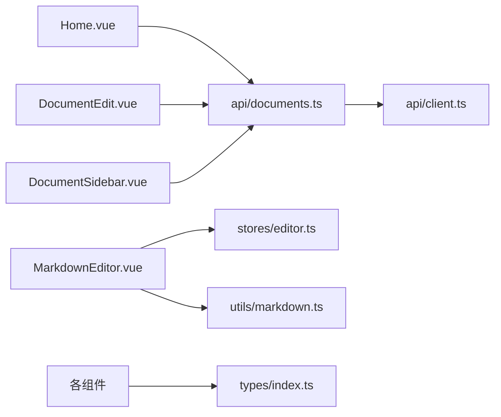

# 文档管理

<cite>
**本文引用的文件**
- [src/api/documents.ts](file://src/api/documents.ts)
- [src/api/client.ts](file://src/api/client.ts)
- [src/components/DocumentSidebar.vue](file://src/components/DocumentSidebar.vue)
- [src/components/MarkdownEditor.vue](file://src/components/MarkdownEditor.vue)
- [src/views/Home.vue](file://src/views/Home.vue)
- [src/views/DocumentEdit.vue](file://src/views/DocumentEdit.vue)
- [src/stores/editor.ts](file://src/stores/editor.ts)
- [src/types/index.ts](file://src/types/index.ts)
- [src/utils/markdown.ts](file://src/utils/markdown.ts)
- [src/router/index.ts](file://src/router/index.ts)
</cite>

## 目录
1. [简介](#简介)
2. [项目结构](#项目结构)
3. [核心组件](#核心组件)
4. [架构总览](#架构总览)
5. [详细组件分析](#详细组件分析)
6. [依赖关系分析](#依赖关系分析)
7. [性能考虑](#性能考虑)
8. [故障排查指南](#故障排查指南)
9. [结论](#结论)
10. [附录：API 接口与使用示例](#附录api-接口与使用示例)

## 简介
本章节概述“文档管理”功能的目标与范围。该功能围绕文档的完整生命周期展开，包括创建、读取、更新、删除（CRUD），并提供文档列表展示、搜索过滤、分类管理等能力。前端通过统一的 HTTP 客户端访问后端 API，结合状态管理与编辑器组件实现数据同步与交互体验。错误处理策略覆盖网络异常、业务校验失败与用户提示等场景。

## 项目结构
本项目采用分层组织方式：
- API 层：封装对后端的请求与响应处理，提供文档相关接口方法。
- 视图层：页面级组件负责路由与页面布局，承载文档列表与编辑页。
- 组件层：侧边栏、编辑器、工具栏等可复用 UI 组件。
- 状态管理：集中管理编辑器内容与状态。
- 类型定义：统一前后端数据结构。
- 工具函数：Markdown 处理、导出、统计、目录生成等。

图表来源
- [src/views/Home.vue](file://src/views/Home.vue)
- [src/views/DocumentEdit.vue](file://src/views/DocumentEdit.vue)
- [src/components/DocumentSidebar.vue](file://src/components/DocumentSidebar.vue)
- [src/components/MarkdownEditor.vue](file://src/components/MarkdownEditor.vue)
- [src/stores/editor.ts](file://src/stores/editor.ts)
- [src/api/documents.ts](file://src/api/documents.ts)
- [src/api/client.ts](file://src/api/client.ts)
- [src/types/index.ts](file://src/types/index.ts)
- [src/utils/markdown.ts](file://src/utils/markdown.ts)

章节来源
- [src/api/documents.ts](file://src/api/documents.ts)
- [src/api/client.ts](file://src/api/client.ts)
- [src/components/DocumentSidebar.vue](file://src/components/DocumentSidebar.vue)
- [src/components/MarkdownEditor.vue](file://src/components/MarkdownEditor.vue)
- [src/views/Home.vue](file://src/views/Home.vue)
- [src/views/DocumentEdit.vue](file://src/views/DocumentEdit.vue)
- [src/stores/editor.ts](file://src/stores/editor.ts)
- [src/types/index.ts](file://src/types/index.ts)
- [src/utils/markdown.ts](file://src/utils/markdown.ts)
- [src/router/index.ts](file://src/router/index.ts)

## 核心组件
- 文档侧边栏：负责文档列表渲染、搜索过滤、分类筛选、新建与跳转编辑。
- Markdown 编辑器：承载文档内容编辑、实时预览、本地草稿保存、导出与统计。
- 首页：聚合文档列表与导航入口。
- 编辑页：承载编辑器与文档元数据操作（标题、分类、保存）。
- API 客户端：统一封装 HTTP 请求、错误处理与重试策略。
- 文档 API：按资源维度暴露 CRUD 方法。
- 类型定义：约束文档、分类、查询参数等数据结构。
- 工具函数：Markdown 解析、目录生成、导出等。

章节来源
- [src/components/DocumentSidebar.vue](file://src/components/DocumentSidebar.vue)
- [src/components/MarkdownEditor.vue](file://src/components/MarkdownEditor.vue)
- [src/views/Home.vue](file://src/views/Home.vue)
- [src/views/DocumentEdit.vue](file://src/views/DocumentEdit.vue)
- [src/api/documents.ts](file://src/api/documents.ts)
- [src/api/client.ts](file://src/api/client.ts)
- [src/types/index.ts](file://src/types/index.ts)
- [src/utils/markdown.ts](file://src/utils/markdown.ts)

## 架构总览
文档管理的整体流程如下：用户在侧边栏或首页进行文档操作，触发对应 API 调用；API 层通过统一客户端发起 HTTP 请求并处理响应；编辑器与状态管理协同完成内容同步与持久化；工具函数辅助 Markdown 处理与导出。

图表来源
- [src/api/documents.ts](file://src/api/documents.ts)
- [src/api/client.ts](file://src/api/client.ts)
- [src/components/DocumentSidebar.vue](file://src/components/DocumentSidebar.vue)
- [src/components/MarkdownEditor.vue](file://src/components/MarkdownEditor.vue)
- [src/views/Home.vue](file://src/views/Home.vue)
- [src/views/DocumentEdit.vue](file://src/views/DocumentEdit.vue)

## 详细组件分析

### 文档侧边栏（列表、搜索、分类）
- 职责：加载文档列表、支持关键词搜索与分类筛选、新建文档、跳转到编辑页。
- 数据流：从 API 层拉取列表，根据输入条件组合查询参数，渲染结果；选择条目后携带 ID 进入编辑页。
- 交互：搜索框变更触发防抖查询；分类下拉切换重新拉取列表；新建按钮调用创建接口并跳转。
- 错误处理：网络异常时显示提示；空结果给出友好文案。

图表来源
- [src/components/DocumentSidebar.vue](file://src/components/DocumentSidebar.vue)
- [src/api/documents.ts](file://src/api/documents.ts)

章节来源
- [src/components/DocumentSidebar.vue](file://src/components/DocumentSidebar.vue)
- [src/api/documents.ts](file://src/api/documents.ts)

### Markdown 编辑器（编辑、保存、导出）
- 职责：编辑文档正文、实时预览、本地草稿保存、导出为多种格式、统计字数/阅读时长。
- 数据流：从编辑页传入文档 ID 与初始内容；编辑器内部维护草稿；保存时调用更新接口；导出调用工具函数。
- 交互：自动保存开关控制是否定时提交；导出菜单触发不同格式输出；统计面板实时更新。
- 错误处理：保存失败回滚到上次成功版本；导出失败提示原因。

图表来源
- [src/components/MarkdownEditor.vue](file://src/components/MarkdownEditor.vue)
- [src/stores/editor.ts](file://src/stores/editor.ts)
- [src/api/documents.ts](file://src/api/documents.ts)
- [src/api/client.ts](file://src/api/client.ts)

章节来源
- [src/components/MarkdownEditor.vue](file://src/components/MarkdownEditor.vue)
- [src/stores/editor.ts](file://src/stores/editor.ts)
- [src/api/documents.ts](file://src/api/documents.ts)
- [src/api/client.ts](file://src/api/client.ts)

### 首页（文档入口）
- 职责：作为入口聚合文档列表与导航；可快速创建新文档。
- 数据流：加载列表，渲染卡片；点击跳转至编辑页或侧边栏。
- 错误处理：加载失败时重试或提示。

章节来源
- [src/views/Home.vue](file://src/views/Home.vue)
- [src/router/index.ts](file://src/router/index.ts)

### 编辑页（文档详情与元数据）
- 职责：承载编辑器，管理文档标题、分类等元数据；触发保存与删除。
- 数据流：根据路由参数获取文档 ID，调用 API 获取详情；保存时提交元数据与内容；删除确认后调用删除接口。
- 错误处理：权限不足或不存在时提示；删除二次确认。

章节来源
- [src/views/DocumentEdit.vue](file://src/views/DocumentEdit.vue)
- [src/api/documents.ts](file://src/api/documents.ts)

### API 层（文档 CRUD）
- 职责：封装文档资源的增删改查方法，统一错误处理与响应转换。
- 设计：以资源为中心的方法命名；参数与返回值遵循类型定义；对网络错误进行捕获与提示。
- 扩展点：可按需增加批量操作、版本历史、标签等接口。

章节来源
- [src/api/documents.ts](file://src/api/documents.ts)
- [src/api/client.ts](file://src/api/client.ts)
- [src/types/index.ts](file://src/types/index.ts)

### 类型定义（数据结构）
- 职责：定义文档、分类、查询参数、响应结构等类型，保证前后端一致性。
- 关键点：字段命名、必填项、枚举值、可选字段；便于编辑器与列表组件强类型约束。

章节来源
- [src/types/index.ts](file://src/types/index.ts)

### 工具函数（Markdown 处理）
- 职责：Markdown 解析、目录生成、导出、统计等。
- 使用场景：编辑器预览、导出菜单、统计面板。

章节来源
- [src/utils/markdown.ts](file://src/utils/markdown.ts)

## 依赖关系分析
- 视图与组件依赖 API 层进行数据交互。
- 编辑器依赖状态管理存储草稿与配置。
- 工具函数被编辑器与导出功能复用。
- 类型定义贯穿各层，确保数据结构一致。

图表来源
- [src/views/Home.vue](file://src/views/Home.vue)
- [src/views/DocumentEdit.vue](file://src/views/DocumentEdit.vue)
- [src/components/DocumentSidebar.vue](file://src/components/DocumentSidebar.vue)
- [src/components/MarkdownEditor.vue](file://src/components/MarkdownEditor.vue)
- [src/stores/editor.ts](file://src/stores/editor.ts)
- [src/api/documents.ts](file://src/api/documents.ts)
- [src/api/client.ts](file://src/api/client.ts)
- [src/types/index.ts](file://src/types/index.ts)
- [src/utils/markdown.ts](file://src/utils/markdown.ts)

章节来源
- [src/api/documents.ts](file://src/api/documents.ts)
- [src/api/client.ts](file://src/api/client.ts)
- [src/components/DocumentSidebar.vue](file://src/components/DocumentSidebar.vue)
- [src/components/MarkdownEditor.vue](file://src/components/MarkdownEditor.vue)
- [src/views/Home.vue](file://src/views/Home.vue)
- [src/views/DocumentEdit.vue](file://src/views/DocumentEdit.vue)
- [src/stores/editor.ts](file://src/stores/editor.ts)
- [src/types/index.ts](file://src/types/index.ts)
- [src/utils/markdown.ts](file://src/utils/markdown.ts)

## 性能考虑
- 列表分页与懒加载：避免一次性加载大量文档导致卡顿。
- 搜索防抖：减少频繁请求，提升响应速度。
- 编辑器本地草稿：降低网络压力，支持离线编辑。
- 增量更新：仅更新变化的字段，减少全量刷新。
- 缓存策略：对静态资源与常用列表做短期缓存。
- 导出优化：大文档分块导出，避免主线程阻塞。

## 故障排查指南
- 网络错误：检查客户端基础 URL、跨域配置、鉴权头；查看请求日志与响应码。
- 业务错误：根据返回的错误码定位问题（如权限不足、资源不存在、校验失败）。
- 编辑器异常：检查本地草稿是否损坏；尝试清空草稿恢复；验证 Markdown 语法。
- 列表不更新：确认 API 返回结构与类型定义一致；检查状态管理是否正确合并数据。
- 导出失败：检查浏览器权限与下载限制；尝试其他格式。

章节来源
- [src/api/client.ts](file://src/api/client.ts)
- [src/components/MarkdownEditor.vue](file://src/components/MarkdownEditor.vue)
- [src/components/DocumentSidebar.vue](file://src/components/DocumentSidebar.vue)

## 结论
文档管理功能通过清晰的层次划分与职责分离，实现了完整的 CRUD 流程与良好的用户体验。API 层统一封装请求与错误处理，组件层专注交互与渲染，状态管理与工具函数提升可维护性与复用性。建议在生产环境完善分页、缓存与监控指标，进一步提升稳定性与性能。

## 附录：API 接口与使用示例
以下列出文档相关的核心接口与方法，供开发者参考与集成。实际路径与字段以类型定义为准。

- 获取文档列表
  - 方法：GET
  - 路径：/api/documents
  - 查询参数：关键词、分类、分页、排序
  - 响应：文档数组、总数、分页信息
  - 使用示例：在侧边栏加载列表时调用，支持搜索与分类筛选

- 获取文档详情
  - 方法：GET
  - 路径：/api/documents/:id
  - 响应：文档对象（含标题、分类、内容、时间戳等）
  - 使用示例：编辑页根据路由参数加载详情

- 创建文档
  - 方法：POST
  - 路径：/api/documents
  - 请求体：标题、分类、初始内容
  - 响应：新建文档对象
  - 使用示例：侧边栏新建按钮触发，成功后跳转编辑页

- 更新文档
  - 方法：PUT
  - 路径：/api/documents/:id
  - 请求体：标题、分类、内容等可更新字段
  - 响应：更新后的文档对象
  - 使用示例：编辑器保存按钮触发，支持增量或全量更新

- 删除文档
  - 方法：DELETE
  - 路径：/api/documents/:id
  - 响应：成功标志或空体
  - 使用示例：编辑页删除按钮，二次确认后调用

- 搜索与过滤
  - 方法：GET
  - 路径：/api/documents
  - 查询参数：关键词、分类、分页
  - 使用示例：侧边栏搜索框与分类下拉联动

- 错误处理约定
  - 网络异常：统一捕获并提示“网络连接失败，请重试”
  - 业务错误：根据错误码提示具体原因（如“权限不足”、“文档不存在”）
  - 校验失败：返回字段级错误信息，编辑器高亮提示

章节来源
- [src/api/documents.ts](file://src/api/documents.ts)
- [src/api/client.ts](file://src/api/client.ts)
- [src/types/index.ts](file://src/types/index.ts)
- [src/components/DocumentSidebar.vue](file://src/components/DocumentSidebar.vue)
- [src/components/MarkdownEditor.vue](file://src/components/MarkdownEditor.vue)
- [src/views/DocumentEdit.vue](file://src/views/DocumentEdit.vue)
- [src/views/Home.vue](file://src/views/Home.vue)