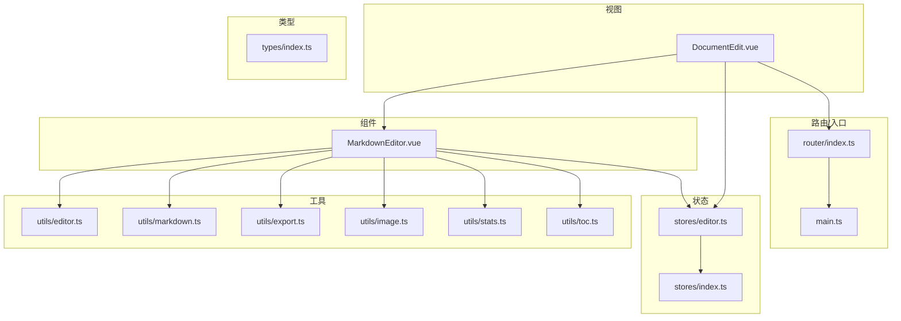
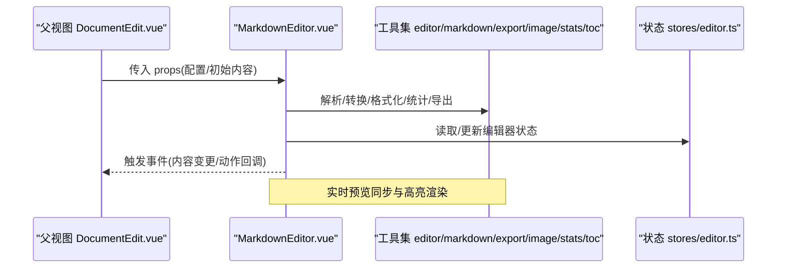
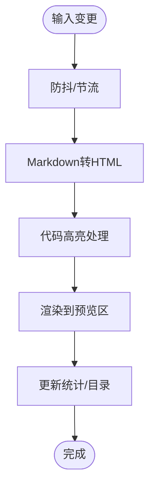
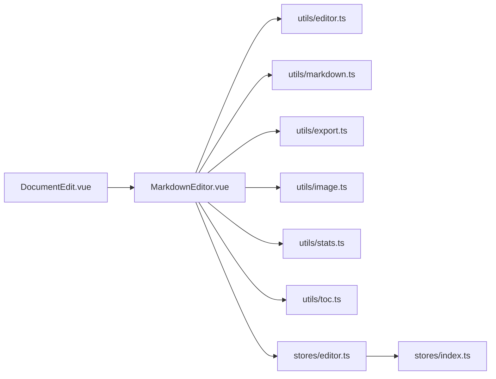

# Markdown编辑器组件

<cite>
**本文引用的文件**
- [MarkdownEditor.vue](file://src/components/MarkdownEditor.vue)
- [DocumentEdit.vue](file://src/views/DocumentEdit.vue)
- [editor.ts](file://src/utils/editor.ts)
- [markdown.ts](file://src/utils/markdown.ts)
- [export.ts](file://src/utils/export.ts)
- [image.ts](file://src/utils/image.ts)
- [stats.ts](file://src/utils/stats.ts)
- [toc.ts](file://src/utils/toc.ts)
- [index.ts](file://src/types/index.ts)
- [store/editor.ts](file://src/stores/editor.ts)
- [stores/index.ts](file://src/stores/index.ts)
- [router/index.ts](file://src/router/index.ts)
- [App.vue](file://src/App.vue)
- [main.ts](file://src/main.ts)
</cite>

## 目录
1. [简介](#简介)
2. [项目结构](#项目结构)
3. [核心组件](#核心组件)
4. [架构总览](#架构总览)
5. [详细组件分析](#详细组件分析)
6. [依赖关系分析](#依赖关系分析)
7. [性能考虑](#性能考虑)
8. [故障排查指南](#故障排查指南)
9. [结论](#结论)
10. [附录](#附录)

## 简介
本文件面向Markdown编辑器组件的开发者与使用者，系统性说明基于Vue 3 Composition API实现的MarkdownEditor.vue组件。文档涵盖响应式数据绑定、事件处理机制、实时预览同步、语法高亮渲染、内容验证与格式化、props接口设计、事件发射、插槽使用方式、配置选项与扩展方法，以及性能优化策略与最佳实践。目标是帮助读者快速理解并高效使用该组件，同时具备二次开发与定制的能力。

## 项目结构
本项目采用典型的Vue 3 + TypeScript工程结构：
- 组件层：位于src/components，包含MarkdownEditor.vue等UI组件
- 视图层：位于src/views，页面级组合与路由入口
- 工具层：位于src/utils，提供编辑器辅助能力（编辑、Markdown转换、导出、图片、统计、目录）
- 状态管理：位于src/stores，集中管理应用状态（如编辑器状态）
- 类型定义：位于src/types，统一类型声明
- 路由与入口：src/router与src/main.ts负责路由与初始化

图表来源
- [MarkdownEditor.vue](file://src/components/MarkdownEditor.vue)
- [DocumentEdit.vue](file://src/views/DocumentEdit.vue)
- [editor.ts](file://src/utils/editor.ts)
- [markdown.ts](file://src/utils/markdown.ts)
- [export.ts](file://src/utils/export.ts)
- [image.ts](file://src/utils/image.ts)
- [stats.ts](file://src/utils/stats.ts)
- [toc.ts](file://src/utils/toc.ts)
- [store/editor.ts](file://src/stores/editor.ts)
- [stores/index.ts](file://src/stores/index.ts)
- [router/index.ts](file://src/router/index.ts)
- [main.ts](file://src/main.ts)

章节来源
- [MarkdownEditor.vue](file://src/components/MarkdownEditor.vue)
- [DocumentEdit.vue](file://src/views/DocumentEdit.vue)
- [editor.ts](file://src/utils/editor.ts)
- [markdown.ts](file://src/utils/markdown.ts)
- [export.ts](file://src/utils/export.ts)
- [image.ts](file://src/utils/image.ts)
- [stats.ts](file://src/utils/stats.ts)
- [toc.ts](file://src/utils/toc.ts)
- [index.ts](file://src/types/index.ts)
- [store/editor.ts](file://src/stores/editor.ts)
- [stores/index.ts](file://src/stores/index.ts)
- [router/index.ts](file://src/router/index.ts)
- [main.ts](file://src/main.ts)

## 核心组件
MarkdownEditor.vue是本次文档的核心，承担以下职责：
- 基于Vue 3 Composition API组织逻辑，使用ref/reactive管理编辑内容与状态
- 实现编辑区与预览区的实时同步
- 集成语法高亮与Markdown渲染
- 提供内容校验、格式化、导出、统计、目录生成等能力
- 通过props接收配置项，通过事件向父组件暴露变更与动作回调
- 支持插槽以扩展工具栏或附加功能

章节来源
- [MarkdownEditor.vue](file://src/components/MarkdownEditor.vue)

## 架构总览
下图展示了Markdown编辑器在应用中的交互流程：父视图通过props将配置传入编辑器，编辑器内部调用工具函数完成渲染、统计、导出等操作，并通过事件将用户操作与内容变更回传给父视图；状态管理模块用于跨组件共享编辑器相关状态。

图表来源
- [DocumentEdit.vue](file://src/views/DocumentEdit.vue)
- [MarkdownEditor.vue](file://src/components/MarkdownEditor.vue)
- [editor.ts](file://src/utils/editor.ts)
- [markdown.ts](file://src/utils/markdown.ts)
- [export.ts](file://src/utils/export.ts)
- [image.ts](file://src/utils/image.ts)
- [stats.ts](file://src/utils/stats.ts)
- [toc.ts](file://src/utils/toc.ts)
- [store/editor.ts](file://src/stores/editor.ts)

## 详细组件分析

### 组件API与接口设计
- Props（建议）
  - content: 字符串，双向绑定的编辑内容
  - options: 对象，控制行为开关（如是否启用预览、高亮、自动保存、字数限制等）
  - placeholder: 占位文本
  - readonly: 是否只读
  - theme: 主题或样式类名
  - maxHeight/maxWidth: 布局尺寸约束
- Emits（建议）
  - update:content: 内容变更时触发
  - save: 保存动作
  - format: 格式化动作
  - export: 导出动作
  - validate: 校验结果
  - stats: 统计信息
  - toc: 目录信息
- Slots（建议）
  - toolbar: 自定义工具栏区域
  - preview-header/footer: 预览区头部/尾部
  - extra: 额外功能区

章节来源
- [MarkdownEditor.vue](file://src/components/MarkdownEditor.vue)
- [index.ts](file://src/types/index.ts)

### 响应式数据与生命周期
- 使用ref/reactive维护编辑内容、预览HTML、统计信息、目录、错误信息等
- 使用watch/computed实现：
  - 内容变化驱动预览更新
  - 计算统计指标（字数、行数、段落数等）
  - 根据配置动态切换功能开关
- 使用onMounted/onUnmounted进行初始化与资源清理（如订阅、定时器、第三方实例销毁）

章节来源
- [MarkdownEditor.vue](file://src/components/MarkdownEditor.vue)

### 实时预览同步与语法高亮
- 实时预览：监听内容变化，调用Markdown转换工具生成HTML，注入预览容器
- 语法高亮：在预览前对代码块进行标记，或使用高亮库渲染
- 防抖/节流：对高频输入进行节流，避免频繁重渲染导致卡顿
- 滚动同步：可选地实现编辑区与预览区滚动联动

图表来源
- [markdown.ts](file://src/utils/markdown.ts)
- [stats.ts](file://src/utils/stats.ts)
- [toc.ts](file://src/utils/toc.ts)

章节来源
- [markdown.ts](file://src/utils/markdown.ts)
- [stats.ts](file://src/utils/stats.ts)
- [toc.ts](file://src/utils/toc.ts)

### 内容验证与格式化
- 验证：
  - 长度限制（最大字符数）
  - 必填字段检查（如标题、正文）
  - 非法内容过滤（如危险标签/脚本）
- 格式化：
  - 统一换行、缩进、空格
  - 代码块语言标注
  - 链接与图片规范化
- 错误提示：
  - 在编辑器内或外部显示校验失败原因
  - 阻止非法提交

章节来源
- [editor.ts](file://src/utils/editor.ts)
- [markdown.ts](file://src/utils/markdown.ts)

### 导出与图片处理
- 导出：
  - 支持导出为PDF/HTML/Markdown等格式
  - 可配置文件名、模板、样式覆盖
- 图片：
  - 支持粘贴/拖拽上传
  - 本地预览与压缩
  - 路径替换与CDN适配

章节来源
- [export.ts](file://src/utils/export.ts)
- [image.ts](file://src/utils/image.ts)

### 统计与目录
- 统计：
  - 字数、行数、段落数、代码块数量、图片数量
  - 阅读时长估算
- 目录：
  - 从标题层级生成目录树
  - 点击跳转至对应锚点

章节来源
- [stats.ts](file://src/utils/stats.ts)
- [toc.ts](file://src/utils/toc.ts)

### 事件处理机制
- 内容变更：update:content
- 动作触发：save/format/export/validate
- 数据输出：stats/toc
- 父组件可通过v-on监听这些事件，执行持久化、校验、导航等逻辑

章节来源
- [MarkdownEditor.vue](file://src/components/MarkdownEditor.vue)
- [DocumentEdit.vue](file://src/views/DocumentEdit.vue)

### 插槽使用方式
- 工具栏插槽：插入自定义按钮或控件
- 预览区头尾插槽：插入版权信息、下载按钮等
- 扩展插槽：插入侧边栏、设置面板等

章节来源
- [MarkdownEditor.vue](file://src/components/MarkdownEditor.vue)

### 与状态管理的集成
- 编辑器状态（如草稿、最后修改时间、统计摘要）可存入全局store，便于跨页面共享
- 编辑器组件通过actions读写store，减少重复逻辑

章节来源
- [store/editor.ts](file://src/stores/editor.ts)
- [stores/index.ts](file://src/stores/index.ts)

## 依赖关系分析
MarkdownEditor.vue依赖多个工具模块与状态管理，形成清晰的分层：
- 视图层：DocumentEdit.vue组合页面逻辑
- 组件层：MarkdownEditor.vue封装编辑器能力
- 工具层：editor/markdown/export/image/stats/toc提供具体能力
- 状态层：stores/editor.ts集中管理编辑器状态
- 类型层：types/index.ts统一类型定义

图表来源
- [DocumentEdit.vue](file://src/views/DocumentEdit.vue)
- [MarkdownEditor.vue](file://src/components/MarkdownEditor.vue)
- [editor.ts](file://src/utils/editor.ts)
- [markdown.ts](file://src/utils/markdown.ts)
- [export.ts](file://src/utils/export.ts)
- [image.ts](file://src/utils/image.ts)
- [stats.ts](file://src/utils/stats.ts)
- [toc.ts](file://src/utils/toc.ts)
- [store/editor.ts](file://src/stores/editor.ts)
- [stores/index.ts](file://src/stores/index.ts)

章节来源
- [MarkdownEditor.vue](file://src/components/MarkdownEditor.vue)
- [DocumentEdit.vue](file://src/views/DocumentEdit.vue)
- [editor.ts](file://src/utils/editor.ts)
- [markdown.ts](file://src/utils/markdown.ts)
- [export.ts](file://src/utils/export.ts)
- [image.ts](file://src/utils/image.ts)
- [stats.ts](file://src/utils/stats.ts)
- [toc.ts](file://src/utils/toc.ts)
- [store/editor.ts](file://src/stores/editor.ts)
- [stores/index.ts](file://src/stores/index.ts)

## 性能考虑
- 输入防抖/节流：降低预览渲染频率，避免长列表或复杂Markdown导致的卡顿
- 增量渲染：仅更新变更部分，避免整页重绘
- 虚拟滚动：当预览内容过长时，按需渲染可见区域
- 懒加载：非首屏功能（如导出、统计）延迟初始化
- 内存管理：及时释放第三方库实例、移除事件监听器
- 缓存策略：对静态资源或计算结果进行缓存（如目录树、统计摘要）
- 主题与样式：避免过度嵌套与复杂选择器，提升渲染性能

[本节为通用指导，不直接分析具体文件]

## 故障排查指南
- 预览不更新
  - 检查内容变更事件是否正确触发
  - 确认Markdown转换工具是否返回有效HTML
  - 查看是否有异常抛出被吞掉
- 高亮失效
  - 确认代码块语言标注正确
  - 检查高亮库是否成功加载
- 导出失败
  - 检查导出参数与模板配置
  - 查看浏览器权限与下载拦截
- 图片无法显示
  - 检查路径与CDN配置
  - 确认网络请求与跨域策略
- 统计不准确
  - 检查正则匹配规则
  - 确认是否包含隐藏内容（如注释、脚本）

章节来源
- [editor.ts](file://src/utils/editor.ts)
- [markdown.ts](file://src/utils/markdown.ts)
- [export.ts](file://src/utils/export.ts)
- [image.ts](file://src/utils/image.ts)
- [stats.ts](file://src/utils/stats.ts)
- [toc.ts](file://src/utils/toc.ts)

## 结论
MarkdownEditor.vue通过Vue 3 Composition API实现了模块化、可配置的Markdown编辑体验。借助工具层的解耦设计与状态管理的集中化，组件具备良好的扩展性与可维护性。遵循本文的性能优化与最佳实践，可在大型项目中稳定运行并提供流畅的用户体验。

[本节为总结性内容，不直接分析具体文件]

## 附录

### 配置选项参考
- 基础配置
  - content: 初始内容
  - placeholder: 占位文本
  - readonly: 只读模式
  - theme: 主题类名
- 功能开关
  - enablePreview: 是否启用预览
  - enableHighlight: 是否启用高亮
  - enableAutoSave: 是否自动保存
  - enableStats: 是否显示统计
  - enableToc: 是否生成目录
  - enableExport: 是否允许导出
- 行为控制
  - debounceMs: 防抖间隔
  - maxLength: 最大字符数
  - lineWrapping: 是否自动换行
  - tabSize: Tab宽度
  - indentWithTabs: 是否使用Tab缩进

章节来源
- [MarkdownEditor.vue](file://src/components/MarkdownEditor.vue)
- [index.ts](file://src/types/index.ts)

### 使用示例（步骤说明）
- 引入组件并在页面中使用
- 通过v-model绑定内容
- 监听事件处理保存、导出、校验等逻辑
- 通过插槽扩展工具栏或预览区
- 通过props调整行为与样式

章节来源
- [DocumentEdit.vue](file://src/views/DocumentEdit.vue)
- [MarkdownEditor.vue](file://src/components/MarkdownEditor.vue)

### 事件与插槽清单
- 事件
  - update:content、save、format、export、validate、stats、toc
- 插槽
  - toolbar、preview-header、preview-footer、extra

章节来源
- [MarkdownEditor.vue](file://src/components/MarkdownEditor.vue)

### 与路由和入口的关系
- 路由负责导航到编辑页面
- 入口文件初始化应用与全局配置

章节来源
- [router/index.ts](file://src/router/index.ts)
- [main.ts](file://src/main.ts)
- [App.vue](file://src/App.vue)