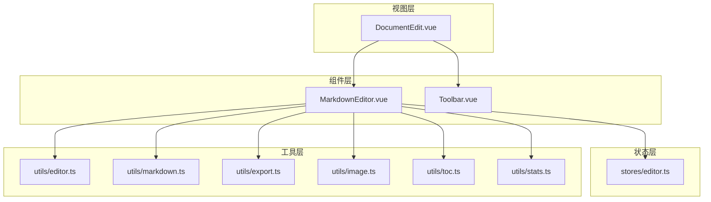
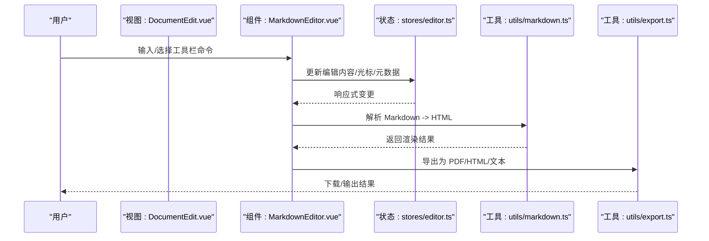
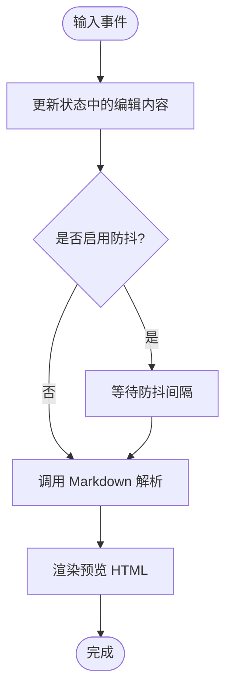
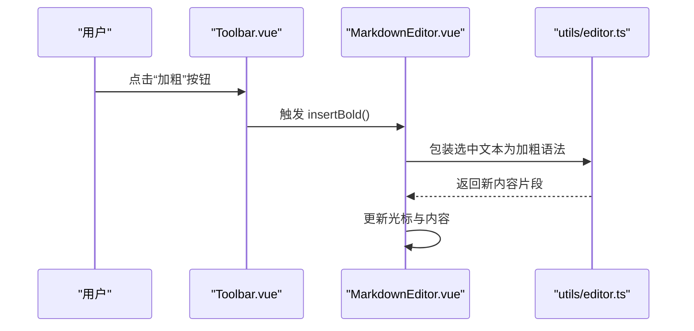
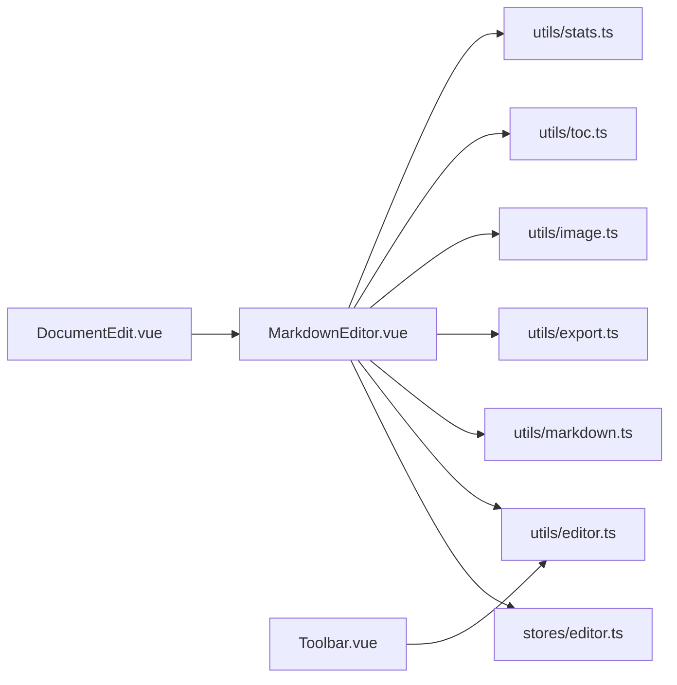

# 文档编辑器

<cite>
**本文引用的文件**
- [MarkdownEditor.vue](file://src/components/MarkdownEditor.vue)
- [Toolbar.vue](file://src/components/Toolbar.vue)
- [DocumentEdit.vue](file://src/views/DocumentEdit.vue)
- [editor.ts](file://src/utils/editor.ts)
- [markdown.ts](file://src/utils/markdown.ts)
- [export.ts](file://src/utils/export.ts)
- [image.ts](file://src/utils/image.ts)
- [toc.ts](file://src/utils/toc.ts)
- [stats.ts](file://src/utils/stats.ts)
- [editor.ts](file://src/stores/editor.ts)
- [index.ts](file://src/types/index.ts)
- [main.ts](file://src/main.ts)
- [package.json](file://package.json)
</cite>

## 目录
1. [简介](#简介)
2. [项目结构](#项目结构)
3. [核心组件](#核心组件)
4. [架构总览](#架构总览)
5. [详细组件分析](#详细组件分析)
6. [依赖关系分析](#依赖关系分析)
7. [性能考虑](#性能考虑)
8. [故障排查指南](#故障排查指南)
9. [结论](#结论)
10. [附录：配置与扩展](#附录：配置与扩展)

## 简介
本仓库实现了一个基于 Vue 的 Markdown 文档编辑器，提供实时预览、语法高亮、工具栏操作、快捷键支持、导出与统计等功能。编辑器通过状态管理集中维护编辑内容、预览内容与元数据，结合工具函数完成 Markdown 解析、目录生成、图片处理与导出等能力。本文档面向开发者，帮助理解编辑器的工作原理、数据流、事件处理、性能优化策略，以及如何配置和扩展编辑器行为。

## 项目结构
项目采用按功能域划分的目录组织方式：
- components：UI 组件（编辑器主体、工具栏、侧边栏）
- views：页面级视图（文档编辑页、登录注册等）
- stores：全局状态（编辑器状态、认证状态）
- utils：通用工具（编辑器辅助、Markdown 处理、导出、图片、目录、统计）
- types：类型定义
- api：接口封装
- main.ts：应用入口与插件初始化

**图表来源**
- [DocumentEdit.vue:1-200](file://src/views/DocumentEdit.vue#L1-L200)
- [MarkdownEditor.vue:1-200](file://src/components/MarkdownEditor.vue#L1-L200)
- [Toolbar.vue:1-200](file://src/components/Toolbar.vue#L1-L200)
- [editor.ts:1-200](file://src/stores/editor.ts#L1-L200)
- [editor.ts:1-200](file://src/utils/editor.ts#L1-L200)
- [markdown.ts:1-200](file://src/utils/markdown.ts#L1-L200)
- [export.ts:1-200](file://src/utils/export.ts#L1-L200)
- [image.ts:1-200](file://src/utils/image.ts#L1-L200)
- [toc.ts:1-200](file://src/utils/toc.ts#L1-L200)
- [stats.ts:1-200](file://src/utils/stats.ts#L1-L200)

**章节来源**
- [main.ts:1-200](file://src/main.ts#L1-L200)
- [package.json:1-200](file://package.json#L1-L200)

## 核心组件
- MarkdownEditor.vue：编辑器主容器，负责渲染编辑区与预览区、同步内容、绑定工具栏命令、处理快捷键、调用工具函数进行解析与导出。
- Toolbar.vue：工具栏按钮集合，触发插入标题、加粗、斜体、列表、链接、图片、代码块等命令，并可通过回调或事件与编辑器交互。
- DocumentEdit.vue：页面级视图，组合编辑器与工具栏，承载路由参数与文档上下文，驱动保存/加载流程。

这些组件通过 stores/editor.ts 共享编辑状态，并通过 utils/* 工具模块完成具体业务逻辑。

**章节来源**
- [MarkdownEditor.vue:1-200](file://src/components/MarkdownEditor.vue#L1-L200)
- [Toolbar.vue:1-200](file://src/components/Toolbar.vue#L1-L200)
- [DocumentEdit.vue:1-200](file://src/views/DocumentEdit.vue#L1-L200)

## 架构总览
编辑器采用“视图-状态-工具”的分层架构：
- 视图层：Vue 组件负责 UI 渲染与用户交互
- 状态层：Pinia store 集中管理编辑内容、预览内容、光标位置、统计信息等
- 工具层：纯函数或轻量服务，负责 Markdown 解析、目录生成、导出、图片处理、统计计算等

**图表来源**
- [DocumentEdit.vue:1-200](file://src/views/DocumentEdit.vue#L1-L200)
- [MarkdownEditor.vue:1-200](file://src/components/MarkdownEditor.vue#L1-L200)
- [editor.ts:1-200](file://src/stores/editor.ts#L1-L200)
- [markdown.ts:1-200](file://src/utils/markdown.ts#L1-L200)
- [export.ts:1-200](file://src/utils/export.ts#L1-L200)

## 详细组件分析

### MarkdownEditor 组件
职责：
- 渲染双栏布局（编辑区 + 预览区）
- 监听输入事件，将内容写入状态并触发预览更新
- 绑定工具栏命令到编辑器操作（插入、替换、跳转等）
- 处理快捷键（如 Ctrl+B 加粗、Ctrl+I 斜体、Ctrl+K 链接等）
- 调用工具函数完成 Markdown 解析、目录生成、统计、导出

关键流程（输入到预览）：

**图表来源**
- [MarkdownEditor.vue:1-200](file://src/components/MarkdownEditor.vue#L1-L200)
- [markdown.ts:1-200](file://src/utils/markdown.ts#L1-L200)

**章节来源**
- [MarkdownEditor.vue:1-200](file://src/components/MarkdownEditor.vue#L1-L200)
- [editor.ts:1-200](file://src/utils/editor.ts#L1-L200)
- [markdown.ts:1-200](file://src/utils/markdown.ts#L1-L200)

### Toolbar 组件
职责：
- 提供常用编辑命令按钮（标题、加粗、斜体、列表、链接、图片、代码块、引用等）
- 通过回调或事件向 MarkdownEditor 发送命令
- 可选：根据当前选中内容动态切换按钮状态

典型交互序列：

**图表来源**
- [Toolbar.vue:1-200](file://src/components/Toolbar.vue#L1-L200)
- [MarkdownEditor.vue:1-200](file://src/components/MarkdownEditor.vue#L1-L200)
- [editor.ts:1-200](file://src/utils/editor.ts#L1-L200)

**章节来源**
- [Toolbar.vue:1-200](file://src/components/Toolbar.vue#L1-L200)
- [editor.ts:1-200](file://src/utils/editor.ts#L1-L200)

### DocumentEdit 页面
职责：
- 组装 MarkdownEditor 与 Toolbar
- 管理文档上下文（ID、标题、作者等）
- 触发保存/加载、导出等操作
- 与 API 层集成（如需持久化）

**章节来源**
- [DocumentEdit.vue:1-200](file://src/views/DocumentEdit.vue#L1-L200)

### 状态管理（stores/editor.ts）
职责：
- 维护编辑内容、预览内容、光标位置、统计信息、目录等
- 暴露方法用于更新内容、重置、导出、统计等
- 与组件双向绑定，保证响应式更新

典型数据结构（概念性说明）：
- content: 字符串（原始 Markdown）
- preview: 字符串（渲染后的 HTML）
- cursor: 对象（行、列）
- stats: 对象（字数、行数、段落数等）
- toc: 数组（目录项）

**章节来源**
- [editor.ts:1-200](file://src/stores/editor.ts#L1-L200)
- [index.ts:1-200](file://src/types/index.ts#L1-L200)

### 工具模块
- utils/editor.ts：光标操作、选区处理、插入语法、格式化等
- utils/markdown.ts：Markdown 解析、安全过滤、扩展语法
- utils/export.ts：导出为 PDF/HTML/文本，处理样式与资源
- utils/image.ts：图片上传、压缩、占位图、本地预览
- utils/toc.ts：从 Markdown 提取标题生成目录
- utils/stats.ts：统计字数、行数、段落、阅读时长等

**章节来源**
- [editor.ts:1-200](file://src/utils/editor.ts#L1-L200)
- [markdown.ts:1-200](file://src/utils/markdown.ts#L1-L200)
- [export.ts:1-200](file://src/utils/export.ts#L1-L200)
- [image.ts:1-200](file://src/utils/image.ts#L1-L200)
- [toc.ts:1-200](file://src/utils/toc.ts#L1-L200)
- [stats.ts:1-200](file://src/utils/stats.ts#L1-L200)

## 依赖关系分析
编辑器依赖以下外部库与内部模块：
- Vue 3 与 Pinia：组件框架与状态管理
- Markdown 解析器：用于将 Markdown 转为 HTML（在 markdown.ts 中引入）
- 导出库：PDF/HTML 导出（在 export.ts 中引入）
- 图片处理：压缩/上传（在 image.ts 中引入）

**图表来源**
- [MarkdownEditor.vue:1-200](file://src/components/MarkdownEditor.vue#L1-L200)
- [Toolbar.vue:1-200](file://src/components/Toolbar.vue#L1-L200)
- [DocumentEdit.vue:1-200](file://src/views/DocumentEdit.vue#L1-L200)
- [editor.ts:1-200](file://src/stores/editor.ts#L1-L200)
- [editor.ts:1-200](file://src/utils/editor.ts#L1-L200)
- [markdown.ts:1-200](file://src/utils/markdown.ts#L1-L200)
- [export.ts:1-200](file://src/utils/export.ts#L1-L200)
- [image.ts:1-200](file://src/utils/image.ts#L1-L200)
- [toc.ts:1-200](file://src/utils/toc.ts#L1-L200)
- [stats.ts:1-200](file://src/utils/stats.ts#L1-L200)

**章节来源**
- [package.json:1-200](file://package.json#L1-L200)

## 性能考虑
- 防抖与节流：对输入事件进行防抖，减少频繁解析与渲染开销
- 增量更新：仅在必要时更新预览区域，避免整页重绘
- 虚拟滚动：长文档时建议对预览区使用虚拟滚动（可扩展）
- 懒加载：图片懒加载与按需解析，降低首屏压力
- 缓存：对已解析的 Markdown 片段进行缓存，避免重复计算
- 导出优化：批量处理与分片导出，避免阻塞主线程

[本节为通用指导，不直接分析具体文件]

## 故障排查指南
常见问题与定位思路：
- 预览不更新：检查输入事件绑定与状态更新路径，确认防抖设置与解析调用是否正确
- 工具栏无效：确认命令回调传递正确，选区与光标位置获取无误
- 导出失败：检查导出库初始化与资源路径，确认浏览器兼容性
- 图片无法显示：检查图片上传与本地预览逻辑，确认路径与 MIME 类型
- 目录为空：检查标题层级与正则匹配规则，确保 Markdown 格式规范

**章节来源**
- [MarkdownEditor.vue:1-200](file://src/components/MarkdownEditor.vue#L1-L200)
- [Toolbar.vue:1-200](file://src/components/Toolbar.vue#L1-L200)
- [export.ts:1-200](file://src/utils/export.ts#L1-L200)
- [image.ts:1-200](file://src/utils/image.ts#L1-L200)
- [toc.ts:1-200](file://src/utils/toc.ts#L1-L200)

## 结论
该文档编辑器以清晰的层次结构与模块化设计实现了 Markdown 编辑的核心能力。通过状态管理与工具函数的解耦，编辑器具备良好的可维护性与扩展性。开发者可基于现有组件与工具快速定制功能，满足多样化场景需求。

[本节为总结，不直接分析具体文件]

## 附录：配置与扩展
- 配置项建议：
  - 防抖延迟：控制预览更新的频率
  - 主题与样式：通过 CSS 变量或主题文件切换
  - 快捷键映射：自定义或覆盖默认快捷键
  - 导出选项：PDF/HTML/文本的格式与样式
  - 图片策略：上传地址、压缩阈值、占位图
- 扩展点：
  - 新增工具栏命令：在 Toolbar 中添加按钮，并在 editor.ts 中实现插入逻辑
  - 自定义解析规则：在 markdown.ts 中扩展语法与过滤器
  - 统计指标：在 stats.ts 中增加新的统计维度
  - 目录增强：在 toc.ts 中改进标题提取与层级展示
  - 导出增强：在 export.ts 中接入更多格式或模板

[本节为通用指导，不直接分析具体文件]