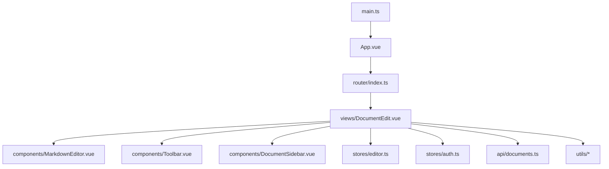
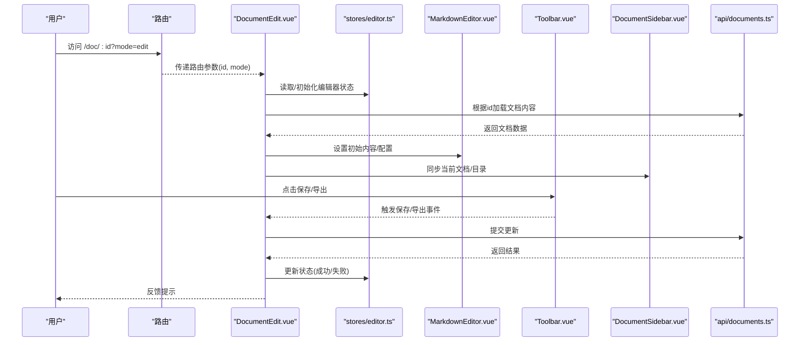
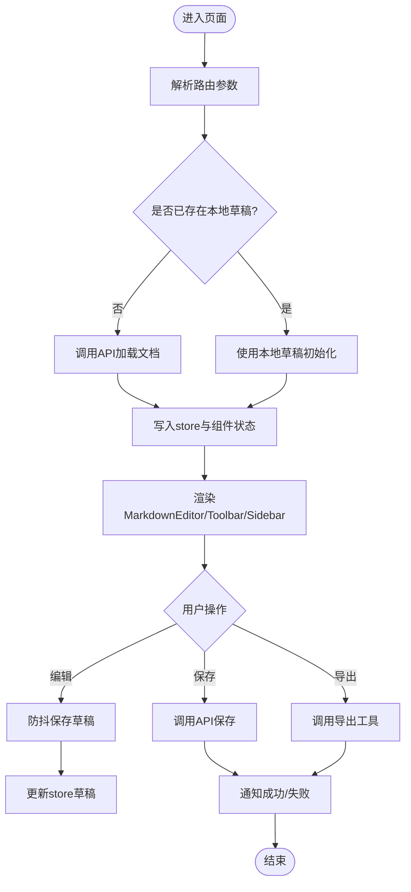
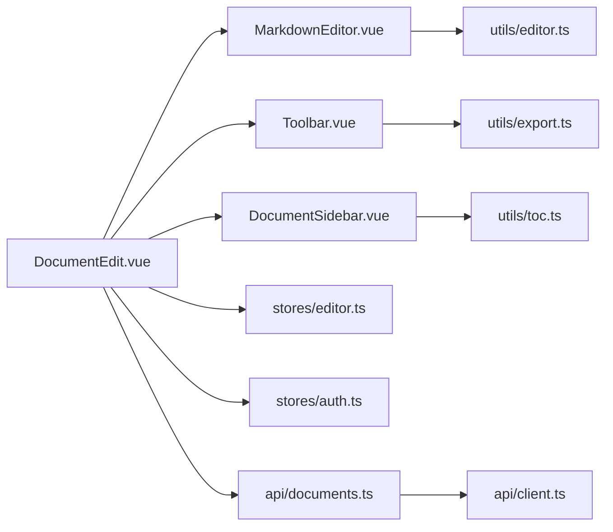
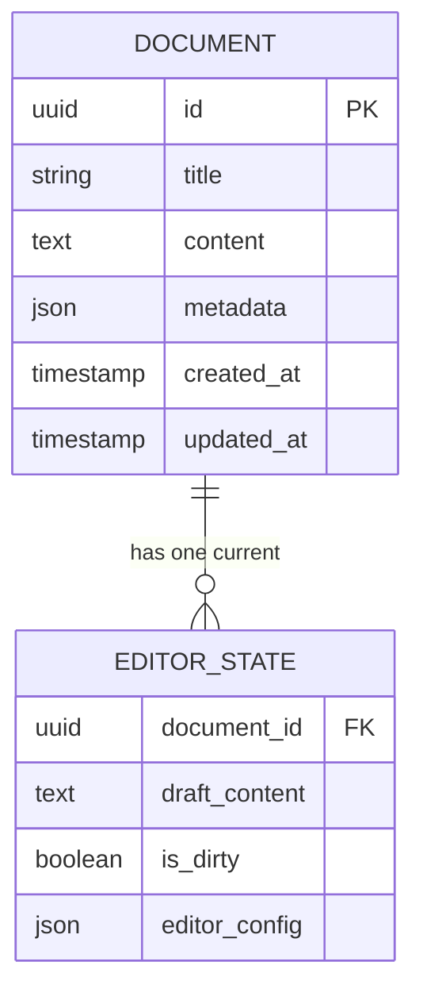

# 文档编辑页面

<cite>
**本文引用的文件**
- [DocumentEdit.vue](file://src/views/DocumentEdit.vue)
- [MarkdownEditor.vue](file://src/components/MarkdownEditor.vue)
- [Toolbar.vue](file://src/components/Toolbar.vue)
- [DocumentSidebar.vue](file://src/components/DocumentSidebar.vue)
- [editor.ts](file://src/utils/editor.ts)
- [export.ts](file://src/utils/export.ts)
- [image.ts](file://src/utils/image.ts)
- [markdown.ts](file://src/utils/markdown.ts)
- [stats.ts](file://src/utils/stats.ts)
- [toc.ts](file://src/utils/toc.ts)
- [documents.ts](file://src/api/documents.ts)
- [auth.ts](file://src/api/auth.ts)
- [client.ts](file://src/api/client.ts)
- [router/index.ts](file://src/router/index.ts)
- [stores/editor.ts](file://src/stores/editor.ts)
- [stores/auth.ts](file://src/stores/auth.ts)
- [stores/index.ts](file://src/stores/index.ts)
- [App.vue](file://src/App.vue)
- [main.ts](file://src/main.ts)
</cite>

## 目录
1. [简介](#简介)
2. [项目结构](#项目结构)
3. [核心组件](#核心组件)
4. [架构总览](#架构总览)
5. [详细组件分析](#详细组件分析)
6. [依赖关系分析](#依赖关系分析)
7. [性能考虑](#性能考虑)
8. [故障排查指南](#故障排查指南)
9. [结论](#结论)
10. [附录](#附录)

## 简介
本文件面向“文档编辑页面”（DocumentEdit.vue）的架构设计与功能实现，覆盖页面布局、组件集成模式、数据流管理、与子组件通信机制、路由参数处理、文档加载与保存流程、用户交互处理、配置扩展点与样式定制方法，以及性能优化与用户体验改进建议。目标是帮助开发者快速理解并高效维护该页面及其周边生态。

## 项目结构
前端采用 Vue 3 + TypeScript + Vite 的工程化结构：
- 视图层：views 下包含 DocumentEdit.vue 等页面级组件
- 组件层：components 下包含 MarkdownEditor、Toolbar、DocumentSidebar 等可复用组件
- 状态管理：stores 使用 Pinia 组织全局状态（编辑器状态、认证状态等）
- API 层：api 封装 HTTP 请求（documents、auth、client）
- 工具层：utils 提供编辑器辅助、导出、图片处理、Markdown 转换、统计、目录生成等能力
- 路由：router/index.ts 定义页面路由与导航守卫
- 应用入口：main.ts 初始化应用、注册插件、挂载根组件 App.vue

图表来源
- [main.ts:1-200](file://src/main.ts#L1-L200)
- [App.vue:1-200](file://src/App.vue#L1-L200)
- [router/index.ts:1-200](file://src/router/index.ts#L1-L200)
- [DocumentEdit.vue:1-200](file://src/views/DocumentEdit.vue#L1-L200)

章节来源
- [main.ts:1-200](file://src/main.ts#L1-L200)
- [App.vue:1-200](file://src/App.vue#L1-L200)
- [router/index.ts:1-200](file://src/router/index.ts#L1-L200)

## 核心组件
- DocumentEdit.vue：文档编辑主页面，负责路由参数解析、文档加载/保存、与子组件通信、状态同步与事件派发。
- MarkdownEditor.vue：Markdown 编辑器容器，封装编辑器实例生命周期、内容变更监听、快捷键、预览切换、导出等。
- Toolbar.vue：顶部工具栏，提供新建、保存、导出、主题切换、全屏等快捷操作。
- DocumentSidebar.vue：侧边栏，展示文档列表、目录、搜索、权限与元信息。

章节来源
- [DocumentEdit.vue:1-200](file://src/views/DocumentEdit.vue#L1-L200)
- [MarkdownEditor.vue:1-200](file://src/components/MarkdownEditor.vue#L1-L200)
- [Toolbar.vue:1-200](file://src/components/Toolbar.vue#L1-L200)
- [DocumentSidebar.vue:1-200](file://src/components/DocumentSidebar.vue#L1-L200)

## 架构总览
DocumentEdit 作为编排者，协调以下层次：
- 路由层：从 URL 获取文档 ID、版本、模式等参数
- 状态层：Pinia store 管理编辑器内容、选中文档、草稿缓存、导出状态等
- 组件层：MarkdownEditor 负责渲染与交互；Toolbar 触发动作；DocumentSidebar 提供导航与上下文
- API 层：documents.ts 封装增删改查；client.ts 统一请求拦截与错误处理
- 工具层：markdown.ts、export.ts、image.ts、stats.ts、toc.ts 提供领域能力

图表来源
- [DocumentEdit.vue:1-200](file://src/views/DocumentEdit.vue#L1-L200)
- [stores/editor.ts:1-200](file://src/stores/editor.ts#L1-L200)
- [api/documents.ts:1-200](file://src/api/documents.ts#L1-L200)
- [MarkdownEditor.vue:1-200](file://src/components/MarkdownEditor.vue#L1-L200)
- [Toolbar.vue:1-200](file://src/components/Toolbar.vue#L1-L200)
- [DocumentSidebar.vue:1-200](file://src/components/DocumentSidebar.vue#L1-L200)

## 详细组件分析

### DocumentEdit.vue：页面编排与数据流中枢
- 路由参数处理
  - 从路由参数中解析文档 ID、编辑模式、预览开关等
  - 在 onMounted 或路由变化时触发加载逻辑
- 文档加载与保存
  - 调用 documents API 拉取文档内容与元信息
  - 将内容注入 MarkdownEditor 并建立双向绑定
  - 保存时合并本地草稿与远程版本，处理冲突策略
- 与子组件通信
  - 通过 props 向 MarkdownEditor 传入配置（主题、只读、快捷键映射）
  - 通过 events/emits 接收内容变更、光标位置、导出完成等事件
  - 通过 props/events 与 Toolbar、DocumentSidebar 联动（如切换文档、刷新目录）
- 状态管理
  - 使用 stores/editor.ts 维护编辑器内容、选中文档、草稿、导出进度等
  - 使用 stores/auth.ts 校验权限，控制可见性与可写性
- 错误与边界
  - 网络异常重试、超时处理、权限不足提示
  - 大文档懒加载、分片渲染、防抖保存

图表来源
- [DocumentEdit.vue:1-200](file://src/views/DocumentEdit.vue#L1-L200)
- [stores/editor.ts:1-200](file://src/stores/editor.ts#L1-L200)
- [api/documents.ts:1-200](file://src/api/documents.ts#L1-L200)

章节来源
- [DocumentEdit.vue:1-200](file://src/views/DocumentEdit.vue#L1-L200)
- [stores/editor.ts:1-200](file://src/stores/editor.ts#L1-L200)
- [api/documents.ts:1-200](file://src/api/documents.ts#L1-L200)

### MarkdownEditor.vue：编辑器容器与生命周期
- 职责
  - 创建/销毁编辑器实例，管理内容双向绑定
  - 监听输入、焦点、选择、快捷键、预览切换
  - 暴露方法：插入语法、跳转行号、清空、导出等
- 配置项
  - 主题、语言、只读、自动保存间隔、快捷键映射、插件开关
- 性能
  - 虚拟滚动、增量更新、防抖/节流、按需加载插件
- 错误处理
  - 语法高亮失败降级、图片上传失败重试、超大文件分块处理

章节来源
- [MarkdownEditor.vue:1-200](file://src/components/MarkdownEditor.vue#L1-L200)
- [utils/editor.ts:1-200](file://src/utils/editor.ts#L1-L200)

### Toolbar.vue：工具栏与动作触发
- 职责
  - 提供新建、保存、撤销/重做、导出、主题切换、全屏等按钮
  - 与 DocumentEdit 通过事件通信，触发对应业务逻辑
- 扩展点
  - 支持动态插槽/自定义按钮，便于按角色或场景扩展
- 无障碍
  - 键盘可达、ARIA 标签、焦点管理

章节来源
- [Toolbar.vue:1-200](file://src/components/Toolbar.vue#L1-L200)
- [DocumentEdit.vue:1-200](file://src/views/DocumentEdit.vue#L1-L200)

### DocumentSidebar.vue：侧边栏与上下文导航
- 职责
  - 展示文档列表、目录树、搜索过滤、权限与元信息
  - 与 DocumentEdit 联动：切换文档、刷新目录、高亮当前节点
- 数据源
  - 从 API 或 store 获取目录与文档集合
- 交互
  - 点击跳转、右键菜单、拖拽排序（可选）

章节来源
- [DocumentSidebar.vue:1-200](file://src/components/DocumentSidebar.vue#L1-L200)
- [utils/toc.ts:1-200](file://src/utils/toc.ts#L1-L200)

## 依赖关系分析
- 组件耦合
  - DocumentEdit 与三个子组件为松耦合：通过 props/events 通信，避免直接引用内部实现
- 状态与 API
  - stores/editor.ts 集中管理编辑器相关状态，降低页面复杂度
  - api/documents.ts 封装 CRUD，client.ts 统一拦截器与错误处理
- 工具模块
  - utils/* 提供纯函数式能力，易于测试与复用

图表来源
- [DocumentEdit.vue:1-200](file://src/views/DocumentEdit.vue#L1-L200)
- [MarkdownEditor.vue:1-200](file://src/components/MarkdownEditor.vue#L1-L200)
- [Toolbar.vue:1-200](file://src/components/Toolbar.vue#L1-L200)
- [DocumentSidebar.vue:1-200](file://src/components/DocumentSidebar.vue#L1-L200)
- [stores/editor.ts:1-200](file://src/stores/editor.ts#L1-L200)
- [stores/auth.ts:1-200](file://src/stores/auth.ts#L1-L200)
- [api/documents.ts:1-200](file://src/api/documents.ts#L1-L200)
- [api/client.ts:1-200](file://src/api/client.ts#L1-L200)
- [utils/editor.ts:1-200](file://src/utils/editor.ts#L1-L200)
- [utils/export.ts:1-200](file://src/utils/export.ts#L1-L200)
- [utils/toc.ts:1-200](file://src/utils/toc.ts#L1-L200)

章节来源
- [DocumentEdit.vue:1-200](file://src/views/DocumentEdit.vue#L1-L200)
- [stores/editor.ts:1-200](file://src/stores/editor.ts#L1-L200)
- [api/documents.ts:1-200](file://src/api/documents.ts#L1-L200)
- [api/client.ts:1-200](file://src/api/client.ts#L1-L200)

## 性能考虑
- 渲染性能
  - 大文档分片渲染、虚拟滚动、按需加载插件与语法高亮
  - 预览与编辑分离，减少 DOM 操作频率
- 网络与存储
  - 草稿本地缓存（IndexedDB/LocalStorage），断网恢复
  - 批量保存、去抖动保存、增量同步
- 资源优化
  - 图片懒加载、压缩与 WebP 转换
  - 静态资源按需引入与代码分割
- 交互体验
  - 操作反馈（加载骨架屏、成功/失败提示）
  - 快捷键与可访问性支持

[本节为通用指导，不直接分析具体文件]

## 故障排查指南
- 常见问题
  - 文档加载失败：检查路由参数、API 响应、权限校验
  - 保存失败：检查网络、并发冲突、字段校验
  - 编辑器无响应：检查实例初始化、插件加载、内存占用
- 定位手段
  - 查看浏览器控制台与网络面板
  - 打印关键状态（store 快照）、接口请求/响应
  - 逐步禁用插件/功能以隔离问题
- 修复建议
  - 增加重试与超时、完善错误码与提示文案
  - 对大文件启用分片与进度条
  - 对敏感操作增加二次确认

章节来源
- [api/client.ts:1-200](file://src/api/client.ts#L1-L200)
- [stores/editor.ts:1-200](file://src/stores/editor.ts#L1-L200)
- [DocumentEdit.vue:1-200](file://src/views/DocumentEdit.vue#L1-L200)

## 结论
DocumentEdit.vue 作为编辑页面的编排中心，通过清晰的组件分层、明确的数据流与事件契约，实现了可扩展、可维护的文档编辑体验。结合 Pinia 状态管理与工具模块的能力，既能满足复杂编辑需求，又具备良好的性能与用户体验。建议在后续迭代中持续完善错误处理、可观测性与性能监控，进一步提升稳定性与易用性。

[本节为总结性内容，不直接分析具体文件]

## 附录

### 页面配置选项（示例）
- 编辑器
  - 主题、语言、只读、自动保存间隔、快捷键映射、插件开关
- 界面
  - 显示/隐藏侧边栏、工具栏、目录、统计信息
- 行为
  - 保存策略（手动/自动）、冲突解决策略、导出格式

[本节为概念性说明，不直接分析具体文件]

### 自定义扩展点
- 工具栏扩展：新增按钮与回调
- 编辑器插件：语法扩展、命令、快捷键
- 侧边栏扩展：自定义面板、数据源接入
- 导出扩展：新增导出格式与模板

[本节为概念性说明，不直接分析具体文件]

### 样式定制方法
- 主题变量：通过 CSS 变量或主题系统覆盖默认样式
- 组件样式：优先使用 Tailwind 类名，必要时局部覆盖
- 响应式：适配移动端与大屏布局

[本节为概念性说明，不直接分析具体文件]

### 路由与导航
- 路由参数：文档 ID、模式（编辑/预览）、版本、查询条件
- 导航守卫：登录态校验、权限校验、未保存提示
- 历史与回退：保留编辑历史、防止误关闭

章节来源
- [router/index.ts:1-200](file://src/router/index.ts#L1-L200)
- [stores/auth.ts:1-200](file://src/stores/auth.ts#L1-L200)

### 数据模型与状态（概念图）

[本图为概念示意，不直接映射到具体源码文件]