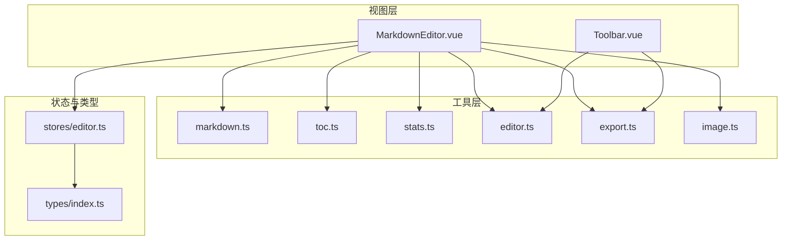
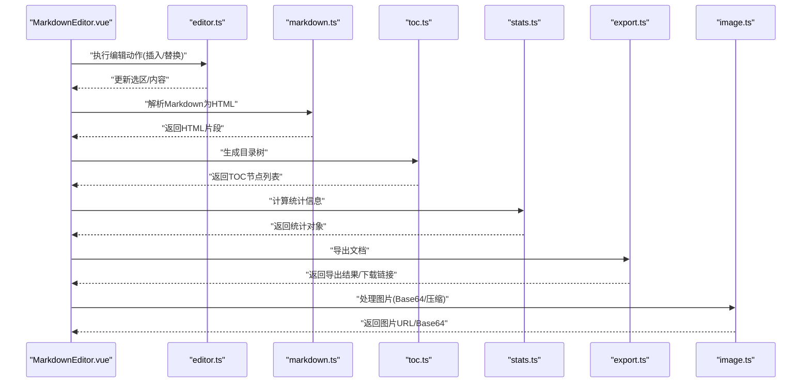
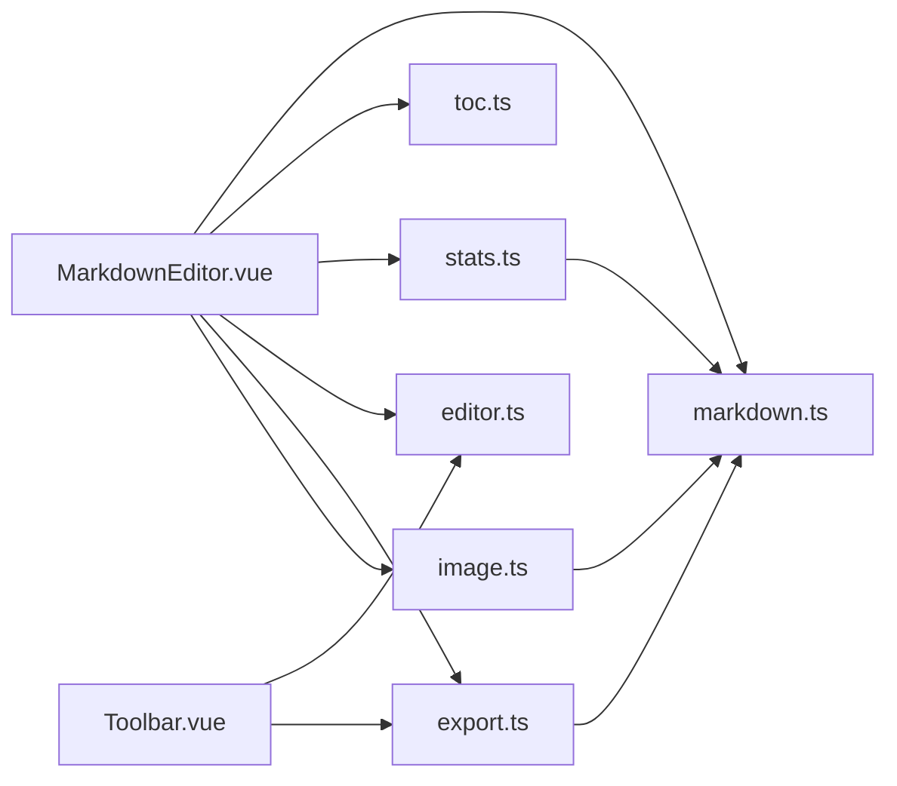
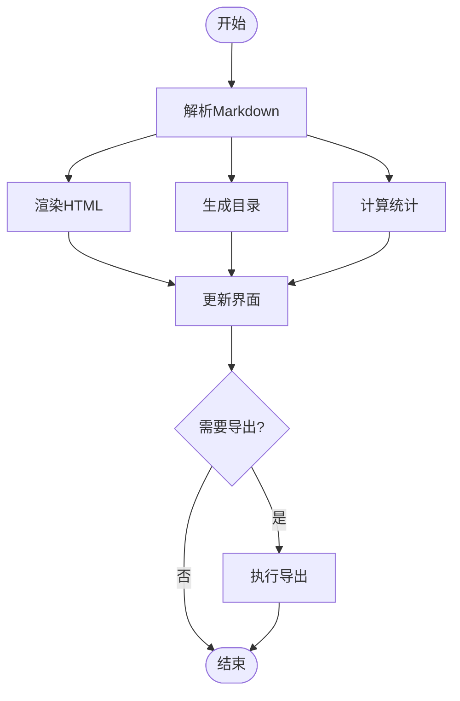

# 编辑器工具函数

<cite>
**本文引用的文件**
- [src/utils/markdown.ts](file://src/utils/markdown.ts)
- [src/utils/toc.ts](file://src/utils/toc.ts)
- [src/utils/stats.ts](file://src/utils/stats.ts)
- [src/utils/editor.ts](file://src/utils/editor.ts)
- [src/utils/export.ts](file://src/utils/export.ts)
- [src/utils/image.ts](file://src/utils/image.ts)
- [src/components/MarkdownEditor.vue](file://src/components/MarkdownEditor.vue)
- [src/components/Toolbar.vue](file://src/components/Toolbar.vue)
- [src/stores/editor.ts](file://src/stores/editor.ts)
- [src/types/index.ts](file://src/types/index.ts)
</cite>

## 目录
1. [简介](#简介)
2. [项目结构](#项目结构)
3. [核心组件](#核心组件)
4. [架构总览](#架构总览)
5. [详细组件分析](#详细组件分析)
6. [依赖关系分析](#依赖关系分析)
7. [性能考虑](#性能考虑)
8. [故障排查指南](#故障排查指南)
9. [结论](#结论)
10. [附录](#附录)

## 简介
本文件为“编辑器工具函数”的综合文档，聚焦于 Markdown 解析与处理、目录生成、统计计算、导出与图片处理等能力。文档面向不同技术背景的读者，提供从高层概览到代码级细节的渐进式说明，包括：
- 每个工具函数的用途、参数、返回值与使用示例（以路径引用代替具体代码）
- 函数之间的依赖关系与调用模式
- 如何组合这些工具实现复杂功能
- 自定义工具函数的开发指南与最佳实践
- 性能优化建议与错误处理策略

## 项目结构
本项目将编辑器相关工具集中在 src/utils 目录下，按职责划分模块：
- markdown.ts：Markdown 解析、渲染、内容清洗与转换
- toc.ts：基于标题层级生成目录树
- stats.ts：字数、行数、段落、标题数量等统计
- editor.ts：编辑器状态与操作封装（如插入、替换、选区管理）
- export.ts：导出为多种格式（HTML/PDF/图片等）
- image.ts：图片上传、压缩、Base64 转换与占位图处理

图表来源
- [src/utils/markdown.ts](file://src/utils/markdown.ts)
- [src/utils/toc.ts](file://src/utils/toc.ts)
- [src/utils/stats.ts](file://src/utils/stats.ts)
- [src/utils/editor.ts](file://src/utils/editor.ts)
- [src/utils/export.ts](file://src/utils/export.ts)
- [src/utils/image.ts](file://src/utils/image.ts)
- [src/components/MarkdownEditor.vue](file://src/components/MarkdownEditor.vue)
- [src/components/Toolbar.vue](file://src/components/Toolbar.vue)
- [src/stores/editor.ts](file://src/stores/editor.ts)
- [src/types/index.ts](file://src/types/index.ts)

章节来源
- [src/utils/markdown.ts](file://src/utils/markdown.ts)
- [src/utils/toc.ts](file://src/utils/toc.ts)
- [src/utils/stats.ts](file://src/utils/stats.ts)
- [src/utils/editor.ts](file://src/utils/editor.ts)
- [src/utils/export.ts](file://src/utils/export.ts)
- [src/utils/image.ts](file://src/utils/image.ts)
- [src/components/MarkdownEditor.vue](file://src/components/MarkdownEditor.vue)
- [src/components/Toolbar.vue](file://src/components/Toolbar.vue)
- [src/stores/editor.ts](file://src/stores/editor.ts)
- [src/types/index.ts](file://src/types/index.ts)

## 核心组件
- Markdown 解析与处理：负责将原始 Markdown 文本转换为可渲染 HTML，并支持安全过滤、链接规范化、图片路径处理等。
- 目录生成：扫描标题行，构建层级化的目录树，便于侧边导航或自动生成 TOC。
- 统计计算：对文档进行多维度统计（字数、行数、段落数、标题数、代码块数量等），用于指标展示与编辑反馈。
- 编辑器操作：封装常用编辑动作（插入、替换、选区定位、撤销/重做辅助），提升交互一致性。
- 导出：将当前文档导出为 HTML、PDF、图片等格式，支持主题与样式注入。
- 图片处理：统一处理图片上传、压缩、Base64 编码与占位图逻辑，保证跨端一致体验。

章节来源
- [src/utils/markdown.ts](file://src/utils/markdown.ts)
- [src/utils/toc.ts](file://src/utils/toc.ts)
- [src/utils/stats.ts](file://src/utils/stats.ts)
- [src/utils/editor.ts](file://src/utils/editor.ts)
- [src/utils/export.ts](file://src/utils/export.ts)
- [src/utils/image.ts](file://src/utils/image.ts)

## 架构总览
编辑器工具层通过清晰的职责边界与稳定的接口契约，支撑上层组件与状态管理。典型调用链如下：

图表来源
- [src/components/MarkdownEditor.vue](file://src/components/MarkdownEditor.vue)
- [src/utils/editor.ts](file://src/utils/editor.ts)
- [src/utils/markdown.ts](file://src/utils/markdown.ts)
- [src/utils/toc.ts](file://src/utils/toc.ts)
- [src/utils/stats.ts](file://src/utils/stats.ts)
- [src/utils/export.ts](file://src/utils/export.ts)
- [src/utils/image.ts](file://src/utils/image.ts)

## 详细组件分析

### Markdown 解析与处理（markdown.ts）
- 主要职责
  - 将 Markdown 文本解析为 HTML，支持常见语法（标题、列表、表格、代码块、链接、图片等）
  - 内容清洗与安全过滤（防止 XSS）
  - 链接与图片路径标准化（相对路径转绝对路径、资源前缀注入）
  - 可选：提取元数据（front matter）、抽取摘要、清理多余空白
- 关键函数（概念性描述）
  - 解析器入口：接收原始 Markdown 字符串，返回 HTML 字符串
  - 安全过滤器：移除危险标签/属性，保留白名单元素
  - 路径处理器：统一资源路径，适配 CDN/静态资源目录
  - 元数据处理：读取 front matter 并返回键值对
- 参数与返回值（概念）
  - 输入：Markdown 文本、配置项（是否启用安全过滤、是否注入资源前缀等）
  - 输出：HTML 字符串、结构化元数据对象
- 使用示例（路径引用）
  - 在编辑器中实时预览：[MarkdownEditor.vue](file://src/components/MarkdownEditor.vue)
  - 在导出流程中生成 HTML：[export.ts](file://src/utils/export.ts)
- 依赖关系
  - 被 MarkdownEditor.vue、export.ts 调用
  - 可与 image.ts 协作处理图片路径
- 错误处理
  - 非法 Markdown 时降级为纯文本或提示用户
  - 资源加载失败时回退到占位图或隐藏
- 性能建议
  - 大文档分块解析与增量更新
  - 缓存已解析的 HTML 片段，避免重复计算

章节来源
- [src/utils/markdown.ts](file://src/utils/markdown.ts)
- [src/components/MarkdownEditor.vue](file://src/components/MarkdownEditor.vue)
- [src/utils/export.ts](file://src/utils/export.ts)
- [src/utils/image.ts](file://src/utils/image.ts)

### 目录生成（toc.ts）
- 主要职责
  - 扫描标题行，构建层级化目录树
  - 生成锚点与跳转链接
  - 支持自定义标题规则与最大深度限制
- 关键函数（概念性描述）
  - 目录构建器：遍历标题，生成节点数组（含 id、标题、层级）
  - 链接生成器：为每个标题生成唯一锚点
  - 深度裁剪器：根据配置限制显示层级
- 参数与返回值（概念）
  - 输入：Markdown 文本、配置（最大深度、是否生成 id）
  - 输出：目录节点数组（id、title、level、children）
- 使用示例（路径引用）
  - 在编辑器侧边栏渲染目录：[MarkdownEditor.vue](file://src/components/MarkdownEditor.vue)
- 依赖关系
  - 依赖 markdown.ts 的标题识别能力（或直接正则匹配）
- 错误处理
  - 无标题时返回空数组
  - 重复标题时自动追加序号确保唯一性
- 性能建议
  - 仅对可见区域或变更部分重新计算
  - 使用防抖减少频繁重算

章节来源
- [src/utils/toc.ts](file://src/utils/toc.ts)
- [src/components/MarkdownEditor.vue](file://src/components/MarkdownEditor.vue)

### 统计计算（stats.ts）
- 主要职责
  - 统计字数、行数、段落数、标题数、代码块数量、链接数量等
  - 提供可读的报告对象，供 UI 展示
- 关键函数（概念性描述）
  - 全文统计：遍历文本，累计各类计数
  - 分类统计：按段落/代码块/标题分别统计
  - 报告生成：汇总为统一对象
- 参数与返回值（概念）
  - 输入：Markdown 文本、统计选项（是否忽略代码块、是否忽略链接等）
  - 输出：统计对象（words、lines、paragraphs、headings、codeBlocks、links 等）
- 使用示例（路径引用）
  - 在编辑器底部显示实时统计：[MarkdownEditor.vue](file://src/components/MarkdownEditor.vue)
- 依赖关系
  - 可复用 markdown.ts 的结构化信息（如标题、代码块）
- 错误处理
  - 空文档返回零值统计
  - 异常字符或编码问题时跳过并记录
- 性能建议
  - 增量统计：仅对变更段落重新计算
  - 使用流式处理降低内存占用

章节来源
- [src/utils/stats.ts](file://src/utils/stats.ts)
- [src/components/MarkdownEditor.vue](file://src/components/MarkdownEditor.vue)

### 编辑器操作（editor.ts）
- 主要职责
  - 封装常用编辑动作：插入文本、替换选区、移动光标、撤销/重做辅助
  - 统一管理选区与内容变更事件
- 关键函数（概念性描述）
  - 插入器：在光标位置插入指定内容（支持模板）
  - 替换器：替换当前选区内容
  - 选区管理器：获取/设置选区、滚动到可视区域
  - 历史辅助：记录变更快照，配合撤销/重做
- 参数与返回值（概念）
  - 输入：编辑器实例、操作参数（内容、位置、选项）
  - 输出：操作结果（成功标志、新选区位置）
- 使用示例（路径引用）
  - 工具栏按钮触发插入/替换：[Toolbar.vue](file://src/components/Toolbar.vue)
  - 编辑器内部命令绑定：[MarkdownEditor.vue](file://src/components/MarkdownEditor.vue)
- 依赖关系
  - 与 Toolbar.vue、MarkdownEditor.vue 紧密耦合
  - 可与 export.ts 协作生成预览内容
- 错误处理
  - 无效选区时跳过操作并提示
  - 插入内容过大时给出警告
- 性能建议
  - 批量操作合并为一次更新
  - 避免在高频事件中执行重型计算

章节来源
- [src/utils/editor.ts](file://src/utils/editor.ts)
- [src/components/Toolbar.vue](file://src/components/Toolbar.vue)
- [src/components/MarkdownEditor.vue](file://src/components/MarkdownEditor.vue)

### 导出（export.ts）
- 主要职责
  - 将当前文档导出为 HTML、PDF、图片等格式
  - 支持主题注入、样式覆盖、分页控制
- 关键函数（概念性描述）
  - HTML 导出：生成完整 HTML 文档（含 head/body）
  - PDF 导出：基于 HTML 渲染并生成 PDF（需外部库）
  - 图片导出：将页面截图为 PNG/JPEG
  - 模板渲染：注入主题与样式
- 参数与返回值（概念）
  - 输入：Markdown 文本、导出选项（格式、主题、尺寸）
  - 输出：Blob/URL/文件路径
- 使用示例（路径引用）
  - 工具栏导出按钮：[Toolbar.vue](file://src/components/Toolbar.vue)
  - 编辑器菜单导出：[MarkdownEditor.vue](file://src/components/MarkdownEditor.vue)
- 依赖关系
  - 依赖 markdown.ts 生成的 HTML
  - 可能依赖 image.ts 的图片处理结果
- 错误处理
  - 渲染失败时回退为 HTML 下载
  - 权限不足时提示用户
- 性能建议
  - 大文档分页导出
  - 异步任务队列避免阻塞 UI

章节来源
- [src/utils/export.ts](file://src/utils/export.ts)
- [src/components/Toolbar.vue](file://src/components/Toolbar.vue)
- [src/components/MarkdownEditor.vue](file://src/components/MarkdownEditor.vue)

### 图片处理（image.ts）
- 主要职责
  - 图片上传与压缩
  - Base64 转换与占位图生成
  - 图片路径标准化与懒加载支持
- 关键函数（概念性描述）
  - 上传处理器：选择文件后压缩并返回 URL/Base64
  - Base64 转换器：将图片转为 Data URL
  - 占位图生成器：在加载期间显示占位图
  - 路径处理器：统一资源路径与前缀
- 参数与返回值（概念）
  - 输入：File/Blob、压缩选项（质量、尺寸）
  - 输出：URL/Data URL、缩略图信息
- 使用示例（路径引用）
  - 编辑器内粘贴/拖拽图片：[MarkdownEditor.vue](file://src/components/MarkdownEditor.vue)
  - 导出时嵌入图片：[export.ts](file://src/utils/export.ts)
- 依赖关系
  - 与 markdown.ts 的路径处理协同
  - 与 export.ts 的渲染流程集成
- 错误处理
  - 不支持的文件类型拒绝处理
  - 压缩失败回退原图
- 性能建议
  - 使用 Web Worker 进行压缩
  - 按需加载大图，首屏仅加载缩略图

章节来源
- [src/utils/image.ts](file://src/utils/image.ts)
- [src/components/MarkdownEditor.vue](file://src/components/MarkdownEditor.vue)
- [src/utils/export.ts](file://src/utils/export.ts)

## 依赖关系分析
- 组件依赖
  - MarkdownEditor.vue 依赖 markdown.ts、toc.ts、stats.ts、editor.ts、export.ts、image.ts
  - Toolbar.vue 依赖 editor.ts、export.ts
- 工具间依赖
  - export.ts 依赖 markdown.ts 的输出
  - image.ts 与 markdown.ts 的路径处理协同
  - stats.ts 可复用 markdown.ts 的结构化信息
- 状态与类型
  - stores/editor.ts 管理编辑器状态，被组件消费
  - types/index.ts 定义共享类型，确保类型安全

图表来源
- [src/components/MarkdownEditor.vue](file://src/components/MarkdownEditor.vue)
- [src/components/Toolbar.vue](file://src/components/Toolbar.vue)
- [src/utils/markdown.ts](file://src/utils/markdown.ts)
- [src/utils/toc.ts](file://src/utils/toc.ts)
- [src/utils/stats.ts](file://src/utils/stats.ts)
- [src/utils/editor.ts](file://src/utils/editor.ts)
- [src/utils/export.ts](file://src/utils/export.ts)
- [src/utils/image.ts](file://src/utils/image.ts)

章节来源
- [src/components/MarkdownEditor.vue](file://src/components/MarkdownEditor.vue)
- [src/components/Toolbar.vue](file://src/components/Toolbar.vue)
- [src/utils/markdown.ts](file://src/utils/markdown.ts)
- [src/utils/toc.ts](file://src/utils/toc.ts)
- [src/utils/stats.ts](file://src/utils/stats.ts)
- [src/utils/editor.ts](file://src/utils/editor.ts)
- [src/utils/export.ts](file://src/utils/export.ts)
- [src/utils/image.ts](file://src/utils/image.ts)

## 性能考虑
- 解析与渲染
  - 使用增量解析与缓存，避免全量重算
  - 对长文档采用分片渲染与虚拟滚动
- 统计计算
  - 仅对变更段落进行增量统计
  - 使用流式处理降低内存峰值
- 图片处理
  - 压缩与缩放在前端完成，减少带宽
  - 懒加载与占位图提升首屏性能
- 导出
  - 分页与异步队列，避免主线程阻塞
  - 预渲染与模板缓存
- 通用优化
  - 防抖/节流高频事件（输入、滚动）
  - 使用 Web Worker 处理重型任务

## 故障排查指南
- 常见问题
  - Markdown 解析失败：检查语法与配置，启用安全过滤时确认白名单
  - 目录错位：确认标题层级与最大深度配置
  - 统计异常：检查是否忽略代码块/链接，确认编码正确
  - 导出失败：检查浏览器权限与外部依赖（如 PDF 库）
  - 图片无法显示：确认路径前缀与资源服务器可达性
- 调试建议
  - 在关键步骤打印中间结果（HTML、TOC、统计对象）
  - 使用浏览器开发者工具的 Network 面板检查资源加载
  - 对图片压缩过程添加日志，定位失败原因
- 错误恢复
  - 解析失败时降级为纯文本
  - 导出失败时回退为 HTML 下载
  - 图片加载失败时显示占位图并提供重试

章节来源
- [src/utils/markdown.ts](file://src/utils/markdown.ts)
- [src/utils/toc.ts](file://src/utils/toc.ts)
- [src/utils/stats.ts](file://src/utils/stats.ts)
- [src/utils/export.ts](file://src/utils/export.ts)
- [src/utils/image.ts](file://src/utils/image.ts)

## 结论
本工具库以清晰职责划分与稳定接口，为编辑器提供了完整的 Markdown 解析、目录生成、统计计算、导出与图片处理能力。通过合理的依赖组织与性能优化策略，能够在复杂场景下保持良好用户体验。建议在实际项目中结合业务需求扩展工具函数，并遵循统一的错误处理与类型规范。

## 附录

### 函数组合使用示例（概念流程）
- 实时预览：编辑器输入 -> markdown.ts 解析 -> 渲染 HTML
- 目录导航：markdown.ts 提取标题 -> toc.ts 生成 TOC -> 侧边栏渲染
- 统计面板：stats.ts 计算 -> UI 展示
- 导出流程：markdown.ts 生成 HTML -> export.ts 打包 -> 下载/预览

图表来源
- [src/utils/markdown.ts](file://src/utils/markdown.ts)
- [src/utils/toc.ts](file://src/utils/toc.ts)
- [src/utils/stats.ts](file://src/utils/stats.ts)
- [src/utils/export.ts](file://src/utils/export.ts)

### 自定义工具函数开发指南
- 设计原则
  - 单一职责：每个函数只做一件事
  - 幂等性：相同输入产生相同输出
  - 可测试性：提供清晰的输入输出与边界条件
- 开发步骤
  - 定义类型：在 types/index.ts 中声明输入输出类型
  - 实现函数：在 utils 下新建模块，遵循命名约定
  - 编写用例：为关键路径编写单元测试
  - 集成验证：在 MarkdownEditor.vue 或 Toolbar.vue 中集成并验证
- 最佳实践
  - 错误处理：抛出明确错误或使用结果对象包裹成功/失败
  - 性能：避免同步阻塞，必要时使用异步与缓存
  - 可配置：通过配置对象控制行为，避免硬编码

章节来源
- [src/types/index.ts](file://src/types/index.ts)
- [src/components/MarkdownEditor.vue](file://src/components/MarkdownEditor.vue)
- [src/components/Toolbar.vue](file://src/components/Toolbar.vue)