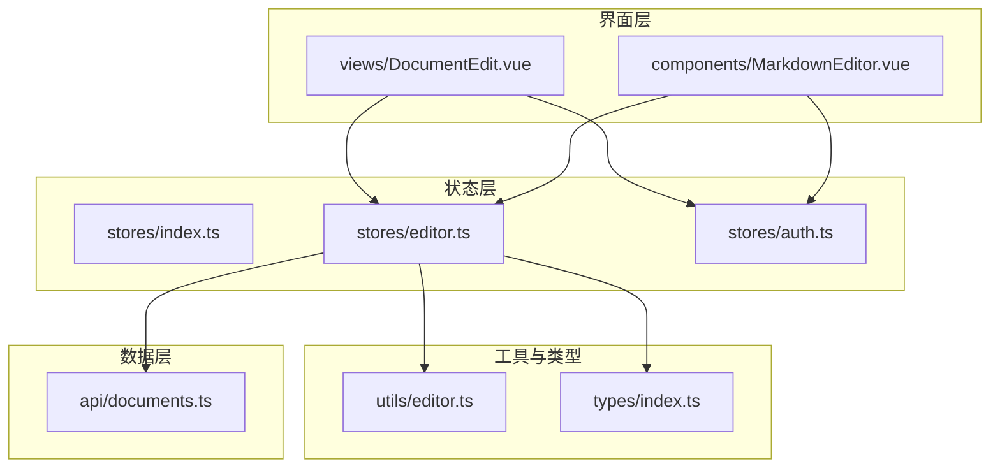
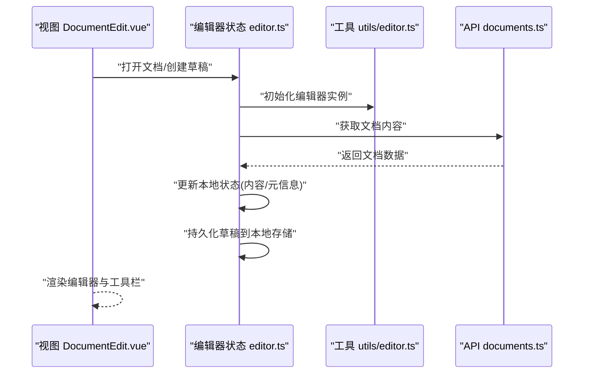
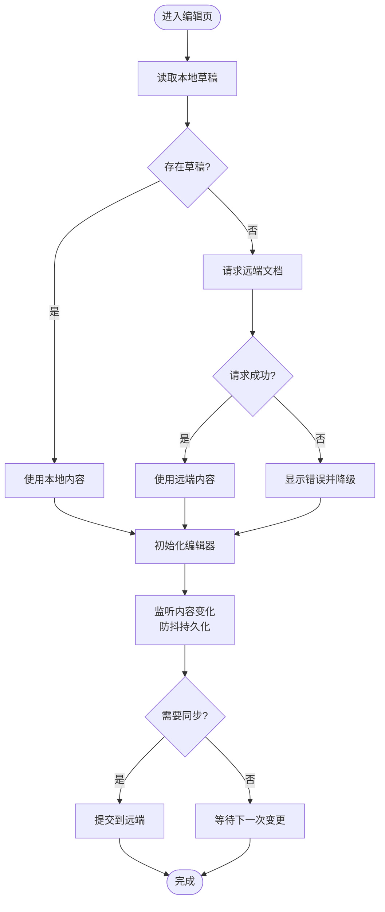
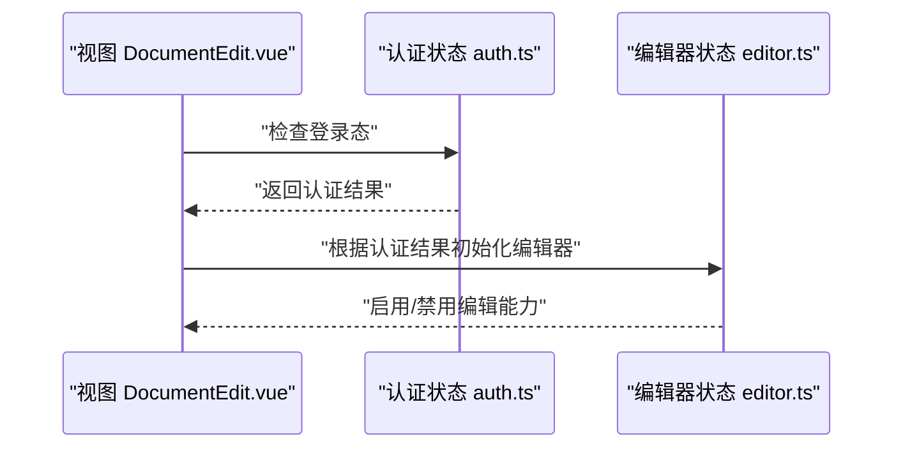
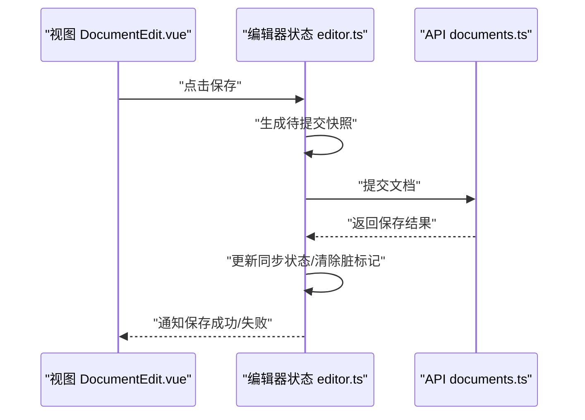
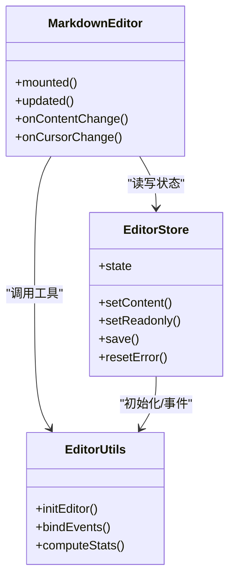
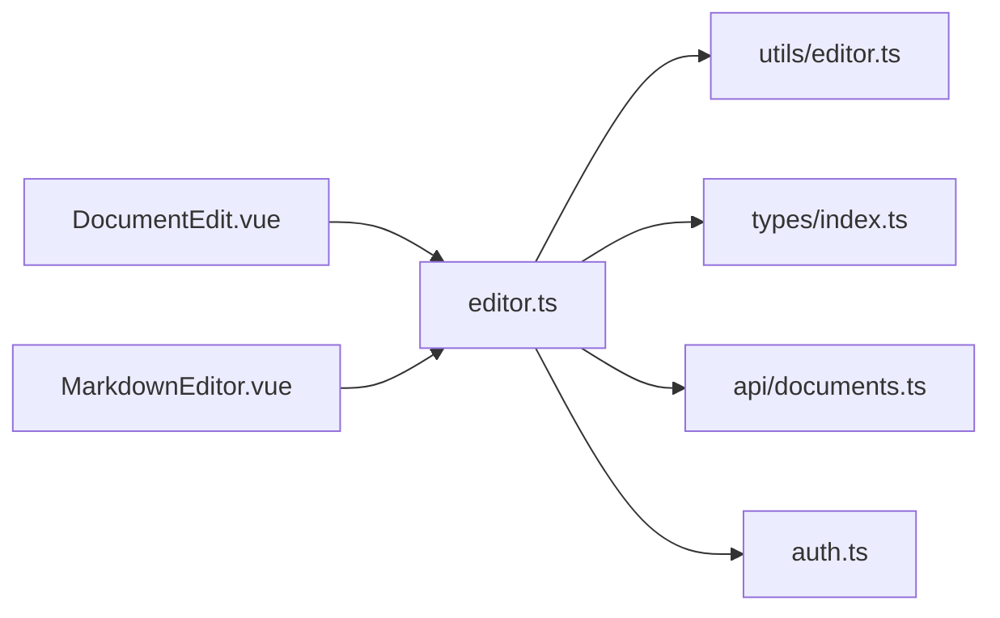

# 编辑器状态管理

<cite>
**本文引用的文件**
- [src/stores/editor.ts](file://src/stores/editor.ts)
- [src/stores/auth.ts](file://src/stores/auth.ts)
- [src/stores/index.ts](file://src/stores/index.ts)
- [src/components/MarkdownEditor.vue](file://src/components/MarkdownEditor.vue)
- [src/views/DocumentEdit.vue](file://src/views/DocumentEdit.vue)
- [src/utils/editor.ts](file://src/utils/editor.ts)
- [src/api/documents.ts](file://src/api/documents.ts)
- [src/types/index.ts](file://src/types/index.ts)
</cite>

## 目录
1. [简介](#简介)
2. [项目结构](#项目结构)
3. [核心组件](#核心组件)
4. [架构总览](#架构总览)
5. [详细组件分析](#详细组件分析)
6. [依赖关系分析](#依赖关系分析)
7. [性能考虑](#性能考虑)
8. [故障排查指南](#故障排查指南)
9. [结论](#结论)
10. [附录](#附录)

## 简介
本文件面向基于 Vue 3 + Pinia 的 Markdown 编辑器，系统化阐述“编辑器状态管理”的设计与实现。内容覆盖：
- 编辑器状态的定义、更新机制与持久化策略
- 编辑器状态与认证状态、文档状态的交互
- 最佳实践：状态结构设计、异步操作处理、错误状态管理
- 使用示例、调试与优化方法
- 状态迁移与版本兼容性考虑

目标是帮助开发者快速理解并高效维护编辑器状态，确保数据一致性、可测试性与可扩展性。

## 项目结构
本项目采用按功能域组织的状态管理方式，核心位于 src/stores；编辑器相关视图与组件位于 src/views 与 src/components；工具函数位于 src/utils；类型定义位于 src/types；API 调用位于 src/api。

图表来源
- [src/stores/index.ts:1-200](file://src/stores/index.ts#L1-L200)
- [src/stores/editor.ts:1-200](file://src/stores/editor.ts#L1-L200)
- [src/stores/auth.ts:1-200](file://src/stores/auth.ts#L1-L200)
- [src/views/DocumentEdit.vue:1-200](file://src/views/DocumentEdit.vue#L1-L200)
- [src/components/MarkdownEditor.vue:1-200](file://src/components/MarkdownEditor.vue#L1-L200)
- [src/utils/editor.ts:1-200](file://src/utils/editor.ts#L1-L200)
- [src/api/documents.ts:1-200](file://src/api/documents.ts#L1-L200)
- [src/types/index.ts:1-200](file://src/types/index.ts#L1-L200)

章节来源
- [src/stores/index.ts:1-200](file://src/stores/index.ts#L1-L200)
- [src/stores/editor.ts:1-200](file://src/stores/editor.ts#L1-L200)
- [src/stores/auth.ts:1-200](file://src/stores/auth.ts#L1-L200)
- [src/views/DocumentEdit.vue:1-200](file://src/views/DocumentEdit.vue#L1-L200)
- [src/components/MarkdownEditor.vue:1-200](file://src/components/MarkdownEditor.vue#L1-L200)
- [src/utils/editor.ts:1-200](file://src/utils/editor.ts#L1-L200)
- [src/api/documents.ts:1-200](file://src/api/documents.ts#L1-L200)
- [src/types/index.ts:1-200](file://src/types/index.ts#L1-L200)

## 核心组件
- 编辑器状态（editor store）：集中管理编辑器的可见状态、光标位置、草稿内容、同步状态、错误信息等，并提供安全的更新方法与持久化策略。
- 认证状态（auth store）：管理登录态、用户信息、权限等，影响编辑器是否允许写入或导出。
- 文档状态（通过 API 与 editor store 协作）：负责从后端加载/保存文档内容，editor store 负责本地缓存与增量更新。
- 工具函数（utils/editor.ts）：提供编辑器实例初始化、事件绑定、内容转换、统计计算等能力。
- 类型定义（types/index.ts）：统一编辑器、文档、用户等数据结构，保证跨模块类型一致。

章节来源
- [src/stores/editor.ts:1-200](file://src/stores/editor.ts#L1-L200)
- [src/stores/auth.ts:1-200](file://src/stores/auth.ts#L1-L200)
- [src/utils/editor.ts:1-200](file://src/utils/editor.ts#L1-L200)
- [src/types/index.ts:1-200](file://src/types/index.ts#L1-L200)

## 架构总览
编辑器状态管理遵循“单一职责、单向数据流、可预测更新”的原则：
- 视图触发 actions，actions 校验后更新 state，state 变更驱动 UI 重渲染
- 异步操作在 actions 中完成，失败时设置错误状态，UI 根据错误状态提示
- 持久化通过 watch/computed 将关键状态落盘，避免丢失未保存内容

图表来源
- [src/views/DocumentEdit.vue:1-200](file://src/views/DocumentEdit.vue#L1-L200)
- [src/stores/editor.ts:1-200](file://src/stores/editor.ts#L1-L200)
- [src/utils/editor.ts:1-200](file://src/utils/editor.ts#L1-L200)
- [src/api/documents.ts:1-200](file://src/api/documents.ts#L1-L200)

## 详细组件分析

### 编辑器状态（editor store）
- 状态设计
  - 编辑器实例引用、当前文档 ID、内容、标题、标签、最后修改时间、同步状态、错误信息、只读模式、主题、大纲展开状态等
  - 派生状态：是否已修改、是否有未保存更改、是否可导出等
- 更新机制
  - 通过 actions 暴露安全更新方法：如设置内容、切换只读、移动光标、切换主题、重置错误等
  - 对高频输入使用防抖/节流，减少不必要的持久化与网络请求
- 持久化策略
  - 本地草稿：监听内容变化，自动保存到 localStorage/sessionStorage
  - 远端同步：当检测到内容变更且网络可用时，触发保存；支持重试与冲突合并策略
  - 恢复策略：页面刷新后优先恢复本地草稿，再尝试拉取远端最新内容
- 错误处理
  - 区分网络错误、权限错误、格式错误等，设置统一的错误状态，UI 展示友好提示
  - 提供重试与回滚接口，保障用户体验

图表来源
- [src/stores/editor.ts:1-200](file://src/stores/editor.ts#L1-L200)
- [src/utils/editor.ts:1-200](file://src/utils/editor.ts#L1-L200)
- [src/api/documents.ts:1-200](file://src/api/documents.ts#L1-L200)

章节来源
- [src/stores/editor.ts:1-200](file://src/stores/editor.ts#L1-L200)
- [src/utils/editor.ts:1-200](file://src/utils/editor.ts#L1-L200)
- [src/api/documents.ts:1-200](file://src/api/documents.ts#L1-L200)

### 认证状态（auth store）与编辑器交互
- 认证状态决定编辑器能力：未登录时仅允许查看或受限编辑；登录后解锁全部功能
- 编辑器在初始化时检查认证状态，必要时跳转登录或禁用敏感操作
- 登出时清理编辑器状态，防止残留数据泄露

图表来源
- [src/stores/auth.ts:1-200](file://src/stores/auth.ts#L1-L200)
- [src/stores/editor.ts:1-200](file://src/stores/editor.ts#L1-L200)
- [src/views/DocumentEdit.vue:1-200](file://src/views/DocumentEdit.vue#L1-L200)

章节来源
- [src/stores/auth.ts:1-200](file://src/stores/auth.ts#L1-L200)
- [src/stores/editor.ts:1-200](file://src/stores/editor.ts#L1-L200)
- [src/views/DocumentEdit.vue:1-200](file://src/views/DocumentEdit.vue#L1-L200)

### 文档状态与编辑器协作
- 文档状态由 API 层负责，editor store 负责本地缓存与增量更新
- 首次加载：优先本地草稿，其次远端文档；编辑过程中保持本地优先
- 保存流程：合并本地变更，去重后提交；失败时保留本地草稿并提示

图表来源
- [src/stores/editor.ts:1-200](file://src/stores/editor.ts#L1-L200)
- [src/api/documents.ts:1-200](file://src/api/documents.ts#L1-L200)
- [src/views/DocumentEdit.vue:1-200](file://src/views/DocumentEdit.vue#L1-L200)

章节来源
- [src/stores/editor.ts:1-200](file://src/stores/editor.ts#L1-L200)
- [src/api/documents.ts:1-200](file://src/api/documents.ts#L1-L200)
- [src/views/DocumentEdit.vue:1-200](file://src/views/DocumentEdit.vue#L1-L200)

### 编辑器组件与工具函数
- MarkdownEditor.vue：负责渲染编辑器、绑定事件、响应状态变化
- utils/editor.ts：封装编辑器实例生命周期、事件处理、内容转换、统计计算等
- 两者通过 editor store 进行解耦，便于替换编辑器内核或扩展功能

图表来源
- [src/components/MarkdownEditor.vue:1-200](file://src/components/MarkdownEditor.vue#L1-L200)
- [src/stores/editor.ts:1-200](file://src/stores/editor.ts#L1-L200)
- [src/utils/editor.ts:1-200](file://src/utils/editor.ts#L1-L200)

章节来源
- [src/components/MarkdownEditor.vue:1-200](file://src/components/MarkdownEditor.vue#L1-L200)
- [src/stores/editor.ts:1-200](file://src/stores/editor.ts#L1-L200)
- [src/utils/editor.ts:1-200](file://src/utils/editor.ts#L1-L200)

## 依赖关系分析
- 低耦合：视图仅依赖 store 暴露的 actions/state，不直接操作 DOM 或 API
- 高内聚：editor store 聚合编辑器相关逻辑，utils/editor.ts 专注编辑器能力
- 外部依赖：API 层负责网络请求与错误处理，store 负责状态协调

图表来源
- [src/views/DocumentEdit.vue:1-200](file://src/views/DocumentEdit.vue#L1-L200)
- [src/components/MarkdownEditor.vue:1-200](file://src/components/MarkdownEditor.vue#L1-L200)
- [src/stores/editor.ts:1-200](file://src/stores/editor.ts#L1-L200)
- [src/utils/editor.ts:1-200](file://src/utils/editor.ts#L1-L200)
- [src/types/index.ts:1-200](file://src/types/index.ts#L1-L200)
- [src/api/documents.ts:1-200](file://src/api/documents.ts#L1-L200)
- [src/stores/auth.ts:1-200](file://src/stores/auth.ts#L1-L200)

章节来源
- [src/stores/editor.ts:1-200](file://src/stores/editor.ts#L1-L200)
- [src/stores/auth.ts:1-200](file://src/stores/auth.ts#L1-L200)
- [src/utils/editor.ts:1-200](file://src/utils/editor.ts#L1-L200)
- [src/types/index.ts:1-200](file://src/types/index.ts#L1-L200)
- [src/api/documents.ts:1-200](file://src/api/documents.ts#L1-L200)
- [src/views/DocumentEdit.vue:1-200](file://src/views/DocumentEdit.vue#L1-L200)
- [src/components/MarkdownEditor.vue:1-200](file://src/components/MarkdownEditor.vue#L1-L200)

## 性能考虑
- 防抖/节流：对内容变更做防抖，降低持久化与网络频率
- 增量更新：仅提交差异内容，减少带宽占用
- 懒加载：非首屏资源按需加载，缩短首屏时间
- 虚拟滚动：长文档列表使用虚拟滚动提升渲染性能
- 内存管理：及时释放编辑器实例与事件监听，避免内存泄漏
- 缓存策略：合理设置本地缓存过期时间与优先级

[本节为通用指导，不直接分析具体文件]

## 故障排查指南
- 常见问题
  - 内容未保存：检查本地草稿是否被覆盖、持久化是否生效
  - 同步失败：检查网络、权限、服务端返回码；查看错误状态与重试逻辑
  - 编辑器无响应：检查实例初始化、事件绑定、DOM 就绪时机
  - 状态不同步：确认 actions 顺序、防抖参数、并发请求控制
- 调试建议
  - 使用浏览器 DevTools 的 Pinia 插件观察状态变化
  - 在关键 actions 添加日志，记录入参、出参与耗时
  - 使用断点定位问题链路，逐步缩小范围
- 恢复策略
  - 提供“撤销/重做”、“恢复上次版本”、“清空草稿”等操作
  - 对不可逆操作增加二次确认

章节来源
- [src/stores/editor.ts:1-200](file://src/stores/editor.ts#L1-L200)
- [src/utils/editor.ts:1-200](file://src/utils/editor.ts#L1-L200)
- [src/api/documents.ts:1-200](file://src/api/documents.ts#L1-L200)

## 结论
通过以 Pinia 为核心的编辑器状态管理，实现了清晰的数据流、可靠的持久化与良好的可维护性。结合认证与文档状态协作，编辑器具备完整的读写能力与容错机制。遵循本文的最佳实践，可在复杂场景下保持稳定与高性能。

[本节为总结性内容，不直接分析具体文件]

## 附录

### 最佳实践清单
- 状态结构设计
  - 扁平化、可序列化、最小必要字段
  - 明确区分本地草稿与远端文档
- 异步操作处理
  - 在 actions 中发起请求，统一错误处理与重试
  - 使用取消令牌避免竞态条件
- 错误状态管理
  - 统一错误模型，包含消息、代码、堆栈（开发环境）
  - UI 层根据错误类型展示不同提示
- 持久化策略
  - 本地优先，远端兜底；支持离线编辑
  - 版本化存储，便于迁移与回滚
- 调试与优化
  - 开启严格模式，捕获意外状态变更
  - 使用性能面板分析渲染瓶颈

[本节为通用指导，不直接分析具体文件]

### 使用示例（路径指引）
- 在视图中订阅编辑器状态并触发操作
  - 参考：[src/views/DocumentEdit.vue:1-200](file://src/views/DocumentEdit.vue#L1-L200)
- 在组件中绑定编辑器事件并更新状态
  - 参考：[src/components/MarkdownEditor.vue:1-200](file://src/components/MarkdownEditor.vue#L1-L200)
- 在 store 中定义状态与 actions
  - 参考：[src/stores/editor.ts:1-200](file://src/stores/editor.ts#L1-L200)
- 在工具函数中封装编辑器能力
  - 参考：[src/utils/editor.ts:1-200](file://src/utils/editor.ts#L1-L200)
- 在 API 层处理文档请求
  - 参考：[src/api/documents.ts:1-200](file://src/api/documents.ts#L1-L200)
- 在类型文件中定义数据结构
  - 参考：[src/types/index.ts:1-200](file://src/types/index.ts#L1-L200)

### 状态迁移与版本兼容
- 版本号管理：为本地存储增加 schemaVersion，启动时检测并迁移
- 迁移脚本：针对字段增删改提供迁移函数，保证旧数据可读
- 灰度发布：新旧版本并存，逐步淘汰旧结构
- 回滚策略：保留历史版本快照，支持一键回退

[本节为通用指导，不直接分析具体文件]