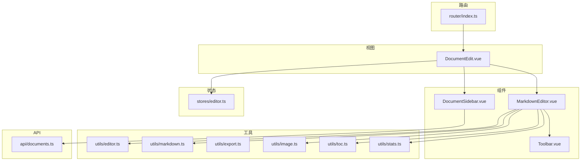
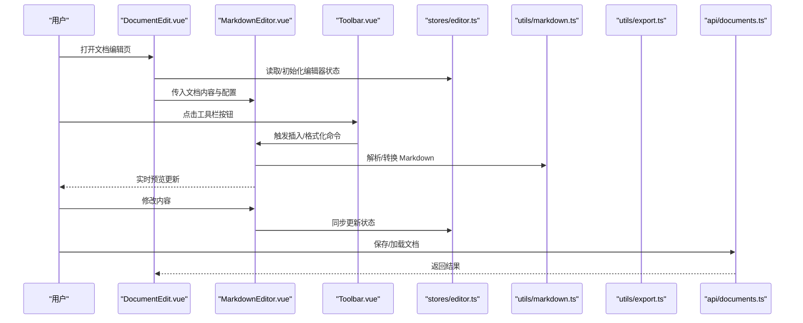
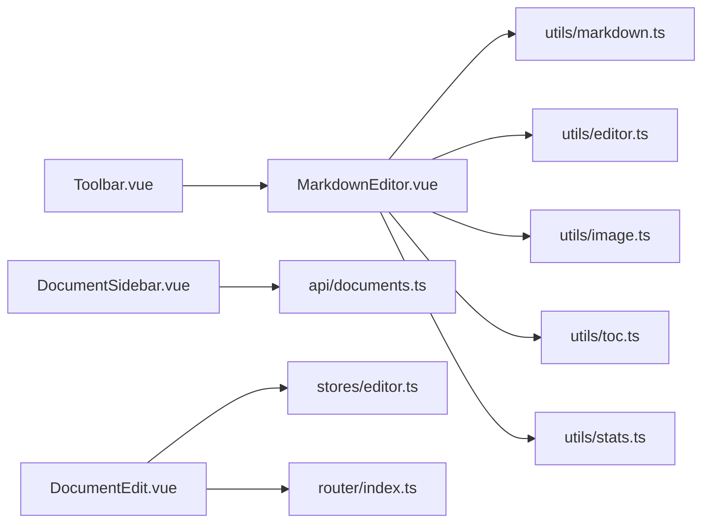

# 核心功能

<cite>
**本文引用的文件**
- [MarkdownEditor.vue](file://src/components/MarkdownEditor.vue)
- [Toolbar.vue](file://src/components/Toolbar.vue)
- [DocumentSidebar.vue](file://src/components/DocumentSidebar.vue)
- [DocumentEdit.vue](file://src/views/DocumentEdit.vue)
- [editor.ts](file://src/utils/editor.ts)
- [markdown.ts](file://src/utils/markdown.ts)
- [export.ts](file://src/utils/export.ts)
- [image.ts](file://src/utils/image.ts)
- [toc.ts](file://src/utils/toc.ts)
- [stats.ts](file://src/utils/stats.ts)
- [stores/editor.ts](file://src/stores/editor.ts)
- [api/documents.ts](file://src/api/documents.ts)
- [router/index.ts](file://src/router/index.ts)
</cite>

## 目录
1. [简介](#简介)
2. [项目结构](#项目结构)
3. [核心组件](#核心组件)
4. [架构总览](#架构总览)
5. [详细组件分析](#详细组件分析)
6. [依赖关系分析](#依赖关系分析)
7. [性能考虑](#性能考虑)
8. [故障排查指南](#故障排查指南)
9. [结论](#结论)
10. [附录](#附录)

## 简介
本文件聚焦于 Markdown 编辑器的核心功能与实现，覆盖实时预览、语法高亮、工具栏操作、文档管理等关键特性。文档从系统架构、数据流、事件处理机制与性能优化策略出发，帮助开发者理解编辑器的工作原理，并提供扩展与自定义的实践指导。

## 项目结构
前端采用 Vue 3 + TypeScript 的单页应用结构，核心模块按职责划分：
- 视图层：页面级组件（如文档编辑页）
- 组件层：可复用 UI 组件（编辑器、工具栏、侧边栏）
- 状态管理：编辑器全局状态（内容、光标、选中文档等）
- 工具函数：Markdown 解析、导出、图片处理、目录生成、统计等
- API：文档增删改查接口封装
- 路由：页面导航配置

图表来源
- [DocumentEdit.vue](file://src/views/DocumentEdit.vue)
- [MarkdownEditor.vue](file://src/components/MarkdownEditor.vue)
- [Toolbar.vue](file://src/components/Toolbar.vue)
- [DocumentSidebar.vue](file://src/components/DocumentSidebar.vue)
- [editor.ts](file://src/utils/editor.ts)
- [markdown.ts](file://src/utils/markdown.ts)
- [export.ts](file://src/utils/export.ts)
- [image.ts](file://src/utils/image.ts)
- [toc.ts](file://src/utils/toc.ts)
- [stats.ts](file://src/utils/stats.ts)
- [documents.ts](file://src/api/documents.ts)
- [index.ts](file://src/router/index.ts)

章节来源
- [DocumentEdit.vue](file://src/views/DocumentEdit.vue)
- [MarkdownEditor.vue](file://src/components/MarkdownEditor.vue)
- [Toolbar.vue](file://src/components/Toolbar.vue)
- [DocumentSidebar.vue](file://src/components/DocumentSidebar.vue)
- [editor.ts](file://src/utils/editor.ts)
- [markdown.ts](file://src/utils/markdown.ts)
- [export.ts](file://src/utils/export.ts)
- [image.ts](file://src/utils/image.ts)
- [toc.ts](file://src/utils/toc.ts)
- [stats.ts](file://src/utils/stats.ts)
- [documents.ts](file://src/api/documents.ts)
- [index.ts](file://src/router/index.ts)

## 核心组件
- MarkdownEditor：编辑器主体，负责输入渲染、实时预览、语法高亮、事件绑定、与工具函数协作完成解析与导出。
- Toolbar：工具栏按钮集合，触发插入语法、格式转换、导出等操作。
- DocumentSidebar：文档列表与选择，支持切换当前文档、加载/保存文档。
- DocumentEdit：页面容器，协调编辑器、侧边栏与状态管理，处理路由参数与文档生命周期。

章节来源
- [MarkdownEditor.vue](file://src/components/MarkdownEditor.vue)
- [Toolbar.vue](file://src/components/Toolbar.vue)
- [DocumentSidebar.vue](file://src/components/DocumentSidebar.vue)
- [DocumentEdit.vue](file://src/views/DocumentEdit.vue)

## 架构总览
编辑器采用“视图-组件-状态-工具-API”的分层架构：
- 视图层通过路由进入编辑页，订阅状态并驱动组件更新。
- 组件层负责交互与局部状态，调用工具函数进行数据处理。
- 状态层集中管理编辑器内容与上下文。
- 工具层提供 Markdown 解析、导出、图片处理、目录生成、统计等能力。
- API 层封装文档的远程存取。

图表来源
- [DocumentEdit.vue](file://src/views/DocumentEdit.vue)
- [MarkdownEditor.vue](file://src/components/MarkdownEditor.vue)
- [Toolbar.vue](file://src/components/Toolbar.vue)
- [editor.ts](file://src/stores/editor.ts)
- [markdown.ts](file://src/utils/markdown.ts)
- [export.ts](file://src/utils/export.ts)
- [documents.ts](file://src/api/documents.ts)

## 详细组件分析

### MarkdownEditor：实时预览与语法高亮
- 实时预览：监听输入事件，将 Markdown 文本转换为 HTML 并注入预览区域；通过防抖/节流减少频繁重绘。
- 语法高亮：在输入区使用代码高亮库或主题样式对常见语法进行着色，提升可读性。
- 事件处理：统一捕获键盘快捷键、粘贴、拖拽图片等事件，转发到工具函数或状态管理器。
- 性能优化：
  - 增量渲染：仅对变更片段进行重新计算。
  - 虚拟滚动：长文档预览时按需渲染可见区域。
  - 异步解析：将耗时解析放入微任务或 Web Worker（若集成）。
- 扩展点：暴露插入语法、自定义指令、插件钩子，便于二次开发。

章节来源
- [MarkdownEditor.vue](file://src/components/MarkdownEditor.vue)
- [editor.ts](file://src/utils/editor.ts)
- [markdown.ts](file://src/utils/markdown.ts)

### Toolbar：工具栏操作
- 功能：标题、加粗、斜体、列表、链接、图片、代码块、导出等快捷操作。
- 行为：点击后向编辑器注入对应语法或触发导出流程；支持撤销/重做栈。
- 可定制：按钮组可配置化，支持隐藏/显示特定命令。

章节来源
- [Toolbar.vue](file://src/components/Toolbar.vue)
- [MarkdownEditor.vue](file://src/components/MarkdownEditor.vue)

### DocumentSidebar：文档管理
- 功能：列出本地或远端文档，支持新建、切换、删除、搜索。
- 数据流：从 API 拉取文档列表，维护选中态；切换时通知编辑器加载新内容。
- 持久化：结合后端存储或本地缓存，保障文档一致性。

章节来源
- [DocumentSidebar.vue](file://src/components/DocumentSidebar.vue)
- [documents.ts](file://src/api/documents.ts)
- [DocumentEdit.vue](file://src/views/DocumentEdit.vue)

### DocumentEdit：页面编排与生命周期
- 路由参数：根据 URL 获取文档 ID，决定加载模式（新建/编辑）。
- 状态同步：与 stores/editor.ts 保持双向绑定，确保多组件间一致。
- 生命周期：挂载时初始化编辑器，卸载前清理事件与定时器。

章节来源
- [DocumentEdit.vue](file://src/views/DocumentEdit.vue)
- [editor.ts](file://src/stores/editor.ts)
- [index.ts](file://src/router/index.ts)

### 工具函数：解析、导出、图片、目录、统计
- markdown.ts：Markdown 到 HTML 的转换、扩展语法解析、安全过滤。
- export.ts：导出为 PDF/HTML/Markdown 等格式，支持模板与样式注入。
- image.ts：图片上传、压缩、Base64 转换、占位图处理。
- toc.ts：基于标题生成目录树，支持锚点跳转。
- stats.ts：字数、行数、阅读时长等统计信息。

章节来源
- [markdown.ts](file://src/utils/markdown.ts)
- [export.ts](file://src/utils/export.ts)
- [image.ts](file://src/utils/image.ts)
- [toc.ts](file://src/utils/toc.ts)
- [stats.ts](file://src/utils/stats.ts)

## 依赖关系分析
- 组件耦合：MarkdownEditor 依赖工具函数与状态管理；Toolbar 与 MarkdownEditor 通过事件解耦；DocumentSidebar 通过 API 与后端交互。
- 外部依赖：Markdown 解析器、导出库、图片处理库、UI 框架。
- 循环依赖：避免组件与工具之间相互引用，保持单向依赖。

图表来源
- [MarkdownEditor.vue](file://src/components/MarkdownEditor.vue)
- [markdown.ts](file://src/utils/markdown.ts)
- [editor.ts](file://src/utils/editor.ts)
- [image.ts](file://src/utils/image.ts)
- [toc.ts](file://src/utils/toc.ts)
- [stats.ts](file://src/utils/stats.ts)
- [Toolbar.vue](file://src/components/Toolbar.vue)
- [DocumentSidebar.vue](file://src/components/DocumentSidebar.vue)
- [documents.ts](file://src/api/documents.ts)
- [DocumentEdit.vue](file://src/views/DocumentEdit.vue)
- [editor.ts](file://src/stores/editor.ts)
- [index.ts](file://src/router/index.ts)

## 性能考虑
- 渲染优化：
  - 防抖/节流：对输入事件进行合并，降低解析频率。
  - 增量更新：仅重算变更段落，避免全量重绘。
  - 虚拟滚动：长文档预览按需渲染可见区域。
- 解析优化：
  - 懒加载：仅在需要时解析 Markdown。
  - 缓存：对相同内容哈希结果进行缓存。
- I/O 优化：
  - 批量保存：合并多次写入，减少网络请求。
  - 断点续传：大文件分片上传与恢复。
- 内存管理：
  - 及时释放：组件卸载时移除监听与定时器。
  - 图片压缩：上传前压缩，减少带宽占用。

[本节为通用性能建议，不直接分析具体文件]

## 故障排查指南
- 预览不更新：
  - 检查输入事件是否被正确捕获与转发。
  - 确认解析函数未抛出异常，查看控制台错误。
- 语法高亮失效：
  - 验证主题与语言包是否正确加载。
  - 检查 DOM 节点是否被意外替换。
- 导出失败：
  - 检查导出库依赖是否安装完整。
  - 确认模板路径与资源可用。
- 图片无法插入：
  - 校验上传接口权限与大小限制。
  - 检查 Base64 转换与占位图逻辑。
- 文档列表为空：
  - 检查 API 响应与错误码。
  - 确认路由参数与文档 ID 传递正确。

章节来源
- [MarkdownEditor.vue](file://src/components/MarkdownEditor.vue)
- [export.ts](file://src/utils/export.ts)
- [image.ts](file://src/utils/image.ts)
- [documents.ts](file://src/api/documents.ts)
- [DocumentEdit.vue](file://src/views/DocumentEdit.vue)

## 结论
该 Markdown 编辑器以清晰的模块化设计实现了实时预览、语法高亮、工具栏操作与文档管理。通过合理的状态管理与工具函数拆分，保证了可扩展性与可维护性。建议在后续迭代中引入更完善的测试覆盖、国际化支持与更多导出格式，以提升用户体验与生产力。

[本节为总结性内容，不直接分析具体文件]

## 附录
- 自定义扩展：
  - 新增工具栏按钮：在工具栏组件注册新命令，并在编辑器中实现对应插入逻辑。
  - 自定义解析规则：在 Markdown 解析器中添加插件或扩展语法。
  - 主题与样式：通过 CSS 变量或主题文件覆盖默认样式。
- 使用场景示例：
  - 技术文档编写：结合目录生成与导出功能快速产出手册。
  - 团队协作：通过文档列表与版本控制接口协同编辑。
  - 离线写作：利用本地缓存与导出功能在无网环境下工作。

[本节为概念性说明，不直接分析具体文件]