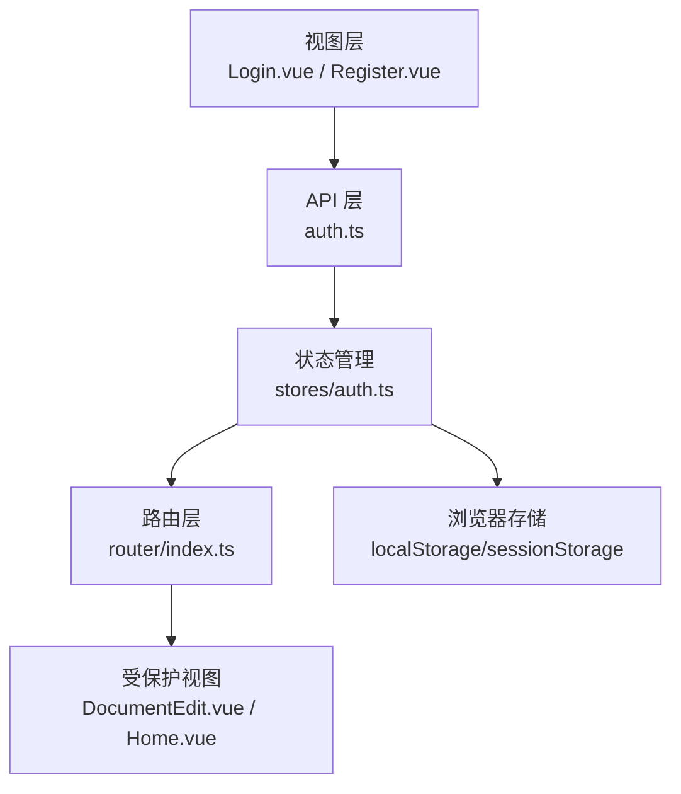
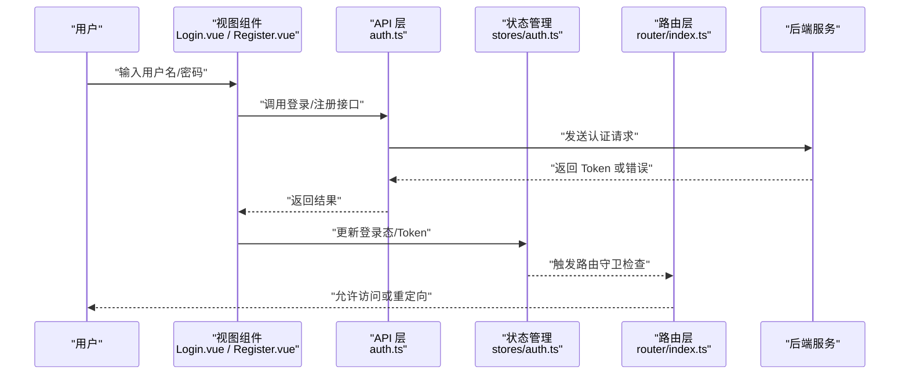
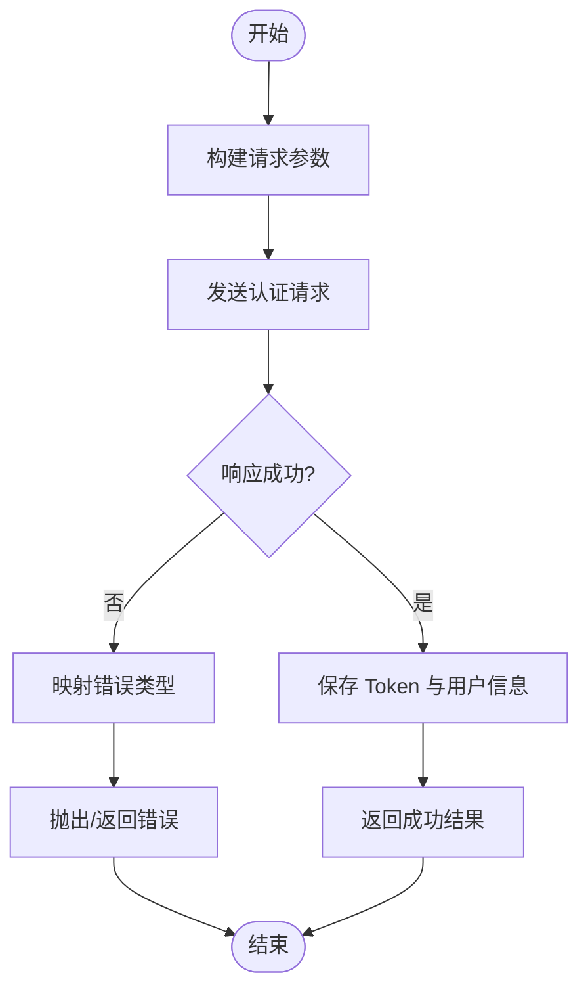
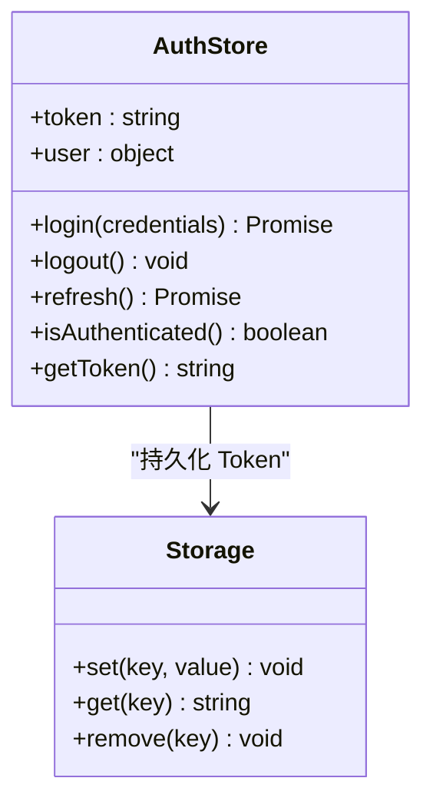
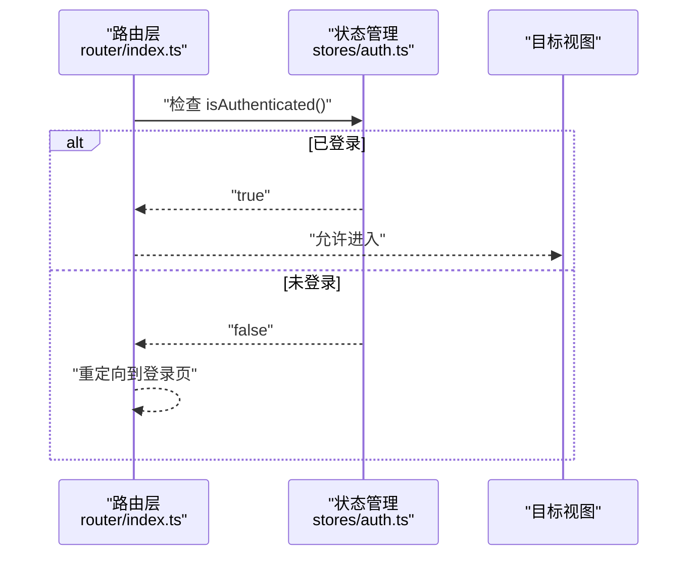
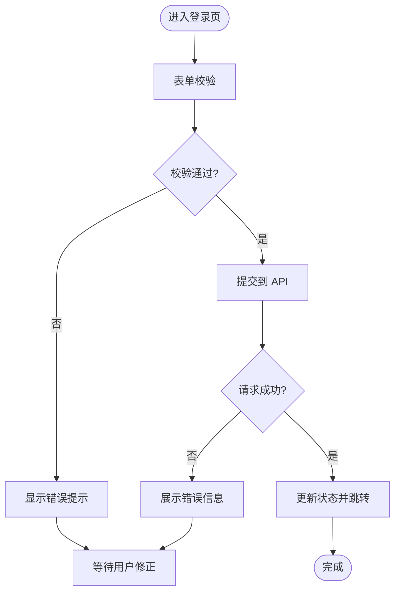
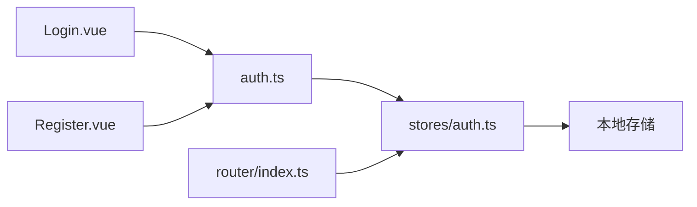

# 用户认证系统

<cite>
**本文引用的文件**
- [src/api/auth.ts](file://src/api/auth.ts)
- [src/router/index.ts](file://src/router/index.ts)
- [src/stores/auth.ts](file://src/stores/auth.ts)
- [src/views/Login.vue](file://src/views/Login.vue)
- [src/views/Register.vue](file://src/views/Register.vue)
- [src/main.ts](file://src/main.ts)
- [openspec/changes/add-auth-login/proposal.md](file://openspec/changes/add-auth-login/proposal.md)
</cite>

## 目录
1. [简介](#简介)
2. [项目结构](#项目结构)
3. [核心组件](#核心组件)
4. [架构总览](#架构总览)
5. [详细组件分析](#详细组件分析)
6. [依赖关系分析](#依赖关系分析)
7. [性能考虑](#性能考虑)
8. [故障排查指南](#故障排查指南)
9. [结论](#结论)
10. [附录](#附录)

## 简介
本章节概述前端用户认证系统的目标与范围：实现登录、注册与会话管理，涵盖 Token 的获取与持久化、权限验证与路由守卫、错误处理与用户体验反馈。文档面向不同技术背景的读者，提供从流程到实现的循序渐进说明，并给出安全最佳实践与常见问题解决方案。

## 项目结构
认证相关代码主要分布在以下模块：
- API 层：封装认证接口调用（登录、注册等）
- 状态管理：维护登录态、Token 与用户信息
- 路由层：基于登录态进行访问控制（路由守卫）
- 视图层：登录与注册页面，负责表单输入与交互
- 入口配置：应用初始化时恢复会话与挂载全局逻辑

图表来源
- [src/views/Login.vue](file://src/views/Login.vue)
- [src/views/Register.vue](file://src/views/Register.vue)
- [src/api/auth.ts](file://src/api/auth.ts)
- [src/stores/auth.ts](file://src/stores/auth.ts)
- [src/router/index.ts](file://src/router/index.ts)

章节来源
- [src/api/auth.ts](file://src/api/auth.ts)
- [src/router/index.ts](file://src/router/index.ts)
- [src/stores/auth.ts](file://src/stores/auth.ts)
- [src/views/Login.vue](file://src/views/Login.vue)
- [src/views/Register.vue](file://src/views/Register.vue)
- [src/main.ts](file://src/main.ts)

## 核心组件
- 认证 API：统一封装登录、注册等请求，处理请求头中的 Token 注入与响应错误分类。
- 认证状态：集中管理登录态、Token、用户信息与过期时间，提供登录、登出、刷新等方法。
- 路由守卫：在路由跳转前校验登录态与权限，未通过则重定向至登录页或提示。
- 视图组件：登录与注册页面，负责表单校验、提交、加载态与错误提示。

章节来源
- [src/api/auth.ts](file://src/api/auth.ts)
- [src/stores/auth.ts](file://src/stores/auth.ts)
- [src/router/index.ts](file://src/router/index.ts)
- [src/views/Login.vue](file://src/views/Login.vue)
- [src/views/Register.vue](file://src/views/Register.vue)

## 架构总览
下图展示了认证流程的整体架构与数据流向：用户在视图层输入凭证，API 层发起网络请求；成功后状态管理更新并持久化 Token；路由守卫根据当前登录态决定页面访问权限。

图表来源
- [src/views/Login.vue](file://src/views/Login.vue)
- [src/views/Register.vue](file://src/views/Register.vue)
- [src/api/auth.ts](file://src/api/auth.ts)
- [src/stores/auth.ts](file://src/stores/auth.ts)
- [src/router/index.ts](file://src/router/index.ts)

## 详细组件分析

### 认证 API（登录/注册）
- 职责：封装对后端的认证接口调用，统一处理请求头（如 Authorization）、错误码映射与重试策略。
- 关键点：
  - 登录成功后保存 Token，并在后续请求中自动附加。
  - 将后端错误分类为可展示的用户提示与需要重试的技术错误。
  - 支持可选的请求拦截器以统一添加鉴权头。

图表来源
- [src/api/auth.ts](file://src/api/auth.ts)

章节来源
- [src/api/auth.ts](file://src/api/auth.ts)

### 认证状态管理（登录态与 Token）
- 职责：维护登录态、Token、用户信息及其生命周期；提供登录、登出、刷新、检查过期等方法。
- 关键点：
  - 使用本地存储持久化 Token，避免刷新丢失。
  - 提供统一的登录态查询方法供路由守卫与组件使用。
  - 支持 Token 过期检测与自动刷新或强制登出。

图表来源
- [src/stores/auth.ts](file://src/stores/auth.ts)

章节来源
- [src/stores/auth.ts](file://src/stores/auth.ts)

### 路由守卫（访问控制）
- 职责：在路由切换前校验登录态与权限，未通过则重定向至登录页或显示无权限提示。
- 关键点：
  - 全局前置守卫读取状态管理中的登录态。
  - 白名单路由（如登录、注册）跳过校验。
  - 受保护路由需具备相应角色或权限时进行二次校验。

图表来源
- [src/router/index.ts](file://src/router/index.ts)
- [src/stores/auth.ts](file://src/stores/auth.ts)

章节来源
- [src/router/index.ts](file://src/router/index.ts)
- [src/stores/auth.ts](file://src/stores/auth.ts)

### 视图组件（登录/注册）
- 职责：收集用户输入、执行前端校验、调用 API、处理加载与错误状态、导航到受保护页面。
- 关键点：
  - 表单校验：必填、格式、长度等。
  - 交互反馈：加载中禁用按钮、错误消息提示、成功跳转。
  - 错误处理：区分网络错误、业务错误与未知异常。

图表来源
- [src/views/Login.vue](file://src/views/Login.vue)
- [src/views/Register.vue](file://src/views/Register.vue)
- [src/api/auth.ts](file://src/api/auth.ts)

章节来源
- [src/views/Login.vue](file://src/views/Login.vue)
- [src/views/Register.vue](file://src/views/Register.vue)
- [src/api/auth.ts](file://src/api/auth.ts)

### 应用初始化与会话恢复
- 职责：在应用启动时恢复本地存储的 Token，重建登录态，确保刷新后仍保持登录。
- 关键点：
  - 从本地存储读取 Token 并设置到状态管理。
  - 可选地发起一次轻量验证请求确认 Token 有效性。
  - 若无效则清除本地数据并引导重新登录。

章节来源
- [src/main.ts](file://src/main.ts)
- [src/stores/auth.ts](file://src/stores/auth.ts)

## 依赖关系分析
- 视图组件依赖 API 层进行认证操作。
- 状态管理被视图与路由共同依赖，作为单一事实源。
- 路由守卫依赖状态管理判断是否放行。
- API 层可能依赖全局请求配置（如基础 URL、超时、拦截器）。

图表来源
- [src/views/Login.vue](file://src/views/Login.vue)
- [src/views/Register.vue](file://src/views/Register.vue)
- [src/api/auth.ts](file://src/api/auth.ts)
- [src/stores/auth.ts](file://src/stores/auth.ts)
- [src/router/index.ts](file://src/router/index.ts)

章节来源
- [src/api/auth.ts](file://src/api/auth.ts)
- [src/stores/auth.ts](file://src/stores/auth.ts)
- [src/router/index.ts](file://src/router/index.ts)

## 性能考虑
- 减少重复请求：登录后缓存必要用户信息，避免频繁拉取。
- 防抖与节流：在登录/注册提交时防止重复点击导致多次请求。
- 懒加载与按需引入：仅对受保护路由进行必要的权限校验。
- 错误快速失败：对明显非法输入在前端尽早拒绝，降低无效请求。

## 故障排查指南
- 无法登录：
  - 检查 API 层是否正确组装请求体与头部。
  - 查看后端返回的错误码并映射为用户可读提示。
  - 确认状态管理是否正确保存 Token。
- 刷新后丢失登录态：
  - 检查本地存储键名与读写逻辑。
  - 确认应用初始化时是否恢复 Token。
- 路由守卫不生效：
  - 检查守卫条件与白名单配置。
  - 确认状态管理中的登录态是否及时更新。
- 常见错误分类：
  - 网络错误：连接超时、DNS 解析失败。
  - 业务错误：账号不存在、密码错误、账户被封禁。
  - 权限错误：无访问受保护资源权限。

章节来源
- [src/api/auth.ts](file://src/api/auth.ts)
- [src/stores/auth.ts](file://src/stores/auth.ts)
- [src/router/index.ts](file://src/router/index.ts)

## 结论
该认证系统通过清晰的层次划分实现了登录、注册与会话管理的闭环：视图层负责交互，API 层负责通信，状态管理负责统一状态，路由层负责访问控制。遵循上述流程与实践，可在保证安全性的同时提供良好的用户体验。建议结合后端策略（如 Token 刷新、最小权限原则）进一步完善整体安全体系。

## 附录
- 参考设计说明：[openspec/changes/add-auth-login/proposal.md](file://openspec/changes/add-auth-login/proposal.md)