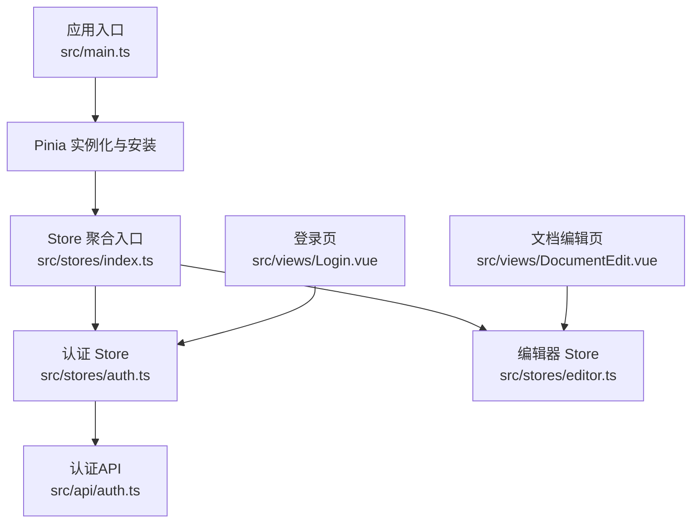
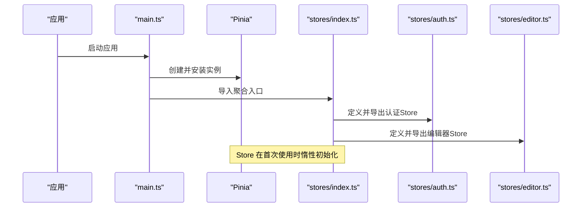
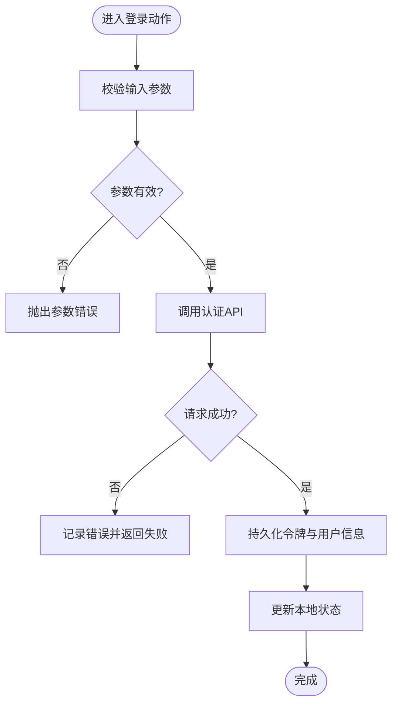
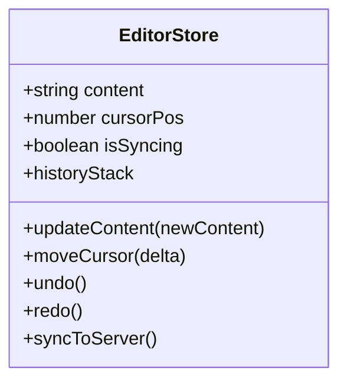
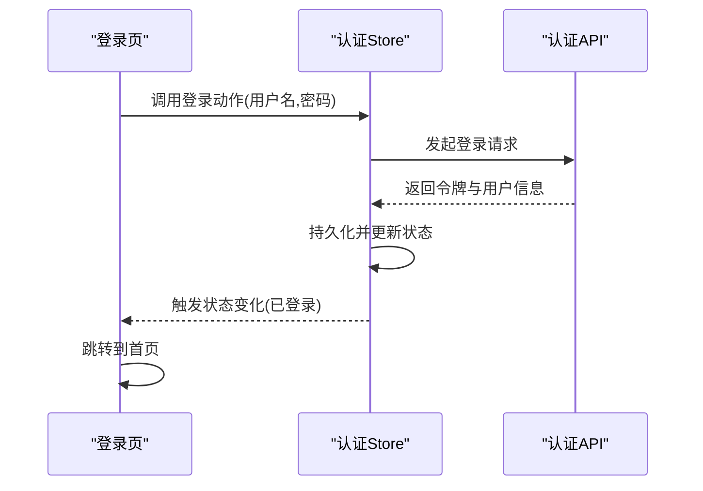
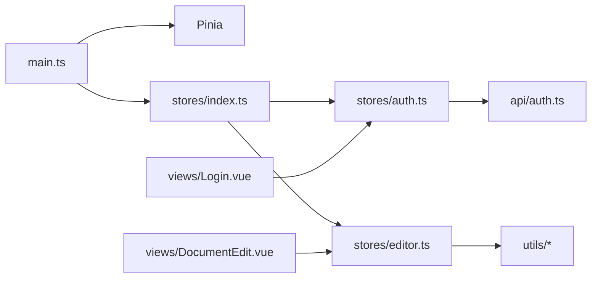

# Store架构设计

<cite>
**本文引用的文件**
- [src/stores/index.ts](file://src/stores/index.ts)
- [src/stores/auth.ts](file://src/stores/auth.ts)
- [src/stores/editor.ts](file://src/stores/editor.ts)
- [src/main.ts](file://src/main.ts)
- [src/types/index.ts](file://src/types/index.ts)
- [src/api/auth.ts](file://src/api/auth.ts)
- [src/views/Login.vue](file://src/views/Login.vue)
- [src/views/DocumentEdit.vue](file://src/views/DocumentEdit.vue)
</cite>

## 目录
1. [简介](#简介)
2. [项目结构](#项目结构)
3. [核心组件](#核心组件)
4. [架构总览](#架构总览)
5. [详细组件分析](#详细组件分析)
6. [依赖关系分析](#依赖关系分析)
7. [性能考虑](#性能考虑)
8. [故障排查指南](#故障排查指南)
9. [结论](#结论)
10. [附录](#附录)

## 简介
本文件面向使用 Pinia 的前端应用，系统化阐述 Store 的整体架构与组织方式。内容涵盖 Store 分层设计、依赖管理、状态隔离、初始化流程、模块注册、类型定义组织、Store 间通信模式（含事件总线思路）、跨模块数据共享方案、扩展指南（新增模块、命名规范、可测试性）、调试技巧、性能监控方法与最佳实践建议。目标是帮助读者快速理解并高效维护基于 Pinia 的状态管理子系统。

## 项目结构
本项目采用按功能域划分的 Store 目录结构：
- src/stores：集中存放所有 Store 模块，包含全局入口与具体业务 Store
- src/types：集中定义类型，供 Store 与组件复用
- src/api：封装后端接口调用，被 Store 调用以获取或提交数据
- src/views：页面级视图，通过组合式 API 订阅 Store 状态并触发变更
- src/main：应用启动入口，负责创建 Vue 应用实例并安装 Pinia

图表来源
- [src/main.ts:1-40](file://src/main.ts#L1-L40)
- [src/stores/index.ts:1-60](file://src/stores/index.ts#L1-L60)
- [src/stores/auth.ts:1-120](file://src/stores/auth.ts#L1-L120)
- [src/stores/editor.ts:1-120](file://src/stores/editor.ts#L1-L120)
- [src/api/auth.ts:1-80](file://src/api/auth.ts#L1-L80)
- [src/views/Login.vue:1-120](file://src/views/Login.vue#L1-L120)
- [src/views/DocumentEdit.vue:1-120](file://src/views/DocumentEdit.vue#L1-L120)

章节来源
- [src/main.ts:1-40](file://src/main.ts#L1-L40)
- [src/stores/index.ts:1-60](file://src/stores/index.ts#L1-L60)

## 核心组件
- Pinia 实例与插件：在应用入口处创建并安装，提供响应式状态容器与 DevTools 支持
- Store 聚合入口：统一导出各业务 Store，便于按需引入与类型推导
- 认证 Store：管理用户登录态、令牌、基础信息，封装鉴权相关 API 调用
- 编辑器 Store：管理文档内容、光标位置、历史记录等编辑器状态
- 类型定义：集中声明 Store 状态、动作参数与返回类型，保证全链路类型安全

章节来源
- [src/stores/auth.ts:1-120](file://src/stores/auth.ts#L1-L120)
- [src/stores/editor.ts:1-120](file://src/stores/editor.ts#L1-L120)
- [src/types/index.ts:1-120](file://src/types/index.ts#L1-L120)

## 架构总览
整体采用“入口安装 + 模块化 Store + 类型集中”的分层架构：
- 入口层：main.ts 创建并挂载 Pinia，启用必要的插件（如持久化、DevTools）
- 聚合层：stores/index.ts 汇总并导出各 Store，提供统一的引入点
- 领域层：auth.ts、editor.ts 等各自封装状态、动作与副作用
- 类型层：types/index.ts 提供跨模块共享的类型定义
- 集成层：views 中的组件通过组合式 API 访问 Store，触发动作并消费状态

图表来源
- [src/main.ts:1-40](file://src/main.ts#L1-L40)
- [src/stores/index.ts:1-60](file://src/stores/index.ts#L1-L60)
- [src/stores/auth.ts:1-120](file://src/stores/auth.ts#L1-L120)
- [src/stores/editor.ts:1-120](file://src/stores/editor.ts#L1-L120)

## 详细组件分析

### 认证 Store（auth.ts）
- 职责：管理登录态、令牌、用户信息；封装登录、登出、刷新等动作；处理错误与重试策略
- 状态隔离：仅暴露必要字段，避免泄露敏感信息；通过只读计算属性对外暴露派生状态
- 依赖管理：依赖 api/auth.ts 进行网络请求；通过类型约束确保参数与返回值一致
- 副作用处理：在动作中统一捕获异常，转换为友好的错误提示；必要时触发全局通知

图表来源
- [src/stores/auth.ts:1-120](file://src/stores/auth.ts#L1-L120)
- [src/api/auth.ts:1-80](file://src/api/auth.ts#L1-L80)

章节来源
- [src/stores/auth.ts:1-120](file://src/stores/auth.ts#L1-L120)
- [src/api/auth.ts:1-80](file://src/api/auth.ts#L1-L80)

### 编辑器 Store（editor.ts）
- 职责：管理文档内容、光标位置、选区、撤销栈、同步状态等
- 状态隔离：将编辑器内部状态与 UI 展示解耦，提供最小化的公开接口
- 性能优化：对高频变更（如输入）进行节流/防抖；使用局部更新减少重渲染
- 可测试性：将纯逻辑（如历史合并、选区计算）抽离为工具函数，便于单元测试

图表来源
- [src/stores/editor.ts:1-120](file://src/stores/editor.ts#L1-L120)

章节来源
- [src/stores/editor.ts:1-120](file://src/stores/editor.ts#L1-L120)

### Store 聚合入口（index.ts）
- 职责：集中定义并导出各 Store，提供统一的引入点；可在此处配置全局插件（如持久化）
- 模块注册：每个 Store 独立定义后统一导出，便于按需加载与类型推导
- 扩展性：新增 Store 只需在聚合入口导出即可，无需改动其他模块

章节来源
- [src/stores/index.ts:1-60](file://src/stores/index.ts#L1-L60)

### 类型定义（types/index.ts）
- 职责：集中定义 Store 状态、动作参数与返回类型；提供跨模块共享的接口契约
- 组织方式：按领域划分类型文件，保持高内聚低耦合；在 Store 中严格引用，避免 any

章节来源
- [src/types/index.ts:1-120](file://src/types/index.ts#L1-L120)

### 视图与 Store 的交互
- 登录页：调用认证 Store 的登录动作，监听状态变化并导航
- 文档编辑页：订阅编辑器 Store 的内容与光标状态，触发保存与同步

图表来源
- [src/views/Login.vue:1-120](file://src/views/Login.vue#L1-L120)
- [src/stores/auth.ts:1-120](file://src/stores/auth.ts#L1-L120)
- [src/api/auth.ts:1-80](file://src/api/auth.ts#L1-L80)

章节来源
- [src/views/Login.vue:1-120](file://src/views/Login.vue#L1-L120)
- [src/stores/auth.ts:1-120](file://src/stores/auth.ts#L1-L120)
- [src/api/auth.ts:1-80](file://src/api/auth.ts#L1-L80)

## 依赖关系分析
- main.ts 依赖 Pinia 并安装到 Vue 应用实例
- stores/index.ts 依赖各 Store 模块并统一导出
- auth.ts 依赖 api/auth.ts 进行网络请求
- editor.ts 依赖 utils 中的工具函数（如历史合并、选区计算）
- views 依赖对应 Store，并通过组合式 API 订阅状态与触发动作

图表来源
- [src/main.ts:1-40](file://src/main.ts#L1-L40)
- [src/stores/index.ts:1-60](file://src/stores/index.ts#L1-L60)
- [src/stores/auth.ts:1-120](file://src/stores/auth.ts#L1-L120)
- [src/stores/editor.ts:1-120](file://src/stores/editor.ts#L1-L120)
- [src/api/auth.ts:1-80](file://src/api/auth.ts#L1-L80)
- [src/views/Login.vue:1-120](file://src/views/Login.vue#L1-L120)
- [src/views/DocumentEdit.vue:1-120](file://src/views/DocumentEdit.vue#L1-L120)

章节来源
- [src/main.ts:1-40](file://src/main.ts#L1-L40)
- [src/stores/index.ts:1-60](file://src/stores/index.ts#L1-L60)
- [src/stores/auth.ts:1-120](file://src/stores/auth.ts#L1-L120)
- [src/stores/editor.ts:1-120](file://src/stores/editor.ts#L1-L120)
- [src/api/auth.ts:1-80](file://src/api/auth.ts#L1-L80)
- [src/views/Login.vue:1-120](file://src/views/Login.vue#L1-L120)
- [src/views/DocumentEdit.vue:1-120](file://src/views/DocumentEdit.vue#L1-L120)

## 性能考虑
- 惰性初始化：Store 仅在首次使用时创建，降低冷启动开销
- 细粒度更新：利用 Pinia 的响应式特性，仅更新受影响的部分，减少重渲染
- 批量更新：在高频操作中使用批量更新或节流/防抖，避免频繁触发副作用
- 持久化策略：对关键状态（如令牌）进行持久化，提升用户体验与容错能力
- 内存管理：及时清理定时器与事件监听器，防止内存泄漏

[本节为通用指导，不直接分析具体文件]

## 故障排查指南
- 常见问题
  - 状态未更新：检查是否在正确的上下文中访问 Store，确认是否使用了正确的组合式 API
  - 类型错误：确认 types/index.ts 中的类型定义是否与 Store 实现保持一致
  - 网络错误：在认证 Store 的动作中统一捕获异常，输出清晰的错误日志
- 调试技巧
  - 使用浏览器 DevTools 的 Pinia 面板查看状态树与动作调用链
  - 在关键动作前后添加日志，定位问题边界
  - 对复杂逻辑抽取为纯函数，编写单元测试验证正确性
- 回滚与恢复
  - 对重要状态变更提供撤销/重做机制
  - 在网络失败时提供降级策略与重试逻辑

章节来源
- [src/stores/auth.ts:1-120](file://src/stores/auth.ts#L1-L120)
- [src/stores/editor.ts:1-120](file://src/stores/editor.ts#L1-L120)
- [src/types/index.ts:1-120](file://src/types/index.ts#L1-L120)

## 结论
本项目采用清晰的分层与模块化设计，结合 Pinia 的响应式与类型优势，实现了高内聚、低耦合的状态管理。通过聚合入口统一管理、类型集中定义、视图与 Store 解耦，提升了可维护性与可扩展性。建议在后续迭代中继续遵循现有规范，逐步完善性能监控与自动化测试，进一步提升系统稳定性与开发效率。

[本节为总结性内容，不直接分析具体文件]

## 附录

### Store 初始化流程
- 应用启动时在 main.ts 创建并安装 Pinia
- 首次访问某个 Store 时，Pinia 惰性初始化该 Store
- 聚合入口统一导出 Store，便于按需引入

章节来源
- [src/main.ts:1-40](file://src/main.ts#L1-L40)
- [src/stores/index.ts:1-60](file://src/stores/index.ts#L1-L60)

### 模块注册方式
- 在 stores/index.ts 中定义并导出各 Store
- 新增模块只需在聚合入口导出，无需改动其他模块
- 可通过插件在聚合入口统一配置全局行为（如持久化）

章节来源
- [src/stores/index.ts:1-60](file://src/stores/index.ts#L1-L60)

### 类型定义的组织结构
- 在 types/index.ts 中集中定义 Store 状态、动作参数与返回类型
- 按领域划分类型文件，保持高内聚低耦合
- Store 与组件均严格引用类型，避免 any

章节来源
- [src/types/index.ts:1-120](file://src/types/index.ts#L1-L120)

### Store 之间的通信模式
- 直接调用：一个 Store 调用另一个 Store 的动作或读取其状态
- 事件总线：通过轻量事件总线在 Store 之间传递事件，解耦强依赖
- 共享状态：将跨模块共用的状态提升到更高层的 Store 或全局上下文

[本节为概念性说明，不直接分析具体文件]

### 跨模块数据共享方案
- 将公共状态（如主题、语言）放入独立的共享 Store
- 通过聚合入口统一导出，供任意模块订阅与更新
- 使用类型约束确保数据一致性

[本节为概念性说明，不直接分析具体文件]

### Store 扩展指南
- 新增步骤
  - 在 stores 目录下新建模块文件，定义状态、动作与副作用
  - 在聚合入口导出新模块
  - 在视图中通过组合式 API 引入并使用
- 命名规范
  - 文件名使用小写下划线或驼峰，语义清晰
  - 状态字段使用名词，动作使用动词短语
  - 类型定义与实现一一对应
- 可测试性
  - 将纯逻辑抽离为工具函数，编写单元测试
  - 对异步动作进行 Mock，验证分支路径

[本节为通用指导，不直接分析具体文件]

### 调试技巧与性能监控
- 调试
  - 使用 Pinia DevTools 查看状态树与动作调用
  - 在关键路径添加日志，定位问题边界
- 性能监控
  - 统计高频动作的执行次数与耗时
  - 对大对象变更进行增量更新，避免整树重渲染
  - 使用浏览器性能面板分析重排与重绘

[本节为通用指导，不直接分析具体文件]

### 最佳实践建议
- 单一职责：每个 Store 聚焦一个业务领域
- 类型优先：先定义类型，再实现 Store，确保契约稳定
- 副作用收敛：将网络请求与副作用集中在 Store 的动作中
- 可观测性：为关键动作添加日志与埋点，便于问题追踪
- 渐进式重构：逐步拆分大 Store，提升可维护性

[本节为通用指导，不直接分析具体文件]