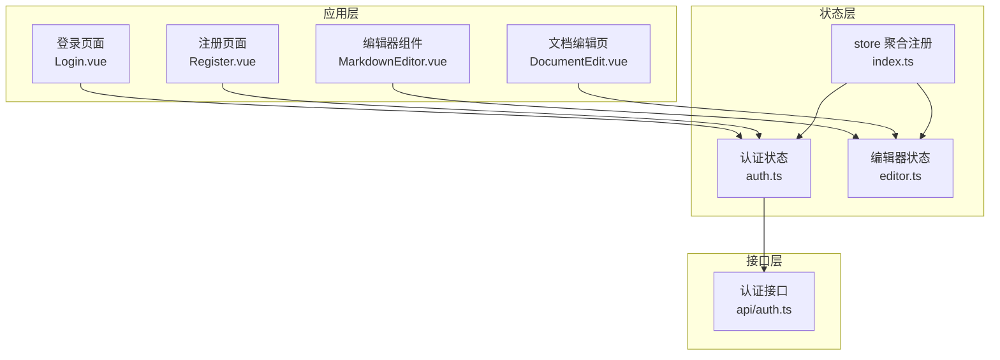
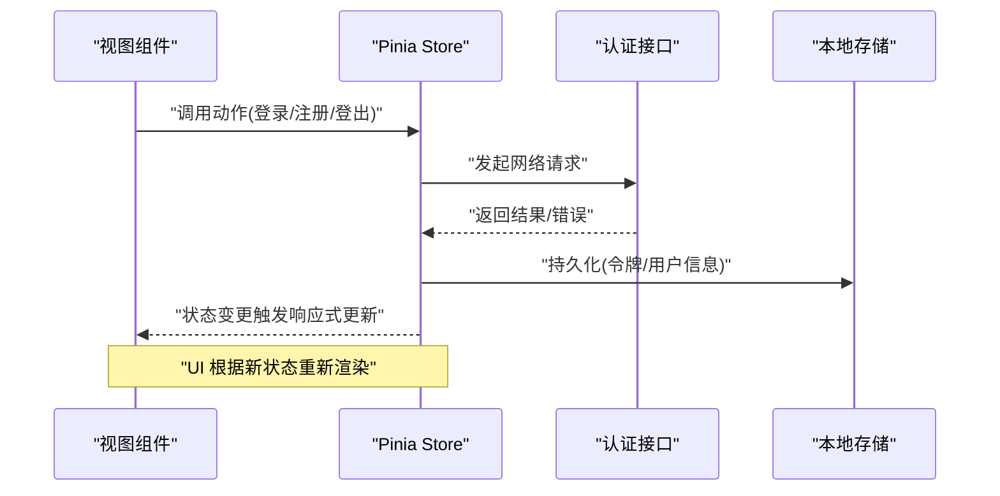
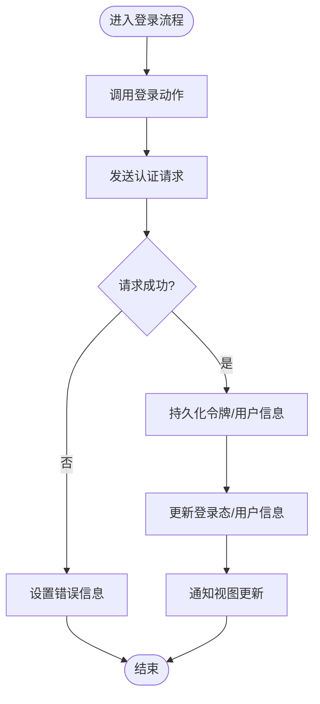
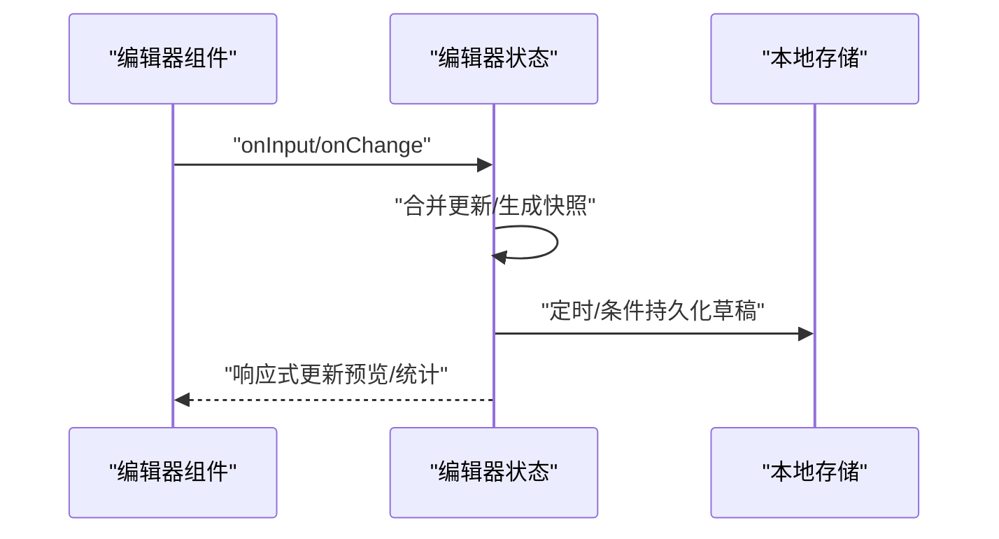
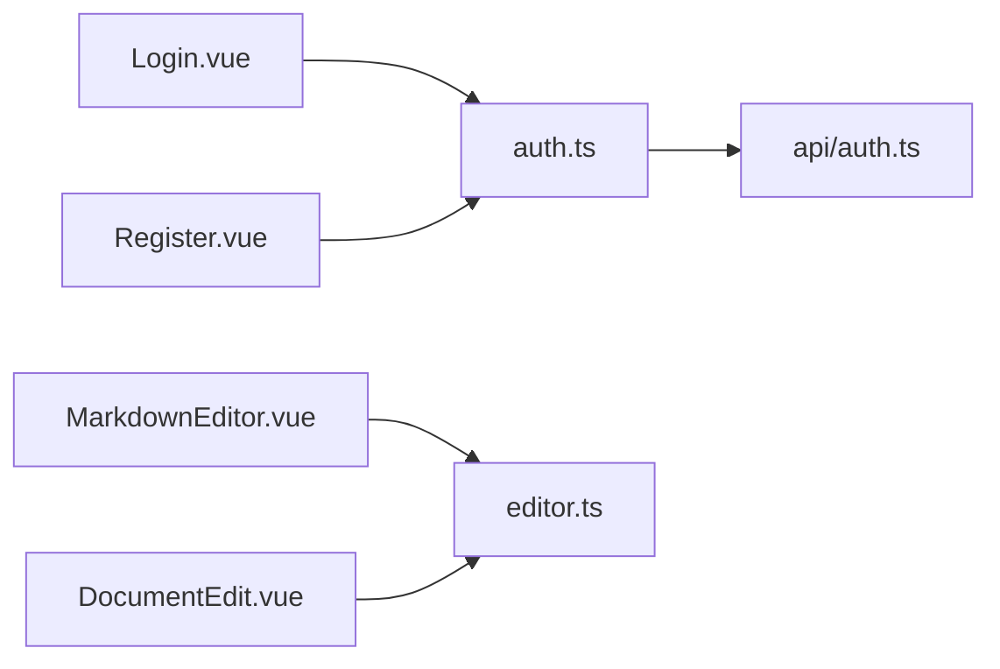

# 状态管理

<cite>
**本文引用的文件**
- [src/stores/index.ts](file://src/stores/index.ts)
- [src/stores/auth.ts](file://src/stores/auth.ts)
- [src/stores/editor.ts](file://src/stores/editor.ts)
- [src/api/auth.ts](file://src/api/auth.ts)
- [src/views/Login.vue](file://src/views/Login.vue)
- [src/views/Register.vue](file://src/views/Register.vue)
- [src/components/MarkdownEditor.vue](file://src/components/MarkdownEditor.vue)
- [src/views/DocumentEdit.vue](file://src/views/DocumentEdit.vue)
</cite>

## 目录
1. [简介](#简介)
2. [项目结构](#项目结构)
3. [核心组件](#核心组件)
4. [架构总览](#架构总览)
5. [详细组件分析](#详细组件分析)
6. [依赖关系分析](#依赖关系分析)
7. [性能考虑](#性能考虑)
8. [故障排查指南](#故障排查指南)
9. [结论](#结论)
10. [附录](#附录)

## 简介
本文件面向使用 Pinia 进行全局状态管理的工程，聚焦于认证状态与编辑器状态的组织方式、数据流、初始化与更新机制、持久化策略，以及在组件中读写 store 的最佳实践。文档同时提供调试技巧与性能优化建议，帮助你在复杂业务场景下稳定高效地维护状态。

## 项目结构
本项目采用按功能域划分的 stores 目录组织状态：
- 认证状态：负责登录态、用户信息、鉴权流程等
- 编辑器状态：负责 Markdown 编辑器的内容、光标位置、历史记录等
- 入口聚合：统一注册并导出各 store，供应用注入与使用

图表来源
- [src/stores/index.ts:1-200](file://src/stores/index.ts#L1-L200)
- [src/stores/auth.ts:1-200](file://src/stores/auth.ts#L1-L200)
- [src/stores/editor.ts:1-200](file://src/stores/editor.ts#L1-L200)
- [src/api/auth.ts:1-200](file://src/api/auth.ts#L1-L200)
- [src/views/Login.vue:1-200](file://src/views/Login.vue#L1-L200)
- [src/views/Register.vue:1-200](file://src/views/Register.vue#L1-L200)
- [src/components/MarkdownEditor.vue:1-200](file://src/components/MarkdownEditor.vue#L1-L200)
- [src/views/DocumentEdit.vue:1-200](file://src/views/DocumentEdit.vue#L1-L200)

章节来源
- [src/stores/index.ts:1-200](file://src/stores/index.ts#L1-L200)
- [src/stores/auth.ts:1-200](file://src/stores/auth.ts#L1-L200)
- [src/stores/editor.ts:1-200](file://src/stores/editor.ts#L1-L200)

## 核心组件
- 认证状态（auth）
  - 职责：维护登录态、用户信息、令牌、错误消息；封装登录/注册/登出等动作；处理服务端响应与本地持久化。
  - 关键能力：异步动作、错误处理、状态同步、持久化（如 token、用户信息）。
- 编辑器状态（editor）
  - 职责：维护文档内容、元数据、光标位置、撤销/重做历史、自动保存等。
  - 关键能力：增量更新、防抖/节流、版本快照、与 UI 的响应式绑定。
- 聚合注册（index）
  - 职责：创建并配置 Pinia 实例，挂载到应用；统一导出各 store，便于在组件中使用。

章节来源
- [src/stores/auth.ts:1-200](file://src/stores/auth.ts#L1-L200)
- [src/stores/editor.ts:1-200](file://src/stores/editor.ts#L1-L200)
- [src/stores/index.ts:1-200](file://src/stores/index.ts#L1-L200)

## 架构总览
下图展示了从视图到状态再到接口的完整数据流，以及状态如何驱动 UI 更新。

图表来源
- [src/stores/auth.ts:1-200](file://src/stores/auth.ts#L1-L200)
- [src/api/auth.ts:1-200](file://src/api/auth.ts#L1-L200)
- [src/views/Login.vue:1-200](file://src/views/Login.vue#L1-L200)
- [src/views/Register.vue:1-200](file://src/views/Register.vue#L1-L200)

## 详细组件分析

### 认证状态（auth.ts）
- 设计要点
  - 状态字段：登录态标志、用户信息、访问令牌、刷新令牌、错误信息等。
  - 动作方法：登录、注册、登出、刷新令牌、获取当前用户等。
  - 副作用：网络请求、错误捕获、路由跳转、本地存储读写。
  - 计算属性：是否已登录、权限判断、用户信息显示等。
  - 持久化：将敏感信息（如令牌）安全持久化，并在应用启动时恢复。
- 数据流
  - 组件调用动作 -> 调用认证接口 -> 更新状态 -> 持久化 -> 触发 UI 更新。
- 错误处理
  - 统一捕获网络异常与业务错误，设置错误消息并暴露给 UI。
- 最佳实践
  - 避免在组件中直接操作本地存储，所有持久化逻辑集中在 store。
  - 对敏感信息进行最小化持久化与及时清理。

图表来源
- [src/stores/auth.ts:1-200](file://src/stores/auth.ts#L1-L200)
- [src/api/auth.ts:1-200](file://src/api/auth.ts#L1-L200)
- [src/views/Login.vue:1-200](file://src/views/Login.vue#L1-L200)

章节来源
- [src/stores/auth.ts:1-200](file://src/stores/auth.ts#L1-L200)
- [src/api/auth.ts:1-200](file://src/api/auth.ts#L1-L200)
- [src/views/Login.vue:1-200](file://src/views/Login.vue#L1-L200)
- [src/views/Register.vue:1-200](file://src/views/Register.vue#L1-L200)

### 编辑器状态（editor.ts）
- 设计要点
  - 状态字段：文档内容、标题、标签、元数据、光标位置、选中范围、历史栈、草稿标记等。
  - 动作方法：更新内容、插入片段、撤销/重做、切换只读模式、保存/加载等。
  - 计算属性：字数统计、目录树、预览内容、是否有未保存更改等。
  - 持久化：自动保存草稿、版本快照、增量同步。
- 数据流
  - 组件输入事件 -> 触发 store 动作 -> 更新内容/历史 -> 触发预览/统计 -> 可选自动保存。
- 性能优化
  - 使用防抖/节流合并高频更新（如输入事件）。
  - 大文档分块渲染或虚拟滚动（结合编辑器能力）。
  - 仅对必要字段进行深拷贝与快照，减少内存占用。
- 与 UI 的协作
  - 通过响应式绑定实现双向同步，避免重复赋值。
  - 在组件销毁时释放监听与定时器，防止内存泄漏。

图表来源
- [src/stores/editor.ts:1-200](file://src/stores/editor.ts#L1-L200)
- [src/components/MarkdownEditor.vue:1-200](file://src/components/MarkdownEditor.vue#L1-L200)
- [src/views/DocumentEdit.vue:1-200](file://src/views/DocumentEdit.vue#L1-L200)

章节来源
- [src/stores/editor.ts:1-200](file://src/stores/editor.ts#L1-L200)
- [src/components/MarkdownEditor.vue:1-200](file://src/components/MarkdownEditor.vue#L1-L200)
- [src/views/DocumentEdit.vue:1-200](file://src/views/DocumentEdit.vue#L1-L200)

### 聚合注册（index.ts）
- 职责
  - 创建 Pinia 实例，安装插件（如持久化插件），挂载到 Vue 应用。
  - 统一导出各 store，确保类型提示与模块边界清晰。
- 注意事项
  - 插件顺序影响行为（例如先注册再启用持久化）。
  - 避免在应用启动前多次创建实例。

章节来源
- [src/stores/index.ts:1-200](file://src/stores/index.ts#L1-L200)

## 依赖关系分析
- 组件依赖 store：Login、Register 依赖 auth；MarkdownEditor、DocumentEdit 依赖 editor。
- store 依赖 API：auth 依赖认证接口；editor 可能依赖文档接口（若涉及云端同步）。
- 聚合层解耦：index 作为唯一入口，降低耦合度，便于测试与替换实现。

图表来源
- [src/stores/auth.ts:1-200](file://src/stores/auth.ts#L1-L200)
- [src/stores/editor.ts:1-200](file://src/stores/editor.ts#L1-L200)
- [src/api/auth.ts:1-200](file://src/api/auth.ts#L1-L200)
- [src/views/Login.vue:1-200](file://src/views/Login.vue#L1-L200)
- [src/views/Register.vue:1-200](file://src/views/Register.vue#L1-L200)
- [src/components/MarkdownEditor.vue:1-200](file://src/components/MarkdownEditor.vue#L1-L200)
- [src/views/DocumentEdit.vue:1-200](file://src/views/DocumentEdit.vue#L1-L200)

章节来源
- [src/stores/auth.ts:1-200](file://src/stores/auth.ts#L1-L200)
- [src/stores/editor.ts:1-200](file://src/stores/editor.ts#L1-L200)
- [src/api/auth.ts:1-200](file://src/api/auth.ts#L1-L200)

## 性能考虑
- 输入优化
  - 对高频输入事件使用防抖/节流，减少不必要的状态更新与渲染。
- 状态粒度
  - 拆分细粒度 store，避免单一大对象导致的全量重渲染。
- 计算属性
  - 使用计算属性缓存派生数据，避免重复计算。
- 懒加载
  - 按需引入 store 与组件，减少首屏体积。
- 持久化
  - 合理选择持久化时机与策略，避免阻塞主线程。
- 内存管理
  - 在组件卸载时移除监听器、取消定时器与订阅，防止泄漏。

[本节为通用指导，不直接分析具体文件]

## 故障排查指南
- 常见问题
  - 状态未更新：检查是否在 store 的动作中正确修改状态，而非直接修改外部变量。
  - 持久化失效：确认持久化插件已正确安装且键名一致；检查浏览器存储权限。
  - 网络错误：查看接口返回码与错误消息，定位是参数错误还是服务端异常。
  - 内存泄漏：检查编辑器组件是否正确清理事件监听与定时器。
- 调试技巧
  - 使用浏览器开发者工具的 Pinia 面板观察状态变化与动作调用。
  - 在关键动作前后打印日志，记录入参与返回值。
  - 对复杂状态变更添加断点，逐步跟踪执行路径。
- 回滚与恢复
  - 为编辑器状态保留历史快照，支持撤销/重做与崩溃恢复。
  - 对认证状态提供“退出登录”快速清理本地数据的能力。

章节来源
- [src/stores/auth.ts:1-200](file://src/stores/auth.ts#L1-L200)
- [src/stores/editor.ts:1-200](file://src/stores/editor.ts#L1-L200)
- [src/components/MarkdownEditor.vue:1-200](file://src/components/MarkdownEditor.vue#L1-L200)

## 结论
通过清晰的 store 划分与规范的数据流，本项目实现了可维护、可扩展的状态管理。认证状态与编辑器状态分别承担鉴权与编辑两大核心领域，配合聚合注册与接口层，形成稳定的分层架构。遵循本文的最佳实践与性能优化建议，可在保证用户体验的同时提升开发效率与系统稳定性。

[本节为总结性内容，不直接分析具体文件]

## 附录
- 在组件中使用 store 的推荐方式
  - 使用组合式函数或 setup 语法获取 store 实例，并通过 actions 更新状态。
  - 将状态以计算属性的形式暴露给模板，避免在模板中直接调用复杂逻辑。
  - 对频繁更新的输入事件进行防抖/节流后再写入 store。
- 持久化策略建议
  - 认证相关：仅持久化必要的令牌与用户标识，定期刷新或过期清理。
  - 编辑器相关：草稿自动保存，版本化存储，支持离线编辑与冲突合并。
- 测试建议
  - 对 store 的动作编写单元测试，模拟网络请求与本地存储行为。
  - 对组件进行集成测试，验证状态变化与 UI 渲染的一致性。

[本节为补充说明，不直接分析具体文件]