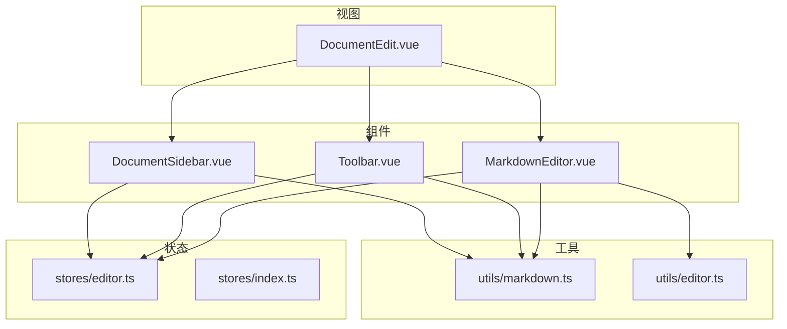
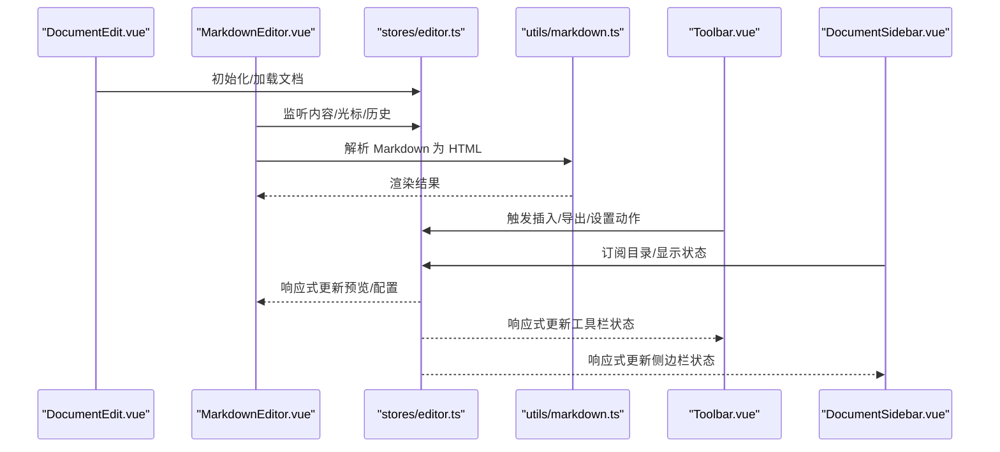
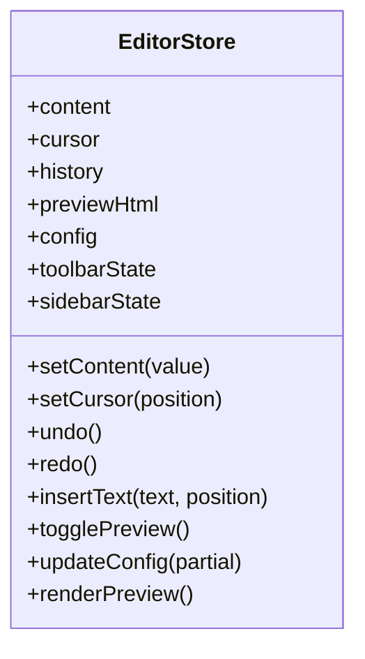
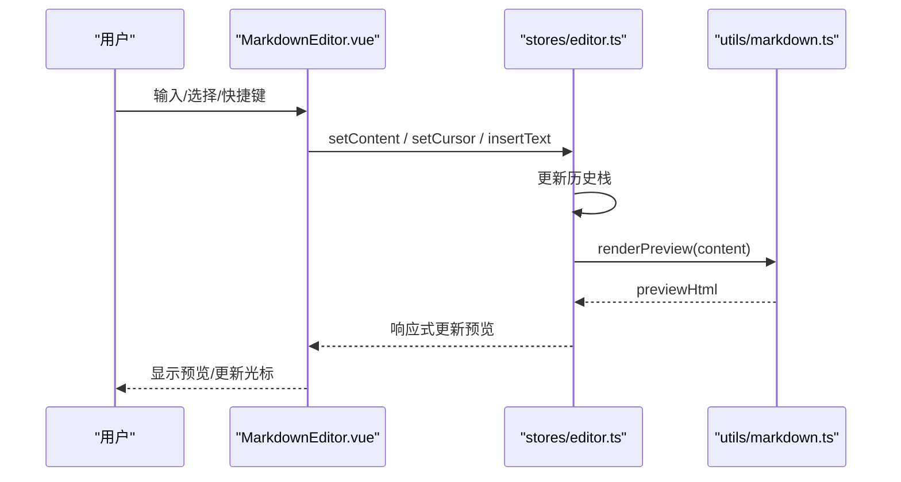
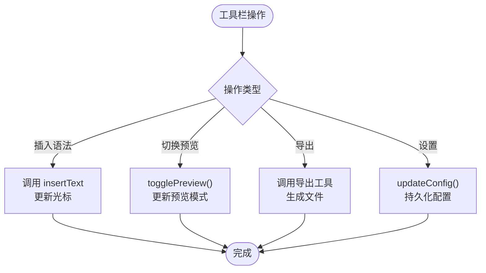
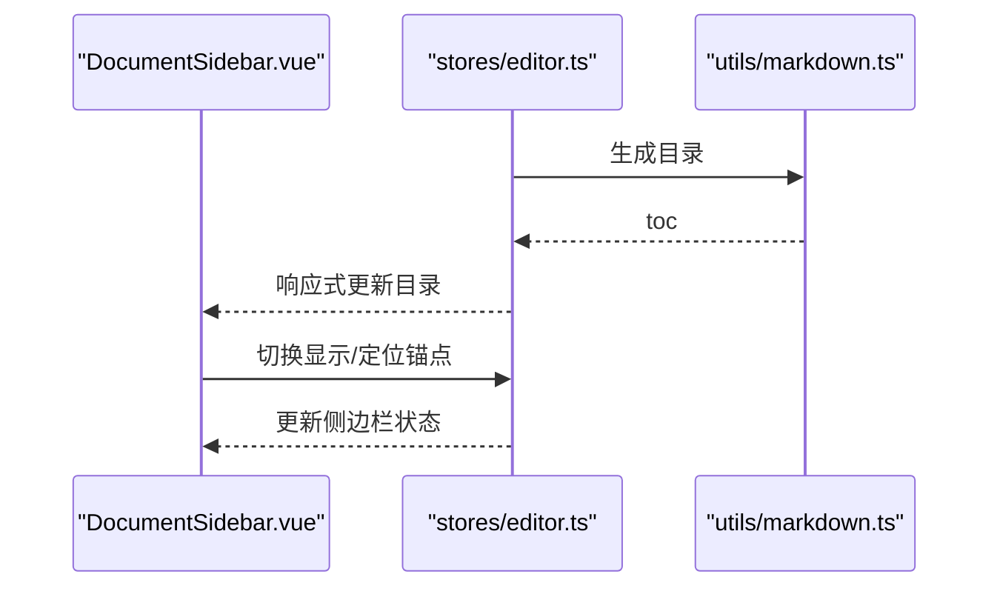
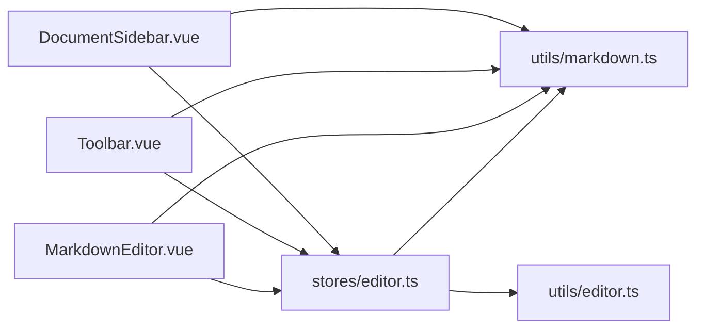

# 编辑器状态管理

<cite>
**本文引用的文件**
- [src/stores/editor.ts](file://src/stores/editor.ts)
- [src/components/MarkdownEditor.vue](file://src/components/MarkdownEditor.vue)
- [src/components/Toolbar.vue](file://src/components/Toolbar.vue)
- [src/components/DocumentSidebar.vue](file://src/components/DocumentSidebar.vue)
- [src/views/DocumentEdit.vue](file://src/views/DocumentEdit.vue)
- [src/utils/markdown.ts](file://src/utils/markdown.ts)
- [src/utils/editor.ts](file://src/utils/editor.ts)
- [src/types/index.ts](file://src/types/index.ts)
- [src/stores/index.ts](file://src/stores/index.ts)
</cite>

## 目录
1. [简介](#简介)
2. [项目结构](#项目结构)
3. [核心组件](#核心组件)
4. [架构总览](#架构总览)
5. [详细组件分析](#详细组件分析)
6. [依赖关系分析](#依赖关系分析)
7. [性能考虑](#性能考虑)
8. [故障排查指南](#故障排查指南)
9. [结论](#结论)
10. [附录](#附录)

## 简介
本文件面向 Markdown 编辑器的全局状态管理与双向绑定，围绕以下内容展开：
- 编辑器内容状态结构、光标位置管理、撤销重做历史
- 实时预览状态同步机制
- 编辑器配置状态、工具栏状态、侧边栏显示状态的管理
- 跨组件共享与双向绑定实现
- 大文件处理、内存管理与渲染优化策略

目标是帮助开发者快速理解并扩展编辑器状态体系，确保在复杂交互场景下的稳定性与性能。

## 项目结构
本项目采用“视图-组件-状态-工具”的分层组织方式：
- 视图层：页面级容器（如文档编辑页）负责编排组件与路由数据
- 组件层：编辑器、工具栏、侧边栏等 UI 组件
- 状态层：基于 store 的全局状态（编辑器、认证等）
- 工具层：Markdown 解析、导出、统计、目录生成等能力

图表来源
- [src/views/DocumentEdit.vue](file://src/views/DocumentEdit.vue)
- [src/components/MarkdownEditor.vue](file://src/components/MarkdownEditor.vue)
- [src/components/Toolbar.vue](file://src/components/Toolbar.vue)
- [src/components/DocumentSidebar.vue](file://src/components/DocumentSidebar.vue)
- [src/stores/editor.ts](file://src/stores/editor.ts)
- [src/stores/index.ts](file://src/stores/index.ts)
- [src/utils/markdown.ts](file://src/utils/markdown.ts)
- [src/utils/editor.ts](file://src/utils/editor.ts)

章节来源
- [src/views/DocumentEdit.vue](file://src/views/DocumentEdit.vue)
- [src/components/MarkdownEditor.vue](file://src/components/MarkdownEditor.vue)
- [src/components/Toolbar.vue](file://src/components/Toolbar.vue)
- [src/components/DocumentSidebar.vue](file://src/components/DocumentSidebar.vue)
- [src/stores/editor.ts](file://src/stores/editor.ts)
- [src/stores/index.ts](file://src/stores/index.ts)
- [src/utils/markdown.ts](file://src/utils/markdown.ts)
- [src/utils/editor.ts](file://src/utils/editor.ts)

## 核心组件
- 编辑器状态存储（stores/editor.ts）：集中管理编辑器内容、光标、历史、预览、配置、工具栏与侧边栏状态，并提供动作方法用于变更状态与副作用处理。
- Markdown 编辑器组件（components/MarkdownEditor.vue）：承载输入、光标、历史、预览渲染，并与 store 进行双向绑定。
- 工具栏组件（components/Toolbar.vue）：提供插入语法、导出、设置等操作，调用 store 的动作更新状态或触发副作用。
- 文档侧边栏组件（components/DocumentSidebar.vue）：展示目录、文档列表等，订阅 store 中的相关状态变化。
- 页面容器（views/DocumentEdit.vue）：组合上述组件，完成初始化、数据加载与生命周期管理。

章节来源
- [src/stores/editor.ts](file://src/stores/editor.ts)
- [src/components/MarkdownEditor.vue](file://src/components/MarkdownEditor.vue)
- [src/components/Toolbar.vue](file://src/components/Toolbar.vue)
- [src/components/DocumentSidebar.vue](file://src/components/DocumentSidebar.vue)
- [src/views/DocumentEdit.vue](file://src/views/DocumentEdit.vue)

## 架构总览
编辑器状态管理的核心是“单一事实源”的 store，所有组件通过读取与派发动作来访问和修改状态。预览渲染由 Markdown 工具函数驱动，编辑器事件（输入、光标移动、快捷键）统一汇聚到 store 中处理，保证状态一致性与可追踪性。

图表来源
- [src/views/DocumentEdit.vue](file://src/views/DocumentEdit.vue)
- [src/components/MarkdownEditor.vue](file://src/components/MarkdownEditor.vue)
- [src/stores/editor.ts](file://src/stores/editor.ts)
- [src/utils/markdown.ts](file://src/utils/markdown.ts)
- [src/components/Toolbar.vue](file://src/components/Toolbar.vue)
- [src/components/DocumentSidebar.vue](file://src/components/DocumentSidebar.vue)

## 详细组件分析

### 编辑器状态存储（stores/editor.ts）
职责
- 定义编辑器全局状态：内容、光标位置、撤销/重做历史、预览 HTML、配置项、工具栏状态、侧边栏显示状态等
- 暴露读写接口：获取当前值、设置新值、执行动作（如插入文本、切换主题、切换预览模式、更新目录等）
- 管理副作用：如将内容持久化、触发预览渲染、更新统计信息等

设计要点
- 使用响应式数据结构，确保组件自动更新
- 对高频操作进行节流/防抖，避免过度计算
- 历史栈按操作粒度拆分，支持撤销/重做
- 预览渲染与编辑器解耦，通过工具函数转换

图表来源
- [src/stores/editor.ts](file://src/stores/editor.ts)

章节来源
- [src/stores/editor.ts](file://src/stores/editor.ts)

### Markdown 编辑器组件（components/MarkdownEditor.vue）
职责
- 双向绑定编辑器内容与光标位置
- 监听输入事件，触发 store 的内容更新与历史记录追加
- 订阅预览状态，渲染 Markdown 为 HTML
- 处理快捷键（如撤销/重做、插入语法）

关键流程
- 输入时：更新内容 -> 追加历史 -> 触发预览渲染（可能带节流）
- 光标移动：更新光标位置 -> 同步到 store
- 快捷键：调用 store 的 undo/redo/insertText 等方法

图表来源
- [src/components/MarkdownEditor.vue](file://src/components/MarkdownEditor.vue)
- [src/stores/editor.ts](file://src/stores/editor.ts)
- [src/utils/markdown.ts](file://src/utils/markdown.ts)

章节来源
- [src/components/MarkdownEditor.vue](file://src/components/MarkdownEditor.vue)
- [src/stores/editor.ts](file://src/stores/editor.ts)
- [src/utils/markdown.ts](file://src/utils/markdown.ts)

### 工具栏组件（components/Toolbar.vue）
职责
- 提供常用操作按钮：加粗、斜体、标题、链接、图片、导出、设置等
- 调用 store 的动作插入文本、切换主题、切换预览模式、更新配置
- 根据 store 的状态控制按钮可用性与选中态

交互示例
- 点击“插入链接”：从 store 获取当前光标位置，插入模板文本，恢复光标
- 点击“导出”：调用导出工具，生成文件并下载
- 点击“设置”：打开设置面板，修改主题/字体/行高等配置

图表来源
- [src/components/Toolbar.vue](file://src/components/Toolbar.vue)
- [src/stores/editor.ts](file://src/stores/editor.ts)
- [src/utils/export.ts](file://src/utils/export.ts)

章节来源
- [src/components/Toolbar.vue](file://src/components/Toolbar.vue)
- [src/stores/editor.ts](file://src/stores/editor.ts)

### 文档侧边栏组件（components/DocumentSidebar.vue）
职责
- 展示文档目录、文档列表、搜索过滤等
- 订阅 store 中的目录与显示状态，动态更新 UI
- 支持折叠/展开、跳转定位等功能

状态同步
- 目录：由 Markdown 解析生成，存入 store，侧边栏只读订阅
- 显示状态：开关侧边栏、宽度、滚动锚点等，由 store 统一管理

图表来源
- [src/components/DocumentSidebar.vue](file://src/components/DocumentSidebar.vue)
- [src/stores/editor.ts](file://src/stores/editor.ts)
- [src/utils/markdown.ts](file://src/utils/markdown.ts)

章节来源
- [src/components/DocumentSidebar.vue](file://src/components/DocumentSidebar.vue)
- [src/stores/editor.ts](file://src/stores/editor.ts)
- [src/utils/markdown.ts](file://src/utils/markdown.ts)

### 页面容器（views/DocumentEdit.vue）
职责
- 组合编辑器、工具栏、侧边栏组件
- 负责文档数据的加载与保存（如从 API 拉取、本地缓存）
- 初始化 store 配置、监听生命周期事件（如卸载前清理）

章节来源
- [src/views/DocumentEdit.vue](file://src/views/DocumentEdit.vue)

## 依赖关系分析
- 组件依赖 store：所有 UI 组件通过 store 访问与修改状态，降低耦合度
- 工具函数被多个组件复用：Markdown 解析、导出、统计、目录生成等
- 类型定义集中管理：统一的数据结构与接口约束

图表来源
- [src/components/MarkdownEditor.vue](file://src/components/MarkdownEditor.vue)
- [src/components/Toolbar.vue](file://src/components/Toolbar.vue)
- [src/components/DocumentSidebar.vue](file://src/components/DocumentSidebar.vue)
- [src/stores/editor.ts](file://src/stores/editor.ts)
- [src/utils/markdown.ts](file://src/utils/markdown.ts)
- [src/utils/editor.ts](file://src/utils/editor.ts)

章节来源
- [src/stores/editor.ts](file://src/stores/editor.ts)
- [src/utils/markdown.ts](file://src/utils/markdown.ts)
- [src/utils/editor.ts](file://src/utils/editor.ts)

## 性能考虑
针对大文件与高频交互场景，建议以下优化策略：
- 预览渲染优化
  - 使用防抖/节流合并多次输入，减少重复解析
  - 增量渲染：仅对变更段落重新解析并拼接
  - Web Worker 异步解析，避免阻塞主线程
- 历史栈管理
  - 限制历史长度，定期压缩或归档旧记录
  - 按操作粒度拆分，避免单次操作产生过多历史条目
- 内存管理
  - 及时释放不再使用的 DOM 引用与监听器
  - 大文件分块加载与虚拟滚动，减少初始渲染压力
- 渲染优化
  - 使用 key 稳定列表项，提高 Diff 效率
  - 懒加载非首屏内容（如图片、目录）
- 工具函数优化
  - 缓存解析结果（按内容哈希），避免重复计算
  - 对正则与字符串操作进行性能敏感优化

[本节为通用指导，不直接分析具体文件]

## 故障排查指南
常见问题与定位思路
- 预览不更新
  - 检查 store 是否收到内容变更事件
  - 确认 Markdown 解析是否抛出异常
  - 验证防抖/节流参数是否过大导致延迟
- 撤销/重做失效
  - 检查历史栈是否正确追加与弹出
  - 确认操作是否被错误地跳过或合并
- 光标位置错乱
  - 核对光标位置与内容长度的边界条件
  - 检查插入/删除后是否同步更新光标
- 内存泄漏
  - 检查组件卸载时是否清理事件监听与定时器
  - 确认大对象引用是否被释放

章节来源
- [src/stores/editor.ts](file://src/stores/editor.ts)
- [src/components/MarkdownEditor.vue](file://src/components/MarkdownEditor.vue)
- [src/utils/markdown.ts](file://src/utils/markdown.ts)

## 结论
通过统一的 store 管理编辑器全局状态，结合组件的双向绑定与工具函数的解耦，实现了可扩展、可维护且高性能的 Markdown 编辑器状态体系。建议在后续迭代中持续完善历史压缩、增量渲染与异步解析，以应对更大规模的内容与更复杂的交互场景。

## 附录
- 类型定义参考：[src/types/index.ts](file://src/types/index.ts)
- 状态聚合入口：[src/stores/index.ts](file://src/stores/index.ts)
- 编辑器辅助工具：[src/utils/editor.ts](file://src/utils/editor.ts)
- Markdown 解析与导出：[src/utils/markdown.ts](file://src/utils/markdown.ts)