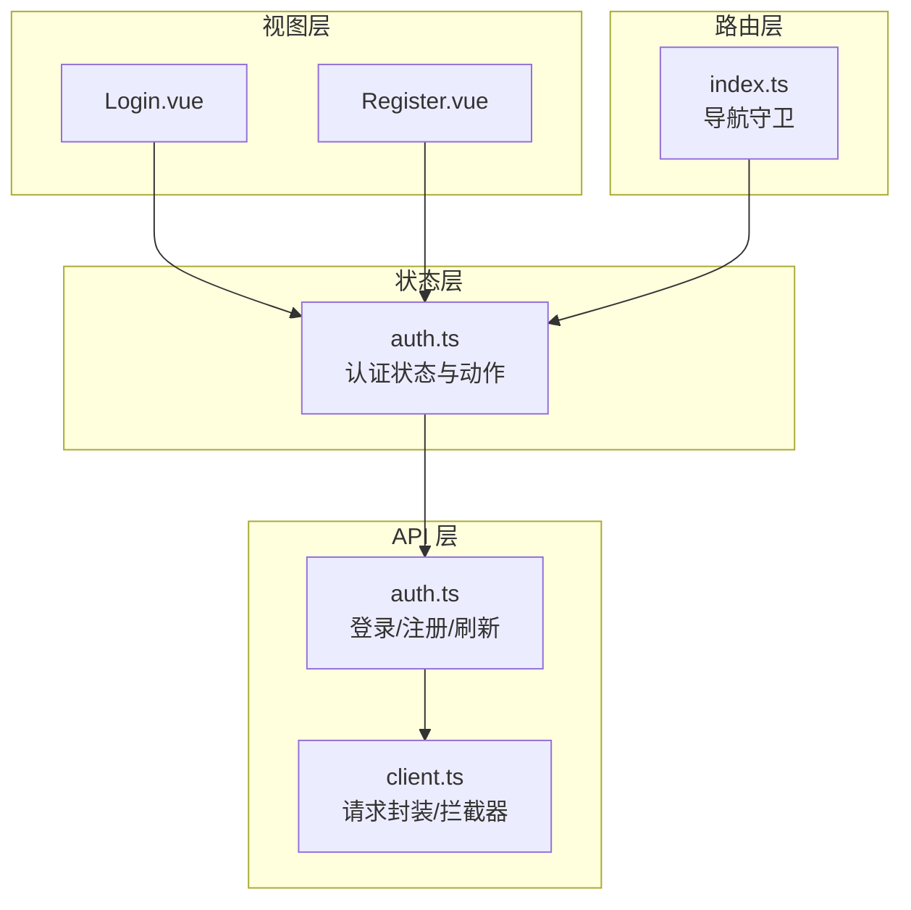
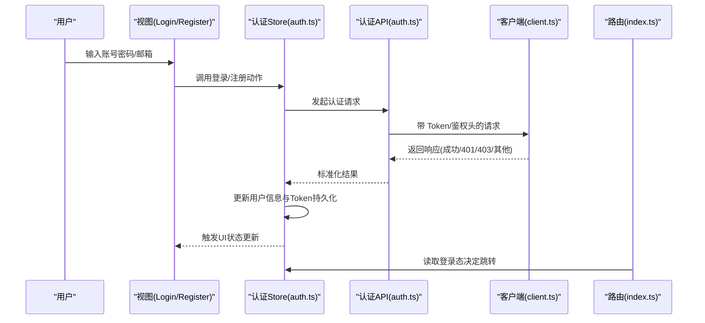
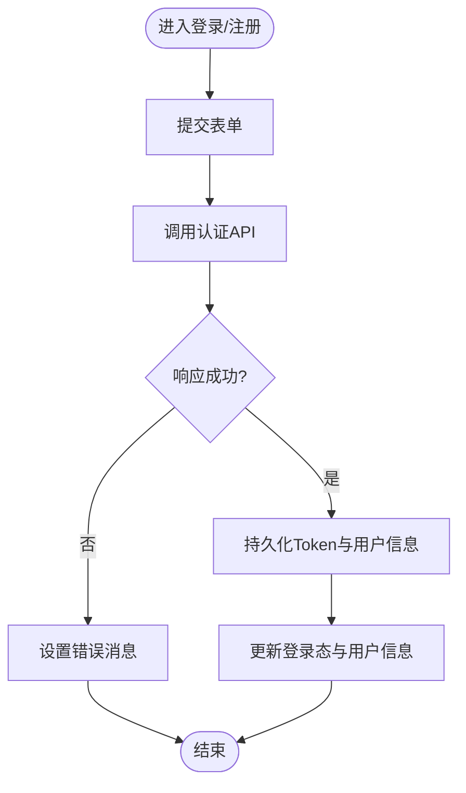
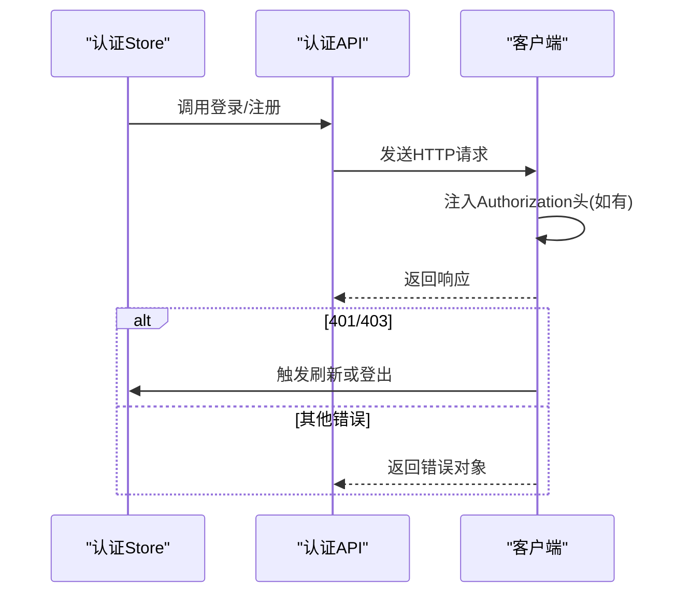
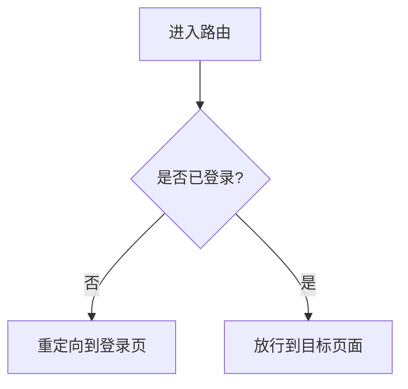
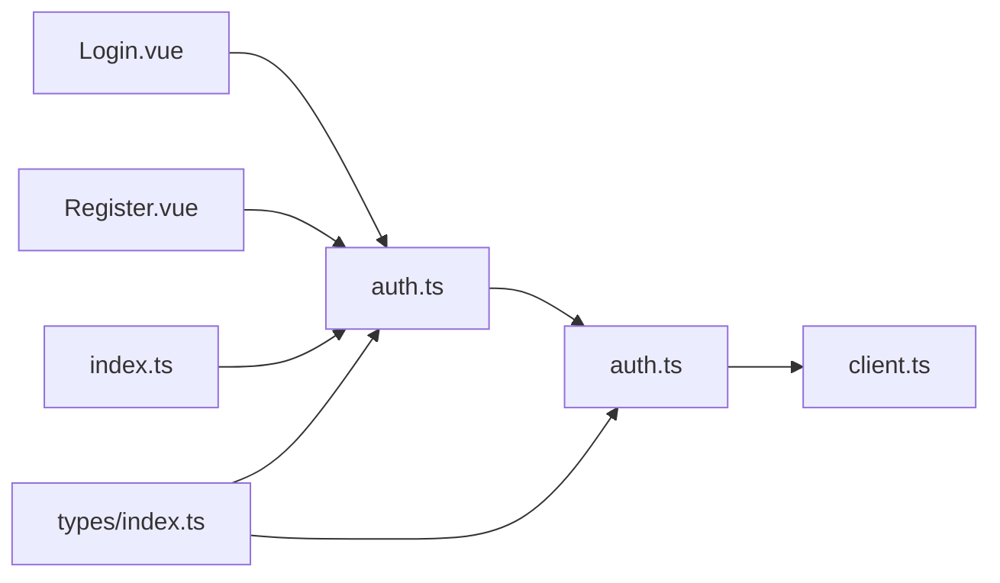

# 认证状态管理

<cite>
**本文引用的文件**
- [src/stores/auth.ts](file://src/stores/auth.ts)
- [src/api/auth.ts](file://src/api/auth.ts)
- [src/api/client.ts](file://src/api/client.ts)
- [src/views/Login.vue](file://src/views/Login.vue)
- [src/views/Register.vue](file://src/views/Register.vue)
- [src/router/index.ts](file://src/router/index.ts)
- [src/types/index.ts](file://src/types/index.ts)
</cite>

## 目录
1. [简介](#简介)
2. [项目结构](#项目结构)
3. [核心组件](#核心组件)
4. [架构总览](#架构总览)
5. [详细组件分析](#详细组件分析)
6. [依赖关系分析](#依赖关系分析)
7. [性能考虑](#性能考虑)
8. [故障排查指南](#故障排查指南)
9. [结论](#结论)
10. [附录](#附录)

## 简介
本文件面向前端工程中的认证状态管理，系统性说明用户登录、注册、会话管理等认证相关状态的实现与使用。重点覆盖：
- 用户信息的存储结构与生命周期
- 登录/注册流程的状态流转与错误处理
- 认证 token 的持久化策略与自动登录机制
- 登出清理逻辑与路由守卫配合
- 在组件中如何使用认证 store 获取当前用户、检查登录态、处理错误
- 与后端 API 的交互方式及错误处理机制

## 项目结构
围绕认证的核心文件分布如下：
- 状态管理：stores/auth.ts（认证状态与动作）
- API 层：api/auth.ts（登录、注册、刷新等接口），api/client.ts（请求封装、拦截器）
- 视图层：views/Login.vue、views/Register.vue（表单与交互）
- 路由：router/index.ts（导航守卫、访问控制）
- 类型定义：types/index.ts（用户信息、API 响应等类型）

图表来源
- [src/stores/auth.ts:1-200](file://src/stores/auth.ts#L1-L200)
- [src/api/auth.ts:1-200](file://src/api/auth.ts#L1-L200)
- [src/api/client.ts:1-200](file://src/api/client.ts#L1-L200)
- [src/views/Login.vue:1-200](file://src/views/Login.vue#L1-L200)
- [src/views/Register.vue:1-200](file://src/views/Register.vue#L1-L200)
- [src/router/index.ts:1-200](file://src/router/index.ts#L1-L200)

章节来源
- [src/stores/auth.ts:1-200](file://src/stores/auth.ts#L1-L200)
- [src/api/auth.ts:1-200](file://src/api/auth.ts#L1-L200)
- [src/api/client.ts:1-200](file://src/api/client.ts#L1-L200)
- [src/views/Login.vue:1-200](file://src/views/Login.vue#L1-L200)
- [src/views/Register.vue:1-200](file://src/views/Register.vue#L1-L200)
- [src/router/index.ts:1-200](file://src/router/index.ts#L1-L200)

## 核心组件
- 认证 Store（auth.ts）
  - 负责维护当前用户信息、登录态、token、错误消息等状态
  - 提供登录、注册、登出、刷新 token、初始化自动登录等方法
  - 与 API 层协作完成网络请求，并统一处理成功/失败分支
- API 客户端（client.ts）
  - 封装 fetch/axios 调用，设置默认头、超时、错误重试等
  - 通过请求/响应拦截器注入/校验 token，处理 401/403 等全局错误
- 认证 API（auth.ts）
  - 暴露登录、注册、刷新 token 等函数，返回标准化结果
- 视图组件（Login.vue、Register.vue）
  - 收集表单数据，调用认证 store 的动作，展示加载与错误状态
- 路由守卫（index.ts）
  - 基于认证状态进行页面访问控制，未登录时重定向到登录页

章节来源
- [src/stores/auth.ts:1-200](file://src/stores/auth.ts#L1-L200)
- [src/api/client.ts:1-200](file://src/api/client.ts#L1-L200)
- [src/api/auth.ts:1-200](file://src/api/auth.ts#L1-L200)
- [src/views/Login.vue:1-200](file://src/views/Login.vue#L1-L200)
- [src/views/Register.vue:1-200](file://src/views/Register.vue#L1-L200)
- [src/router/index.ts:1-200](file://src/router/index.ts#L1-L200)

## 架构总览
认证流程由“视图 -> 状态 -> API -> 客户端”构成闭环，路由守卫作为入口控制访问权限。

图表来源
- [src/stores/auth.ts:1-200](file://src/stores/auth.ts#L1-L200)
- [src/api/auth.ts:1-200](file://src/api/auth.ts#L1-L200)
- [src/api/client.ts:1-200](file://src/api/client.ts#L1-L200)
- [src/views/Login.vue:1-200](file://src/views/Login.vue#L1-L200)
- [src/views/Register.vue:1-200](file://src/views/Register.vue#L1-L200)
- [src/router/index.ts:1-200](file://src/router/index.ts#L1-L200)

## 详细组件分析

### 认证 Store（auth.ts）
职责
- 维护状态：当前用户信息、是否已登录、token、错误消息、加载状态
- 暴露动作：登录、注册、登出、刷新 token、初始化自动登录
- 持久化：将 token 与必要用户信息写入本地存储（如 localStorage/sessionStorage）
- 错误处理：捕获网络与业务错误，设置错误消息供 UI 展示

关键流程
- 登录/注册：提交凭证 -> 调用 API -> 成功后保存 token 和用户信息 -> 更新登录态
- 自动登录：应用启动时尝试从本地存储恢复 token，必要时调用刷新接口验证有效性
- 登出：清除本地存储中的 token 与用户信息，重置状态为未登录

图表来源
- [src/stores/auth.ts:1-200](file://src/stores/auth.ts#L1-L200)

章节来源
- [src/stores/auth.ts:1-200](file://src/stores/auth.ts#L1-L200)

### API 客户端（client.ts）
职责
- 统一请求封装：设置基础 URL、超时、默认头
- 拦截器：
  - 请求前：注入 Authorization 头（若存在 token）
  - 响应后：处理 401/403，触发刷新或登出；统一错误格式
- 错误处理：区分网络错误与业务错误，抛出结构化异常

图表来源
- [src/api/client.ts:1-200](file://src/api/client.ts#L1-L200)
- [src/api/auth.ts:1-200](file://src/api/auth.ts#L1-L200)
- [src/stores/auth.ts:1-200](file://src/stores/auth.ts#L1-L200)

章节来源
- [src/api/client.ts:1-200](file://src/api/client.ts#L1-L200)
- [src/api/auth.ts:1-200](file://src/api/auth.ts#L1-L200)

### 认证 API（auth.ts）
职责
- 定义登录、注册、刷新 token 等接口函数
- 对后端返回数据进行标准化，便于 Store 消费

典型行为
- 登录：提交用户名/邮箱与密码，返回 token 与用户基本信息
- 注册：提交注册信息，返回创建结果
- 刷新：使用 refresh token 换取新 access token

章节来源
- [src/api/auth.ts:1-200](file://src/api/auth.ts#L1-L200)

### 视图组件（Login.vue / Register.vue）
职责
- 收集用户输入，绑定加载与错误状态
- 调用认证 store 的登录/注册动作
- 根据返回结果进行页面跳转或提示

使用示例（以路径代替代码内容）
- 获取当前用户信息：参考 [src/stores/auth.ts:1-200](file://src/stores/auth.ts#L1-L200)
- 检查登录状态：参考 [src/stores/auth.ts:1-200](file://src/stores/auth.ts#L1-L200)
- 处理认证错误：参考 [src/stores/auth.ts:1-200](file://src/stores/auth.ts#L1-L200)

章节来源
- [src/views/Login.vue:1-200](file://src/views/Login.vue#L1-L200)
- [src/views/Register.vue:1-200](file://src/views/Register.vue#L1-L200)
- [src/stores/auth.ts:1-200](file://src/stores/auth.ts#L1-L200)

### 路由守卫（index.ts）
职责
- 基于认证状态保护受保护路由
- 未登录时重定向至登录页，携带可选的重定向参数
- 登录后按意图跳转

图表来源
- [src/router/index.ts:1-200](file://src/router/index.ts#L1-L200)
- [src/stores/auth.ts:1-200](file://src/stores/auth.ts#L1-L200)

章节来源
- [src/router/index.ts:1-200](file://src/router/index.ts#L1-L200)

## 依赖关系分析
- 视图组件依赖认证 Store 暴露的状态与动作
- 认证 Store 依赖认证 API，API 依赖客户端封装
- 路由守卫依赖认证 Store 的登录态
- 类型定义被多处复用，保证前后端数据结构一致

图表来源
- [src/stores/auth.ts:1-200](file://src/stores/auth.ts#L1-L200)
- [src/api/auth.ts:1-200](file://src/api/auth.ts#L1-L200)
- [src/api/client.ts:1-200](file://src/api/client.ts#L1-L200)
- [src/views/Login.vue:1-200](file://src/views/Login.vue#L1-L200)
- [src/views/Register.vue:1-200](file://src/views/Register.vue#L1-L200)
- [src/router/index.ts:1-200](file://src/router/index.ts#L1-L200)
- [src/types/index.ts:1-200](file://src/types/index.ts#L1-L200)

章节来源
- [src/stores/auth.ts:1-200](file://src/stores/auth.ts#L1-L200)
- [src/api/auth.ts:1-200](file://src/api/auth.ts#L1-L200)
- [src/api/client.ts:1-200](file://src/api/client.ts#L1-L200)
- [src/views/Login.vue:1-200](file://src/views/Login.vue#L1-L200)
- [src/views/Register.vue:1-200](file://src/views/Register.vue#L1-L200)
- [src/router/index.ts:1-200](file://src/router/index.ts#L1-L200)
- [src/types/index.ts:1-200](file://src/types/index.ts#L1-L200)

## 性能考虑
- 减少重复请求：利用客户端缓存或防抖避免频繁刷新 token
- 懒加载与按需请求：仅在需要时发起认证相关请求
- 错误快速失败：在网络层尽早识别不可用服务，缩短等待时间
- 本地存储读写优化：合并多次写入，避免频繁 I/O

[本节为通用指导，不直接分析具体文件]

## 故障排查指南
常见问题与定位建议
- 401 未授权
  - 检查客户端拦截器是否正确注入 Authorization 头
  - 确认 token 是否有效或已过期，必要时触发刷新流程
  - 参考：[src/api/client.ts:1-200](file://src/api/client.ts#L1-L200)、[src/stores/auth.ts:1-200](file://src/stores/auth.ts#L1-L200)
- 403 禁止访问
  - 检查用户权限与路由守卫配置
  - 参考：[src/router/index.ts:1-200](file://src/router/index.ts#L1-L200)
- 网络错误/超时
  - 检查客户端超时配置与重试策略
  - 参考：[src/api/client.ts:1-200](file://src/api/client.ts#L1-L200)
- 本地存储异常
  - 检查浏览器存储限制与隐私模式影响
  - 确保登出时正确清理 token 与用户信息
  - 参考：[src/stores/auth.ts:1-200](file://src/stores/auth.ts#L1-L200)

章节来源
- [src/api/client.ts:1-200](file://src/api/client.ts#L1-L200)
- [src/stores/auth.ts:1-200](file://src/stores/auth.ts#L1-L200)
- [src/router/index.ts:1-200](file://src/router/index.ts#L1-L200)

## 结论
本方案通过“视图-状态-API-客户端-路由”的分层设计，实现了完整的认证状态管理：
- 清晰的登录/注册/登出流程
- 可靠的 token 持久化与自动登录
- 统一的前端错误处理与用户体验反馈
- 基于路由的访问控制
建议在后续迭代中补充更完善的权限模型与多角色支持，并完善单元测试与端到端测试。

[本节为总结性内容，不直接分析具体文件]

## 附录
- 在组件中使用认证 store 的常见用法（以路径代替代码）
  - 获取当前用户信息：[src/stores/auth.ts:1-200](file://src/stores/auth.ts#L1-L200)
  - 检查登录状态：[src/stores/auth.ts:1-200](file://src/stores/auth.ts#L1-L200)
  - 处理认证错误：[src/stores/auth.ts:1-200](file://src/stores/auth.ts#L1-L200)
- 与后端 API 的交互方式
  - 登录/注册/刷新：[src/api/auth.ts:1-200](file://src/api/auth.ts#L1-L200)
  - 请求封装与拦截器：[src/api/client.ts:1-200](file://src/api/client.ts#L1-L200)
- 类型定义参考
  - 用户信息、API 响应等：[src/types/index.ts:1-200](file://src/types/index.ts#L1-L200)