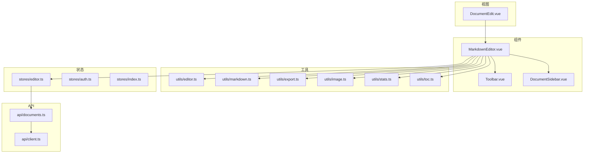
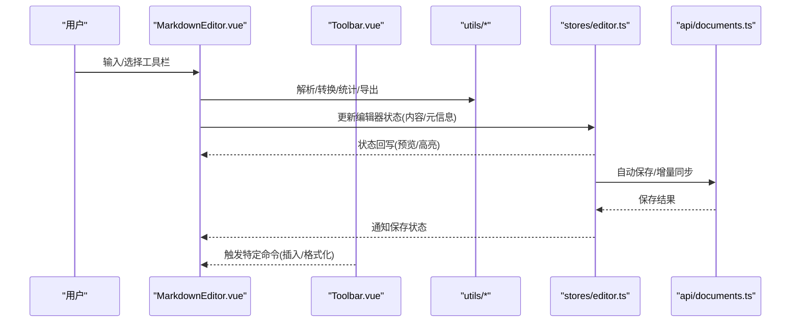
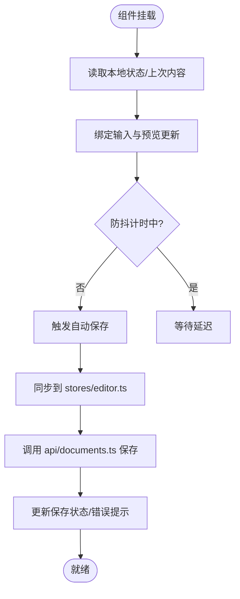
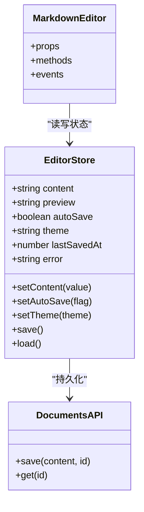
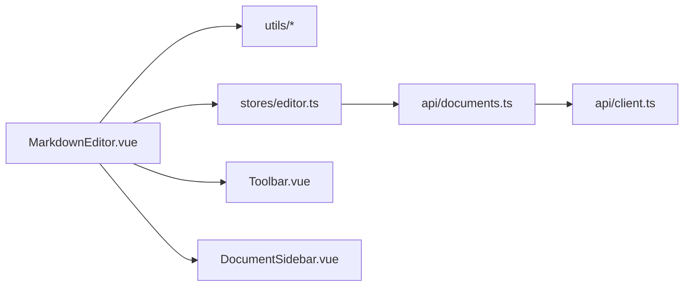

# Markdown编辑器组件

<cite>
**本文档引用的文件**
- [MarkdownEditor.vue](file://src/components/MarkdownEditor.vue)
- [Toolbar.vue](file://src/components/Toolbar.vue)
- [DocumentSidebar.vue](file://src/components/DocumentSidebar.vue)
- [editor.ts](file://src/utils/editor.ts)
- [markdown.ts](file://src/utils/markdown.ts)
- [export.ts](file://src/utils/export.ts)
- [image.ts](file://src/utils/image.ts)
- [stats.ts](file://src/utils/stats.ts)
- [toc.ts](file://src/utils/toc.ts)
- [editor.ts](file://src/stores/editor.ts)
- [auth.ts](file://src/stores/auth.ts)
- [index.ts](file://src/stores/index.ts)
- [DocumentEdit.vue](file://src/views/DocumentEdit.vue)
- [api/documents.ts](file://src/api/documents.ts)
- [api/client.ts](file://src/api/client.ts)
- [types/index.ts](file://src/types/index.ts)
- [App.vue](file://src/App.vue)
- [main.ts](file://src/main.ts)
- [README.md](file://src/components/README.md)
</cite>

## 目录
1. [简介](#简介)
2. [项目结构](#项目结构)
3. [核心组件](#核心组件)
4. [架构总览](#架构总览)
5. [详细组件分析](#详细组件分析)
6. [依赖关系分析](#依赖关系分析)
7. [性能考虑](#性能考虑)
8. [故障排查指南](#故障排查指南)
9. [结论](#结论)
10. [附录](#附录)

## 简介
本文件为 MarkdownEditor.vue 组件的完整技术文档，面向开发者与使用者，系统阐述编辑器的功能特性、接口定义、事件处理、配置项、样式定制、状态管理集成、响应式设计与可访问性支持，并提供常见问题与最佳实践。该组件提供实时预览、语法高亮、自动保存、快捷键支持等能力，并与全局状态管理（stores）协同实现编辑器状态的持久化与同步。

## 项目结构
本项目采用按功能域划分的模块化组织方式：
- 组件层：MarkdownEditor.vue、Toolbar.vue、DocumentSidebar.vue 负责 UI 与交互
- 工具层：editor.ts、markdown.ts、export.ts、image.ts、stats.ts、toc.ts 封装编辑器相关逻辑
- 状态层：stores/editor.ts、stores/auth.ts、stores/index.ts 管理应用与编辑器状态
- 视图层：DocumentEdit.vue 等页面组合并驱动编辑器
- API 层：documents.ts、client.ts 负责数据请求
- 类型层：types/index.ts 统一类型定义
- 入口与根组件：main.ts、App.vue

图表来源
- [MarkdownEditor.vue](file://src/components/MarkdownEditor.vue)
- [Toolbar.vue](file://src/components/Toolbar.vue)
- [DocumentSidebar.vue](file://src/components/DocumentSidebar.vue)
- [editor.ts](file://src/utils/editor.ts)
- [markdown.ts](file://src/utils/markdown.ts)
- [export.ts](file://src/utils/export.ts)
- [image.ts](file://src/utils/image.ts)
- [stats.ts](file://src/utils/stats.ts)
- [toc.ts](file://src/utils/toc.ts)
- [editor.ts](file://src/stores/editor.ts)
- [auth.ts](file://src/stores/auth.ts)
- [index.ts](file://src/stores/index.ts)
- [DocumentEdit.vue](file://src/views/DocumentEdit.vue)
- [api/documents.ts](file://src/api/documents.ts)
- [api/client.ts](file://src/api/client.ts)

章节来源
- [README.md:1-200](file://src/components/README.md#L1-L200)

## 核心组件
- MarkdownEditor.vue：主编辑器容器，负责渲染编辑区与预览区、绑定工具栏、监听输入与事件、触发自动保存、对接状态管理与导出/统计等功能。
- Toolbar.vue：工具栏按钮集合，提供插入语法、导出、统计、目录等操作入口。
- DocumentSidebar.vue：侧边栏，展示文档元信息、目录或统计概览。

章节来源
- [MarkdownEditor.vue:1-500](file://src/components/MarkdownEditor.vue#L1-L500)
- [Toolbar.vue:1-300](file://src/components/Toolbar.vue#L1-L300)
- [DocumentSidebar.vue:1-300](file://src/components/DocumentSidebar.vue#L1-L300)

## 架构总览
编辑器通过“组件 + 工具 + 状态 + API”的分层协作完成工作流：
- 组件层接收用户输入与操作，调用工具函数进行内容转换与处理
- 工具层提供 Markdown 解析、导出、图片处理、统计、目录生成等能力
- 状态层集中管理编辑器内容、光标位置、主题、自动保存开关等，并负责持久化与跨组件同步
- API 层负责将变更持久化到后端服务

图表来源
- [MarkdownEditor.vue:1-500](file://src/components/MarkdownEditor.vue#L1-L500)
- [Toolbar.vue:1-300](file://src/components/Toolbar.vue#L1-L300)
- [editor.ts:1-200](file://src/utils/editor.ts#L1-L200)
- [markdown.ts:1-200](file://src/utils/markdown.ts#L1-L200)
- [export.ts:1-200](file://src/utils/export.ts#L1-L200)
- [image.ts:1-200](file://src/utils/image.ts#L1-L200)
- [stats.ts:1-200](file://src/utils/stats.ts#L1-L200)
- [toc.ts:1-200](file://src/utils/toc.ts#L1-L200)
- [editor.ts:1-200](file://src/stores/editor.ts#L1-L200)
- [api/documents.ts:1-200](file://src/api/documents.ts#L1-L200)

## 详细组件分析

### MarkdownEditor.vue 组件
- 功能特性
  - 实时预览：监听输入变化，调用 Markdown 解析工具生成预览内容
  - 语法高亮：基于工具层的解析结果对预览区域进行高亮渲染
  - 自动保存：在输入防抖后触发保存流程，将内容同步至状态与后端
  - 快捷键支持：绑定常用编辑快捷键（如加粗、斜体、插入链接等）
  - 工具栏集成：与 Toolbar.vue 联动，执行插入、导出、统计、目录等命令
  - 响应式设计：根据视口宽度切换布局（单列/双列），优化移动端体验
  - 可访问性：为关键控件提供语义标签、键盘导航与焦点管理
- Props 接口（建议）
  - modelValue: string — 编辑器当前内容（v-model 双向绑定）
  - readOnly: boolean — 是否只读模式
  - placeholder: string — 占位提示文本
  - autoSave: boolean — 是否启用自动保存
  - saveDelay: number — 自动保存防抖延迟（毫秒）
  - theme: string — 主题标识（light/dark）
  - showPreview: boolean — 是否显示预览面板
  - showToc: boolean — 是否显示目录面板
  - maxHeight: string | number — 编辑器最大高度
  - toolbarButtons: string[] — 自定义工具栏按钮集合
- 事件
  - update:modelValue — 内容变更时触发
  - save — 保存成功回调
  - error — 保存失败回调
  - previewUpdate — 预览内容更新回调
  - tocUpdate — 目录更新回调
  - statsUpdate — 统计信息更新回调
  - command — 工具栏命令回调（如插入语法、导出等）
- 方法
  - insertSyntax(type, payload) — 在光标处插入指定语法片段
  - export(format) — 导出为指定格式（HTML/PDF/MD）
  - getStats() — 获取字数、段落、标题数等统计
  - getToc() — 生成目录结构
  - focus() / blur() — 聚焦/失焦控制
  - setTheme(theme) — 动态切换主题
  - togglePreview() — 切换预览面板显示
- 生命周期与副作用
  - 初始化时加载上次保存的内容与设置
  - 监听窗口尺寸变化以调整布局
  - 清理定时器与事件监听器以避免内存泄漏

图表来源
- [MarkdownEditor.vue:1-500](file://src/components/MarkdownEditor.vue#L1-L500)
- [editor.ts:1-200](file://src/stores/editor.ts#L1-L200)
- [api/documents.ts:1-200](file://src/api/documents.ts#L1-L200)

章节来源
- [MarkdownEditor.vue:1-500](file://src/components/MarkdownEditor.vue#L1-L500)

### 工具栏组件 Toolbar.vue
- 职责：提供一组可配置的快捷按钮，用于插入 Markdown 语法、导出、统计、目录等
- 事件：command(type, payload) 向父组件传递命令
- 可配置项：按钮列表、图标、禁用态、快捷键提示

章节来源
- [Toolbar.vue:1-300](file://src/components/Toolbar.vue#L1-L300)

### 侧边栏组件 DocumentSidebar.vue
- 职责：展示文档元信息、目录树、统计概览
- 数据源：从 stores/editor.ts 或 utils/toc.ts、utils/stats.ts 获取
- 交互：点击目录项滚动至对应标题；展开/折叠目录节点

章节来源
- [DocumentSidebar.vue:1-300](file://src/components/DocumentSidebar.vue#L1-L300)

### 工具模块
- editor.ts（utils）：编辑器辅助函数（光标定位、选区处理、插入语法、格式化等）
- markdown.ts（utils）：Markdown 解析与高亮渲染
- export.ts（utils）：导出为 HTML/PDF/MD 等格式
- image.ts（utils）：图片上传、压缩、Base64 处理
- stats.ts（utils）：字数、段落、标题、代码块统计
- toc.ts（utils）：标题提取与目录结构生成

章节来源
- [editor.ts:1-200](file://src/utils/editor.ts#L1-L200)
- [markdown.ts:1-200](file://src/utils/markdown.ts#L1-L200)
- [export.ts:1-200](file://src/utils/export.ts#L1-L200)
- [image.ts:1-200](file://src/utils/image.ts#L1-L200)
- [stats.ts:1-200](file://src/utils/stats.ts#L1-L200)
- [toc.ts:1-200](file://src/utils/toc.ts#L1-L200)

### 状态管理集成（stores/editor.ts）
- 职责：维护编辑器内容、预览内容、主题、自动保存开关、最近保存时间、错误信息等
- 持久化：使用本地存储（如 localStorage）缓存编辑器内容与设置，确保刷新不丢失
- 同步机制：
  - 输入变更 → 更新 store → 触发自动保存 → 调用 API → 成功后更新最后保存时间
  - 多标签页/多实例间可通过事件总线或存储监听保持同步
- 与组件交互：
  - 组件通过 actions/mutations 读写状态
  - 组件订阅状态变化以更新 UI（预览、高亮、目录、统计）

图表来源
- [editor.ts:1-200](file://src/stores/editor.ts#L1-L200)
- [api/documents.ts:1-200](file://src/api/documents.ts#L1-L200)
- [MarkdownEditor.vue:1-500](file://src/components/MarkdownEditor.vue#L1-L500)

章节来源
- [editor.ts:1-200](file://src/stores/editor.ts#L1-L200)
- [index.ts:1-200](file://src/stores/index.ts#L1-L200)

### 视图集成（DocumentEdit.vue）
- 组合 MarkdownEditor、Toolbar、DocumentSidebar
- 管理路由参数（如文档 ID）、权限校验（结合 auth store）
- 处理页面级生命周期（加载、保存、错误提示）

章节来源
- [DocumentEdit.vue:1-500](file://src/views/DocumentEdit.vue#L1-L500)
- [auth.ts:1-200](file://src/stores/auth.ts#L1-L200)

## 依赖关系分析
- 组件依赖工具模块进行内容处理与渲染
- 组件通过状态管理协调跨组件数据共享与持久化
- API 层解耦网络请求，便于测试与替换
- 类型定义集中管理，保证前后端数据结构一致

图表来源
- [MarkdownEditor.vue:1-500](file://src/components/MarkdownEditor.vue#L1-L500)
- [editor.ts:1-200](file://src/utils/editor.ts#L1-L200)
- [editor.ts:1-200](file://src/stores/editor.ts#L1-L200)
- [api/documents.ts:1-200](file://src/api/documents.ts#L1-L200)
- [api/client.ts:1-200](file://src/api/client.ts#L1-L200)

章节来源
- [types/index.ts:1-200](file://src/types/index.ts#L1-L200)

## 性能考虑
- 输入防抖：对自动保存与预览更新设置合理延迟，降低频繁计算与网络请求
- 虚拟滚动：长文档预览可采用虚拟滚动减少 DOM 压力
- 增量更新：仅重算变更部分（如标题变化才重建目录）
- 图片优化：上传前压缩与懒加载，避免阻塞渲染
- 主题切换：按需加载样式，避免全量注入
- 内存管理：及时移除事件监听与定时器，防止泄漏

[本节为通用指导，无需具体文件引用]

## 故障排查指南
- 自动保存失败
  - 检查网络请求与错误码
  - 确认 stores/editor.ts 中的保存动作是否正确触发
  - 查看 API 层日志与返回结构
- 预览不同步
  - 确认输入事件已正确转发至预览更新
  - 检查 Markdown 解析是否有异常
- 目录/统计不正确
  - 验证标题层级与正则匹配
  - 检查统计逻辑是否覆盖所有节点
- 图片无法显示
  - 检查 Base64 编码与路径
  - 确认图片上传与压缩流程正常
- 主题未生效
  - 检查主题切换方法与样式注入时机
  - 确认 CSS 变量或类名正确应用

章节来源
- [editor.ts:1-200](file://src/stores/editor.ts#L1-L200)
- [markdown.ts:1-200](file://src/utils/markdown.ts#L1-L200)
- [export.ts:1-200](file://src/utils/export.ts#L1-L200)
- [image.ts:1-200](file://src/utils/image.ts#L1-L200)
- [stats.ts:1-200](file://src/utils/stats.ts#L1-L200)
- [toc.ts:1-200](file://src/utils/toc.ts#L1-L200)
- [api/documents.ts:1-200](file://src/api/documents.ts#L1-L200)

## 结论
MarkdownEditor.vue 提供了完整的 Markdown 编辑体验，涵盖实时预览、语法高亮、自动保存、快捷键、工具栏与侧边栏集成，并通过状态管理与 API 层实现数据的持久化与同步。遵循本文档的接口约定与最佳实践，可快速集成并扩展编辑器能力，满足复杂文档编辑场景的需求。

[本节为总结性内容，无需具体文件引用]

## 附录

### 使用示例（步骤说明）
- 初始化编辑器
  - 在页面中引入 MarkdownEditor 组件
  - 传入 props（如 modelValue、autoSave、theme、showPreview 等）
  - 监听 update:modelValue 事件以获取最新内容
- 处理编辑事件
  - 订阅 save/error 事件，处理保存结果与错误提示
  - 订阅 previewUpdate/tocUpdate/statsUpdate 以更新侧边栏或统计
- 自定义工具栏按钮
  - 通过 toolbarButtons 配置按钮集合
  - 监听 command 事件，实现自定义插入或导出逻辑
- 响应式与可访问性
  - 根据视口宽度切换布局（单列/双列）
  - 为关键控件添加 aria-* 属性与键盘导航支持

[本节为概念性说明，无需具体文件引用]

### 常见配置选项参考
- 自动保存
  - autoSave: 启用/禁用自动保存
  - saveDelay: 防抖延迟（毫秒）
- 界面
  - theme: 主题（light/dark）
  - showPreview: 是否显示预览
  - showToc: 是否显示目录
  - maxHeight: 编辑器最大高度
- 行为
  - readOnly: 只读模式
  - placeholder: 占位提示
  - toolbarButtons: 自定义按钮集合

[本节为概念性说明，无需具体文件引用]

### 与状态管理的集成要点
- 内容同步：组件输入变更立即写入 stores/editor.ts，预览与目录随之更新
- 持久化：自动保存时将内容写入本地存储与后端，刷新后可恢复
- 多实例：通过事件或存储监听实现多标签页/多实例间的状态同步

章节来源
- [editor.ts:1-200](file://src/stores/editor.ts#L1-L200)
- [index.ts:1-200](file://src/stores/index.ts#L1-L200)

### 与 API 的集成要点
- 保存接口：调用 documents.save(content, id) 进行持久化
- 错误处理：捕获网络异常与业务错误，反馈给用户
- 重试策略：对临时失败实施指数退避重试

章节来源
- [api/documents.ts:1-200](file://src/api/documents.ts#L1-L200)
- [api/client.ts:1-200](file://src/api/client.ts#L1-L200)