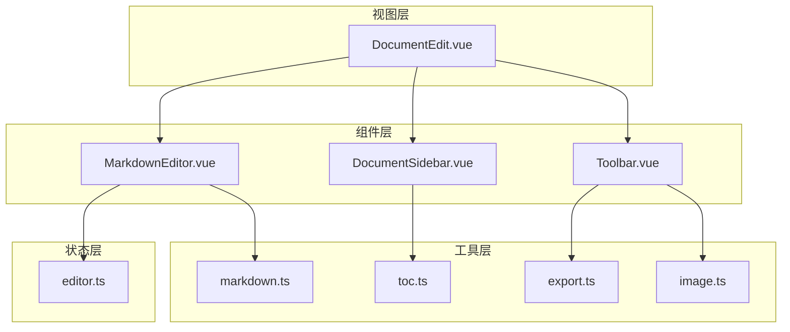
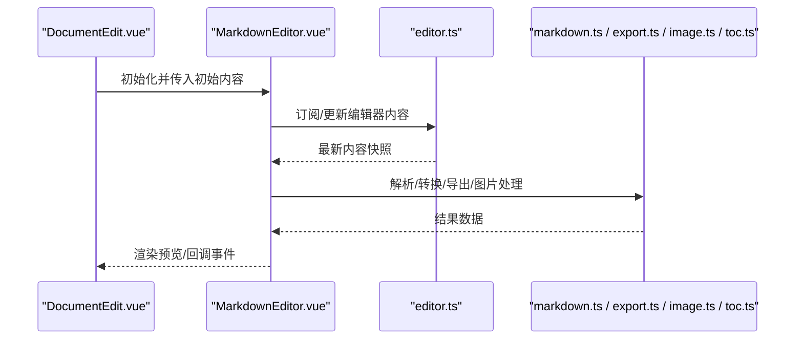
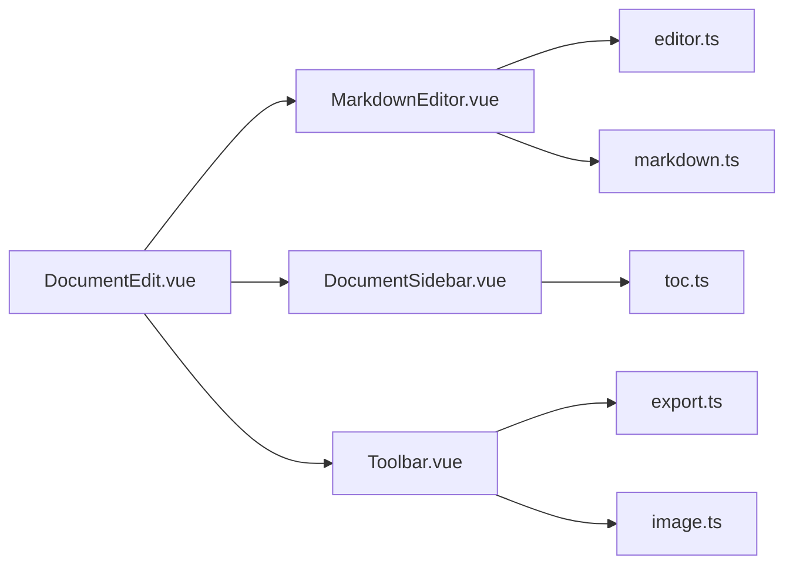

# UI组件

<cite>
**本文引用的文件**
- [src/components/DocumentSidebar.vue](file://src/components/DocumentSidebar.vue)
- [src/components/MarkdownEditor.vue](file://src/components/MarkdownEditor.vue)
- [src/components/Toolbar.vue](file://src/components/Toolbar.vue)
- [src/views/DocumentEdit.vue](file://src/views/DocumentEdit.vue)
- [src/stores/editor.ts](file://src/stores/editor.ts)
- [src/utils/markdown.ts](file://src/utils/markdown.ts)
- [src/utils/export.ts](file://src/utils/export.ts)
- [src/utils/image.ts](file://src/utils/image.ts)
- [src/utils/toc.ts](file://src/utils/toc.ts)
- [src/types/index.ts](file://src/types/index.ts)
</cite>

## 目录
1. [简介](#简介)
2. [项目结构](#项目结构)
3. [核心组件](#核心组件)
4. [架构总览](#架构总览)
5. [详细组件分析](#详细组件分析)
6. [依赖关系分析](#依赖关系分析)
7. [性能考虑](#性能考虑)
8. [故障排查指南](#故障排查指南)
9. [结论](#结论)
10. [附录](#附录)

## 简介
本文件为前端项目的UI组件文档，聚焦于可复用组件的设计与使用。覆盖以下方面：
- Props接口、事件处理、插槽与样式定制
- 生命周期管理、响应式设计与可访问性支持
- 组件组合最佳实践与性能优化建议
- 完整使用示例（以路径引用形式）与组件间通信机制说明

## 项目结构
本项目采用按功能划分的目录组织方式：
- components：可复用UI组件（侧边栏、编辑器、工具栏）
- views：页面级视图（编辑页等）
- stores：状态管理（编辑器状态）
- utils：工具函数（Markdown处理、导出、图片、目录生成等）
- types：类型定义

图表来源
- [src/views/DocumentEdit.vue](file://src/views/DocumentEdit.vue)
- [src/components/DocumentSidebar.vue](file://src/components/DocumentSidebar.vue)
- [src/components/MarkdownEditor.vue](file://src/components/MarkdownEditor.vue)
- [src/components/Toolbar.vue](file://src/components/Toolbar.vue)
- [src/stores/editor.ts](file://src/stores/editor.ts)
- [src/utils/markdown.ts](file://src/utils/markdown.ts)
- [src/utils/export.ts](file://src/utils/export.ts)
- [src/utils/image.ts](file://src/utils/image.ts)
- [src/utils/toc.ts](file://src/utils/toc.ts)

章节来源
- [src/views/DocumentEdit.vue](file://src/views/DocumentEdit.vue)
- [src/components/DocumentSidebar.vue](file://src/components/DocumentSidebar.vue)
- [src/components/MarkdownEditor.vue](file://src/components/MarkdownEditor.vue)
- [src/components/Toolbar.vue](file://src/components/Toolbar.vue)
- [src/stores/editor.ts](file://src/stores/editor.ts)
- [src/utils/markdown.ts](file://src/utils/markdown.ts)
- [src/utils/export.ts](file://src/utils/export.ts)
- [src/utils/image.ts](file://src/utils/image.ts)
- [src/utils/toc.ts](file://src/utils/toc.ts)

## 核心组件
- MarkdownEditor：富文本编辑容器，负责内容渲染、输入监听、与存储同步
- DocumentSidebar：文档目录与导航，基于Markdown内容生成目录并跳转
- Toolbar：操作工具栏，提供导出、图片插入、搜索等快捷操作

章节来源
- [src/components/MarkdownEditor.vue](file://src/components/MarkdownEditor.vue)
- [src/components/DocumentSidebar.vue](file://src/components/DocumentSidebar.vue)
- [src/components/Toolbar.vue](file://src/components/Toolbar.vue)

## 架构总览
组件通过“视图-组件-状态-工具”的分层协作完成编辑体验：
- 视图层编排布局与交互流程
- 组件层封装UI与局部逻辑
- 状态层集中管理编辑器数据
- 工具层提供Markdown解析、导出、图片处理、目录生成等能力

图表来源
- [src/views/DocumentEdit.vue](file://src/views/DocumentEdit.vue)
- [src/components/MarkdownEditor.vue](file://src/components/MarkdownEditor.vue)
- [src/stores/editor.ts](file://src/stores/editor.ts)
- [src/utils/markdown.ts](file://src/utils/markdown.ts)
- [src/utils/export.ts](file://src/utils/export.ts)
- [src/utils/image.ts](file://src/utils/image.ts)
- [src/utils/toc.ts](file://src/utils/toc.ts)

## 详细组件分析

### MarkdownEditor 组件
职责
- 承载Markdown编辑与预览
- 监听输入变化，持久化到全局状态
- 调用工具函数进行解析、导出、图片处理

Props（建议）
- modelValue: string | undefined — 双向绑定的内容
- placeholder: string — 占位提示
- readOnly: boolean — 只读模式
- preview: boolean — 是否显示预览面板
- theme: string — 主题标识（如 light/dark）
- autoSave: boolean — 是否自动保存到状态

事件
- update:modelValue — 内容变更时触发
- save — 手动保存触发
- error — 解析或导入错误时抛出

插槽
- default — 自定义编辑器头部/底部区域
- toolbar — 在编辑器内部嵌入工具条

样式定制
- 通过CSS变量或类名覆盖编辑器容器、预览区、滚动条等样式
- 支持响应式宽度切换（移动端隐藏预览）

生命周期与响应式
- 组件挂载时读取初始值；内容变化时防抖写入状态
- 根据窗口尺寸切换预览可见性

可访问性
- 为输入框设置aria-label、role="textbox"
- 预览区域使用语义化标签与标题层级

组合与通信
- 与DocumentSidebar通过共享的目录数据联动
- 与Toolbar通过事件与工具函数协作

使用示例（路径）
- [src/views/DocumentEdit.vue](file://src/views/DocumentEdit.vue) 中引入并使用该组件
- 参考 [src/stores/editor.ts](file://src/stores/editor.ts) 中的状态读写
- 参考 [src/utils/markdown.ts](file://src/utils/markdown.ts) 的解析流程

章节来源
- [src/components/MarkdownEditor.vue](file://src/components/MarkdownEditor.vue)
- [src/views/DocumentEdit.vue](file://src/views/DocumentEdit.vue)
- [src/stores/editor.ts](file://src/stores/editor.ts)
- [src/utils/markdown.ts](file://src/utils/markdown.ts)

### DocumentSidebar 组件
职责
- 根据Markdown内容生成目录
- 提供目录项点击跳转至对应段落
- 高亮当前所在章节

Props（建议）
- content: string — Markdown源内容
- activeId: string — 当前激活的章节ID
- showDepth: number — 显示层级深度
- collapsible: boolean — 是否支持折叠

事件
- select(id) — 选择某章节时触发
- change(activeId) — 当前激活章节变化

插槽
- header — 自定义侧边栏头部
- footer — 自定义侧边栏底部

样式定制
- 支持收缩/展开动画
- 响应式：窄屏下可收起为抽屉

可访问性
- 列表使用nav与ul/li语义
- 每个目录项具备tabindex与键盘导航

组合与通信
- 从MarkdownEditor获取content，计算目录
- 将选中章节ID回传给父组件用于定位

使用示例（路径）
- [src/views/DocumentEdit.vue](file://src/views/DocumentEdit.vue) 中作为布局的一部分
- 参考 [src/utils/toc.ts](file://src/utils/toc.ts) 的目录生成逻辑

章节来源
- [src/components/DocumentSidebar.vue](file://src/components/DocumentSidebar.vue)
- [src/views/DocumentEdit.vue](file://src/views/DocumentEdit.vue)
- [src/utils/toc.ts](file://src/utils/toc.ts)

### Toolbar 组件
职责
- 提供常用操作入口：导出、插入图片、搜索等
- 聚合工具函数，统一交互入口

Props（建议）
- actions: Array<{id, label, icon, handler}> — 动作列表
- disabled: boolean — 禁用态
- compact: boolean — 紧凑布局

事件
- action(id, payload) — 触发动作
- search(query) — 搜索输入变化

插槽
- left/right — 左右扩展区域

样式定制
- 按钮尺寸、间距、图标大小可通过类名覆盖
- 支持暗色主题适配

可访问性
- 按钮具备aria-label与键盘快捷键提示
- 搜索框具备aria-live区域反馈

组合与通信
- 调用导出工具：[src/utils/export.ts](file://src/utils/export.ts)
- 调用图片处理：[src/utils/image.ts](file://src/utils/image.ts)
- 与MarkdownEditor通过事件传递操作结果

使用示例（路径）
- [src/views/DocumentEdit.vue](file://src/views/DocumentEdit.vue) 中置于编辑器顶部
- 参考 [src/utils/export.ts](file://src/utils/export.ts)、[src/utils/image.ts](file://src/utils/image.ts)

章节来源
- [src/components/Toolbar.vue](file://src/components/Toolbar.vue)
- [src/views/DocumentEdit.vue](file://src/views/DocumentEdit.vue)
- [src/utils/export.ts](file://src/utils/export.ts)
- [src/utils/image.ts](file://src/utils/image.ts)

## 依赖关系分析
组件与工具、状态的依赖如下：

图表来源
- [src/components/MarkdownEditor.vue](file://src/components/MarkdownEditor.vue)
- [src/components/DocumentSidebar.vue](file://src/components/DocumentSidebar.vue)
- [src/components/Toolbar.vue](file://src/components/Toolbar.vue)
- [src/views/DocumentEdit.vue](file://src/views/DocumentEdit.vue)
- [src/stores/editor.ts](file://src/stores/editor.ts)
- [src/utils/markdown.ts](file://src/utils/markdown.ts)
- [src/utils/toc.ts](file://src/utils/toc.ts)
- [src/utils/export.ts](file://src/utils/export.ts)
- [src/utils/image.ts](file://src/utils/image.ts)

章节来源
- [src/components/MarkdownEditor.vue](file://src/components/MarkdownEditor.vue)
- [src/components/DocumentSidebar.vue](file://src/components/DocumentSidebar.vue)
- [src/components/Toolbar.vue](file://src/components/Toolbar.vue)
- [src/views/DocumentEdit.vue](file://src/views/DocumentEdit.vue)
- [src/stores/editor.ts](file://src/stores/editor.ts)
- [src/utils/markdown.ts](file://src/utils/markdown.ts)
- [src/utils/toc.ts](file://src/utils/toc.ts)
- [src/utils/export.ts](file://src/utils/export.ts)
- [src/utils/image.ts](file://src/utils/image.ts)

## 性能考虑
- 防抖/节流：编辑器输入变更与目录重算应使用防抖，避免频繁计算
- 虚拟滚动：长文档预览建议使用虚拟滚动减少DOM节点数量
- 懒加载：非首屏的目录或工具栏模块按需加载
- 增量更新：仅对变更片段进行重渲染，避免整篇重绘
- 缓存策略：对已解析的Markdown片段进行缓存，减少重复解析
- 资源优化：图片压缩与懒加载，避免阻塞主线程

## 故障排查指南
常见问题与定位方法
- 目录不更新：检查目录生成工具是否正确接收最新内容，确认防抖时间设置合理
- 导出失败：核对导出工具的错误分支，确认文件格式与权限
- 图片插入异常：校验图片格式与大小限制，查看图片处理工具的报错信息
- 状态不同步：确认编辑器与状态层的绑定是否正确，是否存在竞态条件
- 可访问性问题：验证ARIA属性与键盘导航是否生效

章节来源
- [src/utils/export.ts](file://src/utils/export.ts)
- [src/utils/image.ts](file://src/utils/image.ts)
- [src/utils/toc.ts](file://src/utils/toc.ts)
- [src/stores/editor.ts](file://src/stores/editor.ts)

## 结论
本项目的UI组件围绕Markdown编辑场景构建，通过清晰的层次划分与工具函数解耦，实现了良好的可维护性与可扩展性。遵循本文档的Props、事件、插槽与样式规范，结合性能与可访问性建议，可在保证用户体验的同时提升开发效率。

## 附录
- 类型定义参考：[src/types/index.ts](file://src/types/index.ts)
- 视图编排参考：[src/views/DocumentEdit.vue](file://src/views/DocumentEdit.vue)