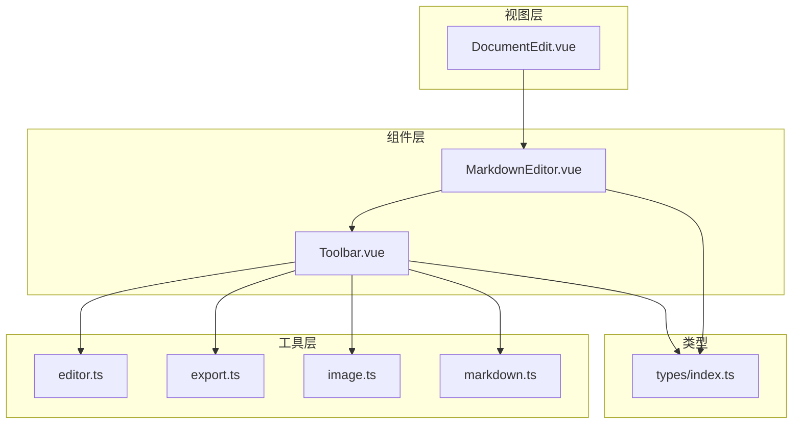
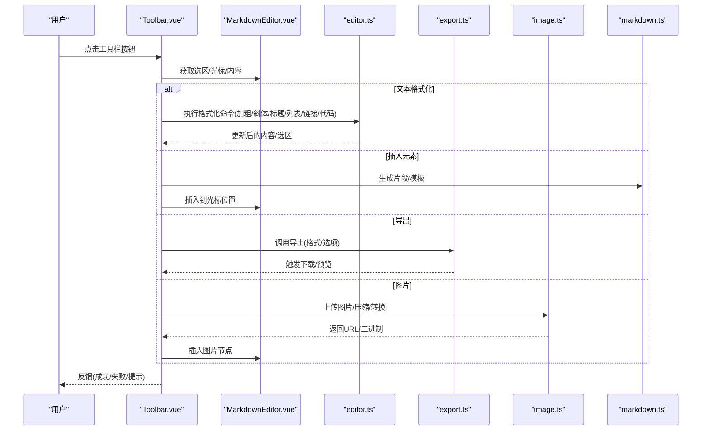
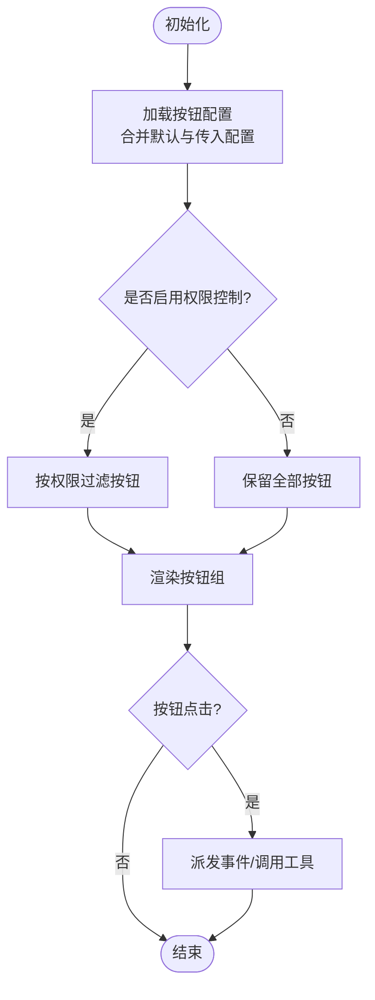
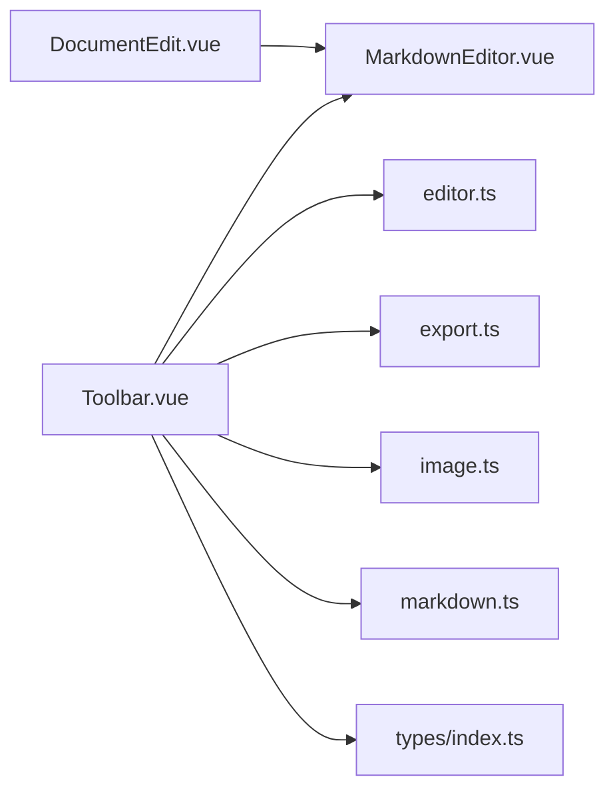

# 工具栏组件

<cite>
**本文引用的文件**
- [Toolbar.vue](file://src/components/Toolbar.vue)
- [MarkdownEditor.vue](file://src/components/MarkdownEditor.vue)
- [editor.ts](file://src/utils/editor.ts)
- [export.ts](file://src/utils/export.ts)
- [image.ts](file://src/utils/image.ts)
- [markdown.ts](file://src/utils/markdown.ts)
- [DocumentEdit.vue](file://src/views/DocumentEdit.vue)
- [index.ts](file://src/types/index.ts)
</cite>

## 目录
1. [简介](#简介)
2. [项目结构](#项目结构)
3. [核心组件](#核心组件)
4. [架构总览](#架构总览)
5. [详细组件分析](#详细组件分析)
6. [依赖分析](#依赖分析)
7. [性能考虑](#性能考虑)
8. [故障排查指南](#故障排查指南)
9. [结论](#结论)
10. [附录](#附录)

## 简介
本文件面向开发者与使用者，系统化说明 Toolbar.vue 工具栏组件的功能特性、扩展机制与集成方式。内容覆盖文本格式化、插入元素、导出功能、图片处理等核心能力；详述 Props 接口、事件回调、插槽使用与主题定制；解释按钮动态生成与权限控制逻辑；给出完整使用示例（自定义按钮、分组与分隔符）；并总结响应式设计、键盘快捷键与可访问性优化实践。

## 项目结构
本项目采用按“功能域”组织的前端工程结构：
- 组件层：MarkdownEditor.vue、Toolbar.vue 等 UI 组件
- 工具层：editor.ts、export.ts、image.ts、markdown.ts 等纯函数式工具
- 视图层：DocumentEdit.vue 等页面级组件
- 类型定义：types/index.ts 提供共享类型
- 状态管理：stores/*（编辑器状态、认证状态等）

图表来源
- [DocumentEdit.vue:1-200](file://src/views/DocumentEdit.vue#L1-L200)
- [MarkdownEditor.vue:1-200](file://src/components/MarkdownEditor.vue#L1-L200)
- [Toolbar.vue:1-200](file://src/components/Toolbar.vue#L1-L200)
- [editor.ts:1-200](file://src/utils/editor.ts#L1-L200)
- [export.ts:1-200](file://src/utils/export.ts#L1-L200)
- [image.ts:1-200](file://src/utils/image.ts#L1-L200)
- [markdown.ts:1-200](file://src/utils/markdown.ts#L1-L200)
- [index.ts:1-200](file://src/types/index.ts#L1-L200)

章节来源
- [DocumentEdit.vue:1-200](file://src/views/DocumentEdit.vue#L1-L200)
- [MarkdownEditor.vue:1-200](file://src/components/MarkdownEditor.vue#L1-L200)
- [Toolbar.vue:1-200](file://src/components/Toolbar.vue#L1-L200)

## 核心组件
- Toolbar.vue：工具栏入口，负责渲染按钮组、处理用户交互、调用编辑/导出/图片工具，并提供扩展点（插槽、事件、配置）。
- MarkdownEditor.vue：编辑器容器，承载内容、光标、选区与命令执行上下文，向 Toolbar 暴露操作 API。
- editor.ts：编辑器命令集合（加粗、斜体、标题、列表、链接、代码块等），封装对编辑器的统一操作。
- export.ts：导出能力（如导出为 PDF/HTML/Markdown），提供导出入口与选项。
- image.ts：图片处理（上传、压缩、占位图、尺寸调整、格式转换）。
- markdown.ts：Markdown 解析/转换辅助（如将选中内容转为特定语法或预览片段）。
- types/index.ts：共享类型定义（按钮项、导出选项、图片参数等）。

章节来源
- [Toolbar.vue:1-200](file://src/components/Toolbar.vue#L1-L200)
- [MarkdownEditor.vue:1-200](file://src/components/MarkdownEditor.vue#L1-L200)
- [editor.ts:1-200](file://src/utils/editor.ts#L1-L200)
- [export.ts:1-200](file://src/utils/export.ts#L1-L200)
- [image.ts:1-200](file://src/utils/image.ts#L1-L200)
- [markdown.ts:1-200](file://src/utils/markdown.ts#L1-L200)
- [index.ts:1-200](file://src/types/index.ts#L1-L200)

## 架构总览
Toolbar 作为“命令调度中心”，通过 MarkdownEditor 提供的 API 执行编辑命令，并通过工具模块完成导出与图片处理。类型系统约束输入输出，保证扩展时的契约一致性。

图表来源
- [Toolbar.vue:1-200](file://src/components/Toolbar.vue#L1-L200)
- [MarkdownEditor.vue:1-200](file://src/components/MarkdownEditor.vue#L1-L200)
- [editor.ts:1-200](file://src/utils/editor.ts#L1-L200)
- [export.ts:1-200](file://src/utils/export.ts#L1-L200)
- [image.ts:1-200](file://src/utils/image.ts#L1-L200)
- [markdown.ts:1-200](file://src/utils/markdown.ts#L1-L200)

## 详细组件分析

### Toolbar.vue 组件职责与行为
- 渲染按钮组：根据配置动态生成按钮，支持分组与分隔符。
- 权限控制：基于角色/权限标志过滤按钮显示。
- 事件总线：对外暴露 click、change、export、image 等事件，供父组件监听。
- 插槽扩展：提供命名插槽以插入自定义按钮或控件。
- 主题定制：通过 CSS 变量或主题类名切换样式。
- 响应式适配：在小屏设备隐藏次要按钮或折叠为菜单。
- 键盘快捷键：绑定常用命令的快捷键，提升效率。
- 可访问性：语义化标签、aria-* 属性、焦点管理。

章节来源
- [Toolbar.vue:1-200](file://src/components/Toolbar.vue#L1-L200)

#### 按钮动态生成与权限控制流程

图表来源
- [Toolbar.vue:1-200](file://src/components/Toolbar.vue#L1-L200)
- [index.ts:1-200](file://src/types/index.ts#L1-L200)

章节来源
- [Toolbar.vue:1-200](file://src/components/Toolbar.vue#L1-L200)
- [index.ts:1-200](file://src/types/index.ts#L1-L200)

### 与 MarkdownEditor 的协作
- 编辑器上下文：Toolbar 通过 MarkdownEditor 暴露的方法获取选区、插入内容、执行命令。
- 双向同步：Toolbar 变更触发编辑器更新，编辑器状态变化也可反向通知 Toolbar（如当前高亮状态）。
- 错误处理：当编辑器不可用或选区无效时，降级为友好提示。

章节来源
- [MarkdownEditor.vue:1-200](file://src/components/MarkdownEditor.vue#L1-L200)
- [Toolbar.vue:1-200](file://src/components/Toolbar.vue#L1-L200)

### 文本格式化（editor.ts）
- 支持的命令：加粗、斜体、删除线、标题层级、有序/无序列表、引用块、行内代码、代码块、链接、图片、表格等。
- 选区保护：在插入/替换时尽量保持原有选区范围，避免光标跳变。
- 撤销栈：所有编辑命令应纳入编辑器撤销栈，便于回退。

章节来源
- [editor.ts:1-200](file://src/utils/editor.ts#L1-L200)

### 插入元素（markdown.ts）
- 模板生成：根据上下文生成 Markdown 片段（如空段落、表格骨架、代码块模板）。
- 智能定位：根据光标位置插入，必要时自动换行或包裹。
- 可配置：允许外部注入更多模板或拦截插入逻辑。

章节来源
- [markdown.ts:1-200](file://src/utils/markdown.ts#L1-L200)

### 导出功能（export.ts）
- 导出格式：支持 Markdown、HTML、PDF（通过浏览器打印或第三方库）、JSON（元数据）等。
- 选项控制：文件名、编码、是否包含样式、是否仅导出选区等。
- 进度与错误：提供进度回调与异常捕获，确保用户体验。

章节来源
- [export.ts:1-200](file://src/utils/export.ts#L1-L200)

### 图片处理（image.ts）
- 上传与预览：本地选择图片后即时预览，支持拖拽。
- 压缩与转换：按需压缩体积、转换格式（如 PNG→WebP）、限制最大尺寸。
- 插入策略：转换为 Base64 或上传至服务端后插入 URL；支持懒加载占位。

章节来源
- [image.ts:1-200](file://src/utils/image.ts#L1-L200)

### Props 接口定义（建议）
以下为推荐的外部接口约定（具体字段以实际实现为准）：
- buttons: 按钮配置数组，每项包含 id、label、icon、command、disabled、visible、group、separator 等
- theme: 主题标识或主题对象，用于样式切换
- readOnly: 是否只读模式
- shortcuts: 快捷键映射表，如 { bold: "Ctrl+B" }
- permissions: 权限规则或角色列表，用于按钮可见性控制
- onCommand: 命令回调，接收命令名与参数
- onExport: 导出回调，接收导出选项
- onImage: 图片回调，接收图片处理结果
- slots: 命名插槽，如 "custom-button"、"before-group"、"after-group"

章节来源
- [index.ts:1-200](file://src/types/index.ts#L1-L200)
- [Toolbar.vue:1-200](file://src/components/Toolbar.vue#L1-L200)

### 事件回调机制
- command: 任意命令触发，携带命令名与上下文
- change: 编辑器内容或选区变化
- export: 导出开始/完成，携带格式与状态
- image: 图片上传/处理完成，携带 URL 或二进制
- error: 错误事件，携带错误信息与堆栈

章节来源
- [Toolbar.vue:1-200](file://src/components/Toolbar.vue#L1-L200)

### 插槽使用方法
- before-group / after-group：在分组前后插入自定义控件
- custom-button：插入自定义按钮项
- tooltip：自定义提示文案
- icon：自定义图标渲染

章节来源
- [Toolbar.vue:1-200](file://src/components/Toolbar.vue#L1-L200)

### 主题定制选项
- 通过 CSS 变量覆盖主色、背景、边框、阴影等
- 通过 theme 属性切换预设主题（明亮/暗色/高对比度）
- 支持按按钮粒度覆盖样式（如禁用态、激活态）

章节来源
- [Toolbar.vue:1-200](file://src/components/Toolbar.vue#L1-L200)

### 响应式设计实现
- 小屏下折叠次要按钮至“更多”菜单
- 按钮间距与字号自适应
- 触摸友好的点击区域与反馈

章节来源
- [Toolbar.vue:1-200](file://src/components/Toolbar.vue#L1-L200)

### 键盘快捷键支持
- 全局快捷键：Ctrl/Cmd + 字母（如 B/I/U）
- 局部快捷键：Tab/Shift+Tab 缩进，Enter 新建段落
- 可配置开关：允许禁用某些快捷键以避免冲突

章节来源
- [Toolbar.vue:1-200](file://src/components/Toolbar.vue#L1-L200)

### 可访问性优化
- 语义化按钮与 role="toolbar"
- aria-label、aria-pressed、aria-disabled 等状态描述
- 键盘可达性与焦点顺序合理
- 屏幕阅读器友好的提示与错误信息

章节来源
- [Toolbar.vue:1-200](file://src/components/Toolbar.vue#L1-L200)

## 依赖分析
- 内部依赖：MarkdownEditor（编辑器上下文）、types（类型约束）
- 工具依赖：editor.ts（命令）、export.ts（导出）、image.ts（图片）、markdown.ts（片段）
- 视图依赖：DocumentEdit.vue（组合与编排）

图表来源
- [Toolbar.vue:1-200](file://src/components/Toolbar.vue#L1-L200)
- [MarkdownEditor.vue:1-200](file://src/components/MarkdownEditor.vue#L1-L200)
- [DocumentEdit.vue:1-200](file://src/views/DocumentEdit.vue#L1-L200)
- [editor.ts:1-200](file://src/utils/editor.ts#L1-L200)
- [export.ts:1-200](file://src/utils/export.ts#L1-L200)
- [image.ts:1-200](file://src/utils/image.ts#L1-L200)
- [markdown.ts:1-200](file://src/utils/markdown.ts#L1-L200)
- [index.ts:1-200](file://src/types/index.ts#L1-L200)

章节来源
- [Toolbar.vue:1-200](file://src/components/Toolbar.vue#L1-L200)
- [DocumentEdit.vue:1-200](file://src/views/DocumentEdit.vue#L1-L200)

## 性能考虑
- 按钮渲染：使用虚拟滚动或分页渲染大量按钮
- 命令执行：批量更新与防抖，减少重排
- 图片处理：异步压缩与懒加载，避免阻塞主线程
- 导出任务：分片导出与进度上报，防止界面卡顿
- 内存管理：及时释放临时对象与监听器

[本节为通用指导，不直接分析具体文件]

## 故障排查指南
- 按钮无响应
  - 检查权限过滤是否正确
  - 确认编辑器上下文可用（选区/内容）
  - 查看命令回调是否抛出异常
- 导出失败
  - 校验导出格式与选项
  - 检查网络与存储权限（如需上传）
  - 捕获并记录错误日志
- 图片插入异常
  - 验证图片大小与格式限制
  - 检查 Base64 长度限制或后端接口
  - 确认插入路径与占位策略
- 快捷键冲突
  - 关闭或重映射冲突快捷键
  - 区分全局与局部快捷键作用域

章节来源
- [Toolbar.vue:1-200](file://src/components/Toolbar.vue#L1-L200)
- [export.ts:1-200](file://src/utils/export.ts#L1-L200)
- [image.ts:1-200](file://src/utils/image.ts#L1-L200)

## 结论
Toolbar.vue 提供了可扩展、可定制、可访问的工具栏能力，通过与编辑器、导出与图片工具的解耦集成，满足多样化场景需求。借助清晰的 Props、事件与插槽机制，开发者可以高效地扩展按钮、分组与主题，同时保障性能与可用性。

[本节为总结性内容，不直接分析具体文件]

## 附录

### 使用示例（概念性步骤）
- 基础用法
  - 引入 Toolbar 与 MarkdownEditor
  - 传入默认按钮配置与主题
  - 监听 command 与 export 事件
- 自定义按钮
  - 通过插槽插入自定义按钮
  - 在按钮点击中调用编辑器命令或工具方法
- 按钮分组与分隔符
  - 在配置中使用 group 与 separator
  - 利用插槽在分组前后插入控件
- 权限控制
  - 设置 permissions 或角色标志
  - 根据权限动态过滤按钮可见性
- 快捷键与可访问性
  - 配置 shortcuts 映射
  - 为按钮添加 aria-* 属性与键盘导航

[本节为概念性示例，不直接分析具体文件]