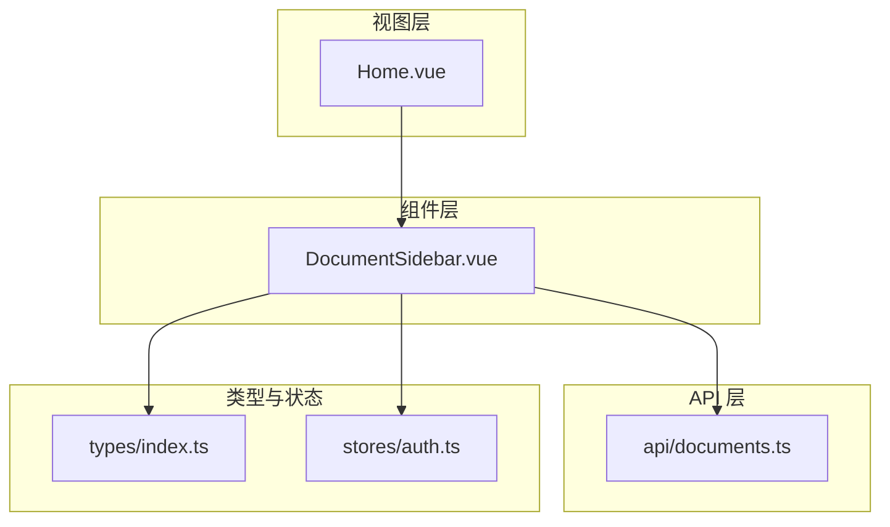
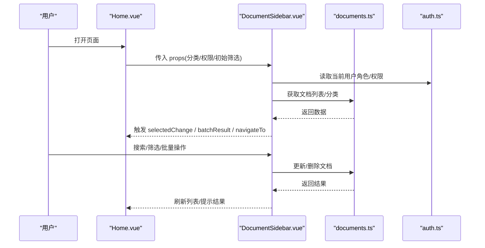
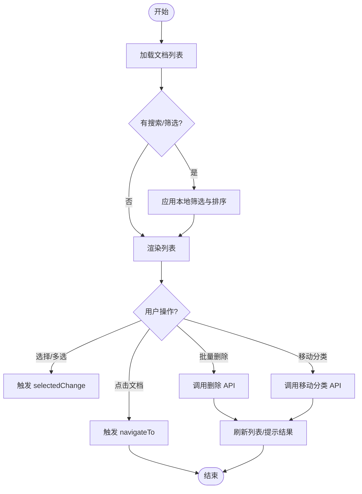
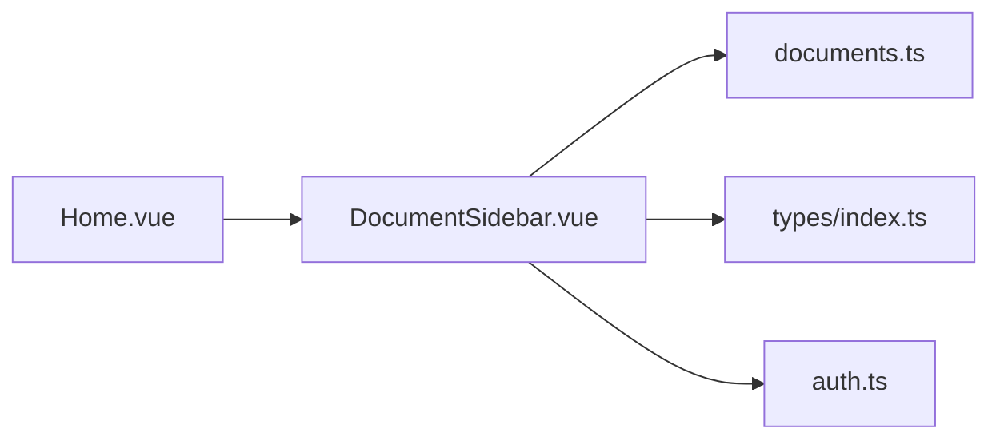

# 文档侧边栏组件

<cite>
**本文档引用的文件**
- [DocumentSidebar.vue](file://src/components/DocumentSidebar.vue)
- [documents.ts](file://src/api/documents.ts)
- [auth.ts](file://src/stores/auth.ts)
- [Home.vue](file://src/views/Home.vue)
- [index.ts](file://src/types/index.ts)
</cite>

## 目录
1. [简介](#简介)
2. [项目结构](#项目结构)
3. [核心组件](#核心组件)
4. [架构总览](#架构总览)
5. [详细组件分析](#详细组件分析)
6. [依赖关系分析](#依赖关系分析)
7. [性能考虑](#性能考虑)
8. [故障排查指南](#故障排查指南)
9. [结论](#结论)
10. [附录：使用示例与配置](#附录使用示例与配置)

## 简介
本文件面向开发者，系统化说明文档侧边栏组件（DocumentSidebar.vue）的设计与实现。内容覆盖侧边栏的核心功能（文档列表展示、搜索过滤、分类管理、批量操作）、Props 接口、事件机制、数据绑定方式、样式定制选项；以及与 API 服务（获取、更新、删除文档）的集成方式。同时说明用户权限对功能的限制与影响，并提供完整的使用示例，涵盖配置、交互处理与导航实现。最后给出响应式布局适配、性能优化与用户体验改进建议。

## 项目结构
本项目采用前端模块化组织，侧边栏组件位于 components 目录，API 层位于 api 目录，类型定义在 types 目录，视图层在 views 目录中引入并使用侧边栏。整体遵循“视图-组件-API-Store/类型”的分层结构，便于职责分离与可维护性。

图表来源
- [Home.vue](file://src/views/Home.vue)
- [DocumentSidebar.vue](file://src/components/DocumentSidebar.vue)
- [documents.ts](file://src/api/documents.ts)
- [index.ts](file://src/types/index.ts)
- [auth.ts](file://src/stores/auth.ts)

章节来源
- [Home.vue](file://src/views/Home.vue)
- [DocumentSidebar.vue](file://src/components/DocumentSidebar.vue)
- [documents.ts](file://src/api/documents.ts)
- [index.ts](file://src/types/index.ts)
- [auth.ts](file://src/stores/auth.ts)

## 核心组件
DocumentSidebar.vue 是文档管理的入口面板，提供以下能力：
- 文档列表展示：分页或滚动加载，支持按标题、时间等排序。
- 搜索过滤：实时关键词匹配，支持多字段组合筛选。
- 分类管理：按分类维度聚合与切换，支持新增/编辑/删除分类。
- 批量操作：多选后执行批量删除、移动分类、导出等。
- 权限控制：基于当前登录态与角色，动态禁用受限操作。
- 事件通信：向父级视图暴露选中变更、批量结果、导航请求等事件。
- 样式定制：通过 CSS 变量或主题类名进行外观定制。

章节来源
- [DocumentSidebar.vue](file://src/components/DocumentSidebar.vue)

## 架构总览
侧边栏通过 API 层与后端交互，从类型系统保证数据结构一致性，结合认证状态控制可用操作。典型流程如下：

图表来源
- [DocumentSidebar.vue](file://src/components/DocumentSidebar.vue)
- [documents.ts](file://src/api/documents.ts)
- [auth.ts](file://src/stores/auth.ts)
- [Home.vue](file://src/views/Home.vue)

## 详细组件分析

### 组件结构与职责
- 输入区：搜索框、分类选择器、筛选条件（如状态、标签）。
- 列表区：文档条目（标题、摘要、更新时间、分类），支持多选。
- 工具栏：批量操作按钮（删除、移动分类、导出）。
- 状态区：加载指示、错误提示、空状态占位。
- 事件出口：selectedChange、batchResult、navigateTo、filterChange。

章节来源
- [DocumentSidebar.vue](file://src/components/DocumentSidebar.vue)

### Props 接口
- list: 文档列表数据（数组），用于本地渲染与筛选。
- categories: 分类数据（数组），用于分类切换与管理。
- loading: 是否加载中（布尔），控制加载态 UI。
- error: 错误信息（字符串），用于错误提示。
- selectedIds: 已选中的文档 ID 集合（数组），受控多选。
- canDelete: 是否允许删除（布尔），由权限决定。
- canMove: 是否允许移动分类（布尔），由权限决定。
- canExport: 是否允许导出（布尔），由权限决定。
- searchQuery: 搜索关键词（字符串），双向绑定。
- activeCategory: 当前激活的分类标识（字符串/数字）。
- pageSize: 每页数量（数字），用于分页或虚拟滚动阈值。
- sortField: 排序字段（字符串），如 title、updatedAt。
- sortOrder: 排序方向（升序/降序）。

章节来源
- [DocumentSidebar.vue](file://src/components/DocumentSidebar.vue)
- [index.ts](file://src/types/index.ts)

### 事件处理机制
- selectedChange(selectedIds): 当用户勾选/取消勾选时发出，供父组件同步选中状态。
- batchResult(result): 批量操作完成后发出，包含成功/失败统计与详情。
- navigateTo(documentId): 点击某条文档时发出，父组件据此跳转路由。
- filterChange(filters): 搜索词、分类、排序变化时发出，便于外部统一记录或持久化。
- categoryAction(action, payload): 分类新增/编辑/删除动作，交由父组件协调 API。

章节来源
- [DocumentSidebar.vue](file://src/components/DocumentSidebar.vue)

### 数据绑定方式
- 单向数据流：props 驱动列表、分类、权限与筛选条件。
- 本地缓存：搜索结果与分页数据在组件内暂存，避免重复请求。
- 受控多选：selectedIds 由父组件维护，确保跨组件状态一致。
- 异步数据：通过 API 层拉取并映射到类型定义，保证类型安全。

章节来源
- [DocumentSidebar.vue](file://src/components/DocumentSidebar.vue)
- [index.ts](file://src/types/index.ts)

### 样式定制选项
- 主题变量：可通过 CSS 变量调整间距、字号、颜色、边框等。
- 插槽扩展：预留插槽以插入自定义操作项或列。
- 响应式类：在小屏下自动折叠为抽屉式或顶部筛选条。
- 主题类名：通过外层容器类名切换明暗主题或品牌色。

章节来源
- [DocumentSidebar.vue](file://src/components/DocumentSidebar.vue)

### 与 API 服务的集成
- 获取文档列表：调用 documents.ts 提供的查询接口，支持分页、排序与筛选参数。
- 更新文档：根据文档 ID 提交修改，成功后刷新列表或局部更新。
- 删除文档：支持单删与批量删除，失败时回滚本地状态并提示。
- 分类管理：新增/编辑/删除分类，成功后同步到本地分类列表。
- 错误处理：网络异常、权限不足、业务校验失败均会转换为统一的错误提示。

图表来源
- [DocumentSidebar.vue](file://src/components/DocumentSidebar.vue)
- [documents.ts](file://src/api/documents.ts)

章节来源
- [DocumentSidebar.vue](file://src/components/DocumentSidebar.vue)
- [documents.ts](file://src/api/documents.ts)

### 用户权限控制
- 读取权限：未登录或无阅读权限时隐藏列表或仅显示公开文档。
- 写权限：无编辑/删除权限时禁用相应按钮，并提示原因。
- 管理权限：分类管理需具备管理角色，否则隐藏相关入口。
- 审计日志：关键操作（删除、移动分类）记录操作人及时间。

章节来源
- [DocumentSidebar.vue](file://src/components/DocumentSidebar.vue)
- [auth.ts](file://src/stores/auth.ts)

### 响应式布局适配
- 桌面端：固定宽度侧边栏，右侧主内容区自适应。
- 平板端：侧边栏可收起为图标栏，点击展开。
- 移动端：默认收起，通过手势或按钮滑出；筛选区折叠为模态。
- 网格与弹性布局：利用 Flex/Grid 实现自适应排列与换行。

章节来源
- [DocumentSidebar.vue](file://src/components/DocumentSidebar.vue)

### 性能优化技巧
- 虚拟滚动：大数据量时使用虚拟列表减少 DOM 节点。
- 防抖搜索：输入延迟 200-300ms 触发筛选，降低计算压力。
- 分页加载：按需加载下一页，避免一次性加载全部数据。
- 缓存策略：对分类与常用筛选结果做短期缓存。
- 去重与增量更新：基于 ID 增量更新列表，避免全量重渲染。
- 懒加载图片：缩略图与封面图延迟加载。

章节来源
- [DocumentSidebar.vue](file://src/components/DocumentSidebar.vue)

### 用户体验改进方案
- 空状态引导：无数据时提供新建文档入口与帮助链接。
- 操作反馈：成功/失败提示，批量操作显示进度与结果摘要。
- 键盘快捷键：Ctrl+F 聚焦搜索，Enter 打开选中文档。
- 无障碍：为关键控件添加 aria-* 属性，支持屏幕阅读器。
- 错误恢复：网络中断后提供重试按钮与离线提示。

章节来源
- [DocumentSidebar.vue](file://src/components/DocumentSidebar.vue)

## 依赖关系分析
- 组件依赖 API 层进行数据读写，依赖类型定义保证数据结构一致性。
- 与认证状态联动，控制可见性与可用性。
- 被视图层（Home.vue）引入并作为子组件使用，负责数据展示与交互。

图表来源
- [DocumentSidebar.vue](file://src/components/DocumentSidebar.vue)
- [documents.ts](file://src/api/documents.ts)
- [index.ts](file://src/types/index.ts)
- [auth.ts](file://src/stores/auth.ts)
- [Home.vue](file://src/views/Home.vue)

章节来源
- [DocumentSidebar.vue](file://src/components/DocumentSidebar.vue)
- [documents.ts](file://src/api/documents.ts)
- [index.ts](file://src/types/index.ts)
- [auth.ts](file://src/stores/auth.ts)
- [Home.vue](file://src/views/Home.vue)

## 性能考虑
- 列表渲染：优先使用虚拟滚动与分页，避免长列表卡顿。
- 搜索与筛选：使用防抖与本地预计算索引，提升响应速度。
- 网络请求：合并请求、设置合理超时与重试策略。
- 内存管理：及时释放监听器与定时器，避免泄漏。
- 资源加载：图片懒加载与压缩，减少首屏体积。

[本节为通用指导，不直接分析具体文件]

## 故障排查指南
- 列表不显示：检查 API 返回格式是否符合类型定义；确认 loading/error 状态是否正确传递。
- 搜索无效：确认搜索关键词是否经过清洗；检查防抖时间与筛选逻辑。
- 批量操作失败：查看网络请求与错误码；确认权限是否满足；必要时回滚本地状态。
- 分类无法编辑：验证当前用户角色；检查分类 ID 是否存在。
- 移动端布局错乱：检查媒体查询与容器尺寸；确认是否启用了正确的响应式类。

章节来源
- [DocumentSidebar.vue](file://src/components/DocumentSidebar.vue)
- [documents.ts](file://src/api/documents.ts)

## 结论
DocumentSidebar.vue 提供了完整的文档侧边栏能力，涵盖列表展示、搜索过滤、分类管理与批量操作，并通过 API 层与权限系统实现数据与安全的闭环。配合响应式设计与性能优化策略，可在多端设备上提供流畅的用户体验。建议在项目中结合视图层与状态管理，形成稳定的数据流与清晰的职责边界。

[本节为总结，不直接分析具体文件]

## 附录：使用示例与配置
- 基础用法：在父视图中引入 DocumentSidebar.vue，传入 list、categories、loading、error、selectedIds、权限标志等 props，并监听 selectedChange、navigateTo、batchResult 等事件。
- 配置搜索与筛选：绑定 searchQuery 与 filterChange，结合 sortField/sortOrder 实现排序。
- 处理导航：在 navigateTo 事件中根据 documentId 跳转到对应路由。
- 权限控制：根据 auth.ts 中的角色信息设置 canDelete/canMove/canExport，并在 UI 上禁用受限操作。
- 样式定制：通过 CSS 变量或主题类名调整外观；在移动端启用折叠行为。

章节来源
- [Home.vue](file://src/views/Home.vue)
- [DocumentSidebar.vue](file://src/components/DocumentSidebar.vue)
- [auth.ts](file://src/stores/auth.ts)
- [index.ts](file://src/types/index.ts)