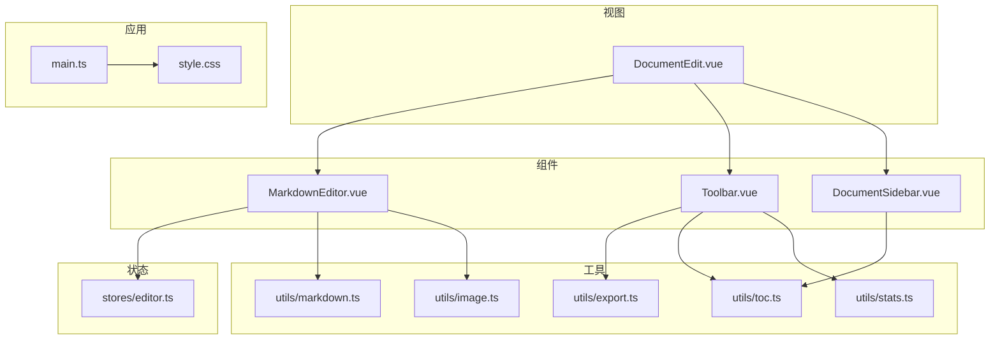
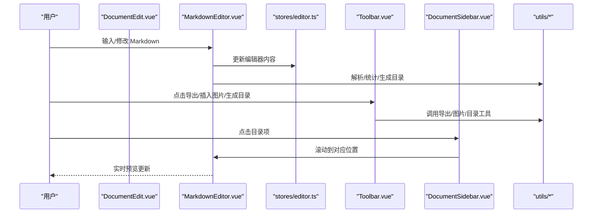
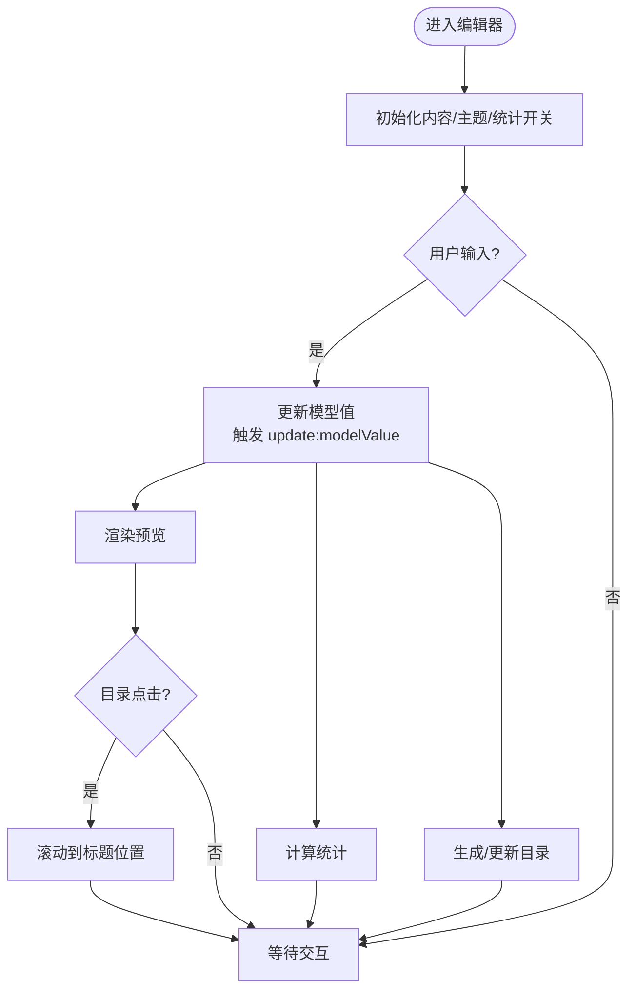
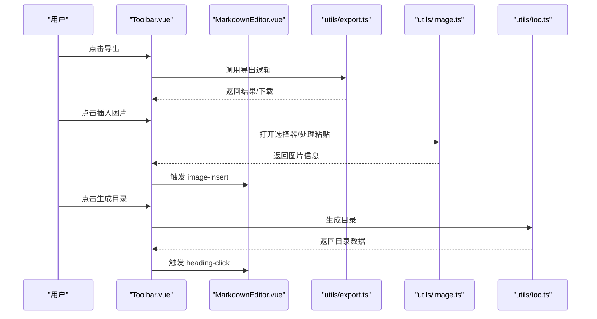
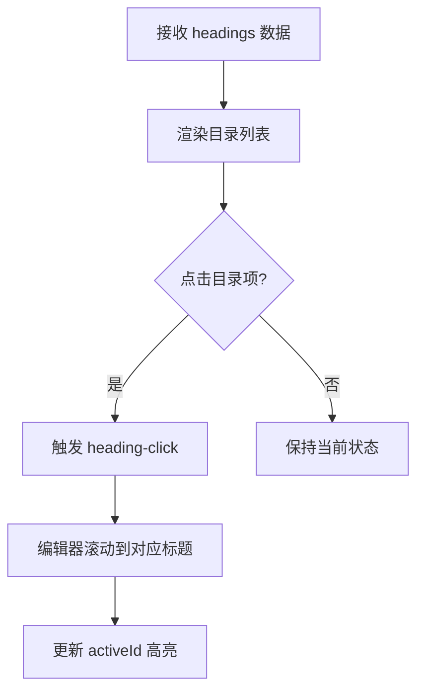
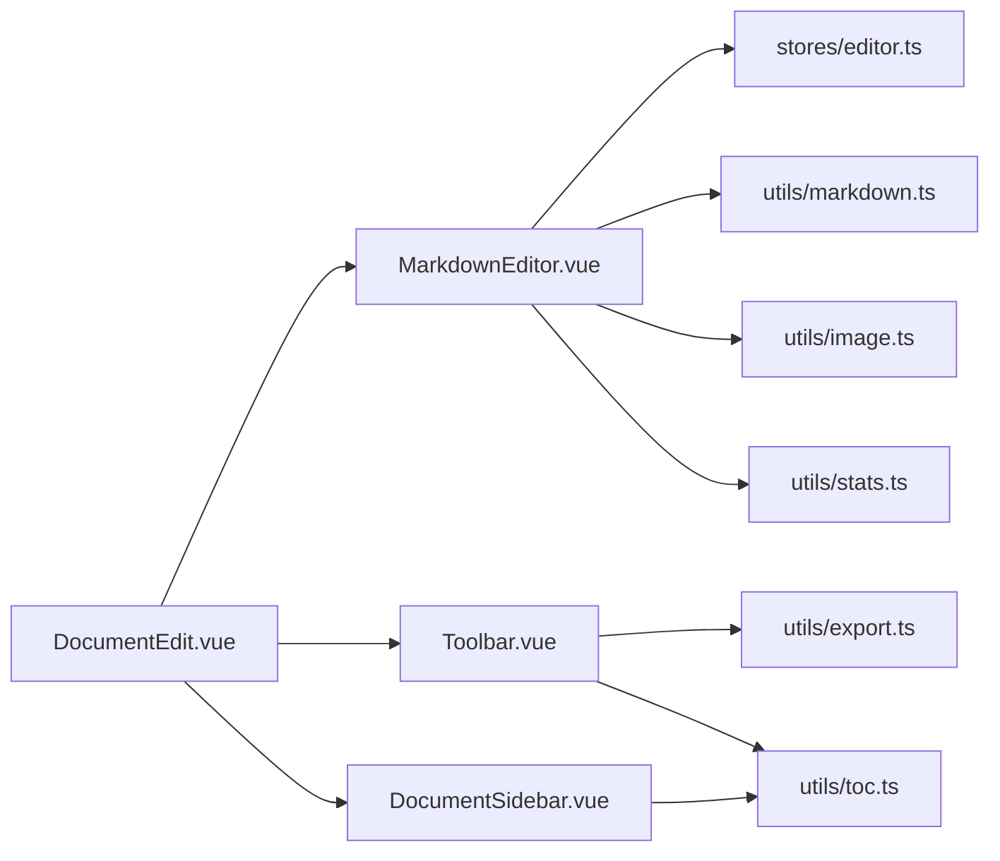

# 组件库

<cite>
**本文引用的文件**
- [src/components/DocumentSidebar.vue](file://src/components/DocumentSidebar.vue)
- [src/components/MarkdownEditor.vue](file://src/components/MarkdownEditor.vue)
- [src/components/Toolbar.vue](file://src/components/Toolbar.vue)
- [src/components/README.md](file://src/components/README.md)
- [src/views/DocumentEdit.vue](file://src/views/DocumentEdit.vue)
- [src/stores/editor.ts](file://src/stores/editor.ts)
- [src/utils/markdown.ts](file://src/utils/markdown.ts)
- [src/utils/export.ts](file://src/utils/export.ts)
- [src/utils/image.ts](file://src/utils/image.ts)
- [src/utils/toc.ts](file://src/utils/toc.ts)
- [src/utils/stats.ts](file://src/utils/stats.ts)
- [src/utils/README.md](file://src/utils/README.md)
- [src/types/index.ts](file://src/types/index.ts)
- [src/main.ts](file://src/main.ts)
- [src/style.css](file://src/style.css)
</cite>

## 目录
1. [简介](#简介)
2. [项目结构](#项目结构)
3. [核心组件](#核心组件)
4. [架构总览](#架构总览)
5. [详细组件分析](#详细组件分析)
6. [依赖分析](#依赖分析)
7. [性能考虑](#性能考虑)
8. [故障排查指南](#故障排查指南)
9. [结论](#结论)
10. [附录](#附录)

## 简介
本组件库围绕 Markdown 文档编辑与展示构建，提供编辑器、工具栏、侧边栏等核心 Vue 组件。文档目标包括：
- 全面介绍每个组件的 Props 接口、事件处理、插槽使用与样式定制选项
- 说明组件生命周期管理、响应式设计与可访问性支持
- 给出组件组合的最佳实践与性能优化建议
- 为每个组件提供完整的使用示例与代码片段路径（以“章节来源”形式引用）

## 项目结构
- 组件位于 src/components，包含 MarkdownEditor、Toolbar、DocumentSidebar
- 视图层在 src/views，例如 DocumentEdit 组合各组件完成编辑页
- 状态与数据通过 stores/editor 管理编辑器内容
- 工具函数集中在 src/utils，涵盖 Markdown 解析、导出、图片处理、目录生成、统计等
- 类型定义在 src/types/index.ts
- 入口与全局样式在 src/main.ts 与 src/style.css

图表来源
- [src/components/MarkdownEditor.vue](file://src/components/MarkdownEditor.vue)
- [src/components/Toolbar.vue](file://src/components/Toolbar.vue)
- [src/components/DocumentSidebar.vue](file://src/components/DocumentSidebar.vue)
- [src/views/DocumentEdit.vue](file://src/views/DocumentEdit.vue)
- [src/stores/editor.ts](file://src/stores/editor.ts)
- [src/utils/markdown.ts](file://src/utils/markdown.ts)
- [src/utils/export.ts](file://src/utils/export.ts)
- [src/utils/image.ts](file://src/utils/image.ts)
- [src/utils/toc.ts](file://src/utils/toc.ts)
- [src/utils/stats.ts](file://src/utils/stats.ts)
- [src/main.ts](file://src/main.ts)
- [src/style.css](file://src/style.css)

章节来源
- [src/components/README.md](file://src/components/README.md)
- [src/utils/README.md](file://src/utils/README.md)

## 核心组件
- MarkdownEditor：Markdown 文本输入、预览渲染、图片处理、字数统计、目录联动
- Toolbar：常用操作按钮（导出、插入图片、生成目录、统计等），触发编辑器行为
- DocumentSidebar：目录导航、文档结构展示，支持点击跳转与高亮

章节来源
- [src/components/MarkdownEditor.vue](file://src/components/MarkdownEditor.vue)
- [src/components/Toolbar.vue](file://src/components/Toolbar.vue)
- [src/components/DocumentSidebar.vue](file://src/components/DocumentSidebar.vue)

## 架构总览
编辑器工作流：用户在 MarkdownEditor 中编辑内容，Toolbar 提供操作入口，DocumentSidebar 基于目录进行导航；编辑器将内容同步至 stores/editor，并通过 utils 系列工具进行解析、导出、统计与图片处理。

图表来源
- [src/views/DocumentEdit.vue](file://src/views/DocumentEdit.vue)
- [src/components/MarkdownEditor.vue](file://src/components/MarkdownEditor.vue)
- [src/components/Toolbar.vue](file://src/components/Toolbar.vue)
- [src/components/DocumentSidebar.vue](file://src/components/DocumentSidebar.vue)
- [src/stores/editor.ts](file://src/stores/editor.ts)
- [src/utils/markdown.ts](file://src/utils/markdown.ts)
- [src/utils/export.ts](file://src/utils/export.ts)
- [src/utils/image.ts](file://src/utils/image.ts)
- [src/utils/toc.ts](file://src/utils/toc.ts)
- [src/utils/stats.ts](file://src/utils/stats.ts)

## 详细组件分析

### MarkdownEditor 组件
- 职责
  - 接收并维护 Markdown 文本
  - 渲染预览区域
  - 处理图片粘贴/拖拽上传
  - 计算字数/字符数统计
  - 与目录联动定位
- Props（建议）
  - modelValue: string — 双向绑定的 Markdown 内容
  - placeholder: string — 占位提示
  - preview: boolean — 是否显示预览面板
  - showStats: boolean — 是否显示统计信息
  - theme: string — 主题标识（如 light/dark）
- 事件
  - update:modelValue — 内容变更时发出
  - image-insert — 插入图片后发出（含图片信息）
  - stats-change — 统计变化时发出（字数/行数）
  - heading-click — 目录项点击，用于滚动定位
- 插槽
  - header — 编辑器头部自定义
  - footer — 编辑器底部自定义
  - preview-header — 预览区头部自定义
- 样式定制
  - 通过 CSS 变量或类名覆盖编辑器容器、预览区、工具条等样式
  - 支持响应式布局（移动端隐藏预览或切换模式）
- 生命周期与响应式
  - 监听 modelValue 变化，防抖更新预览与统计
  - 组件卸载时清理定时器/事件监听
- 可访问性
  - 为输入框设置 aria-label
  - 预览区域使用语义化标签（h1-h6、p、ul/ol）
  - 键盘可达性与焦点管理
- 组合使用
  - 与 Toolbar 配合实现导出、插入图片、生成目录等操作
  - 与 DocumentSidebar 联动实现目录跳转
- 使用示例（片段路径）
  - 基础用法与双向绑定：[src/views/DocumentEdit.vue](file://src/views/DocumentEdit.vue)
  - 启用预览与统计：[src/views/DocumentEdit.vue](file://src/views/DocumentEdit.vue)
  - 监听图片插入事件：[src/components/MarkdownEditor.vue](file://src/components/MarkdownEditor.vue)

图表来源
- [src/components/MarkdownEditor.vue](file://src/components/MarkdownEditor.vue)
- [src/utils/toc.ts](file://src/utils/toc.ts)
- [src/utils/stats.ts](file://src/utils/stats.ts)

章节来源
- [src/components/MarkdownEditor.vue](file://src/components/MarkdownEditor.vue)
- [src/views/DocumentEdit.vue](file://src/views/DocumentEdit.vue)
- [src/utils/toc.ts](file://src/utils/toc.ts)
- [src/utils/stats.ts](file://src/utils/stats.ts)

### Toolbar 组件
- 职责
  - 提供常用操作入口：导出、插入图片、生成目录、统计开关等
- Props（建议）
  - actions: object — 自定义动作映射（导出、插入图片、生成目录等回调）
  - showExport: boolean — 是否显示导出按钮
  - showImage: boolean — 是否显示插入图片按钮
  - showToc: boolean — 是否显示生成目录按钮
  - showStats: boolean — 是否显示统计按钮
- 事件
  - export — 触发导出流程
  - insert-image — 触发图片选择/粘贴处理
  - generate-toc — 触发目录生成
  - toggle-stats — 切换统计显示
- 插槽
  - extra — 扩展按钮或控件
- 样式定制
  - 通过类名或 CSS 变量控制按钮样式、间距、主题色
- 可访问性
  - 按钮具备 role、aria-label、tabindex 等属性
- 组合使用
  - 与 MarkdownEditor 的事件系统对接，驱动编辑器行为
- 使用示例（片段路径）
  - 基本按钮与事件绑定：[src/components/Toolbar.vue](file://src/components/Toolbar.vue)
  - 与编辑器联动：[src/views/DocumentEdit.vue](file://src/views/DocumentEdit.vue)

图表来源
- [src/components/Toolbar.vue](file://src/components/Toolbar.vue)
- [src/components/MarkdownEditor.vue](file://src/components/MarkdownEditor.vue)
- [src/utils/export.ts](file://src/utils/export.ts)
- [src/utils/image.ts](file://src/utils/image.ts)
- [src/utils/toc.ts](file://src/utils/toc.ts)

章节来源
- [src/components/Toolbar.vue](file://src/components/Toolbar.vue)
- [src/views/DocumentEdit.vue](file://src/views/DocumentEdit.vue)
- [src/utils/export.ts](file://src/utils/export.ts)
- [src/utils/image.ts](file://src/utils/image.ts)
- [src/utils/toc.ts](file://src/utils/toc.ts)

### DocumentSidebar 组件
- 职责
  - 展示文档目录结构
  - 支持点击跳转到对应标题位置
  - 高亮当前可见标题
- Props（建议）
  - headings: array — 目录数据（标题文本、层级、锚点）
  - activeId: string — 当前激活的标题 ID
  - scrollContainer: string — 滚动容器选择器
- 事件
  - heading-click — 点击目录项时发出（携带标题 ID）
- 插槽
  - item — 自定义目录项渲染
- 样式定制
  - 支持折叠/展开、缩进、高亮样式
- 可访问性
  - 使用 nav、ul/li、button 等语义化元素
  - 为当前项添加 aria-current="true"
- 组合使用
  - 与 MarkdownEditor 的目录生成与滚动定位联动
- 使用示例（片段路径）
  - 目录数据绑定与点击跳转：[src/components/DocumentSidebar.vue](file://src/components/DocumentSidebar.vue)
  - 与编辑器联动：[src/views/DocumentEdit.vue](file://src/views/DocumentEdit.vue)

图表来源
- [src/components/DocumentSidebar.vue](file://src/components/DocumentSidebar.vue)
- [src/components/MarkdownEditor.vue](file://src/components/MarkdownEditor.vue)

章节来源
- [src/components/DocumentSidebar.vue](file://src/components/DocumentSidebar.vue)
- [src/views/DocumentEdit.vue](file://src/views/DocumentEdit.vue)

## 依赖分析
- 组件间耦合
  - MarkdownEditor 与 Toolbar、DocumentSidebar 通过事件与 props 松耦合协作
  - 视图层 DocumentEdit 作为编排者，组合三个组件
- 外部依赖
  - stores/editor 管理编辑器状态
  - utils/* 提供 Markdown 解析、导出、图片处理、目录生成、统计等功能
- 潜在循环依赖
  - 组件仅通过事件通信，避免直接相互引用，降低耦合度

图表来源
- [src/views/DocumentEdit.vue](file://src/views/DocumentEdit.vue)
- [src/components/MarkdownEditor.vue](file://src/components/MarkdownEditor.vue)
- [src/components/Toolbar.vue](file://src/components/Toolbar.vue)
- [src/components/DocumentSidebar.vue](file://src/components/DocumentSidebar.vue)
- [src/stores/editor.ts](file://src/stores/editor.ts)
- [src/utils/markdown.ts](file://src/utils/markdown.ts)
- [src/utils/export.ts](file://src/utils/export.ts)
- [src/utils/image.ts](file://src/utils/image.ts)
- [src/utils/toc.ts](file://src/utils/toc.ts)
- [src/utils/stats.ts](file://src/utils/stats.ts)

章节来源
- [src/views/DocumentEdit.vue](file://src/views/DocumentEdit.vue)
- [src/components/MarkdownEditor.vue](file://src/components/MarkdownEditor.vue)
- [src/components/Toolbar.vue](file://src/components/Toolbar.vue)
- [src/components/DocumentSidebar.vue](file://src/components/DocumentSidebar.vue)
- [src/stores/editor.ts](file://src/stores/editor.ts)
- [src/utils/markdown.ts](file://src/utils/markdown.ts)
- [src/utils/export.ts](file://src/utils/export.ts)
- [src/utils/image.ts](file://src/utils/image.ts)
- [src/utils/toc.ts](file://src/utils/toc.ts)
- [src/utils/stats.ts](file://src/utils/stats.ts)

## 性能考虑
- 防抖与节流
  - 对预览渲染与统计计算使用防抖，减少频繁重绘
- 虚拟滚动
  - 长文档预览建议使用虚拟滚动或分页加载
- 图片处理
  - 压缩与懒加载，避免阻塞主线程
- 目录生成
  - 增量更新目录，避免全量重建
- 状态管理
  - 使用 stores/editor 集中管理内容，减少重复计算
- 样式与主题
  - 通过 CSS 变量切换主题，避免多次样式计算

## 故障排查指南
- 预览不更新
  - 检查 modelValue 是否正确双向绑定
  - 确认防抖时间设置合理
- 目录无法跳转
  - 验证 headings 数据中的锚点与标题 ID 一致
  - 检查滚动容器选择器是否正确
- 图片插入失败
  - 检查图片格式与大小限制
  - 查看浏览器控制台错误信息
- 导出异常
  - 确认导出工具函数参数正确
  - 检查 MIME 类型与文件名编码

章节来源
- [src/components/MarkdownEditor.vue](file://src/components/MarkdownEditor.vue)
- [src/components/Toolbar.vue](file://src/components/Toolbar.vue)
- [src/components/DocumentSidebar.vue](file://src/components/DocumentSidebar.vue)
- [src/utils/export.ts](file://src/utils/export.ts)
- [src/utils/image.ts](file://src/utils/image.ts)
- [src/utils/toc.ts](file://src/utils/toc.ts)

## 结论
本组件库以 MarkdownEditor 为核心，结合 Toolbar 与 DocumentSidebar，形成完整的文档编辑体验。通过清晰的 Props/Events/Slots 设计、良好的可访问性与响应式支持，以及 utils 工具的解耦，实现了高内聚、低耦合的组件架构。遵循本文档的最佳实践与性能建议，可在实际项目中稳定复用与扩展。

## 附录
- 类型定义参考：[src/types/index.ts](file://src/types/index.ts)
- 应用入口与样式：[src/main.ts](file://src/main.ts)、[src/style.css](file://src/style.css)
- 组件说明与工具说明：[src/components/README.md](file://src/components/README.md)、[src/utils/README.md](file://src/utils/README.md)