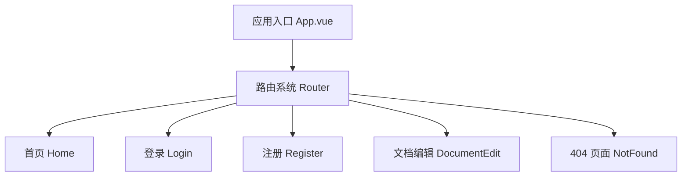
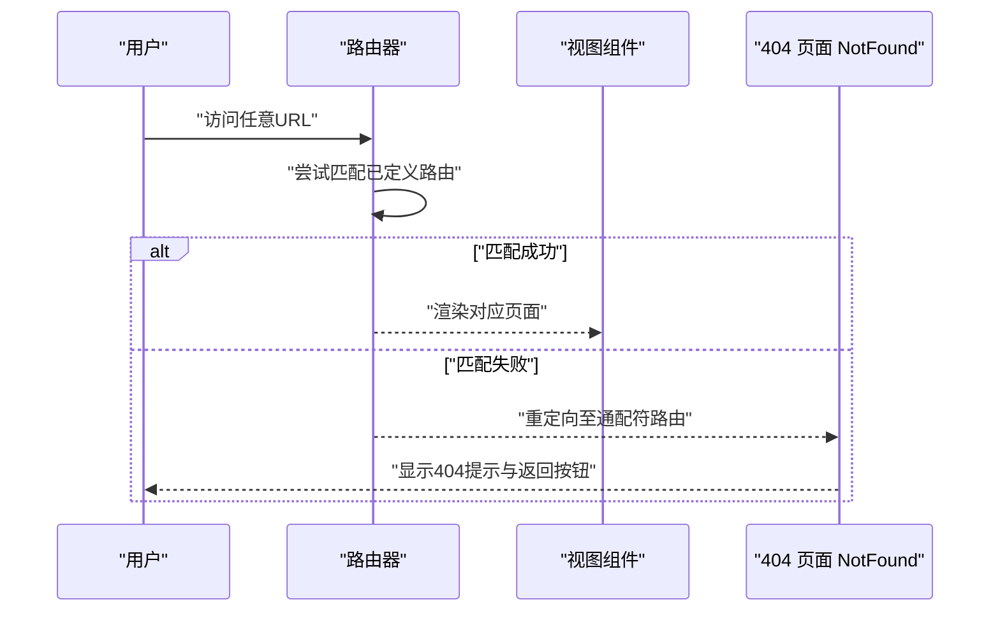
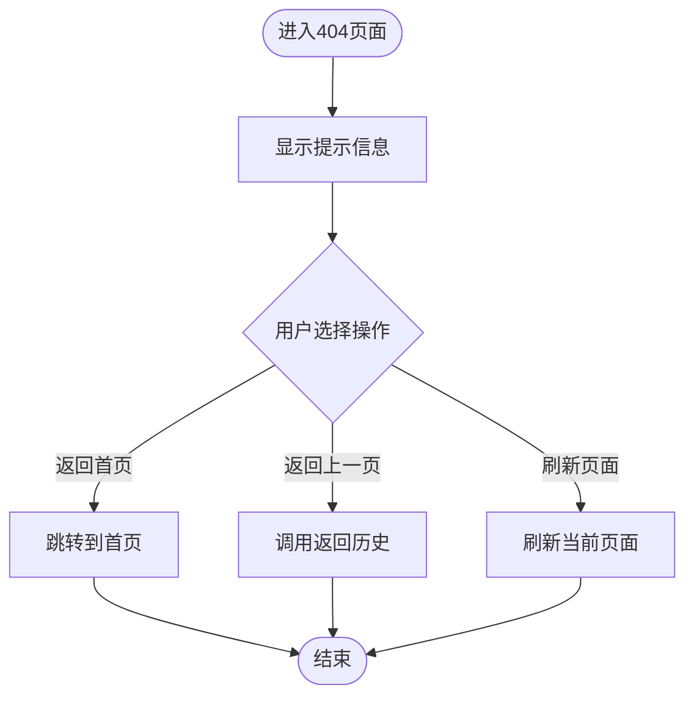
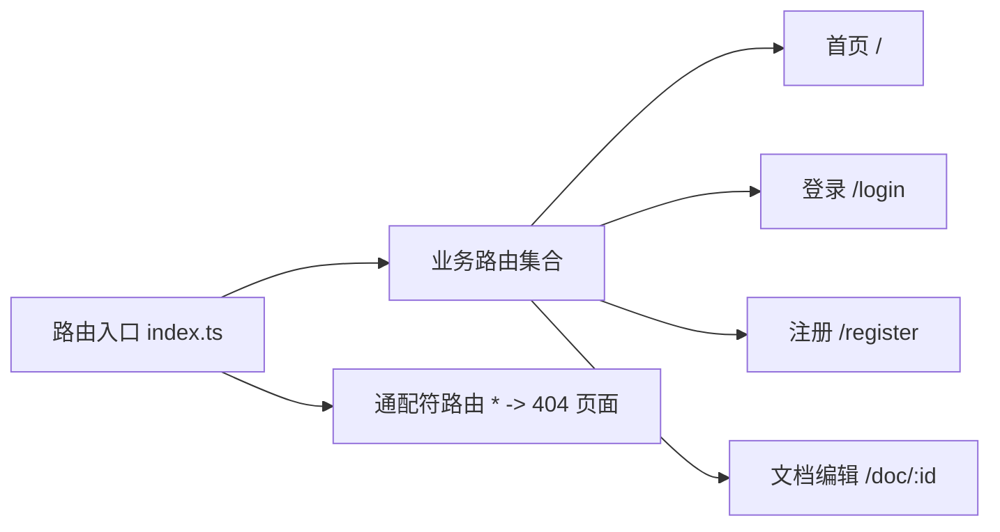
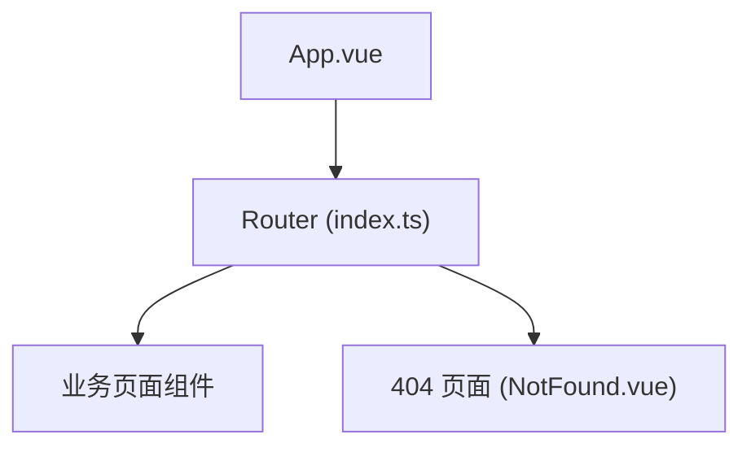

# 404错误页面

<cite>
**本文引用的文件**
- [NotFound.vue](file://src/views/NotFound.vue)
- [index.ts](file://src/router/index.ts)
- [App.vue](file://src/App.vue)
</cite>

## 目录
1. [简介](#简介)
2. [项目结构](#项目结构)
3. [核心组件](#核心组件)
4. [架构总览](#架构总览)
5. [详细组件分析](#详细组件分析)
6. [依赖关系分析](#依赖关系分析)
7. [性能考虑](#性能考虑)
8. [故障排查指南](#故障排查指南)
9. [结论](#结论)

## 简介
本章节聚焦于前端应用中的“404错误页面”实现与路由集成。该页面用于处理未匹配的路由访问，提供友好的用户提示并引导回首页或其他入口，确保在路由缺失或输入错误时具备良好的用户体验。

## 项目结构
本项目采用基于视图（views）与路由（router）分离的组织方式：
- 视图层：包含具体页面组件，如 NotFound.vue、Home.vue、Login.vue 等
- 路由层：集中管理路由配置与跳转逻辑
- 应用壳：App.vue 作为根组件承载路由出口

**图示来源**
- [App.vue:1-200](file://src/App.vue#L1-L200)
- [index.ts:1-200](file://src/router/index.ts#L1-L200)

**章节来源**
- [App.vue:1-200](file://src/App.vue#L1-L200)
- [index.ts:1-200](file://src/router/index.ts#L1-L200)

## 核心组件
- 404 页面组件：NotFound.vue，负责展示“未找到页面”的提示信息与返回操作
- 路由配置：index.ts，定义所有路由规则，并在末尾添加通配符路由以捕获未匹配路径
- 根组件：App.vue，通过路由出口渲染当前路由对应的页面

**章节来源**
- [NotFound.vue:1-200](file://src/views/NotFound.vue#L1-L200)
- [index.ts:1-200](file://src/router/index.ts#L1-L200)
- [App.vue:1-200](file://src/App.vue#L1-L200)

## 架构总览
下图展示了从浏览器访问到最终渲染 404 页面的完整流程，包括路由匹配失败时的兜底机制。

**图示来源**
- [index.ts:1-200](file://src/router/index.ts#L1-L200)
- [NotFound.vue:1-200](file://src/views/NotFound.vue#L1-L200)

## 详细组件分析

### 404 页面组件（NotFound.vue）
- 职责：向用户展示“未找到页面”的友好提示，并提供返回首页或上一页的操作
- 交互：通常包含“返回首页”、“返回上一页”等按钮，便于快速导航
- 可访问性：建议为按钮提供清晰的标签与键盘可达性

**图示来源**
- [NotFound.vue:1-200](file://src/views/NotFound.vue#L1-L200)

**章节来源**
- [NotFound.vue:1-200](file://src/views/NotFound.vue#L1-L200)

### 路由配置（index.ts）
- 职责：集中定义所有业务路由，并在最后添加通配符路由以捕获未匹配路径，触发 404 页面
- 关键点：
  - 按功能模块组织路由（如首页、登录、注册、文档编辑等）
  - 通配符路由应置于所有具体路由之后，确保优先匹配具体路由
  - 可结合全局前置守卫进行权限校验或重定向

**图示来源**
- [index.ts:1-200](file://src/router/index.ts#L1-L200)

**章节来源**
- [index.ts:1-200](file://src/router/index.ts#L1-L200)

### 根组件（App.vue）
- 职责：作为应用的根容器，提供路由出口，使不同路由下的页面得以正确渲染
- 与 404 的关系：当路由匹配失败时，由路由系统渲染 404 页面，App.vue 仅负责挂载与卸载视图

**章节来源**
- [App.vue:1-200](file://src/App.vue#L1-L200)

## 依赖关系分析
- 404 页面依赖于路由系统进行导航控制
- 路由系统依赖各业务页面组件进行渲染
- 根组件依赖路由出口来承载当前视图

**图示来源**
- [App.vue:1-200](file://src/App.vue#L1-L200)
- [index.ts:1-200](file://src/router/index.ts#L1-L200)
- [NotFound.vue:1-200](file://src/views/NotFound.vue#L1-L200)

**章节来源**
- [App.vue:1-200](file://src/App.vue#L1-L200)
- [index.ts:1-200](file://src/router/index.ts#L1-L200)
- [NotFound.vue:1-200](file://src/views/NotFound.vue#L1-L200)

## 性能考虑
- 路由懒加载：对非首屏页面使用动态导入，减少初始包体积
- 404 页面轻量化：避免在 404 页面引入重型资源，保持快速响应
- 缓存策略：对静态资源启用合适的缓存头，提升重复访问速度
- 错误边界：在关键组件处设置错误边界，防止单点故障影响整体体验

[本节为通用指导，不直接分析具体文件]

## 故障排查指南
- 现象：访问任意无效 URL 仍无法显示 404 页面
  - 检查路由顺序：确保通配符路由位于所有具体路由之后
  - 检查路由别名与重定向：确认没有意外覆盖或未生效的重定向
- 现象：404 页面按钮无效
  - 检查导航方法是否正确调用（如 push、replace、goBack）
  - 检查是否存在全局前置守卫拦截了跳转
- 现象：移动端布局异常
  - 检查样式适配与断点设置
  - 验证视口与缩放设置

**章节来源**
- [index.ts:1-200](file://src/router/index.ts#L1-L200)
- [NotFound.vue:1-200](file://src/views/NotFound.vue#L1-L200)

## 结论
404 错误页面是前端应用中不可或缺的兜底机制。通过合理的路由配置与简洁友好的页面设计，可以在用户遇到无效链接或拼写错误时提供清晰指引，提升整体可用性。建议在项目中持续优化 404 页面的交互与可访问性，并结合监控与日志收集未匹配路由的来源，以便进一步改进产品体验。