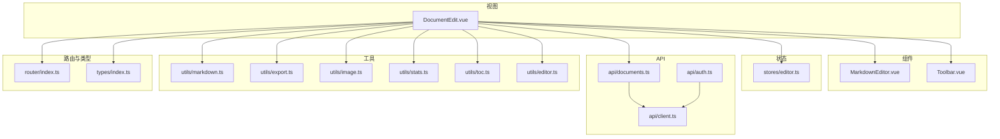
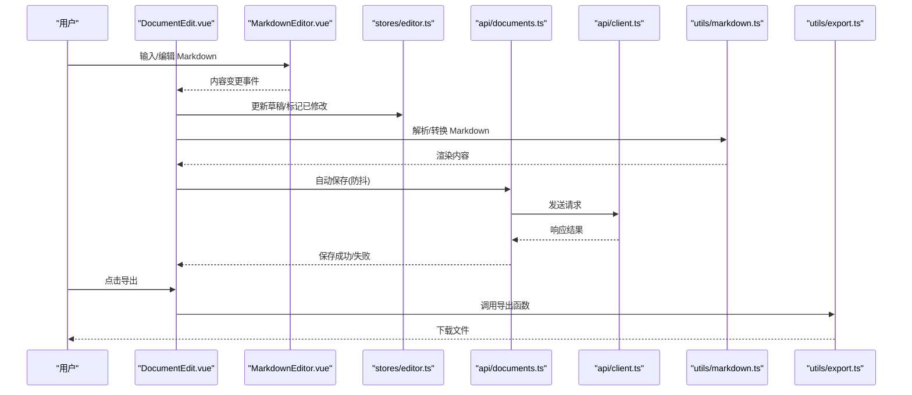
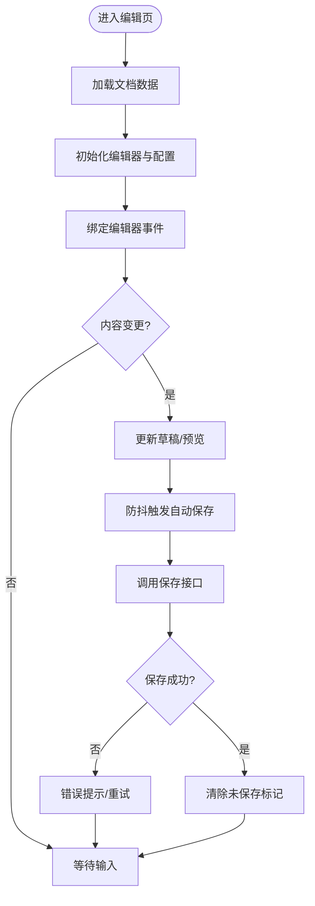
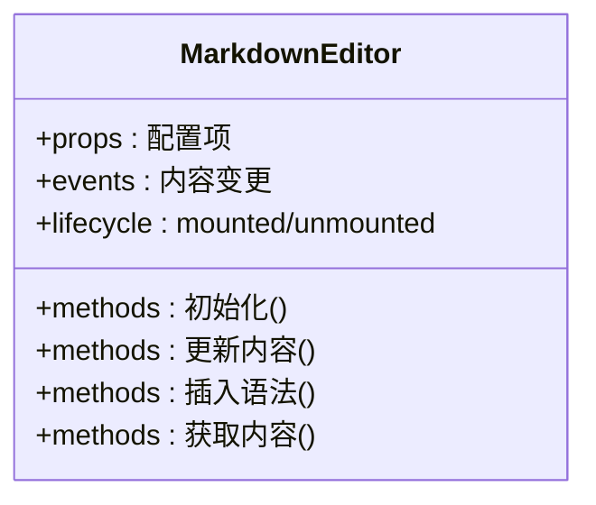
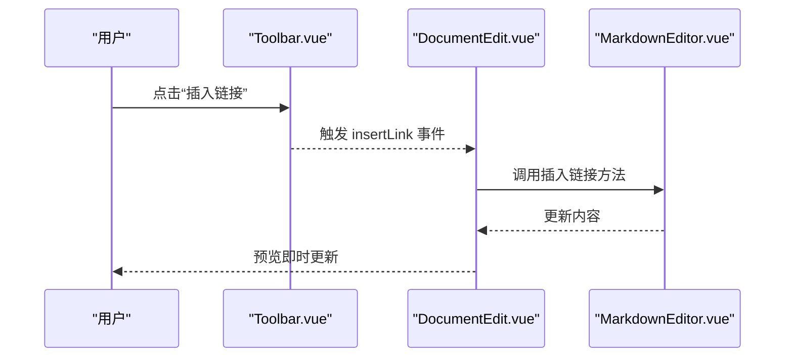
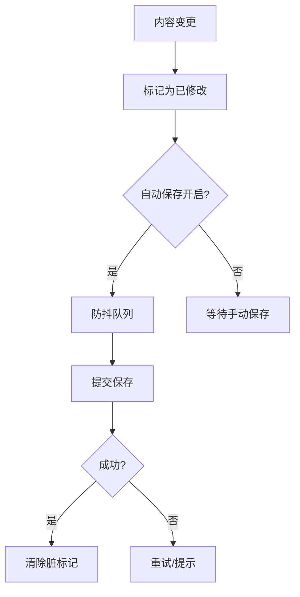
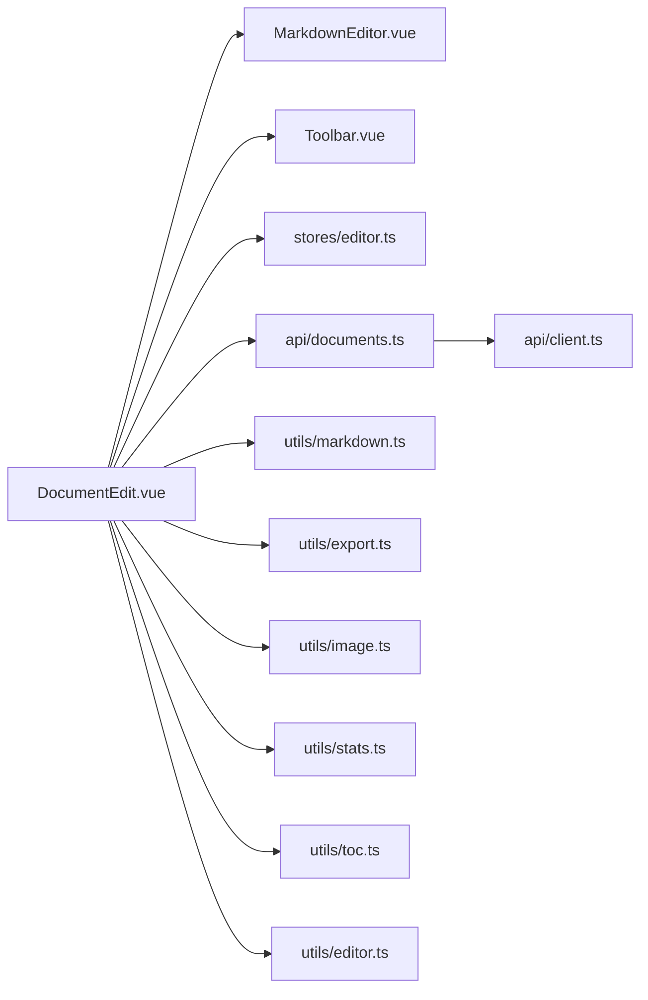

# 文档编辑页

<cite>
**本文引用的文件**
- [DocumentEdit.vue](file://src/views/DocumentEdit.vue)
- [MarkdownEditor.vue](file://src/components/MarkdownEditor.vue)
- [Toolbar.vue](file://src/components/Toolbar.vue)
- [editor.ts](file://src/utils/editor.ts)
- [markdown.ts](file://src/utils/markdown.ts)
- [export.ts](file://src/utils/export.ts)
- [image.ts](file://src/utils/image.ts)
- [stats.ts](file://src/utils/stats.ts)
- [toc.ts](file://src/utils/toc.ts)
- [documents.ts](file://src/api/documents.ts)
- [client.ts](file://src/api/client.ts)
- [auth.ts](file://src/api/auth.ts)
- [editor.ts](file://src/stores/editor.ts)
- [index.ts](file://src/stores/index.ts)
- [router/index.ts](file://src/router/index.ts)
- [types/index.ts](file://src/types/index.ts)
</cite>

## 目录
1. [简介](#简介)
2. [项目结构](#项目结构)
3. [核心组件与功能](#核心组件与功能)
4. [架构总览](#架构总览)
5. [详细组件分析](#详细组件分析)
6. [依赖关系分析](#依赖关系分析)
7. [性能考虑](#性能考虑)
8. [故障排查指南](#故障排查指南)
9. [结论](#结论)
10. [附录：使用示例与高级配置](#附录使用示例与高级配置)

## 简介
本章节面向“文档编辑页”的构建目标，围绕 DocumentEdit.vue 组件展开，系统阐述编辑器初始化、Markdown 内容处理、实时预览机制、自动保存与版本管理、编辑器配置选项、工具栏集成、快捷键支持、导入导出以及性能优化策略。同时提供可落地的使用示例与高级配置方法指引（以代码片段路径形式给出）。

## 项目结构
前端采用 Vue 单文件组件 + TypeScript 的工程组织方式，按职责分层：
- 视图层：views 下的页面组件，如 DocumentEdit.vue
- 组件层：components 下的通用 UI 组件，如 MarkdownEditor.vue、Toolbar.vue
- 状态层：stores 下的全局状态，如 editor.ts
- API 层：api 下的接口封装，如 documents.ts、client.ts、auth.ts
- 工具层：utils 下的能力模块，如 markdown.ts、export.ts、image.ts、stats.ts、toc.ts、editor.ts
- 路由与类型：router/index.ts、types/index.ts

图表来源
- [DocumentEdit.vue](file://src/views/DocumentEdit.vue)
- [MarkdownEditor.vue](file://src/components/MarkdownEditor.vue)
- [Toolbar.vue](file://src/components/Toolbar.vue)
- [editor.ts](file://src/stores/editor.ts)
- [documents.ts](file://src/api/documents.ts)
- [client.ts](file://src/api/client.ts)
- [auth.ts](file://src/api/auth.ts)
- [markdown.ts](file://src/utils/markdown.ts)
- [export.ts](file://src/utils/export.ts)
- [image.ts](file://src/utils/image.ts)
- [stats.ts](file://src/utils/stats.ts)
- [toc.ts](file://src/utils/toc.ts)
- [editor.ts](file://src/utils/editor.ts)
- [router/index.ts](file://src/router/index.ts)
- [types/index.ts](file://src/types/index.ts)

章节来源
- [DocumentEdit.vue](file://src/views/DocumentEdit.vue)
- [MarkdownEditor.vue](file://src/components/MarkdownEditor.vue)
- [Toolbar.vue](file://src/components/Toolbar.vue)
- [editor.ts](file://src/stores/editor.ts)
- [documents.ts](file://src/api/documents.ts)
- [client.ts](file://src/api/client.ts)
- [auth.ts](file://src/api/auth.ts)
- [markdown.ts](file://src/utils/markdown.ts)
- [export.ts](file://src/utils/export.ts)
- [image.ts](file://src/utils/image.ts)
- [stats.ts](file://src/utils/stats.ts)
- [toc.ts](file://src/utils/toc.ts)
- [editor.ts](file://src/utils/editor.ts)
- [router/index.ts](file://src/router/index.ts)
- [types/index.ts](file://src/types/index.ts)

## 核心组件与功能
- 文档编辑页（DocumentEdit.vue）
  - 负责页面级编排：加载文档、初始化编辑器、绑定工具栏事件、触发自动保存、展示预览与目录、统计信息、导入导出入口等。
- 编辑器容器（MarkdownEditor.vue）
  - 封装编辑器实例生命周期：创建、更新、销毁；处理内容变更、预览渲染、快捷键、主题、只读模式等。
- 工具栏（Toolbar.vue）
  - 提供常用操作按钮：加粗、斜体、标题、列表、链接、图片、代码块、导出、全屏、撤销/重做等，并派发事件给父组件。
- 状态管理（stores/editor.ts）
  - 集中管理编辑器相关状态：当前文档、草稿、预览内容、是否已修改、自动保存开关、版本历史等。
- API 层（api/documents.ts, api/client.ts, api/auth.ts）
  - 统一网络请求封装、鉴权、文档 CRUD、版本管理等。
- 工具层（utils/*）
  - markdown.ts：Markdown 解析与转换、语法扩展、安全过滤等
  - export.ts：导出为 PDF/HTML/Markdown 等格式
  - image.ts：图片上传、压缩、Base64 处理、占位图
  - stats.ts：字数、行数、阅读时长等统计
  - toc.ts：生成目录树、锚点映射
  - editor.ts：编辑器配置、快捷键注册、插件集成、性能调优

章节来源
- [DocumentEdit.vue](file://src/views/DocumentEdit.vue)
- [MarkdownEditor.vue](file://src/components/MarkdownEditor.vue)
- [Toolbar.vue](file://src/components/Toolbar.vue)
- [editor.ts](file://src/stores/editor.ts)
- [documents.ts](file://src/api/documents.ts)
- [client.ts](file://src/api/client.ts)
- [auth.ts](file://src/api/auth.ts)
- [markdown.ts](file://src/utils/markdown.ts)
- [export.ts](file://src/utils/export.ts)
- [image.ts](file://src/utils/image.ts)
- [stats.ts](file://src/utils/stats.ts)
- [toc.ts](file://src/utils/toc.ts)
- [editor.ts](file://src/utils/editor.ts)

## 架构总览
下图展示了从用户交互到数据持久化的完整链路：用户在编辑器输入，触发预览更新与自动保存；工具栏操作通过事件驱动；导出与导入由工具层完成；版本管理通过 API 层与后端交互。

图表来源
- [DocumentEdit.vue](file://src/views/DocumentEdit.vue)
- [MarkdownEditor.vue](file://src/components/MarkdownEditor.vue)
- [editor.ts](file://src/stores/editor.ts)
- [documents.ts](file://src/api/documents.ts)
- [client.ts](file://src/api/client.ts)
- [markdown.ts](file://src/utils/markdown.ts)
- [export.ts](file://src/utils/export.ts)

## 详细组件分析

### DocumentEdit.vue：页面编排与业务编排
- 职责
  - 路由参数解析与文档加载
  - 初始化编辑器实例与配置
  - 订阅编辑器事件（内容变化、光标位置、选中范围等）
  - 触发自动保存（含防抖/节流）
  - 管理预览、目录、统计、导入导出
  - 版本切换与回滚
- 关键流程
  - 初始化：读取文档 ID -> 调用 API 获取文档 -> 设置编辑器初始内容 -> 启用自动保存
  - 内容变更：更新本地草稿 -> 防抖后触发保存 -> 更新预览与目录
  - 工具栏：监听 Toolbar 事件 -> 执行插入语法/跳转/导出等操作
  - 版本管理：列出版本 -> 切换查看 -> 合并/回滚
- 错误处理
  - 网络异常重试、降级显示
  - 权限不足提示
  - 大文档懒加载与分页渲染

图表来源
- [DocumentEdit.vue](file://src/views/DocumentEdit.vue)
- [documents.ts](file://src/api/documents.ts)
- [client.ts](file://src/api/client.ts)
- [editor.ts](file://src/stores/editor.ts)

章节来源
- [DocumentEdit.vue](file://src/views/DocumentEdit.vue)
- [documents.ts](file://src/api/documents.ts)
- [client.ts](file://src/api/client.ts)
- [editor.ts](file://src/stores/editor.ts)

### MarkdownEditor.vue：编辑器容器与生命周期
- 职责
  - 创建/销毁编辑器实例
  - 同步外部配置（主题、语言、只读、行号等）
  - 处理内容变更、预览刷新、快捷键注册
  - 暴露方法供父组件调用（插入语法、滚动定位、获取内容等）
- 关键点
  - 防抖渲染：对高频变更进行节流/防抖
  - 增量更新：仅更新差异区域
  - 资源清理：在卸载时释放定时器、事件监听、实例引用

图表来源
- [MarkdownEditor.vue](file://src/components/MarkdownEditor.vue)

章节来源
- [MarkdownEditor.vue](file://src/components/MarkdownEditor.vue)

### Toolbar.vue：工具栏与命令分发
- 职责
  - 渲染常用编辑命令按钮
  - 将用户操作转换为编辑器指令或事件
  - 与 DocumentEdit 协作实现导入导出、全屏、撤销/重做
- 关键点
  - 无障碍支持：键盘可达、语义化标签
  - 可扩展：新增命令只需注册事件处理器

图表来源
- [Toolbar.vue](file://src/components/Toolbar.vue)
- [DocumentEdit.vue](file://src/views/DocumentEdit.vue)
- [MarkdownEditor.vue](file://src/components/MarkdownEditor.vue)

章节来源
- [Toolbar.vue](file://src/components/Toolbar.vue)
- [DocumentEdit.vue](file://src/views/DocumentEdit.vue)
- [MarkdownEditor.vue](file://src/components/MarkdownEditor.vue)

### stores/editor.ts：编辑器状态与自动保存
- 职责
  - 维护当前文档、草稿、预览、是否脏标记、自动保存开关
  - 提供保存/取消保存、版本切换、批量操作
- 关键点
  - 防抖保存：避免频繁写盘
  - 乐观更新：先更新 UI，再异步持久化
  - 冲突解决：服务端版本号校验与合并策略

图表来源
- [editor.ts](file://src/stores/editor.ts)

章节来源
- [editor.ts](file://src/stores/editor.ts)

### utils/markdown.ts：Markdown 解析与安全
- 职责
  - 解析 Markdown 为 HTML/AST
  - 注入语法高亮、表格、数学公式等扩展
  - 安全过滤：移除危险脚本、限制外链
- 关键点
  - 增量解析：仅对变更段落重新渲染
  - 缓存策略：相同内容复用解析结果

章节来源
- [markdown.ts](file://src/utils/markdown.ts)

### utils/export.ts：导入导出
- 职责
  - 导出为 Markdown/HTML/PDF
  - 导入 Markdown 文件并合并到当前文档
- 关键点
  - 大文件分块导出
  - 进度反馈与中断恢复

章节来源
- [export.ts](file://src/utils/export.ts)

### utils/image.ts：图片处理
- 职责
  - 图片上传、压缩、Base64 编码、占位图
  - 粘贴图片自动转存
- 关键点
  - 并发控制与重试
  - 失败回退策略

章节来源
- [image.ts](file://src/utils/image.ts)

### utils/stats.ts：统计
- 职责
  - 计算字数、行数、阅读时长、词频等
- 关键点
  - 增量统计，避免全量扫描

章节来源
- [stats.ts](file://src/utils/stats.ts)

### utils/toc.ts：目录生成
- 职责
  - 根据标题生成目录树与锚点映射
- 关键点
  - 标题层级规范化、重复标题去重

章节来源
- [toc.ts](file://src/utils/toc.ts)

### utils/editor.ts：编辑器配置与快捷键
- 职责
  - 统一编辑器配置：主题、语言、行号、自动换行、缩进、Tab 转空格等
  - 注册快捷键：保存、导出、插入语法、查找替换等
  - 插件集成：代码高亮、数学公式、流程图等
- 关键点
  - 配置热更新
  - 快捷键冲突检测与覆盖

章节来源
- [editor.ts](file://src/utils/editor.ts)

### API 层：documents.ts / client.ts / auth.ts
- documents.ts：文档 CRUD、版本列表、版本回滚、合并
- client.ts：HTTP 客户端封装、拦截器、重试、超时
- auth.ts：登录态、Token 刷新、权限校验

章节来源
- [documents.ts](file://src/api/documents.ts)
- [client.ts](file://src/api/client.ts)
- [auth.ts](file://src/api/auth.ts)

## 依赖关系分析
- 松耦合设计：视图层通过 props/events 与组件通信，状态集中在 store，工具函数纯函数化
- 外部依赖：HTTP 客户端、Markdown 解析库、导出库、图片处理库
- 潜在风险：循环依赖需避免；第三方库升级兼容性

图表来源
- [DocumentEdit.vue](file://src/views/DocumentEdit.vue)
- [MarkdownEditor.vue](file://src/components/MarkdownEditor.vue)
- [Toolbar.vue](file://src/components/Toolbar.vue)
- [editor.ts](file://src/stores/editor.ts)
- [documents.ts](file://src/api/documents.ts)
- [client.ts](file://src/api/client.ts)
- [markdown.ts](file://src/utils/markdown.ts)
- [export.ts](file://src/utils/export.ts)
- [image.ts](file://src/utils/image.ts)
- [stats.ts](file://src/utils/stats.ts)
- [toc.ts](file://src/utils/toc.ts)
- [editor.ts](file://src/utils/editor.ts)

章节来源
- [DocumentEdit.vue](file://src/views/DocumentEdit.vue)
- [MarkdownEditor.vue](file://src/components/MarkdownEditor.vue)
- [Toolbar.vue](file://src/components/Toolbar.vue)
- [editor.ts](file://src/stores/editor.ts)
- [documents.ts](file://src/api/documents.ts)
- [client.ts](file://src/api/client.ts)
- [markdown.ts](file://src/utils/markdown.ts)
- [export.ts](file://src/utils/export.ts)
- [image.ts](file://src/utils/image.ts)
- [stats.ts](file://src/utils/stats.ts)
- [toc.ts](file://src/utils/toc.ts)
- [editor.ts](file://src/utils/editor.ts)

## 性能考虑
- 渲染优化
  - 防抖/节流：内容变更与预览更新
  - 虚拟滚动：长文档列表与预览区
  - 增量解析：仅对变更段落重新渲染
- 存储优化
  - 本地草稿缓存：IndexedDB/LocalStorage
  - 自动保存间隔可调，默认建议 5-10 秒
- 网络优化
  - 请求去重、重试、超时、断网提示
  - 大文件分片上传/下载
- 内存优化
  - 及时释放编辑器实例与监听器
  - 图片懒加载与压缩
- 可观测性
  - 统计指标：首屏时间、渲染耗时、保存失败率
  - 错误上报与日志采集

[本节为通用性能指导，不直接分析具体文件]

## 故障排查指南
- 常见问题
  - 自动保存失败：检查网络、权限、服务端版本冲突
  - 预览空白：检查 Markdown 解析、安全过滤规则
  - 图片无法粘贴：检查图片处理逻辑与跨域策略
  - 导出失败：检查文件格式与浏览器限制
- 调试手段
  - 打开控制台查看错误堆栈
  - 使用网络面板观察请求/响应
  - 临时关闭自动保存定位问题
  - 逐步禁用插件/扩展定位冲突

章节来源
- [documents.ts](file://src/api/documents.ts)
- [client.ts](file://src/api/client.ts)
- [markdown.ts](file://src/utils/markdown.ts)
- [image.ts](file://src/utils/image.ts)
- [export.ts](file://src/utils/export.ts)

## 结论
DocumentEdit.vue 作为文档编辑页的核心编排者，整合了编辑器容器、工具栏、状态管理与 API 层，实现了完整的 Markdown 编辑体验。通过合理的配置、防抖与增量更新策略，兼顾了易用性与性能。结合版本管理与导入导出能力，可满足多场景下的文档创作需求。

[本节为总结性内容，不直接分析具体文件]

## 附录：使用示例与高级配置
以下提供常见用法与高级配置的代码片段路径，便于快速上手与定制：

- 基础使用
  - 引入与挂载编辑器：[DocumentEdit.vue](file://src/views/DocumentEdit.vue)
  - 配置编辑器基本选项：[MarkdownEditor.vue](file://src/components/MarkdownEditor.vue)
- 编辑器配置
  - 主题/语言/行号/只读：[editor.ts](file://src/utils/editor.ts)
  - 快捷键注册与冲突处理：[editor.ts](file://src/utils/editor.ts)
- 内容处理
  - Markdown 解析与安全过滤：[markdown.ts](file://src/utils/markdown.ts)
  - 目录生成与锚点映射：[toc.ts](file://src/utils/toc.ts)
  - 统计信息：字数、行数、阅读时长：[stats.ts](file://src/utils/stats.ts)
- 图片处理
  - 粘贴/拖拽图片与压缩：[image.ts](file://src/utils/image.ts)
- 导入导出
  - 导出为 Markdown/HTML/PDF：[export.ts](file://src/utils/export.ts)
  - 导入 Markdown 并合并：[export.ts](file://src/utils/export.ts)
- 自动保存与版本管理
  - 自动保存开关与间隔：[editor.ts](file://src/stores/editor.ts)
  - 版本列表与回滚：[documents.ts](file://src/api/documents.ts)
- 网络与鉴权
  - HTTP 客户端封装与拦截器：[client.ts](file://src/api/client.ts)
  - 登录态与 Token 刷新：[auth.ts](file://src/api/auth.ts)

章节来源
- [DocumentEdit.vue](file://src/views/DocumentEdit.vue)
- [MarkdownEditor.vue](file://src/components/MarkdownEditor.vue)
- [editor.ts](file://src/utils/editor.ts)
- [markdown.ts](file://src/utils/markdown.ts)
- [toc.ts](file://src/utils/toc.ts)
- [stats.ts](file://src/utils/stats.ts)
- [image.ts](file://src/utils/image.ts)
- [export.ts](file://src/utils/export.ts)
- [editor.ts](file://src/stores/editor.ts)
- [documents.ts](file://src/api/documents.ts)
- [client.ts](file://src/api/client.ts)
- [auth.ts](file://src/api/auth.ts)