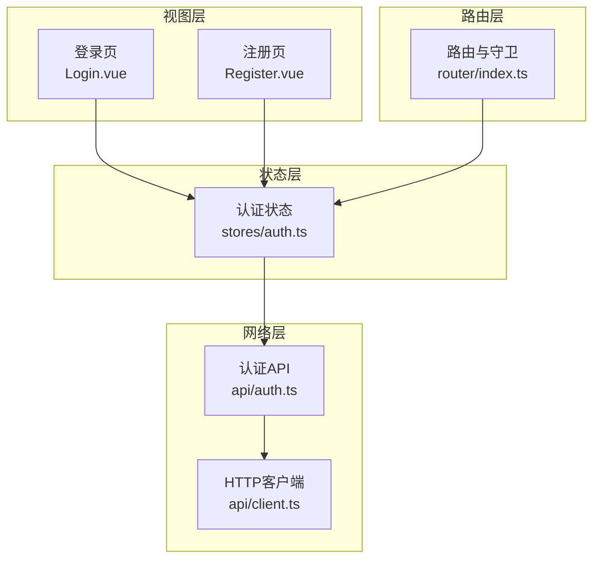
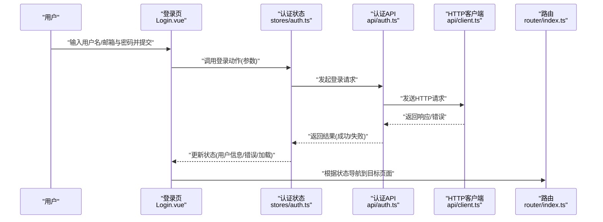
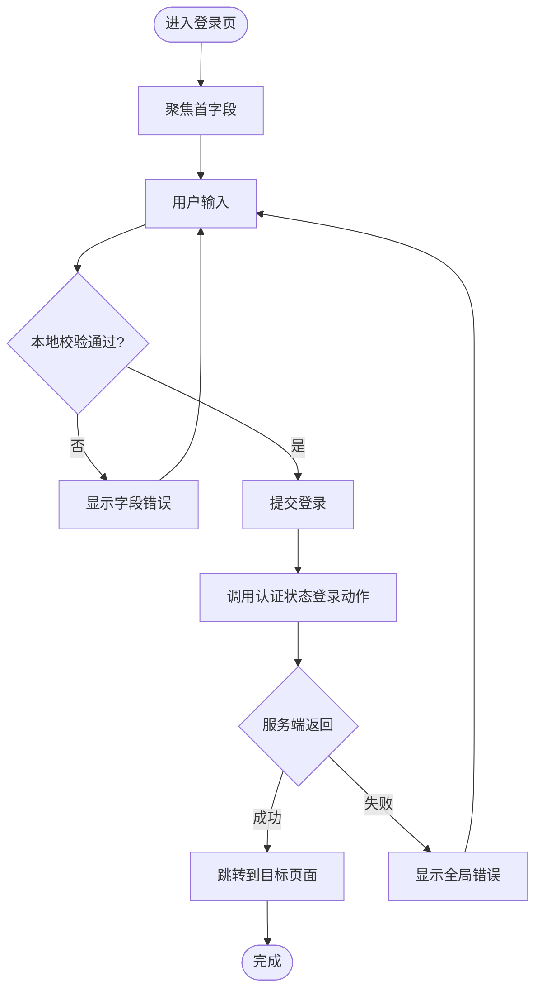
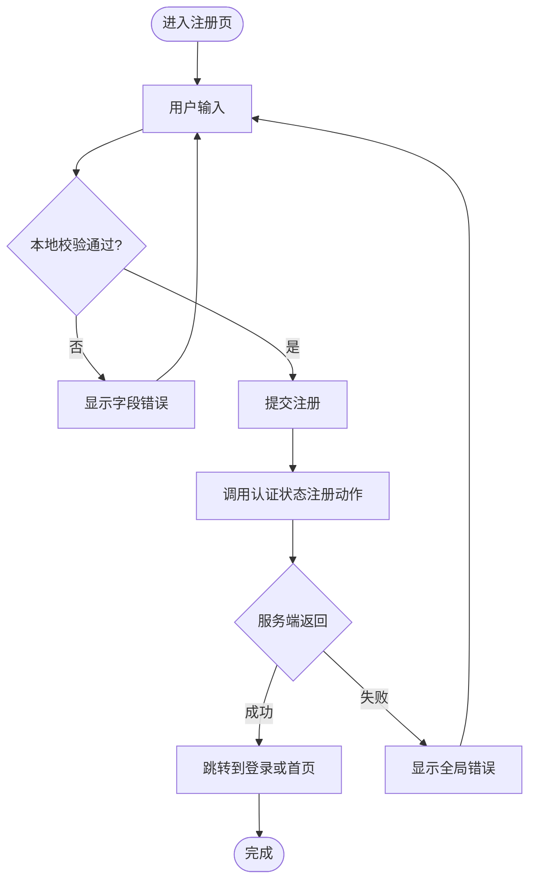
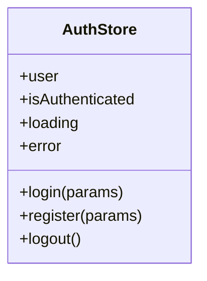
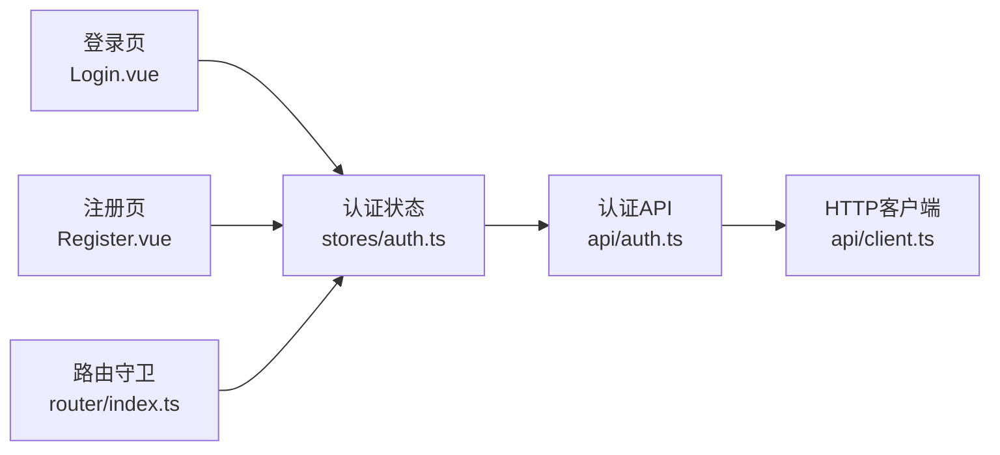

# 认证页面

<cite>
**本文引用的文件**
- [Login.vue](file://src/views/Login.vue)
- [Register.vue](file://src/views/Register.vue)
- [auth.ts](file://src/stores/auth.ts)
- [index.ts](file://src/router/index.ts)
- [auth.ts](file://src/api/auth.ts)
- [client.ts](file://src/api/client.ts)
- [types/index.ts](file://src/types/index.ts)
</cite>

## 目录
1. [简介](#简介)
2. [项目结构](#项目结构)
3. [核心组件](#核心组件)
4. [架构总览](#架构总览)
5. [详细组件分析](#详细组件分析)
6. [依赖关系分析](#依赖关系分析)
7. [性能考虑](#性能考虑)
8. [故障排查指南](#故障排查指南)
9. [结论](#结论)
10. [附录](#附录)

## 简介
本章节面向认证相关的前端实现，聚焦登录与注册页面的完整工作流：表单验证、用户输入处理、错误提示机制、路由守卫集成、状态管理同步，以及表单复用策略、密码安全处理、用户体验优化与移动端适配。文档以代码级视角梳理关键流程，并提供可复用的实践建议与排错指引。

## 项目结构
认证功能涉及视图层（登录/注册）、状态层（认证状态）、网络层（API 调用）与路由层（访问控制）。整体组织如下：
- 视图层：登录页 Login.vue、注册页 Register.vue
- 状态层：认证状态 auth.ts（登录态、用户信息、加载与错误状态）
- 网络层：auth.ts（登录/注册接口封装）、client.ts（请求拦截器、错误统一处理）
- 路由层：index.ts（路由守卫，基于认证状态保护受保护路由）
- 类型定义：types/index.ts（统一的请求/响应类型）

图表来源
- [Login.vue](file://src/views/Login.vue)
- [Register.vue](file://src/views/Register.vue)
- [auth.ts](file://src/stores/auth.ts)
- [auth.ts](file://src/api/auth.ts)
- [client.ts](file://src/api/client.ts)
- [index.ts](file://src/router/index.ts)

章节来源
- [Login.vue](file://src/views/Login.vue)
- [Register.vue](file://src/views/Register.vue)
- [auth.ts](file://src/stores/auth.ts)
- [auth.ts](file://src/api/auth.ts)
- [client.ts](file://src/api/client.ts)
- [index.ts](file://src/router/index.ts)

## 核心组件
- 登录页（Login.vue）：负责用户名/邮箱与密码的输入收集、本地校验、提交到认证服务、更新认证状态并跳转。
- 注册页（Register.vue）：负责用户名、邮箱、密码及确认密码的输入收集、本地校验、提交到认证服务、成功后引导登录或跳转。
- 认证状态（stores/auth.ts）：集中管理登录态、用户信息、加载与错误状态；提供登录、注册、登出等动作。
- 认证 API（api/auth.ts）：封装登录、注册等接口调用，统一参数与返回结构。
- HTTP 客户端（api/client.ts）：封装请求/响应拦截，统一错误处理、Token 注入与刷新。
- 路由守卫（router/index.ts）：根据认证状态决定路由访问权限，未登录时重定向至登录页。

章节来源
- [Login.vue](file://src/views/Login.vue)
- [Register.vue](file://src/views/Register.vue)
- [auth.ts](file://src/stores/auth.ts)
- [auth.ts](file://src/api/auth.ts)
- [client.ts](file://src/api/client.ts)
- [index.ts](file://src/router/index.ts)

## 架构总览
以下序列图展示“登录”端到端流程：用户在登录页提交表单，触发状态层的登录动作，调用认证 API，通过 HTTP 客户端发送请求，服务端返回结果后更新状态并导航到目标页面。

图表来源
- [Login.vue](file://src/views/Login.vue)
- [auth.ts](file://src/stores/auth.ts)
- [auth.ts](file://src/api/auth.ts)
- [client.ts](file://src/api/client.ts)
- [index.ts](file://src/router/index.ts)

## 详细组件分析

### 登录页（Login.vue）
- 表单字段：用户名/邮箱、密码
- 本地校验：必填、格式（邮箱）、长度限制、密码强度提示
- 提交逻辑：
  - 禁用提交按钮防止重复提交
  - 调用认证状态中的登录动作
  - 根据返回结果处理成功跳转或显示错误
- 错误提示：
  - 字段级错误（如邮箱格式不正确）
  - 全局错误（如账号不存在、密码错误）
- 用户体验：
  - 加载态禁用提交
  - 自动聚焦首个输入框
  - 支持回车提交
- 移动端适配：
  - 使用自适应布局与触控友好的输入控件
  - 避免键盘遮挡（滚动容器）

图表来源
- [Login.vue](file://src/views/Login.vue)
- [auth.ts](file://src/stores/auth.ts)

章节来源
- [Login.vue](file://src/views/Login.vue)
- [auth.ts](file://src/stores/auth.ts)

### 注册页（Register.vue）
- 表单字段：用户名、邮箱、密码、确认密码
- 本地校验：
  - 必填、邮箱格式、密码强度（长度、字符组合）
  - 确认密码一致性校验
- 提交逻辑：
  - 防抖/节流提交
  - 调用认证状态中的注册动作
  - 成功后引导登录或跳转
- 错误提示：
  - 字段级错误（如邮箱已存在、密码不合规）
  - 全局错误（如网络异常、服务器错误）
- 用户体验：
  - 实时反馈（失焦校验）
  - 密码强度可视化
  - 无障碍标签与键盘导航
- 移动端适配：
  - 大点击区域、合适的字体大小
  - 软键盘弹出时的视口调整

图表来源
- [Register.vue](file://src/views/Register.vue)
- [auth.ts](file://src/stores/auth.ts)

章节来源
- [Register.vue](file://src/views/Register.vue)
- [auth.ts](file://src/stores/auth.ts)

### 认证状态（stores/auth.ts）
- 状态字段：
  - 用户信息、是否已登录、加载状态、错误信息
- 动作方法：
  - 登录：调用认证 API，成功后持久化 Token/用户信息，更新状态
  - 注册：调用认证 API，处理成功/失败分支
  - 登出：清除本地存储与状态
- 副作用：
  - 监听路由变化，必要时刷新用户信息
  - 错误统一归一化处理

图表来源
- [auth.ts](file://src/stores/auth.ts)

章节来源
- [auth.ts](file://src/stores/auth.ts)

### 认证 API（api/auth.ts）
- 封装登录、注册等接口调用
- 统一参数结构与返回值
- 与 HTTP 客户端协作，处理 Token 注入与错误映射

章节来源
- [auth.ts](file://src/api/auth.ts)

### HTTP 客户端（api/client.ts）
- 请求拦截：
  - 注入 Authorization 头（从本地存储读取 Token）
  - 请求前后可加日志/埋点
- 响应拦截：
  - 统一错误码处理（如 401 触发刷新/登出）
  - 将后端错误转换为前端友好提示
- 重试/超时：
  - 配置合理的超时与重试策略

章节来源
- [client.ts](file://src/api/client.ts)

### 路由守卫（router/index.ts）
- 前置守卫：
  - 检查认证状态，若未登录则重定向到登录页
  - 白名单路由（如登录/注册）允许直接访问
- 后置处理：
  - 记录访问统计或埋点
  - 清理临时状态

章节来源
- [index.ts](file://src/router/index.ts)

## 依赖关系分析
- 视图层依赖状态层：登录/注册页通过调用认证状态的动作来执行业务逻辑
- 状态层依赖网络层：认证状态调用认证 API，再由 HTTP 客户端发送请求
- 路由层依赖状态层：根据认证状态决定路由访问权限
- 类型系统贯穿：所有模块共享 types/index.ts 中的类型定义，保证前后端契约一致

图表来源
- [Login.vue](file://src/views/Login.vue)
- [Register.vue](file://src/views/Register.vue)
- [auth.ts](file://src/stores/auth.ts)
- [auth.ts](file://src/api/auth.ts)
- [client.ts](file://src/api/client.ts)
- [index.ts](file://src/router/index.ts)

章节来源
- [Login.vue](file://src/views/Login.vue)
- [Register.vue](file://src/views/Register.vue)
- [auth.ts](file://src/stores/auth.ts)
- [auth.ts](file://src/api/auth.ts)
- [client.ts](file://src/api/client.ts)
- [index.ts](file://src/router/index.ts)

## 性能考虑
- 表单校验：
  - 使用防抖减少频繁校验
  - 失焦时进行较重的校验，输入时仅做轻量校验
- 网络请求：
  - 合理设置超时与重试次数
  - 对相同请求进行去重（如快速多次点击）
- 状态更新：
  - 批量更新状态，避免不必要的重渲染
  - 仅在必要时持久化数据（如 Token）
- 资源加载：
  - 按需加载路由与组件
  - 图片与样式懒加载

[本节为通用性能建议，不直接分析具体文件]

## 故障排查指南
- 常见问题定位：
  - 表单无法提交：检查本地校验条件与提交按钮禁用逻辑
  - 登录失败：查看认证状态中的错误信息与 HTTP 客户端的错误映射
  - 路由守卫无效：确认认证状态是否正确初始化与更新
- 调试技巧：
  - 在 HTTP 客户端中开启请求/响应日志
  - 在认证状态中打印关键状态变更
  - 使用浏览器开发者工具的网络面板检查请求与响应
- 常见错误与处理：
  - 401 未授权：检查 Token 是否存在与是否过期，必要时触发刷新或登出
  - 403 禁止访问：检查权限与角色配置
  - 500 服务器错误：记录错误详情并提示用户稍后再试

章节来源
- [client.ts](file://src/api/client.ts)
- [auth.ts](file://src/stores/auth.ts)
- [index.ts](file://src/router/index.ts)

## 结论
认证页面通过清晰的职责划分实现了登录与注册的完整流程：视图层负责交互与校验，状态层统一管理认证状态，网络层封装 API 与错误处理，路由层保障访问安全。结合表单复用策略、密码安全处理、用户体验优化与移动端适配，可在保证安全性的同时提供良好的用户体验。建议在后续迭代中持续完善错误提示、无障碍支持与性能监控。

[本节为总结性内容，不直接分析具体文件]

## 附录

### 表单验证规则示例（路径参考）
- 邮箱格式校验：在登录/注册页的本地校验逻辑中实现
- 密码强度校验：包含长度、字符组合要求
- 确认密码一致性：在注册页中进行比对
- 自定义验证规则：可扩展为异步校验（如用户名唯一性）

章节来源
- [Login.vue](file://src/views/Login.vue)
- [Register.vue](file://src/views/Register.vue)

### 密码安全处理建议（路径参考）
- 传输安全：确保使用 HTTPS
- 存储安全：不在本地明文存储敏感信息
- 提示策略：不泄露具体错误原因（如区分账号不存在与密码错误）

章节来源
- [client.ts](file://src/api/client.ts)
- [auth.ts](file://src/stores/auth.ts)

### 移动端适配要点（路径参考）
- 输入控件尺寸与触控友好
- 键盘弹出时的视口调整
- 响应式布局与可读性优化

章节来源
- [Login.vue](file://src/views/Login.vue)
- [Register.vue](file://src/views/Register.vue)