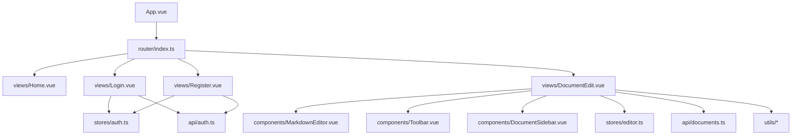
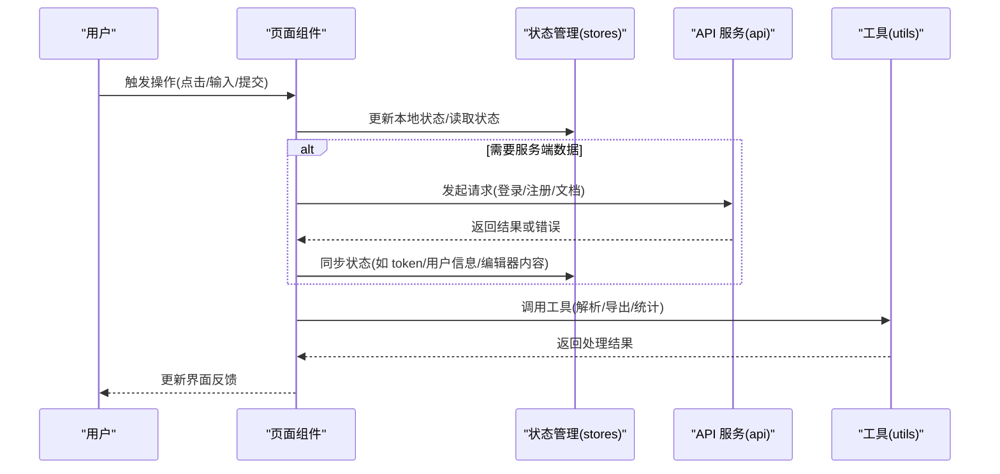
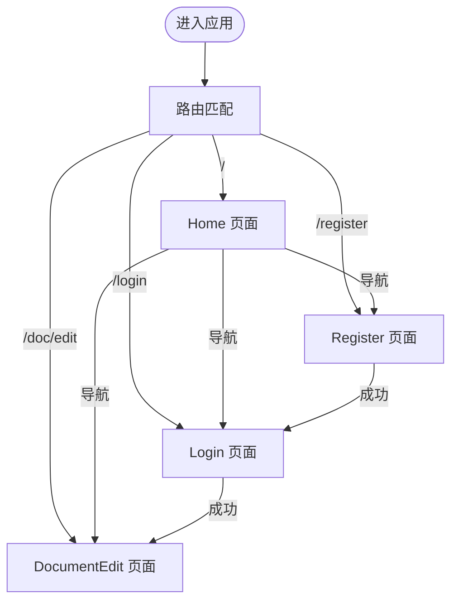
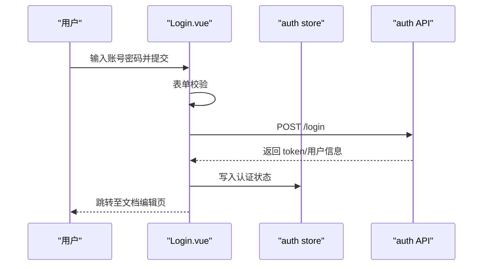
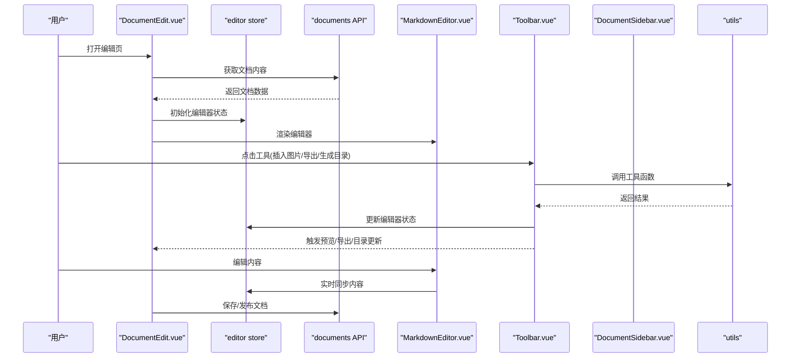
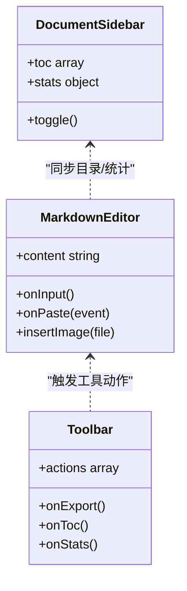
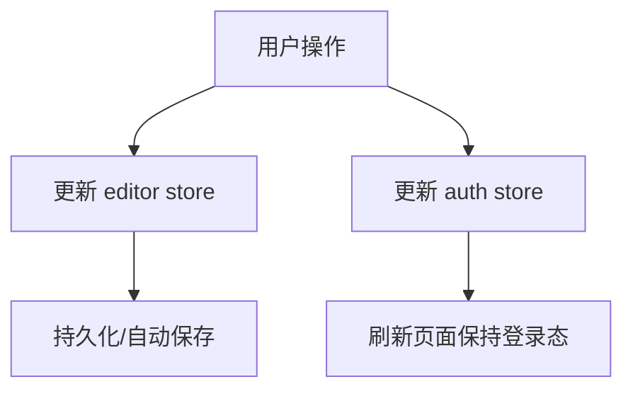
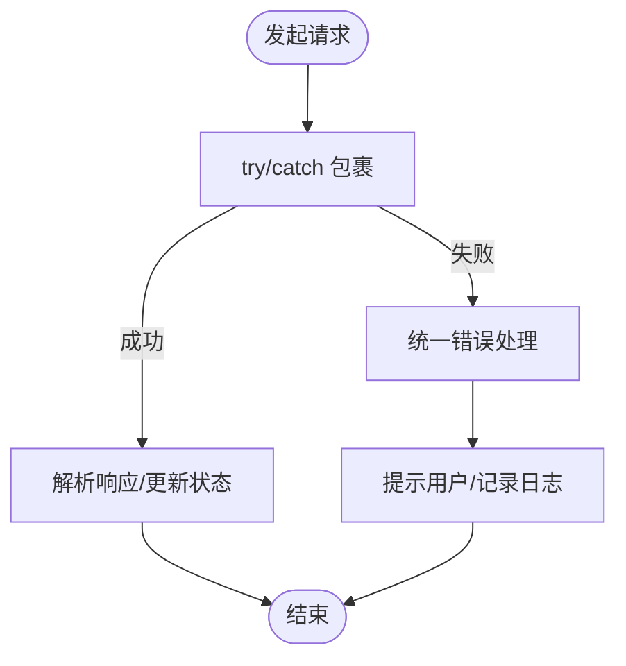
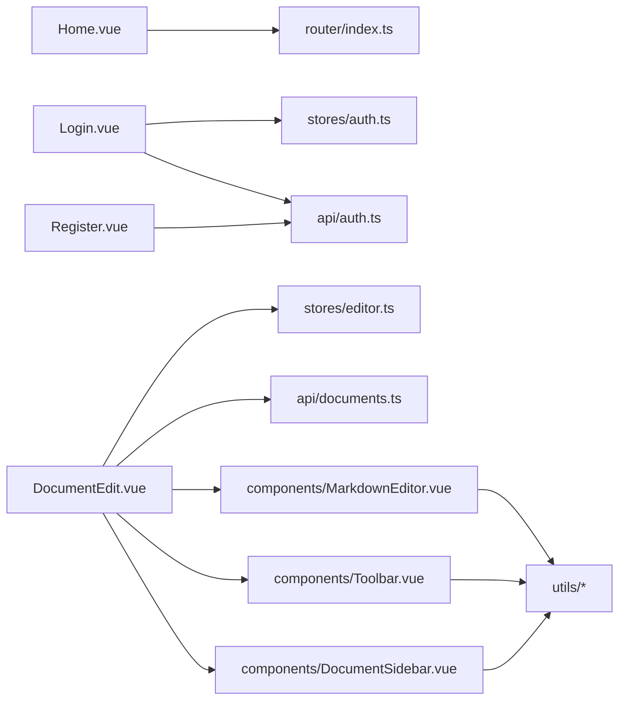

# 页面组件

<cite>
**本文引用的文件**
- [src/router/index.ts](file://src/router/index.ts)
- [src/views/Home.vue](file://src/views/Home.vue)
- [src/views/Login.vue](file://src/views/Login.vue)
- [src/views/Register.vue](file://src/views/Register.vue)
- [src/views/DocumentEdit.vue](file://src/views/DocumentEdit.vue)
- [src/stores/auth.ts](file://src/stores/auth.ts)
- [src/stores/editor.ts](file://src/stores/editor.ts)
- [src/api/auth.ts](file://src/api/auth.ts)
- [src/api/documents.ts](file://src/api/documents.ts)
- [src/components/MarkdownEditor.vue](file://src/components/MarkdownEditor.vue)
- [src/components/Toolbar.vue](file://src/components/Toolbar.vue)
- [src/components/DocumentSidebar.vue](file://src/components/DocumentSidebar.vue)
- [src/utils/markdown.ts](file://src/utils/markdown.ts)
- [src/utils/export.ts](file://src/utils/export.ts)
- [src/utils/image.ts](file://src/utils/image.ts)
- [src/utils/toc.ts](file://src/utils/toc.ts)
- [src/utils/stats.ts](file://src/utils/stats.ts)
- [src/utils/editor.ts](file://src/utils/editor.ts)
- [src/types/index.ts](file://src/types/index.ts)
- [src/main.ts](file://src/main.ts)
- [src/App.vue](file://src/App.vue)
</cite>

## 目录
1. [简介](#简介)
2. [项目结构](#项目结构)
3. [核心组件](#核心组件)
4. [架构总览](#架构总览)
5. [详细组件分析](#详细组件分析)
6. [依赖关系分析](#依赖关系分析)
7. [性能考虑](#性能考虑)
8. [故障排查指南](#故障排查指南)
9. [结论](#结论)
10. [附录](#附录)

## 简介
本文件面向页面级 Vue 组件，系统性说明项目中所有页面组件的设计与使用方法。内容涵盖：
- 路由配置与页面导航
- 数据获取流程（API 调用、错误处理）
- 用户交互逻辑（表单、编辑器、工具栏）
- 状态管理集成（Pinia stores）
- 响应式设计实现
- 页面间导航与数据传递机制
- 使用示例与代码片段路径指引

## 项目结构
本项目采用基于功能分层的组织方式：
- views：页面级组件（Home、Login、Register、DocumentEdit）
- components：可复用 UI 组件（MarkdownEditor、Toolbar、DocumentSidebar）
- stores：全局状态（auth、editor）
- api：HTTP 请求封装与接口定义
- utils：工具函数（Markdown、导出、图片、目录、统计、编辑器辅助）
- router：路由配置
- types：类型定义
- main.ts / App.vue：应用入口与根组件

图表来源
- [src/App.vue:1-200](file://src/App.vue#L1-L200)
- [src/router/index.ts:1-200](file://src/router/index.ts#L1-L200)
- [src/views/Home.vue:1-200](file://src/views/Home.vue#L1-L200)
- [src/views/Login.vue:1-200](file://src/views/Login.vue#L1-L200)
- [src/views/Register.vue:1-200](file://src/views/Register.vue#L1-L200)
- [src/views/DocumentEdit.vue:1-200](file://src/views/DocumentEdit.vue#L1-L200)
- [src/components/MarkdownEditor.vue:1-200](file://src/components/MarkdownEditor.vue#L1-L200)
- [src/components/Toolbar.vue:1-200](file://src/components/Toolbar.vue#L1-L200)
- [src/components/DocumentSidebar.vue:1-200](file://src/components/DocumentSidebar.vue#L1-L200)
- [src/stores/editor.ts:1-200](file://src/stores/editor.ts#L1-L200)
- [src/stores/auth.ts:1-200](file://src/stores/auth.ts#L1-L200)
- [src/api/documents.ts:1-200](file://src/api/documents.ts#L1-L200)
- [src/api/auth.ts:1-200](file://src/api/auth.ts#L1-L200)

章节来源
- [src/main.ts:1-200](file://src/main.ts#L1-L200)
- [src/App.vue:1-200](file://src/App.vue#L1-L200)
- [src/router/index.ts:1-200](file://src/router/index.ts#L1-L200)

## 核心组件
- Home：首页展示与导航入口
- Login：登录页，包含表单校验、认证状态更新与跳转
- Register：注册页，包含表单校验、创建账户与跳转
- DocumentEdit：文档编辑页，集成 Markdown 编辑器、工具栏、侧边栏、目录与统计信息

这些页面通过路由进行导航，并通过 Pinia 的 auth 与 editor 状态管理模块共享状态。

章节来源
- [src/views/Home.vue:1-200](file://src/views/Home.vue#L1-L200)
- [src/views/Login.vue:1-200](file://src/views/Login.vue#L1-L200)
- [src/views/Register.vue:1-200](file://src/views/Register.vue#L1-L200)
- [src/views/DocumentEdit.vue:1-200](file://src/views/DocumentEdit.vue#L1-L200)
- [src/stores/auth.ts:1-200](file://src/stores/auth.ts#L1-L200)
- [src/stores/editor.ts:1-200](file://src/stores/editor.ts#L1-L200)

## 架构总览
页面到状态与 API 的交互遵循“视图层 -> 状态层 -> 服务层”的分层模式：
- 视图层（views）负责渲染与用户交互
- 状态层（stores）集中管理认证与编辑器状态
- 服务层（api）封装 HTTP 请求与错误处理
- 工具层（utils）提供 Markdown、导出、图片、目录、统计等能力

图表来源
- [src/views/DocumentEdit.vue:1-200](file://src/views/DocumentEdit.vue#L1-L200)
- [src/stores/editor.ts:1-200](file://src/stores/editor.ts#L1-L200)
- [src/stores/auth.ts:1-200](file://src/stores/auth.ts#L1-L200)
- [src/api/documents.ts:1-200](file://src/api/documents.ts#L1-L200)
- [src/api/auth.ts:1-200](file://src/api/auth.ts#L1-L200)
- [src/utils/markdown.ts:1-200](file://src/utils/markdown.ts#L1-L200)
- [src/utils/export.ts:1-200](file://src/utils/export.ts#L1-L200)
- [src/utils/image.ts:1-200](file://src/utils/image.ts#L1-L200)
- [src/utils/toc.ts:1-200](file://src/utils/toc.ts#L1-L200)
- [src/utils/stats.ts:1-200](file://src/utils/stats.ts#L1-L200)

## 详细组件分析

### 路由配置与导航
- 路由入口由 router/index.ts 定义，将各页面挂载到对应路径
- 页面间导航通过路由跳转完成，支持带参跳转与守卫（如需鉴权）
- 建议在登录后重定向至文档编辑页，或在未登录时拦截访问

图表来源
- [src/router/index.ts:1-200](file://src/router/index.ts#L1-L200)
- [src/views/Home.vue:1-200](file://src/views/Home.vue#L1-L200)
- [src/views/Login.vue:1-200](file://src/views/Login.vue#L1-L200)
- [src/views/Register.vue:1-200](file://src/views/Register.vue#L1-L200)
- [src/views/DocumentEdit.vue:1-200](file://src/views/DocumentEdit.vue#L1-L200)

章节来源
- [src/router/index.ts:1-200](file://src/router/index.ts#L1-L200)

### 首页（Home.vue）
- 职责：展示入口与导航链接
- 交互：跳转到登录、注册、文档编辑页
- 响应式：使用 Tailwind 类实现移动端适配布局

使用示例与片段路径
- 导航跳转方法参考：[src/views/Home.vue:1-200](file://src/views/Home.vue#L1-L200)

章节来源
- [src/views/Home.vue:1-200](file://src/views/Home.vue#L1-L200)

### 登录页（Login.vue）
- 职责：收集用户名/密码，调用认证接口，更新认证状态并跳转
- 数据获取：调用认证 API，处理成功/失败分支
- 状态管理：成功后在 auth store 中保存用户信息与令牌
- 表单处理：前端校验必填项与格式，提交前阻止默认行为
- 错误处理：捕获网络异常与服务端错误，提示用户
- 用户体验：加载态、禁用提交按钮、聚焦与键盘快捷键

图表来源
- [src/views/Login.vue:1-200](file://src/views/Login.vue#L1-L200)
- [src/stores/auth.ts:1-200](file://src/stores/auth.ts#L1-L200)
- [src/api/auth.ts:1-200](file://src/api/auth.ts#L1-L200)

章节来源
- [src/views/Login.vue:1-200](file://src/views/Login.vue#L1-L200)
- [src/stores/auth.ts:1-200](file://src/stores/auth.ts#L1-L200)
- [src/api/auth.ts:1-200](file://src/api/auth.ts#L1-L200)

### 注册页（Register.vue）
- 职责：收集注册信息，调用注册接口，成功后引导登录
- 表单处理：校验邮箱、密码强度、确认密码一致性
- 错误处理：统一错误提示与字段级错误展示
- 用户体验：加载态、防重复提交

使用示例与片段路径
- 表单校验与提交逻辑参考：[src/views/Register.vue:1-200](file://src/views/Register.vue#L1-L200)
- 注册 API 调用参考：[src/api/auth.ts:1-200](file://src/api/auth.ts#L1-L200)

章节来源
- [src/views/Register.vue:1-200](file://src/views/Register.vue#L1-L200)
- [src/api/auth.ts:1-200](file://src/api/auth.ts#L1-L200)

### 文档编辑页（DocumentEdit.vue）
- 职责：文档内容的增删改查、预览、导出、目录生成、统计信息
- 数据获取：从 API 拉取文档内容，保存/更新文档
- 状态管理：editor store 维护当前文档内容、光标位置、历史记录等
- 组件集成：MarkdownEditor、Toolbar、DocumentSidebar
- 工具集成：markdown、export、image、toc、stats、editor
- 响应式：移动端折叠侧边栏，编辑器自适应宽度

图表来源
- [src/views/DocumentEdit.vue:1-200](file://src/views/DocumentEdit.vue#L1-L200)
- [src/stores/editor.ts:1-200](file://src/stores/editor.ts#L1-L200)
- [src/api/documents.ts:1-200](file://src/api/documents.ts#L1-L200)
- [src/components/MarkdownEditor.vue:1-200](file://src/components/MarkdownEditor.vue#L1-L200)
- [src/components/Toolbar.vue:1-200](file://src/components/Toolbar.vue#L1-L200)
- [src/components/DocumentSidebar.vue:1-200](file://src/components/DocumentSidebar.vue#L1-L200)
- [src/utils/markdown.ts:1-200](file://src/utils/markdown.ts#L1-L200)
- [src/utils/export.ts:1-200](file://src/utils/export.ts#L1-L200)
- [src/utils/image.ts:1-200](file://src/utils/image.ts#L1-L200)
- [src/utils/toc.ts:1-200](file://src/utils/toc.ts#L1-L200)
- [src/utils/stats.ts:1-200](file://src/utils/stats.ts#L1-L200)

章节来源
- [src/views/DocumentEdit.vue:1-200](file://src/views/DocumentEdit.vue#L1-L200)
- [src/stores/editor.ts:1-200](file://src/stores/editor.ts#L1-L200)
- [src/api/documents.ts:1-200](file://src/api/documents.ts#L1-L200)
- [src/components/MarkdownEditor.vue:1-200](file://src/components/MarkdownEditor.vue#L1-L200)
- [src/components/Toolbar.vue:1-200](file://src/components/Toolbar.vue#L1-L200)
- [src/components/DocumentSidebar.vue:1-200](file://src/components/DocumentSidebar.vue#L1-L200)
- [src/utils/markdown.ts:1-200](file://src/utils/markdown.ts#L1-L200)
- [src/utils/export.ts:1-200](file://src/utils/export.ts#L1-L200)
- [src/utils/image.ts:1-200](file://src/utils/image.ts#L1-L200)
- [src/utils/toc.ts:1-200](file://src/utils/toc.ts#L1-L200)
- [src/utils/stats.ts:1-200](file://src/utils/stats.ts#L1-L200)

### 编辑器与工具链（MarkdownEditor、Toolbar、DocumentSidebar）
- MarkdownEditor：双向绑定编辑器内容，处理粘贴图片、快捷键、语法高亮
- Toolbar：提供常用操作（加粗、斜体、插入图片、导出、生成目录、统计）
- DocumentSidebar：显示目录、文档列表、统计信息；支持移动端折叠

图表来源
- [src/components/MarkdownEditor.vue:1-200](file://src/components/MarkdownEditor.vue#L1-L200)
- [src/components/Toolbar.vue:1-200](file://src/components/Toolbar.vue#L1-L200)
- [src/components/DocumentSidebar.vue:1-200](file://src/components/DocumentSidebar.vue#L1-L200)

章节来源
- [src/components/MarkdownEditor.vue:1-200](file://src/components/MarkdownEditor.vue#L1-L200)
- [src/components/Toolbar.vue:1-200](file://src/components/Toolbar.vue#L1-L200)
- [src/components/DocumentSidebar.vue:1-200](file://src/components/DocumentSidebar.vue#L1-L200)

### 状态管理（auth、editor）
- auth store：管理登录态、用户信息、令牌存储与过期处理
- editor store：管理文档内容、历史版本、光标位置、选中范围、自动保存策略

图表来源
- [src/stores/editor.ts:1-200](file://src/stores/editor.ts#L1-L200)
- [src/stores/auth.ts:1-200](file://src/stores/auth.ts#L1-L200)

章节来源
- [src/stores/editor.ts:1-200](file://src/stores/editor.ts#L1-L200)
- [src/stores/auth.ts:1-200](file://src/stores/auth.ts#L1-L200)

### API 与错误处理
- auth API：登录、注册、登出、刷新令牌
- documents API：获取、创建、更新、删除文档
- 错误处理：统一捕获网络错误、业务错误码，转换为友好提示

图表来源
- [src/api/auth.ts:1-200](file://src/api/auth.ts#L1-L200)
- [src/api/documents.ts:1-200](file://src/api/documents.ts#L1-L200)

章节来源
- [src/api/auth.ts:1-200](file://src/api/auth.ts#L1-L200)
- [src/api/documents.ts:1-200](file://src/api/documents.ts#L1-L200)

### 工具函数（utils）
- markdown：Markdown 解析、转换、安全过滤
- export：导出为 PDF/HTML/Markdown
- image：图片上传、压缩、Base64 转换
- toc：根据标题生成目录树
- stats：字数、段落、阅读时长统计
- editor：编辑器辅助（光标定位、选区操作）

使用示例与片段路径
- 导出功能参考：[src/utils/export.ts:1-200](file://src/utils/export.ts#L1-L200)
- 目录生成参考：[src/utils/toc.ts:1-200](file://src/utils/toc.ts#L1-L200)
- 图片处理参考：[src/utils/image.ts:1-200](file://src/utils/image.ts#L1-L200)
- 统计信息参考：[src/utils/stats.ts:1-200](file://src/utils/stats.ts#L1-L200)
- 编辑器辅助参考：[src/utils/editor.ts:1-200](file://src/utils/editor.ts#L1-L200)

章节来源
- [src/utils/markdown.ts:1-200](file://src/utils/markdown.ts#L1-L200)
- [src/utils/export.ts:1-200](file://src/utils/export.ts#L1-L200)
- [src/utils/image.ts:1-200](file://src/utils/image.ts#L1-L200)
- [src/utils/toc.ts:1-200](file://src/utils/toc.ts#L1-L200)
- [src/utils/stats.ts:1-200](file://src/utils/stats.ts#L1-L200)
- [src/utils/editor.ts:1-200](file://src/utils/editor.ts#L1-L200)

### 类型定义（types）
- 统一数据类型：用户、文档、编辑器状态、API 响应等
- 作用：提升类型安全、减少运行时错误、增强 IDE 提示

使用示例与片段路径
- 类型定义参考：[src/types/index.ts:1-200](file://src/types/index.ts#L1-L200)

章节来源
- [src/types/index.ts:1-200](file://src/types/index.ts#L1-L200)

## 依赖关系分析
页面组件与状态、API、工具之间的依赖如下：

图表来源
- [src/views/Home.vue:1-200](file://src/views/Home.vue#L1-L200)
- [src/views/Login.vue:1-200](file://src/views/Login.vue#L1-L200)
- [src/views/Register.vue:1-200](file://src/views/Register.vue#L1-L200)
- [src/views/DocumentEdit.vue:1-200](file://src/views/DocumentEdit.vue#L1-L200)
- [src/stores/auth.ts:1-200](file://src/stores/auth.ts#L1-L200)
- [src/stores/editor.ts:1-200](file://src/stores/editor.ts#L1-L200)
- [src/api/auth.ts:1-200](file://src/api/auth.ts#L1-L200)
- [src/api/documents.ts:1-200](file://src/api/documents.ts#L1-L200)
- [src/components/MarkdownEditor.vue:1-200](file://src/components/MarkdownEditor.vue#L1-L200)
- [src/components/Toolbar.vue:1-200](file://src/components/Toolbar.vue#L1-L200)
- [src/components/DocumentSidebar.vue:1-200](file://src/components/DocumentSidebar.vue#L1-L200)
- [src/utils/markdown.ts:1-200](file://src/utils/markdown.ts#L1-L200)
- [src/utils/export.ts:1-200](file://src/utils/export.ts#L1-L200)
- [src/utils/image.ts:1-200](file://src/utils/image.ts#L1-L200)
- [src/utils/toc.ts:1-200](file://src/utils/toc.ts#L1-L200)
- [src/utils/stats.ts:1-200](file://src/utils/stats.ts#L1-L200)

章节来源
- [src/router/index.ts:1-200](file://src/router/index.ts#L1-L200)
- [src/views/Home.vue:1-200](file://src/views/Home.vue#L1-L200)
- [src/views/Login.vue:1-200](file://src/views/Login.vue#L1-L200)
- [src/views/Register.vue:1-200](file://src/views/Register.vue#L1-L200)
- [src/views/DocumentEdit.vue:1-200](file://src/views/DocumentEdit.vue#L1-L200)
- [src/stores/auth.ts:1-200](file://src/stores/auth.ts#L1-L200)
- [src/stores/editor.ts:1-200](file://src/stores/editor.ts#L1-L200)
- [src/api/auth.ts:1-200](file://src/api/auth.ts#L1-L200)
- [src/api/documents.ts:1-200](file://src/api/documents.ts#L1-L200)
- [src/components/MarkdownEditor.vue:1-200](file://src/components/MarkdownEditor.vue#L1-L200)
- [src/components/Toolbar.vue:1-200](file://src/components/Toolbar.vue#L1-L200)
- [src/components/DocumentSidebar.vue:1-200](file://src/components/DocumentSidebar.vue#L1-L200)
- [src/utils/markdown.ts:1-200](file://src/utils/markdown.ts#L1-L200)
- [src/utils/export.ts:1-200](file://src/utils/export.ts#L1-L200)
- [src/utils/image.ts:1-200](file://src/utils/image.ts#L1-L200)
- [src/utils/toc.ts:1-200](file://src/utils/toc.ts#L1-L200)
- [src/utils/stats.ts:1-200](file://src/utils/stats.ts#L1-L200)

## 性能考虑
- 懒加载与按需引入：对大型组件与第三方库进行拆分，减少首屏体积
- 编辑器优化：增量更新、防抖/节流保存、虚拟滚动（长文档）
- 图片处理：上传前压缩、懒加载、WebP 格式优先
- 缓存策略：对静态资源与频繁读取的数据做缓存
- 渲染优化：避免不必要的 re-render，合理使用 computed/watch

## 故障排查指南
- 登录/注册失败
  - 检查网络与后端接口可用性
  - 查看浏览器控制台错误与响应体
  - 核对表单校验规则与必填字段
  - 参考：[src/views/Login.vue:1-200](file://src/views/Login.vue#L1-L200)、[src/views/Register.vue:1-200](file://src/views/Register.vue#L1-L200)、[src/api/auth.ts:1-200](file://src/api/auth.ts#L1-L200)
- 文档无法保存/加载
  - 检查权限与令牌是否有效
  - 查看 API 返回的错误码与消息
  - 确认 editor store 状态是否正确初始化
  - 参考：[src/views/DocumentEdit.vue:1-200](file://src/views/DocumentEdit.vue#L1-L200)、[src/stores/editor.ts:1-200](file://src/stores/editor.ts#L1-L200)、[src/api/documents.ts:1-200](file://src/api/documents.ts#L1-L200)
- 编辑器异常
  - 检查粘贴图片逻辑与 Base64 大小限制
  - 验证 Markdown 解析与目录生成逻辑
  - 参考：[src/components/MarkdownEditor.vue:1-200](file://src/components/MarkdownEditor.vue#L1-L200)、[src/utils/image.ts:1-200](file://src/utils/image.ts#L1-L200)、[src/utils/toc.ts:1-200](file://src/utils/toc.ts#L1-L200)

章节来源
- [src/views/Login.vue:1-200](file://src/views/Login.vue#L1-L200)
- [src/views/Register.vue:1-200](file://src/views/Register.vue#L1-L200)
- [src/views/DocumentEdit.vue:1-200](file://src/views/DocumentEdit.vue#L1-L200)
- [src/stores/editor.ts:1-200](file://src/stores/editor.ts#L1-L200)
- [src/api/auth.ts:1-200](file://src/api/auth.ts#L1-L200)
- [src/api/documents.ts:1-200](file://src/api/documents.ts#L1-L200)
- [src/components/MarkdownEditor.vue:1-200](file://src/components/MarkdownEditor.vue#L1-L200)
- [src/utils/image.ts:1-200](file://src/utils/image.ts#L1-L200)
- [src/utils/toc.ts:1-200](file://src/utils/toc.ts#L1-L200)

## 结论
本项目以清晰的页面分层与模块化设计实现了完整的文档编辑体验。通过路由、状态管理与 API 服务的解耦，页面组件专注于交互与渲染，工具函数提供稳定的业务能力。建议在生产环境中进一步完善错误上报、性能监控与单元测试覆盖。

## 附录
- 快速上手
  - 安装依赖后启动开发服务器
  - 访问首页进行导航测试
  - 使用登录/注册完成认证流程
  - 进入文档编辑页体验完整功能
- 常见问题
  - 跨域问题：检查代理与后端 CORS 配置
  - 图片上传失败：检查文件大小与格式限制
  - 导出失败：检查浏览器兼容性与权限