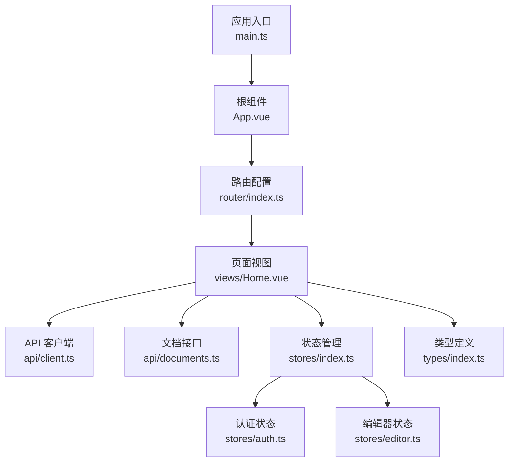
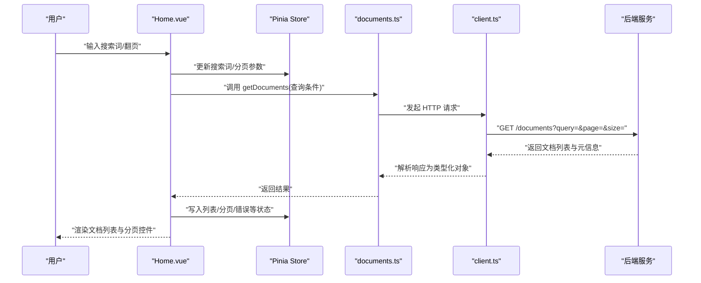
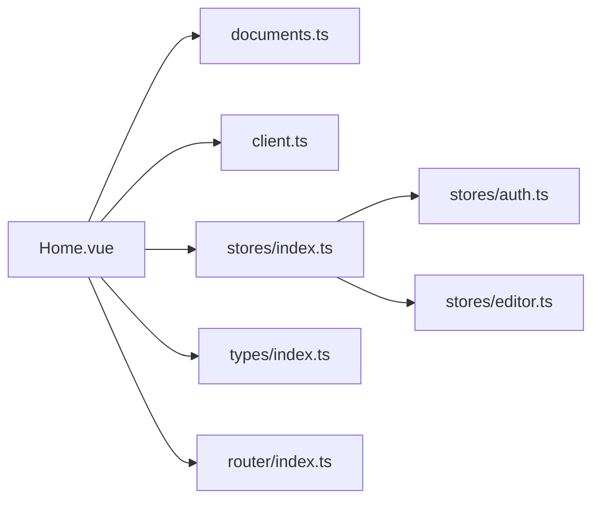

# 首页组件

<cite>
**本文引用的文件**
- [Home.vue](file://src/views/Home.vue)
- [documents.ts](file://src/api/documents.ts)
- [client.ts](file://src/api/client.ts)
- [index.ts](file://src/stores/index.ts)
- [auth.ts](file://src/stores/auth.ts)
- [editor.ts](file://src/stores/editor.ts)
- [index.ts](file://src/types/index.ts)
- [router/index.ts](file://src/router/index.ts)
- [App.vue](file://src/App.vue)
- [main.ts](file://src/main.ts)
</cite>

## 目录
1. [简介](#简介)
2. [项目结构](#项目结构)
3. [核心组件](#核心组件)
4. [架构总览](#架构总览)
5. [详细组件分析](#详细组件分析)
6. [依赖关系分析](#依赖关系分析)
7. [性能考虑](#性能考虑)
8. [故障排查指南](#故障排查指南)
9. [结论](#结论)
10. [附录](#附录)

## 简介
本章节面向“首页组件”（Home.vue）的完整文档，目标是帮助读者理解并扩展该组件。内容涵盖：
- 布局设计与响应式适配
- 文档列表展示与搜索过滤
- 分页逻辑与数据获取流程
- 用户交互处理（搜索、跳转、状态切换）
- 与状态管理（Pinia）和 API 层的集成
- 错误处理机制与可访问性建议
- 样式自定义与功能扩展点

## 项目结构
前端采用 Vue 3 + TypeScript + Pinia + Tailwind 的典型 SPA 结构。首页位于 views 层，通过路由进入；数据通过 api 层请求后端；状态由 stores 层集中管理；类型定义在 types 中统一维护。

图表来源
- [main.ts:1-50](file://src/main.ts#L1-L50)
- [App.vue:1-80](file://src/App.vue#L1-L80)
- [router/index.ts:1-60](file://src/router/index.ts#L1-L60)
- [Home.vue:1-200](file://src/views/Home.vue#L1-L200)
- [client.ts:1-120](file://src/api/client.ts#L1-L120)
- [documents.ts:1-120](file://src/api/documents.ts#L1-L120)
- [index.ts:1-60](file://src/stores/index.ts#L1-L60)
- [auth.ts:1-120](file://src/stores/auth.ts#L1-L120)
- [editor.ts:1-120](file://src/stores/editor.ts#L1-L120)
- [index.ts:1-120](file://src/types/index.ts#L1-L120)

章节来源
- [main.ts:1-50](file://src/main.ts#L1-L50)
- [App.vue:1-80](file://src/App.vue#L1-L80)
- [router/index.ts:1-60](file://src/router/index.ts#L1-L60)

## 核心组件
本节聚焦 Home.vue 的职责与能力：
- 作为文档列表页的容器，负责渲染搜索栏、文档列表、分页控件
- 协调数据获取（调用 documents API）、本地状态（搜索词、分页参数）与全局状态（如登录态）
- 处理用户交互：输入搜索关键词、切换页码、点击文档跳转编辑或预览
- 提供响应式布局：移动端/桌面端自适应显示

章节来源
- [Home.vue:1-200](file://src/views/Home.vue#L1-L200)

## 架构总览
首页的数据流遵循“视图 -> API -> 状态 -> 视图”的单向数据流模式，结合 Pinia 进行跨组件状态共享。

图表来源
- [Home.vue:1-200](file://src/views/Home.vue#L1-L200)
- [documents.ts:1-120](file://src/api/documents.ts#L1-L120)
- [client.ts:1-120](file://src/api/client.ts#L1-L120)

## 详细组件分析

### 布局设计与响应式实现
- 顶部区域：包含站点标题、搜索框、可能的操作按钮（如新建文档）
- 主体区域：文档卡片列表，支持网格/列表两种展示方式（根据屏幕宽度自动切换）
- 底部区域：分页控件，显示当前页、总页数、每页条数选择
- 响应式策略：使用 Tailwind 的断点类控制布局密度与字体大小，保证移动端可读性与触控友好

章节来源
- [Home.vue:1-200](file://src/views/Home.vue#L1-L200)

### 文档列表展示
- 数据来源：通过 documents API 拉取，按搜索词与分页参数过滤
- 展示字段：标题、摘要、更新时间、标签/分类（如有）
- 交互行为：点击卡片跳转到文档编辑或详情页；支持键盘导航与焦点可见性

章节来源
- [Home.vue:1-200](file://src/views/Home.vue#L1-L200)
- [documents.ts:1-120](file://src/api/documents.ts#L1-L120)

### 搜索过滤功能
- 防抖搜索：避免频繁请求，提升性能
- 多条件组合：支持关键词匹配、时间范围、标签筛选（若后端支持）
- 即时反馈：加载中状态、空状态提示、错误提示

章节来源
- [Home.vue:1-200](file://src/views/Home.vue#L1-L200)

### 分页逻辑
- 服务端分页：page、size 参数驱动，减少首屏数据量
- 边界保护：防止越界页码、非法 size
- 用户体验：保留滚动位置、加载指示器、无更多数据提示

章节来源
- [Home.vue:1-200](file://src/views/Home.vue#L1-L200)

### 用户交互处理
- 搜索输入：监听 keyup/change，触发防抖刷新
- 分页点击：校验页码范围后刷新列表
- 跳转导航：基于 router 进行页面跳转，携带必要参数
- 权限控制：未登录时引导登录或隐藏敏感操作

章节来源
- [Home.vue:1-200](file://src/views/Home.vue#L1-L200)
- [router/index.ts:1-60](file://src/router/index.ts#L1-L60)

### 数据获取流程
- 初始化：组件挂载时读取 URL 查询参数（如 page、q），设置初始状态并拉取数据
- 刷新：搜索词变化或分页变化时重新拉取
- 缓存：可选对搜索结果做短期内存缓存，提高二次访问速度

章节来源
- [Home.vue:1-200](file://src/views/Home.vue#L1-L200)
- [documents.ts:1-120](file://src/api/documents.ts#L1-L120)

### 状态管理集成（Pinia）
- 职责划分：
  - 本地状态：搜索词、分页参数、UI 开关（如加载态）
  - 全局状态：认证信息、主题、语言等
- 同步策略：将关键状态提升到 store，便于跨组件复用与持久化

章节来源
- [index.ts:1-60](file://src/stores/index.ts#L1-L60)
- [auth.ts:1-120](file://src/stores/auth.ts#L1-L120)
- [editor.ts:1-120](file://src/stores/editor.ts#L1-L120)

### 错误处理机制
- 网络异常：超时、断网、DNS 失败等统一捕获并提示
- 业务异常：后端返回错误码时，给出友好文案与重试入口
- 降级策略：部分失败时仅影响局部 UI，不阻断整体浏览

章节来源
- [client.ts:1-120](file://src/api/client.ts#L1-L120)
- [documents.ts:1-120](file://src/api/documents.ts#L1-L120)
- [Home.vue:1-200](file://src/views/Home.vue#L1-L200)

### 类型系统
- 文档模型：标题、摘要、更新时间、ID、标签等
- 分页模型：当前页、每页条数、总数、是否有下一页
- 请求/响应封装：统一错误结构与成功数据结构

章节来源
- [index.ts:1-120](file://src/types/index.ts#L1-L120)

## 依赖关系分析
Home.vue 依赖以下模块：
- API 层：documents.ts 提供文档查询；client.ts 提供 HTTP 封装
- 状态层：stores 中的 auth/editor 用于鉴权与编辑器相关状态
- 路由层：router/index.ts 用于页面跳转
- 类型层：types/index.ts 提供强类型约束

图表来源
- [Home.vue:1-200](file://src/views/Home.vue#L1-L200)
- [documents.ts:1-120](file://src/api/documents.ts#L1-L120)
- [client.ts:1-120](file://src/api/client.ts#L1-L120)
- [index.ts:1-60](file://src/stores/index.ts#L1-L60)
- [auth.ts:1-120](file://src/stores/auth.ts#L1-L120)
- [editor.ts:1-120](file://src/stores/editor.ts#L1-L120)
- [index.ts:1-120](file://src/types/index.ts#L1-L120)
- [router/index.ts:1-60](file://src/router/index.ts#L1-L60)

章节来源
- [Home.vue:1-200](file://src/views/Home.vue#L1-L200)
- [documents.ts:1-120](file://src/api/documents.ts#L1-L120)
- [client.ts:1-120](file://src/api/client.ts#L1-L120)
- [index.ts:1-60](file://src/stores/index.ts#L1-L60)
- [auth.ts:1-120](file://src/stores/auth.ts#L1-L120)
- [editor.ts:1-120](file://src/stores/editor.ts#L1-L120)
- [index.ts:1-120](file://src/types/index.ts#L1-L120)
- [router/index.ts:1-60](file://src/router/index.ts#L1-L60)

## 性能考虑
- 请求优化：
  - 防抖搜索，降低重复请求
  - 分页加载，减少首屏体积
  - 合理缓存：对相同查询结果做短期缓存
- 渲染优化：
  - 虚拟滚动（大数据集场景）
  - 图片懒加载与占位图
- 资源优化：
  - 按需引入第三方库
  - 压缩静态资源与启用 CDN

[本节为通用指导，不直接分析具体文件]

## 故障排查指南
- 搜索无结果：
  - 检查搜索词是否为空或过短
  - 确认后端是否支持对应过滤字段
  - 查看网络面板请求参数是否正确
- 分页异常：
  - 校验 page、size 合法性
  - 检查后端返回的分页元信息是否完整
- 网络错误：
  - 检查 client 的错误拦截与重试策略
  - 查看 CORS、鉴权头是否正确
- 权限问题：
  - 确认 auth store 中的登录态是否有效
  - 必要时引导重新登录

章节来源
- [client.ts:1-120](file://src/api/client.ts#L1-L120)
- [auth.ts:1-120](file://src/stores/auth.ts#L1-L120)
- [Home.vue:1-200](file://src/views/Home.vue#L1-L200)

## 结论
Home.vue 作为文档列表的核心入口，围绕“搜索+分页+列表”的主线实现了清晰的数据流与良好的用户体验。通过 Pinia 统一管理状态、API 层封装请求、类型系统保障契约，使得组件具备高内聚、低耦合的特性。后续可在搜索维度、分页体验、无障碍与国际化等方面持续优化。

[本节为总结性内容，不直接分析具体文件]

## 附录

### 自定义样式与扩展点
- 样式定制：
  - 覆盖 Tailwind 变量或新增样式类，调整卡片间距、字号、颜色
  - 针对移动端优化触摸区域与字体大小
- 功能扩展：
  - 增加高级筛选（日期、标签、作者）
  - 增加排序（按时间、热度）
  - 增加导出/批量操作
  - 接入统计埋点与性能监控

[本节为通用指导，不直接分析具体文件]