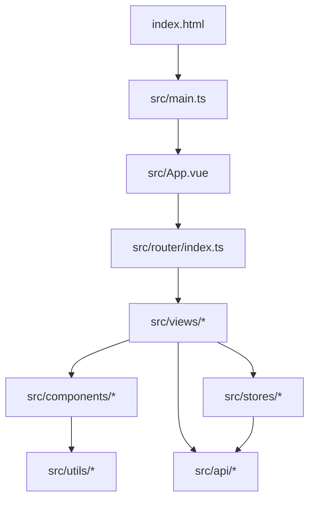
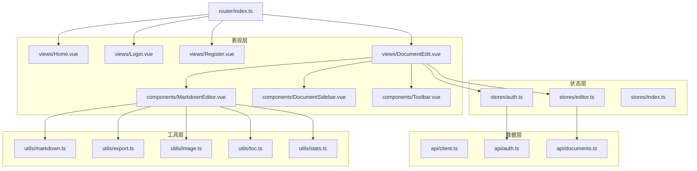
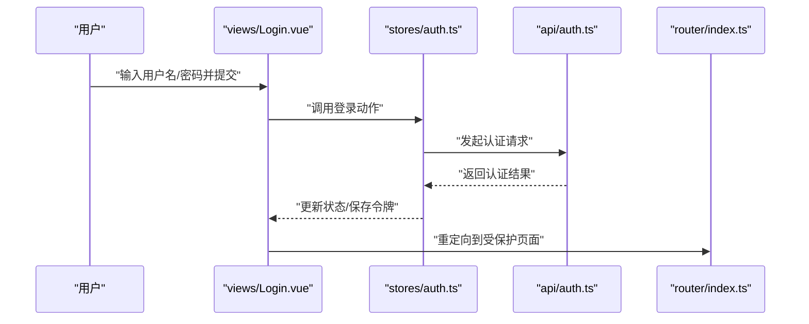
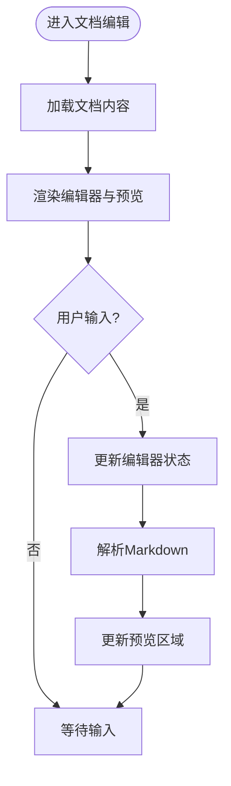
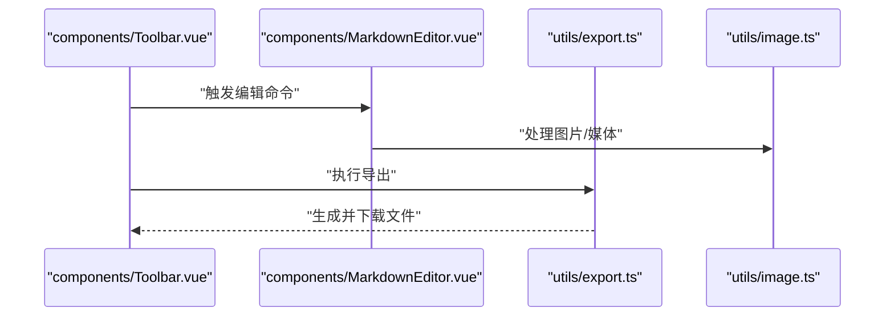
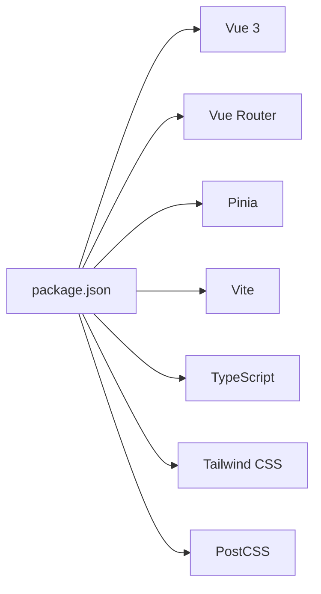

# 项目概述

<cite>
**本文引用的文件**
- [package.json](file://package.json)
- [vite.config.ts](file://vite.config.ts)
- [tailwind.config.js](file://tailwind.config.js)
- [postcss.config.js](file://postcss.config.js)
- [tsconfig.json](file://tsconfig.json)
- [index.html](file://index.html)
- [src/main.ts](file://src/main.ts)
- [src/App.vue](file://src/App.vue)
- [src/router/index.ts](file://src/router/index.ts)
- [src/stores/auth.ts](file://src/stores/auth.ts)
- [src/stores/editor.ts](file://src/stores/editor.ts)
- [src/stores/index.ts](file://src/stores/index.ts)
- [src/api/client.ts](file://src/api/client.ts)
- [src/api/auth.ts](file://src/api/auth.ts)
- [src/api/documents.ts](file://src/api/documents.ts)
- [src/components/MarkdownEditor.vue](file://src/components/MarkdownEditor.vue)
- [src/components/DocumentSidebar.vue](file://src/components/DocumentSidebar.vue)
- [src/components/Toolbar.vue](file://src/components/Toolbar.vue)
- [src/views/Home.vue](file://src/views/Home.vue)
- [src/views/Login.vue](file://src/views/Login.vue)
- [src/views/Register.vue](file://src/views/Register.vue)
- [src/views/DocumentEdit.vue](file://src/views/DocumentEdit.vue)
- [src/utils/markdown.ts](file://src/utils/markdown.ts)
- [src/utils/export.ts](file://src/utils/export.ts)
- [src/utils/image.ts](file://src/utils/image.ts)
- [src/utils/toc.ts](file://src/utils/toc.ts)
- [src/utils/stats.ts](file://src/utils/stats.ts)
- [src/types/index.ts](file://src/types/index.ts)
</cite>

## 目录
1. [简介](#简介)
2. [项目结构](#项目结构)
3. [核心组件](#核心组件)
4. [架构总览](#架构总览)
5. [详细组件分析](#详细组件分析)
6. [依赖关系分析](#依赖关系分析)
7. [性能考虑](#性能考虑)
8. [故障排查指南](#故障排查指南)
9. [结论](#结论)
10. [附录：快速开始与使用示例](#附录快速开始与使用示例)

## 简介
本项目是一个基于 Vue 3 + TypeScript 的现代化 Markdown 编辑器前端应用，提供用户认证、文档管理、实时预览、工具栏操作、导出等功能。整体采用模块化分层设计：视图层（views）负责页面路由与展示，组件层（components）封装可复用 UI，状态层（stores）集中管理全局与应用级状态，API 层（api）统一封装后端接口调用，工具层（utils）提供通用能力（如 Markdown 处理、导出、图片处理、目录生成、统计等），类型定义（types）统一前后端数据结构契约。构建与工程化由 Vite 驱动，样式采用 Tailwind CSS 与 PostCSS 组合，TypeScript 提供编译期类型检查与更好的开发体验。

该文档面向初学者介绍项目背景与使用方法，同时为有经验的开发者提供技术选型说明与架构解读。

## 项目结构
项目遵循“按功能域+层次”组织方式：
- src/api：HTTP 客户端与接口封装
- src/components：可复用 UI 组件（编辑器、侧边栏、工具栏等）
- src/router：Vue Router 路由配置
- src/stores：Pinia 状态管理（认证、编辑器状态等）
- src/types：TS 类型定义
- src/utils：工具函数（Markdown、导出、图片、目录、统计等）
- src/views：页面视图（首页、登录、注册、文档编辑）
- 根目录：Vite/Tailwind/PostCSS/TS 配置与入口 HTML

图表来源
- [index.html:1-50](file://index.html#L1-L50)
- [src/main.ts:1-80](file://src/main.ts#L1-L80)
- [src/App.vue:1-120](file://src/App.vue#L1-L120)
- [src/router/index.ts:1-120](file://src/router/index.ts#L1-L120)

章节来源
- [index.html:1-50](file://index.html#L1-L50)
- [src/main.ts:1-80](file://src/main.ts#L1-L80)
- [src/App.vue:1-120](file://src/App.vue#L1-L120)
- [src/router/index.ts:1-120](file://src/router/index.ts#L1-L120)

## 核心组件
- MarkdownEditor：Markdown 编辑与实时预览的核心容器，集成工具栏、内容区与预览区，负责与编辑器状态和 API 交互。
- DocumentSidebar：文档列表与导航，支持切换文档、新建/删除等操作。
- Toolbar：编辑工具栏，提供加粗、斜体、插入链接/图片、导出等快捷操作。
- 视图组件：Home（首页）、Login（登录）、Register（注册）、DocumentEdit（文档编辑页）。

这些组件通过 Pinia stores 共享状态，并通过 api 模块与后端通信。

章节来源
- [src/components/MarkdownEditor.vue:1-200](file://src/components/MarkdownEditor.vue#L1-L200)
- [src/components/DocumentSidebar.vue:1-200](file://src/components/DocumentSidebar.vue#L1-L200)
- [src/components/Toolbar.vue:1-200](file://src/components/Toolbar.vue#L1-L200)
- [src/views/Home.vue:1-120](file://src/views/Home.vue#L1-L120)
- [src/views/Login.vue:1-120](file://src/views/Login.vue#L1-L120)
- [src/views/Register.vue:1-120](file://src/views/Register.vue#L1-L120)
- [src/views/DocumentEdit.vue:1-200](file://src/views/DocumentEdit.vue#L1-L200)

## 架构总览
系统采用典型的前端分层架构：
- 表现层：Vue 单文件组件（views + components）
- 状态层：Pinia stores（auth、editor 等）
- 数据层：api 模块封装 HTTP 请求（client.ts + auth.ts + documents.ts）
- 工具层：utils（markdown、export、image、toc、stats）
- 路由层：router（页面跳转与权限守卫）
- 工程化：Vite + TS + Tailwind + PostCSS

图表来源
- [src/router/index.ts:1-120](file://src/router/index.ts#L1-L120)
- [src/views/DocumentEdit.vue:1-200](file://src/views/DocumentEdit.vue#L1-L200)
- [src/components/MarkdownEditor.vue:1-200](file://src/components/MarkdownEditor.vue#L1-L200)
- [src/stores/auth.ts:1-200](file://src/stores/auth.ts#L1-L200)
- [src/stores/editor.ts:1-200](file://src/stores/editor.ts#L1-L200)
- [src/api/client.ts:1-200](file://src/api/client.ts#L1-L200)
- [src/api/auth.ts:1-200](file://src/api/auth.ts#L1-L200)
- [src/api/documents.ts:1-200](file://src/api/documents.ts#L1-L200)
- [src/utils/markdown.ts:1-200](file://src/utils/markdown.ts#L1-L200)
- [src/utils/export.ts:1-200](file://src/utils/export.ts#L1-L200)
- [src/utils/image.ts:1-200](file://src/utils/image.ts#L1-L200)
- [src/utils/toc.ts:1-200](file://src/utils/toc.ts#L1-L200)
- [src/utils/stats.ts:1-200](file://src/utils/stats.ts#L1-L200)

## 详细组件分析

### 认证流程（登录/注册）
- 用户在 Login 或 Register 页面输入凭据
- 调用 stores/auth.ts 中的动作触发 api/auth.ts 的请求
- 成功后更新本地状态并跳转到受保护页面（如文档编辑）

图表来源
- [src/views/Login.vue:1-120](file://src/views/Login.vue#L1-L120)
- [src/stores/auth.ts:1-200](file://src/stores/auth.ts#L1-L200)
- [src/api/auth.ts:1-200](file://src/api/auth.ts#L1-L200)
- [src/router/index.ts:1-120](file://src/router/index.ts#L1-L120)

章节来源
- [src/views/Login.vue:1-120](file://src/views/Login.vue#L1-L120)
- [src/stores/auth.ts:1-200](file://src/stores/auth.ts#L1-L200)
- [src/api/auth.ts:1-200](file://src/api/auth.ts#L1-L200)
- [src/router/index.ts:1-120](file://src/router/index.ts#L1-L120)

### 文档编辑与实时预览
- DocumentEdit 页面承载 MarkdownEditor、DocumentSidebar、Toolbar
- MarkdownEditor 监听输入变化，调用 utils/markdown.ts 进行解析与渲染
- 通过 stores/editor.ts 管理当前文档内容与光标位置等状态
- 工具栏操作（插入链接/图片、导出）调用对应 utils 与 api

图表来源
- [src/views/DocumentEdit.vue:1-200](file://src/views/DocumentEdit.vue#L1-L200)
- [src/components/MarkdownEditor.vue:1-200](file://src/components/MarkdownEditor.vue#L1-L200)
- [src/stores/editor.ts:1-200](file://src/stores/editor.ts#L1-L200)
- [src/utils/markdown.ts:1-200](file://src/utils/markdown.ts#L1-L200)

章节来源
- [src/views/DocumentEdit.vue:1-200](file://src/views/DocumentEdit.vue#L1-L200)
- [src/components/MarkdownEditor.vue:1-200](file://src/components/MarkdownEditor.vue#L1-L200)
- [src/stores/editor.ts:1-200](file://src/stores/editor.ts#L1-L200)
- [src/utils/markdown.ts:1-200](file://src/utils/markdown.ts#L1-L200)

### 工具栏与导出
- Toolbar 提供常用编辑命令（加粗、斜体、插入图片/链接等）
- 导出功能通过 utils/export.ts 将内容转换为指定格式并触发下载
- 图片上传/处理通过 utils/image.ts 完成

图表来源
- [src/components/Toolbar.vue:1-200](file://src/components/Toolbar.vue#L1-L200)
- [src/components/MarkdownEditor.vue:1-200](file://src/components/MarkdownEditor.vue#L1-L200)
- [src/utils/export.ts:1-200](file://src/utils/export.ts#L1-L200)
- [src/utils/image.ts:1-200](file://src/utils/image.ts#L1-L200)

章节来源
- [src/components/Toolbar.vue:1-200](file://src/components/Toolbar.vue#L1-L200)
- [src/components/MarkdownEditor.vue:1-200](file://src/components/MarkdownEditor.vue#L1-L200)
- [src/utils/export.ts:1-200](file://src/utils/export.ts#L1-L200)
- [src/utils/image.ts:1-200](file://src/utils/image.ts#L1-L200)

## 依赖关系分析
- 构建与工程化
  - Vite：开发与构建工具
  - TypeScript：类型系统与编译时检查
  - Tailwind CSS + PostCSS：原子化样式与构建优化
- 运行时依赖
  - Vue 3：响应式框架
  - Vue Router：前端路由
  - Pinia：状态管理
  - Axios/Fetch：HTTP 请求（在 api/client.ts 中封装）
  - Markdown 解析库：用于实时预览（在 utils/markdown.ts 中使用）

图表来源
- [package.json:1-200](file://package.json#L1-L200)
- [vite.config.ts:1-120](file://vite.config.ts#L1-L120)
- [tailwind.config.js:1-120](file://tailwind.config.js#L1-L120)
- [postcss.config.js:1-120](file://postcss.config.js#L1-L120)
- [tsconfig.json:1-120](file://tsconfig.json#L1-L120)

章节来源
- [package.json:1-200](file://package.json#L1-L200)
- [vite.config.ts:1-120](file://vite.config.ts#L1-L120)
- [tailwind.config.js:1-120](file://tailwind.config.js#L1-L120)
- [postcss.config.js:1-120](file://postcss.config.js#L1-L120)
- [tsconfig.json:1-120](file://tsconfig.json#L1-L120)

## 性能考虑
- 懒加载与代码分割：通过路由级与组件级懒加载减少首屏体积
- 编辑器渲染优化：对长文档预览进行防抖/节流，按需渲染
- 网络请求优化：合并请求、缓存策略、错误重试与超时控制
- 资源优化：图片压缩与懒加载，静态资源按需引入
- 构建优化：Tree-shaking、生产环境压缩与 SourceMap 控制

[本节为通用指导，不直接分析具体文件]

## 故障排查指南
- 构建失败
  - 检查 TypeScript 配置与类型定义是否一致
  - 确认 Vite 插件与 Tailwind/PostCSS 配置正确
- 运行时报错
  - 检查路由配置与组件导入路径
  - 查看浏览器控制台与 Network 面板定位问题
- 认证相关
  - 校验 Token 存储与过期处理逻辑
  - 检查后端接口返回码与跨域配置
- 编辑器异常
  - 检查 Markdown 解析库版本与兼容性
  - 验证图片上传与导出功能的边界条件

章节来源
- [tsconfig.json:1-120](file://tsconfig.json#L1-L120)
- [vite.config.ts:1-120](file://vite.config.ts#L1-L120)
- [tailwind.config.js:1-120](file://tailwind.config.js#L1-L120)
- [postcss.config.js:1-120](file://postcss.config.js#L1-L120)
- [src/router/index.ts:1-120](file://src/router/index.ts#L1-L120)
- [src/api/client.ts:1-200](file://src/api/client.ts#L1-L200)

## 结论
本项目以 Vue 3 + TypeScript 为核心，结合 Vite、Tailwind、Pinia 等现代前端技术栈，构建了具备用户认证、文档管理与实时预览能力的 Markdown 编辑器。分层清晰、职责明确，便于扩展与维护。对于初学者，可通过“快速开始”迅速上手；对于资深开发者，可在现有架构基础上继续增强功能与性能。

[本节为总结性内容，不直接分析具体文件]

## 附录：快速开始与使用示例
- 安装依赖
  - 在项目根目录执行包管理器安装命令
- 启动开发服务器
  - 执行开发模式命令以启用热重载
- 访问应用
  - 打开浏览器访问本地地址
- 基本使用
  - 登录/注册后进入文档编辑页
  - 在编辑器中输入 Markdown，右侧实时预览
  - 使用工具栏进行格式化与导出

章节来源
- [package.json:1-200](file://package.json#L1-L200)
- [index.html:1-50](file://index.html#L1-L50)
- [src/views/Login.vue:1-120](file://src/views/Login.vue#L1-L120)
- [src/views/Register.vue:1-120](file://src/views/Register.vue#L1-L120)
- [src/views/DocumentEdit.vue:1-200](file://src/views/DocumentEdit.vue#L1-L200)
- [src/components/MarkdownEditor.vue:1-200](file://src/components/MarkdownEditor.vue#L1-L200)
- [src/components/Toolbar.vue:1-200](file://src/components/Toolbar.vue#L1-L200)
- [src/utils/export.ts:1-200](file://src/utils/export.ts#L1-L200)